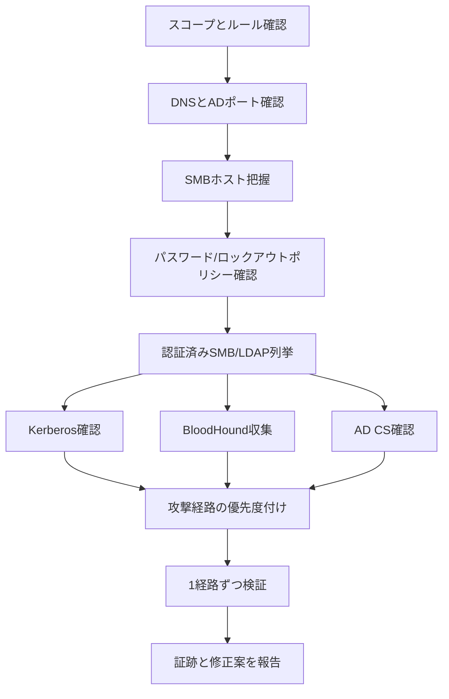

## TL;DR

Active Directory の列挙では、攻撃の前に **何が存在するか、どこに認証できるか、どの経路が重要か** を明確にします。このチェックリストは、許可されたラボまたは診断での利用を前提としています。低負荷な探索、ロックアウトポリシー確認、認証情報検証、BloodHound、AD CS、サービス別確認の順で進めます。

| フェーズ | 目的 | 例 |
|---|---|---|
| スコープ | ドメイン、DC、範囲を記録 | `printf '%s\n' corp.local dc01.corp.local 10.10.10.10` |
| ポート | AD系サービスを確認 | `nmap -Pn -p 53,88,135,139,389,445,464,593,636,3268,3269,5985,5986,1433 --open -iL targets.txt` |
| SMB | ホストとSigning状況 | `nxc smb targets.txt` |
| ポリシー | ロックアウト条件 | `nxc smb <DC_IP> -u '<USER>' -p '<PASS>' --pass-pol` |
| LDAP | ユーザー、グループ、SID | `nxc ldap <DC_IP> -u '<USER>' -p '<PASS>' --users --groups --get-sid` |
| Kerberos | ユーザー名とroast対象 | `kerbrute userenum --dc <DC_IP> -d <DOMAIN> users.txt` |
| BloodHound | 攻撃経路分析 | `bloodhound-python -u '<USER>' -p '<PASS>' -d <DOMAIN> -ns <DC_IP> -c All` |
| AD CS | 証明書サービス確認 | `certipy find -u '<USER>@<DOMAIN>' -p '<PASS>' -dc-ip <DC_IP> -stdout` |
| WinRM | リモート管理確認 | `nxc winrm targets.txt -u '<USER>' -p '<PASS>'` |
| MSSQL | DB経由の足場確認 | `nxc mssql targets.txt -u '<USER>' -p '<PASS>'` |

---

## 列挙フロー



---

## Step 1: スコープと名前を確認する

収集を始める前に、ドメイン名、ドメインコントローラ、対象範囲、許可プロトコル、検証時間、ロックアウト条件を記録します。AD診断での事故は、環境を理解する前にスプレーや広範囲モジュール実行を始めたときに起きやすいです。

| 項目 | 保存する証跡 |
|---|---|
| ドメインFQDN | `corp.local`, `child.corp.local` |
| NetBIOS名 | `CORP` |
| ドメインコントローラ | ホスト名、IP、必要ならSite |
| 対象範囲 | スコープ内CIDRと除外対象 |
| 許可された認証テスト | スプレー、ハッシュ認証、Kerberos、WinRM、MSSQL |
| ロックアウトポリシー | 閾値、リセット時間、観測時間 |

---

## Step 2: AD系サービスを確認する

まずはADに関係するポートに絞ります。フルスキャンは、重要ホストを把握してからで十分です。

```bash
nmap -Pn -n -p 53,88,135,139,389,445,464,593,636,3268,3269,5985,5986,1433 --open -iL targets.txt -oA scans/ad-core
```

| ポート | サービス | 意味 |
|---|---|---|
| 53 | DNS | ドメインとDC解決 |
| 88 / 464 | Kerberos | ユーザー検証、roasting、チケット処理 |
| 135 / 593 | RPC | Endpoint Mapping、管理系の文脈把握 |
| 389 / 636 | LDAP / LDAPS | ディレクトリ列挙、ACL確認 |
| 445 | SMB | ホスト、共有、Signing、管理者確認 |
| 3268 / 3269 | Global Catalog | フォレスト横断のLDAP確認 |
| 5985 / 5986 | WinRM | リモート管理 |
| 1433 | MSSQL | DB経由の足場やリンクサーバー |

---

## Step 3: SMBでホストとSigningを把握する

SMBはホスト把握とリレーリスク確認に向いています。無認証またはGuest確認が許可されている場合はそこから始め、次に認証済み列挙へ進みます。

```bash
nxc smb targets.txt
```

```bash
nxc smb targets.txt --gen-relay-list no_signing_hosts.txt
```

保存すべき情報:

| 情報 | 意味 |
|---|---|
| ドメイン参加ホスト | AD認証が通る場所の把握 |
| OSとビルド | パッチ状況や手法選定 |
| SMB Signing無効 | リレーリスクと修正優先度 |
| Guestアクセス | 共有やRID bruteの可能性 |
| ローカル管理者表示 | 横展開の候補 |

---

## Step 4: パスワードとロックアウトポリシーを確認する

スプレー前に必ず確認します。ポリシーが確認できない場合は、最も保守的に扱い、広範囲の認証試行は避けます。

```bash
nxc smb <DC_IP> -u '<USER>' -p '<PASS>' --pass-pol
```

低リスク寄りのスプレー例:

```bash
nxc smb targets.txt -u users.txt -p '<ONE_PASSWORD>' --gfail-limit 5 --ufail-limit 2 --fail-limit 3 --jitter 2
```

ルールオブエンゲージメントで明示されていない限り、大量ユーザーと大量パスワードの組み合わせは避けます。

---

## Step 5: 有効認証情報でSMB列挙する

認証情報が有効なら、次の行動に直結する情報を集めます。

```bash
nxc smb targets.txt -u '<USER>' -p '<PASS>' --shares
```

```bash
nxc smb <DC_IP> -u '<USER>' -p '<PASS>' --users
```

```bash
nxc smb <DC_IP> -u '<USER>' -p '<PASS>' --groups 'Domain Admins'
```

```bash
nxc smb targets.txt -u '<USER>' -p '<PASS>' --continue-on-success
```

見るべきポイント:

| シグナル | 次の確認 |
|---|---|
| 読み取り可能な `SYSVOL` | ポリシースクリプトや古い資格情報の有無 |
| 独自共有 | 設定ファイル、スクリプト、バックアップ |
| `Pwn3d!` や管理者表示 | 実行権限を慎重に確認 |
| 失敗認証の増加 | 停止して上限を見直す |

---

## Step 6: LDAP列挙

LDAPはホスト単位のSMBより、ドメイン全体の情報を整理して取得しやすいです。ユーザー、グループ、コンピュータ、OU、SID、DCを確認します。

```bash
nxc ldap <DC_IP> -u '<USER>' -p '<PASS>' --users --groups --dc-list --get-sid
```

```bash
nxc ldap <DC_IP> -u '<USER>' -p '<PASS>' --computers
```

```bash
nxc ldap <DC_IP> -u '<USER>' -p '<PASS>' --password-not-required
```

```bash
nxc ldap <DC_IP> -u '<USER>' -p '<PASS>' --trusted-for-delegation
```

グループ名、特権ユーザー、サービスアカウント、委任フラグ、description属性の運用メモを保存します。

---

## Step 7: Kerberos確認

Kerberos列挙では、ユーザー名の有効性、roast可能なアカウント、チケットベースの経路が見えてきます。

```bash
kerbrute userenum --dc <DC_IP> -d <DOMAIN> users.txt
```

```bash
GetNPUsers.py <DOMAIN>/ -usersfile users.txt -dc-ip <DC_IP> -no-pass
```

```bash
GetUserSPNs.py <DOMAIN>/<USER>:'<PASS>' -dc-ip <DC_IP> -request -outputfile kerberoast_hashes.txt
```

これらの出力は、構成リスクの証跡として扱います。スプレーを広げる理由にしない方が安全です。

関連記事:

- [GetNPUsers.py を深掘りしてみた](/ja/posts/tech-getnpusers-asrep-roasting/)
- [GetUserSPNs.py を深掘りしてみた](/ja/posts/tech-getuserspns-kerberoasting/)
- [Kerberos OSCP 攻撃テクニック](/ja/posts/tech-kerberos-oscp-guide/)

---

## Step 8: BloodHound収集

BloodHoundは列挙結果を攻撃経路に変換します。スコープで許可された範囲だけを収集し、収集時刻をメモします。

```bash
bloodhound-python -u '<USER>' -p '<PASS>' -d <DOMAIN> -ns <DC_IP> -c All
```

```bash
nxc ldap <DC_IP> -u '<USER>' -p '<PASS>' --bloodhound -c All
```

優先すべき経路:

| 経路 | 意味 |
|---|---|
| `GenericAll` / `GenericWrite` | オブジェクト制御や資格情報悪用 |
| `AddMember` | グループ昇格 |
| `ForceChangePassword` | アカウント奪取 |
| `CanPSRemote` | WinRM横展開 |
| `AdminTo` | ローカル管理者の広がり |
| `AllowedToDelegate` | Kerberos委任リスク |
| AD CS edges | 証明書ベースの昇格 |

---

## Step 9: AD CS確認

Certificate Services は高影響の昇格経路になりやすいです。登録権限、脆弱テンプレート、ESC8、Manager Approval などを確認します。

```bash
certipy find -u '<USER>@<DOMAIN>' -p '<PASS>' -dc-ip <DC_IP> -stdout
```

```bash
certipy find -u '<USER>@<DOMAIN>' -p '<PASS>' -dc-ip <DC_IP> -vulnerable -enabled -json
```

関連記事:

- [AD CS ESC攻撃まとめ](/ja/posts/tech-adcs-esc-attack-guide/)
- [Certipyを深掘りしてみた](/ja/posts/tech-certipy-adcs-attack/)

---

## Step 10: リモート管理と横展開確認

認証情報が正しいことと、WinRM、SMB実行、MSSQLに入れることは別です。個別に確認します。

```bash
nxc winrm targets.txt -u '<USER>' -p '<PASS>'
```

```bash
nxc smb targets.txt -u '<USER>' -p '<PASS>' -x 'whoami'
```

```bash
nxc mssql targets.txt -u '<USER>' -p '<PASS>'
```

管理者権限や複製権限がある場合は、制御された証跡収集へ進みます。

- [secretsdump.pyガイド](/ja/posts/tech-secretsdump-guide/)
- [Mimikatzコマンドチートシート](/ja/posts/tech-mimikatz-guide/)
- [ラテラルムーブメントまとめ](/ja/posts/tech-lateral-movement-guide/)

---

## 報告用チェックリスト

各発見事項は、防御側が再現して直せる形で保存します。

| 証跡 | 例 |
|---|---|
| 時刻と送信元 | 操作端末、時刻、コマンド |
| 対象 | ホスト名、IP、ドメイン、OU |
| アカウント文脈 | ユーザー、グループ、権限 |
| 証明 | 最小限の出力、スクリーンショット、BloodHound経路、コマンド結果 |
| 影響 | そのアクセスで何が可能か |
| 修正 | ポリシー、ACL、テンプレート、委任、パスワード、監視 |

---

## 関連記事

- [Active Directory 攻撃ロードマップ](/ja/topics/active-directory/)
- [NetExecコマンドチートシート](/ja/posts/tech-netexec-beginner-guide/)
- [BloodHound Attack Pathチートシート](/ja/posts/tech-bloodhound-attack-paths/)
- [ntlmrelayx.pyを深掘りしてみた](/ja/posts/tech-ntlmrelayx-attack-guide/)
- [RBCD 攻撃ガイド](/ja/posts/tech-rbcd-attack-guide/)
- [secretsdump.pyガイド](/ja/posts/tech-secretsdump-guide/)
- [Mimikatzコマンドチートシート](/ja/posts/tech-mimikatz-guide/)
