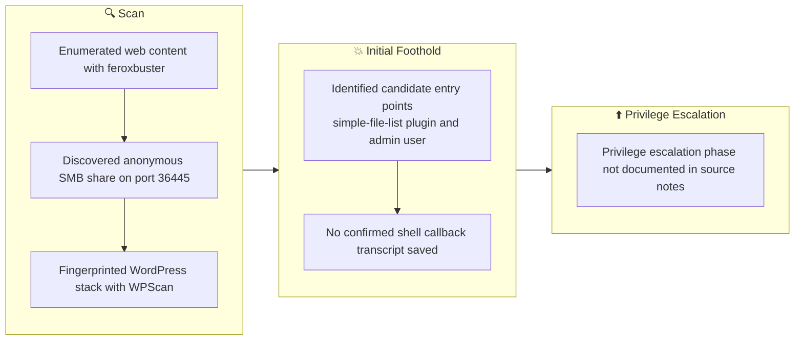

## 概要

| 項目 | 内容 |
|---------------------------|-------|
| OS | Linux |
| 難易度 | 記録なし |
| 攻撃対象 | Web application and exposed network services |
| 主な侵入経路 | Web-based initial access |
| 権限昇格経路 | Local enumeration -> misconfiguration abuse -> root |

## 認証情報

認証情報なし。

## 偵察

---
💡 なぜ有効か  
This stage maps the reachable attack surface and identifies where exploitation is most likely to succeed. Accurate service and content discovery reduces blind testing and drives targeted follow-up actions.

## 初期足がかり

---
攻撃チェーンを進め、次の仮説を検証するために以下のコマンドを実行します。オープンサービス、悪用可否、認証情報の露出、権限境界などの指標を確認します。コマンドとパラメータはそのまま記録し、追試できる形を維持します。

```bash
feroxbuster -w /usr/share/wordlists/seclists/Discovery/Web-Content/common.txt -t 50 -r --timeout 3 --no-state -s 200,301,302,401,403 -x php,html,txt --dont-scan '/(css|fonts?|images?|img)/' -u http://$ip
```

```bash
✅[3:42][CPU:13][MEM:73][TUN0:192.168.45.166][/home/n0z0]
🐉 > feroxbuster -w /usr/share/wordlists/seclists/Discovery/Web-Content/common.txt -t 50 -r --timeout 3 --no-state -s 200,301,302,401,403 -x php,html,txt --dont-scan '/(css|fonts?|images?|img)/' -u http://$ip


 ___  ___  __   __     __      __         __   ___
|__  |__  |__) |__) | /  `    /  \ \_/ | |  \ |__
|    |___ |  \ |  \ | \__,    \__/ / \ | |__/ |___
by Ben "epi" Risher 🤓                 ver: 2.12.0
───────────────────────────┬──────────────────────
 🎯  Target Url            │ http://192.168.178.105
 🚫  Don't Scan Regex      │ /(css|fonts?|images?|img)/
 🚀  Threads               │ 50
 📖  Wordlist              │ /usr/share/wordlists/seclists/Discovery/Web-Content/common.txt
 👌  Status Codes          │ [200, 301, 302, 401, 403]
 💥  Timeout (secs)        │ 3
 🦡  User-Agent            │ feroxbuster/2.12.0
 💉  Config File           │ /etc/feroxbuster/ferox-config.toml
 🔎  Extract Links         │ true
 💲  Extensions            │ [php, html, txt]
 🏁  HTTP methods          │ [GET]
 📍  Follow Redirects      │ true
 🔃  Recursion Depth       │ 4
 🎉  New Version Available │ https://github.com/epi052/feroxbuster/releases/latest
───────────────────────────┴──────────────────────
 🏁  Press [ENTER] to use the Scan Management Menu™
──────────────────────────────────────────────────
200      GET       99l      448w     6193c http://192.168.178.105/wp-login.php
200      GET       53l      438w     9321c http://192.168.178.105/wp-includes/css/
200      GET        0l        0w        0c http://192.168.178.105/wp-content/themes/
200      GET        0l        0w        0c http://192.168.178.105/wp-content/
200      GET        0l        0w        0c http://192.168.178.105/wp-includes/assets/script-loader-packages.php
200      GET       15l       53w      944c http://192.168.178.105/wp-includes/assets/
200      GET        0l        0w        0c http://192.168.178.105/wp-includes/bookmark.php

```

攻撃チェーンを進め、次の仮説を検証するために以下のコマンドを実行します。オープンサービス、悪用可否、認証情報の露出、権限境界などの指標を確認します。コマンドとパラメータはそのまま記録し、追試できる形を維持します。

```bash
smbclient //$ip/Commander -N -m SMB3 -p 36445
```

```bash
❌[3:51][CPU:76][MEM:65][TUN0:192.168.45.166][/home/n0z0]
🐉 > smbclient //$ip/Commander -N -m SMB3 -p 36445
Anonymous login successful
Try "help" to get a list of possible commands.
smb: \> ls
  .                                   D        0  Sat Sep 19 02:19:19 2020
  ..                                  D        0  Sat Aug  3 06:56:45 2024
  .gitignore                          H       15  Sat Sep 19 02:19:19 2020
  README.md                           N      417  Sat Sep 19 02:19:19 2020
  server.py                           N     2552  Sat Sep 19 02:19:19 2020
  requirements.txt                    N      287  Sat Sep 19 02:19:19 2020
  chinook.db                          N   884736  Sat Sep 19 02:19:19 2020

		9738528 blocks of size 1024. 5337108 blocks available
smb: \>

```

攻撃チェーンを進め、次の仮説を検証するために以下のコマンドを実行します。オープンサービス、悪用可否、認証情報の露出、権限境界などの指標を確認します。コマンドとパラメータはそのまま記録し、追試できる形を維持します。

```bash
smbclient //$ip/Commander -N -m SMB3 -p 36445
```

```bash
✅[3:57][CPU:6][MEM:65][TUN0:192.168.45.166][...OSCP/Proving_Ground/Nukem]
🐉 > smbclient //$ip/Commander -N -m SMB3 -p 36445

```


*キャプション：このフェーズで取得したスクリーンショット*

攻撃チェーンを進め、次の仮説を検証するために以下のコマンドを実行します。オープンサービス、悪用可否、認証情報の露出、権限境界などの指標を確認します。コマンドとパラメータはそのまま記録し、追試できる形を維持します。

```bash
wpscan --url http://192.168.178.105/ --disable-tls-checks --enumerate u,t,p
```

```bash
❌[4:10][CPU:3][MEM:71][TUN0:192.168.45.166][/home/n0z0]
🐉 > wpscan --url http://192.168.178.105/ --disable-tls-checks --enumerate u,t,p
_______________________________________________________________
         __          _______   _____
         \ \        / /  __ \ / ____|
          \ \  /\  / /| |__) | (___   ___  __ _ _ __ ®
           \ \/  \/ / |  ___/ \___ \ / __|/ _` | '_ \
            \  /\  /  | |     ____) | (__| (_| | | | |
             \/  \/   |_|    |_____/ \___|\__,_|_| |_|

         WordPress Security Scanner by the WPScan Team
                         Version 3.8.28
       Sponsored by Automattic - https://automattic.com/
       @_WPScan_, @ethicalhack3r, @erwan_lr, @firefart
_______________________________________________________________

[+] URL: http://192.168.178.105/ [192.168.178.105]
[+] Started: Tue Feb 24 04:16:01 2026

Interesting Finding(s):

[+] Headers
 | Interesting Entries:
 |  - Server: Apache/2.4.46 (Unix) PHP/7.4.10
 |  - X-Powered-By: PHP/7.4.10
 | Found By: Headers (Passive Detection)
 | Confidence: 100%

[+] XML-RPC seems to be enabled: http://192.168.178.105/xmlrpc.php
 | Found By: Direct Access (Aggressive Detection)
 | Confidence: 100%
 | References:
 |  - http://codex.wordpress.org/XML-RPC_Pingback_API
 |  - https://www.rapid7.com/db/modules/auxiliary/scanner/http/wordpress_ghost_scanner/
 |  - https://www.rapid7.com/db/modules/auxiliary/dos/http/wordpress_xmlrpc_dos/
 |  - https://www.rapid7.com/db/modules/auxiliary/scanner/http/wordpress_xmlrpc_login/
 |  - https://www.rapid7.com/db/modules/auxiliary/scanner/http/wordpress_pingback_access/

[+] WordPress readme found: http://192.168.178.105/readme.html
 | Found By: Direct Access (Aggressive Detection)
 | Confidence: 100%

[+] Upload directory has listing enabled: http://192.168.178.105/wp-content/uploads/
 | Found By: Direct Access (Aggressive Detection)
 | Confidence: 100%

[+] The external WP-Cron seems to be enabled: http://192.168.178.105/wp-cron.php
 | Found By: Direct Access (Aggressive Detection)
 | Confidence: 60%
 | References:
 |  - https://www.iplocation.net/defend-wordpress-from-ddos
 |  - https://github.com/wpscanteam/wpscan/issues/1299

[+] WordPress version 5.5.1 identified (Insecure, released on 2020-09-01).
 | Found By: Rss Generator (Passive Detection)
 |  - http://192.168.178.105/index.php/feed/, <generator>https://wordpress.org/?v=5.5.1</generator>
 |  - http://192.168.178.105/index.php/comments/feed/, <generator>https://wordpress.org/?v=5.5.1</generator>

[+] WordPress theme in use: news-vibrant
 | Location: http://192.168.178.105/wp-content/themes/news-vibrant/
 | Last Updated: 2024-06-25T00:00:00.000Z
 | Readme: http://192.168.178.105/wp-content/themes/news-vibrant/readme.txt
 | [!] The version is out of date, the latest version is 1.5.2
 | Style URL: http://192.168.178.105/wp-content/themes/news-vibrant/style.css?ver=1.0.1
 | Style Name: News Vibrant
 | Style URI: https://codevibrant.com/wpthemes/news-vibrant
 | Description: News Vibrant is a modern magazine theme with creative design and powerful features that lets you wri...
 | Author: CodeVibrant
 | Author URI: https://codevibrant.com
 |
 | Found By: Css Style In Homepage (Passive Detection)
 |
 | Version: 1.0.12 (80% confidence)
 | Found By: Style (Passive Detection)
 |  - http://192.168.178.105/wp-content/themes/news-vibrant/style.css?ver=1.0.1, Match: 'Version:            1.0.12'

[+] Enumerating Most Popular Plugins (via Passive Methods)
[+] Checking Plugin Versions (via Passive and Aggressive Methods)

[i] Plugin(s) Identified:

[+] simple-file-list
 | Location: http://192.168.178.105/wp-content/plugins/simple-file-list/
 | Last Updated: 2026-01-29T20:30:00.000Z
 | [!] The version is out of date, the latest version is 6.1.18
 |
 | Found By: Urls In Homepage (Passive Detection)
 |
 | Version: 4.2.2 (100% confidence)
 | Found By: Readme - Stable Tag (Aggressive Detection)
 |  - http://192.168.178.105/wp-content/plugins/simple-file-list/readme.txt
 | Confirmed By: Readme - ChangeLog Section (Aggressive Detection)
 |  - http://192.168.178.105/wp-content/plugins/simple-file-list/readme.txt

[+] tutor
 | Location: http://192.168.178.105/wp-content/plugins/tutor/
 | Last Updated: 2026-01-28T10:59:00.000Z
 | [!] The version is out of date, the latest version is 3.9.6
 |
 | Found By: Urls In Homepage (Passive Detection)
 |
 | Version: 1.5.3 (100% confidence)
 | Found By: Readme - Stable Tag (Aggressive Detection)
 |  - http://192.168.178.105/wp-content/plugins/tutor/readme.txt
 | Confirmed By: Readme - ChangeLog Section (Aggressive Detection)
 |  - http://192.168.178.105/wp-content/plugins/tutor/readme.txt

[+] Enumerating Most Popular Themes (via Passive and Aggressive Methods)
 Checking Known Locations - Time: 00:00:09 <========================================================================================> (400 / 400) 100.00% Time: 00:00:09
[+] Checking Theme Versions (via Passive and Aggressive Methods)

[i] Theme(s) Identified:

[+] gaming-mag
 | Location: http://192.168.178.105/wp-content/themes/gaming-mag/
 | Last Updated: 2021-12-29T00:00:00.000Z
 | Readme: http://192.168.178.105/wp-content/themes/gaming-mag/readme.txt
 | [!] The version is out of date, the latest version is 1.0.2
 | [!] Directory listing is enabled
 | Style URL: http://192.168.178.105/wp-content/themes/gaming-mag/style.css
 | Style Name: Gaming Mag
 | Style URI: https://codevibrant.com/wpthemes/gaming-mag
 | Description: Gaming Mag is a child theme of News Vibrant modern magazine WordPress theme, with creative design an...
 | Author: CodeVibrant
 | Author URI: https://codevibrant.com
 |
 | Found By: Urls In Homepage (Passive Detection)
 |
 | Version: 1.0.1 (80% confidence)
 | Found By: Style (Passive Detection)
 |  - http://192.168.178.105/wp-content/themes/gaming-mag/style.css, Match: 'Version:        1.0.1'

[+] news-vibrant
 | Location: http://192.168.178.105/wp-content/themes/news-vibrant/
 | Last Updated: 2024-06-25T00:00:00.000Z
 | Readme: http://192.168.178.105/wp-content/themes/news-vibrant/readme.txt
 | [!] The version is out of date, the latest version is 1.5.2
 | Style URL: http://192.168.178.105/wp-content/themes/news-vibrant/style.css
 | Style Name: News Vibrant
 | Style URI: https://codevibrant.com/wpthemes/news-vibrant
 | Description: News Vibrant is a modern magazine theme with creative design and powerful features that lets you wri...
 | Author: CodeVibrant
 | Author URI: https://codevibrant.com
 |
 | Found By: Urls In Homepage (Passive Detection)
 |
 | Version: 1.0.12 (80% confidence)
 | Found By: Style (Passive Detection)
 |  - http://192.168.178.105/wp-content/themes/news-vibrant/style.css, Match: 'Version:            1.0.12'

[+] twentynineteen
 | Location: http://192.168.178.105/wp-content/themes/twentynineteen/
 | Last Updated: 2025-12-03T00:00:00.000Z
 | Readme: http://192.168.178.105/wp-content/themes/twentynineteen/readme.txt
 | [!] The version is out of date, the latest version is 3.2
 | Style URL: http://192.168.178.105/wp-content/themes/twentynineteen/style.css
 | Style Name: Twenty Nineteen
 | Style URI: https://wordpress.org/themes/twentynineteen/
 | Description: Our 2019 default theme is designed to show off the power of the block editor. It features custom sty...
 | Author: the WordPress team
 | Author URI: https://wordpress.org/
 |
 | Found By: Known Locations (Aggressive Detection)
 |  - http://192.168.178.105/wp-content/themes/twentynineteen/, status: 500
 |
 | Version: 1.7 (80% confidence)
 | Found By: Style (Passive Detection)
 |  - http://192.168.178.105/wp-content/themes/twentynineteen/style.css, Match: 'Version: 1.7'

[+] twentyseventeen
 | Location: http://192.168.178.105/wp-content/themes/twentyseventeen/
 | Last Updated: 2025-12-03T00:00:00.000Z
 | Readme: http://192.168.178.105/wp-content/themes/twentyseventeen/readme.txt
 | [!] The version is out of date, the latest version is 4.0
 | Style URL: http://192.168.178.105/wp-content/themes/twentyseventeen/style.css
 | Style Name: Twenty Seventeen
 | Style URI: https://wordpress.org/themes/twentyseventeen/
 | Description: Twenty Seventeen brings your site to life with header video and immersive featured images. With a fo...
 | Author: the WordPress team
 | Author URI: https://wordpress.org/
 |
 | Found By: Known Locations (Aggressive Detection)
 |  - http://192.168.178.105/wp-content/themes/twentyseventeen/, status: 500
 |
 | Version: 2.4 (80% confidence)
 | Found By: Style (Passive Detection)
 |  - http://192.168.178.105/wp-content/themes/twentyseventeen/style.css, Match: 'Version: 2.4'

[+] twentytwenty
 | Location: http://192.168.178.105/wp-content/themes/twentytwenty/
 | Last Updated: 2025-12-03T00:00:00.000Z
 | Readme: http://192.168.178.105/wp-content/themes/twentytwenty/readme.txt
 | [!] The version is out of date, the latest version is 3.0
 | Style URL: http://192.168.178.105/wp-content/themes/twentytwenty/style.css
 | Style Name: Twenty Twenty
 | Style URI: https://wordpress.org/themes/twentytwenty/
 | Description: Our default theme for 2020 is designed to take full advantage of the flexibility of the block editor...
 | Author: the WordPress team
 | Author URI: https://wordpress.org/
 |
 | Found By: Known Locations (Aggressive Detection)
 |  - http://192.168.178.105/wp-content/themes/twentytwenty/, status: 500
 |
 | Version: 1.5 (80% confidence)
 | Found By: Style (Passive Detection)
 |  - http://192.168.178.105/wp-content/themes/twentytwenty/style.css, Match: 'Version: 1.5'

[+] Enumerating Users (via Passive and Aggressive Methods)
 Brute Forcing Author IDs - Time: 00:00:01 <==========================================================================================> (10 / 10) 100.00% Time: 00:00:01

[i] User(s) Identified:

[+] admin
 | Found By: Author Posts - Author Pattern (Passive Detection)
 | Confirmed By:
 |  Rss Generator (Passive Detection)
 |  Wp Json Api (Aggressive Detection)
 |   - http://192.168.178.105/index.php/wp-json/wp/v2/users/?per_page=100&page=1
 |  Author Id Brute Forcing - Author Pattern (Aggressive Detection)
 |  Login Error Messages (Aggressive Detection)

[!] No WPScan API Token given, as a result vulnerability data has not been output.
[!] You can get a free API token with 25 daily requests by registering at https://wpscan.com/register

[+] Finished: Tue Feb 24 04:16:53 2026
[+] Requests Done: 473
[+] Cached Requests: 19
[+] Data Sent: 128.264 KB
[+] Data Received: 822.126 KB
[+] Memory used: 269.324 MB
[+] Elapsed time: 00:00:51


```

💡 なぜ有効か  
The initial access step chains discovered weaknesses into executable control over the target. Successful foothold techniques are validated by command execution or interactive shell callbacks.

## 権限昇格

---
💡 なぜ有効か  
Privilege escalation relies on local misconfigurations, unsafe permissions, and trusted execution paths. Enumerating and abusing these trust boundaries is the fastest route to root-level access.

## まとめ・学んだこと

- 本番同等の環境でフレームワークのデバッグモードとエラー露出を検証する。
- 特権ユーザーやスケジューラーが実行するスクリプト・バイナリのファイルパーミッションを制限する。
- ワイルドカード展開やスクリプト化可能な特権ツールを避けるため sudo ポリシーを強化する。
- 露出した認証情報と環境ファイルを重要機密として扱う。

### Attack Flow

---
攻撃チェーンを進め、次の仮説を検証するために以下のコマンドを実行します。オープンサービス、悪用可否、認証情報の露出、権限境界などの指標を確認します。コマンドとパラメータはそのまま記録し、追試できる形を維持します。



## 参考文献

- RustScan: https://github.com/RustScan/RustScan
- Nmap: https://nmap.org/
- feroxbuster: https://github.com/epi052/feroxbuster
- Nuclei: https://github.com/projectdiscovery/nuclei
- GTFOBins: https://gtfobins.org/
- HackTricks Privilege Escalation: https://book.hacktricks.wiki/en/linux-hardening/privilege-escalation/index.html
