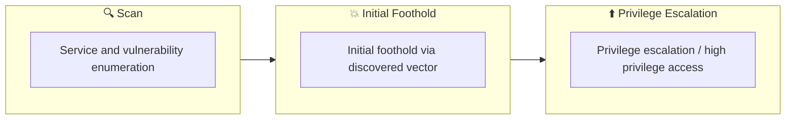

## Overview

| Field                     | Value |
|---------------------------|-------|
| OS                        | Windows |
| Difficulty                | Not specified |
| Attack Surface            | 53/tcp    open     domain, 88/tcp    open     kerberos-sec, 135/tcp   open     msrpc, 139/tcp   open     netbios-ssn, 389/tcp   open     ldap, 445/tcp   open     microsoft-ds |
| Primary Entry Vector      | windows-host, web attack path to foothold |
| Privilege Escalation Path | Local misconfiguration or credential reuse to elevate privileges |

## Reconnaissance

### 1. PortScan

---
## Rustscan

💡 Why this works  
High-quality reconnaissance narrows a large attack surface into a few validated exploitation paths. Accurate service mapping prevents time loss and supports targeted follow-up testing.

## Initial Foothold

### Not implemented (or log not saved)

## Nmap
```bash
nmap -p- -sC -sV -T4 -A -Pn $ip
```

### 2. Local Shell

---

初期列挙で多数のドメインユーザが取得できるため、AS-REP Roasting と BloodHound で攻撃パスを同時に進める構成が有効です。
取得したハッシュをオフラインでクラックし、最初の有効資格情報を WinRM で検証するのが安定します。
後段は DCSync 相当の権限到達を目標に ACL 連鎖を追跡します。

### 実施コマンド（抜粋）
No additional commands saved.

### 実施ログ（統合）

```
✅[0:28][CPU:0][MEM:20][IP:10.10.14.92][/home/n0z0]
🐉 > nmap -p- -sC -sV -T4 -A -Pn $ip
Starting Nmap 7.94SVN ( https://nmap.org ) at 2024-12-28 00:28 JST
Warning: 10.129.112.218 giving up on port because retransmission cap hit (6).
Nmap scan report for 10.129.112.218
Host is up (0.27s latency).
Not shown: 65505 closed tcp ports (reset)
PORT      STATE    SERVICE      VERSION
53/tcp    open     domain       Simple DNS Plus
88/tcp    open     kerberos-sec Microsoft Windows Kerberos (server time: 2024-12-27 15:51:03Z)
135/tcp   open     msrpc        Microsoft Windows RPC
139/tcp   open     netbios-ssn  Microsoft Windows netbios-ssn
389/tcp   open     ldap         Microsoft Windows Active Directory LDAP (Domain: htb.local, Site: Default-First-Site-Name)
445/tcp   open     microsoft-ds Windows Server 2016 Standard 14393 microsoft-ds (workgroup: HTB)
464/tcp   open     kpasswd5?
593/tcp   open     ncacn_http   Microsoft Windows RPC over HTTP 1.0
636/tcp   open     tcpwrapped
3268/tcp  open     ldap         Microsoft Windows Active Directory LDAP (Domain: htb.local, Site: Default-First-Site-Name)
3269/tcp  open     tcpwrapped
4650/tcp  filtered unknown
5985/tcp  open     http         Microsoft HTTPAPI httpd 2.0 (SSDP/UPnP)
|_http-server-header: Microsoft-HTTPAPI/2.0
|_http-title: Not Found
9389/tcp  open     mc-nmf       .NET Message Framing
20767/tcp filtered unknown
24273/tcp filtered unknown
31520/tcp filtered unknown
47001/tcp open     http         Microsoft HTTPAPI httpd 2.0 (SSDP/UPnP)
|_http-title: Not Found
|_http-server-header: Microsoft-HTTPAPI/2.0
49664/tcp open     msrpc        Microsoft Windows RPC
49665/tcp open     msrpc        Microsoft Windows RPC
49666/tcp open     msrpc        Microsoft Windows RPC
49668/tcp open     msrpc        Microsoft Windows RPC
49671/tcp open     msrpc        Microsoft Windows RPC
49676/tcp open     ncacn_http   Microsoft Windows RPC over HTTP 1.0
49677/tcp open     msrpc        Microsoft Windows RPC
49681/tcp open     msrpc        Microsoft Windows RPC
49698/tcp open     msrpc        Microsoft Windows RPC
50030/tcp open     msrpc        Microsoft Windows RPC
56120/tcp filtered unknown
63163/tcp filtered unknown
No exact OS matches for host (If you know what OS is running on it, see https://nmap.org/submit/ ).
TCP/IP fingerprint:
OS:SCAN(V=7.94SVN%E=4%D=12/28%OT=53%CT=1%CU=37706%PV=Y%DS=2%DC=T%G=Y%TM=676
OS:ECBA6%P=x86_64-pc-linux-gnu)SEQ(SP=104%GCD=1%ISR=10A%TI=I%CI=I%II=I%SS=S
OS:%TS=A)OPS(O1=M53CNW8ST11%O2=M53CNW8ST11%O3=M53CNW8NNT11%O4=M53CNW8ST11%O
OS:5=M53CNW8ST11%O6=M53CST11)WIN(W1=2000%W2=2000%W3=2000%W4=2000%W5=2000%W6
OS:=2000)ECN(R=Y%DF=Y%T=80%W=2000%O=M53CNW8NNS%CC=Y%Q=)T1(R=Y%DF=Y%T=80%S=O
OS:%A=S+%F=AS%RD=0%Q=)T2(R=N)T3(R=N)T4(R=Y%DF=Y%T=80%W=0%S=A%A=O%F=R%O=%RD=
OS:0%Q=)T5(R=Y%DF=Y%T=80%W=0%S=Z%A=S+%F=AR%O=%RD=0%Q=)T6(R=Y%DF=Y%T=80%W=0%
OS:S=A%A=O%F=R%O=%RD=0%Q=)T7(R=N)U1(R=Y%DF=N%T=80%IPL=164%UN=0%RIPL=G%RID=G
OS:%RIPCK=G%RUCK=G%RUD=G)IE(R=Y%DFI=N%T=80%CD=Z)

Network Distance: 2 hops
Service Info: Host: FOREST; OS: Windows; CPE: cpe:/o:microsoft:windows

Host script results:
| smb2-security-mode:
|   3:1:1:
|_    Message signing enabled and required
| smb-security-mode:
|   account_used: <blank>
|   authentication_level: user
|   challenge_response: supported
|_  message_signing: required
| smb-os-discovery:
|   OS: Windows Server 2016 Standard 14393 (Windows Server 2016 Standard 6.3)
|   Computer name: FOREST
|   NetBIOS computer name: FOREST\x00
|   Domain name: htb.local
|   Forest name: htb.local
|   FQDN: FOREST.htb.local
|_  System time: 2024-12-27T07:52:28-08:00
| smb2-time:
|   date: 2024-12-27T15:52:29
|_  start_date: 2024-12-26T17:26:08
|_clock-skew: mean: 2h47m06s, deviation: 4h37m08s, median: 7m05s

TRACEROUTE (using port 3306/tcp)
HOP RTT       ADDRESS
1   263.76 ms 10.10.14.1
2   263.92 ms 10.129.112.218

OS and Service detection performed. Please report any incorrect results at https://nmap.org/submit/ .
Nmap done: 1 IP address (1 host up) scanned in 1027.25 seconds
```

SMBのスキャン結果

```
❌[3:31][CPU:0][MEM:10][IP:10.10.14.92][/home/n0z0]
🐉 > enum4linux -a $ip
Starting enum4linux v0.9.1 ( http://labs.portcullis.co.uk/application/enum4linux/ ) on Sat Dec 28 03:31:12 2024

 =========================================( Target Information )=========================================

Target ........... 10.129.102.209
RID Range ........ 500-550,1000-1050
Username ......... ''
Password ......... ''
Known Usernames .. administrator, guest, krbtgt, domain admins, root, bin, none

 ===========================( Enumerating Workgroup/Domain on 10.129.102.209 )===========================

[E] Can't find workgroup/domain

 ===============================( Nbtstat Information for 10.129.102.209 )===============================

Looking up status of 10.129.102.209
No reply from 10.129.102.209

 ==================================( Session Check on 10.129.102.209 )==================================

[+] Server 10.129.102.209 allows sessions using username '', password ''

 ===============================( Getting domain SID for 10.129.102.209 )===============================

Domain Name: HTB
Domain Sid: S-1-5-21-3072663084-364016917-1341370565

[+] Host is part of a domain (not a workgroup)

 ==================================( OS information on 10.129.102.209 )==================================

[E] Can't get OS info with smbclient

[+] Got OS info for 10.129.102.209 from srvinfo:
do_cmd: Could not initialise srvsvc. Error was NT_STATUS_ACCESS_DENIED

 ======================================( Users on 10.129.102.209 )======================================

index: 0x2137 RID: 0x463 acb: 0x00020015 Account: $331000-VK4ADACQNUCA  Name: (null)    Desc: (null)
index: 0xfbc RID: 0x1f4 acb: 0x00000010 Account: Administrator  Name: Administrator     Desc: Built-in account for administering the computer/domain
index: 0x2369 RID: 0x47e acb: 0x00000210 Account: andy  Name: Andy Hislip       Desc: (null)
index: 0xfbe RID: 0x1f7 acb: 0x00000215 Account: DefaultAccount Name: (null)    Desc: A user account managed by the system.
index: 0xfbd RID: 0x1f5 acb: 0x00000215 Account: Guest  Name: (null)    Desc: Built-in account for guest access to the computer/domain
index: 0x2352 RID: 0x478 acb: 0x00000210 Account: HealthMailbox0659cc1  Name: HealthMailbox-EXCH01-010  Desc: (null)
index: 0x234b RID: 0x471 acb: 0x00000210 Account: HealthMailbox670628e  Name: HealthMailbox-EXCH01-003  Desc: (null)
index: 0x234d RID: 0x473 acb: 0x00000210 Account: HealthMailbox6ded678  Name: HealthMailbox-EXCH01-005  Desc: (null)
index: 0x2351 RID: 0x477 acb: 0x00000210 Account: HealthMailbox7108a4e  Name: HealthMailbox-EXCH01-009  Desc: (null)
index: 0x234e RID: 0x474 acb: 0x00000210 Account: HealthMailbox83d6781  Name: HealthMailbox-EXCH01-006  Desc: (null)
index: 0x234c RID: 0x472 acb: 0x00000210 Account: HealthMailbox968e74d  Name: HealthMailbox-EXCH01-004  Desc: (null)
index: 0x2350 RID: 0x476 acb: 0x00000210 Account: HealthMailboxb01ac64  Name: HealthMailbox-EXCH01-008  Desc: (null)
index: 0x234a RID: 0x470 acb: 0x00000210 Account: HealthMailboxc0a90c9  Name: HealthMailbox-EXCH01-002  Desc: (null)
index: 0x2348 RID: 0x46e acb: 0x00000210 Account: HealthMailboxc3d7722  Name: HealthMailbox-EXCH01-Mailbox-Database-1118319013     Desc: (null)
index: 0x2349 RID: 0x46f acb: 0x00000210 Account: HealthMailboxfc9daad  Name: HealthMailbox-EXCH01-001  Desc: (null)
index: 0x234f RID: 0x475 acb: 0x00000210 Account: HealthMailboxfd87238  Name: HealthMailbox-EXCH01-007  Desc: (null)
index: 0xff4 RID: 0x1f6 acb: 0x00000011 Account: krbtgt Name: (null)    Desc: Key Distribution Center Service Account
index: 0x2360 RID: 0x47a acb: 0x00000210 Account: lucinda       Name: Lucinda Berger    Desc: (null)
index: 0x236a RID: 0x47f acb: 0x00000210 Account: mark  Name: Mark Brandt       Desc: (null)
index: 0x236b RID: 0x480 acb: 0x00000210 Account: santi Name: Santi Rodriguez   Desc: (null)
index: 0x235c RID: 0x479 acb: 0x00000210 Account: sebastien     Name: Sebastien Caron   Desc: (null)
index: 0x215a RID: 0x468 acb: 0x00020011 Account: SM_1b41c9286325456bb  Name: Microsoft Exchange Migration      Desc: (null)
index: 0x2161 RID: 0x46c acb: 0x00020011 Account: SM_1ffab36a2f5f479cb  Name: SystemMailbox{8cc370d3-822a-4ab8-a926-bb94bd0641a9}  Desc: (null)
index: 0x2156 RID: 0x464 acb: 0x00020011 Account: SM_2c8eef0a09b545acb  Name: Microsoft Exchange Approval AssistantDesc: (null)
index: 0x2159 RID: 0x467 acb: 0x00020011 Account: SM_681f53d4942840e18  Name: Discovery Search Mailbox  Desc: (null)
index: 0x2158 RID: 0x466 acb: 0x00020011 Account: SM_75a538d3025e4db9a  Name: Microsoft Exchange        Desc: (null)
index: 0x215c RID: 0x46a acb: 0x00020011 Account: SM_7c96b981967141ebb  Name: E4E Encryption Store - Active     Desc: (null)
index: 0x215b RID: 0x469 acb: 0x00020011 Account: SM_9b69f1b9d2cc45549  Name: Microsoft Exchange Federation MailboxDesc: (null)
index: 0x215d RID: 0x46b acb: 0x00020011 Account: SM_c75ee099d0a64c91b  Name: Microsoft Exchange        Desc: (null)
index: 0x2157 RID: 0x465 acb: 0x00020011 Account: SM_ca8c2ed5bdab4dc9b  Name: Microsoft Exchange        Desc: (null)
index: 0x2365 RID: 0x47b acb: 0x00010210 Account: svc-alfresco  Name: svc-alfresco      Desc: (null)

user:[Administrator] rid:[0x1f4]
user:[Guest] rid:[0x1f5]
user:[krbtgt] rid:[0x1f6]
user:[DefaultAccount] rid:[0x1f7]
user:[$331000-VK4ADACQNUCA] rid:[0x463]
user:[SM_2c8eef0a09b545acb] rid:[0x464]
user:[SM_ca8c2ed5bdab4dc9b] rid:[0x465]
user:[SM_75a538d3025e4db9a] rid:[0x466]
user:[SM_681f53d4942840e18] rid:[0x467]
user:[SM_1b41c9286325456bb] rid:[0x468]
user:[SM_9b69f1b9d2cc45549] rid:[0x469]
user:[SM_7c96b981967141ebb] rid:[0x46a]
user:[SM_c75ee099d0a64c91b] rid:[0x46b]
user:[SM_1ffab36a2f5f479cb] rid:[0x46c]
user:[HealthMailboxc3d7722] rid:[0x46e]
user:[HealthMailboxfc9daad] rid:[0x46f]
user:[HealthMailboxc0a90c9] rid:[0x470]
user:[HealthMailbox670628e] rid:[0x471]
user:[HealthMailbox968e74d] rid:[0x472]
user:[HealthMailbox6ded678] rid:[0x473]
user:[HealthMailbox83d6781] rid:[0x474]
user:[HealthMailboxfd87238] rid:[0x475]
user:[HealthMailboxb01ac64] rid:[0x476]
user:[HealthMailbox7108a4e] rid:[0x477]
user:[HealthMailbox0659cc1] rid:[0x478]
user:[sebastien] rid:[0x479]
user:[lucinda] rid:[0x47a]
user:[svc-alfresco] rid:[0x47b]
user:[andy] rid:[0x47e]
user:[mark] rid:[0x47f]
user:[santi] rid:[0x480]

 ================================( Share Enumeration on 10.129.102.209 )================================

do_connect: Connection to 10.129.102.209 failed (Error NT_STATUS_RESOURCE_NAME_NOT_FOUND)

        Sharename       Type      Comment
        ---------       ----      -------
Reconnecting with SMB1 for workgroup listing.
Unable to connect with SMB1 -- no workgroup available

[+] Attempting to map shares on 10.129.102.209

 ===========================( Password Policy Information for 10.129.102.209 )===========================

[+] Attaching to 10.129.102.209 using a NULL share

[+] Trying protocol 139/SMB...

        [!] Protocol failed: Cannot request session (Called Name:10.129.102.209)

[+] Trying protocol 445/SMB...

[+] Found domain(s):

        [+] HTB
        [+] Builtin

[+] Password Info for Domain: HTB

        [+] Minimum password length: 7
        [+] Password history length: 24
        [+] Maximum password age: Not Set
        [+] Password Complexity Flags: 000000

                [+] Domain Refuse Password Change: 0
                [+] Domain Password Store Cleartext: 0
                [+] Domain Password Lockout Admins: 0
                [+] Domain Password No Clear Change: 0
                [+] Domain Password No Anon Change: 0
                [+] Domain Password Complex: 0

        [+] Minimum password age: 1 day 4 minutes
        [+] Reset Account Lockout Counter: 30 minutes
        [+] Locked Account Duration: 30 minutes
        [+] Account Lockout Threshold: None
        [+] Forced Log off Time: Not Set

[+] Retieved partial password policy with rpcclient:

Password Complexity: Disabled
Minimum Password Length: 7

 ======================================( Groups on 10.129.102.209 )======================================

[+] Getting builtin groups:

group:[Account Operators] rid:[0x224]
group:[Pre-Windows 2000 Compatible Access] rid:[0x22a]
group:[Incoming Forest Trust Builders] rid:[0x22d]
group:[Windows Authorization Access Group] rid:[0x230]
group:[Terminal Server License Servers] rid:[0x231]
group:[Administrators] rid:[0x220]
group:[Users] rid:[0x221]
group:[Guests] rid:[0x222]
group:[Print Operators] rid:[0x226]
group:[Backup Operators] rid:[0x227]
group:[Replicator] rid:[0x228]
group:[Remote Desktop Users] rid:[0x22b]
group:[Network Configuration Operators] rid:[0x22c]
group:[Performance Monitor Users] rid:[0x22e]
group:[Performance Log Users] rid:[0x22f]
group:[Distributed COM Users] rid:[0x232]
group:[IIS_IUSRS] rid:[0x238]
group:[Cryptographic Operators] rid:[0x239]
group:[Event Log Readers] rid:[0x23d]
group:[Certificate Service DCOM Access] rid:[0x23e]
group:[RDS Remote Access Servers] rid:[0x23f]
group:[RDS Endpoint Servers] rid:[0x240]
group:[RDS Management Servers] rid:[0x241]
group:[Hyper-V Administrators] rid:[0x242]
group:[Access Control Assistance Operators] rid:[0x243]
group:[Remote Management Users] rid:[0x244]
group:[System Managed Accounts Group] rid:[0x245]
group:[Storage Replica Administrators] rid:[0x246]
group:[Server Operators] rid:[0x225]

[+]  Getting builtin group memberships:

Group: Administrators' (RID: 544) has member: Couldn't lookup SIDs
Group: Guests' (RID: 546) has member: Couldn't lookup SIDs
Group: Users' (RID: 545) has member: Couldn't lookup SIDs
Group: System Managed Accounts Group' (RID: 581) has member: Couldn't lookup SIDs
Group: Account Operators' (RID: 548) has member: Couldn't lookup SIDs
Group: Pre-Windows 2000 Compatible Access' (RID: 554) has member: Couldn't lookup SIDs
Group: IIS_IUSRS' (RID: 568) has member: Couldn't lookup SIDs
Group: Remote Management Users' (RID: 580) has member: Couldn't lookup SIDs
Group: Windows Authorization Access Group' (RID: 560) has member: Couldn't lookup SIDs

[+]  Getting local groups:

group:[Cert Publishers] rid:[0x205]
group:[RAS and IAS Servers] rid:[0x229]
group:[Allowed RODC Password Replication Group] rid:[0x23b]
group:[Denied RODC Password Replication Group] rid:[0x23c]
group:[DnsAdmins] rid:[0x44d]

[+]  Getting local group memberships:

Group: Denied RODC Password Replication Group' (RID: 572) has member: Couldn't lookup SIDs

[+]  Getting domain groups:

group:[Enterprise Read-only Domain Controllers] rid:[0x1f2]
group:[Domain Admins] rid:[0x200]
group:[Domain Users] rid:[0x201]
group:[Domain Guests] rid:[0x202]
group:[Domain Computers] rid:[0x203]
group:[Domain Controllers] rid:[0x204]
group:[Schema Admins] rid:[0x206]
group:[Enterprise Admins] rid:[0x207]
group:[Group Policy Creator Owners] rid:[0x208]
group:[Read-only Domain Controllers] rid:[0x209]
group:[Cloneable Domain Controllers] rid:[0x20a]
group:[Protected Users] rid:[0x20d]
group:[Key Admins] rid:[0x20e]
group:[Enterprise Key Admins] rid:[0x20f]
group:[DnsUpdateProxy] rid:[0x44e]
group:[Organization Management] rid:[0x450]
group:[Recipient Management] rid:[0x451]
group:[View-Only Organization Management] rid:[0x452]
group:[Public Folder Management] rid:[0x453]
group:[UM Management] rid:[0x454]
group:[Help Desk] rid:[0x455]
group:[Records Management] rid:[0x456]
group:[Discovery Management] rid:[0x457]
group:[Server Management] rid:[0x458]
group:[Delegated Setup] rid:[0x459]
group:[Hygiene Management] rid:[0x45a]
group:[Compliance Management] rid:[0x45b]
group:[Security Reader] rid:[0x45c]
group:[Security Administrator] rid:[0x45d]
group:[Exchange Servers] rid:[0x45e]
group:[Exchange Trusted Subsystem] rid:[0x45f]
group:[Managed Availability Servers] rid:[0x460]
group:[Exchange Windows Permissions] rid:[0x461]
group:[ExchangeLegacyInterop] rid:[0x462]
group:[$D31000-NSEL5BRJ63V7] rid:[0x46d]
group:[Service Accounts] rid:[0x47c]
group:[Privileged IT Accounts] rid:[0x47d]
group:[test] rid:[0x13ed]

[+]  Getting domain group memberships:

Group: 'Domain Users' (RID: 513) has member: HTB\Administrator
Group: 'Domain Users' (RID: 513) has member: HTB\DefaultAccount
Group: 'Domain Users' (RID: 513) has member: HTB\krbtgt
Group: 'Domain Users' (RID: 513) has member: HTB\$331000-VK4ADACQNUCA
Group: 'Domain Users' (RID: 513) has member: HTB\SM_2c8eef0a09b545acb
Group: 'Domain Users' (RID: 513) has member: HTB\SM_ca8c2ed5bdab4dc9b
Group: 'Domain Users' (RID: 513) has member: HTB\SM_75a538d3025e4db9a
Group: 'Domain Users' (RID: 513) has member: HTB\SM_681f53d4942840e18
Group: 'Domain Users' (RID: 513) has member: HTB\SM_1b41c9286325456bb
Group: 'Domain Users' (RID: 513) has member: HTB\SM_9b69f1b9d2cc45549
Group: 'Domain Users' (RID: 513) has member: HTB\SM_7c96b981967141ebb
Group: 'Domain Users' (RID: 513) has member: HTB\SM_c75ee099d0a64c91b
Group: 'Domain Users' (RID: 513) has member: HTB\SM_1ffab36a2f5f479cb
Group: 'Domain Users' (RID: 513) has member: HTB\HealthMailboxc3d7722
Group: 'Domain Users' (RID: 513) has member: HTB\HealthMailboxfc9daad
Group: 'Domain Users' (RID: 513) has member: HTB\HealthMailboxc0a90c9
Group: 'Domain Users' (RID: 513) has member: HTB\HealthMailbox670628e
Group: 'Domain Users' (RID: 513) has member: HTB\HealthMailbox968e74d
Group: 'Domain Users' (RID: 513) has member: HTB\HealthMailbox6ded678
Group: 'Domain Users' (RID: 513) has member: HTB\HealthMailbox83d6781
Group: 'Domain Users' (RID: 513) has member: HTB\HealthMailboxfd87238
Group: 'Domain Users' (RID: 513) has member: HTB\HealthMailboxb01ac64
Group: 'Domain Users' (RID: 513) has member: HTB\HealthMailbox7108a4e
Group: 'Domain Users' (RID: 513) has member: HTB\HealthMailbox0659cc1
Group: 'Domain Users' (RID: 513) has member: HTB\sebastien
Group: 'Domain Users' (RID: 513) has member: HTB\lucinda
Group: 'Domain Users' (RID: 513) has member: HTB\svc-alfresco
Group: 'Domain Users' (RID: 513) has member: HTB\andy
Group: 'Domain Users' (RID: 513) has member: HTB\mark
Group: 'Domain Users' (RID: 513) has member: HTB\santi
Group: 'Exchange Windows Permissions' (RID: 1121) has member: HTB\Exchange Trusted Subsystem
Group: 'Enterprise Admins' (RID: 519) has member: HTB\Administrator
Group: 'Domain Admins' (RID: 512) has member: HTB\Administrator
Group: 'Schema Admins' (RID: 518) has member: HTB\Administrator
Group: 'Managed Availability Servers' (RID: 1120) has member: HTB\EXCH01$
Group: 'Managed Availability Servers' (RID: 1120) has member: HTB\Exchange Servers
Group: 'Delegated Setup' (RID: 1113) has member: Could not connect to server 10.129.102.209
Group: 'Delegated Setup' (RID: 1113) has member: Connection failed: NT_STATUS_IO_TIMEOUT
Group: 'Organization Management' (RID: 1104) has member: HTB\Administrator
Group: 'Service Accounts' (RID: 1148) has member: HTB\svc-alfresco
Group: 'Domain Guests' (RID: 514) has member: HTB\Guest
Group: 'Domain Computers' (RID: 515) has member: HTB\EXCH01$
Group: 'Privileged IT Accounts' (RID: 1149) has member: HTB\Service Accounts
Group: 'Group Policy Creator Owners' (RID: 520) has member: HTB\Administrator
Group: '$D31000-NSEL5BRJ63V7' (RID: 1133) has member: HTB\EXCH01$
Group: 'Domain Controllers' (RID: 516) has member: HTB\FOREST$
Group: 'Exchange Trusted Subsystem' (RID: 1119) has member: HTB\EXCH01$
Group: 'Exchange Servers' (RID: 1118) has member: HTB\EXCH01$
Group: 'Exchange Servers' (RID: 1118) has member: HTB\$D31000-NSEL5BRJ63V7

 =================( Users on 10.129.102.209 via RID cycling (RIDS: 500-550,1000-1050) )=================

[E] Couldn't get SID: NT_STATUS_ACCESS_DENIED.  RID cycling not possible.

 ==============================( Getting printer info for 10.129.102.209 )==============================

do_cmd: Could not initialise spoolss. Error was NT_STATUS_ACCESS_DENIED

enum4linux complete on Sat Dec 28 03:40:43 2024
```

### Not implemented (or log not saved)

No additional logs saved.

💡 Why this works  
Initial access succeeds when enumeration findings are turned into a practical exploit chain. Capturing credentials, file disclosure, or direct RCE creates reliable pivot points for privilege escalation.

## Privilege Escalation

### 3.Privilege Escalation

---

Extracting commands related to privilege escalation steps. Please add confirmation logs such as `whoami /all` and `sudo -l` as necessary.

💡 Why this works  
Privilege escalation depends on chaining local weaknesses such as sudo misconfiguration, weak file permissions, or credential reuse. If a GTFOBins technique is used, the mechanism is that an allowed binary executes a child process or shell without dropping elevated effective privileges.

## Credentials

```text
Domain: htb.local
Enumerated domain users: sebastien, lucinda, andy, mark, santi, svc-alfresco
No cracked credential was explicitly recorded in the source export.
```

## Lessons Learned / Key Takeaways

### 4.Overview

---




## References

- nmap
- rustscan
- sudo
- find
- GTFOBins
