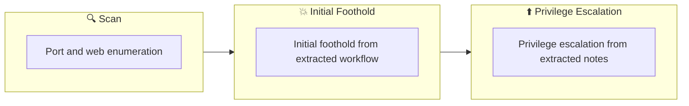

## Overview

| Field                     | Value |
|---------------------------|-------|
| OS                        | Windows |
| Difficulty                | Not specified |
| Attack Surface            | 22/tcp  open  ssh, 80/tcp  open  http, 139/tcp open  netbios-ssn, 445/tcp open  netbios-ssn |
| Primary Entry Vector      | web, ssh attack path to foothold |
| Privilege Escalation Path | Local misconfiguration or credential reuse to elevate privileges |

## Reconnaissance

### 1. PortScan

---
## Rustscan

💡 Why this works  
High-quality reconnaissance narrows a large attack surface into a few validated exploitation paths. Accurate service mapping prevents time loss and supports targeted follow-up testing.

## Initial Foothold

### Not implemented (not recorded in PDF)


## Nmap


### Not implemented (not recorded in PDF)


### 2. Local Shell

---

PDFメモから抽出した主要コマンドと要点を整理しています。必要に応じて後続で詳細追記してください。

### 実行コマンド（抽出）
```bash
python3 ~/tool/search.py
ftp                     [Status: 500, Size: 251, Words: 12, Lines: 12, Duration: 263ms]
wpscan --url http://blog.thm --passwords /usr/share/wordlists/rockyou.txt
msfconsole
Name                                              Disclosure Date  Rank       Check  Description
```

### 抽出画像

画像抽出なし（PDF内に有効な埋め込み画像なし）

### 抽出メモ（先頭120行）
```bash
blog
July 2, 2023 1:37

#1
Start exploring right away
I can see from the ffuf results that I am using wordpress.
┌──(n0z0㉿kali)-[~/work/thm/blog]
└─$ python3 ~/tool/search.py
/'___\  /'___\           /'___\
/\ \__/ /\ \__/  __  __  /\ \__/
\ \ ,__\\ \ ,__\/\ \/\ \ \ \ ,__\
\ \ \_/ \ \ \_/\ \ \_\ \ \ \ \_/
\ \_\   \ \_\  \ \____/  \ \_\
\/_/    \/_/   \/___/    \/_/
v1.5.0 Kali Exclusive <3
________________________________________________
:: Method           : GET
:: URL              : http://10.10.128.61/FUZZ
:: Wordlist         : FUZZ: /home/n0z0/SecLists/Discovery/Web-Content/common.txt
:: Follow redirects : false
:: Calibration      : false
:: Timeout          : 10
:: Threads          : 40
:: Matcher          : Response status: 200,204,301,302,307,401,403,405,500
________________________________________________
:: Progress: [1078/4715] :: Job [1/1] :: 2 req/sec :: Duration: [0:02:27] :: Errors: 110 ::=== nmap results ===
Starting Nmap 7.93 ( https://nmap.org ) at 2023-07-01 23:21 JST
Nmap scan report for blog.thm (10.10.128.61)
Host is up (0.28s latency).
Not shown: 996 closed tcp ports (conn-refused)
PORT    STATE SERVICE     VERSION
22/tcp  open  ssh         OpenSSH 7.6p1 Ubuntu 4ubuntu0.3 (Ubuntu Linux; protocol 2.0)
| ssh-hostkey:
|   2048 578ada90baed3a470c05a3f7a80a8d78 (RSA)
|   256 c264efabb19a1c87587c4bd50f204626 (ECDSA)
|_  256 5af26292118ead8a9b23822dad53bc16 (ED25519)
80/tcp  open  http        Apache httpd 2.4.29
|_http-title: Billy Joel&#039;s IT Blog &#8211; The IT blog
|_http-generator: WordPress 5.0
139/tcp open  netbios-ssn Samba smbd 3.X - 4.X (workgroup: WORKGROUP)
445/tcp open  netbios-ssn Samba smbd 4.7.6-Ubuntu (workgroup: WORKGROUP)
Service Info: Host: BLOG; OS: Linux; CPE: cpe:/o:linux:linux_kernel
Host script results:
| smb-security-mode:
|   account_used: guest
|   authentication_level: user
|   challenge_response: supported
|_  message_signing: disabled (dangerous, but default)
| smb2-time:
|   date: 2023-07-01T14:22:29
|_  start_date: N/A
|_nbstat: NetBIOS name: BLOG, NetBIOS user: <unknown>, NetBIOS MAC: 000000000000 (Xerox)
| smb2-security-mode:
|   311:
|_    Message signing enabled but not required
| smb-os-discovery:
|   OS: Windows 6.1 (Samba 4.7.6-Ubuntu)
|   Computer name: blog
|   NetBIOS computer name: BLOG\x00
|   Domain name: \x00
|   FQDN: blog
|_  System time: 2023-07-01T14:22:29+00:00
|_clock-skew: mean: -2s, deviation: 1s, median: -3s
OneNote
1/13
Service detection performed. Please report any incorrect results at https://nmap.org/submit/ .
Nmap done: 1 IP address (1 host up) scanned in 147.95 seconds
:: Progress: [4715/4715] :: Job [1/1] :: 3 req/sec :: Duration: [0:19:20] :: Errors: 1016 ::
=== ffuf results ===
.hta                    [Status: 403, Size: 277, Words: 20, Lines: 10, Duration: 266ms]
.htaccess               [Status: 403, Size: 277, Words: 20, Lines: 10, Duration: 1651ms]
.htpasswd               [Status: 403, Size: 277, Words: 20, Lines: 10, Duration: 3791ms]
0                       [Status: 301, Size: 0, Words: 1, Lines: 1, Duration: 1367ms]
2020                    [Status: 301, Size: 0, Words: 1, Lines: 1, Duration: 1481ms]
admin                   [Status: 302, Size: 0, Words: 1, Lines: 1, Duration: 1445ms]
atom                    [Status: 301, Size: 0, Words: 1, Lines: 1, Duration: 1136ms]
failed                  [Status: 500, Size: 251, Words: 12, Lines: 12, Duration: 8123ms]
fake                    [Status: 500, Size: 251, Words: 12, Lines: 12, Duration: 7598ms]
externalid              [Status: 500, Size: 251, Words: 12, Lines: 12, Duration: 5984ms]
faq                     [Status: 500, Size: 251, Words: 12, Lines: 12, Duration: 5571ms]
favicon.ico             [Status: 200, Size: 0, Words: 1, Lines: 1, Duration: 5179ms]
family                  [Status: 500, Size: 251, Words: 12, Lines: 12, Duration: 6406ms]
externalization         [Status: 500, Size: 251, Words: 12, Lines: 12, Duration: 5180ms]
favorite                [Status: 500, Size: 251, Words: 12, Lines: 12, Duration: 5125ms]
failure                 [Status: 500, Size: 251, Words: 12, Lines: 12, Duration: 5876ms]
extern                  [Status: 500, Size: 251, Words: 12, Lines: 12, Duration: 5959ms]
fashion                 [Status: 500, Size: 251, Words: 12, Lines: 12, Duration: 4679ms]
externalisation         [Status: 500, Size: 251, Words: 12, Lines: 12, Duration: 4675ms]
external                [Status: 500, Size: 251, Words: 12, Lines: 12, Duration: 5170ms]
extranet                [Status: 500, Size: 251, Words: 12, Lines: 12, Duration: 4013ms]
extra                   [Status: 500, Size: 251, Words: 12, Lines: 12, Duration: 4031ms]
fb                      [Status: 500, Size: 251, Words: 12, Lines: 12, Duration: 3549ms]
faqs                    [Status: 500, Size: 251, Words: 12, Lines: 12, Duration: 4698ms]
fail                    [Status: 500, Size: 251, Words: 12, Lines: 12, Duration: 321ms]
fbook                   [Status: 500, Size: 251, Words: 12, Lines: 12, Duration: 3129ms]
extensions              [Status: 500, Size: 251, Words: 12, Lines: 12, Duration: 8655ms]
fcategory               [Status: 500, Size: 251, Words: 12, Lines: 12, Duration: 2163ms]
fc                      [Status: 500, Size: 251, Words: 12, Lines: 12, Duration: 2775ms]
ezsqliteadmin           [Status: 500, Size: 251, Words: 12, Lines: 12, Duration: 2534ms]
ezshopper               [Status: 500, Size: 251, Words: 12, Lines: 12, Duration: 2845ms]
f                       [Status: 500, Size: 251, Words: 12, Lines: 12, Duration: 2357ms]
fcgi                    [Status: 500, Size: 251, Words: 12, Lines: 12, Duration: 1572ms]
fabric                  [Status: 500, Size: 251, Words: 12, Lines: 12, Duration: 1836ms]
fcgi-bin                [Status: 500, Size: 251, Words: 12, Lines: 12, Duration: 1521ms]
face                    [Status: 500, Size: 251, Words: 12, Lines: 12, Duration: 1521ms]
fck                     [Status: 500, Size: 251, Words: 12, Lines: 12, Duration: 1225ms]
faces                   [Status: 500, Size: 251, Words: 12, Lines: 12, Duration: 984ms]
facebook                [Status: 500, Size: 251, Words: 12, Lines: 12, Duration: 1518ms]
facts                   [Status: 500, Size: 251, Words: 12, Lines: 12, Duration: 957ms]
fckeditor               [Status: 500, Size: 251, Words: 12, Lines: 12, Duration: 724ms]
faculty                 [Status: 500, Size: 251, Words: 12, Lines: 12, Duration: 590ms]
features                [Status: 500, Size: 251, Words: 12, Lines: 12, Duration: 325ms]
featured                [Status: 500, Size: 251, Words: 12, Lines: 12, Duration: 327ms]
feature                 [Status: 500, Size: 251, Words: 12, Lines: 12, Duration: 451ms]
fancybox                [Status: 500, Size: 251, Words: 12, Lines: 12, Duration: 6358ms]
federation/clients      [Status: 500, Size: 251, Words: 12, Lines: 12, Duration: 336ms]
feed                    [Status: 500, Size: 251, Words: 12, Lines: 12, Duration: 335ms]
fedora                  [Status: 500, Size: 251, Words: 12, Lines: 12, Duration: 335ms]
feedback                [Status: 500, Size: 251, Words: 12, Lines: 12, Duration: 332ms]
favorites               [Status: 500, Size: 251, Words: 12, Lines: 12, Duration: 5015ms]
```

### Not implemented (not recorded in PDF)


💡 Why this works  
Initial access succeeds when enumeration findings are turned into a practical exploit chain. Capturing credentials, file disclosure, or direct RCE creates reliable pivot points for privilege escalation.

## Privilege Escalation

### 3.Privilege Escalation

---

Privilege elevation related commands extracted from PDF memo.

💡 Why this works  
Privilege escalation depends on chaining local weaknesses such as sudo misconfiguration, weak file permissions, or credential reuse. If a GTFOBins technique is used, the mechanism is that an allowed binary executes a child process or shell without dropping elevated effective privileges.

## Credentials

```text
┌──(n0z0㉿kali)-[~/work/thm/blog]
└─$ python3 ~/tool/search.py
\/_/    \/_/   \/___/    \/_/
:: URL              : http://10.10.128.61/FUZZ
:: Wordlist         : FUZZ: /home/n0z0/SecLists/Discovery/Web-Content/common.txt
:: Progress: [1078/4715] :: Job [1/1] :: 2 req/sec :: Duration: [0:02:27] :: Errors: 110 ::=== nmap results ===
22/tcp  open  ssh         OpenSSH 7.6p1 Ubuntu 4ubuntu0.3 (Ubuntu Linux; protocol 2.0)
80/tcp  open  http        Apache httpd 2.4.29
139/tcp open  netbios-ssn Samba smbd 3.X - 4.X (workgroup: WORKGROUP)
445/tcp open  netbios-ssn Samba smbd 4.7.6-Ubuntu (workgroup: WORKGROUP)
|_nbstat: NetBIOS name: BLOG, NetBIOS user: <unknown>, NetBIOS MAC: 000000000000 (Xerox)
2026/02/27 18:44
Service detection performed. Please report any incorrect results at https://nmap.org/submit/ .
:: Progress: [4715/4715] :: Job [1/1] :: 3 req/sec :: Duration: [0:19:20] :: Errors: 1016 ::
.htpasswd               [Status: 403, Size: 277, Words: 20, Lines: 10, Duration: 3791ms]
federation/clients      [Status: 500, Size: 251, Words: 12, Lines: 12, Duration: 336ms]
forgot-password         [Status: 500, Size: 251, Words: 12, Lines: 12, Duration: 318ms]
forgotpassword          [Status: 500, Size: 251, Words: 12, Lines: 12, Duration: 358ms]
forgot_password         [Status: 500, Size: 251, Words: 12, Lines: 12, Duration: 5339ms]
```

## Lessons Learned / Key Takeaways

### 4.Overview

---




## References

- nmap
- rustscan
- ssh
- GTFOBins
